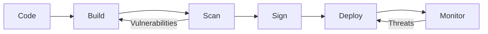

Essential security patterns for production Kubernetes clusters: RBAC, network policies, pod security, and secrets management.

<!-- truncate -->

## Introduction

Security in Kubernetes isn't a single feature—it's a combination of configurations, policies, and practices that work together to protect your workloads. Here's what we've learned running production clusters at scale.

## 1. Role-Based Access Control (RBAC)

### Principle of Least Privilege

```yaml
apiVersion: rbac.authorization.k8s.io/v1
kind: Role
metadata:
  namespace: production
  name: pod-reader
rules:
- apiGroups: [""]
  resources: ["pods", "pods/log"]
  verbs: ["get", "list", "watch"]
---
apiVersion: rbac.authorization.k8s.io/v1
kind: RoleBinding
metadata:
  name: read-pods
  namespace: production
subjects:
- kind: ServiceAccount
  name: monitoring-sa
  namespace: production
roleRef:
  kind: Role
  name: pod-reader
  apiGroup: rbac.authorization.k8s.io
```

### RBAC Audit Checklist

- [ ] No cluster-admin for applications
- [ ] Separate service accounts per workload
- [ ] Regular access reviews
- [ ] Audit logging enabled

## 2. Network Policies

By default, pods can communicate with any other pod. Lock this down:

```yaml
apiVersion: networking.k8s.io/v1
kind: NetworkPolicy
metadata:
  name: api-network-policy
  namespace: production
spec:
  podSelector:
    matchLabels:
      app: api
  policyTypes:
  - Ingress
  - Egress
  ingress:
  - from:
    - podSelector:
        matchLabels:
          app: frontend
    ports:
    - protocol: TCP
      port: 8080
  egress:
  - to:
    - podSelector:
        matchLabels:
          app: database
    ports:
    - protocol: TCP
      port: 5432
```

## 3. Pod Security Standards

### Restricted Security Context

```yaml
apiVersion: v1
kind: Pod
metadata:
  name: secure-pod
spec:
  securityContext:
    runAsNonRoot: true
    runAsUser: 1000
    fsGroup: 2000
    seccompProfile:
      type: RuntimeDefault
  containers:
  - name: app
    image: myapp:latest
    securityContext:
      allowPrivilegeEscalation: false
      readOnlyRootFilesystem: true
      capabilities:
        drop:
        - ALL
    resources:
      limits:
        memory: "128Mi"
        cpu: "500m"
      requests:
        memory: "64Mi"
        cpu: "250m"
```

## 4. Secrets Management

:::warning Never Do This
Don't store secrets in ConfigMaps, environment variables in pod specs, or commit them to Git.
:::

### External Secrets Operator

```yaml
apiVersion: external-secrets.io/v1beta1
kind: ExternalSecret
metadata:
  name: database-credentials
spec:
  refreshInterval: 1h
  secretStoreRef:
    kind: ClusterSecretStore
    name: vault-backend
  target:
    name: db-secret
    creationPolicy: Owner
  data:
  - secretKey: password
    remoteRef:
      key: production/database
      property: password
```

## 5. Image Security

| Practice | Tool | Frequency |
|----------|------|-----------|
| Vulnerability scanning | Trivy, Snyk | Every build |
| Image signing | Cosign, Notary | Every push |
| Base image updates | Dependabot | Weekly |
| Runtime scanning | Falco | Continuous |

### Example Trivy Scan in CI

```bash
trivy image --severity HIGH,CRITICAL \
  --exit-code 1 \
  --ignore-unfixed \
  myregistry/myapp:latest
```

## Security Checklist



## Conclusion

Kubernetes security is defense in depth. No single control is sufficient—you need RBAC, network policies, pod security, secrets management, and continuous monitoring working together.

---

*Questions about Kubernetes security? Let's connect on [LinkedIn](https://www.linkedin.com/in/shivam-g-mishra).*
