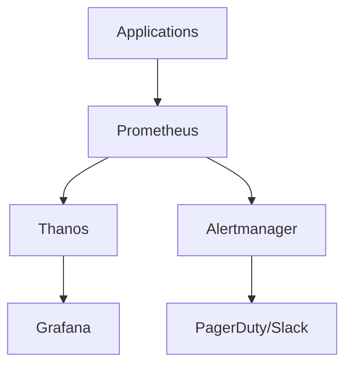

Real-time metrics collection, custom dashboards, and alert management for Kubernetes clusters serving millions of requests.

<!-- truncate -->

## Introduction

Building observability systems that scale with your infrastructure is one of the most challenging aspects of modern DevOps. In this post, I'll share insights from building monitoring solutions at NVIDIA that handle thousands of services across distributed Kubernetes clusters.

## The Challenge

When your infrastructure serves millions of requests daily, traditional monitoring approaches break down:

- **Cardinality explosion**: High-dimensional metrics can overwhelm your time-series database
- **Alert fatigue**: Too many alerts lead to ignored notifications
- **Dashboard sprawl**: Teams create redundant dashboards without standardization

## Architecture Overview



## Key Metrics to Track

### Golden Signals

1. **Latency**: Response time distribution (p50, p95, p99)
2. **Traffic**: Requests per second
3. **Errors**: Error rate percentage
4. **Saturation**: Resource utilization

### Example PromQL Queries

```promql
# Request rate per service
sum(rate(http_requests_total[5m])) by (service)

# P99 latency
histogram_quantile(0.99, 
  sum(rate(http_request_duration_seconds_bucket[5m])) by (le, service)
)

# Error rate
sum(rate(http_requests_total{status=~"5.."}[5m])) 
/ sum(rate(http_requests_total[5m])) * 100
```

## Dashboard Best Practices

1. **Use consistent layouts**: Standard placement for key metrics
2. **Set meaningful thresholds**: Visual indicators for SLO breaches
3. **Include runbook links**: Direct access to remediation steps
4. **Layer detail levels**: Overview → Service → Pod drill-downs

## Alerting Strategy

| Severity | Response Time | Example |
|----------|---------------|---------|
| P1 | 5 minutes | Service completely down |
| P2 | 30 minutes | Degraded performance |
| P3 | 4 hours | Non-critical component issue |
| P4 | Next business day | Warning thresholds |

## Lessons Learned

:::tip Key Takeaway
Start with fewer, high-quality alerts. It's better to have 10 actionable alerts than 100 noisy ones.
:::

1. **Instrument from day one**: Adding metrics retroactively is painful
2. **Standardize labels**: Consistent labeling enables powerful aggregations
3. **Plan for retention**: Define how long you need historical data
4. **Test your alerts**: Simulate failures to validate alerting works

## Conclusion

Building observability at scale requires thoughtful architecture, standardization, and continuous refinement. The investment pays dividends when debugging production issues or capacity planning.

---

*Have questions about observability? Connect with me on [LinkedIn](https://www.linkedin.com/in/shivam-g-mishra).*
