A comprehensive guide to observability for architects and technical leaders—understanding the three pillars, OpenTelemetry, and why it matters for modern distributed systems.

<!-- truncate -->

## The Wake-Up Call

Every architect has had this moment: a production incident at 2 AM, customers reporting failures, and your team staring at dashboards that show "everything is green" while the system is clearly on fire.

The on-call engineer sees elevated error rates but can't pinpoint the cause. Is it the database? The payment gateway? A network issue? A code bug that only manifests under load?

**Without proper observability, debugging distributed systems is like diagnosing a car problem by only looking at the "check engine" light.** You know something's wrong, but you have no idea what.

This article is the first in a three-part series on building production-grade observability infrastructure:

1. **Fundamentals** (this article) — Core concepts, the three pillars, and OpenTelemetry
2. **[Single-Node Setup](./single-node-observability-setup)** — A practical implementation guide
3. **[Scalable Architecture](./scalable-observability-architecture)** — Enterprise-grade design patterns

## Observability vs. Monitoring: A Critical Distinction

Before diving deeper, let's address a common misconception: observability and monitoring are not the same thing.

| Aspect | Monitoring | Observability |
|--------|-----------|---------------|
| **Questions** | Predefined: "Is X within threshold?" | Ad-hoc: "Why is this happening?" |
| **Approach** | Check known failure modes | Explore unknown unknowns |
| **Data** | Aggregated metrics, simple logs | Rich context: traces, structured logs, high-cardinality metrics |
| **Debugging** | Dashboard → runbook → maybe success | Hypothesis → query → evidence → root cause |

Monitoring tells you *when* something's wrong. Observability helps you understand *why*.

For a single-service application on one server, traditional monitoring often suffices. But in distributed systems—where a user action triggers calls across authentication, inventory, payment, and notification services—monitoring simply isn't enough.

## The Three Pillars of Observability

Observability rests on three complementary data types. Each answers different questions about your system.

### Pillar 1: Distributed Traces

A trace follows a single request as it travels through your distributed system. When a user clicks "Place Order," that request might touch a dozen services before returning a response.

```mermaid
gantt
    title Distributed Trace: Place Order (850ms total)
    dateFormat X
    axisFormat %L ms
    
    section API Gateway
    Request validation     :0, 15
    
    section Order Service
    Validate cart         :15, 40
    Check inventory       :crit, 40, 220
    Database query        :crit, 45, 220
    Process payment       :220, 420
    External API call     :225, 420
    Send confirmation     :420, 460
```



:::tip Root Cause Found
The trace reveals two bottlenecks: **inventory database query (175ms)** and **external payment API (195ms)**. Without tracing, you'd be guessing.
:::

With this trace, you immediately see that the 850ms response time stems from a slow inventory database query (175ms) and the external payment API (195ms).

**When traces shine:**
- "Why did this specific request take so long?"
- "Where in my system did this error originate?"
- "Which downstream service is causing my latency?"

### Pillar 2: Metrics

If traces investigate individual requests, metrics reveal patterns across millions of requests. They're numerical measurements collected at regular intervals—highly compressed and efficient for long-term trend analysis.

```yaml
# Traffic
http_requests_total{service="order-api", status="200"}: 1,234,567
http_requests_total{service="order-api", status="500"}: 234

# Latency
http_request_duration_seconds_p99{service="order-api"}: 0.45

# Saturation
active_database_connections{pool="primary"}: 42
order_processing_queue_depth: 127
```

From these numbers, you understand traffic volume (1.2M requests), error rate (0.02%), worst-case latency (450ms), and resource utilization—all at a glance.

**When metrics shine:**
- "What's our error rate trending over the past week?"
- "Are we approaching capacity limits?"
- "Should I wake someone up?" (alerting)

### Pillar 3: Logs

Logs are discrete events describing what happened at specific moments. The key distinction is between logs that help you debug and logs that fill up your disk:

**Unhelpful:**
```
2024-01-15 10:23:45 ERROR Payment failed
```

**Helpful:**
```json
{
  "timestamp": "2024-01-15T10:23:45.123Z",
  "level": "error",
  "service": "payment-service",
  "message": "Payment processing failed",
  "trace_id": "abc123def456",
  "user_id": "user_789",
  "order_id": "order_456",
  "error_code": "card_declined"
}
```

The second example lets you filter, correlate with traces via `trace_id`, and understand exactly what went wrong.

### The Real Power: Correlation

Each pillar is valuable alone, but **the magic happens when you can correlate all three**:

```mermaid
flowchart LR
    subgraph "1. Alert"
        A[📊 Metrics<br/>Error rate > 1%]
    end
    
    subgraph "2. Investigate"
        B[📈 Metrics<br/>Spike at 10:15<br/>DB pool at 100%]
    end
    
    subgraph "3. Search"
        C[📝 Logs<br/>Connection pool<br/>exhausted]
    end
    
    subgraph "4. Trace"
        D[🔍 Traces<br/>50 queries/request<br/>in inventory-service]
    end
    
    subgraph "5. Root Cause"
        E[🎯 N+1 Query Bug<br/>Yesterday's deployment]
    end
    
    A --> B --> C --> D --> E
    
    style A fill:#ff6b6b,color:#fff
    style B fill:#feca57,color:#333
    style C fill:#48dbfb,color:#333
    style D fill:#1dd1a1,color:#333
    style E fill:#5f27cd,color:#fff
```



This investigation takes 10 minutes with proper observability. Without it? Hours of guessing.

## Why OpenTelemetry is the Right Foundation

When building an observability platform, you face a fundamental choice: what instrumentation standard should you use?

Vendor-specific SDKs create lock-in. Multiple specialized tools mean maintaining multiple instrumentation systems. **OpenTelemetry solves both problems.**

### What OpenTelemetry Actually Is

OpenTelemetry (OTel) is three things:

1. **A specification** defining how telemetry data should be structured
2. **SDKs for every major language** implementing this specification
3. **The OpenTelemetry Collector**, a vendor-agnostic data pipeline

The key insight is **separation of concerns**. Your application code instruments itself using the OpenTelemetry SDK, speaking a standard protocol (OTLP). Where that data goes—Jaeger, Datadog, or your own backends—is a deployment-time decision, not a code-time decision.

```mermaid
flowchart TB
    subgraph apps["Your Application Code"]
        direction LR
        go[Go SDK]
        java[Java SDK]
        dotnet[.NET SDK]
        python[Python SDK]
    end
    
    apps -->|OTLP Protocol| collector
    
    subgraph collector["OpenTelemetry Collector"]
        receive[Receive] --> process[Process] --> export[Export]
    end
    
    collector --> jaeger[("🔍 Jaeger<br/>Traces")]
    collector --> grafana[("📊 Grafana Stack<br/>Metrics + Logs")]
    collector --> datadog[("☁️ Datadog<br/>or any vendor")]
    
    style apps fill:#e8f4f8,stroke:#0891b2
    style collector fill:#f0fdf4,stroke:#16a34a
    style jaeger fill:#fef3c7,stroke:#d97706
    style grafana fill:#fce7f3,stroke:#db2777
    style datadog fill:#f3e8ff,stroke:#9333ea
```



### Why This Matters for Your Architecture

**No vendor lock-in.** Change your Collector configuration to switch backends—not your application code. Your instrumentation investment is protected.

**One SDK to learn.** Instead of Jaeger's SDK for traces, Prometheus client for metrics, and some logging framework, everyone learns one set of APIs.

**Industry standard.** OpenTelemetry is a CNCF project with contributions from Google, Microsoft, Amazon, Splunk, and Datadog. It's rapidly becoming *the* way to instrument applications.

### The Collector: Your Swiss Army Knife

The OpenTelemetry Collector deserves special attention. It can:

**Receive from anything:**
- OTLP (native OpenTelemetry)
- Jaeger format (legacy compatibility)
- Prometheus scrape targets
- Syslog, AWS CloudWatch, and dozens more

**Process however you need:**
- Sample intelligently (keep errors, sample successes)
- Add metadata (Kubernetes labels, environment info)
- Filter noise (health checks, internal traffic)
- Redact sensitive data

**Export to anywhere:**
- Self-hosted (Jaeger, Prometheus, Loki)
- Commercial (Datadog, New Relic, Honeycomb)
- Multiple destinations simultaneously

This flexibility is why the Collector is the heart of modern observability architecture.

## Key Architectural Decisions

As you design your observability infrastructure, several decisions will shape your architecture:

### 1. Storage Strategy

| Signal | Storage Options | Considerations |
|--------|-----------------|----------------|
| Traces | Jaeger, Tempo, Zipkin | Query patterns, retention needs |
| Metrics | Prometheus, Mimir, Thanos | Cardinality limits, long-term storage |
| Logs | Loki, Elasticsearch | Indexing strategy, query performance |

The Grafana stack (Tempo, Mimir, Loki) offers a compelling choice: all three use object storage (S3/MinIO) for cost-effective long-term retention, and Grafana provides unified querying.

### 2. Sampling Strategy

At scale, storing every trace is prohibitively expensive. The key insight: **most traces are boring**. Successful requests with normal latency rarely need investigation.

**Tail-based sampling** waits until a trace completes, then decides:
- Keep all traces with errors (always interesting)
- Keep all traces above latency threshold (performance issues)
- Sample remaining traces (representative baseline)

This approach reduces storage by 80-90% while preserving everything you'd actually investigate.

### 3. High Availability Requirements

| Requirement | Architecture |
|-------------|--------------|
| Development/Test | Single-node, Docker Compose |
| Production (< 50K events/sec) | Single-node with persistent storage |
| High Availability | Multi-node with Kafka buffering |
| Enterprise Scale | Kubernetes with auto-scaling |

Most teams can start with a single-node deployment and scale when they hit concrete limitations.

## The Cost Reality

Let's address the elephant in the room: commercial observability platforms are expensive.

At enterprise scale (5,000+ hosts), we've seen quotes exceeding **$1.5M per year** for commercial solutions. This breaks down to:
- $25/host/month for infrastructure monitoring
- $12/host/month for APM
- Additional charges for log ingestion and trace storage

Self-hosted observability using OpenTelemetry + open-source backends can achieve **75-90% cost savings** while providing the same capabilities. The trade-off is operational complexity—you're now running and maintaining the infrastructure.

| Scale | Self-Hosted | Commercial | Savings |
|-------|-------------|------------|---------|
| Small (500 hosts) | ~$300/month | ~$25K/month | 99% |
| Medium (2K hosts) | ~$2K/month | ~$80K/month | 97% |
| Enterprise (5K+) | ~$15K/month | ~$150K/month | 90% |

The right choice depends on your team's infrastructure expertise and whether observability costs are a concern.

## What's Next

This article covered the conceptual foundation of observability. In the next two parts of this series, we'll get practical:

**[Part 2: Single-Node Setup](./single-node-observability-setup)**
- Docker Compose deployment
- OpenTelemetry Collector configuration
- Connecting applications
- Operational best practices

**[Part 3: Scalable Architecture](./scalable-observability-architecture)**
- Five-layer architecture design
- Kafka buffering for reliability
- Kubernetes deployment
- Cost optimization strategies

---

## Resources

- **GitHub Repository**: [opensource-otel-setup](https://github.com/shivam-g-mishra/opensource-otel-setup)
- **Documentation**: [Observability Docs](/docs/observability/introduction)
- **OpenTelemetry**: [opentelemetry.io](https://opentelemetry.io)

---

*Questions about observability architecture? Connect with me on [LinkedIn](https://www.linkedin.com/in/shivam-g-mishra).*
