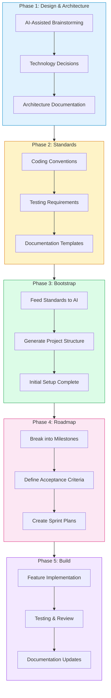

A practitioner's guide to AI-assisted development—not the hype, but what actually works when you're building production systems at enterprise scale.

<!-- truncate -->

## TL;DR — For the Impatient Architect

If you take nothing else from this article:

1. **Documentation before code** — Spend 20% of your project creating standards and architecture docs. AI follows your conventions if you give it conventions to follow.

2. **Progress logs are non-negotiable** — AI sessions crash. A simple markdown file tracking your progress means you recover in minutes instead of hours.

3. **Test more, not less** — When writing tests becomes cheap, you should invest more in testing. We shipped with more test code than production code.

4. **Review becomes the bottleneck** — AI generates faster than humans can review. Plan your review capacity alongside your generation capacity.

5. **Know when to stop** — Some problems are genuinely hard for AI. Recognizing these moments saves hours of frustration.

**The rest of this article is the story of how we learned these lessons.**

---

## The Project That Changed How I Think About Development

I need to tell you about the project that fundamentally changed how I approach software development.

It was late 2024, and I'd been asked to help build a product for NVIDIA's internal use. The scope was ambitious: an API server in Java Spring Boot, a distributed agent in Golang, extensive documentation spanning architecture to client integration, and enterprise-grade CI/CD pipelines. The timeline was aggressive. The team was three engineers.

I'd been experimenting with AI coding tools for months before this project—Cursor, Claude, GitHub Copilot. I'd used them for small tasks, quick scripts, documentation drafts. They were useful in the way a fancy calculator is useful: they saved time on mechanical work, but the thinking was still mine.

This project was different. We decided to put AI at the center of our workflow, not as an assistant for occasional tasks, but as a core collaborator in every phase of development. I wasn't sure it would work. I half-expected to abandon the approach after a few weeks and fall back to traditional development.

Twelve months later, here's what we shipped:

| Component | Lines of Code | Tests |
|-----------|---------------|-------|
| API Server (Java Spring Boot) | ~97,000 | 2,168 |
| Agent (Golang) | ~104,000 | 1,080 |
| **Total Production Code** | **~201,000** | **3,248** |

But those numbers only tell part of the story. Alongside the code, we produced architecture documentation, API specifications, developer guides, client integration documentation, operational runbooks, and CI/CD pipelines that I built in a single day.

To put this in perspective: **a codebase of this size and quality would traditionally take 3-4 years with a team twice our size.** We did it in one year with three engineers.

I'm not writing this to brag about productivity numbers. I'm writing it because the experience taught me things about AI-assisted development that I've seen nowhere else—lessons that only emerge when you push these tools to their limits on a real project with real stakes.

---

## The Counterintuitive Truth About AI-Assisted Development

Here's what I expected going into this project: AI would help me write code faster. I'd describe what I wanted, it would generate code, I'd review and tweak, repeat. The productivity gain would come from typing less.

Here's what I learned: **the typing was never the bottleneck.**

The hardest parts of software development have never been the typing. They're the thinking: understanding requirements, making architectural decisions, considering edge cases, ensuring consistency across a growing codebase. AI doesn't help with any of this by default. In fact, used naively, AI makes these problems worse—it generates plausible code so quickly that you can build yourself into architectural corners before you realize what's happening.

The teams I've seen fail with AI-assisted development are the ones who treat it like autocomplete on steroids. They start coding immediately, let AI generate whatever it suggests, and end up with a Frankenstein codebase where every file feels like it was written by a different developer with different conventions.

The teams that succeed—and we eventually became one—do something counterintuitive. They slow down at the beginning. They invest in documentation before writing code. They create standards and conventions and architectural decisions, and they give all of this to the AI as context.

This is the insight that took us two months to internalize: **AI follows your standards—if you give it standards to follow.**

---

## The Workflow That Emerged

We didn't start with a methodology. We started with experimentation, failure, and gradual refinement. By month four, we'd settled on an approach that worked consistently. I call it "documentation-first development," and it inverts the typical AI workflow.

Most tutorials about AI coding show someone opening an empty file and typing a prompt. That's exactly backwards for serious work.



We spent approximately two months on Phases 1-4 before heavy coding began. Two months of a twelve-month project invested in foundations. At the time, it felt risky—weren't we supposed to be moving fast? Looking back, those two months were the most valuable investment we made. They paid dividends every single day for the remaining ten months.

---

## Phase 1: The Conversations That Shaped Everything

Most teams jump straight to "let AI write code." We did the opposite—we started with AI-assisted design discussions.

I remember the first major architectural decision we had to make: whether to use Spring Boot for the API server or explore newer Java frameworks. In the old days, I would have spent a week reading blog posts, watching conference talks, and building small prototypes. Instead, I opened Claude and had a three-hour conversation.

Not a Q&A session—a conversation. I described our requirements in detail: high throughput, complex domain logic, integration with multiple NVIDIA internal systems, the need for comprehensive observability. I asked for comparisons. When Claude suggested Spring Boot's maturity as an advantage, I pushed back: "We're worried about startup time for containerized deployments. Walk me through the trade-offs." When it mentioned alternatives like Quarkus or Micronaut, I asked for real-world adoption data. We went back and forth, and I emerged with a decision I was confident in—and documentation of my reasoning.

This became our pattern for every significant decision. The AI wasn't making choices for us; it was a thinking partner that had read more architectural blog posts than any human could in a lifetime. It surfaced considerations we hadn't thought of. It provided frameworks for evaluating trade-offs.

Here's the prompt structure that became our go-to for architectural discussions:

```
We're designing [component].

Requirements:
- [Specific requirement 1]
- [Specific requirement 2]

Constraints:
- [Constraint 1]
- [Constraint 2]

Propose 2-3 architectural approaches with trade-offs for each.
For each approach, identify:
- Strengths
- Weaknesses
- When you'd choose this approach
- When you'd avoid it
```

The key is forcing the AI to give you options and trade-offs rather than a single "best" answer. We made better decisions because we understood the alternatives we were rejecting.

By the end of Phase 1, we had twenty pages of architectural documentation—not generic architecture diagrams, but specific decisions with reasoning. Why Spring Boot over alternatives. Why Golang for the agent. How services would communicate. What our data model looked like and why.

---

## Phase 2: The Standards That Made Everything Else Possible

Here's where most AI-assisted projects go wrong. They let AI generate code without giving it standards to follow. The result is inconsistent code that looks like it was written by fifty different developers—because in a sense, it was. Every AI prompt is a fresh start, with no memory of what came before.

We created comprehensive documentation for everything that should be consistent:

**Coding conventions:** How we name functions, variables, files, and packages. How we handle errors. What our logging format looks like. What comments are required and where.

**Testing requirements:** Our minimum coverage targets (85%). How we name test files. Our preference for table-driven tests in Go. When to mock and when to use real dependencies.

**Documentation standards:** The README structure for each component. The format for function documentation. How API endpoints should be documented.

I can't overstate how much this mattered. These documents served double duty. They were onboarding materials for human developers—the two engineers who joined the project mid-way were productive within days because they could read our standards. And they were context for AI—when we started a Cursor session with our standards loaded, every generated file followed our conventions automatically.

Creating these documents with AI was meta in a satisfying way. I'd prompt Claude with our context and ask it to generate comprehensive best practices:

```
Create comprehensive Golang best practices for:

CONTEXT:
- REST API with high-throughput requirements
- Microservices architecture
- Production environment at enterprise scale

INCLUDE:
1. Error handling patterns (with examples)
2. Struct/interface design guidelines
3. Goroutine and channel patterns
4. Table-driven testing approach
5. Package organization
6. Logging and observability
7. Configuration management

FORMAT:
- DO and DON'T examples for each
- Code snippets that can be copied
- Rationale for each recommendation
```

The AI generated a twenty-plus page document that became our team's reference guide. Every pull request was reviewed against these standards. And because AI helped write the standards, it was already "familiar" with the patterns we wanted.

---

## The Progress Log: A Simple Technique That Saved Us Dozens of Hours

Halfway through the project, we discovered a problem that nearly derailed us.

Cursor agents crash. It's not a flaw—it's physics. Long context windows, complex tasks, and timeouts create situations where sessions end unexpectedly. For small tasks, this is a minor annoyance. For complex, multi-file implementations that take hours, it's devastating.

I was three hours into implementing a complex authentication flow when my Cursor session crashed. When I started a new session, the AI had no memory of what we'd been building together. I tried to explain where we were, but the context was fragmented. I couldn't remember exactly which decisions we'd made or why. The recovery took longer than the original implementation.

The second time this happened, I was furious. Then I had an idea so simple I was embarrassed it took months to discover: **what if we kept a running log?**

```markdown
## Session Log - 2025-10-15

### Completed
- Implemented user authentication endpoint
- Added JWT token validation
- Created integration tests for auth flow

### Current Status
- Working on: Rate limiting middleware
- Blockers: None
- Decision needed: Redis vs in-memory for rate limit counters

### Next Steps
1. Finish rate limiting implementation
2. Add rate limit headers to responses
3. Update API documentation

### Decisions Made
- Using token bucket algorithm (handles burst traffic better)
- Rate limits will be configurable per endpoint
```

The progress log became our "save game" for AI development. When a session crashed, we'd start fresh, load the progress log, and continue exactly where we left off. The context rebuild that used to take hours now took minutes.

This simple technique—a markdown file updated at the end of each working session—saved us more time than any sophisticated tool or prompt engineering trick. It's not glamorous. It's not the kind of thing that makes for exciting blog posts. But it works.

---

## On Testing: The Unexpected Consequence of Cheap Tests

One of the biggest misconceptions about AI-assisted development is that it produces lower-quality code. I understand where this comes from—if you're generating code quickly, surely you're cutting corners somewhere?

Our experience was the opposite. We shipped 3,248 tests. That's more test code than production code, a ratio I've never achieved on a traditional project. Not because we were unusually disciplined, but because AI made the economics of testing fundamentally different.

Here's the thing about testing that nobody talks about: the reason developers skip tests isn't laziness. It's economics. When you're under pressure to ship, and writing tests takes as long as writing features, the rational thing to do is ship now and "add tests later." Everyone knows "later" never comes, but in the moment, it feels like the right trade-off.

AI breaks this equation. When I can describe a function and its edge cases and have a comprehensive test suite generated in minutes instead of hours, the calculation changes. Testing stops being overhead and starts being cheap insurance. The rational response to cheap insurance is to buy more of it.

We found ourselves doing things that would have seemed excessive before. "Let's add tests for that edge case too—why not?" "Let's increase our coverage on this module—it's only twenty minutes." The cumulative effect was a codebase that was dramatically more tested than anything I'd worked on before.

I developed a testing prompt template that became our standard:

```
Generate tests for [function/module]:

Include:
- Happy path cases
- Edge cases: [list specific ones]
- Error cases: [list expected errors]

Follow our testing pattern:
[table-driven tests / your specific pattern]

Ensure tests are:
- Independent (can run in any order)
- Deterministic (same result every time)
- Descriptive (test names explain the scenario)
```

The key is being specific about what edge cases to test. AI excels at generating test structure and boilerplate. What it doesn't know is which edge cases matter in your specific domain. That's still your job—but it's a thinking job, not a typing job.

---

## The Review Bottleneck Nobody Warned Me About

I thought the hardest part of AI-assisted development would be getting AI to generate good code. I was wrong. The hardest part was reviewing everything it generated.

Here's the problem nobody talks about: AI generates code faster than humans can review it. Much faster. We went from "not enough documentation" to "drowning in documentation." Pull requests that would have taken a day to create were ready in hours. But our review capacity didn't scale with our generation capacity.

Three months in, review became our primary bottleneck. We had features waiting days for review while reviewers were buried in a backlog of AI-generated code. And you can't just skip review—that's how bugs ship.

We tried several approaches before finding what worked:

**Prioritize ruthlessly.** Not everything needs the same level of scrutiny. Security-critical code gets multiple reviewers and careful line-by-line analysis. Boilerplate gets a quick scan for obvious issues. We developed a taxonomy of review depth and applied it consistently.

**Use AI for first-pass review.** We integrated Code Rabbit into our workflow. Every pull request went through automated review before a human saw it. Code Rabbit caught style inconsistencies, obvious bugs, and security issues. This filtered out the easy stuff and let human reviewers focus on logic and architecture.

**Enforce smaller PRs.** Large pull requests are slow to review regardless of how they're generated. We set a soft limit of 400 lines per PR. Smaller changes are easier to understand, easier to review, and easier to roll back if something goes wrong.

**Create review checklists.** For common patterns—new API endpoints, new database models, new configuration options—we created checklists of things to verify. This standardized review and made it faster.

The irony isn't lost on me: we needed AI to help review AI-generated content. The entire development lifecycle accelerated, and review had to accelerate with it.

---

## The Tools: An Honest Assessment

I've spent twelve months using AI coding tools daily. Here's what I actually think about them, stripped of marketing language.

### Cursor

Cursor became our primary IDE, and I couldn't go back to coding without it. The agent mode is genuinely powerful—it can make changes across multiple files, understand project structure, and maintain context across long sessions.

But here's what nobody tells you: the learning curve is real. It took us roughly three months to become competent and six months to become proficient. Early on, we made mistakes that cost us time—letting the agent go too far without checking its work, not providing enough context, not using the rules system effectively.

The rules system deserves special mention. Cursor lets you define project-specific rules that guide AI behavior. Once we loaded our standards as rules, the consistency of generated code improved dramatically. This was a breakthrough moment.

**Where Cursor excels:** Day-to-day coding, refactoring across multiple files, implementing features following established patterns.

**Where Cursor struggles:** Very long sessions (it will eventually crash), problems that require stepping back and thinking architecturally, anything where you can't provide a clear example.

### Claude

For complex reasoning and architectural discussions, Claude was our go-to. When I needed to think through trade-offs or work through subtle logic, Claude's responses were more nuanced than what I got from other tools.

The longer context window was genuinely useful. When discussing a complex feature that touched multiple components, I could include more context without hitting limits.

**Where Claude excels:** Architectural discussions, debugging subtle issues, explaining complex concepts, documentation.

**Where Claude struggles:** It doesn't have direct access to your codebase (you have to copy-paste), and it can be overly cautious in its recommendations.

### The Multi-Model Strategy

About four months in, we stopped trying to use one tool for everything and started matching models to tasks. This was another breakthrough.

Quick code completions? Use Cursor's fast model. Feature implementation? Use Cursor with Claude. Architectural discussions? Go directly to Claude for the nuanced conversation. Research? Perplexity with its real-time sources.

No single tool is best at everything. The teams that get the most value from AI are the ones who learn which tool to reach for in which situation.

---

## What AI Gets Wrong: The Failures That Taught Me the Most

It wouldn't be honest to write about AI-assisted development without discussing the failures. I almost shipped a security vulnerability. I wasted hours on a feature AI couldn't build. I've seen AI hallucinate imports for packages that don't exist.

### The Security Bug I Almost Shipped

I asked Cursor to create an authentication endpoint. The code looked clean. Tests passed. Review looked fine.

Then, during a late-night code inspection before a major release, I noticed something subtle: the token validation was checking expiry *after* processing the request. Invalid tokens could hit the endpoint and execute logic before being rejected.

This wasn't a hallucination or a syntax error. It was a logical mistake—the kind of mistake a human developer might also make, but one that a human reviewer might catch because they know to look for it. I almost didn't catch it.

**AI understood "validate tokens." AI didn't understand "validate FIRST."**

The lesson burned into my brain: AI generates plausible code. Plausible doesn't mean correct. Security-critical code needs extra scrutiny, and you need to know what to look for. Don't trust AI's output just because it looks professional.

### The Feature AI Couldn't Build

Some problems are genuinely hard for AI. I spent four hours trying to get AI to implement a custom workflow engine with conditional branching, parallel execution, and rollback capabilities.

Attempt after attempt failed. Race conditions in the parallel execution. Broken rollback logic that left state inconsistent. Over-engineered abstractions that made the code harder to understand than a straightforward implementation.

Eventually, I gave up and wrote it myself. It took six hours of focused work, and the result was cleaner than any of the AI attempts.

**AI struggles when:**
- Requirements span multiple complex patterns that need to work together
- State management is intricate with many edge cases
- You can't show a clear example of what you want
- The "right answer" requires deep domain context

Some code just needs a human brain. Recognizing when to stop using AI is as important as knowing when to use it. I've learned to watch for the warning signs: if my third attempt is still failing in the same ways, I step back and consider whether this is a problem AI can help with.

---

## The Honest Trade-offs

AI-assisted development isn't magic. It comes with real trade-offs that you should understand before committing to this approach.

### What You Gain

**Speed.** We shipped a 3-4 year codebase in one year. Not through heroics or crunch—through consistently faster development across the board.

**Consistency.** With proper standards, AI applies your conventions uniformly. Every file looks like it belongs in the same codebase.

**Coverage.** Higher test coverage because tests are cheap to write. Better documentation because documentation is cheap to generate.

**Learning.** AI taught me patterns I didn't know. It suggested approaches I wouldn't have considered. This surprised me—I expected AI to learn from me, not the other way around.

### What You Pay

**Learning curve.** Three months to be competent, six months to be proficient. The tools are powerful but not intuitive.

**Review burden.** Generate faster than you can review. This becomes your bottleneck if you don't address it consciously.

**Subtle bugs.** AI makes plausible mistakes that are hard to catch. You need reviewers who know what to look for.

**Over-reliance risk.** Some engineers stop thinking critically and accept whatever AI suggests. This is dangerous. AI is a collaborator, not an authority.

### What Stays the Same

**Human judgment.** You still decide what to build. AI suggests; you choose.

**Architecture decisions.** AI can present options, but understanding your constraints and making trade-offs is still your job.

**Domain knowledge.** AI doesn't understand your business, your users, or your organizational politics. These factors shape good software as much as technical skill.

**Quality standards.** You define what "good enough" means. AI doesn't have opinions about quality—it will generate whatever you ask for.

---

## Getting Started: A Realistic Roadmap

If you're adopting AI-assisted development, here's the path I'd recommend based on what we learned.

### Month 1: Learn the Tools

Start with Cursor for small tasks. Code completion. Simple refactoring. Writing tests for existing code. Don't try to build entire features yet—learn the interface, the quirks, the failure modes.

Use Claude for conversations about code you're working on. Ask it to explain complex functions. Discuss design decisions. Get comfortable using it as a thinking partner.

This phase is about building intuition. What works? What doesn't? Where does AI help versus where does it get in the way?

### Month 2: Create Your Standards

Before using AI for serious work, create your standards documentation. This is the investment that makes everything else work.

Coding conventions. Testing requirements. Documentation format. Architectural principles. Write them down. Be specific. Include examples.

This isn't bureaucratic overhead—it's the context that makes AI effective. Without standards, every AI generation is a fresh start. With standards, AI knows how to generate code that fits your codebase.

### Month 3 and Beyond: Apply to Real Projects

Start applying the full workflow to real work. Use progress logs from day one. Set up automated review. Learn from failures.

You'll make mistakes. We made many. The important thing is to learn from each one and adjust your approach.

Six months in, if you've been diligent, you'll wonder how you ever developed without these tools. That's not hyperbole—it's what happens when you internalize the workflow.

---

## The Lessons That Took a Year to Learn

If I had to compress a year of AI-assisted development into what actually mattered, it would be this:

**Documentation before code.** Give AI your conventions upfront. The investment pays off 10x in consistency and reduced rework.

**Progress logs are essential.** Sessions crash. Context is lost. A simple markdown file is the difference between minutes and hours of recovery time.

**Test more, not less.** When testing becomes cheap, you should invest more in it. We shipped with more test code than production code.

**Review becomes the bottleneck.** Plan your review capacity alongside your generation capacity. This is the constraint most teams don't anticipate.

**Match tools to tasks.** No single AI tool is best at everything. Learn which tool to reach for in which situation.

**Show, don't describe.** AI learns from examples. Three code examples teach more than thirty lines of instructions. When AI struggles, the first question should be: "Can I show it what I want?"

**Know when to stop.** Some problems are hard for AI. Recognizing these moments saves hours of frustration. If your third attempt is failing in the same ways, step back.

**The learning curve is real.** Expect three months to be competent, six months to be proficient. Don't give up early because the tools feel clunky—they get better as you learn them.

---

## What's Next

AI-assisted development isn't a fad. It's a fundamental shift in how software gets built. The engineers who learn to use these tools effectively will have an enormous advantage over those who don't.

But the tools are just the beginning. The real transformation is in how we think about development—as a collaboration between human judgment and AI capability. Not replacement. Not automation. Collaboration.

The project I described shipped successfully. It's in production today, handling real workloads at NVIDIA, maintained by a team that includes engineers who weren't part of the original build. The code is clean, well-tested, and comprehensively documented—not because we wrote every line manually, but because we built the systems that ensured quality at every step.

That's the real test: not just whether AI can help you build fast, but whether it can help you build something that lasts.

---

## Frequently Asked Questions

<details>
<summary><strong>Do I need to be an expert to use AI coding tools?</strong></summary>

No, but experience helps you catch AI's mistakes. Junior developers can use AI effectively for learning and generating boilerplate, but they should have senior review on anything that matters. AI doesn't know what it doesn't know, and neither do juniors—the combination is risky without oversight.

</details>

<details>
<summary><strong>Which AI coding tool should I start with?</strong></summary>

Cursor for coding in an IDE, Claude for architectural discussions and complex reasoning. Start with whichever matches your immediate need. You'll eventually use both.

</details>

<details>
<summary><strong>How do I convince my team/manager to try AI-assisted development?</strong></summary>

Start small and show results. Pick a low-stakes project, use AI for a sprint, measure the outcome. Data convinces skeptics better than arguments. Focus on concrete metrics: time to implement, test coverage, bugs found in review versus production.

</details>

<details>
<summary><strong>Will AI replace developers?</strong></summary>

Not in any meaningful timeframe. AI changes what developers do, not whether they're needed. The bottleneck shifts from writing code to making decisions about code. That shift requires humans with judgment, domain knowledge, and accountability.

</details>

<details>
<summary><strong>How do I handle the security risks of AI-generated code?</strong></summary>

The same way you handle security risks of human-written code: review, testing, and scanning. The difference is that AI makes certain kinds of mistakes more consistently—logical errors that look plausible. Train your reviewers to watch for these patterns. Use automated security scanning in your CI pipeline. Don't trust AI output more than you'd trust a junior developer.

</details>

<details>
<summary><strong>What about the cost? These tools are expensive.</strong></summary>

Calculate the return. If a $20/month tool saves one hour per day of a $150K/year engineer's time, the ROI is obvious. Most teams vastly underestimate the value of developer time. Run the numbers for your situation.

</details>

---

## Resources

- **Connect**: [LinkedIn](https://www.linkedin.com/in/shivam-g-mishra) — I post regularly about AI development
- **Cursor Documentation**: [cursor.com](https://cursor.com)
- **Anthropic Prompt Engineering**: [docs.anthropic.com](https://docs.anthropic.com)

---

*Building something with AI? I'd love to hear your story—the wins, the failures, and everything in between. Connect with me on LinkedIn.*
