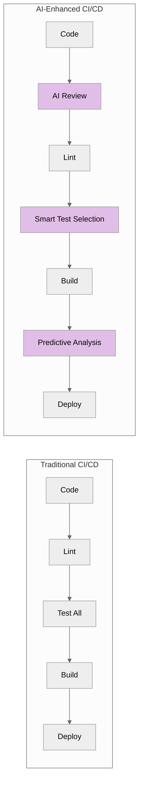
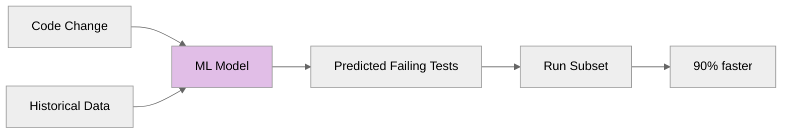

---
# Required
sidebar_position: 14
title: "AI in CI/CD for DevOps Teams"
description: >-
  Explore how AI is transforming CI/CD for DevOps: intelligent test selection,
  AI-powered code review, predictive failure analysis, and pipeline optimization.

# SEO
keywords:
  - ai ci/cd
  - intelligent testing
  - ai code review
  - predictive testing
  - ml pipelines
  - github copilot
  - ai devops
  - machine learning ci/cd
  - automated code review
  - test optimization ai
  - learn ci/cd

# Social sharing
og_title: "AI in CI/CD: DevOps Automation with Machine Learning"
og_description: "Explore AI-powered code review, intelligent test selection, and predictive failure analysis in CI/CD."
og_image: "/img/ci-cd-social-card.svg"

# Content management
date_published: 2025-01-24
date_modified: 2026-01-25
author: shivam
reading_time: 16
content_type: explanation
---

# AI in CI/CD

The landscape of CI/CD is changing. AI and machine learning are moving from experimental features to production tools that genuinely improve software delivery.

If you're curious about AI in CI/CD or AI DevOps tooling, AI is becoming the accelerator that turns good pipelines into great ones.

This isn't hype—it's practical capability that's already shipping. AI-powered code review catches bugs that linters miss. Intelligent test selection runs only the tests that matter. Predictive analysis identifies flaky tests before they waste developer time. These tools don't replace CI/CD fundamentals; they amplify them.

This document explores how AI is being integrated into CI/CD workflows, what's working today, and where the technology is heading.

**What you'll learn in this guide:**
- Where AI can safely augment CI/CD today
- Tooling options for AI-driven review and testing
- Risks and limits of automation you should expect
- What trends to watch in the next 12–24 months

---

## How AI Fits into CI/CD

AI augments CI/CD pipelines in several ways:



**Key integration points:**

1. **Pre-commit:** AI code review and suggestions
2. **Testing:** Intelligent test selection and prioritization
3. **Build:** Predictive failure detection
4. **Deploy:** Anomaly detection and automated rollback
5. **Post-deploy:** Observability insights and correlation

---

## AI-Powered Code Review

AI code review tools analyze pull requests and provide feedback before human reviewers engage.

### GitHub Copilot for Pull Requests

Copilot can review PRs and suggest improvements:

```yaml
# GitHub Copilot PR review (where available)
- name: AI Review
  uses: github/copilot-review-action@v1
  with:
    github-token: ${{ secrets.GITHUB_TOKEN }}
```

**What it catches:**
- Potential bugs and logic errors
- Security vulnerabilities
- Performance issues
- Code style inconsistencies
- Missing error handling

### CodeRabbit

CodeRabbit provides automated PR reviews:

```yaml
# CodeRabbit configuration
# coderabbit.yaml
reviews:
  profile: assertive  # assertive, balanced, or chill
  auto_review:
    enabled: true
    drafts: false
  path_instructions:
    - path: "src/**"
      instructions: "Focus on performance and security"
```

### Amazon CodeGuru

CodeGuru uses ML to identify code quality issues:

```yaml
- name: CodeGuru Review
  uses: aws-actions/codeguru-reviewer@v1
  with:
    s3_bucket: my-codeguru-bucket
    build_path: ./src
```

### Benefits and Limitations

**Benefits:**
- Catches issues humans miss
- Consistent, tireless review
- Instant feedback (no waiting for human reviewer)
- Educational for developers

**Limitations:**
- Can produce false positives
- May miss context that humans understand
- Not a replacement for human review
- Requires tuning for your codebase

---

## Intelligent Test Selection

Running all tests on every change is wasteful. AI can predict which tests are likely to fail based on code changes.

### How It Works



The ML model learns from:
- Which tests failed when similar code changed
- Code coverage data
- Test execution history
- File dependencies

### Launchable

Launchable provides test intelligence:

```yaml
- name: Install Launchable
  run: pip install launchable

- name: Record build
  run: launchable record build --name ${{ github.sha }}

- name: Subset tests
  run: |
    launchable subset \
      --build ${{ github.sha }} \
      --target 50% \  # Run 50% of tests by importance
      pytest > subset.txt

- name: Run prioritized tests
  run: pytest $(cat subset.txt)

- name: Record results
  run: launchable record tests --build ${{ github.sha }} pytest ./results.xml
```

### Predictive Test Selection (Datadog)

Datadog CI Visibility includes intelligent test management:

```yaml
- name: Configure Datadog
  run: |
    npm install -g @datadog/datadog-ci
    
- name: Run with test impact analysis
  run: |
    DD_CIVISIBILITY_ITR_ENABLED=true npm test
  env:
    DD_API_KEY: ${{ secrets.DD_API_KEY }}
```

### Results

Teams using intelligent test selection report:
- 50-80% reduction in test time
- Faster feedback loops
- Same or better bug detection
- Reduced CI costs

---

## Flaky Test Detection

AI excels at identifying and managing flaky tests.

### Automatic Flakiness Detection

```yaml
# BuildPulse for flaky test detection
- name: Report to BuildPulse
  uses: buildpulse/buildpulse-action@v0.11.0
  with:
    account-id: ${{ secrets.BUILDPULSE_ACCOUNT_ID }}
    repository-id: ${{ secrets.BUILDPULSE_REPOSITORY_ID }}
    path: test-results.xml
    key: ${{ secrets.BUILDPULSE_API_KEY }}
```

**What AI detects:**
- Tests that pass/fail randomly
- Tests with timing dependencies
- Tests affected by external state
- Tests that fail in specific environments

### Automatic Quarantine

```yaml
# Jest with automatic quarantine
module.exports = {
  testMatch: ['**/*.test.js'],
  // Skip quarantined tests
  testPathIgnorePatterns: require('./quarantined-tests.json'),
};
```

---

## Predictive Pipeline Optimization

AI can predict and prevent pipeline failures before they happen.

### Failure Prediction

ML models can predict if a pipeline run will fail based on:
- Historical failure patterns
- Code change characteristics
- Time of day/week patterns
- Author patterns

```yaml
# Conceptual: Predictive analysis before expensive steps
- name: Predict build outcome
  id: predict
  run: |
    PREDICTION=$(curl -X POST "$AI_SERVICE_URL/predict" \
      -d '{"commit": "${{ github.sha }}", "changes": "${{ github.event.commits }}"}'
    echo "confidence=$PREDICTION" >> $GITHUB_OUTPUT

- name: Run expensive tests
  if: steps.predict.outputs.confidence > 0.8
  run: npm run test:expensive
```

### Build Time Optimization

AI can recommend:
- Optimal parallelization strategies
- Cache configuration improvements
- Resource allocation

### Harness AI

Harness includes AI-driven CI/CD optimization:
- Automatic test intelligence
- Failure analysis
- Deployment verification

---

## Security Scanning with AI/ML

AI enhances security scanning beyond rule-based detection.

### AI-Enhanced Vulnerability Detection

```yaml
- name: Snyk with AI features
  uses: snyk/actions/node@master
  env:
    SNYK_TOKEN: ${{ secrets.SNYK_TOKEN }}
```

Modern security scanners use ML to:
- Reduce false positives
- Identify complex vulnerability patterns
- Prioritize by actual exploitability
- Suggest fixes

### Secret Detection

AI improves secret detection by understanding context:

```yaml
# GitLeaks with ML improvements
- name: Secret Scan
  uses: gitleaks/gitleaks-action@v2
  env:
    GITHUB_TOKEN: ${{ secrets.GITHUB_TOKEN }}
```

---

## Natural Language Pipeline Generation

AI can generate pipeline configurations from natural language descriptions.

### Current Capabilities

Tools like GitHub Copilot can generate pipeline YAML:

```
// Ask Copilot: "Create a GitHub Actions workflow that builds a Node.js app, 
// runs tests, and deploys to AWS ECS"

// Copilot generates:
name: Build and Deploy

on:
  push:
    branches: [main]

jobs:
  build:
    runs-on: ubuntu-latest
    steps:
      - uses: actions/checkout@v4
      - uses: actions/setup-node@v4
        with:
          node-version: 20
      - run: npm ci
      - run: npm test
      - uses: aws-actions/configure-aws-credentials@v4
        with:
          role-to-assume: ${{ secrets.AWS_ROLE }}
          aws-region: us-west-2
      - run: |
          aws ecs update-service --cluster my-cluster --service my-service --force-new-deployment
```

### Limitations

- Generated pipelines need review
- May not follow your conventions
- Can miss security best practices
- Requires validation before use

---

## Current AI/ML Tools Landscape

| Tool | Focus | Maturity |
|------|-------|----------|
| **GitHub Copilot** | Code generation, PR review | Production |
| **CodeRabbit** | PR review | Production |
| **Launchable** | Test intelligence | Production |
| **BuildPulse** | Flaky test detection | Production |
| **Datadog CI** | Test optimization, analysis | Production |
| **Snyk** | Security with ML | Production |
| **Harness** | Full AI-driven CI/CD | Production |
| **GitLab Duo** | Code suggestions, review | Production |

---

## Implementing AI in Your Pipeline

### Start Small

1. **Add AI code review** to PRs (low risk, immediate value)
2. **Enable flaky test detection** (identifies problems you already have)
3. **Try test intelligence** on one project (measurable impact)
4. **Evaluate security scanning** improvements

### Measure Impact

Track metrics before and after AI adoption:
- Pipeline duration
- Test suite runtime
- False positive rates
- Time to detect issues

### Best Practices

1. **Human oversight:** AI augments, doesn't replace
2. **Tune for your context:** Generic models need adjustment
3. **Monitor for drift:** Model effectiveness changes over time
4. **Maintain fallbacks:** Pipeline should work without AI features
5. **Data privacy:** Understand what data AI tools access

---

## Future Trends

### Self-Healing Pipelines

AI that automatically fixes common failures:
```
Pipeline failed: npm install
AI detected: Lock file mismatch
AI action: Regenerating lock file and retrying
```

### Autonomous Deployment Decisions

AI analyzing metrics to decide deployment safety:
```
Canary analysis: Error rate increased 0.1%
AI recommendation: Continue rollout (within normal variance)
```

### Code Generation from Specs

AI generating code from specifications:
```
Spec: "User authentication with OAuth 2.0"
AI: Generates implementation, tests, and deployment config
```

---

## FAQ: AI in CI/CD

### Can AI replace CI/CD engineers?

No. AI can automate analysis and suggest fixes, but ownership, context, and accountability remain human responsibilities.

### Is AI test selection safe?

It can be, if you start in advisory mode, validate against full runs, and keep a fallback path. Never let AI skip critical safety tests without monitoring.

### How should DevOps teams adopt AI safely?

Start with low-risk tasks like code review assistance and flaky test detection, then expand once you trust the results.

## Related Reading

- [Troubleshooting: Detect failures early →](./troubleshooting)
- [Metrics & Maturity: Measure AI impact →](./metrics-maturity)
- [Enterprise CI/CD: Governance for AI-assisted pipelines →](./enterprise-cicd)

---

## What's Next?

AI is rapidly evolving in the CI/CD space. The tools available today provide real value, and capabilities are expanding quickly.

The next document in this series covers **Enterprise CI/CD and Platform Engineering**: how to scale CI/CD across organizations, build internal developer platforms, and manage governance at scale.

**Ready to scale CI/CD for the enterprise?** Continue to [Enterprise CI/CD →](./enterprise-cicd)

---

## Quick Reference

### AI Integration Points

| Phase | AI Capability |
|-------|--------------|
| Pre-commit | Code suggestions, review |
| Testing | Test selection, flakiness detection |
| Security | ML-enhanced scanning |
| Deployment | Predictive analysis, anomaly detection |
| Post-deploy | Incident correlation |

### Getting Started

1. GitHub Copilot for code suggestions
2. CodeRabbit/Copilot for PR review
3. Launchable for test intelligence
4. BuildPulse for flaky tests
5. Datadog/Harness for full platform

### What AI Can't Replace

- Understanding business context
- Making judgment calls
- Handling novel situations
- Accountability for decisions

---

**Remember:** AI in CI/CD is a tool, not a replacement for good engineering practices. The fundamentals still matter: automated testing, consistent environments, fast feedback loops. AI makes these practices more effective, not obsolete.
