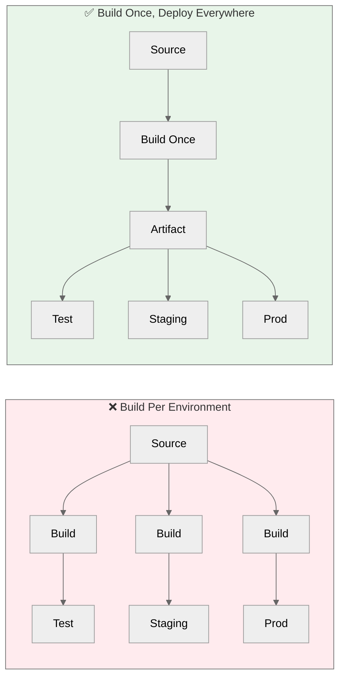
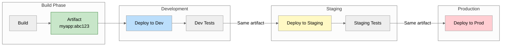

---
# Required
sidebar_position: 6
title: "Artifact Management and Storage — Where Builds Go After They're Built"
description: >-
  Learn how to manage build artifacts throughout their lifecycle. Covers artifact types, 
  storage solutions, versioning, retention policies, and promotion workflows for 
  production-grade CI/CD pipelines.

# SEO
keywords:
  - artifact management
  - build artifacts
  - container registry
  - artifactory
  - nexus
  - github packages
  - docker images
  - npm packages
  - artifact storage
  - artifact versioning
  - artifact promotion
  - ci/cd artifacts
  - package management
  - binary repository

# Social sharing
og_title: "Artifact Management: Store, Version, and Promote Your Build Outputs"
og_description: "Master artifact management for CI/CD. Learn storage solutions, versioning strategies, and promotion workflows."
og_image: "/img/ci-cd-social-card.png"

# Content management
date_published: 2025-01-24
date_modified: 2025-01-24
author: shivam
reading_time: 18
content_type: explanation
---

# Artifact Management and Storage

The first time I truly understood artifact management was when I didn't have it.

We were building CI/CD as a service at NVIDIA, and one of our early pipelines had a frustrating pattern: builds would succeed, tests would pass, but when deployment time came, we'd rebuild from source. Every single time. The deployment would sometimes succeed and sometimes fail—not because the code changed, but because dependencies resolved differently, or a transient network issue affected the build, or some compiler flag behaved differently on a different machine.

We were violating a fundamental principle: **what you test should be what you deploy.** Our pipeline built, tested, rebuilt, and deployed. Two different builds. No guarantee they were identical.

The fix was embarrassingly obvious in retrospect: build once, store the artifact, and use that same artifact everywhere—in testing, in staging, in production. The build that passed your test suite is the exact binary that reaches users. No rebuilding. No hope that it works the same way.

This is what artifact management is about: treating your build outputs as first-class citizens, not as ephemeral side effects of your pipeline. Store them. Version them. Promote them through environments. Know exactly what's running in production and exactly how to reproduce it.

---

## What Are Artifacts?

An artifact is anything produced by your build process that has value beyond the build itself. The source code is your input; artifacts are your outputs.

### Common Artifact Types

| Artifact Type | Examples | Typical Storage |
|--------------|----------|-----------------|
| **Container images** | Docker images, OCI images | Container registries |
| **Packages** | npm, PyPI, Maven, NuGet packages | Package registries |
| **Binaries** | Executables, libraries, DLLs | Binary repositories |
| **Archives** | tar.gz, zip bundles | Object storage, binary repos |
| **Documentation** | Generated API docs, static sites | Object storage, CDN |
| **Test results** | Coverage reports, test reports | CI platform storage |
| **Configuration** | Generated configs, manifests | Version control, object storage |

### Not All Outputs Are Artifacts

Distinguish between:

**Artifacts** — Outputs with lasting value that downstream processes need
- Container images for deployment
- Packages for distribution
- Binaries for release

**Intermediate outputs** — Temporary files used within a build
- Object files (.o)
- Compiled bytecode that gets bundled
- Transpiled code before bundling

**Build logs** — Records of what happened during the build
- Useful for debugging, not for deployment
- Typically stored by CI platform, not in artifact storage

**Test results** — Evidence of quality
- Important for reporting and compliance
- Different lifecycle than deployable artifacts

The distinction matters because artifacts need different handling—versioning, storage, retention, promotion—than throwaway build outputs.

---

## Why Artifact Management Matters

### The Immutability Principle

**Once built, artifacts should never change.** The artifact tagged `v1.2.3` must be identical whether you deploy it today or in six months. This immutability provides:

**Reproducibility:** If production has a bug, you can pull the exact artifact that's running, test it, and debug it. No "works on my machine" because you're testing the actual deployed artifact.

**Auditability:** You can answer "what exactly was deployed at 3 PM on Tuesday?" with certainty. Compliance audits love this.

**Rollback confidence:** Rolling back means deploying the previous artifact—the same artifact that was working before. Not rebuilding from source and hoping it's equivalent.



### The Traceability Chain

Good artifact management maintains a complete chain from source to production:

```
Source Code (commit abc123)
    ↓
Build (CI job #456, timestamp 2025-01-15T10:30:00Z)
    ↓
Artifact (myapp:v1.2.3, sha256:def789...)
    ↓
Test Results (passed, coverage 87%)
    ↓
Security Scan (no critical vulnerabilities)
    ↓
Deployed to Production (2025-01-15T11:00:00Z)
```

At any point, you can trace backward: "What source code is in this artifact? When was it built? What tests ran against it?"

This traceability was crucial when I was building dashboards at NVIDIA to show the health of builds and deployments. Leadership wanted to know not just "is production healthy?" but "what version is running, who deployed it, and what changed since the last deployment?" Proper artifact management made those questions trivially answerable.

---

## Artifact Storage Solutions

You have several options for storing artifacts, each with trade-offs.

### Platform-Native Storage

Most CI/CD platforms offer built-in artifact storage:

**GitHub Packages**

```yaml
# Publishing npm package to GitHub Packages
- name: Publish to GitHub Packages
  run: |
    echo "//npm.pkg.github.com/:_authToken=${{ secrets.GITHUB_TOKEN }}" >> .npmrc
    npm publish
  env:
    NODE_AUTH_TOKEN: ${{ secrets.GITHUB_TOKEN }}
```

```yaml
# Publishing container image to GitHub Container Registry
- name: Push to GHCR
  run: |
    echo ${{ secrets.GITHUB_TOKEN }} | docker login ghcr.io -u ${{ github.actor }} --password-stdin
    docker push ghcr.io/${{ github.repository }}:${{ github.sha }}
```

**GitLab Package Registry**

```yaml
# Publishing to GitLab Package Registry
publish:
  stage: deploy
  script:
    - npm config set @myorg:registry https://gitlab.example.com/api/v4/packages/npm/
    - npm publish
```

**Pros of platform-native storage:**
- Zero setup—works out of the box
- Integrated authentication
- Same UI as your code
- Often free for public projects

**Cons:**
- Limited features compared to dedicated solutions
- Vendor lock-in
- May lack advanced features like promotion workflows
- Storage limits on free tiers

### JFrog Artifactory

Artifactory is the enterprise standard for artifact management. I've used it extensively at NVIDIA for managing everything from Docker images to Helm charts to internal npm packages.

```yaml
# Publishing to Artifactory
- name: Publish to Artifactory
  run: |
    curl -u ${{ secrets.ARTIFACTORY_USER }}:${{ secrets.ARTIFACTORY_TOKEN }} \
      -T dist/myapp-${{ github.sha }}.tar.gz \
      "https://artifactory.example.com/artifactory/generic-local/myapp/${{ github.sha }}/myapp.tar.gz"
```

**Key features:**
- Universal repository manager (supports all package types)
- Advanced metadata and search
- Replication across data centers
- Xray integration for security scanning
- Promotion workflows and release bundles
- Virtual repositories (aggregate multiple sources)

```
# Artifactory repository structure example
libs-release-local/        # Internal releases
libs-snapshot-local/       # Internal snapshots
libs-release/              # Virtual repo aggregating internal + external
docker-local/              # Internal Docker images
docker-remote/             # Proxy to Docker Hub
docker/                    # Virtual repo for all Docker images
```

### Sonatype Nexus

Nexus is another popular choice, especially for Java shops:

```yaml
# Publishing to Nexus
- name: Publish to Nexus
  run: |
    mvn deploy -DaltDeploymentRepository=nexus::default::https://nexus.example.com/repository/maven-releases/
```

**Compared to Artifactory:**
- Often cheaper for smaller teams
- Strong Java/Maven support
- Lighter weight
- Fewer enterprise features

### Harbor (for Containers)

If you primarily need container image storage and want to self-host:

```yaml
# Publishing to Harbor
- name: Push to Harbor
  run: |
    docker login harbor.example.com -u ${{ secrets.HARBOR_USER }} -p ${{ secrets.HARBOR_PASSWORD }}
    docker tag myapp:latest harbor.example.com/myproject/myapp:${{ github.sha }}
    docker push harbor.example.com/myproject/myapp:${{ github.sha }}
```

**Harbor advantages:**
- Open source, self-hosted
- Built-in vulnerability scanning (Trivy)
- Image signing with Notary
- Replication between registries
- RBAC and project isolation

### Cloud Provider Registries

AWS ECR, Google Artifact Registry, and Azure Container Registry offer cloud-native options:

```yaml
# AWS ECR
- name: Push to ECR
  run: |
    aws ecr get-login-password --region us-west-2 | docker login --username AWS --password-stdin ${{ secrets.ECR_REGISTRY }}
    docker push ${{ secrets.ECR_REGISTRY }}/myapp:${{ github.sha }}
```

```yaml
# Google Artifact Registry
- name: Push to GAR
  run: |
    gcloud auth configure-docker us-central1-docker.pkg.dev
    docker push us-central1-docker.pkg.dev/${{ secrets.GCP_PROJECT }}/myrepo/myapp:${{ github.sha }}
```

**Cloud registry advantages:**
- Deep integration with cloud services
- IAM integration for access control
- Managed infrastructure
- Co-located with compute for fast pulls

**Disadvantages:**
- Vendor lock-in
- Costs scale with usage
- Cross-cloud deployments become complex

### Choosing the Right Solution

| Factor | GitHub/GitLab Packages | Artifactory/Nexus | Harbor | Cloud Registries |
|--------|----------------------|-------------------|--------|------------------|
| **Setup** | None | Complex | Medium | Medium |
| **Cost** | Free tier available | Expensive | Free (self-host) | Pay per use |
| **Features** | Basic | Comprehensive | Container-focused | Varies |
| **Multi-cloud** | Good | Best | Good | Vendor-specific |
| **Self-hosting** | No | Yes | Yes | No |
| **Enterprise** | Limited | Full | Growing | Varies |

**My recommendation:**
- **Startups/small teams:** Start with platform-native (GitHub Packages, GitLab Registry)
- **Growing teams:** Consider Artifactory or Nexus as you need more control
- **Container-focused:** Harbor is excellent and free
- **Cloud-native:** Use your cloud provider's registry for simplicity

---

## Artifact Versioning

Versioning artifacts correctly is crucial for traceability and reproducibility.

### Semantic Versioning for Releases

For released artifacts, follow semantic versioning:

```
myapp:1.0.0    # First stable release
myapp:1.1.0    # New features, backward compatible
myapp:1.1.1    # Bug fix
myapp:2.0.0    # Breaking changes
```

### Git SHA for Development

For development and CI artifacts, use the git commit SHA:

```yaml
- name: Tag with SHA
  run: |
    docker build -t myapp:${{ github.sha }} .
    docker push myapp:${{ github.sha }}
```

**Why SHA?**
- Unique and immutable
- Direct traceability to source code
- No collisions
- Easy to find the code: `git checkout abc123`

### Branch-Based Tags (Use Carefully)

Some teams tag by branch:

```yaml
- name: Tag with branch
  run: |
    BRANCH=${GITHUB_REF#refs/heads/}
    docker tag myapp:${{ github.sha }} myapp:$BRANCH
    docker push myapp:$BRANCH
```

**Warning:** Branch tags are mutable. `myapp:main` means something different tomorrow than today. Use them for convenience (deploying latest main to dev environment) but never for production or auditability.

### Multiple Tags Per Artifact

A single artifact often has multiple tags:

```yaml
- name: Multi-tag artifact
  run: |
    SHA=${{ github.sha }}
    VERSION=1.2.3
    
    # Build once
    docker build -t myapp:$SHA .
    
    # Tag multiple ways
    docker tag myapp:$SHA myapp:$VERSION
    docker tag myapp:$SHA myapp:latest
    docker tag myapp:$SHA myapp:main
    
    # Push all tags
    docker push myapp:$SHA
    docker push myapp:$VERSION
    docker push myapp:latest
    docker push myapp:main
```

**Best practice:** The SHA tag is the source of truth. Other tags are aliases for convenience.

### Container Image Digests

Tags can be moved. Digests cannot:

```bash
# Pull by tag (might change)
docker pull myapp:v1.0.0

# Pull by digest (immutable)
docker pull myapp@sha256:abc123def456...
```

For production deployments, consider using digests:

```yaml
# Kubernetes deployment with digest
spec:
  containers:
    - name: myapp
      image: myregistry.io/myapp@sha256:abc123def456...
```

---

## Artifact Retention and Cleanup

Storage costs money. Old artifacts rarely provide value. Retention policies balance cost with the need for historical artifacts.

### Retention Strategies

**Time-based retention:**
```yaml
# Keep artifacts for 90 days
- name: Upload with retention
  uses: actions/upload-artifact@v4
  with:
    name: build-output
    path: dist/
    retention-days: 90
```

**Count-based retention:**
```
Keep the last 10 builds per branch
Keep the last 100 release artifacts
```

**Tag-based retention:**
```
Keep all semantic version tags (v1.0.0, v1.2.3)
Delete development tags after 30 days
Keep main/master tags for 90 days
```

### Automated Cleanup

Most artifact repositories support cleanup policies:

**Artifactory cleanup policy:**
```json
{
  "key": "cleanup-old-snapshots",
  "cron": "0 0 * * *",
  "policy": {
    "repos": ["libs-snapshot-local"],
    "includePathPatterns": ["**/*"],
    "olderThan": "30d",
    "maxCount": 10
  }
}
```

**Harbor retention policy:**
```yaml
# Keep 10 most recent artifacts per project
# Delete untagged artifacts after 7 days
# Keep all tagged releases
```

**GitHub Container Registry cleanup:**
```yaml
# GitHub Action to cleanup old images
- name: Delete old images
  uses: actions/delete-package-versions@v4
  with:
    package-name: myapp
    package-type: container
    min-versions-to-keep: 10
    delete-only-untagged-versions: true
```

### What to Keep Forever

Some artifacts should never be deleted:

- **Production releases** — Any version that ever ran in production
- **Compliance artifacts** — Anything needed for audits
- **Security baselines** — Known-good images for comparison
- **Milestone releases** — Major versions, LTS releases

```yaml
# Example retention policy
development:
  retention: 30 days
staging:
  retention: 90 days
production:
  retention: forever  # Or 7 years for compliance
```

---

## Artifact Promotion

Promotion is the process of moving artifacts through environments: dev → staging → production.

### Why Promote, Don't Rebuild

I mentioned this earlier but it's worth emphasizing: **promotion means using the same artifact, not rebuilding.**



### Tagging for Promotion

A common pattern is to add tags that indicate promotion status:

```bash
# After passing dev tests
docker tag myapp:abc123 myapp:dev-approved
docker push myapp:dev-approved

# After passing staging tests
docker tag myapp:abc123 myapp:staging-approved
docker push myapp:staging-approved

# After production approval
docker tag myapp:abc123 myapp:prod-approved
docker tag myapp:abc123 myapp:v1.2.3  # Release version
docker push myapp:prod-approved
docker push myapp:v1.2.3
```

### Promotion Metadata

In enterprise registries like Artifactory, you can add metadata to artifacts:

```bash
# Add promotion metadata
curl -X PUT \
  -H "Content-Type: application/json" \
  -d '{"props": {"promoted.to": "staging", "promoted.by": "ci-pipeline", "promoted.at": "2025-01-15T10:00:00Z"}}' \
  "https://artifactory.example.com/api/storage/docker-local/myapp/abc123"
```

### Promotion Gates

Automated promotion based on quality criteria:

```yaml
promote-to-staging:
  needs: [unit-tests, integration-tests, security-scan]
  if: success()  # All previous jobs must pass
  steps:
    - name: Promote artifact
      run: |
        # Add staging tag
        crane tag myregistry.io/myapp:${{ github.sha }} staging-${{ github.sha }}
    - name: Update staging deployment
      run: |
        kubectl set image deployment/myapp myapp=myregistry.io/myapp:${{ github.sha }}

promote-to-production:
  needs: [staging-smoke-tests]
  environment: production  # Requires approval
  steps:
    - name: Promote artifact
      run: |
        crane tag myregistry.io/myapp:${{ github.sha }} production
        crane tag myregistry.io/myapp:${{ github.sha }} v${{ env.VERSION }}
```

### Promotion Audit Trail

Track who promoted what, when, and why:

```json
{
  "artifact": "myapp:abc123",
  "promotions": [
    {
      "environment": "dev",
      "timestamp": "2025-01-15T10:00:00Z",
      "actor": "ci-pipeline",
      "trigger": "automatic"
    },
    {
      "environment": "staging",
      "timestamp": "2025-01-15T11:00:00Z",
      "actor": "ci-pipeline",
      "trigger": "automatic",
      "tests_passed": ["integration", "security"]
    },
    {
      "environment": "production",
      "timestamp": "2025-01-15T14:00:00Z",
      "actor": "engineer@example.com",
      "trigger": "manual",
      "approval": "manager@example.com"
    }
  ]
}
```

---

## Container Image Best Practices

Container images are the most common artifact type in modern CI/CD. Here's how to manage them well.

### Image Naming Conventions

```
registry.example.com/team/app:tag

Examples:
ghcr.io/myorg/api-gateway:v1.2.3
gcr.io/myproject/worker:abc123
artifactory.company.com/docker/frontend:main-20250115
```

**Conventions I've found useful:**
- Include team/project namespace for multi-tenant registries
- Use lowercase throughout (registries are case-sensitive)
- Avoid `latest` except for local development
- Include branch or SHA in development tags

### Multi-Architecture Images

Modern deployments often span architectures (amd64, arm64):

```yaml
- name: Build multi-arch image
  run: |
    docker buildx build \
      --platform linux/amd64,linux/arm64 \
      --tag myapp:${{ github.sha }} \
      --push \
      .
```

### Image Signing

Sign images to verify authenticity:

```yaml
- name: Sign image with Cosign
  run: |
    cosign sign --yes \
      --oidc-issuer https://token.actions.githubusercontent.com \
      myregistry.io/myapp@${{ steps.build.outputs.digest }}
```

Verify before deployment:

```bash
cosign verify \
  --certificate-identity https://github.com/myorg/myrepo/.github/workflows/build.yml@refs/heads/main \
  --certificate-oidc-issuer https://token.actions.githubusercontent.com \
  myregistry.io/myapp:v1.0.0
```

### Vulnerability Scanning

Scan images before promotion:

```yaml
- name: Scan for vulnerabilities
  uses: aquasecurity/trivy-action@master
  with:
    image-ref: myapp:${{ github.sha }}
    format: 'sarif'
    output: 'trivy-results.sarif'
    severity: 'CRITICAL,HIGH'
    exit-code: '1'  # Fail if vulnerabilities found
```

### Image Size Optimization

Smaller images deploy faster and have smaller attack surfaces:

```dockerfile
# Multi-stage build for minimal final image
FROM node:20 AS builder
WORKDIR /app
COPY package*.json ./
RUN npm ci
COPY . .
RUN npm run build

FROM node:20-slim AS runtime
WORKDIR /app
COPY --from=builder /app/dist ./dist
COPY --from=builder /app/node_modules ./node_modules
CMD ["node", "dist/index.js"]
```

---

## Package Management by Ecosystem

Different languages have different package ecosystems. Here's how to manage artifacts in each:

### npm (JavaScript/TypeScript)

```yaml
# Publish to npm
- name: Publish
  run: |
    npm version ${{ env.VERSION }} --no-git-tag-version
    npm publish --access public
  env:
    NODE_AUTH_TOKEN: ${{ secrets.NPM_TOKEN }}
```

```json
// package.json
{
  "name": "@myorg/mypackage",
  "version": "1.0.0",
  "publishConfig": {
    "registry": "https://npm.pkg.github.com"
  }
}
```

### PyPI (Python)

```yaml
# Publish to PyPI
- name: Publish
  run: |
    pip install build twine
    python -m build
    twine upload dist/*
  env:
    TWINE_USERNAME: __token__
    TWINE_PASSWORD: ${{ secrets.PYPI_TOKEN }}
```

### Maven (Java)

```yaml
# Publish to Maven Central
- name: Publish
  run: mvn deploy -DskipTests
  env:
    MAVEN_USERNAME: ${{ secrets.MAVEN_USERNAME }}
    MAVEN_PASSWORD: ${{ secrets.MAVEN_PASSWORD }}
```

### NuGet (.NET)

```yaml
# Publish to NuGet
- name: Publish
  run: |
    dotnet pack --configuration Release
    dotnet nuget push **/*.nupkg --source https://api.nuget.org/v3/index.json --api-key ${{ secrets.NUGET_API_KEY }}
```

### Go Modules

Go modules are distributed via git tags—no separate artifact storage needed:

```yaml
# Release Go module
- name: Release
  run: |
    git tag v${{ env.VERSION }}
    git push origin v${{ env.VERSION }}
```

Users import via `go get github.com/myorg/mymodule@v1.0.0`.

### Helm Charts

```yaml
# Package and push Helm chart
- name: Package chart
  run: helm package ./charts/myapp --version ${{ env.VERSION }}

- name: Push to OCI registry
  run: |
    helm registry login ghcr.io -u ${{ github.actor }} -p ${{ secrets.GITHUB_TOKEN }}
    helm push myapp-${{ env.VERSION }}.tgz oci://ghcr.io/${{ github.repository }}/charts
```

---

## Artifact Security

Artifacts can be attack vectors. Secure them appropriately.

### Access Control

**Principle of least privilege:**
- CI pipelines can push
- Developers can pull
- Production deployments pull specific versions
- Only release managers can promote to production

```yaml
# GitHub: Configure package permissions
# Settings → Actions → General → Workflow permissions
# Or in workflow:
permissions:
  packages: write  # For pushing
  contents: read
```

### Signed Artifacts

We covered image signing with Cosign. For other artifacts:

**GPG signing for generic artifacts:**
```bash
gpg --armor --detach-sign myapp-1.0.0.tar.gz
# Produces myapp-1.0.0.tar.gz.asc
```

**Verifying signatures:**
```bash
gpg --verify myapp-1.0.0.tar.gz.asc myapp-1.0.0.tar.gz
```

### Software Bill of Materials (SBOM)

Generate and store SBOM alongside artifacts:

```yaml
- name: Generate SBOM
  uses: anchore/sbom-action@v0
  with:
    image: myapp:${{ github.sha }}
    output-file: sbom.spdx.json

- name: Attach SBOM to image
  run: |
    cosign attach sbom --sbom sbom.spdx.json myregistry.io/myapp:${{ github.sha }}
```

SBOMs enable:
- Vulnerability tracking
- License compliance
- Supply chain visibility
- Incident response

---

## Common Mistakes

### Mistake 1: Rebuilding for Each Environment

```yaml
# Bad: Different builds for different environments
deploy-staging:
  steps:
    - run: npm run build  # Build #1
    - run: deploy-to-staging

deploy-production:
  steps:
    - run: npm run build  # Build #2 - might differ!
    - run: deploy-to-production
```

```yaml
# Good: Build once, deploy the same artifact everywhere
build:
  steps:
    - run: npm run build
    - run: docker build -t myapp:${{ github.sha }} .
    - run: docker push myapp:${{ github.sha }}

deploy-staging:
  needs: build
  steps:
    - run: deploy myapp:${{ github.sha }} staging

deploy-production:
  needs: deploy-staging
  steps:
    - run: deploy myapp:${{ github.sha }} production
```

### Mistake 2: Using Mutable Tags in Production

```yaml
# Bad: "latest" changes constantly
kubectl set image deployment/myapp myapp=myregistry.io/myapp:latest

# Good: Immutable reference
kubectl set image deployment/myapp myapp=myregistry.io/myapp:v1.2.3
# Or even better, use digest:
kubectl set image deployment/myapp myapp=myregistry.io/myapp@sha256:abc123...
```

### Mistake 3: No Retention Policy

Without cleanup, storage grows forever:

```
2023-01: 100 GB
2023-06: 500 GB
2024-01: 2 TB
2024-06: "Why is our artifact storage bill $10,000/month?"
```

Implement retention from day one.

### Mistake 4: Ignoring Artifact Metadata

```yaml
# Bad: No way to trace artifact to source
docker build -t myapp:latest .

# Good: Rich metadata
docker build \
  --label "org.opencontainers.image.revision=${{ github.sha }}" \
  --label "org.opencontainers.image.created=$(date -u +%Y-%m-%dT%H:%M:%SZ)" \
  --label "org.opencontainers.image.source=https://github.com/${{ github.repository }}" \
  --label "org.opencontainers.image.version=${{ env.VERSION }}" \
  -t myapp:${{ github.sha }} .
```

### Mistake 5: Single Point of Failure

```
# Bad: One registry for everything
All artifacts → single registry → single point of failure

# Good: Replication and redundancy
Build → Primary registry → Replicate to secondary
Production pulls from geographically closest
```

---

## What's Next?

You now understand how to manage artifacts throughout their lifecycle—from build to storage to promotion to production. You know about different storage solutions, versioning strategies, retention policies, and security practices.

But artifacts are only part of the security story. The next document in this series covers **Security, Compliance, and Secrets**: how to secure your pipeline, manage secrets safely, and meet compliance requirements.

**Ready to secure your CI/CD pipeline?** Continue to [Security, Compliance, and Secrets →](./security-compliance-secrets)

---

## Quick Reference

### Artifact Storage Options

| Solution | Best For | Cost |
|----------|----------|------|
| GitHub/GitLab Packages | Small teams, open source | Free tier |
| Artifactory | Enterprise, multi-format | $$ |
| Nexus | Java shops, self-hosted | $ |
| Harbor | Container-focused, self-hosted | Free |
| Cloud Registries | Cloud-native deployments | Pay per use |

### Versioning Cheat Sheet

```
Development: myapp:abc123         (git SHA)
Feature:     myapp:feature-xyz    (mutable, careful)
Staging:     myapp:staging-abc123 (promoted from dev)
Release:     myapp:v1.2.3         (semantic version)
Production:  myapp@sha256:def...  (digest for immutability)
```

### Retention Guidelines

| Environment | Retention |
|-------------|-----------|
| Development | 7-30 days |
| Feature branches | Until branch deleted |
| Staging | 90 days |
| Production | Forever (or compliance period) |
| Releases | Forever |

### Security Checklist

- [ ] Access control configured (least privilege)
- [ ] Vulnerability scanning enabled
- [ ] Image signing implemented
- [ ] SBOM generation automated
- [ ] No credentials in artifacts
- [ ] Retention policy enforced

### Warning Signs

- Artifacts rebuilt for each environment
- Production uses mutable tags (`latest`)
- No cleanup policy (storage growing unbounded)
- Can't trace artifact to source code
- Single registry with no redundancy
- No vulnerability scanning

---

**Remember:** Your artifact is the contract between build and deploy. Treat it with the same care you'd treat production code—because it literally becomes production.
