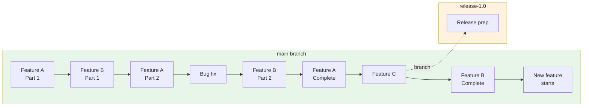
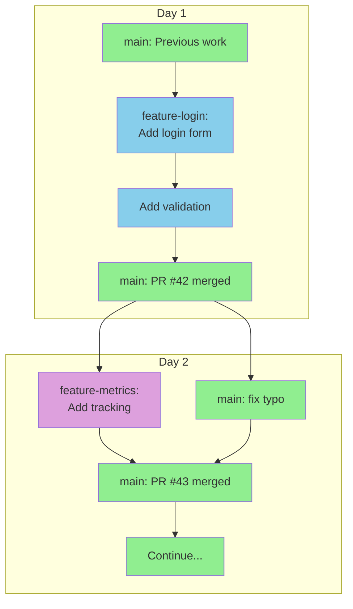
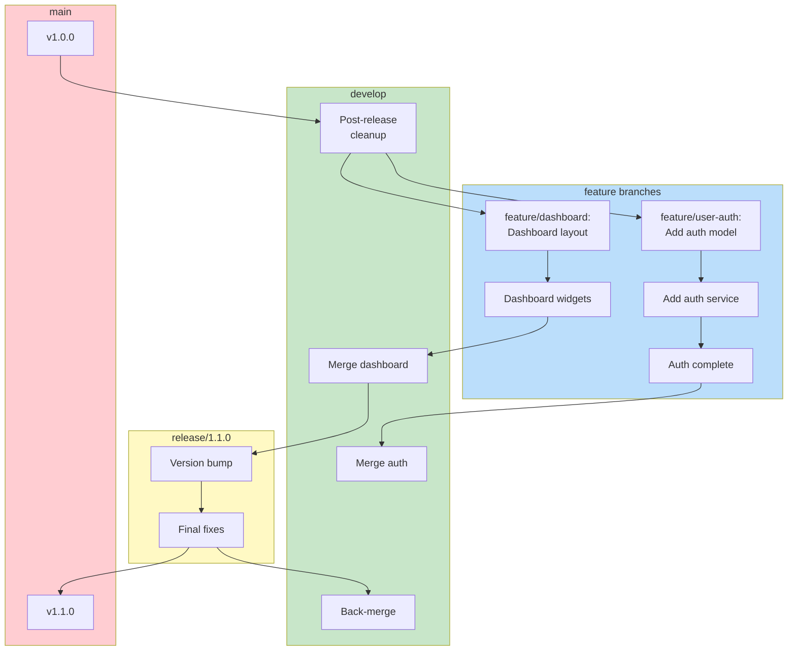
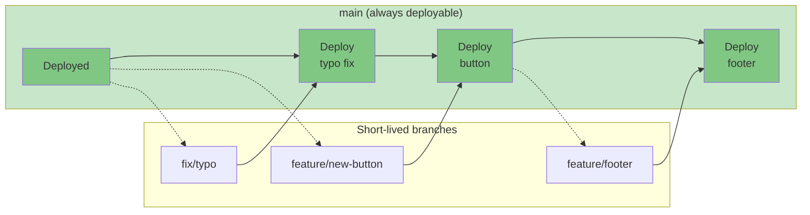
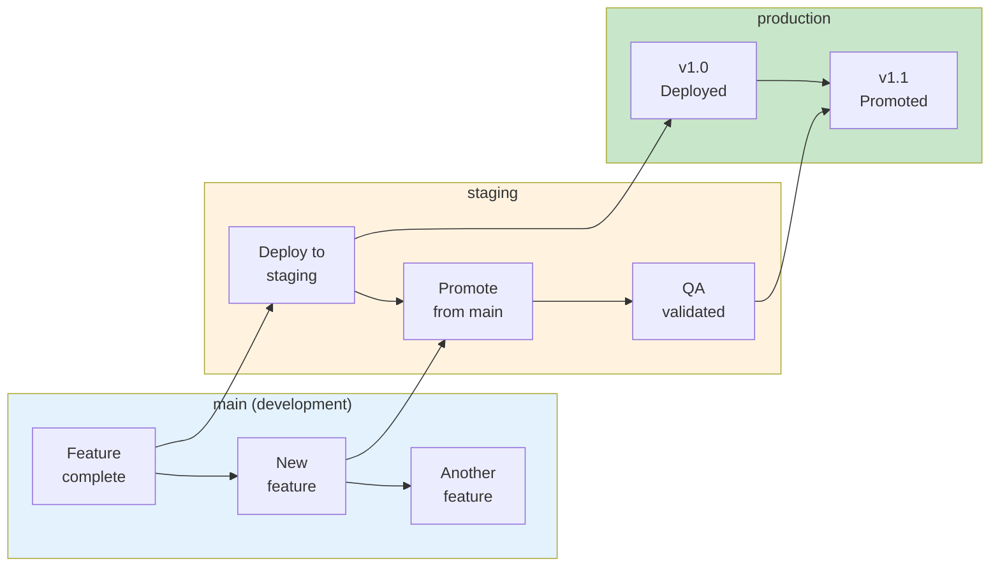
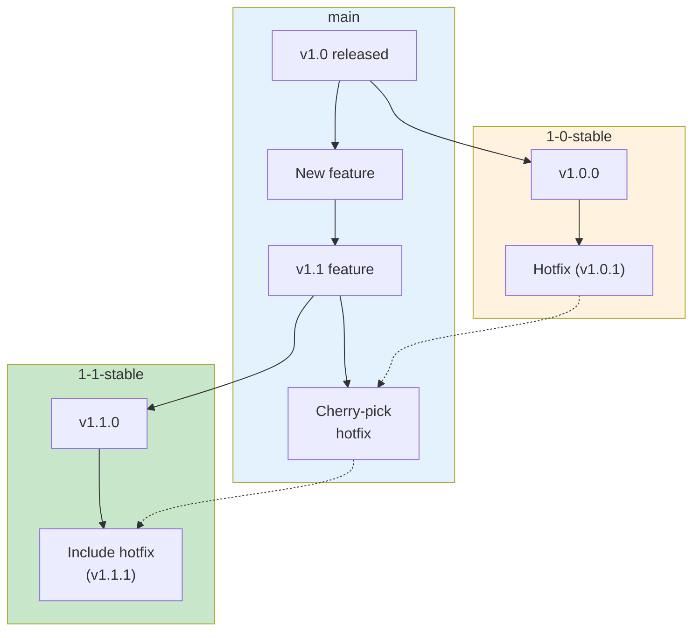
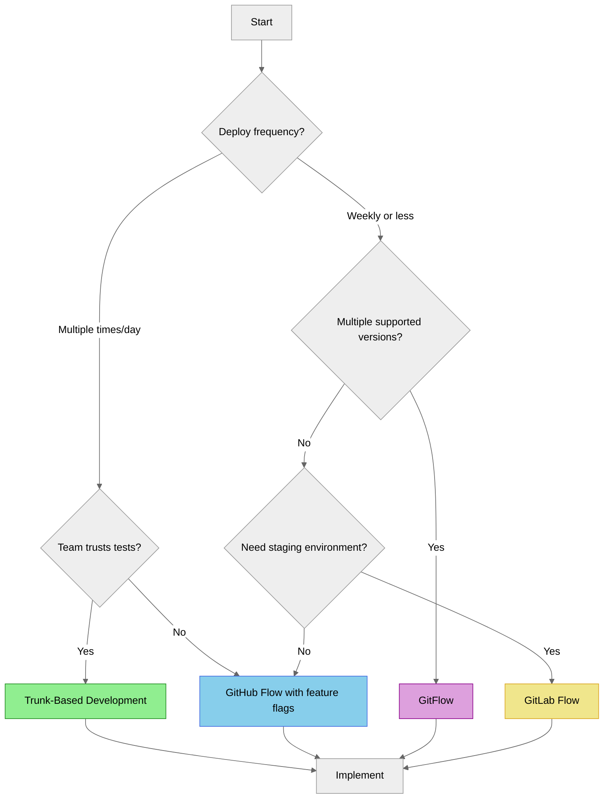
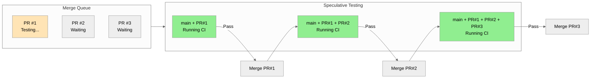

---
# Required
sidebar_position: 3
title: "Branching Strategies for CI/CD — Choose What Works for Your Team"
description: >-
  Learn how to choose the right branching strategy for your team. Covers trunk-based 
  development, GitFlow, GitHub Flow, and environment branches with real-world guidance.

# SEO
keywords:
  - branching strategy
  - trunk-based development
  - gitflow
  - github flow
  - gitlab flow
  - feature branches
  - release branches
  - ci/cd branching
  - git workflow
  - branch protection
  - merge queue
  - continuous integration branching

# Social sharing
og_title: "Branching Strategies: Finding the Right Git Workflow for Your Team"
og_description: "Trunk-based, GitFlow, or something else? Learn to choose the branching strategy that fits your team's needs."
og_image: "/img/ci-cd-social-card.svg"

# Content management
date_published: 2025-01-24
date_modified: 2025-01-24
author: shivam
reading_time: 18
content_type: explanation
---

# Branching Strategies for CI/CD

I once joined a team that had perfected the art of merge conflict resolution. They'd developed specialized tools, documented intricate procedures, and even had a rotation for "merge duty." Every Monday morning, someone spent four to six hours integrating the week's work from twelve different feature branches.

They'd accepted this as normal. "That's just how software development works," the tech lead told me.

It wasn't.

When I suggested we try trunk-based development, the reaction was immediate skepticism. "We can't merge unfinished code to main." "What about releases?" "The QA team needs stable branches to test." I heard every objection you can imagine.

Three months later, that same team was deploying to production multiple times per day. The Monday merge ritual was gone. The specialized conflict-resolution tooling gathered dust. The QA team was happier because they were testing real, integrated code instead of isolated features that broke when combined.

Here's what I learned from that experience: **your branching strategy isn't a technical decision—it's a cultural one.** The branches you create reflect how your team thinks about code ownership, risk, and collaboration. Choose a strategy that fights your culture, and you'll spend endless energy on process. Choose one that fits, and the tooling becomes invisible.

This document will help you make that choice. Not by declaring one strategy superior—they all have their place—but by giving you the framework to decide what works for your team, your release cadence, and your risk tolerance.

---

## Why Your Branching Strategy Matters

Before we dive into specific strategies, let's understand why this decision matters so much for CI/CD.

### Branching Is the Foundation of Your Pipeline

Every CI/CD pipeline starts with a trigger: something changed in the repository. The branching strategy determines what those changes look like, how often they happen, and how they flow toward production.

Consider two teams:
- **Team A** uses long-lived feature branches. Their pipeline runs on each branch, but integration only happens when features merge to main—sometimes weeks after development started.
- **Team B** commits directly to main with small, incremental changes. Their pipeline runs on every commit, catching integration issues within minutes.

Same pipeline definition. Same tools. Completely different outcomes. Team A discovers integration bugs days or weeks after they're introduced. Team B finds them immediately. The branching strategy—not the CI tool—created that difference.

### The Hidden Cost of Branch Proliferation

Every branch you create is a promise: "I will eventually merge this back." Every day that branch lives, it drifts further from the main codebase. The merge debt compounds.

I've seen teams with hundreds of stale branches. Feature branches from developers who left the company. Experiment branches that nobody remembers starting. Release branches that should have been deleted months ago. Each one represents cognitive overhead, potential confusion, and occasionally, painful archaeology when someone tries to understand the repository's history.

**The best branching strategy is the one that minimizes the number of long-lived branches while still meeting your operational needs.** Not because branches are bad, but because every branch represents divergence that must eventually be reconciled.

### Integration Frequency Determines CI Effectiveness

Here's a truth that took me years to internalize: Continuous Integration isn't continuous if you're only integrating once a week.

The "integration" in CI means bringing code together—your changes with everyone else's. If your branching strategy encourages long-lived, isolated branches, you're not doing CI regardless of how many Jenkins jobs you're running. You're doing periodic integration with automated builds.

This isn't pedantry. It has real consequences. Studies from DORA (DevOps Research and Assessment) consistently show that high-performing teams integrate code more frequently. The correlation is strong: shorter-lived branches correlate with higher deployment frequency, lower change failure rates, and faster recovery times.

---

## The Major Branching Strategies

Let's examine each major strategy in detail: how it works, when it shines, and where it struggles.

### Trunk-Based Development

Trunk-based development is the oldest approach to version control, predating even Git itself. The core principle is simple: everyone commits to a single shared branch (the "trunk," typically called `main` or `master`), and that branch is always in a releasable state.



#### How It Works

Developers work in small increments, pushing directly to main multiple times per day. Each commit should be small enough to understand at a glance, tested thoroughly, and safe to deploy. If a feature takes longer than a day or two, it's broken into smaller pieces or hidden behind a feature flag until complete.

The key disciplines are:
- **Small commits**: Each change should be reviewable in minutes, not hours
- **Feature flags**: Incomplete features are hidden from users until ready
- **Comprehensive testing**: Main must always be deployable, so tests run on every commit
- **Fast builds**: If CI takes an hour, developers won't integrate frequently

#### The Short-Lived Branch Variant

Pure trunk-based development—committing directly to main—terrifies many teams. A common compromise uses short-lived feature branches that exist for hours, not days:



The branch provides a place for code review without breaking main, but the expectation is clear: branches live for one day, maybe two. Anything longer requires justification.

#### When Trunk-Based Development Shines

- **High-trust teams** where developers can commit without extensive review
- **Mature testing practices** where the test suite catches regressions quickly
- **Continuous deployment** where every commit can realistically go to production
- **Web applications** where rollback is fast and consequences of bugs are recoverable
- **Small to medium teams** (up to ~30 developers) where coordination overhead is manageable

#### When It Struggles

- **Regulated environments** where every change requires documented approval before deployment
- **Teams without test coverage** where broken code regularly reaches main
- **Large, distributed teams** where time zones make synchronous coordination difficult
- **Mobile apps** where bad releases can't be instantly rolled back
- **Junior-heavy teams** who need the safety net of review before integration

#### The Cultural Requirement

**Trunk-based development requires a culture of ownership and quality.** When anyone can break main, everyone must care about not breaking it. This sounds obvious, but it's genuinely hard. It requires psychological safety (admitting mistakes quickly), technical discipline (running tests before pushing), and organizational support (not punishing people for honest errors).

If your team blames individuals for build breaks rather than treating them as system failures, trunk-based development will not work. The first person to break main will become terrified of committing, defeating the entire purpose.

---

### GitFlow

GitFlow emerged in 2010 as a reaction to the chaos many teams experienced with unstructured branching. It prescribes specific branches for specific purposes, creating a predictable flow from development to production.



#### The Branch Types

GitFlow defines five types of branches:

| Branch | Purpose | Lifetime | Branches From | Merges To |
|--------|---------|----------|---------------|-----------|
| `main` | Production-ready code | Permanent | — | — |
| `develop` | Integration branch for features | Permanent | `main` | `release/*` |
| `feature/*` | New features | Days to weeks | `develop` | `develop` |
| `release/*` | Release preparation | Days | `develop` | `main` and `develop` |
| `hotfix/*` | Emergency production fixes | Hours to days | `main` | `main` and `develop` |

#### How It Works

1. **Feature development**: Developers create `feature/*` branches from `develop`, work on their features, and merge back when complete.
2. **Release preparation**: When enough features accumulate, a `release/*` branch is created from `develop`. Only bug fixes go into this branch—no new features.
3. **Release**: The release branch is merged to `main` and tagged. It's also merged back to `develop` to include any release fixes.
4. **Hotfixes**: If production needs an emergency fix, a `hotfix/*` branch is created from `main`, fixed, and merged to both `main` and `develop`.

#### When GitFlow Shines

- **Packaged software** with discrete versions (desktop apps, libraries, mobile apps)
- **Teams with a separate QA phase** where testers need a stable branch to validate
- **Multiple supported versions** where customers run different releases
- **Scheduled releases** with a defined release cadence (monthly, quarterly)
- **Compliance requirements** that mandate separation between development and release code

#### When It Struggles

- **Continuous deployment** where the release branch ceremony becomes pure overhead
- **Web applications** where "releases" happen many times per day
- **Small teams** where the process overhead exceeds the benefits
- **Fast-moving products** where the develop-to-main delay causes integration pain

#### The Hidden Costs

GitFlow's structure brings real overhead:

1. **Merge complexity**: Changes flow through multiple branches, creating multiple merge points. A feature goes from `feature/*` → `develop` → `release/*` → `main`. Each merge is a potential conflict.

2. **Stale branches**: The `develop` branch can drift significantly from `main` between releases. If a release takes two weeks, `develop` accumulates two weeks of changes that aren't in production.

3. **Hotfix coordination**: When you hotfix `main`, you must also merge that fix to `develop` and any active `release/*` branches. Miss one, and you'll reintroduce the bug.

4. **Cognitive load**: Developers must understand where they should branch from and merge to in each situation. New team members often get this wrong.

I've seen teams adopt GitFlow because it looked structured and professional, only to abandon it six months later because the overhead wasn't justified for their deployment frequency. **GitFlow is designed for a specific release model. If your model doesn't match, the process fights you.**

---

### GitHub Flow

GitHub Flow emerged as a simpler alternative to GitFlow, optimized for continuous deployment and web applications. It has only one rule: the `main` branch is always deployable.



#### How It Works

1. **Create a branch**: Branch from `main` with a descriptive name
2. **Make commits**: Add your changes with meaningful commits
3. **Open a pull request**: Request review from teammates
4. **Discuss and review**: Address feedback, add more commits if needed
5. **Deploy to staging**: Optionally deploy the branch to a preview environment
6. **Merge and deploy**: Once approved, merge to `main` and deploy to production

That's it. No develop branch. No release branches. No hotfix branches. Just `main` and short-lived feature branches.

#### When GitHub Flow Shines

- **Web applications** with continuous deployment
- **Small to medium teams** who don't need complex release orchestration
- **High deployment frequency** where releases happen daily or more
- **Products with good rollback capability** where mistakes can be quickly undone
- **Teams prioritizing simplicity** who want minimal process overhead

#### When It Struggles

- **Multiple production versions**: If you support v1.x and v2.x simultaneously, you need more structure
- **Long QA cycles**: If testing takes days, feature branches become long-lived
- **Regulated deployments**: If production deploys need scheduled approval, the "deploy after merge" model breaks down

#### The Key Discipline

GitHub Flow requires one non-negotiable discipline: **main must always be deployable.** Every merge is an implicit statement that this code is ready for users.

This sounds simple but has profound implications:
- Tests must pass before merge (enforced via branch protection)
- Code review must happen before merge
- Large features need feature flags, not long-lived branches
- If main breaks, fixing it is the team's top priority

Teams that adopt GitHub Flow without this discipline end up with a `main` branch that's perpetually broken, which is worse than GitFlow's ceremony.

---

### GitLab Flow

GitLab Flow sits between GitFlow's complexity and GitHub Flow's simplicity. It adds environment branches to GitHub Flow, creating a natural path from development through staging to production.



#### The Environment Branch Model

In GitLab Flow, branches represent environments:

| Branch | Represents | Deploys To |
|--------|------------|------------|
| `main` | Latest development | Development environment |
| `staging` | Pre-production | Staging environment |
| `production` | Live code | Production environment |

Code flows downstream: `main` → `staging` → `production`. Merges always go in this direction, never upstream.

#### When GitLab Flow Shines

- **Multi-environment deployments** where code must pass through staging before production
- **Teams with QA validation** who need a stable environment to test before release
- **Gradual rollouts** where you want to bake changes in staging before production
- **Organizations requiring deployment approval** at each environment boundary

#### The Variation: Release Branches

For versioned software, GitLab Flow offers release branches instead of environment branches:



This supports multiple active releases while keeping `main` as the source of truth.

---

## The Decision Framework

After working with dozens of teams on branching strategy, I've developed a framework for making this decision. It's not about which strategy is "best"—it's about which fits your constraints.

### Factor 1: Release Frequency

How often do you ship to production?

| Frequency | Recommended Strategy | Why |
|-----------|---------------------|-----|
| Multiple times daily | Trunk-based | Release branches add overhead without benefit |
| Daily to weekly | GitHub Flow | Simple process, always deployable main |
| Weekly to monthly | GitLab Flow | Environment branches match your cadence |
| Monthly or longer | GitFlow | Structured releases with preparation time |

### Factor 2: Team Size and Distribution

How many developers, and where are they?

| Team Profile | Consideration |
|--------------|---------------|
| **Small (< 10), co-located** | Trunk-based or GitHub Flow—coordination is easy |
| **Medium (10-30), mixed** | GitHub Flow with strong PR review practices |
| **Large (30+), distributed** | Consider GitLab Flow for clearer boundaries |
| **Multiple teams, one repo** | Consider GitFlow or environment branches for isolation |

### Factor 3: Risk Tolerance

What happens when bugs reach production?

| Risk Profile | Strategy Implication |
|--------------|---------------------|
| **Web app, easy rollback** | Trunk-based is safe—mistakes are recoverable |
| **Mobile app, slow updates** | GitFlow or GitLab Flow—bugs persist for app review cycles |
| **Financial/healthcare** | Environment branches with mandatory staging validation |
| **Consumer IoT/firmware** | GitFlow with extensive release testing—bugs may be permanent |

### Factor 4: Testing Maturity

How much do you trust your test suite?

| Testing Maturity | Strategy Implication |
|------------------|---------------------|
| **High coverage, fast feedback** | Trunk-based is viable—tests catch problems |
| **Moderate coverage** | Short-lived branches with CI on every PR |
| **Low coverage** | Longer-lived branches with manual QA—you need humans |
| **No automated tests** | Any strategy will hurt—fix testing first |

### Factor 5: Compliance Requirements

What does your regulatory environment demand?

| Requirement | Strategy Implication |
|-------------|---------------------|
| **No formal requirements** | Choose based on other factors |
| **Audit trail needed** | Any strategy works with good commit hygiene |
| **Separation of duties** | Environment branches with different approvers per stage |
| **Change Advisory Board** | Release branches that can wait for approval |

### The Decision Matrix

Here's a simplified decision path:



---

## Branch Protection and Merge Requirements

Whatever strategy you choose, branch protection rules enforce it. Without enforcement, strategies become suggestions that erode under deadline pressure.

### Essential Protection Rules

For your main branch (and any long-lived branches), enable these protections:

| Rule | Purpose | When to Require |
|------|---------|-----------------|
| **Require pull request** | No direct commits to protected branches | Always |
| **Require reviews** | At least one approval before merge | Always |
| **Require status checks** | CI must pass before merge | Always |
| **Require up-to-date branches** | Branch must include latest main | For trunk-based and GitHub Flow |
| **Require linear history** | No merge commits (rebase or squash only) | Optional, depends on preference |
| **Require signed commits** | All commits must be GPG signed | For high-security environments |

### Platform-Specific Configuration

#### GitHub Branch Protection

```yaml
# Example branch protection for main
# Configure via Settings → Branches → Branch protection rules

Branch name pattern: main

Protect matching branches:
  ✓ Require a pull request before merging
    - Required approving reviews: 1
    - Dismiss stale pull request approvals when new commits are pushed
    - Require review from Code Owners
  
  ✓ Require status checks to pass before merging
    - Require branches to be up to date before merging
    - Status checks that are required:
      - build
      - test
      - lint
  
  ✓ Require conversation resolution before merging
  
  ✓ Do not allow bypassing the above settings
```

#### GitLab Protected Branches

```yaml
# Example protected branch configuration
# Configure via Settings → Repository → Protected branches

Protected branch: main

Allowed to merge: Maintainers
Allowed to push: No one
Allowed to force push: No

Code owner approval required: Yes

# Additional merge request settings
# Configure via Settings → Merge requests

Merge method: Merge commit with semi-linear history
Merge checks:
  - Pipelines must succeed
  - All discussions must be resolved
```

### The "Require Up-to-Date" Trade-off

The "require branches to be up to date before merging" rule deserves special attention because it creates a serial bottleneck.

**With the rule enabled:**
- PR A is ready to merge
- PR B is also ready to merge
- PR A merges first
- PR B must now rebase on the updated main before it can merge
- While PR B is rebasing/re-running CI, PR C and PR D are also waiting
- This creates a queue, slowing everyone down

**Without the rule:**
- PR A and PR B can merge in quick succession
- But if they both modified the same file, you might get a broken main
- The post-merge CI run catches it, but now main is red

**My recommendation:** Enable this rule for teams new to trunk-based development or GitHub Flow. The serialization prevents broken main, which preserves trust in the process. Once your team is disciplined about small, isolated changes, you can consider disabling it to increase throughput.

---

## Merge Queues: Scaling Branch Protection

When your team grows beyond about 20 developers with high commit frequency, the "require up-to-date" bottleneck becomes painful. Merge queues solve this by automating the rebase-and-test process.

### How Merge Queues Work

Instead of merging directly, approved PRs enter a queue. The merge queue:

1. Takes the next PR in the queue
2. Rebases it on the current main
3. Runs CI on the rebased code
4. If CI passes, merges to main
5. If CI fails, removes the PR from the queue and notifies the author
6. Moves to the next PR

More sophisticated queues use **speculative merging**: they optimistically test multiple PRs in parallel, assuming earlier PRs will pass. If PR #1 fails, PRs #2 and #3 (which were tested on top of #1) are invalidated and retested.



### GitHub Merge Queue

GitHub's native merge queue (available for organizations) provides automatic batching and speculative merging:

```yaml
# Enable via Settings → General → Pull Requests
# Then configure in branch protection

Require merge queue:
  - Merge method: Squash and merge
  - Build concurrency: 5
  - Minimum group size: 1
  - Maximum group size: 10
  - Wait time for additional PRs: 5 minutes
```

Key configuration choices:
- **Build concurrency**: How many speculative builds to run in parallel
- **Group size**: How many PRs to batch together (batching amortizes CI cost but means a single failure invalidates the whole batch)
- **Wait time**: How long to wait for more PRs before starting a build

### GitLab Merge Trains

GitLab calls their merge queue "merge trains." The mental model is a train of merge requests, each car tested with all preceding cars:

```yaml
# Enable via Settings → Merge requests

Enable merge trains:
  - Pipeline to run: merge_request_pipelines
  - Maximum merge requests in train: 20
```

GitLab's merge trains automatically handle the parallel testing and invalidation.

### Mergify and Third-Party Tools

For repositories not on GitHub Enterprise or GitLab Premium, tools like Mergify provide merge queue functionality:

```yaml
# .mergify.yml
queue_rules:
  - name: default
    conditions:
      - status-success=build
      - status-success=test
    speculative_checks: 3
    batch_size: 5

pull_request_rules:
  - name: Automatic merge on approval
    conditions:
      - approved-reviews-by>=1
      - status-success=build
      - status-success=test
    actions:
      queue:
        name: default
```

### When to Introduce a Merge Queue

Merge queues add complexity. Introduce them when:
- You have more than ~15 PRs merging per day
- The serial rebase-and-test bottleneck is causing developer frustration
- Your CI pipeline is fast enough that speculative testing is practical (< 15 minutes)
- You've already optimized your pipeline and still have throughput problems

Don't introduce merge queues for teams where the bottleneck is review speed, not merge speed. A queue won't help if PRs sit waiting for approval for days.

---

## Handling Long-Lived Branches

Sometimes long-lived branches are unavoidable. Large features, experimental rewrites, or customer-specific forks might genuinely require weeks of isolated development. Here's how to minimize the pain.

### Continuous Forward Integration

The worst thing you can do with a long-lived branch is ignore main. The second-worst thing is to wait until the end to merge.

**Instead, continuously merge main into your long-lived branch:**

```bash
# On your feature branch, regularly:
git fetch origin
git merge origin/main

# Or if you prefer rebase (be careful if branch is shared):
git rebase origin/main
```

Do this daily, or more often if main is moving fast. Yes, this means you'll resolve conflicts repeatedly. But small, frequent conflict resolution is far less painful than one massive merge at the end.

### Feature Toggles for Incomplete Work

The need for long-lived branches often comes from the requirement to hide incomplete features from users. Feature toggles eliminate this need:

```python
# Instead of a long-lived branch, commit to main behind a flag
def get_checkout_flow():
    if feature_flags.is_enabled("new_checkout"):
        return new_checkout_flow()
    return legacy_checkout_flow()
```

With feature toggles, you can:
- Merge incomplete code to main daily
- Keep the new code path exercised by CI
- Enable the feature for internal users or beta testers
- Gradually roll out to production users
- Instantly disable if problems emerge

The feature toggle approach transforms a long-lived branch into many small commits, each integrated and tested continuously.

### The Strangler Fig Pattern for Large Rewrites

When you're replacing a major system component, the strangler fig pattern lets you do it incrementally:

1. Create an abstraction layer over the old system
2. Implement the new system behind the abstraction
3. Route increasing amounts of traffic to the new system
4. Eventually remove the old system

This sounds like more work than a big-bang rewrite, and it is—initially. But the risk reduction is enormous. You can stop at any point with a working system. Each increment is testable and reviewable. The integration pain is distributed over months instead of concentrated in one terrifying merge.

---

## Strategy-Specific Pipeline Patterns

Your branching strategy should inform your CI/CD pipeline design. Here's how different strategies typically configure their pipelines.

### Trunk-Based Development Pipeline

```yaml
# Example: GitHub Actions for trunk-based development
name: CI/CD

on:
  push:
    branches: [main]
  pull_request:
    branches: [main]

jobs:
  build-and-test:
    runs-on: ubuntu-latest
    steps:
      - uses: actions/checkout@v4
      - name: Build
        run: make build
      - name: Test
        run: make test
      - name: Lint
        run: make lint
  
  deploy:
    needs: build-and-test
    if: github.ref == 'refs/heads/main'
    runs-on: ubuntu-latest
    steps:
      - uses: actions/checkout@v4
      - name: Deploy to Production
        run: make deploy
```

Key characteristics:
- Same pipeline for PRs and main pushes
- Deployment happens immediately after merge to main
- No staging step (or staging happens via feature flags)

### GitFlow Pipeline

```yaml
# Example: GitLab CI for GitFlow
stages:
  - build
  - test
  - deploy

build:
  stage: build
  script:
    - make build
  rules:
    - if: $CI_MERGE_REQUEST_ID
    - if: $CI_COMMIT_BRANCH =~ /^(develop|release\/.*|hotfix\/.*|main)$/

test:
  stage: test
  script:
    - make test
  rules:
    - if: $CI_MERGE_REQUEST_ID
    - if: $CI_COMMIT_BRANCH =~ /^(develop|release\/.*|hotfix\/.*|main)$/

deploy-staging:
  stage: deploy
  script:
    - make deploy-staging
  environment: staging
  rules:
    - if: $CI_COMMIT_BRANCH =~ /^release\/.*$/
    - if: $CI_COMMIT_BRANCH == "develop"

deploy-production:
  stage: deploy
  script:
    - make deploy-production
  environment: production
  rules:
    - if: $CI_COMMIT_BRANCH == "main"
  when: manual  # Requires manual approval for production
```

Key characteristics:
- Different branches trigger different deployment targets
- Release branches deploy to staging for QA
- Production deployment from main requires manual approval
- Hotfix branches might have their own expedited path

### GitLab Flow Pipeline

```yaml
# Example: GitHub Actions for GitLab Flow (environment branches)
name: CI/CD

on:
  push:
    branches: [main, staging, production]
  pull_request:
    branches: [main]

jobs:
  build-and-test:
    runs-on: ubuntu-latest
    steps:
      - uses: actions/checkout@v4
      - name: Build
        run: make build
      - name: Test
        run: make test

  deploy-development:
    needs: build-and-test
    if: github.ref == 'refs/heads/main'
    runs-on: ubuntu-latest
    environment: development
    steps:
      - name: Deploy to Development
        run: make deploy ENV=development

  deploy-staging:
    needs: build-and-test
    if: github.ref == 'refs/heads/staging'
    runs-on: ubuntu-latest
    environment: staging
    steps:
      - name: Deploy to Staging
        run: make deploy ENV=staging

  deploy-production:
    needs: build-and-test
    if: github.ref == 'refs/heads/production'
    runs-on: ubuntu-latest
    environment: production
    steps:
      - name: Deploy to Production
        run: make deploy ENV=production
```

Key characteristics:
- Each environment has its own long-lived branch
- Merging to an environment branch triggers deployment to that environment
- Clear progression: main → staging → production

---

## Common Pitfalls and How to Avoid Them

After helping teams adopt and change branching strategies, I've seen the same mistakes repeatedly. Here's how to avoid them.

### Pitfall 1: Strategy Doesn't Match Culture

**The symptom:** Constant friction between the strategy and how people actually work. Rules are regularly bypassed. Process feels like a burden rather than a help.

**The cause:** The strategy was chosen based on what looked good on paper, not on how the team actually operates.

**The fix:** Be honest about your team's current practices and maturity. If code review takes three days, adopting trunk-based development won't magically speed that up—you'll create a backlog instead. Start with a strategy that works for today's team, then evolve as practices improve.

### Pitfall 2: Too Many Long-Lived Branches

**The symptom:** Merges are consistently painful. Developers dread the integration phase. "Merge conflict" is a common status in standup.

**The cause:** Branches live too long, accumulating divergence from main.

**The fix:** Set explicit limits. I recommend:
- Feature branches: < 2 days
- Release branches: < 2 weeks
- Anything longer: requires justification and continuous integration from main

Track branch age in your metrics. If the average branch lives longer than a few days, investigate why.

### Pitfall 3: Branch Protection Doesn't Match Strategy

**The symptom:** Protected branches exist but don't enforce what the strategy requires. Direct pushes to main happen "just this once." Reviews are bypassed for "urgent" fixes.

**The cause:** Protection rules were set up but not comprehensive, or exception mechanisms are too easy to use.

**The fix:** Review your protection rules quarterly. Ensure they match your documented strategy. Make bypassing protection genuinely difficult—require admin approval and create an audit trail. If bypasses happen regularly, either strengthen protection or acknowledge that your actual strategy differs from your documented one.

### Pitfall 4: Ignoring Merge Queue Needs

**The symptom:** Developers complain about waiting hours to merge. CI runs the same tests repeatedly after rebases. Productivity drops even though individual PRs are small.

**The cause:** Team has grown beyond what serial merging can handle, but no merge queue is in place.

**The fix:** If you have more than ~15 PRs per day and developers are frustrated by merge waits, implement a merge queue. The ROI is immediate.

### Pitfall 5: Not Adapting the Strategy Over Time

**The symptom:** The branching strategy that worked when the team was 5 people is causing pain now that the team is 50. Or the GitFlow process from when you released quarterly feels heavyweight now that you want to release weekly.

**The cause:** Strategies weren't reconsidered as the team and product evolved.

**The fix:** Schedule a quarterly retrospective specifically about branching and CI/CD practices. Ask: "What's causing us pain? What would we do differently if starting fresh?" Be willing to evolve.

---

## Measuring Branching Strategy Effectiveness

How do you know if your branching strategy is working? These metrics help:

### Branch Lifetime

Track how long branches exist before merging:

| Metric | Target (Trunk/GitHub Flow) | Target (GitFlow) |
|--------|---------------------------|------------------|
| Median branch lifetime | < 1 day | < 1 week |
| 95th percentile branch lifetime | < 3 days | < 3 weeks |
| Branches older than 1 month | 0 | < 5 |

Long-lived branches indicate integration isn't happening frequently enough.

### Merge Conflict Frequency

Track how often merges require manual conflict resolution:

| Metric | Healthy | Investigate |
|--------|---------|-------------|
| PRs with merge conflicts | < 10% | > 25% |
| Time spent on conflict resolution | Negligible | "We have merge duty" |

High conflict rates suggest branches diverge too much before integration.

### Time to Merge

Track from PR creation to merge:

| Metric | Target |
|--------|--------|
| Median time to merge | < 4 hours |
| 95th percentile time to merge | < 24 hours |

Long merge times often indicate review bottlenecks, not branching problems—but they affect how well any branching strategy can work.

### CI Success Rate on Main

| Metric | Target |
|--------|--------|
| Main branch CI success rate | > 99% |
| Time to fix broken main | < 30 minutes |

If main breaks frequently, your branch protection isn't working, or tests aren't catching problems.

---

## Transitioning Between Strategies

Changing branching strategies is disruptive but sometimes necessary. Here's how to do it safely.

### The Gradual Transition

Don't flip overnight. Instead:

1. **Document the current state**: What branches exist? What are their purposes? Who uses them?
2. **Define the target state**: What branches will exist after the transition? What are the new rules?
3. **Create a migration plan**: Which branches need to be merged or archived? What process changes are needed?
4. **Communicate extensively**: Everyone needs to understand both the what and the why
5. **Run a pilot**: One team or one repository tries the new strategy first
6. **Expand gradually**: Add more teams/repos as confidence builds
7. **Clean up legacy**: Archive or delete branches from the old strategy

### Example: GitFlow to GitHub Flow

A common transition as teams increase deployment frequency:

**Week 1-2: Preparation**
- Merge all active `feature/*` branches to `develop`
- Merge `develop` to `main` and release
- Communicate the change to all developers

**Week 3-4: Transition**
- Archive the `develop` branch (don't delete—keep for reference)
- Configure branch protection on `main`
- All new work uses short-lived branches from `main`
- Monitor for confusion or process breaks

**Week 5+: Stabilization**
- Remove GitFlow tooling
- Update documentation
- Retrospective: what went well, what needs adjustment?

### The Key to Successful Transitions

**Communicate the "why" relentlessly.** Developers will resist if they see only process change without understanding the benefit. Explain:
- What problems the current strategy causes
- How the new strategy addresses those problems
- What's expected of them during and after transition
- Who to ask when they're unsure

---

## Real-World Decision Examples

Let me share a few scenarios I've encountered and how we decided on branching strategies.

### Scenario 1: Fast-Moving Startup, 8 Developers

**Context:** Early-stage startup, moving fast, deploying to a web application multiple times daily. Small team, high trust, good test coverage.

**Decision:** Trunk-based development with short-lived branches for code review.

**Rationale:** With only 8 developers and a good test suite, merge complexity wasn't a concern. The team valued speed over ceremony. Feature flags handled incomplete work.

**Outcome:** The team maintained 10+ deploys per day with excellent stability. The simplicity let developers focus on features rather than process.

### Scenario 2: Mobile App Team, Monthly Releases

**Context:** Mobile app with separate iOS and Android teams (12 developers total). App store releases took 3-5 days for review. Bugs in released versions couldn't be easily fixed.

**Decision:** GitFlow with a simplified feature branch model.

**Rationale:** The app store release cycle made GitFlow's release branches natural. The team needed time to stabilize releases before submission. Feature branches gave developers space to work without blocking each other.

**Outcome:** Release quality improved significantly. The QA team had a stable `release/*` branch to test. The overhead was worth it given the difficulty of fixing released bugs.

### Scenario 3: Enterprise Platform, Compliance Requirements

**Context:** Financial services platform, 40 developers across multiple teams, SOC 2 compliance, regulated deployment process.

**Decision:** GitLab Flow with environment branches and mandatory staging validation.

**Rationale:** Compliance required documented progression through environments. Different teams needed to deploy at different paces. Environment branches provided clear audit trails.

**Outcome:** Audit preparation became much simpler—the git history showed exactly how code progressed from development to production. Teams could deploy independently within the framework.

---

## What's Next?

You now understand the major branching strategies, when to use each, and how to enforce your choice through branch protection and merge queues.

The strategy you choose affects how you version and release software. With GitFlow, releases are explicit events with their own branches and preparation rituals. With trunk-based development, every commit is potentially a release, and versioning becomes about tagging what's already deployed.

The next document in this series covers **Versioning and Releases**—semantic versioning, changelogs, release candidates, and automating the release process. Whether you're releasing daily or quarterly, you'll learn how to version software in a way that communicates clearly to users and maintainers.

**Ready to master versioning and release management?** Continue to [Versioning & Releases →](./versioning-releases)

---

## Quick Reference

### Strategy Comparison

| Factor | Trunk-Based | GitHub Flow | GitLab Flow | GitFlow |
|--------|-------------|-------------|-------------|---------|
| **Complexity** | Low | Low | Medium | High |
| **Best for** | Continuous deployment | Web apps | Multi-environment | Packaged software |
| **Long-lived branches** | Only main | Only main | main + environments | main + develop |
| **Release branches** | No | No | Optional | Yes |
| **Feature flags required** | Yes | Helpful | Optional | No |
| **Team size** | Any (small ideal) | Small-medium | Any | Medium-large |
| **Deploy frequency** | Multiple/day | Daily | Weekly | Monthly+ |

### Branch Protection Checklist

For your main branch, at minimum:
- [ ] Require pull request before merging
- [ ] Require at least one approval
- [ ] Require CI status checks to pass
- [ ] Consider requiring branches to be up-to-date
- [ ] Enable signed commits if security is critical

### Warning Signs Your Strategy Needs Review

- Merge conflicts are a regular complaint
- Developers dread "merge day"
- PRs sit for days waiting to be rebased
- Main branch is frequently broken
- Nobody remembers what half the branches are for
- The documented process differs from actual practice

---

**Remember:** The best branching strategy is the one your team actually follows. Start simple, measure the pain points, and evolve as your needs change.
