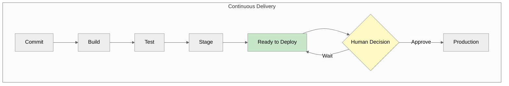
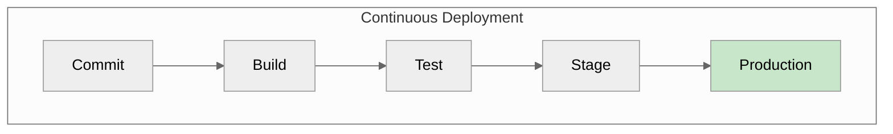
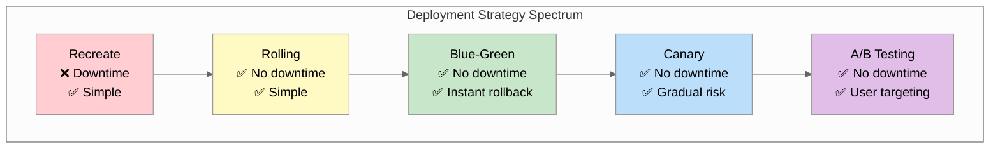
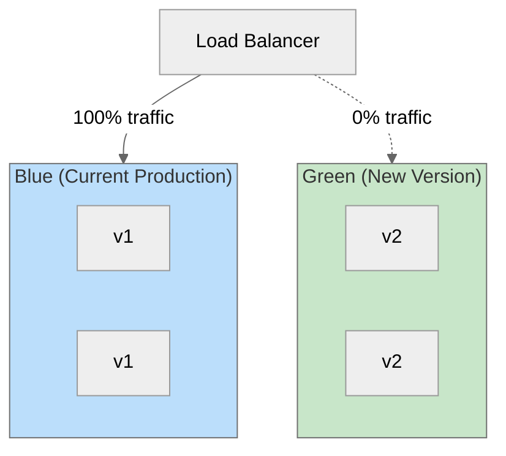
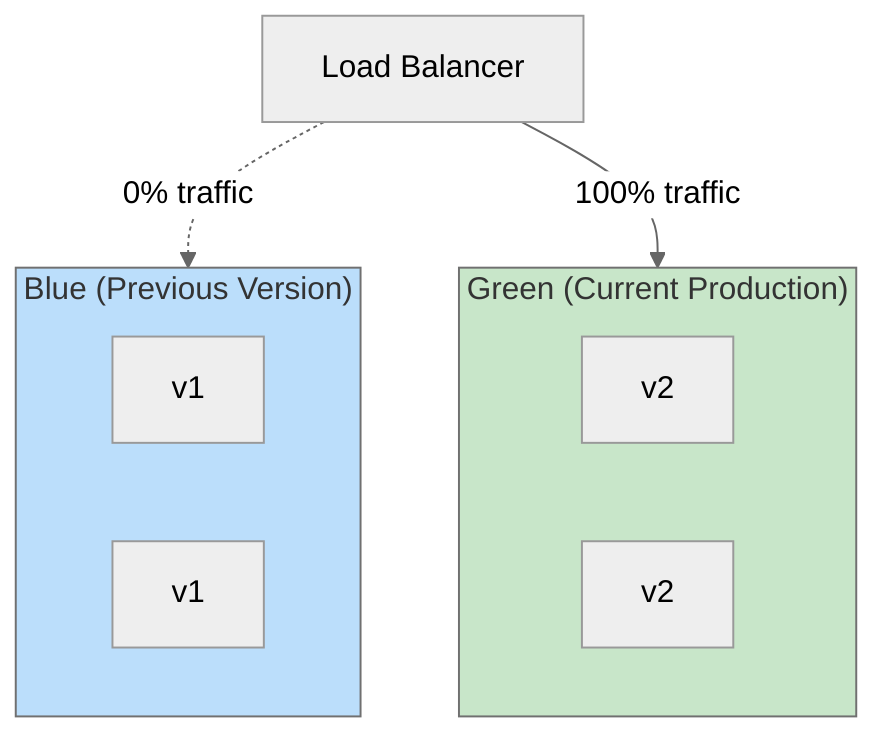
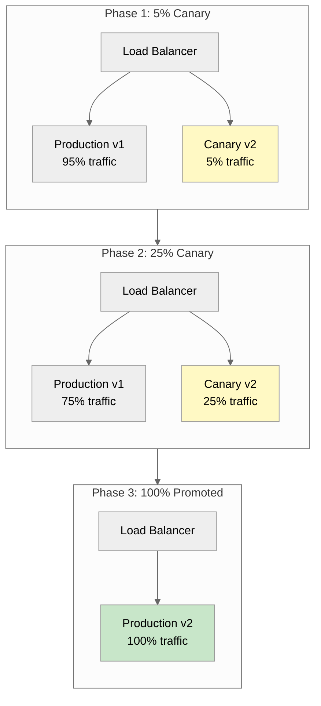
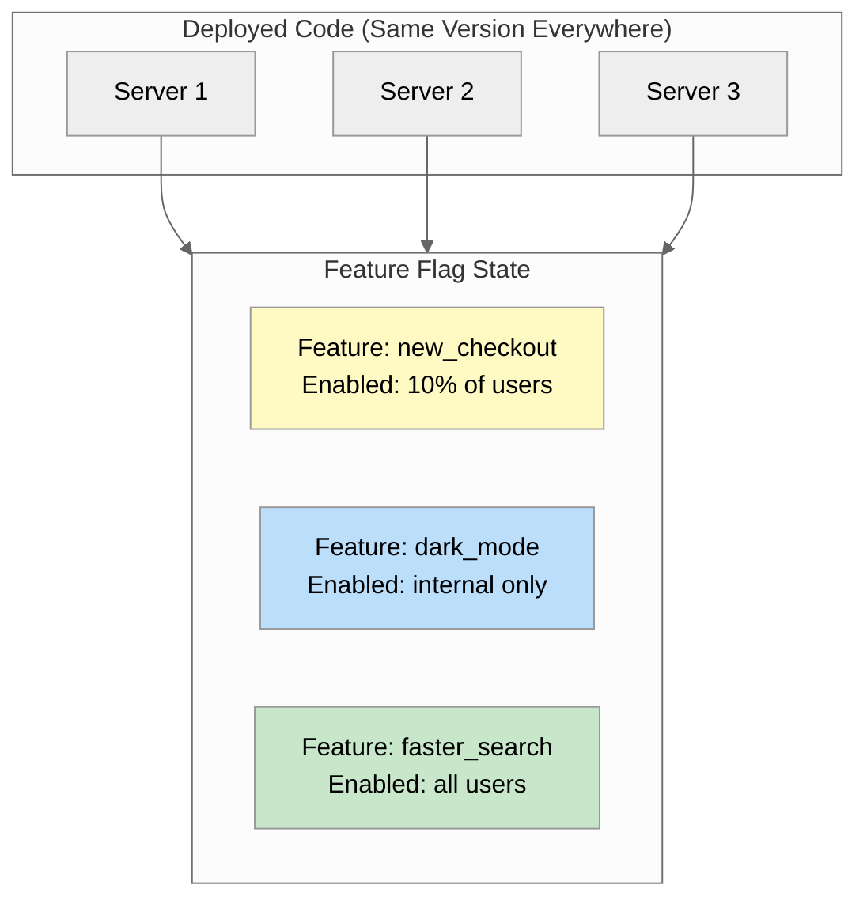
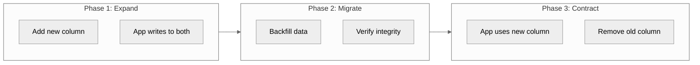
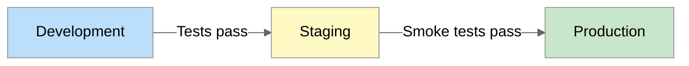

---
# Required
sidebar_position: 8
title: "Deployment Strategies and Rollouts — Ship with Confidence"
description: >-
  Master deployment strategies for production: rolling deployments, blue-green, canary 
  releases, and feature flags. Learn rollback patterns, database migrations, environment 
  management, and progressive delivery.

# SEO
keywords:
  - deployment strategies
  - rolling deployment
  - blue-green deployment
  - canary release
  - feature flags
  - progressive delivery
  - rollback
  - zero downtime deployment
  - database migrations
  - environment promotion
  - deployment automation
  - release management
  - a/b testing

# Social sharing
og_title: "Deployment Strategies: Rolling, Blue-Green, Canary, and Beyond"
og_description: "Learn when to use each deployment strategy and how to implement them for zero-downtime, confident releases."
og_image: "/img/ci-cd-social-card.png"

# Content management
date_published: 2025-01-24
date_modified: 2025-01-24
author: shivam
reading_time: 24
content_type: explanation
---

# Deployment Strategies and Rollouts

The most stressful deployment I ever witnessed wasn't because of bad code—it was because we had exactly one way to deploy: replace everything at once and pray.

We were rolling out a major update to an internal platform at NVIDIA, and the deployment strategy was simple: stop the old version, start the new version. In theory, this took about 30 seconds. In practice, those 30 seconds felt like hours. If something went wrong—if the new version crashed, if a configuration was wrong, if a dependency was missing—we had no way to serve traffic while we fixed it. Users would see errors. Leadership would get alerts. Engineers would panic.

That particular deployment hit a database connection issue we hadn't seen in staging. The new version couldn't connect to the database. The old version was already stopped. We had 200 engineers staring at error pages while we frantically debugged. It took 12 minutes to diagnose the issue and roll back. Twelve minutes of complete outage for something that should have been a routine update.

That incident changed how I think about deployments. The problem wasn't the bug—bugs happen. The problem was that our deployment strategy had no safety net. We were doing trapeze acts without a net, and eventually, we fell.

This document is about building that safety net. About deployment strategies that let you ship frequently without fear. About catching problems before they affect all your users. About making rollbacks instantaneous instead of panic-inducing.

---

## Continuous Delivery vs. Continuous Deployment

Before we dive into strategies, let's clarify these often-confused terms.

**Continuous Delivery** means every commit that passes tests is *deployable*. A human decides when to actually deploy.

**Continuous Deployment** means every commit that passes tests is *deployed*. No human decision—code flows automatically to production.





**Which should you choose?**

| Factor | Continuous Delivery | Continuous Deployment |
|--------|--------------------|-----------------------|
| **Trust in tests** | Medium | Very high |
| **Rollback speed** | Must be fast | Must be instant |
| **Release coordination** | Sometimes needed | Must be unnecessary |
| **Regulatory requirements** | Often required | May be prohibited |
| **Risk tolerance** | Moderate | High |

Most teams start with Continuous Delivery and evolve toward Continuous Deployment as their testing, monitoring, and rollback capabilities mature.

---

## The Deployment Strategy Spectrum

Deployment strategies trade off between complexity, risk, and resource usage.



Let me walk through each one in detail.

---

## Rolling Deployments

Rolling deployments gradually replace old instances with new ones. At any moment during deployment, some instances run the old version and some run the new version.

```mermaid
%%{init: {'theme': 'neutral'}}%%
flowchart TB
    subgraph t1["Time 1: Start"]
        direction LR
        A1[v1] 
        A2[v1] 
        A3[v1] 
        A4[v1]
    end
    
    subgraph t2["Time 2: 25% Deployed"]
        direction LR
        B1[v2] 
        B2[v1] 
        B3[v1] 
        B4[v1]
    end
    
    subgraph t3["Time 3: 50% Deployed"]
        direction LR
        C1[v2] 
        C2[v2] 
        C3[v1] 
        C4[v1]
    end
    
    subgraph t4["Time 4: Complete"]
        direction LR
        D1[v2] 
        D2[v2] 
        D3[v2] 
        D4[v2]
    end
    
    t1 --> t2 --> t3 --> t4
    
    style A1 fill:#ffcdd2
    style A2 fill:#ffcdd2
    style A3 fill:#ffcdd2
    style A4 fill:#ffcdd2
    style B1 fill:#c8e6c9
    style B2 fill:#ffcdd2
    style B3 fill:#ffcdd2
    style B4 fill:#ffcdd2
    style C1 fill:#c8e6c9
    style C2 fill:#c8e6c9
    style C3 fill:#ffcdd2
    style C4 fill:#ffcdd2
    style D1 fill:#c8e6c9
    style D2 fill:#c8e6c9
    style D3 fill:#c8e6c9
    style D4 fill:#c8e6c9
```



### How It Works

1. New version is deployed to a subset of instances
2. Health checks verify the new instances are working
3. Old instances are terminated
4. Process repeats until all instances run the new version

### Kubernetes Rolling Update

```yaml
apiVersion: apps/v1
kind: Deployment
metadata:
  name: myapp
spec:
  replicas: 4
  strategy:
    type: RollingUpdate
    rollingUpdate:
      maxUnavailable: 1    # At most 1 pod down during update
      maxSurge: 1          # At most 1 extra pod during update
  template:
    spec:
      containers:
        - name: myapp
          image: myapp:v2
          readinessProbe:
            httpGet:
              path: /health
              port: 8080
            initialDelaySeconds: 5
            periodSeconds: 5
```

### When to Use Rolling Deployments

**Good for:**
- Stateless services
- When brief version mixing is acceptable
- Resource-constrained environments
- Simple, frequent deployments

**Challenges:**
- Database schema changes (both versions must work with both schemas)
- API breaking changes (clients may hit either version)
- Rollback requires another full rolling update

### Rolling Deployment Configuration

Key parameters to tune:

| Parameter | Effect | Trade-off |
|-----------|--------|-----------|
| **maxUnavailable** | How many can be down simultaneously | Lower = safer but slower |
| **maxSurge** | How many extra can run during update | Higher = faster but more resources |
| **minReadySeconds** | Wait time after health check passes | Higher = safer but slower |

```yaml
# Conservative: prioritize safety
strategy:
  rollingUpdate:
    maxUnavailable: 0    # Never reduce capacity
    maxSurge: 1          # Only one extra at a time

# Aggressive: prioritize speed
strategy:
  rollingUpdate:
    maxUnavailable: 25%  # Can reduce capacity temporarily
    maxSurge: 25%        # Can use extra capacity
```

---

## Blue-Green Deployments

Blue-green maintains two identical environments: "blue" (current production) and "green" (new version). You deploy to green while blue continues serving traffic, then switch traffic instantaneously.



After switch:



### How It Works

1. Green environment is provisioned with the new version
2. Smoke tests run against green
3. Traffic is switched from blue to green
4. Blue remains on standby for rollback
5. After confidence period, blue is updated or decommissioned

### Implementation with Kubernetes

```yaml
# Blue deployment (current)
apiVersion: apps/v1
kind: Deployment
metadata:
  name: myapp-blue
  labels:
    app: myapp
    version: blue
spec:
  replicas: 3
  selector:
    matchLabels:
      app: myapp
      version: blue
  template:
    metadata:
      labels:
        app: myapp
        version: blue
    spec:
      containers:
        - name: myapp
          image: myapp:v1
---
# Green deployment (new version)
apiVersion: apps/v1
kind: Deployment
metadata:
  name: myapp-green
  labels:
    app: myapp
    version: green
spec:
  replicas: 3
  selector:
    matchLabels:
      app: myapp
      version: green
  template:
    metadata:
      labels:
        app: myapp
        version: green
    spec:
      containers:
        - name: myapp
          image: myapp:v2
---
# Service pointing to blue
apiVersion: v1
kind: Service
metadata:
  name: myapp
spec:
  selector:
    app: myapp
    version: blue  # Switch to 'green' to cutover
  ports:
    - port: 80
      targetPort: 8080
```

**Switch traffic:**

```bash
# Update service selector to point to green
kubectl patch service myapp -p '{"spec":{"selector":{"version":"green"}}}'
```

**Rollback:**

```bash
# Switch back to blue
kubectl patch service myapp -p '{"spec":{"selector":{"version":"blue"}}}'
```

### When to Use Blue-Green

**Good for:**
- Zero-downtime deployments
- Instant rollback capability
- Full testing of new version before exposure
- Database migrations (with proper planning)

**Challenges:**
- Requires double the infrastructure during deployment
- Database must support both versions
- Stateful services need special handling

### Blue-Green with Cloud Load Balancers

**AWS Application Load Balancer:**

```yaml
# Switch via target group weights
- name: Switch traffic to green
  run: |
    aws elbv2 modify-listener \
      --listener-arn $LISTENER_ARN \
      --default-actions '[{
        "Type": "forward",
        "TargetGroupArn": "'$GREEN_TARGET_GROUP_ARN'"
      }]'
```

**Google Cloud:**

```yaml
- name: Switch traffic
  run: |
    gcloud compute url-maps set-default-service $URL_MAP \
      --default-service=$GREEN_BACKEND_SERVICE
```

---

## Canary Releases

Canary releases send a small percentage of traffic to the new version, monitor for problems, then gradually increase the percentage.



### How It Works

1. Deploy new version alongside existing
2. Route small percentage of traffic to canary
3. Monitor metrics (error rates, latency, etc.)
4. If metrics are good, increase traffic percentage
5. If metrics degrade, roll back immediately
6. Continue until 100% traffic on new version

### Kubernetes Canary with Ingress

```yaml
# Production deployment
apiVersion: apps/v1
kind: Deployment
metadata:
  name: myapp-stable
spec:
  replicas: 9
  selector:
    matchLabels:
      app: myapp
      track: stable
  template:
    metadata:
      labels:
        app: myapp
        track: stable
    spec:
      containers:
        - name: myapp
          image: myapp:v1
---
# Canary deployment
apiVersion: apps/v1
kind: Deployment
metadata:
  name: myapp-canary
spec:
  replicas: 1  # 10% of total (1 out of 10)
  selector:
    matchLabels:
      app: myapp
      track: canary
  template:
    metadata:
      labels:
        app: myapp
        track: canary
    spec:
      containers:
        - name: myapp
          image: myapp:v2
---
# Service selecting both
apiVersion: v1
kind: Service
metadata:
  name: myapp
spec:
  selector:
    app: myapp  # Matches both stable and canary
  ports:
    - port: 80
```

### Canary with Nginx Ingress Annotations

```yaml
# Stable ingress
apiVersion: networking.k8s.io/v1
kind: Ingress
metadata:
  name: myapp-stable
spec:
  rules:
    - host: myapp.example.com
      http:
        paths:
          - path: /
            pathType: Prefix
            backend:
              service:
                name: myapp-stable
                port:
                  number: 80
---
# Canary ingress with traffic split
apiVersion: networking.k8s.io/v1
kind: Ingress
metadata:
  name: myapp-canary
  annotations:
    nginx.ingress.kubernetes.io/canary: "true"
    nginx.ingress.kubernetes.io/canary-weight: "10"  # 10% to canary
spec:
  rules:
    - host: myapp.example.com
      http:
        paths:
          - path: /
            pathType: Prefix
            backend:
              service:
                name: myapp-canary
                port:
                  number: 80
```

### Automated Canary with Argo Rollouts

Argo Rollouts provides sophisticated canary automation:

```yaml
apiVersion: argoproj.io/v1alpha1
kind: Rollout
metadata:
  name: myapp
spec:
  replicas: 10
  strategy:
    canary:
      steps:
        - setWeight: 5
        - pause: {duration: 5m}
        - setWeight: 20
        - pause: {duration: 5m}
        - setWeight: 50
        - pause: {duration: 5m}
        - setWeight: 100
      canaryService: myapp-canary
      stableService: myapp-stable
      analysis:
        templates:
          - templateName: success-rate
        startingStep: 1  # Start analysis after first step
  template:
    spec:
      containers:
        - name: myapp
          image: myapp:v2
---
# Analysis template for automated rollback
apiVersion: argoproj.io/v1alpha1
kind: AnalysisTemplate
metadata:
  name: success-rate
spec:
  metrics:
    - name: success-rate
      interval: 60s
      successCondition: result[0] >= 0.95
      failureLimit: 3
      provider:
        prometheus:
          address: http://prometheus:9090
          query: |
            sum(rate(http_requests_total{status=~"2.*",app="myapp"}[5m])) /
            sum(rate(http_requests_total{app="myapp"}[5m]))
```

### When to Use Canary Releases

**Good for:**
- Gradual risk reduction
- Real-world testing with production traffic
- Catching issues that only appear at scale
- High-traffic services where small percentages are meaningful

**Challenges:**
- Requires good observability to detect problems
- More complex to implement and manage
- Users may see inconsistent behavior during rollout
- Need enough traffic for metrics to be meaningful

---

## Feature Flags and Progressive Delivery

Feature flags decouple deployment from release. You can deploy code to production without exposing it to users, then gradually enable features.



### Feature Flag Implementation

```javascript
// Feature flag check in application code
async function checkout(cart, user) {
  if (await featureFlags.isEnabled('new_checkout', user)) {
    return newCheckoutFlow(cart, user);
  }
  return legacyCheckoutFlow(cart, user);
}

// Flag evaluation with targeting
const flags = {
  new_checkout: {
    enabled: true,
    rules: [
      { type: 'percentage', value: 10 },      // 10% of all users
      { type: 'user_id', value: ['123', '456'] }, // Specific users
      { type: 'attribute', key: 'plan', value: 'enterprise' }, // Enterprise users
    ]
  }
};
```

### Feature Flag Platforms

**LaunchDarkly:**

```javascript
const LaunchDarkly = require('launchdarkly-node-server-sdk');
const client = LaunchDarkly.init(process.env.LAUNCHDARKLY_SDK_KEY);

await client.waitForInitialization();

const user = { key: userId, email: userEmail, custom: { plan: 'enterprise' } };
const showNewCheckout = await client.variation('new-checkout', user, false);
```

**Flagsmith (open source):**

```javascript
const Flagsmith = require('flagsmith-nodejs');
const flagsmith = new Flagsmith({ environmentKey: process.env.FLAGSMITH_KEY });

const flags = await flagsmith.getEnvironmentFlags();
const showNewCheckout = flags.isFeatureEnabled('new_checkout');
```

### Progressive Delivery Pattern

Combine deployment strategies with feature flags:

```yaml
# 1. Deploy code to 100% (feature disabled)
deploy:
  steps:
    - name: Deploy new version
      run: kubectl set image deployment/myapp myapp=myapp:v2

# 2. Enable feature for internal users
enable-internal:
  steps:
    - name: Enable for internal
      run: |
        curl -X PATCH "$LAUNCHDARKLY_API/flags/new-checkout" \
          -d '{"rules": [{"clauses": [{"attribute": "email", "op": "endsWith", "values": ["@example.com"]}]}]}'

# 3. Gradually increase percentage
rollout:
  steps:
    - name: Enable for 1%
      run: ./set-flag-percentage.sh new-checkout 1
    - name: Wait and monitor
      run: sleep 3600
    - name: Enable for 10%
      run: ./set-flag-percentage.sh new-checkout 10
    # ... continue until 100%
```

### Kill Switches

Feature flags enable instant kill switches for emergencies:

```javascript
// Application code with kill switch
async function handleRequest(req, res) {
  if (await featureFlags.isEnabled('service_kill_switch')) {
    return res.status(503).json({ message: 'Service temporarily unavailable' });
  }
  // ... normal processing
}
```

```bash
# Emergency disable in incident response
curl -X PATCH "$FLAG_API/flags/problematic-feature" -d '{"enabled": false}'
# Instant effect across all servers
```

---

## Rollback Patterns

The best deployment strategy is worthless if you can't roll back when things go wrong.

### Instant Rollback with Blue-Green

```bash
# Rollback is just switching back to blue
kubectl patch service myapp -p '{"spec":{"selector":{"version":"blue"}}}'
```

Time to rollback: **seconds**

### Rolling Rollback

```bash
# Roll back to previous version
kubectl rollout undo deployment/myapp

# Or to specific revision
kubectl rollout undo deployment/myapp --to-revision=2
```

Time to rollback: **minutes** (depends on pod count)

### Canary Rollback

```yaml
# Argo Rollouts: abort the rollout
kubectl argo rollouts abort myapp

# Manual: scale down canary, leave stable
kubectl scale deployment myapp-canary --replicas=0
```

Time to rollback: **seconds** for canary traffic, **immediate** for stable

### Automated Rollback Triggers

Integrate rollback with monitoring:

```yaml
# Argo Rollouts with automated rollback
spec:
  strategy:
    canary:
      analysis:
        templates:
          - templateName: error-rate
        args:
          - name: service-name
            value: myapp
---
apiVersion: argoproj.io/v1alpha1
kind: AnalysisTemplate
metadata:
  name: error-rate
spec:
  metrics:
    - name: error-rate
      interval: 30s
      successCondition: result[0] < 0.05  # Less than 5% errors
      failureLimit: 3  # Rollback after 3 failures
      provider:
        prometheus:
          address: http://prometheus:9090
          query: |
            sum(rate(http_requests_total{status=~"5.*",service="{{args.service-name}}"}[5m])) /
            sum(rate(http_requests_total{service="{{args.service-name}}"}[5m]))
```

### Rollback Considerations

**What gets rolled back:**
- Application code
- Configuration (if bundled)
- Service definitions

**What doesn't get rolled back:**
- Database migrations (usually)
- External service state
- User data changes

**Rollback checklist:**
- [ ] Know the previous working version
- [ ] Test rollback procedure before you need it
- [ ] Have monitoring to know when to roll back
- [ ] Document rollback procedure in runbooks
- [ ] Consider data compatibility (can old version read new data?)

---

## Database Migrations in CI/CD

Database changes are the hardest part of deployment. You can't just roll back a schema change that's been applied to millions of rows.

### The Expand-Contract Pattern

Make backward-compatible changes in phases:



**Example: Renaming a column**

```sql
-- Phase 1: Add new column (expand)
ALTER TABLE users ADD COLUMN full_name VARCHAR(255);

-- Application: Write to both columns
UPDATE users SET full_name = name WHERE full_name IS NULL;
INSERT INTO users (name, full_name, ...) VALUES (...);

-- Phase 2: Backfill existing data
UPDATE users SET full_name = name WHERE full_name IS NULL;

-- Phase 3: Update application to use new column only
-- Then remove old column (contract)
ALTER TABLE users DROP COLUMN name;
```

### Migration Tools

**Flyway:**

```yaml
- name: Run Flyway migrations
  run: |
    flyway -url=jdbc:postgresql://db:5432/myapp \
           -user=$DB_USER \
           -password=$DB_PASSWORD \
           migrate
```

**Liquibase:**

```yaml
- name: Run Liquibase
  run: |
    liquibase --changeLogFile=changelog.xml \
              --url=jdbc:postgresql://db:5432/myapp \
              update
```

**Alembic (Python):**

```yaml
- name: Run Alembic migrations
  run: alembic upgrade head
```

### Safe Migration Practices

1. **Always forward-only in production**: Don't rely on rollback migrations
2. **Test migrations with production-like data**: Small test data sets hide problems
3. **Run migrations before deployment**: Application expects new schema
4. **Make migrations idempotent**: Safe to run multiple times
5. **Set statement timeouts**: Prevent long-running migrations from blocking

```sql
-- Safe migration with timeout
SET statement_timeout = '5s';
ALTER TABLE users ADD COLUMN IF NOT EXISTS full_name VARCHAR(255);
```

### CI Pipeline for Migrations

```yaml
jobs:
  migrate:
    runs-on: ubuntu-latest
    steps:
      - name: Run migrations
        run: |
          # Run migrations against staging
          flyway -url=$STAGING_DB_URL migrate
      
      - name: Verify schema
        run: |
          # Check schema matches expected state
          flyway -url=$STAGING_DB_URL validate
  
  deploy:
    needs: migrate
    steps:
      - name: Deploy application
        run: kubectl rollout restart deployment/myapp
```

---

## Environment Management

Code flows through environments on its way to production. Managing these environments is crucial for confidence.

### Environment Promotion



### Configuration Per Environment

```yaml
# values-dev.yaml
replicaCount: 1
resources:
  requests:
    memory: "256Mi"
    cpu: "100m"
logLevel: debug

# values-staging.yaml
replicaCount: 2
resources:
  requests:
    memory: "512Mi"
    cpu: "250m"
logLevel: info

# values-prod.yaml
replicaCount: 5
resources:
  requests:
    memory: "1Gi"
    cpu: "500m"
logLevel: warn
```

```yaml
# Deploy with environment-specific values
- name: Deploy to ${{ inputs.environment }}
  run: |
    helm upgrade --install myapp ./charts/myapp \
      -f ./values-${{ inputs.environment }}.yaml \
      --set image.tag=${{ github.sha }}
```

### Ephemeral Preview Environments

Create temporary environments for each pull request:

```yaml
name: Preview Environment

on:
  pull_request:
    types: [opened, synchronize]

jobs:
  preview:
    runs-on: ubuntu-latest
    steps:
      - name: Create preview namespace
        run: kubectl create namespace preview-${{ github.event.pull_request.number }} --dry-run=client -o yaml | kubectl apply -f -
      
      - name: Deploy preview
        run: |
          helm upgrade --install myapp-preview-${{ github.event.pull_request.number }} ./charts/myapp \
            --namespace preview-${{ github.event.pull_request.number }} \
            --set ingress.hosts[0]=pr-${{ github.event.pull_request.number }}.preview.example.com
      
      - name: Comment PR with preview URL
        uses: actions/github-script@v7
        with:
          script: |
            github.rest.issues.createComment({
              issue_number: context.issue.number,
              owner: context.repo.owner,
              repo: context.repo.repo,
              body: '🚀 Preview deployed: https://pr-${{ github.event.pull_request.number }}.preview.example.com'
            })

  cleanup:
    if: github.event.action == 'closed'
    runs-on: ubuntu-latest
    steps:
      - name: Delete preview environment
        run: kubectl delete namespace preview-${{ github.event.pull_request.number }}
```

### Environment Parity

Keep environments as similar as possible:

| Aspect | Dev | Staging | Production |
|--------|-----|---------|------------|
| **Code version** | Any | Release candidate | Released |
| **Database schema** | Same | Same | Same |
| **Config structure** | Same | Same | Same |
| **Data** | Synthetic | Production-like | Real |
| **Scale** | Minimal | Moderate | Full |
| **External services** | Mocked/sandbox | Sandbox | Real |

---

## Deployment Windows and Change Management

Some organizations restrict when deployments can happen.

### Deployment Freezes

```yaml
# Check if in deployment freeze
- name: Check deployment window
  run: |
    if [ "$(date +%u)" -ge 5 ]; then
      echo "No deployments on weekends"
      exit 1
    fi
    
    # Check for holidays/freezes
    if curl -s "$FREEZE_CALENDAR_URL" | grep -q "$(date +%Y-%m-%d)"; then
      echo "Deployment freeze in effect"
      exit 1
    fi
```

### Change Advisory Board (CAB) Integration

For regulated environments, integrate with change management:

```yaml
deploy-production:
  environment:
    name: production
  steps:
    - name: Create change request
      id: change
      run: |
        CHANGE_ID=$(curl -X POST "$SERVICENOW_URL/api/now/table/change_request" \
          -d '{"short_description": "Deploy myapp ${{ github.sha }}", "category": "standard"}' \
          -H "Authorization: Bearer ${{ secrets.SERVICENOW_TOKEN }}")
        echo "change_id=$CHANGE_ID" >> $GITHUB_OUTPUT
    
    - name: Deploy
      run: ./deploy.sh
    
    - name: Close change request
      run: |
        curl -X PATCH "$SERVICENOW_URL/api/now/table/change_request/${{ steps.change.outputs.change_id }}" \
          -d '{"state": "closed", "close_code": "successful"}'
```

---

## What's Next?

You now understand the full spectrum of deployment strategies: from simple rolling updates to sophisticated canary releases with automated rollback. You know how to handle database migrations, manage environments, and implement feature flags for progressive delivery.

For teams deploying to Kubernetes, there's more to explore. The next document in this series covers **Kubernetes and GitOps Delivery**: how to build container images, choose between Helm and Kustomize, and implement GitOps with ArgoCD and Flux.

**Ready to master Kubernetes deployments?** Continue to [Kubernetes & GitOps →](./kubernetes-gitops)

---

## Quick Reference

### Strategy Comparison

| Strategy | Downtime | Rollback Speed | Resource Overhead | Complexity |
|----------|----------|----------------|-------------------|------------|
| Recreate | Yes | Slow | None | Low |
| Rolling | No | Medium | Low | Low |
| Blue-Green | No | Instant | 2x | Medium |
| Canary | No | Instant | Low | High |
| Feature Flags | No | Instant | None | Medium |

### When to Use Each

| Scenario | Recommended Strategy |
|----------|---------------------|
| Simple stateless service | Rolling |
| Zero-risk tolerance | Blue-green |
| High-traffic service | Canary |
| Gradual feature rollout | Feature flags |
| Database migration | Blue-green + expand/contract |
| Emergency fix | Rolling (fast settings) |

### Rollback Checklist

- [ ] Know the command to rollback
- [ ] Know the last known good version
- [ ] Test rollback procedure regularly
- [ ] Have monitoring to detect need for rollback
- [ ] Document in runbooks
- [ ] Consider data compatibility

### Database Migration Rules

1. Never rely on down migrations in production
2. Make all changes backward-compatible
3. Use expand-contract for schema changes
4. Test with production-scale data
5. Set statement timeouts
6. Run migrations before code deployment

### Warning Signs

- Deployments always happen late Friday
- Rollback means "fix forward"
- No one knows what version is running
- Environment configuration is manual
- Database changes break deployments
- No deployment metrics or history

---

**Remember:** The best deployment strategy is the one you can execute confidently at 3 PM on a Tuesday. If you're still nervous about deploying, you haven't built enough safety nets yet.
