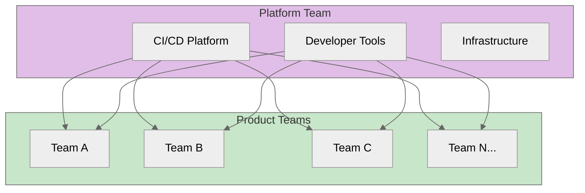
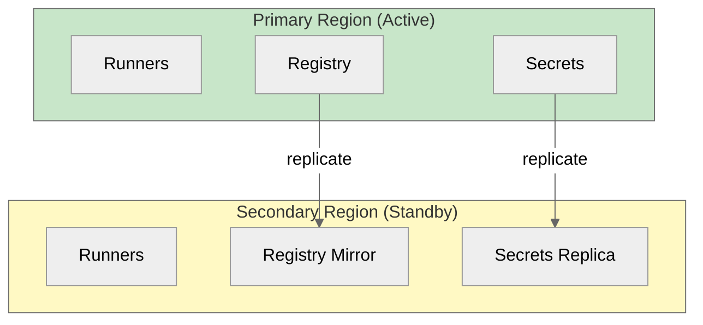

---
# Required
sidebar_position: 15
title: "Enterprise CI/CD for DevOps Organizations"
description: >-
  Scale CI/CD across organizations with platform engineering: internal developer platforms,
  multi-tenancy, governance, compliance, and CI/CD FinOps.

# SEO
keywords:
  - enterprise ci/cd
  - platform engineering
  - internal developer platform
  - backstage
  - ci/cd governance
  - multi-tenancy
  - ci/cd compliance
  - soc 2 ci/cd
  - golden paths
  - developer experience
  - ci/cd at scale
  - devops enterprise
  - learn ci/cd

# Social sharing
og_title: "Enterprise CI/CD: Platform Engineering for DevOps"
og_description: "Build internal developer platforms, manage governance, and scale CI/CD across your organization."
og_image: "/img/ci-cd-social-card.svg"

# Content management
date_published: 2025-01-24
date_modified: 2026-01-25
author: shivam
reading_time: 22
content_type: explanation
---

# Enterprise CI/CD and Platform Engineering

CI/CD at a team level is about automation. CI/CD at an enterprise level is about scale, governance, and enabling hundreds of teams to move fast while maintaining control.

If you're scaling CI/CD for enterprise DevOps or platform engineering, enterprise scale adds a new constraint: consistency without crushing autonomy.

At NVIDIA, I saw this evolution firsthand. What started as individual teams setting up Jenkins pipelines grew into a need for standardized platforms, shared infrastructure, and governance that didn't slow teams down. The challenge wasn't technical—the challenge was organizational: how do you enable autonomy while maintaining consistency?

This is where platform engineering comes in. Instead of every team building their own CI/CD from scratch, you build a platform that teams consume. Instead of fighting for resources and standards, you create "golden paths" that make the right thing the easy thing.

**What you'll learn in this guide:**
- How platform engineering scales CI/CD safely
- Governance patterns that support DevOps speed
- Golden paths that standardize without blocking teams
- Compliance and FinOps practices for enterprise delivery

---

## Platform Engineering Fundamentals

Platform engineering treats infrastructure and CI/CD as products, with developers as customers.

### The Platform Team Model



**Platform team responsibilities:**
- Build and maintain CI/CD infrastructure
- Create reusable templates and libraries
- Define and enforce standards
- Provide self-service capabilities
- Support teams without blocking them

### Golden Paths

A "golden path" is a well-supported, recommended way to accomplish a task. It's not mandatory—teams can deviate—but the golden path is the easiest option.

**Example golden paths:**
- Standard pipeline templates for common languages
- Pre-configured deployment strategies
- Approved security scanning tools
- Recommended testing frameworks

```yaml
# Using a golden path template
name: Build and Deploy

on:
  push:
    branches: [main]

jobs:
  build:
    uses: myorg/platform-templates/.github/workflows/node-build.yml@v1
    with:
      node-version: 20
    secrets: inherit

  deploy:
    needs: build
    uses: myorg/platform-templates/.github/workflows/k8s-deploy.yml@v1
    with:
      environment: production
    secrets: inherit
```

**Why golden paths work:**
- Teams get working pipelines immediately
- Best practices are built-in
- Updates propagate automatically
- Still allows customization when needed

---

## Internal Developer Platforms (IDP)

An IDP is a self-service platform where developers can provision resources, deploy applications, and manage their services.

### Backstage by Spotify

Backstage is the most popular open-source IDP:

```yaml
# catalog-info.yaml - Service registration
apiVersion: backstage.io/v1alpha1
kind: Component
metadata:
  name: my-service
  description: My microservice
  tags:
    - python
    - api
  annotations:
    github.com/project-slug: myorg/my-service
    pagerduty.com/service-id: PXXXXXX
spec:
  type: service
  lifecycle: production
  owner: team-platform
  system: my-system
```

**Backstage capabilities:**
- Service catalog (discover all services)
- Software templates (scaffold new projects)
- TechDocs (documentation)
- CI/CD visibility (pipeline status)
- Plugins (extensible platform)

### Port

Port provides a low-code approach to building IDPs:

```yaml
# Blueprint definition
identifier: service
title: Service
icon: service
schema:
  properties:
    language:
      type: string
      enum: [Python, Node.js, Go, Java]
    owner:
      type: string
      format: team
    repo:
      type: string
      format: url
```

### Self-Service Capabilities

Essential self-service features:
- **Create new projects** from templates
- **Provision environments** (dev, staging, production)
- **Configure pipelines** without tickets
- **View deployments** and rollback
- **Access logs** and metrics
- **Manage secrets** (within policy)

---

## Multi-Tenancy and Isolation

Large organizations need to share CI/CD infrastructure while maintaining isolation.

### Runner Isolation Strategies

**Shared runners (default):**
```yaml
# All teams share the same runners
runs-on: ubuntu-latest
```

**Dedicated runners per team:**
```yaml
# Team-specific runners
runs-on: [self-hosted, team-payments]
```

**Namespace isolation (Kubernetes):**
```yaml
# Each team gets their own namespace
apiVersion: v1
kind: Namespace
metadata:
  name: team-payments-runners
  labels:
    team: payments
```

### Resource Quotas

Prevent one team from consuming all resources:

```yaml
# Kubernetes ResourceQuota
apiVersion: v1
kind: ResourceQuota
metadata:
  name: runner-quota
  namespace: team-payments-runners
spec:
  hard:
    requests.cpu: "10"
    requests.memory: 20Gi
    limits.cpu: "20"
    limits.memory: 40Gi
    pods: "20"
```

### Fair Scheduling

Ensure no team monopolizes pipeline capacity:

```yaml
# GitHub Actions concurrency per team
concurrency:
  group: team-payments-${{ github.workflow }}
  cancel-in-progress: false

# Organization-level limits via API/settings
```

---

## Governance and Compliance

Enterprise CI/CD requires governance without blocking teams.

### Org-Wide Pipeline Templates

Enforce standards via templates:

```yaml
# myorg/templates/.github/workflows/standard-build.yml
name: Standard Build

on:
  workflow_call:
    inputs:
      language:
        required: true
        type: string

jobs:
  security-scan:
    runs-on: ubuntu-latest
    steps:
      - uses: actions/checkout@v4
      - name: Run required security scan
        uses: snyk/actions/node@master
        # Security scan is mandatory

  build:
    needs: security-scan
    runs-on: ubuntu-latest
    steps:
      - uses: actions/checkout@v4
      # Build steps...
```

### Policy-as-Code

Use OPA (Open Policy Agent) or similar for policy enforcement:

```rego
# policy.rego - Require security scanning
package cicd

deny[msg] {
    input.kind == "Workflow"
    not has_security_scan(input)
    msg := "Workflow must include security scanning"
}

has_security_scan(workflow) {
    some job
    workflow.jobs[job].steps[_].uses == "snyk/actions/node@master"
}
```

### Required Checks

Configure branch protection to enforce policies:

```yaml
# GitHub branch protection via API
{
  "required_status_checks": {
    "strict": true,
    "contexts": [
      "security-scan",
      "unit-tests",
      "lint"
    ]
  },
  "enforce_admins": true,
  "required_pull_request_reviews": {
    "required_approving_review_count": 1
  }
}
```

---

## Regulatory Compliance

Regulated industries have specific CI/CD requirements.

### SOC 2 Type II

**Relevant controls:**
- Change management (all changes reviewed and approved)
- Access control (least privilege, audit trails)
- Monitoring and logging
- Incident response

**CI/CD implementation:**
```yaml
# Audit logging
- name: Log deployment
  run: |
    curl -X POST "$AUDIT_LOG_URL" \
      -d '{
        "event": "deployment",
        "environment": "production",
        "commit": "${{ github.sha }}",
        "actor": "${{ github.actor }}",
        "approver": "${{ github.event.review.user.login }}",
        "timestamp": "'$(date -u +%Y-%m-%dT%H:%M:%SZ)'"
      }'
```

### HIPAA (Healthcare)

**Requirements:**
- Encryption in transit and at rest
- Access audit trails
- Minimum necessary access
- Business associate agreements

### PCI-DSS (Payment)

**Requirements:**
- Network segmentation
- Vulnerability management
- Strong access control
- Regular testing

### FedRAMP (Government)

**Requirements:**
- Continuous monitoring
- Incident response plan
- Configuration management
- Supply chain risk management

### Evidence Collection

Automate compliance evidence:

```yaml
- name: Generate compliance report
  run: |
    mkdir -p evidence
    
    # Code review evidence
    gh pr view ${{ github.event.pull_request.number }} --json reviews > evidence/review.json
    
    # Security scan results
    cp security-results.sarif evidence/
    
    # Test results
    cp test-results.xml evidence/
    
    # SBOM
    syft . -o spdx-json > evidence/sbom.json

- name: Upload evidence
  uses: actions/upload-artifact@v4
  with:
    name: compliance-${{ github.sha }}
    path: evidence/
    retention-days: 2555  # 7 years
```

---

## CI/CD FinOps

Track and optimize CI/CD costs.

### Cost Visibility

```yaml
# Tag resources for cost tracking
- name: Deploy with cost tags
  run: |
    kubectl apply -f deployment.yaml
    kubectl annotate deployment/myapp \
      cost.team=payments \
      cost.project=checkout
```

### Build Minutes Tracking

```sql
-- Track build minutes by team
SELECT 
    team,
    SUM(duration_minutes) AS total_minutes,
    COUNT(*) AS total_runs,
    AVG(duration_minutes) AS avg_minutes
FROM pipeline_runs
WHERE started_at > NOW() - INTERVAL '30 days'
GROUP BY team
ORDER BY total_minutes DESC;
```

### Cost Optimization Strategies

1. **Right-size runners** — Match resources to job needs
2. **Use spot instances** — For non-critical jobs
3. **Implement caching** — Reduce duplicate work
4. **Schedule non-urgent jobs** — Run at cheaper times
5. **Clean up artifacts** — Storage costs add up

### Chargeback Models

Allocate costs to teams:

| Model | Description | Pros | Cons |
|-------|-------------|------|------|
| **Showback** | Report costs, don't charge | Awareness | No incentive |
| **Chargeback** | Bill teams for usage | Strong incentive | Overhead |
| **Shared pool** | Fixed allocation | Predictable | Unfair if usage varies |

---

## Disaster Recovery

CI/CD systems need disaster recovery plans too.

### What to Back Up

- Pipeline definitions (usually in Git—already backed up)
- Secrets (should be in external secret manager)
- Runner configuration
- Platform settings
- Artifact metadata

### Multi-Region CI/CD



### Failover Testing

Regularly test failover:

```bash
# Quarterly DR test
1. Redirect traffic to secondary
2. Run full pipeline
3. Deploy to test environment
4. Verify everything works
5. Document issues
6. Restore to primary
```

---

## Release Management at Scale

Coordinating releases across many teams requires process.

### Release Trains

Fixed release schedule that teams target:

```
Week 1: Feature freeze
Week 2: Stabilization
Week 3: Release to production
Week 4: Hotfix window
```

### Feature Freeze Automation

```yaml
# Enforce feature freeze
- name: Check freeze status
  run: |
    if curl -s "$RELEASE_CALENDAR" | grep -q "freeze"; then
      echo "Feature freeze in effect"
      if [ "${{ github.event.pull_request.labels }}" != *"hotfix"* ]; then
        exit 1
      fi
    fi
```

### Go/No-Go Automation

```yaml
# Automated release readiness check
- name: Release readiness
  run: |
    READY=true
    
    # Check test pass rate
    if [ "$(get_test_pass_rate)" -lt 99 ]; then
      echo "Test pass rate below threshold"
      READY=false
    fi
    
    # Check security vulnerabilities
    if [ "$(get_critical_vulns)" -gt 0 ]; then
      echo "Critical vulnerabilities found"
      READY=false
    fi
    
    if [ "$READY" = false ]; then
      exit 1
    fi
```

---

## FAQ: Enterprise CI/CD

### What is platform engineering in DevOps?

Platform engineering treats CI/CD and infrastructure as products. The goal is to provide self-service workflows so teams can ship faster without reinventing pipelines.

### Do enterprises need a single CI/CD platform?

Not always. Many enterprises support multiple platforms, but they standardize templates, governance, and security controls across them.

### How do you balance governance with speed?

Bake policies into reusable templates and automated checks. The less manual review needed, the faster teams can move safely.

## Related Reading

- [Security & Compliance: Controls at scale →](./security-compliance-secrets)
- [Platform Examples: Standardize pipeline templates →](./platform-examples)
- [Anti-patterns & Migration: Avoid enterprise pitfalls →](./anti-patterns-migration)

---

## What's Next?

Enterprise CI/CD is about enabling scale while maintaining control. Platform engineering provides the structures and tools to do this effectively.

The next document covers **CI/CD Anti-patterns and Migration**: common mistakes to avoid and how to migrate between CI/CD platforms.

**Ready to learn what not to do?** Continue to [Anti-patterns & Migration →](./anti-patterns-migration)

---

## Quick Reference

### Platform Engineering Principles

1. **Treat platform as product** — Developers are your customers
2. **Enable self-service** — Reduce tickets, increase autonomy
3. **Create golden paths** — Make the right thing easy
4. **Measure developer experience** — Track satisfaction and productivity
5. **Iterate based on feedback** — Continuous improvement

### Enterprise Checklist

- [ ] Shared pipeline templates
- [ ] Self-service capabilities
- [ ] Cost visibility
- [ ] Governance policies
- [ ] Compliance automation
- [ ] Disaster recovery plan
- [ ] Multi-tenancy strategy
- [ ] Release coordination process

### Compliance Mapping

| Framework | Key CI/CD Controls |
|-----------|-------------------|
| SOC 2 | Change management, access control, logging |
| HIPAA | Encryption, audit trails, access control |
| PCI-DSS | Vulnerability scanning, segmentation |
| FedRAMP | Continuous monitoring, supply chain |

---

**Remember:** Enterprise CI/CD is about enabling hundreds of teams to move fast safely. The best platforms are invisible—teams get work done without thinking about the platform.
