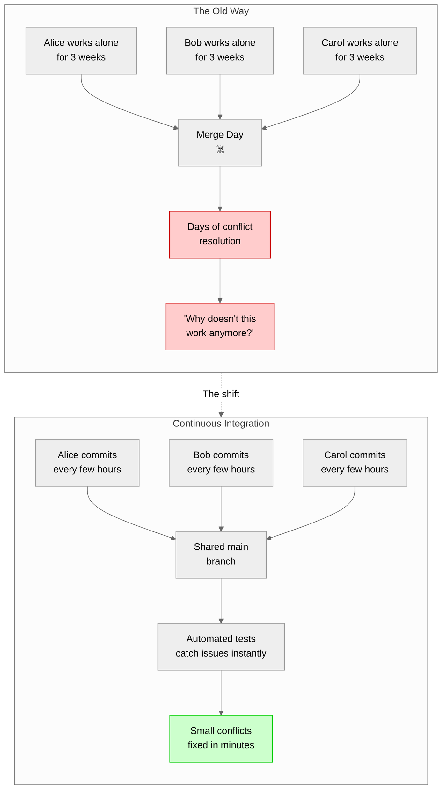
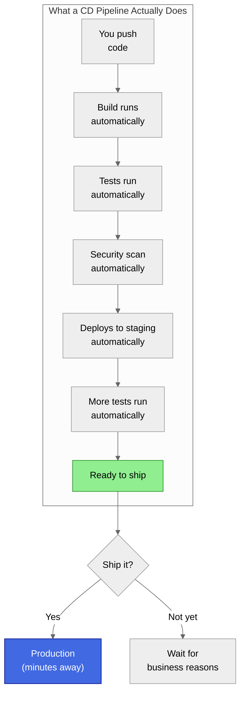

# Introduction to CI/CD

I still remember the deployment that changed how I think about software delivery.

It was a Thursday evening—never deploy on Fridays, they said, so Thursday became the new Friday. We'd been working on a major feature for six weeks. Six weeks of code piling up in a feature branch. Six weeks of "we'll integrate it when it's ready." The branch had drifted so far from main that the merge conflicts spanned forty files.

We started the deployment at 6 PM, expecting to be done by 8. By midnight, we were still debugging why the authentication service couldn't talk to the new user management module—something that worked perfectly in isolation but broke catastrophically when combined with three other features that had also been developed in isolation.

The CTO was on the call. So was the VP of Engineering. At 2 AM, we rolled back to the previous version, defeated. The feature we'd spent six weeks building wouldn't ship for another three weeks while we untangled the mess.

Here's what haunted me: none of the individual pieces were broken. Every developer had done their job well. The code was clean. The tests passed—in isolation. The problem was the *integration*. We'd spent six weeks building separate puzzle pieces without ever checking if they fit together.

That deployment taught me something that took years to fully appreciate: **the pain of integration grows exponentially with the time between integrations**. Integrate daily, and you get small conflicts that take minutes to resolve. Integrate monthly, and you get merge hell that takes weeks. Integrate quarterly, and you get the kind of disaster that makes people quit.

This is what CI/CD is really about. Not the tools. Not the YAML files. Not the fancy deployment strategies. It's about shortening feedback loops until the cost of finding and fixing problems becomes negligible.

---

## So What Actually Is CI/CD?

You've probably heard CI/CD defined as "Continuous Integration and Continuous Delivery/Deployment." That's accurate but unhelpful—like defining swimming as "the act of propelling oneself through water." Technically correct, but it doesn't teach you to swim.

Let me explain it the way I wish someone had explained it to me.

### Continuous Integration: Making "Merge Day" Disappear

Think about how most teams worked before CI became standard practice. Developers would grab a feature, disappear into their branch for days or weeks, and emerge with a fully-formed chunk of code. Then came the dreaded "merge day"—that special circle of hell where everyone's code collided.

I've watched skilled engineers spend entire weeks doing nothing but resolving merge conflicts. Not building features. Not fixing bugs. Just reconciling the accumulated drift between branches that had grown apart like estranged family members.

Continuous Integration flips this model on its head. Instead of integrating once at the end, you integrate constantly—ideally multiple times per day. Each integration is tiny. Tiny integrations mean tiny conflicts. Tiny conflicts mean you fix them while the context is still fresh in your mind, not three weeks later when you've forgotten why you wrote that code in the first place.

But here's the part that took me years to understand: CI isn't primarily about automation. You can have Jenkins running builds on every commit and still not practice CI. I've seen teams with sophisticated build servers who maintain feature branches for months. They have *automated builds*, but they don't have *continuous integration*. The builds run, pass, and mean nothing because the real integration—the painful merging of divergent codebases—still happens once a quarter.

True CI requires a cultural commitment: developers integrate their work daily, the main branch is always in a working state, and when a build breaks, fixing it is the team's top priority. The automation enables this, but the automation isn't the point.

### Continuous Delivery: Being Ready to Ship at Any Moment

If CI is about integrating code, Continuous Delivery is about getting that code ready to deploy—constantly.

Here's a scenario I've seen play out dozens of times. A company has a critical bug in production. The fix is trivial—a one-line change. A developer implements it in ten minutes. And then... the fix sits in staging for two weeks waiting for the "next release window."

Why? Because deploying isn't trivial. There are manual steps. Configuration files that need updating. Database migrations that require coordination. The deployment process is fragile enough that no one wants to attempt it except during the scheduled window when everyone's prepared for things to go wrong.

This is what Continuous Delivery solves. With CD, every commit that passes your automated tests is *deployable*. Not "will be deployable after we do a bunch of manual stuff." Actually deployable. The one-line bug fix could go to production in minutes, not weeks.

The key insight is subtle but profound: **CD makes deployment a business decision, not a technical one**. Without CD, the question is "Can we even deploy this?" With CD, the question becomes "Should we deploy this now, or wait for the marketing announcement next week?" That's a much better question to be asking.

### Continuous Deployment: Trusting the Process Completely

Continuous Deployment is CD with the safety net removed: every commit that passes your pipeline goes directly to production. No human approval. No "click the deploy button." Your code is in front of users within minutes of merging.

When I first heard about this, I thought it was reckless. Deploy to production without a human checking? What if there's a bug? What if something breaks?

Then I worked with a team that deployed to production fifty times a day. And here's the thing that broke my mental model: their production environment was *more stable* than teams I'd worked with who deployed monthly.

How? Because deploying fifty times a day means each deployment is tiny. A tiny deployment is easy to understand, easy to test, and crucially—easy to roll back. When something breaks (and it will), you know exactly what changed. The blast radius is small. You roll back in seconds, fix the issue, and redeploy.

Compare that to a monthly deployment: thousands of lines changed across dozens of files. When something breaks, good luck figuring out which of those changes caused it. The blast radius is enormous. Rolling back means losing a month of work.

The teams practicing continuous deployment aren't cowboy coders ignoring risk. They're *managing* risk by keeping each individual deployment so small that problems are easy to isolate and fix.

But—and this is important—continuous deployment isn't for everyone. If you're building software for pacemakers or nuclear reactors or financial trading systems, you probably need human gates. If your regulatory environment requires manual approval, you need humans in the loop. The point isn't that continuous deployment is always better. The point is that *your deployment process shouldn't be the bottleneck*.

---

## Why Should You Care?

I've given you the theory. Let me tell you what actually changes when teams adopt CI/CD properly.

### You Stop Dreading Deployments

I once consulted for a company where deployment day was called "war room day." They'd book a conference room, stock it with pizza and energy drinks, and prepare to work through the night. This was normal. This was *expected*. Engineers accepted that deployments meant suffering.

After we implemented proper CI/CD, deployments became so boring that people stopped noticing them. Someone would mention in passing, "Oh yeah, we shipped that fix this morning," and others would nod without looking up from their work. That's the goal. **Deployments should be unremarkable.**

The psychological shift is profound. When deployment is scary, people hoard changes. They bundle "one more thing" into each release because who knows when the next opportunity will come. This makes deployments bigger, which makes them scarier, which makes people hoard more changes. It's a vicious cycle.

When deployment is easy, people ship small changes constantly. Small changes are easy to review. Easy to test. Easy to roll back. Easy to understand when something goes wrong.

### You Find Bugs When They're Cheap to Fix

There's a well-known (if somewhat debated) rule of thumb that bugs become 10x more expensive to fix with each stage of development they survive. A bug caught during coding costs almost nothing. A bug caught during code review costs a little more. A bug caught during testing costs more. A bug caught in production costs a lot—plus the cost of the hotfix deployment, plus the cost of customer support, plus the intangible cost of lost trust.

CI/CD dramatically compresses this timeline. When tests run on every commit, you find bugs within minutes of introducing them. The code is still fresh in your mind. The context is still loaded. You fix it and move on.

Without CI, that same bug might lurk undetected for weeks. By the time it surfaces, you've moved on to other things. You have to reload the context. You have to remember why you made those decisions. Sometimes you can't remember, so you're essentially debugging someone else's code—even though that someone else is past-you.

### You Actually Learn What Users Want

Here's something that doesn't get talked about enough: the longest feedback loop in software development isn't technical. It's the loop between "we built this" and "users actually want this."

When you deploy monthly, you build features based on assumptions. You ship. You wait a month. You look at metrics. You discover users hate the new navigation. You spend another month fixing it. Elapsed time from bad idea to correction: two months minimum.

When you deploy continuously with feature flags, you can ship a new navigation to 1% of users tomorrow. You watch the metrics for a day. Users hate it? You disable the flag. You've learned the same lesson in one day instead of two months. The cumulative effect of this faster learning loop is massive—it's often the difference between products that succeed and products that don't.

---

## The Myths That Hold Teams Back

In my years helping teams adopt CI/CD, I've encountered the same objections over and over. Some are reasonable concerns that require real solutions. Others are myths that need to die. Let me address them directly.

### "We can't do CI/CD because we don't have enough tests"

I hear this constantly, and I understand the logic: CI/CD relies on automated testing, we don't have good test coverage, therefore we can't do CI/CD until we fix our tests.

Here's why this is backwards: you will *never* have good test coverage without CI/CD.

I've never seen a team successfully retrofit comprehensive testing onto a codebase without CI infrastructure. It doesn't happen. Writing tests is already the task developers most often skip when under pressure. Without CI making test failures visible and blocking merges, the pressure to skip tests always wins.

But something magical happens when you implement CI first. Suddenly test failures are public. The build is red, and everyone can see it. There's social pressure to add the test that would have caught that bug. Slowly, organically, coverage improves—not because someone mandated it, but because the infrastructure makes good practices easier than bad ones.

Start with CI today. Run whatever tests you have, even if it's just "does it compile?" Add tests incrementally as bugs escape. You'll be amazed how quickly coverage improves when the infrastructure supports it.

### "Our QA team will become obsolete"

This fear comes from QA engineers, and it's worth addressing with empathy because it reflects a genuine anxiety about job security.

The reality is that CD changes the QA role but doesn't eliminate it. What gets automated are the repetitive, soul-crushing parts: clicking through the same flows for the hundredth time, running regression suites manually, maintaining spreadsheets of test cases.

What remains—and becomes more valuable—are the distinctly human parts: exploratory testing, thinking creatively about edge cases, questioning assumptions about user behavior, defining quality standards, coaching developers on testing practices.

The QA engineers I know who've made this transition are happier. They went from feeling like human test-execution machines to being genuine quality advocates. They have more impact, not less.

But this transition requires support. QA engineers need training in automation, in working with developers, in thinking about quality differently. Organizations that throw CI/CD at their teams without this support create fear and resistance.

### "We're too regulated for continuous deployment"

I've worked with healthcare companies bound by HIPAA. Financial institutions under SOC 2. Government contractors with FedRAMP requirements. And in every case, the regulatory concerns were real but solvable.

Here's the thing: regulators don't care whether a human clicks a deploy button. They care about change control, audit trails, separation of duties, and reversibility. Automated pipelines can satisfy all of these requirements—often *better* than manual processes.

An automated pipeline produces an immutable log of exactly what changed, who approved it, what tests ran, and what the results were. Try getting that level of auditability from a manual process where someone SSHs into a server and runs deployment scripts.

The key is working with your compliance team to understand what they actually need, not what you assume they need. I've seen teams assume they needed manual approval gates, only to discover that automated gates with proper logging satisfied the auditors perfectly.

### "We don't have time to set this up"

This is the most frustrating objection because it's self-defeating. Teams without CI/CD spend enormous amounts of time on manual testing, manual deployments, debugging integration issues, and fixing production incidents that better automation would have prevented.

Setting up basic CI takes hours, not months. GitHub Actions can have tests running on your next push in less than an hour. The time investment pays for itself within weeks, often within days.

I've yet to meet a team that adopted CI/CD and said, "We should have waited longer." Every team I've worked with says the same thing: "We should have done this years ago."

---

## The Patterns That Actually Cause Pain

Beyond the myths, there are genuine anti-patterns that cause real pain. I've seen each of these enough times to recognize them instantly.

### The Snowflake Pipeline

Every project has its own unique, artisanal build configuration. The frontend builds with Webpack via a Makefile. The backend uses Gradle invoked from a shell script. The mobile app has its own completely different setup that only one person understands.

When that one person goes on vacation, nobody can ship.

This happens because each project starts from scratch, optimizing for its specific needs without considering organizational consistency. It feels efficient in the moment but creates massive drag over time. Onboarding takes forever. Knowledge is siloed. Improvements in one project don't benefit others.

The fix is shared templates. Create a "golden path" that covers 80% of use cases and make it trivially easy to adopt. Allow customization for the remaining 20%, but make the default path so convenient that people choose it voluntarily.

### The 90-Minute Build

I once worked with a team whose CI pipeline took 94 minutes. Not a typo. An hour and a half to find out if your change broke something.

The result was predictable: developers stopped running the full pipeline locally. They'd push, go to lunch, and come back to discover failures. By then, they'd mentally moved on to the next task. Context-switching to fix the build was painful. So they'd push another "fix" without fully understanding the problem. More failures. More delays.

The team had essentially abandoned continuous integration while still going through the motions. They had an automated build system that nobody trusted or relied on.

Fast feedback loops aren't a nice-to-have; they're essential to the practice. If your pipeline takes more than 10-15 minutes, developers will route around it. They'll push without running tests. They'll batch changes to minimize the number of times they have to wait.

Invest ruthlessly in build performance. Parallelize tests. Cache dependencies. Split your test suite strategically. The speed of your feedback loop determines whether CI is a living practice or a bureaucratic checkbox.

### The Flaky Test Graveyard

You've probably experienced this: the build fails, but nobody panics because "oh, that test is just flaky." Re-run the build, it passes, merge and move on.

This is how you train a team to ignore test failures.

Flaky tests are insidious because they erode trust gradually. At first, people investigate failures. Then they learn that certain tests "just do that sometimes." Then they stop investigating. Then a real failure gets lost in the noise of expected flakiness.

I've seen critical bugs ship to production because the test that would have caught them was in the "known flaky" bucket. Nobody looked at it. The signal was lost.

The fix is treating flaky tests as a priority, not a nuisance. Quarantine them—run them but don't let them fail the build. Track flakiness metrics. Dedicate time to fixing or removing flaky tests. A smaller, reliable test suite is worth infinitely more than a large, flaky one.

---

## What This Guide Will Teach You

This document is the first in a comprehensive series. I'm going to take you from understanding the fundamentals to implementing production-grade pipelines to designing CI/CD systems for entire organizations.

Here's the journey we'll take together.

We'll start with the **foundations**: how pipelines actually work, the building blocks of triggers and stages and jobs, and why concepts like idempotency matter more than they seem at first glance. We'll explore branching strategies—trunk-based development, GitFlow, and the variations in between—and I'll help you understand which makes sense for your situation.

Then we'll tackle **quality and security**: testing strategies that actually build confidence, artifact management that doesn't become a mess, and security practices that satisfy auditors without grinding your team to a halt. This is where many teams struggle, so we'll spend real time on it.

Next comes **deployment**: the strategies that let you ship with confidence. Rolling deployments, blue-green, canary releases—we'll cover when to use each and how to implement them properly. For teams on Kubernetes, we'll go deep on GitOps and the tools that make it work.

We'll look at **platforms**: real, working pipeline configurations for GitHub Actions, GitLab CI, Google Cloud Build, and Jenkins. Not toy examples—actual production-ready setups you can adapt.

And we'll cover the advanced stuff: **metrics and optimization**, because you can't improve what you don't measure; **troubleshooting**, because things will go wrong; and **enterprise patterns**, because scaling CI/CD across an organization brings its own challenges.

Throughout, we'll ground everything in **case studies**: real deployment scenarios for VPSs, Kubernetes clusters, serverless functions, mobile apps, desktop applications, and even data center fleets. Because theory is nice, but you're here to ship software.

---

## Finding Your Path Through This Guide

You don't have to read everything in order. This guide is designed for different starting points depending on your experience and goals.

**If you're new to CI/CD**: Start here, then move to Core Concepts. Work through the documents sequentially—each builds on the previous. The case studies at the end will help cement what you've learned.

**If you know the concepts but need to implement**: Skim Core Concepts for terminology, then jump to Platform Examples. Pick the platform you're using and follow the working configuration. Reference the case studies for your deployment scenario.

**If you're optimizing existing pipelines**: Start with Metrics & Maturity to establish baselines, then move to Pipeline Optimization. The Troubleshooting guide will help you address specific pain points.

**If you're designing CI/CD for an organization**: Focus on Enterprise CI/CD for governance and platform engineering patterns. Security & Compliance is essential. Metrics & Maturity will help you measure success.

The complete roadmap of all 18 documents is at the end of this page. Each document is self-contained—you can jump directly to what you need.

---

## Before We Begin

Let me set some expectations about what you'll need to follow along.

I'm assuming you're comfortable with a command line. You don't need to be a bash wizard, but you should be able to navigate directories and run commands without panicking.

I'm assuming you understand Git basics: commits, branches, merges. If "rebase" makes you nervous, that's fine—we'll cover branching strategies in depth later.

I'm assuming you've written some code and understand what tests are, even if you haven't written many. If you've never seen a unit test, that's okay—we'll cover testing philosophy thoroughly.

I'm *not* assuming you have CI/CD experience. That's what this guide is for.

I'm *not* assuming you work at a big company with dedicated DevOps teams. The patterns here work for solo developers, small startups, and large enterprises alike. The principles scale.

I'm *not* assuming you use any particular language, framework, or platform. The concepts are universal. The specific examples use various technologies, but you'll be able to adapt them.

---

## Let's Go

CI/CD transformed how I think about software delivery. It took me from dreading deployments to barely noticing them. From debugging integration failures for days to catching issues in minutes. From hoping releases would work to knowing they would.

The journey isn't instant. You won't read this guide and wake up tomorrow with perfect pipelines. But you will understand the principles. You'll know what good looks like. And you'll have a roadmap to get there.

That Thursday night deployment I mentioned at the start? The company I was working with eventually implemented proper CI/CD. Within six months, they were deploying multiple times per day. The team that used to dread release nights started shipping fearlessly.

That transformation is possible for your team too. Let's start.

---

## Complete Documentation Roadmap

Here's everything this guide covers. Each document is self-contained—read in order for the full journey, or jump to what you need.

### Foundations

| # | Document | What You'll Learn |
|---|----------|-------------------|
| 1 | **Introduction** *(you are here)* | CI/CD philosophy, value proposition, the mindset shift |
| 2 | [Core Concepts →](./core-concepts) | Pipeline anatomy, triggers, stages, jobs, artifacts, how it all fits together |
| 3 | [Branching Strategies →](./branching-strategies) | Trunk-based development, GitFlow, choosing what works for your team |
| 4 | [Versioning & Releases →](./versioning-releases) | Semantic versioning, changelogs, the mechanics of releasing software |

### Quality & Security

| # | Document | What You'll Learn |
|---|----------|-------------------|
| 5 | [Testing & Quality Gates →](./testing-quality) | Building test suites that create real confidence |
| 6 | [Artifact Management →](./artifact-management) | Where builds go after they're built, and why it matters |
| 7 | [Security & Compliance →](./security-compliance-secrets) | Scanning, secrets, supply chain security, satisfying auditors |

### Deployment

| # | Document | What You'll Learn |
|---|----------|-------------------|
| 8 | [Deployment Strategies →](./deployment-strategies) | Rolling, blue-green, canary—when to use each |
| 9 | [Kubernetes & GitOps →](./kubernetes-gitops) | The patterns that make K8s deployments manageable |

### Platforms

| # | Document | What You'll Learn |
|---|----------|-------------------|
| 10 | [Platform Examples →](./platform-examples) | Working pipelines for GitHub Actions, GitLab CI, Cloud Build, Jenkins |

### Advanced

| # | Document | What You'll Learn |
|---|----------|-------------------|
| 11 | [Metrics & Maturity →](./metrics-maturity) | DORA metrics, measuring what matters, proving ROI |
| 12 | [Pipeline Optimization →](./pipeline-optimization) | Making builds fast, because slow builds break CI |
| 13 | [Troubleshooting →](./troubleshooting) | When things go wrong, how to fix them |
| 14 | [AI in CI/CD →](./ai-in-cicd) | How AI is changing the landscape |
| 15 | [Enterprise CI/CD →](./enterprise-cicd) | Platform engineering, governance at scale |
| 16 | [Anti-patterns & Migration →](./anti-patterns-migration) | What not to do, and how to escape bad situations |

### Real World

| # | Document | What You'll Learn |
|---|----------|-------------------|
| 17 | [Case Studies →](./case-studies) | 13 deployment scenarios, from VPS to mobile to data center fleets |
| 18 | [Glossary →](./glossary) | Quick reference for terminology |

---

## Frequently Asked Questions

### What does CI/CD stand for?

CI/CD stands for Continuous Integration and Continuous Delivery (or Continuous Deployment). But the acronym matters less than the principles: integrate code frequently to avoid merge hell, keep your codebase always ready to deploy, and make deployment so routine that it becomes invisible.

### What's the difference between Continuous Delivery and Continuous Deployment?

With Continuous Delivery, every commit *could* go to production—someone just needs to approve it. With Continuous Deployment, every commit *does* go to production automatically. The difference is whether there's a human gate before production. Both are valid; the choice depends on your risk tolerance and regulatory requirements.

### Do I need a DevOps team to implement CI/CD?

No. A single developer can set up CI/CD in an afternoon using GitHub Actions or GitLab CI. The concepts scale from solo projects to large organizations. What changes is sophistication, not fundamentals.

### How long does it take to implement CI/CD?

Basic CI (running tests on every push) can be set up in hours. Mature CD with automated deployments, comprehensive testing, and security scanning takes months to get right—and continues evolving as your needs change. Start simple and iterate.

### What if my tests are flaky or incomplete?

Start anyway. CI will expose which tests are flaky (giving you the data to fix them) and create pressure to add tests when bugs escape. Waiting for "good enough" test coverage before implementing CI is a trap—you'll wait forever.

### Is CI/CD relevant for small projects?

Especially so. Small teams can't afford manual testing and deployment overhead. CI/CD automates the boring stuff so you can focus on building features. And the free tiers of GitHub Actions and GitLab CI make it accessible to projects of any size.

---

**Ready to understand how pipelines actually work?** Continue to [Core Concepts →](./core-concepts)
