# Introduction to CI/CD

> **TL;DR**: CI/CD (Continuous Integration/Continuous Delivery) is the practice of automatically building, testing, and preparing code for release every time a developer makes a change. It transforms software delivery from stressful, infrequent "big bang" releases into safe, routine, and frequent deployments. 
>
> This comprehensive guide covers everything from CI/CD fundamentals to enterprise-scale implementation: pipeline design, branching strategies, testing, security, deployment strategies (rolling, blue-green, canary), Kubernetes and GitOps, platform-specific examples (GitHub Actions, GitLab CI, Cloud Build, Jenkins), optimization, troubleshooting, and 13 real-world case studies. Whether you're a developer learning CI/CD for the first time or an architect designing systems for large organizations, this guide meets you where you are.

---

It's 2 AM on a Friday night. The deploy button has just been clicked. Everyone holds their breath as changes made over the past three weeks finally make their way to production. The release manager coordinates over a conference call with twelve people—developers, QA, ops, and an anxious product manager. Someone notices a bug. Rolling back means another hour of manual work. The on-call engineer hasn't slept properly in days because hotfixes keep piling up.

This scenario isn't fiction. For many teams, it's the reality of software delivery. But here's the thing: **it doesn't have to be this way**.

What if deployments were so routine, so safe, that no one even noticed when they happened? What if you could deploy to production multiple times a day, with the confidence that any issue would be caught immediately and rolled back automatically? What if the three weeks of work integrated daily, bugs found in minutes rather than weeks?

This is the promise of CI/CD—not just as a technical practice, but as a fundamental shift in how teams think about and deliver software.

## What is CI/CD?

CI/CD stands for **Continuous Integration** and **Continuous Delivery** (sometimes **Continuous Deployment**). While often spoken as a single term, these represent distinct but complementary practices that together form a philosophy of software delivery.

Let's break this down properly, because understanding the "why" behind each concept matters far more than memorizing definitions.

### Continuous Integration: The Foundation

**Continuous Integration (CI)** is the practice of frequently merging code changes into a shared mainline, where each integration is verified by automated builds and tests.

But that definition alone misses the deeper point.

Consider what software development looked like before CI was common practice. A team of developers would work on features in isolation for weeks or months. Each developer's code would drift further from the shared codebase. Then came "integration hell"—the painful process of merging everyone's changes together. Conflicts everywhere. Assumptions that worked in isolation breaking when combined. Bugs that could have been caught in hours now taking days to untangle because no one remembered the original context.

```mermaid
%%{init: {'theme': 'neutral'}}%%
flowchart TB
    subgraph before["❌ Before CI: Integration Hell"]
        direction TB
        A1[Developer A<br/>works 3 weeks] --> M1[Merge Day]
        B1[Developer B<br/>works 3 weeks] --> M1
        C1[Developer C<br/>works 3 weeks] --> M1
        M1 --> X1[💥 Integration Hell<br/>Conflicts, Bugs, Chaos]
        X1 --> F1[Days of debugging<br/>and fixing]
    end
    
    subgraph after["✅ After CI: Continuous Flow"]
        direction TB
        A2[Developer A<br/>commits daily] --> M2[Shared Main<br/>Branch]
        B2[Developer B<br/>commits daily] --> M2
        C2[Developer C<br/>commits daily] --> M2
        M2 --> T2[Automated Tests<br/>Run Immediately]
        T2 --> G2[Issues caught<br/>in minutes]
    end
    
    before --> |"Transform with CI"| after

    style X1 fill:#ffcccc,stroke:#cc0000
    style F1 fill:#ffcccc,stroke:#cc0000
    style G2 fill:#ccffcc,stroke:#00cc00
    style T2 fill:#ccffcc,stroke:#00cc00
```

CI addresses this by making integration a non-event. When developers integrate daily—or even multiple times per day—each integration is small. Small changes mean small conflicts. Small conflicts mean quick resolution. And when automated tests run on every integration, bugs are caught while the context is still fresh in the developer's mind.

**The key insight of CI**: The longer you wait to integrate, the harder it becomes. The cost of integration grows non-linearly with the amount of divergent code. Daily integration transforms a potentially catastrophic process into something barely noticeable.

### Continuous Delivery: The Bridge to Production

**Continuous Delivery (CD)** extends CI by ensuring that code is always in a deployable state. Every commit that passes the automated pipeline could theoretically be released to production at any moment.

Think about what this means. Not just that your code compiles and tests pass, but that:

- The artifact can be built reproducibly
- All quality gates have been satisfied
- Security scans have passed
- The deployment process itself is automated and tested
- Someone can press a button and that code is in production

This doesn't mean you deploy every commit. It means you *could*. The decision to deploy becomes a business decision, not a technical one. "Should we release this feature to users?" rather than "Is this code even releasable?"

**The key insight of CD**: The gap between "code complete" and "deployed to production" is where risk lives. Every day your code sits un-deployed is a day where bugs go undiscovered, feedback goes unheard, and value goes undelivered. CD minimizes this gap.

### Continuous Deployment: The Final Frontier

**Continuous Deployment** takes CD one step further: every commit that passes all stages of the pipeline is automatically deployed to production, with no human intervention.

This sounds terrifying at first. Deploy to production automatically? What about bugs? What about review?

Here's the counterintuitive truth: teams practicing continuous deployment typically have *more* stable production systems than teams with manual deployments. Why?

1. **Small changes are safer than big changes**. A single line change is easier to reason about and easier to roll back than a 10,000-line release.

2. **Fast feedback loops catch bugs earlier**. When you deploy multiple times per day, bugs are caught within hours, not weeks.

3. **The process must be excellent**. To trust automated deployment, you must have comprehensive tests, excellent monitoring, automated rollback, and feature flags. This level of engineering discipline benefits everything.

4. **Fear of deployment disappears**. When deployment is routine, it's no longer a stressful event. Nobody hoards changes "until the next release window."

```mermaid
%%{init: {'theme': 'neutral'}}%%
flowchart TB
    subgraph CD_CHOICE["The CD Spectrum"]
        direction LR
        CI[Continuous<br/>Integration] --> CD1[Continuous<br/>Delivery]
        CD1 --> CD2[Continuous<br/>Deployment]
    end
    
    CD1 --> H["🧑 Human decides<br/>when to deploy"]
    CD2 --> A["🤖 Automatic<br/>deployment"]
    
    DECIDE{Which is right<br/>for your team?}
    
    H --> DECIDE
    A --> DECIDE
    
    DECIDE --> F1["📋 Regulatory requirements"]
    DECIDE --> F2["✅ Test confidence level"]
    DECIDE --> F3["↩️ Rollback capabilities"]
    DECIDE --> F4["🚩 Feature flag maturity"]
    DECIDE --> F5["👥 Team culture & risk tolerance"]
    
    style CD1 fill:#87CEEB,stroke:#4682B4
    style CD2 fill:#FFD700,stroke:#DAA520
    style DECIDE fill:#f0f0f0,stroke:#666
```

**The key insight of Continuous Deployment**: The goal isn't to remove humans from the process—it's to have humans focus on what matters (building the right features, making business decisions) rather than repetitive, error-prone deployment mechanics.

---

## The Value Proposition: Why CI/CD Changes Everything

Understanding CI/CD conceptually is one thing. Understanding why you should care is another. Let's explore the concrete ways CI/CD transforms software delivery.

### Speed: From Months to Minutes

Consider the journey of an idea in a traditional software organization:

1. Product manager writes requirements (days)
2. Design creates mockups (days)
3. Developer implements feature (days to weeks)
4. Code review (days)
5. QA testing (days)
6. Staging deployment and verification (days)
7. Release planning and scheduling (days)
8. Production deployment (hours to days)
9. User feedback received (eventually)

Now consider the same journey with mature CI/CD practices:

1. Developer picks up a small feature (hours)
2. Implementation with tests (hours to a day)
3. Automated CI validates the change (minutes)
4. Code review while CI runs (concurrent)
5. Merge triggers automated deployment to staging (minutes)
6. Automated E2E tests run (minutes)
7. Automatic or one-click production deployment (minutes)
8. Feature flag enables gradual rollout (immediate)
9. Real user feedback (hours)

This isn't just about doing the same things faster—it's about fundamentally different economics. When deployment is cheap and safe, you make different decisions. You ship smaller features. You validate ideas with real users sooner. You iterate based on evidence rather than speculation.

### Quality: Prevention Over Detection

Traditional quality assurance is about finding bugs before they reach users. CI/CD transforms this from detection to prevention.

The testing pyramid illustrates this. In a well-designed CI pipeline:

```mermaid
%%{init: {'theme': 'neutral'}}%%
flowchart LR
    subgraph pyramid["The Testing Pyramid"]
        direction TB
        E2E["🔺 E2E Tests<br/>Few, expensive, slow"]
        INT["◆ Integration Tests<br/>More, moderate cost"]
        UNIT["■ Unit Tests<br/>Many, cheap, fast"]
        E2E ~~~ INT
        INT ~~~ UNIT
    end
    
    subgraph metrics["Feedback & Cost"]
        direction TB
        M1["⚡ Unit: Seconds<br/>Cost to fix: $1"]
        M2["⏱️ Integration: Minutes<br/>Cost to fix: $10"]
        M3["🕐 E2E: Minutes-Hours<br/>Cost to fix: $100+"]
    end
    
    UNIT --> M1
    INT --> M2
    E2E --> M3
    
    style E2E fill:#ff6b6b,stroke:#c92a2a
    style INT fill:#ffd43b,stroke:#fab005
    style UNIT fill:#69db7c,stroke:#2f9e44
    style M1 fill:#e8f5e9,stroke:#2f9e44
    style M2 fill:#fff8e1,stroke:#fab005
    style M3 fill:#ffebee,stroke:#c92a2a
```

Unit tests catch logic errors in seconds. Integration tests catch interface mismatches in minutes. E2E tests catch workflow issues before deployment. Each layer catches bugs where they're cheapest to fix.

But quality in CI/CD goes beyond testing. Consider what else runs in a modern pipeline:

- **Static analysis** catches code smells and potential bugs without execution
- **Security scanning** identifies vulnerabilities before they reach production
- **Dependency auditing** flags known vulnerable dependencies
- **Performance regression tests** catch slowdowns before users notice
- **Compliance checks** ensure code meets regulatory requirements

Each of these quality gates runs automatically on every commit. There's no "we'll fix it in the next release" because issues are caught before they're merged.

### Confidence: From Fear to Routine

Perhaps the most underrated benefit of CI/CD is psychological: the removal of deployment fear.

In organizations without CI/CD, deployment is an event. It has ceremony. There are go/no-go meetings, deployment windows, change advisory boards, and war rooms. Engineers mentally prepare for things to go wrong. The on-call rotation during deployment weekends is a burden no one wants.

This fear is rational. When deployments are rare and large, the probability of something going wrong is high. When the process is manual, human error is inevitable. When rollback is difficult, the stakes feel enormous.

CI/CD inverts this dynamic:

| Aspect | Without CI/CD | With CI/CD |
|--------|---------------|------------|
| **Deployment frequency** | Monthly or quarterly | Daily or multiple times per day |
| **Change size** | Large, many features | Small, often one change |
| **Rollback time** | Hours to days | Minutes |
| **Deployment process** | Manual, error-prone | Automated, repeatable |
| **Deployment day stress** | High | Non-existent |
| **On-call burden** | Heavy on deploy days | Evenly distributed |

When you've deployed a hundred times without incident, the 101st deployment is boring. This is the goal. **Boring deployments mean you can focus on building the right things instead of worrying about the mechanics of shipping.**

### The Compounding Effect

These benefits don't exist in isolation—they compound.

Speed enables more experiments. More experiments produce more learnings. More learnings improve quality. Better quality enables faster speed because there's less rework. Faster speed and higher quality build confidence. Confidence enables more ambitious changes. And the cycle continues.

```mermaid
%%{init: {'theme': 'neutral'}}%%
flowchart LR
    subgraph cycle["The Virtuous Cycle of CI/CD"]
        direction TB
        S["🚀 Speed<br/>Ship small changes fast"]
        E["🧪 Experiments<br/>Try more ideas"]
        L["📊 Learnings<br/>Get real feedback"]
        Q["✨ Quality<br/>Build the right thing"]
        C["💪 Confidence<br/>Trust the process"]
        
        S --> E --> L --> Q --> C --> S
    end
    
    cycle --> CENTER["🎯 Better<br/>Software<br/>Delivery"]
    
    style CENTER fill:#4169E1,stroke:#000080,color:#fff
    style S fill:#e3f2fd,stroke:#1976d2
    style E fill:#f3e5f5,stroke:#7b1fa2
    style L fill:#e8f5e9,stroke:#388e3c
    style Q fill:#fff3e0,stroke:#f57c00
    style C fill:#fce4ec,stroke:#c2185b
```

This is why CI/CD isn't just a technical practice—it's a competitive advantage. Organizations with mature CI/CD can outlearn, outship, and outadapt their competitors.

---

## Common Misconceptions and Anti-patterns

Before diving into implementation, let's address the myths that trip up teams adopting CI/CD. Understanding what CI/CD *isn't* is as important as understanding what it *is*.

### Misconception 1: "CI/CD is just automation"

**The myth**: Set up a build server, add some scripts, and you have CI/CD.

**The reality**: CI/CD is a practice that automation enables, not a tool you install.

You can have Jenkins running on every commit and still not practice CI. If developers maintain long-lived feature branches that merge once a month, you're just automating a bad process. The builds run, but integration hell still exists—you've just moved it to the merge step.

True CI requires:
- Developers integrating frequently (at least daily)
- A shared mainline that's always in a working state
- Immediate action when builds fail
- A team culture that prioritizes keeping the build green

Similarly, you can have automated deployment and not practice CD. If releases require manual approval queues, weeks of staging time, and deploy windows, the automation saves keystrokes but not time.

**The fix**: Treat CI/CD as a practice, not a product. The tools enable the practice, but the practice requires human discipline and cultural change.

### Misconception 2: "We can't do CD because we need QA"

**The myth**: Automated deployment is incompatible with thorough testing and human QA.

**The reality**: CD doesn't eliminate QA—it shifts it left and integrates it into the pipeline.

High-performing CD organizations often have more testing than traditional organizations. The difference is that testing is:

1. **Automated where possible**: Regression tests, smoke tests, integration tests all run without human intervention
2. **Shifted left**: Testing happens earlier, when bugs are cheaper to fix
3. **Risk-based**: Human QA focuses on new features, edge cases, and exploratory testing—not re-running the same regression suite
4. **Continuous**: Testing isn't a phase; it's ongoing

**The fix**: Redefine the QA role. Instead of gatekeeping releases, QA engineers contribute to test automation, define quality standards, perform exploratory testing, and coach developers on testing practices.

### Misconception 3: "Our industry is too regulated for CD"

**The myth**: Regulatory compliance (SOC 2, HIPAA, PCI-DSS, etc.) requires manual approval processes that prevent continuous deployment.

**The reality**: Compliance requires controls and audit trails—not manual processes.

Every manual step in your deployment process is a potential point of failure, a source of inconsistency, and an opportunity for human error. Regulators want assurance that changes are controlled, reviewed, and reversible. They don't require that a human clicks buttons.

In fact, automated pipelines often satisfy compliance requirements better than manual processes:

| Requirement | Manual Process | Automated Pipeline |
|------------|----------------|-------------------|
| **Change control** | Approval emails that might get lost | Immutable audit log of every approval |
| **Separation of duties** | Trust that different people did different steps | Code requires review from different team, deployment is automatic |
| **Reversibility** | Procedures that might not work under pressure | Automated rollback tested on every deployment |
| **Consistency** | Relies on humans following procedures | Same process every time, no exceptions |

**The fix**: Work with compliance teams to understand the underlying requirements (audit trails, separation of duties, change control), then implement controls in your pipeline that satisfy these requirements with automation. Document how your pipeline satisfies each requirement.

### Misconception 4: "CI/CD is only for big companies with dedicated DevOps teams"

**The myth**: CI/CD requires specialized infrastructure, dedicated teams, and significant investment that only enterprises can afford.

**The reality**: Modern tooling makes CI/CD accessible to teams of any size—and smaller teams often benefit most.

GitHub Actions, GitLab CI, and Google Cloud Build offer generous free tiers. A basic CI/CD pipeline can be set up in hours, not months. The concepts are the same whether you're a solo developer or a thousand-person engineering organization.

In some ways, CI/CD is more valuable for small teams. When you don't have the luxury of dedicated QA, your tests must be comprehensive. When you don't have the luxury of a war room, your deployments must be safe by default. When you can't afford downtime, your rollback must be automatic.

```mermaid
%%{init: {'theme': 'neutral'}}%%
flowchart TB
    subgraph small["Small Team (1-10)"]
        S1[GitHub Actions<br/>free tier]
        S2[Simple pipeline<br/>build → test → deploy]
        S3[Deploy to managed<br/>platform]
    end
    
    subgraph medium["Growing Team (10-50)"]
        M1[Shared pipeline<br/>templates]
        M2[Multiple environments<br/>staging, prod]
        M3[Feature flags for<br/>progressive delivery]
    end
    
    subgraph enterprise["Enterprise (50+)"]
        E1[Internal developer<br/>platform]
        E2[Advanced deployment<br/>strategies]
        E3[Compliance automation<br/>and governance]
    end
    
    small --> medium --> enterprise
    
    style small fill:#69db7c,stroke:#2f9e44
    style medium fill:#74c0fc,stroke:#1c7ed6
    style enterprise fill:#da77f2,stroke:#9c36b5
```

**The fix**: Start simple. A basic pipeline that runs tests and deploys on merge is infinitely better than no pipeline. You can add sophistication as your needs grow.

### Misconception 5: "We'll implement CI/CD after we fix our test coverage"

**The myth**: You need comprehensive test coverage before implementing CI/CD.

**The reality**: CI/CD and test coverage improve each other. Starting CI/CD incentivizes better testing.

Waiting until tests are "good enough" is the test coverage equivalent of "we'll refactor later"—it never happens. The best time to implement CI/CD is now, with whatever tests you have.

Here's why CI/CD improves testing:

1. **Visibility**: When builds fail publicly, there's pressure to add tests that would have caught the issue
2. **Automation**: Once CI infrastructure exists, adding new tests is trivial
3. **Confidence**: As you experience catches from existing tests, you understand the value and add more
4. **Coverage tracking**: CI can track coverage trends, creating accountability

**The fix**: Implement CI today. Run whatever tests you have. Track coverage. Add tests whenever something breaks in production that tests would have caught. Your coverage will improve organically.

### Anti-pattern 1: The Snowflake Pipeline

Every project has a unique, artisanal pipeline configuration. No shared standards. Every new developer spends their first week understanding the build system. Fixes in one pipeline don't benefit others.

**Why it happens**: Each project starts fresh without templates. Developers optimize for their specific needs without considering organizational consistency.

**The impact**: Multiplied maintenance burden. Inconsistent quality gates. Knowledge silos. Onboarding friction.

**The fix**: Invest in shared pipeline templates. Create a "golden path" that projects inherit by default. Allow customization where needed, but make the default path easy and consistent.

### Anti-pattern 2: Testing in Production Without a Safety Net

"We deploy to production and monitor for errors." No staging environment. No canary releases. No feature flags. No automated rollback.

**Why it happens**: Staging environments are seen as too expensive or too hard to keep in sync with production.

**The impact**: Users become unwitting testers. Bugs that could be caught before release are caught after. Rollbacks are manual and slow when issues arise.

**The fix**: If you genuinely can't maintain a staging environment, invest heavily in progressive deployment—canary releases, feature flags, and automated rollback based on error rates. The production environment can be the final test if (and only if) you have controls to limit blast radius.

### Anti-pattern 3: The 90-Minute Build

The pipeline runs every conceivable test on every commit. Builds take so long that developers stack multiple changes, defeating the purpose of CI. The feedback loop is so slow that the commit context is lost by the time failures are discovered.

**Why it happens**: More tests are always better, right? Add tests but never optimize. Run everything in sequence rather than parallel.

**The impact**: Developers avoid running the full pipeline. Changes are batched, reintroducing integration risk. The "integrate continuously" part of CI breaks down.

**The fix**: Optimize ruthlessly. Run unit tests on every commit (fast). Run integration tests on PRs (medium). Run E2E suites on main branch (slow is okay). Cache dependencies. Parallelize. Test only affected modules in monorepos. Target feedback in under 10 minutes.

### Anti-pattern 4: Ignoring Flaky Tests

Tests randomly fail and randomly pass. The team develops "test blindness"—ignoring failures because they're probably just flaky. Real failures get lost in the noise.

**Why it happens**: Fixing flaky tests is hard. Ignoring them is easy. There's always "more important" work.

**The impact**: Trust in the test suite erodes. Real bugs slip through because failures are ignored. The signal-to-noise ratio becomes unusable.

**The fix**: Treat flaky tests as a priority. Quarantine flaky tests (run them, but don't fail the build). Track flakiness metrics. Dedicate time to fixing or removing flaky tests. A smaller, reliable test suite is better than a large, flaky one.

---

## What This Guide Covers

This isn't a quick tutorial—it's a comprehensive guide designed to take you from understanding CI/CD fundamentals to implementing production-grade pipelines and eventually designing CI/CD systems for entire organizations. Here's the journey we'll take together.

### Part 1: Foundations — Understanding the Landscape

Before you can build effective pipelines, you need to understand the underlying concepts. We'll start with the **core mechanics** of how pipelines work: triggers that start builds, stages that organize work, jobs that run in parallel, and artifacts that flow between them. You'll learn the difference between declarative and scripted pipelines, and why concepts like idempotency and reproducibility matter more than they seem.

From there, we'll explore **branching strategies**—trunk-based development, GitFlow, and everything in between. You'll learn when each strategy makes sense, how team size and release cadence affect your choice, and how to implement branch protection rules that enforce quality without creating bottlenecks.

We'll also cover **versioning and releases**: semantic versioning done right, automated changelog generation, release candidates, and the workflows that get your software from "code complete" to "in users' hands."

### Part 2: Quality and Security — Building Confidence

CI/CD without quality gates is just automated chaos. We'll dive deep into **testing strategies**: the testing pyramid, when the "testing trophy" makes more sense, how to handle flaky tests, and most importantly, how to achieve the confidence level required for automated production deployments.

You'll learn about **artifact management**—where your builds go after they're built. We'll compare platform-native solutions (GitHub Packages, GitLab Registry) with independent options (Artifactory, Nexus, Harbor), and cover artifact promotion, retention policies, and signing.

**Security and compliance** deserve their own deep dive. We'll cover the full spectrum: SAST, DAST, dependency scanning, container scanning, and SBOM generation. You'll learn secrets management patterns that work in Kubernetes and non-Kubernetes environments, how to implement supply chain security (SLSA framework, Sigstore), and how to satisfy compliance requirements (SOC 2, HIPAA, PCI-DSS) without sacrificing velocity.

### Part 3: Deployment — Getting Code to Production

This is where CI/CD gets real. We'll cover **deployment strategies** in depth: rolling deployments, blue-green, canary releases, and A/B testing. You'll learn when to use each, how to implement proper rollbacks (including database considerations), and how feature flags enable progressive delivery.

For teams deploying to Kubernetes, we have dedicated coverage of **Kubernetes and GitOps**: building container images in CI (Docker, Buildah, Kaniko), choosing between Helm and Kustomize, and implementing GitOps with ArgoCD or Flux. You'll understand pull-based vs. push-based deployment, drift detection, and how to manage secrets in Kubernetes environments.

### Part 4: Platform Implementation — Real Configurations

Theory is important, but you also need working code. We provide **complete, production-ready pipeline examples** for:

- **GitHub Actions**: Full workflow with reusable actions and composite workflows
- **GitLab CI**: Multi-stage pipeline with includes and templates
- **Google Cloud Build**: Cloud-native pipeline with GCP integration
- **Jenkins**: Declarative pipeline with shared libraries

Each example covers the full lifecycle: build, test, scan, and deploy. You'll also get an overview of CircleCI, Azure DevOps, Bitbucket Pipelines, and cloud-native options like Tekton and Dagger.

### Part 5: Measurement and Optimization — Getting Better

You can't improve what you don't measure. We'll cover **DORA metrics** (deployment frequency, lead time, MTTR, change failure rate) and how to track them. You'll learn about CI/CD maturity models—from ad-hoc scripts to fully automated platforms—and how to benchmark your organization against industry standards.

**Pipeline optimization** gets its own deep dive: profiling your pipeline, identifying bottlenecks, caching strategies for every language ecosystem, test parallelization, and self-hosted runner architecture. We'll cover cost optimization too—spot instances, right-sizing, and making the business case for CI/CD investment.

When things go wrong (and they will), the **troubleshooting guide** will help: common build failures, flaky tests, deployment issues, secrets problems, and platform-specific gotchas for GitHub Actions, GitLab CI, Google Cloud Build, and Jenkins.

### Part 6: Advanced Topics — Looking Ahead

**AI is transforming CI/CD**, and we'll explore how: AI-powered code review, intelligent test selection, predictive failure analysis, and natural language pipeline generation. This is a rapidly evolving space, and we'll cover both current tools and future trends.

For larger organizations, we cover **enterprise CI/CD and platform engineering**: building internal developer platforms, multi-tenancy patterns, governance and standardization, and FinOps for CI/CD. You'll learn how to build "golden paths" that give teams autonomy while maintaining organizational standards.

We also cover **anti-patterns and migration**: how to identify and fix common CI/CD mistakes, and how to migrate between platforms (Jenkins to GitHub Actions, GitLab to GitHub, on-premise to cloud) without losing your mind.

### Part 7: Real-World Case Studies — Patterns That Work

Theory is great, but implementation is what matters. We provide **13 detailed case studies** covering different deployment scenarios:

| Scenario | What You'll Learn |
|----------|-------------------|
| **Local/Development** | Hot reload, rapid iteration, developer workflows |
| **Single VPS** | SSH deployment, systemd services, zero-downtime on bare metal |
| **High-Availability VPS** | Nginx load balancing, health checks, rolling updates |
| **Kubernetes** | End-to-end K8s pipeline, multi-cluster, GitOps integration |
| **Docker Swarm** | Container orchestration without Kubernetes complexity |
| **Serverless** | Lambda, Cloud Functions, cold starts, versioning |
| **Edge Computing** | Cloudflare Workers, Lambda@Edge, global deployment |
| **Static Sites/JAMstack** | Vercel, Netlify, preview deployments, CDN invalidation |
| **Mobile (iOS/Android)** | Signing, notarization, App Store automation with Fastlane |
| **Data Center/Fleet** | Deploying to thousands of nodes with Ansible |
| **Windows Desktop** | MSI/MSIX builds, code signing, auto-update |
| **macOS Desktop** | Signing, notarization, distribution |
| **Cross-Platform (Electron/Tauri)** | Multi-platform builds, unified updates |

Each case study includes working configurations, common pitfalls, and lessons learned from real-world deployments.

### Part 8: Reference — Quick Lookups

Finally, the **glossary** provides quick definitions for CI/CD terminology, cross-references to relevant documentation, and mappings between platform-specific terms (what GitHub calls "workflows," GitLab calls "pipelines," and Jenkins calls "jobs").

---

## Who This Guide Is For

This documentation is designed for multiple audiences, and you don't need to read everything:

| If you are... | Focus on... |
|---------------|-------------|
| **Junior Developer** learning CI/CD for the first time | Start with Introduction and Core Concepts, then work through sequentially. The case studies will help solidify concepts. |
| **Senior Developer** improving existing pipelines | Jump to Testing & Quality, Pipeline Optimization, and the Troubleshooting guide. |
| **Tech Lead/Architect** designing CI/CD for your team | Focus on Branching Strategies, Deployment Strategies, and Metrics & Maturity. The Enterprise section covers organizational patterns. |
| **DevOps/SRE** implementing and maintaining pipelines | Platform Examples, Security & Compliance, and Troubleshooting are your core references. Case Studies provide implementation patterns. |
| **Platform Engineer** building internal CI/CD platforms | Enterprise CI/CD covers platform engineering patterns. Metrics and Optimization help you measure success. |

---

## How This Documentation is Organized

This documentation is designed to serve multiple learning styles and experience levels. Whether you're reading cover-to-cover or jumping to a specific topic, each document is crafted to be both self-contained and part of a coherent whole.

### The Document Structure

```mermaid
%%{init: {'theme': 'neutral'}}%%
flowchart LR
    subgraph phase1["🏗️ Foundations"]
        D1["Introduction<br/><em>You are here</em>"]
        D2["Core Concepts"]
    end
    
    subgraph phase2["📋 Source & Quality"]
        D3["Branching"]
        D4["Versioning"]
        D5["Testing"]
        D6["Artifacts"]
    end
    
    subgraph phase3["🔒 Security & Deploy"]
        D7["Security"]
        D8["Deployment"]
        D9["K8s & GitOps"]
    end
    
    subgraph phase4["⚡ Advanced"]
        D10["Platforms"]
        D11["Metrics"]
        D12["Optimization"]
    end
    
    subgraph phase5["🏢 Enterprise"]
        D13["Enterprise"]
        D14["Case Studies"]
        D15["Glossary"]
    end
    
    phase1 --> phase2 --> phase3 --> phase4 --> phase5
    
    style D1 fill:#4169E1,stroke:#000080,color:#fff
    style phase1 fill:#e3f2fd,stroke:#1976d2
    style phase2 fill:#e8f5e9,stroke:#388e3c
    style phase3 fill:#fff3e0,stroke:#f57c00
    style phase4 fill:#f3e5f5,stroke:#7b1fa2
    style phase5 fill:#fce4ec,stroke:#c2185b
```

Each document follows a consistent structure:

1. **Context**: What problem are we solving? Why does this matter?
2. **Concepts**: The underlying ideas and principles
3. **Implementation**: Practical guidance and patterns
4. **Examples**: Platform-specific code you can adapt
5. **Common Mistakes**: Pitfalls to avoid
6. **Next Steps**: Where to go from here

### Reading Paths

Not everyone needs to read every document. Here are recommended paths based on your goals:

#### Path 1: Complete Learning (New to CI/CD)

If you're new to CI/CD or want a comprehensive understanding, read the documents in order. Each builds on concepts from the previous.

**Estimated reading time**: 6-8 hours for the core documentation

#### Path 2: Platform Quick Start

If you're already familiar with CI/CD concepts and want to implement on a specific platform:

**Estimated reading time**: 2-3 hours

#### Path 3: Kubernetes and GitOps Focus

If you're implementing CI/CD for Kubernetes workloads:

**Estimated reading time**: 3-4 hours

#### Path 4: Pipeline Optimization

If you have existing CI/CD but want to improve performance and reliability:

**Estimated reading time**: 2-3 hours

#### Path 5: Enterprise and Governance

If you're designing CI/CD for large organizations with compliance requirements:

**Estimated reading time**: 3-4 hours

---

## Prerequisites and What You'll Gain

### Prerequisites

This documentation assumes:

- **Basic command line familiarity**: You're comfortable navigating directories, running commands, and reading output
- **Version control fundamentals**: You understand commits, branches, and merges in Git (or similar)
- **Some programming experience**: You've written code and understand what tests are, even if you haven't written many
- **Basic infrastructure awareness**: You have a rough idea of what servers, containers, and deployment mean

You don't need:
- Deep expertise in any particular language or framework
- Prior CI/CD experience
- DevOps or SRE background
- Enterprise or large-scale experience

Each document introduces the concepts it needs. If you find yourself lost, the prerequisite document is always linked.

### What You'll Gain

By the time you've worked through this documentation, you'll be able to:

#### Conceptual Understanding

- Explain CI, CD (Delivery), and CD (Deployment) and when each is appropriate
- Articulate the value proposition of CI/CD to stakeholders
- Identify anti-patterns in existing pipelines
- Choose appropriate branching strategies for different team sizes and release cadences
- Design deployment strategies that balance speed and safety

#### Practical Skills

- Write pipeline configurations for GitHub Actions, GitLab CI, Google Cloud Build, and Jenkins
- Implement comprehensive quality gates (testing, security scanning, compliance checks)
- Configure secrets management that doesn't compromise security
- Set up GitOps with ArgoCD or Flux
- Implement deployment strategies: rolling, blue-green, canary
- Optimize pipelines for speed without sacrificing quality
- Troubleshoot common pipeline failures

#### Architectural Judgment

- Design CI/CD systems that scale with your organization
- Choose between different platforms and tools based on requirements
- Plan migrations from one CI/CD platform to another
- Implement CI/CD that satisfies compliance requirements
- Build internal developer platforms that serve your organization's needs

---

## The Journey Ahead

CI/CD is not a destination—it's a capability that evolves with your organization. Teams just starting out will implement basic pipelines. As they mature, they'll add more sophisticated quality gates, adopt GitOps, implement progressive delivery, and build internal platforms.

This documentation meets you where you are. If you're starting from scratch, begin with the foundations and work your way up. If you're looking to level up existing practices, jump to the sections that address your current challenges.

The goal is not to implement every practice described here. The goal is to understand the landscape, identify what's valuable for your context, and implement practices that genuinely improve your ability to deliver quality software to users.

Let's begin.

---

## Complete Documentation Roadmap

Now that you understand the philosophy and value of CI/CD, here's the complete roadmap of what this guide covers. Each document is designed to be self-contained—you can read them in order or jump directly to what you need.

### Foundations

| # | Document | What You'll Learn |
|---|----------|-------------------|
| 1 | **Introduction** *(you are here)* | CI/CD philosophy, value proposition, misconceptions |
| 2 | [Core Concepts →](./core-concepts) | Pipeline anatomy, triggers, stages, jobs, artifacts, caching, parallelization |
| 3 | [Branching Strategies →](./branching-strategies) | Trunk-based, GitFlow, GitHub Flow, merge queues, branch protection |
| 4 | [Versioning & Releases →](./versioning-releases) | Semantic versioning, changelogs, release automation, tagging strategies |

### Quality & Security

| # | Document | What You'll Learn |
|---|----------|-------------------|
| 5 | [Testing & Quality Gates →](./testing-quality) | Test pyramid, flaky tests, quality gates, achieving deployment confidence |
| 6 | [Artifact Management →](./artifact-management) | Registries, promotion workflows, retention, signing |
| 7 | [Security & Compliance →](./security-compliance-secrets) | Scanning (SAST/DAST/SCA), secrets management, supply chain security, compliance |

### Deployment

| # | Document | What You'll Learn |
|---|----------|-------------------|
| 8 | [Deployment Strategies →](./deployment-strategies) | Rolling, blue-green, canary, feature flags, rollbacks, database migrations |
| 9 | [Kubernetes & GitOps →](./kubernetes-gitops) | Helm, Kustomize, ArgoCD, Flux, container builds, K8s secrets |

### Platforms & Implementation

| # | Document | What You'll Learn |
|---|----------|-------------------|
| 10 | [Platform Examples →](./platform-examples) | Complete pipelines for GitHub Actions, GitLab CI, Cloud Build, Jenkins |

### Measurement & Optimization

| # | Document | What You'll Learn |
|---|----------|-------------------|
| 11 | [Metrics & Maturity →](./metrics-maturity) | DORA metrics, maturity model, benchmarking, ROI measurement |
| 12 | [Pipeline Optimization →](./pipeline-optimization) | Bottleneck analysis, caching, parallelization, self-hosted runners |
| 13 | [Troubleshooting →](./troubleshooting) | Common failures, platform-specific issues, debugging techniques |

### Advanced Topics

| # | Document | What You'll Learn |
|---|----------|-------------------|
| 14 | [AI in CI/CD →](./ai-in-cicd) | AI code review, intelligent testing, predictive analytics, future trends |
| 15 | [Enterprise CI/CD →](./enterprise-cicd) | Platform engineering, multi-tenancy, governance, compliance automation |
| 16 | [Anti-patterns & Migration →](./anti-patterns-migration) | Common mistakes, platform migration playbooks |

### Real-World Applications

| # | Document | What You'll Learn |
|---|----------|-------------------|
| 17 | [Case Studies →](./case-studies) | 13 deployment scenarios: VPS, Kubernetes, serverless, mobile, desktop, fleet |
| 18 | [Glossary →](./glossary) | CI/CD terminology, platform-specific term mappings |

---

## Frequently Asked Questions

### What does CI/CD stand for?

CI/CD stands for **Continuous Integration and Continuous Delivery** (or Continuous Deployment). Continuous Integration is the practice of frequently merging code changes and automatically testing them. Continuous Delivery ensures code is always ready to deploy, while Continuous Deployment automatically deploys every change that passes tests to production.

### What is the difference between CI and CD?

**Continuous Integration (CI)** focuses on the development phase—automatically building and testing code every time a developer commits changes. **Continuous Delivery (CD)** extends this by ensuring code is always in a deployable state and can be released at any time. Continuous Deployment goes further by automatically deploying every successful change to production without manual intervention.

### Why is CI/CD important?

CI/CD is important because it:
- **Reduces risk**: Small, frequent changes are easier to test and roll back than large releases
- **Accelerates delivery**: Automation eliminates manual bottlenecks in the release process
- **Improves quality**: Automated testing catches bugs earlier when they're cheaper to fix
- **Increases confidence**: Teams can deploy without fear because the process is tested and repeatable
- **Enables faster feedback**: Users get features sooner, and teams learn what works faster

### How long does it take to implement CI/CD?

A basic CI/CD pipeline can be set up in a few hours using modern platforms like GitHub Actions, GitLab CI, or Google Cloud Build. However, building a mature CI/CD practice—with comprehensive testing, security scanning, and sophisticated deployment strategies—is an ongoing journey that evolves with your team and codebase.

### Do I need CI/CD for a small team or solo project?

Yes. Small teams often benefit most from CI/CD because they don't have dedicated QA or operations staff. Automation handles tasks that would otherwise require manual effort, freeing developers to focus on building features. Modern CI/CD platforms offer generous free tiers that make it accessible to projects of any size.

### What tools are commonly used for CI/CD?

Popular CI/CD platforms include:
- **GitHub Actions**: Integrated with GitHub, easy to use, generous free tier
- **GitLab CI/CD**: Built into GitLab, powerful and fully-featured
- **Jenkins**: Open-source, highly customizable, self-hosted
- **Google Cloud Build**: Cloud-native, integrates with GCP services
- **CircleCI**, **Azure DevOps**, **AWS CodePipeline**: Other popular options

The best choice depends on where your code lives, your infrastructure, and your team's needs.

### What is a CI/CD pipeline?

A CI/CD pipeline is an automated workflow that takes code from a developer's commit through building, testing, and deployment. A typical pipeline includes stages like: code checkout, dependency installation, build, unit tests, integration tests, security scanning, artifact creation, and deployment to various environments.

### How is CI/CD related to DevOps?

CI/CD is a core practice within DevOps. DevOps is a broader cultural and technical movement that emphasizes collaboration between development and operations teams, automation, and continuous improvement. CI/CD provides the automation backbone that enables DevOps principles like fast feedback, frequent releases, and infrastructure as code.

---

**Ready to build your first pipeline?** Continue to [Core Concepts →](./core-concepts)
