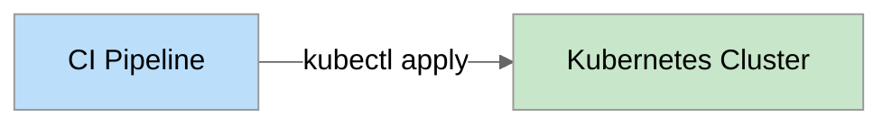
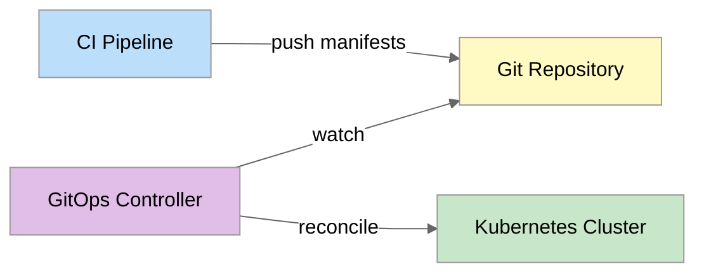

---
# Required
sidebar_position: 9
title: "Kubernetes and GitOps Delivery"
description: >-
  Master Kubernetes CI/CD with GitOps. Learn container image building, Helm vs Kustomize, 
  ArgoCD and Flux implementation, and Kubernetes secrets management patterns for 
  production-grade deployments.

# SEO
keywords:
  - kubernetes ci/cd
  - gitops
  - argocd
  - flux
  - helm
  - kustomize
  - kubernetes deployment
  - container orchestration
  - kubernetes secrets
  - vault kubernetes
  - external secrets operator
  - sealed secrets
  - kubernetes manifests
  - container registry

# Social sharing
og_title: "Kubernetes and GitOps: Modern Cloud-Native CI/CD"
og_description: "Master GitOps with ArgoCD and Flux. Learn Helm, Kustomize, and Kubernetes secrets management for production."
og_image: "/img/ci-cd-social-card.png"

# Content management
date_published: 2025-01-24
date_modified: 2025-01-24
author: shivam
reading_time: 26
content_type: explanation
---

# Kubernetes and GitOps Delivery

When I first started deploying to Kubernetes at NVIDIA, our process was straightforward but terrifying: build an image, push it, and run `kubectl apply` from a CI pipeline. It worked—until it didn't.

The problem wasn't Kubernetes itself. The problem was that nobody knew the actual state of our clusters. Developers would make "temporary" kubectl changes that became permanent. Configuration would drift between what was in Git and what was running. When something broke, we'd ask "what's actually deployed?" and get different answers from different people.

The CI pipeline was supposed to be the source of truth, but it only told us what we'd *intended* to deploy, not what was *actually* running. The cluster's actual state was a mystery, pieced together from kubectl commands and tribal knowledge.

GitOps changed everything. The principle is simple: Git is the single source of truth. Whatever's in Git is what should be running in the cluster. If someone changes the cluster directly, a reconciliation loop changes it back. If you want to change something, you change Git—there's no other way.

This shift from "push-based" deployments (CI pushes to cluster) to "pull-based" deployments (cluster pulls from Git) seems like a small architectural difference. In practice, it transforms how teams operate. Deployments become auditable (every change is a commit), reversible (revert the commit), and discoverable (look at the repo, not the cluster).

This document covers everything you need to know to deploy to Kubernetes with confidence: building container images, choosing between Helm and Kustomize, implementing GitOps with ArgoCD and Flux, and managing secrets in a Kubernetes-native way.

---

## Building for Kubernetes

Before you can deploy to Kubernetes, you need container images. Building them well—fast, small, secure—is the foundation of Kubernetes CI/CD.

### Container Image Building in CI

**Basic Docker build:**

```yaml
- name: Build and push
  run: |
    docker build -t myregistry.io/myapp:${{ github.sha }} .
    docker push myregistry.io/myapp:${{ github.sha }}
```

**Docker Buildx for advanced builds:**

```yaml
- name: Set up Docker Buildx
  uses: docker/setup-buildx-action@v3

- name: Build and push
  uses: docker/build-push-action@v5
  with:
    context: .
    push: true
    tags: |
      myregistry.io/myapp:${{ github.sha }}
      myregistry.io/myapp:latest
    cache-from: type=gha
    cache-to: type=gha,mode=max
```

### Multi-Architecture Builds

Modern clusters run on multiple architectures (amd64, arm64). Build for all of them:

```yaml
- name: Build multi-arch
  uses: docker/build-push-action@v5
  with:
    context: .
    platforms: linux/amd64,linux/arm64
    push: true
    tags: myregistry.io/myapp:${{ github.sha }}
```

### Rootless Builds with Kaniko

For CI environments where Docker-in-Docker isn't available (like unprivileged Kubernetes pods):

```yaml
# Tekton Task using Kaniko
apiVersion: tekton.dev/v1beta1
kind: Task
metadata:
  name: kaniko-build
spec:
  params:
    - name: IMAGE
      description: Image name to push
  workspaces:
    - name: source
  steps:
    - name: build-and-push
      image: gcr.io/kaniko-project/executor:latest
      args:
        - --dockerfile=$(workspaces.source.path)/Dockerfile
        - --context=$(workspaces.source.path)
        - --destination=$(params.IMAGE)
        - --cache=true
```

### Image Optimization

Smaller images deploy faster and have smaller attack surfaces:

```dockerfile
# Multi-stage build
FROM node:20 AS builder
WORKDIR /app
COPY package*.json ./
RUN npm ci
COPY . .
RUN npm run build

FROM node:20-slim AS runtime
WORKDIR /app
# Only copy what's needed
COPY --from=builder /app/dist ./dist
COPY --from=builder /app/node_modules ./node_modules
COPY --from=builder /app/package.json ./

# Run as non-root
USER node
EXPOSE 3000
CMD ["node", "dist/index.js"]
```

**Distroless images for production:**

```dockerfile
FROM node:20 AS builder
WORKDIR /app
COPY . .
RUN npm ci && npm run build

FROM gcr.io/distroless/nodejs20-debian12
WORKDIR /app
COPY --from=builder /app/dist ./dist
COPY --from=builder /app/node_modules ./node_modules
CMD ["dist/index.js"]
```

### Image Security Scanning

Scan images before pushing to registry:

```yaml
- name: Build image
  run: docker build -t myapp:${{ github.sha }} .

- name: Scan for vulnerabilities
  uses: aquasecurity/trivy-action@master
  with:
    image-ref: myapp:${{ github.sha }}
    exit-code: 1
    severity: CRITICAL,HIGH

- name: Push image
  if: success()
  run: |
    docker tag myapp:${{ github.sha }} myregistry.io/myapp:${{ github.sha }}
    docker push myregistry.io/myapp:${{ github.sha }}
```

---

## Kubernetes Deployment Approaches

You have three main options for managing Kubernetes manifests: raw YAML, Helm, and Kustomize. Each has its place.

### Raw Manifests with kubectl

The simplest approach—plain YAML files applied with kubectl:

```yaml
# deployment.yaml
apiVersion: apps/v1
kind: Deployment
metadata:
  name: myapp
spec:
  replicas: 3
  selector:
    matchLabels:
      app: myapp
  template:
    metadata:
      labels:
        app: myapp
    spec:
      containers:
        - name: myapp
          image: myregistry.io/myapp:v1.0.0
          ports:
            - containerPort: 8080
```

```yaml
# CI deployment
- name: Deploy
  run: kubectl apply -f k8s/
```

**Good for:**
- Simple applications
- Learning Kubernetes
- When you need full control

**Challenges:**
- No templating (environment differences require duplicate files)
- No package management (dependencies are manual)
- Hard to manage at scale

### Helm: The Kubernetes Package Manager

Helm adds templating and packaging to Kubernetes manifests. When I was building CI/CD as a service at NVIDIA, Helm became our standard for deploying applications—it provided the flexibility we needed to deploy the same application differently across environments.

```yaml
# templates/deployment.yaml
apiVersion: apps/v1
kind: Deployment
metadata:
  name: {{ .Release.Name }}
spec:
  replicas: {{ .Values.replicaCount }}
  selector:
    matchLabels:
      app: {{ .Release.Name }}
  template:
    metadata:
      labels:
        app: {{ .Release.Name }}
    spec:
      containers:
        - name: {{ .Chart.Name }}
          image: "{{ .Values.image.repository }}:{{ .Values.image.tag }}"
          ports:
            - containerPort: {{ .Values.service.port }}
          resources:
            {{- toYaml .Values.resources | nindent 12 }}
```

```yaml
# values.yaml (defaults)
replicaCount: 1
image:
  repository: myregistry.io/myapp
  tag: latest
service:
  port: 8080
resources:
  requests:
    memory: "256Mi"
    cpu: "100m"
  limits:
    memory: "512Mi"
    cpu: "200m"
```

```yaml
# values-prod.yaml (production overrides)
replicaCount: 5
image:
  tag: v1.0.0
resources:
  requests:
    memory: "1Gi"
    cpu: "500m"
  limits:
    memory: "2Gi"
    cpu: "1000m"
```

**Deploy with Helm:**

```yaml
- name: Deploy with Helm
  run: |
    helm upgrade --install myapp ./charts/myapp \
      -f values-${{ inputs.environment }}.yaml \
      --set image.tag=${{ github.sha }} \
      --namespace myapp \
      --wait
```

#### Helm Hooks

Helm hooks run jobs at specific lifecycle points:

```yaml
# Pre-upgrade job (e.g., database migrations)
apiVersion: batch/v1
kind: Job
metadata:
  name: {{ .Release.Name }}-migrate
  annotations:
    "helm.sh/hook": pre-upgrade
    "helm.sh/hook-weight": "-5"
    "helm.sh/hook-delete-policy": hook-succeeded
spec:
  template:
    spec:
      containers:
        - name: migrate
          image: "{{ .Values.image.repository }}:{{ .Values.image.tag }}"
          command: ["./migrate.sh"]
      restartPolicy: Never
```

#### Helm Testing

Test releases before considering them successful:

```yaml
# templates/tests/test-connection.yaml
apiVersion: v1
kind: Pod
metadata:
  name: "{{ .Release.Name }}-test"
  annotations:
    "helm.sh/hook": test
spec:
  containers:
    - name: curl
      image: curlimages/curl
      command: ['curl', '-f', 'http://{{ .Release.Name }}:{{ .Values.service.port }}/health']
  restartPolicy: Never
```

```bash
# Run tests after deployment
helm test myapp
```

### Kustomize: Configuration Customization

Kustomize takes a different approach—instead of templating, you start with a base configuration and patch it for different environments.

```yaml
# base/deployment.yaml
apiVersion: apps/v1
kind: Deployment
metadata:
  name: myapp
spec:
  replicas: 1
  selector:
    matchLabels:
      app: myapp
  template:
    metadata:
      labels:
        app: myapp
    spec:
      containers:
        - name: myapp
          image: myregistry.io/myapp
          ports:
            - containerPort: 8080
```

```yaml
# base/kustomization.yaml
apiVersion: kustomize.config.k8s.io/v1beta1
kind: Kustomization
resources:
  - deployment.yaml
  - service.yaml
```

```yaml
# overlays/production/kustomization.yaml
apiVersion: kustomize.config.k8s.io/v1beta1
kind: Kustomization
namespace: production
resources:
  - ../../base
replicas:
  - name: myapp
    count: 5
images:
  - name: myregistry.io/myapp
    newTag: v1.0.0
patches:
  - path: increase-resources.yaml
```

```yaml
# overlays/production/increase-resources.yaml
apiVersion: apps/v1
kind: Deployment
metadata:
  name: myapp
spec:
  template:
    spec:
      containers:
        - name: myapp
          resources:
            requests:
              memory: "1Gi"
              cpu: "500m"
```

**Deploy with Kustomize:**

```yaml
- name: Deploy with Kustomize
  run: kubectl apply -k overlays/${{ inputs.environment }}
```

### Helm vs. Kustomize: When to Use Each

| Factor | Helm | Kustomize |
|--------|------|-----------|
| **Learning curve** | Steeper (templating) | Gentler (patching) |
| **Package sharing** | Excellent (charts) | Limited |
| **Complex logic** | Yes (Go templates) | No |
| **Native kubectl** | No (requires helm) | Yes (built-in) |
| **Rollback** | Native (helm rollback) | Manual |
| **Third-party apps** | Common (Bitnami, etc.) | Rare |

**My recommendation:**
- Use **Helm** for shared applications, third-party dependencies, and when you need sophisticated templating
- Use **Kustomize** for internal applications where patching is simpler than templating
- Don't mix them unless you have a good reason

---

## GitOps: Git as the Source of Truth

GitOps is an operational pattern where the desired state of your infrastructure is stored in Git, and automated systems ensure the actual state matches.

### Push vs. Pull Deployments

**Push-based (traditional CI/CD):**


CI has credentials to the cluster and pushes changes.

**Pull-based (GitOps):**


A controller inside the cluster watches Git and pulls changes.

### Benefits of GitOps

1. **Git is the source of truth** — What's in Git is what's deployed
2. **Audit trail** — Every change is a commit
3. **Easy rollback** — Revert the commit
4. **Drift detection** — Controller alerts on unauthorized changes
5. **Self-healing** — Controller reverts drift automatically
6. **Improved security** — CI doesn't need cluster credentials

### ArgoCD

ArgoCD is the most popular GitOps tool for Kubernetes. It runs in your cluster and continuously syncs from Git repositories.

**Install ArgoCD:**

```bash
kubectl create namespace argocd
kubectl apply -n argocd -f https://raw.githubusercontent.com/argoproj/argo-cd/stable/manifests/install.yaml
```

**Application definition:**

```yaml
apiVersion: argoproj.io/v1alpha1
kind: Application
metadata:
  name: myapp
  namespace: argocd
spec:
  project: default
  source:
    repoURL: https://github.com/myorg/myapp-manifests
    targetRevision: main
    path: overlays/production
  destination:
    server: https://kubernetes.default.svc
    namespace: myapp
  syncPolicy:
    automated:
      prune: true      # Delete resources removed from Git
      selfHeal: true   # Revert manual changes
    syncOptions:
      - CreateNamespace=true
```

**ArgoCD sync options:**

```yaml
syncPolicy:
  automated:
    prune: true           # Remove resources not in Git
    selfHeal: true        # Revert drift
    allowEmpty: false     # Don't sync empty manifests
  syncOptions:
    - Validate=true       # Validate manifests before applying
    - CreateNamespace=true
    - PrunePropagationPolicy=foreground
    - PruneLast=true      # Prune after sync
  retry:
    limit: 5
    backoff:
      duration: 5s
      factor: 2
      maxDuration: 3m
```

**ApplicationSet for multiple environments:**

```yaml
apiVersion: argoproj.io/v1alpha1
kind: ApplicationSet
metadata:
  name: myapp
  namespace: argocd
spec:
  generators:
    - list:
        elements:
          - cluster: development
            url: https://dev-cluster.example.com
          - cluster: staging
            url: https://staging-cluster.example.com
          - cluster: production
            url: https://prod-cluster.example.com
  template:
    metadata:
      name: 'myapp-{{cluster}}'
    spec:
      project: default
      source:
        repoURL: https://github.com/myorg/myapp-manifests
        targetRevision: main
        path: 'overlays/{{cluster}}'
      destination:
        server: '{{url}}'
        namespace: myapp
```

### Flux CD

Flux is another popular GitOps tool, now part of the CNCF. It takes a more modular approach with separate controllers for different concerns.

**Install Flux:**

```bash
flux bootstrap github \
  --owner=myorg \
  --repository=fleet-infra \
  --branch=main \
  --path=clusters/production \
  --personal
```

**Flux GitRepository and Kustomization:**

```yaml
# Source: where to get manifests
apiVersion: source.toolkit.fluxcd.io/v1
kind: GitRepository
metadata:
  name: myapp
  namespace: flux-system
spec:
  interval: 1m
  url: https://github.com/myorg/myapp-manifests
  ref:
    branch: main
---
# Kustomization: how to deploy
apiVersion: kustomize.toolkit.fluxcd.io/v1
kind: Kustomization
metadata:
  name: myapp
  namespace: flux-system
spec:
  interval: 10m
  path: ./overlays/production
  prune: true
  sourceRef:
    kind: GitRepository
    name: myapp
  healthChecks:
    - kind: Deployment
      name: myapp
      namespace: myapp
```

**Flux HelmRelease:**

```yaml
apiVersion: source.toolkit.fluxcd.io/v1beta2
kind: HelmRepository
metadata:
  name: bitnami
  namespace: flux-system
spec:
  interval: 1h
  url: https://charts.bitnami.com/bitnami
---
apiVersion: helm.toolkit.fluxcd.io/v2beta1
kind: HelmRelease
metadata:
  name: redis
  namespace: redis
spec:
  interval: 1h
  chart:
    spec:
      chart: redis
      version: "17.x"
      sourceRef:
        kind: HelmRepository
        name: bitnami
        namespace: flux-system
  values:
    architecture: standalone
    auth:
      enabled: true
```

### ArgoCD vs. Flux

| Factor | ArgoCD | Flux |
|--------|--------|------|
| **UI** | Built-in web UI | No built-in UI (use Weave GitOps) |
| **Multi-cluster** | Native | Via Kustomization |
| **Helm support** | Excellent | Excellent |
| **Learning curve** | Easier | Steeper |
| **Resource usage** | Higher | Lower |
| **Community** | Large | Large (CNCF) |

**My recommendation:** Start with ArgoCD if you want a great UI and easier setup. Use Flux if you prefer declarative everything and lower resource overhead.

### GitOps Repository Structure

Organize your GitOps repository for clarity:

```
gitops-repo/
├── apps/
│   ├── base/
│   │   └── myapp/
│   │       ├── deployment.yaml
│   │       ├── service.yaml
│   │       └── kustomization.yaml
│   └── overlays/
│       ├── development/
│       │   └── kustomization.yaml
│       ├── staging/
│       │   └── kustomization.yaml
│       └── production/
│           └── kustomization.yaml
├── infrastructure/
│   ├── cert-manager/
│   ├── ingress-nginx/
│   └── monitoring/
└── clusters/
    ├── development/
    ├── staging/
    └── production/
```

### Environment Promotion in GitOps

Promoting changes through environments in GitOps:

**Option 1: Branch-based**
```
main → development
staging-branch → staging  
production-branch → production
```

**Option 2: Directory-based (recommended)**
```
main → overlays/development
main → overlays/staging
main → overlays/production
```

**Promotion workflow:**

```yaml
name: Promote to Production

on:
  workflow_dispatch:
    inputs:
      image_tag:
        description: 'Image tag to promote'
        required: true

jobs:
  promote:
    runs-on: ubuntu-latest
    steps:
      - uses: actions/checkout@v4
      
      - name: Update production image tag
        run: |
          cd overlays/production
          kustomize edit set image myregistry.io/myapp:${{ inputs.image_tag }}
      
      - name: Commit and push
        run: |
          git config user.name "github-actions[bot]"
          git config user.email "github-actions[bot]@users.noreply.github.com"
          git add .
          git commit -m "Promote ${{ inputs.image_tag }} to production"
          git push
```

---

## Kubernetes Secrets Management

Storing secrets in Git (even encrypted) requires careful handling. Here are the patterns that work.

### Native Kubernetes Secrets (and Their Limitations)

```yaml
apiVersion: v1
kind: Secret
metadata:
  name: myapp-secrets
type: Opaque
data:
  api-key: YXBpLWtleS12YWx1ZQ==  # base64 encoded
  db-password: c3VwZXItc2VjcmV0    # NOT encrypted!
```

**Problems with native secrets:**
- Base64 is encoding, not encryption
- Anyone with cluster access can read them
- Stored in etcd (hopefully encrypted at rest)
- Hard to rotate
- Can't commit to Git

### Sealed Secrets

Sealed Secrets encrypts secrets so they can be stored in Git. Only the controller in your cluster can decrypt them.

**Install Sealed Secrets:**

```bash
helm repo add sealed-secrets https://bitnami-labs.github.io/sealed-secrets
helm install sealed-secrets sealed-secrets/sealed-secrets -n kube-system
```

**Create a sealed secret:**

```bash
# Create regular secret
kubectl create secret generic myapp-secrets \
  --from-literal=api-key=my-secret-value \
  --dry-run=client -o yaml > secret.yaml

# Seal it
kubeseal --format yaml < secret.yaml > sealed-secret.yaml

# Commit sealed-secret.yaml to Git
```

```yaml
# sealed-secret.yaml (safe to commit)
apiVersion: bitnami.com/v1alpha1
kind: SealedSecret
metadata:
  name: myapp-secrets
spec:
  encryptedData:
    api-key: AgBy8hCM...encrypted...data
```

### External Secrets Operator

External Secrets syncs secrets from external providers (AWS Secrets Manager, Vault, GCP Secret Manager) into Kubernetes.

**Install External Secrets:**

```bash
helm repo add external-secrets https://charts.external-secrets.io
helm install external-secrets external-secrets/external-secrets -n external-secrets --create-namespace
```

**SecretStore (connects to external provider):**

```yaml
apiVersion: external-secrets.io/v1beta1
kind: SecretStore
metadata:
  name: aws-secrets-manager
spec:
  provider:
    aws:
      service: SecretsManager
      region: us-west-2
      auth:
        jwt:
          serviceAccountRef:
            name: external-secrets
```

**ExternalSecret (syncs specific secret):**

```yaml
apiVersion: external-secrets.io/v1beta1
kind: ExternalSecret
metadata:
  name: myapp-secrets
spec:
  refreshInterval: 1h
  secretStoreRef:
    name: aws-secrets-manager
    kind: SecretStore
  target:
    name: myapp-secrets
    creationPolicy: Owner
  data:
    - secretKey: api-key
      remoteRef:
        key: myapp/production/api-key
    - secretKey: db-password
      remoteRef:
        key: myapp/production/db-password
```

### HashiCorp Vault with Kubernetes

For teams already using Vault (like we did at NVIDIA), the Vault Agent Injector automatically injects secrets into pods.

**Install Vault Agent Injector:**

```bash
helm repo add hashicorp https://helm.releases.hashicorp.com
helm install vault hashicorp/vault \
  --set "injector.enabled=true" \
  --set "server.enabled=false"  # Using external Vault
```

**Configure Vault Kubernetes auth:**

```bash
vault auth enable kubernetes

vault write auth/kubernetes/config \
  kubernetes_host="https://kubernetes.default.svc"

vault write auth/kubernetes/role/myapp \
  bound_service_account_names=myapp \
  bound_service_account_namespaces=myapp \
  policies=myapp-policy \
  ttl=1h
```

**Annotate pod for secret injection:**

```yaml
apiVersion: apps/v1
kind: Deployment
metadata:
  name: myapp
spec:
  template:
    metadata:
      annotations:
        vault.hashicorp.com/agent-inject: "true"
        vault.hashicorp.com/role: "myapp"
        vault.hashicorp.com/agent-inject-secret-config: "secret/data/myapp/config"
        vault.hashicorp.com/agent-inject-template-config: |
          {{- with secret "secret/data/myapp/config" -}}
          export API_KEY="{{ .Data.data.api_key }}"
          export DB_PASSWORD="{{ .Data.data.db_password }}"
          {{- end }}
    spec:
      serviceAccountName: myapp
      containers:
        - name: myapp
          image: myapp:v1.0.0
          command: ["/bin/sh", "-c", "source /vault/secrets/config && ./start.sh"]
```

### Choosing a Secrets Solution

| Solution | GitOps Compatible | External Provider | Rotation | Complexity |
|----------|------------------|-------------------|----------|------------|
| Native Secrets | No (insecure) | No | Manual | Low |
| Sealed Secrets | Yes | No | Manual | Low |
| External Secrets | Yes | Yes | Automatic | Medium |
| Vault Injector | Partial | Yes (Vault) | Automatic | High |

**My recommendation:**
- **Sealed Secrets** for simple setups where you're okay managing secrets manually
- **External Secrets Operator** for AWS/GCP/Azure shops who want to use native secret managers
- **Vault Agent Injector** if you're already invested in Vault infrastructure

---

## Putting It All Together: A Complete GitOps Pipeline

Here's a complete pipeline from code to production using GitOps:

```yaml
# .github/workflows/ci.yml - Application repository
name: CI

on:
  push:
    branches: [main]
  pull_request:
    branches: [main]

jobs:
  build:
    runs-on: ubuntu-latest
    outputs:
      image_tag: ${{ steps.meta.outputs.tags }}
    steps:
      - uses: actions/checkout@v4
      
      - name: Set up Docker Buildx
        uses: docker/setup-buildx-action@v3
      
      - name: Login to registry
        uses: docker/login-action@v3
        with:
          registry: ghcr.io
          username: ${{ github.actor }}
          password: ${{ secrets.GITHUB_TOKEN }}
      
      - name: Extract metadata
        id: meta
        uses: docker/metadata-action@v5
        with:
          images: ghcr.io/${{ github.repository }}
          tags: |
            type=sha
      
      - name: Build and push
        uses: docker/build-push-action@v5
        with:
          context: .
          push: ${{ github.event_name != 'pull_request' }}
          tags: ${{ steps.meta.outputs.tags }}
          cache-from: type=gha
          cache-to: type=gha,mode=max
      
      - name: Scan for vulnerabilities
        uses: aquasecurity/trivy-action@master
        with:
          image-ref: ghcr.io/${{ github.repository }}:sha-${{ github.sha }}
          exit-code: 1
          severity: CRITICAL

  test:
    runs-on: ubuntu-latest
    steps:
      - uses: actions/checkout@v4
      - run: npm ci
      - run: npm test

  update-manifests:
    if: github.event_name == 'push' && github.ref == 'refs/heads/main'
    needs: [build, test]
    runs-on: ubuntu-latest
    steps:
      - name: Checkout manifests repo
        uses: actions/checkout@v4
        with:
          repository: myorg/gitops-manifests
          token: ${{ secrets.GITOPS_TOKEN }}
      
      - name: Update image tag
        run: |
          cd overlays/development
          kustomize edit set image ghcr.io/${{ github.repository }}:sha-${{ github.sha }}
      
      - name: Commit and push
        run: |
          git config user.name "github-actions[bot]"
          git config user.email "github-actions[bot]@users.noreply.github.com"
          git add .
          git commit -m "Update image to sha-${{ github.sha }}"
          git push
```

```yaml
# ArgoCD Application watching the manifests repo
apiVersion: argoproj.io/v1alpha1
kind: Application
metadata:
  name: myapp-development
  namespace: argocd
spec:
  project: default
  source:
    repoURL: https://github.com/myorg/gitops-manifests
    targetRevision: main
    path: overlays/development
  destination:
    server: https://kubernetes.default.svc
    namespace: myapp
  syncPolicy:
    automated:
      prune: true
      selfHeal: true
```

**The flow:**

1. Developer pushes code to application repo
2. CI builds image, runs tests, scans for vulnerabilities
3. CI updates image tag in GitOps manifests repo
4. ArgoCD detects change and syncs to cluster
5. Application is deployed

---

## What's Next?

You now understand how to build container images, choose between Helm and Kustomize, implement GitOps with ArgoCD and Flux, and manage secrets in Kubernetes. These patterns form the foundation of cloud-native CI/CD.

The next document in this series provides **Platform Examples**: complete, working pipeline configurations for GitHub Actions, GitLab CI, Google Cloud Build, and Jenkins that you can adapt for your own projects.

**Ready to see complete pipeline examples?** Continue to [Platform Examples →](./platform-examples)

---

## Quick Reference

### Build Tools Comparison

| Tool | Use Case | Pros | Cons |
|------|----------|------|------|
| Docker | General | Familiar, well-documented | Requires Docker daemon |
| Buildx | Multi-arch, caching | Fast, flexible | Complexity |
| Kaniko | Unprivileged CI | No daemon needed | Slower |
| ko | Go applications | Fast, small images | Go only |

### Kubernetes Manifest Tools

| Tool | Philosophy | Best For |
|------|------------|----------|
| kubectl | Direct apply | Simple apps, learning |
| Helm | Templating & packaging | Shared apps, complexity |
| Kustomize | Patching & overlays | Internal apps, GitOps |

### GitOps Tools

| Tool | UI | Multi-cluster | Helm | Complexity |
|------|-----|---------------|------|------------|
| ArgoCD | Yes | Yes | Yes | Medium |
| Flux | External | Via Kustomization | Yes | Medium |

### Secrets Solutions

| Solution | Git-Safe | External Provider | Auto-Rotation |
|----------|----------|-------------------|---------------|
| Sealed Secrets | Yes | No | No |
| External Secrets | Yes | Yes | Yes |
| Vault Injector | Partial | Vault | Yes |

### GitOps Checklist

- [ ] Git repository is source of truth
- [ ] All changes go through Git (no kubectl apply)
- [ ] Automated sync enabled
- [ ] Drift detection/self-healing enabled
- [ ] Secrets handled securely (not plain in Git)
- [ ] Environment promotion workflow defined
- [ ] Rollback procedure documented

### Warning Signs

- Developers running kubectl apply directly
- Cluster state doesn't match Git
- Secrets committed to Git (even base64)
- No drift detection
- Manual deployment steps
- Different tools for different environments

---

**Remember:** GitOps isn't just about tools—it's about the principle that Git is the single source of truth. Once you commit to that principle, the tooling choices become secondary.
