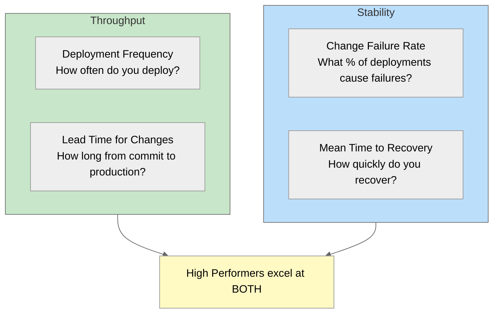

---
# Required
sidebar_position: 11
title: "Metrics, Measurement, and Maturity in CI/CD"
description: >-
  Master DORA metrics, pipeline performance measurement, and CI/CD maturity assessment. 
  Learn to measure deployment frequency, lead time, MTTR, and change failure rate to 
  drive continuous improvement.

# SEO
keywords:
  - dora metrics
  - deployment frequency
  - lead time for changes
  - mean time to recovery
  - change failure rate
  - ci/cd metrics
  - pipeline metrics
  - ci/cd maturity model
  - devops metrics
  - software delivery performance
  - engineering metrics
  - ci/cd kpis

# Social sharing
og_title: "CI/CD Metrics and Maturity: DORA Metrics and Beyond"
og_description: "Learn to measure CI/CD effectiveness with DORA metrics and assess your organization's maturity level."
og_image: "/img/ci-cd-social-card.svg"

# Content management
date_published: 2025-01-24
date_modified: 2025-01-24
author: shivam
reading_time: 20
content_type: explanation
---

# Metrics, Measurement, and Maturity

"How good is our CI/CD?" It's a question I've been asked by leadership at every organization I've worked with. At NVIDIA, when I was building dashboards to monitor builds, deployments, and cluster health, the question became concrete: what numbers do we put on those dashboards? What actually indicates whether we're doing well?

The honest answer is that most teams don't know. They have gut feelings. They know deployments are "painful" or "pretty smooth." They sense that the pipeline is "slow" or "usually works." But when pressed for specifics—how slow? How often does it fail? How long to recover from incidents?—the answers are vague.

This vagueness is a problem because you can't improve what you don't measure. "Make deployments better" is not actionable. "Reduce deployment lead time from 3 days to 4 hours" is actionable. "Fix the flaky tests" is wishful thinking. "Reduce test flakiness from 15% to under 2%" is a goal you can track.

This document is about measuring CI/CD effectively. We'll cover the DORA metrics that correlate with organizational performance, pipeline-specific metrics that help identify bottlenecks, and a maturity model that helps you understand where you are and where to go next.

---

## The DORA Metrics

DORA (DevOps Research and Assessment) spent years studying thousands of organizations to identify which practices actually correlate with high performance. They found four key metrics that predict both technical and organizational success:



The key insight from DORA research: **high performers don't trade off speed for stability—they excel at both**. This challenges the traditional assumption that moving fast means breaking things. In fact, organizations that deploy more frequently tend to have *lower* failure rates, not higher.

### Deployment Frequency

**What it measures:** How often your team deploys to production.

**Why it matters:** Frequent deployments indicate small batch sizes, good automation, and confidence in your release process. Large, infrequent deployments suggest fear, manual processes, and integration pain.

| Performance Level | Deployment Frequency |
|------------------|---------------------|
| Elite | On-demand (multiple per day) |
| High | Between once per day and once per week |
| Medium | Between once per week and once per month |
| Low | Between once per month and once every six months |

**How to measure:**

```sql
-- Count production deployments per time period
SELECT 
    DATE_TRUNC('week', deployed_at) AS week,
    COUNT(*) AS deployments
FROM deployments
WHERE environment = 'production'
GROUP BY 1
ORDER BY 1;
```

**What affects it:**
- Pipeline speed (slow pipelines discourage deployment)
- Test confidence (low confidence means more manual checks)
- Feature flag usage (enables smaller, safer deployments)
- Organizational approval processes

### Lead Time for Changes

**What it measures:** The time from code commit to production deployment.

**Why it matters:** Short lead times mean fast feedback loops. Developers see their changes in production quickly, learn from real usage, and can iterate rapidly. Long lead times mean slow feedback, large batches, and integration problems.

| Performance Level | Lead Time |
|------------------|-----------|
| Elite | Less than one hour |
| High | Between one day and one week |
| Medium | Between one week and one month |
| Low | Between one month and six months |

**How to measure:**

```sql
-- Calculate lead time from commit to deploy
SELECT 
    AVG(deployed_at - committed_at) AS avg_lead_time,
    PERCENTILE_CONT(0.5) WITHIN GROUP (ORDER BY deployed_at - committed_at) AS median_lead_time,
    PERCENTILE_CONT(0.95) WITHIN GROUP (ORDER BY deployed_at - committed_at) AS p95_lead_time
FROM (
    SELECT 
        c.committed_at,
        d.deployed_at
    FROM commits c
    JOIN deployments d ON c.sha = d.commit_sha
    WHERE d.environment = 'production'
    AND d.deployed_at > NOW() - INTERVAL '30 days'
);
```

**What affects it:**
- Pipeline duration (the floor of your lead time)
- Code review speed (often the biggest bottleneck)
- Testing time (comprehensive tests take time)
- Approval processes (manual gates add delay)

### Change Failure Rate

**What it measures:** The percentage of deployments that cause failures in production.

**Why it matters:** Low failure rates indicate good testing, quality processes, and deployment practices. High failure rates mean releases are risky and teams become afraid to deploy.

| Performance Level | Change Failure Rate |
|------------------|-------------------|
| Elite | 0-5% |
| High | 5-15% |
| Medium | 15-30% |
| Low | 30-60% |

**How to measure:**

```sql
-- Calculate change failure rate
SELECT 
    COUNT(CASE WHEN caused_incident THEN 1 END)::FLOAT / COUNT(*) * 100 AS failure_rate
FROM deployments
WHERE environment = 'production'
AND deployed_at > NOW() - INTERVAL '30 days';
```

**What counts as a failure:**
- Deployment causes an incident
- Rollback required
- Hotfix deployed within 24 hours
- Service degradation detected

**What affects it:**
- Test coverage and quality
- Deployment strategy (canary catches issues earlier)
- Monitoring and alerting (detect problems quickly)
- Feature flags (limit blast radius)

### Mean Time to Recovery (MTTR)

**What it measures:** How quickly you recover from production incidents.

**Why it matters:** Failures will happen. What separates high performers is how quickly they recover. Fast MTTR means incidents are minor inconveniences. Slow MTTR means they're business-critical events.

| Performance Level | MTTR |
|------------------|------|
| Elite | Less than one hour |
| High | Less than one day |
| Medium | Between one day and one week |
| Low | Between one week and one month |

**How to measure:**

```sql
-- Calculate MTTR
SELECT 
    AVG(resolved_at - detected_at) AS avg_mttr,
    PERCENTILE_CONT(0.5) WITHIN GROUP (ORDER BY resolved_at - detected_at) AS median_mttr
FROM incidents
WHERE severity IN ('high', 'critical')
AND resolved_at > NOW() - INTERVAL '90 days';
```

**What affects it:**
- Monitoring and alerting (faster detection)
- Rollback capabilities (instant rollback = instant recovery)
- Runbooks and documentation
- On-call practices and escalation

---

## Pipeline Metrics

Beyond DORA metrics, pipeline-specific measurements help identify and fix bottlenecks.

### Build Success Rate

```sql
SELECT 
    DATE_TRUNC('day', started_at) AS day,
    COUNT(CASE WHEN status = 'success' THEN 1 END)::FLOAT / COUNT(*) * 100 AS success_rate
FROM pipeline_runs
WHERE started_at > NOW() - INTERVAL '30 days'
GROUP BY 1
ORDER BY 1;
```

**Healthy target:** >95% success rate

**When it's low:**
- Flaky tests (investigate and fix)
- Infrastructure issues (runners, dependencies)
- Code quality problems (more pre-commit checks)

### Pipeline Duration

```sql
SELECT 
    pipeline_name,
    AVG(finished_at - started_at) AS avg_duration,
    PERCENTILE_CONT(0.5) WITHIN GROUP (ORDER BY finished_at - started_at) AS median_duration,
    PERCENTILE_CONT(0.95) WITHIN GROUP (ORDER BY finished_at - started_at) AS p95_duration
FROM pipeline_runs
WHERE status = 'success'
AND started_at > NOW() - INTERVAL '7 days'
GROUP BY 1;
```

**Healthy targets:**
- Lint/type check: <2 minutes
- Unit tests: <5 minutes
- Full pipeline: <15 minutes
- Deploy: <5 minutes

### Queue Time

Time spent waiting for a runner before execution starts:

```sql
SELECT 
    AVG(started_at - queued_at) AS avg_queue_time,
    PERCENTILE_CONT(0.95) WITHIN GROUP (ORDER BY started_at - queued_at) AS p95_queue_time
FROM pipeline_runs
WHERE queued_at > NOW() - INTERVAL '7 days';
```

**Healthy target:** <30 seconds average, <2 minutes p95

**When it's high:**
- Not enough runners
- Runners are too slow
- Too many concurrent pipelines

### Test Flakiness Rate

```sql
SELECT 
    test_name,
    COUNT(CASE WHEN status = 'failed' THEN 1 END)::FLOAT / COUNT(*) * 100 AS failure_rate,
    COUNT(*) AS total_runs
FROM test_runs
WHERE started_at > NOW() - INTERVAL '30 days'
GROUP BY 1
HAVING COUNT(*) > 10
AND COUNT(CASE WHEN status = 'failed' THEN 1 END)::FLOAT / COUNT(*) BETWEEN 0.01 AND 0.50
ORDER BY failure_rate DESC;
```

**Healthy target:** <2% flaky test rate

Tests that fail between 1% and 50% of the time are likely flaky (not deterministic failures).

### Cache Hit Rate

```sql
SELECT 
    cache_key_prefix,
    COUNT(CASE WHEN cache_hit THEN 1 END)::FLOAT / COUNT(*) * 100 AS hit_rate
FROM pipeline_steps
WHERE step_name LIKE '%cache%'
AND started_at > NOW() - INTERVAL '7 days'
GROUP BY 1;
```

**Healthy target:** >80% cache hit rate

**When it's low:**
- Cache keys are too specific
- Cache is being evicted (size limits)
- Lock files changing frequently

---

## Measuring and Tracking

Collecting metrics is only useful if you can analyze and act on them.

### Data Sources

| Metric | Data Source |
|--------|-------------|
| Deployment frequency | CI/CD platform API, deployment logs |
| Lead time | Git commits + deployment timestamps |
| Change failure rate | Incident management + deployments |
| MTTR | Incident management system |
| Pipeline metrics | CI/CD platform API |

### Tools for Collection

**GitHub Actions:**
```yaml
- name: Record deployment metrics
  run: |
    curl -X POST "$METRICS_ENDPOINT" \
      -H "Content-Type: application/json" \
      -d '{
        "deployment_id": "${{ github.run_id }}",
        "commit_sha": "${{ github.sha }}",
        "deployed_at": "'$(date -u +%Y-%m-%dT%H:%M:%SZ)'",
        "environment": "production",
        "duration_seconds": "'$SECONDS'"
      }'
```

**Datadog CI Visibility:**
```yaml
- name: Configure Datadog
  run: |
    npm install -g @datadog/datadog-ci
    datadog-ci git-metadata upload
```

**Prometheus + Grafana:**
```yaml
# Push metrics to Prometheus Pushgateway
- name: Push metrics
  run: |
    echo "pipeline_duration_seconds ${{ job.duration }}" | curl --data-binary @- http://pushgateway:9091/metrics/job/pipeline/instance/${{ github.repository }}
```

### Dashboard Examples

A useful CI/CD dashboard includes:

**Real-time panel:**
- Current pipeline status (running, queued)
- Last deployment status and time
- Active incidents

**Daily/weekly trends:**
- Deployment frequency over time
- Lead time trend (should decrease)
- Success rate trend (should increase)
- MTTR trend (should decrease)

**Bottleneck identification:**
- Slowest pipeline stages
- Most frequently failing tests
- Queue time distribution
- Cache hit rates

---

## CI/CD Maturity Model

Where is your organization on the CI/CD journey? This maturity model helps assess your current state and plan improvements.

### Level 1: Initial (Manual)

**Characteristics:**
- Deployments are manual or script-based
- No consistent testing before deployment
- Releases are infrequent (monthly or less)
- Environment inconsistency is common
- "It works on my machine" is a common phrase

**Metrics:**
- Deployment frequency: Monthly or less
- Lead time: Weeks to months
- Change failure rate: >50%
- MTTR: Days to weeks

**Focus for improvement:**
- Implement basic CI (build on every commit)
- Add automated unit tests
- Version control everything

### Level 2: Basic Automation

**Characteristics:**
- CI runs on every commit
- Basic automated testing exists
- Deployments are scripted (but may be manually triggered)
- Some test coverage
- Builds are generally reproducible

**Metrics:**
- Deployment frequency: Weekly
- Lead time: Days
- Change failure rate: 30-50%
- MTTR: Days

**Focus for improvement:**
- Add integration tests
- Automate deployment to staging
- Implement code review requirements
- Add security scanning

### Level 3: Standardized

**Characteristics:**
- Consistent pipeline across projects
- Multiple test stages (unit, integration, e2e)
- Automated deployment to staging
- Manual approval for production
- Good test coverage
- Pipeline failures block deployment

**Metrics:**
- Deployment frequency: Daily to weekly
- Lead time: Hours to days
- Change failure rate: 15-30%
- MTTR: Hours

**Focus for improvement:**
- Automate production deployment
- Implement feature flags
- Add canary deployments
- Improve monitoring and observability

### Level 4: Measured and Optimized

**Characteristics:**
- Fully automated deployment to production
- DORA metrics tracked and reported
- Pipeline optimization based on data
- Fast feedback loops (<15 min pipeline)
- Comprehensive testing and security
- Feature flags for progressive rollout

**Metrics:**
- Deployment frequency: Daily or multiple per day
- Lead time: Less than one day
- Change failure rate: 0-15%
- MTTR: Less than one hour

**Focus for improvement:**
- Continuous improvement culture
- Self-healing systems
- Advanced deployment strategies
- Platform engineering

### Level 5: Continuous Improvement

**Characteristics:**
- CI/CD is a competitive advantage
- Experimentation is easy and safe
- Teams self-service CI/CD needs
- Proactive optimization
- Industry-leading metrics
- Learning from every failure

**Metrics:**
- Deployment frequency: On-demand
- Lead time: Less than one hour
- Change failure rate: <5%
- MTTR: Minutes

**Focus:**
- Maintain excellence
- Share learnings externally
- Pioneer new practices

### Assessing Your Level

Answer these questions:

| Question | No = Lower | Yes = Higher |
|----------|------------|--------------|
| Do you have automated tests? | L1 | L2+ |
| Do tests run on every commit? | L1-2 | L3+ |
| Is deployment automated? | L2 | L3+ |
| Can you deploy on-demand? | L3 | L4+ |
| Do you track DORA metrics? | L3 | L4+ |
| Is pipeline time <15 minutes? | L3 | L4+ |
| Is change failure rate <15%? | L3 | L4+ |
| Do teams self-service CI/CD? | L4 | L5 |

---

## Common Pitfalls in Measurement

### Pitfall 1: Gaming Metrics

When metrics become targets, people optimize for the metric, not the outcome.

**Example:** Counting "deployments" but not whether they contain meaningful changes. Teams do empty deployments to hit frequency targets.

**Fix:** Use metrics for learning, not performance reviews. Focus on outcomes (customer value) not just outputs (deployment count).

### Pitfall 2: Measuring Too Much

Tracking fifty metrics means you're not focusing on any of them.

**Fix:** Start with the four DORA metrics. Add pipeline-specific metrics only when investigating specific problems.

### Pitfall 3: Not Acting on Data

Dashboards that nobody looks at. Metrics that don't drive decisions.

**Fix:** Review metrics in team retrospectives. Set specific improvement goals. Celebrate progress.

### Pitfall 4: Comparing Teams Unfairly

Different teams have different contexts. Comparing a startup to an enterprise is meaningless.

**Fix:** Compare teams against themselves over time. Compare against industry benchmarks only as rough guidance.

### Pitfall 5: Ignoring Context

Metrics without context are noise. MTTR improved—but is that because incidents are fewer or because you lowered severity classifications?

**Fix:** Always include context. Track related metrics together. Investigate anomalies before celebrating.

---

## Benchmarking Against Industry

DORA publishes annual "State of DevOps" reports with industry benchmarks. Use these for rough comparison, not strict targets.

### 2024 Benchmarks (approximate)

| Metric | Elite | High | Medium | Low |
|--------|-------|------|--------|-----|
| Deployment frequency | On-demand | Daily-weekly | Weekly-monthly | Monthly+ |
| Lead time | <1 hour | <1 week | <1 month | 1-6 months |
| Change failure rate | <5% | 10-15% | 15-30% | 45%+ |
| MTTR | <1 hour | <1 day | <1 week | 1+ week |

### What High Performers Do Differently

Research consistently shows high performers:

1. **Invest in automation** — Not just CI/CD, but testing, monitoring, infrastructure
2. **Use trunk-based development** — Short-lived branches, frequent integration
3. **Deploy small changes frequently** — Lower risk per deployment
4. **Practice continuous improvement** — Regular retrospectives, learning from incidents
5. **Have strong technical practices** — Code review, automated testing, monitoring
6. **Embrace failure** — Blameless postmortems, experimentation culture

---

## Setting Improvement Goals

Use the SMART framework for CI/CD improvement goals:

**Specific:** "Reduce pipeline duration" → "Reduce main pipeline duration from 25 minutes to 10 minutes"

**Measurable:** "Improve testing" → "Increase test coverage from 60% to 80%"

**Achievable:** "Deploy every minute" → "Deploy daily" (if currently weekly)

**Relevant:** "Add more metrics" → "Track DORA metrics to identify bottlenecks"

**Time-bound:** "Eventually improve lead time" → "Reduce lead time by 50% in Q1"

### Example Improvement Plan

**Current state:**
- Deployment frequency: Weekly
- Lead time: 5 days
- Change failure rate: 25%
- MTTR: 12 hours

**6-month goals:**
- Deployment frequency: Daily
- Lead time: <1 day
- Change failure rate: <15%
- MTTR: <1 hour

**Initiatives:**
1. Reduce pipeline time from 45 min to 15 min (enables more frequent deployment)
2. Implement canary deployments (reduces blast radius, lowers CFR)
3. Add automated rollback (reduces MTTR)
4. Improve test coverage (catches issues earlier, lowers CFR)
5. Implement feature flags (enables safer daily deployment)

---

## What's Next?

You now understand how to measure CI/CD effectiveness using DORA metrics, track pipeline performance, assess your organization's maturity level, and set data-driven improvement goals.

The next document in this series covers **Pipeline Optimization**: how to make your pipelines faster, identify bottlenecks, optimize caching, and reduce costs.

**Ready to optimize your pipelines?** Continue to [Pipeline Optimization →](./pipeline-optimization)

---

## Quick Reference

### DORA Metrics Targets

| Metric | Elite | High | Medium | Low |
|--------|-------|------|--------|-----|
| Deploy frequency | Multiple/day | Weekly-daily | Monthly-weekly | <Monthly |
| Lead time | <1 hour | <1 week | <1 month | >1 month |
| Change failure rate | <5% | 10-15% | 15-30% | >45% |
| MTTR | <1 hour | <1 day | <1 week | >1 week |

### Pipeline Health Indicators

| Metric | Healthy | Investigate |
|--------|---------|-------------|
| Success rate | >95% | <90% |
| Duration | <15 min | >30 min |
| Queue time | <30 sec | >2 min |
| Flaky test rate | <2% | >5% |
| Cache hit rate | >80% | <50% |

### Maturity Quick Assessment

- **Level 1:** Manual deployments, no CI
- **Level 2:** Basic CI, manual deploys
- **Level 3:** Automated pipeline, manual prod approval
- **Level 4:** Fully automated, metrics-driven
- **Level 5:** Continuous improvement, self-service

### Measurement Checklist

- [ ] Tracking deployment frequency
- [ ] Tracking lead time for changes
- [ ] Tracking change failure rate
- [ ] Tracking MTTR
- [ ] Dashboard for real-time visibility
- [ ] Regular metrics review in retros
- [ ] Improvement goals documented
- [ ] Progress tracked over time

### Warning Signs

- No metrics at all
- Metrics not reviewed regularly
- Teams gaming metrics
- Metrics without context
- No improvement goals
- Comparing teams without context

---

**Remember:** Metrics exist to drive improvement, not to judge performance. Use them to understand where you are, identify bottlenecks, and celebrate progress. The goal is better software delivery, not better numbers.
