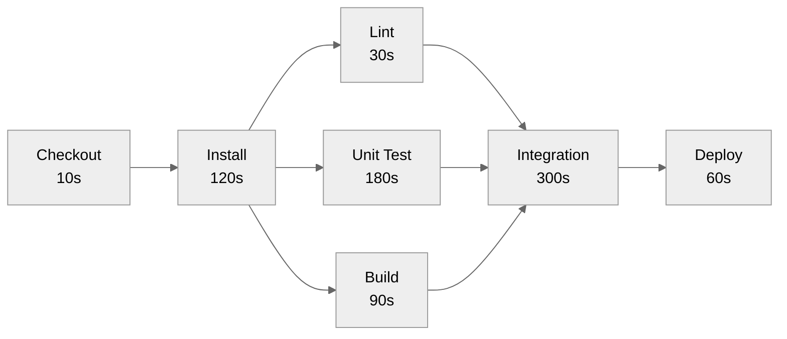

---
# Required
sidebar_position: 12
title: "CI/CD Pipeline Optimization for DevOps"
description: >-
  Master CI/CD pipeline optimization for DevOps: identify bottlenecks, implement caching,
  parallelize builds, optimize tests, and reduce costs.

# SEO
keywords:
  - ci/cd pipeline optimization
  - pipeline optimization
  - ci/cd performance
  - ci/cd best practices
  - build optimization
  - test optimization
  - caching strategies
  - parallel builds
  - pipeline bottlenecks
  - ci/cd cost optimization
  - build speed
  - runner optimization
  - dependency caching
  - devops pipeline
  - learn ci/cd

# Social sharing
og_title: "CI/CD Pipeline Optimization: Make Pipelines Fast"
og_description: "Practical optimization techniques: caching, parallelization, and bottleneck elimination for DevOps."
og_image: "/img/ci-cd-social-card.svg"

# Content management
date_published: 2025-01-24
date_modified: 2026-01-25
author: shivam
reading_time: 22
content_type: explanation
---

# CI/CD Pipeline Optimization and Efficiency

The pipeline that changed my perspective on optimization took 47 minutes. I mentioned it earlier in this guide—it was a fintech startup that had "implemented CI/CD" but hadn't thought about making it fast.

If you're searching for CI/CD pipeline optimization or trying to speed up DevOps builds, speed is the difference between continuous feedback and occasional feedback.

When I started profiling that pipeline, I found the typical culprits: dependencies downloading fresh on every run, tests running sequentially when they could parallelize, container builds that ignored layer caching, and stages that could run in parallel but were configured sequentially. The fixes weren't rocket science—they were well-known patterns applied consistently.

We got that pipeline down to 8 minutes. Same tests. Same security scans. Same deployments. Just properly optimized. The impact on the team was immediate: developers started running the pipeline more often, catching issues earlier, and shipping with more confidence.

This document is a practical guide to pipeline optimization. Not theoretical best practices, but concrete techniques you can apply today to make your pipelines faster and cheaper.

**What you'll learn in this guide:**
- How to profile pipelines and find real bottlenecks
- Caching and parallelization patterns that cut minutes
- Test optimization strategies that preserve confidence
- CI/CD best practices for fast feedback without sacrificing speed
- Cost reduction techniques that keep pipelines sustainable

---

## Why Speed Matters

Pipeline speed isn't a vanity metric—it directly affects developer behavior and business outcomes.

| Pipeline Duration | Developer Behavior |
|------------------|-------------------|
| Under 5 minutes | Waits for result, iterates immediately |
| 5-15 minutes | Starts next task, checks back |
| 15-30 minutes | Context switches completely |
| 30+ minutes | Pushes and hopes, checks tomorrow |

Slow pipelines create a vicious cycle: developers push less often to avoid the wait, batching changes together, which makes each push riskier and harder to debug when things fail.

**The target:** Keep full pipeline runs under 15 minutes. Keep PR checks under 10 minutes. Keep lint/typecheck under 2 minutes.

---

## Identifying Bottlenecks

Before optimizing, understand where time goes. Random optimization is worse than no optimization—you might speed up a step that takes 10 seconds while ignoring one that takes 10 minutes.

### Pipeline Profiling

Most CI platforms show stage timing. Export and analyze it:

```yaml
# GitHub Actions: Add timing information
- name: Start timer
  id: timer
  run: echo "start=$(date +%s)" >> $GITHUB_OUTPUT

- name: Run tests
  run: npm test

- name: Report timing
  run: |
    START=${{ steps.timer.outputs.start }}
    END=$(date +%s)
    echo "Tests took $((END - START)) seconds"
```

### Common Bottleneck Patterns

**Sequential stages that could be parallel:**
```yaml
# Slow: 15 minutes total
stages:
  - lint      # 2 min
  - test      # 8 min
  - build     # 5 min

# Fast: 8 minutes total (max of parallel stages)
stages:
  - validate  # lint + test + build in parallel
```

**Dependency installation on every run:**
```
npm install: 3 minutes × 5 jobs = 15 minutes wasted
```

**Rebuilding unchanged components:**
```
Full Docker build: 8 minutes
Cached Docker build: 30 seconds
```

**Running all tests when few files changed:**
```
Full test suite: 10 minutes
Affected tests only: 1 minute
```

### Critical Path Analysis

The critical path is the longest chain of sequential dependencies. Your pipeline can never be faster than the critical path.



In this example, the critical path is:
Checkout (10s) → Install (120s) → Unit Test (180s) → Integration (300s) → Deploy (60s) = **670s (11+ minutes)**

Optimizing lint (30s) won't help—it's not on the critical path. Focus on unit tests and integration tests.

---

## Caching Strategies

Caching is the single highest-impact optimization for most pipelines.

### Dependency Caching

**npm/Node.js:**
```yaml
- uses: actions/setup-node@v4
  with:
    node-version: 20
    cache: 'npm'  # Built-in caching

# Or manual cache for more control
- uses: actions/cache@v4
  with:
    path: |
      ~/.npm
      node_modules
    key: npm-${{ runner.os }}-${{ hashFiles('package-lock.json') }}
    restore-keys: |
      npm-${{ runner.os }}-
```

**Python/pip:**
```yaml
- uses: actions/cache@v4
  with:
    path: ~/.cache/pip
    key: pip-${{ runner.os }}-${{ hashFiles('requirements.txt') }}
    restore-keys: |
      pip-${{ runner.os }}-
```

**Go modules:**
```yaml
- uses: actions/cache@v4
  with:
    path: |
      ~/go/pkg/mod
      ~/.cache/go-build
    key: go-${{ runner.os }}-${{ hashFiles('go.sum') }}
```

**Maven:**
```yaml
- uses: actions/cache@v4
  with:
    path: ~/.m2/repository
    key: maven-${{ runner.os }}-${{ hashFiles('pom.xml') }}
```

### Cache Key Design

Good cache keys balance hit rate with freshness:

```yaml
# Too specific: rarely hits
key: npm-${{ hashFiles('**/*') }}

# Too broad: stale cache used forever
key: npm-dependencies

# Just right: invalidates when dependencies change
key: npm-${{ runner.os }}-${{ hashFiles('package-lock.json') }}
restore-keys: |
  npm-${{ runner.os }}-
```

**Fallback keys** (`restore-keys`) provide partial cache hits:
1. Exact match: `npm-linux-abc123` → Perfect, use it
2. Prefix match: `npm-linux-` → Close enough, restore and update
3. No match: Cold cache, download everything

### Container Build Caching

Docker layer caching dramatically speeds up builds:

```dockerfile
# Optimize layer order: dependencies before source
FROM node:20

# These layers rarely change
WORKDIR /app
COPY package.json package-lock.json ./
RUN npm ci

# This layer changes often
COPY . .
RUN npm run build
```

**Registry-based caching:**
```yaml
- uses: docker/build-push-action@v5
  with:
    context: .
    cache-from: type=registry,ref=myregistry/myapp:cache
    cache-to: type=registry,ref=myregistry/myapp:cache,mode=max
```

**GitHub Actions cache:**
```yaml
- uses: docker/build-push-action@v5
  with:
    context: .
    cache-from: type=gha
    cache-to: type=gha,mode=max
```

### BuildKit Cache Mounts

For package manager caches during build:

```dockerfile
# syntax=docker/dockerfile:1
FROM node:20

WORKDIR /app
COPY package.json package-lock.json ./

# Mount npm cache, persists between builds
RUN --mount=type=cache,target=/root/.npm \
    npm ci

COPY . .
RUN npm run build
```

---

## Parallelization

Parallelization reduces wall-clock time by running independent work simultaneously.

### Job-Level Parallelization

```yaml
jobs:
  # These run in parallel
  lint:
    runs-on: ubuntu-latest
    steps:
      - run: npm run lint

  test:
    runs-on: ubuntu-latest
    steps:
      - run: npm test

  security:
    runs-on: ubuntu-latest
    steps:
      - run: npm audit

  # This waits for all above
  build:
    needs: [lint, test, security]
    runs-on: ubuntu-latest
    steps:
      - run: npm run build
```

### Test Sharding

Split tests across parallel jobs:

```yaml
test:
  strategy:
    matrix:
      shard: [1, 2, 3, 4]
  steps:
    - run: npm test -- --shard=${{ matrix.shard }}/4
```

**Jest sharding:**
```bash
jest --shard=1/4  # Run first quarter of tests
jest --shard=2/4  # Run second quarter
# ...
```

**Playwright sharding:**
```bash
npx playwright test --shard=1/4
```

### Matrix Builds

Test across multiple configurations simultaneously:

```yaml
test:
  strategy:
    matrix:
      node: [18, 20, 22]
      os: [ubuntu-latest, macos-latest]
  runs-on: ${{ matrix.os }}
  steps:
    - uses: actions/setup-node@v4
      with:
        node-version: ${{ matrix.node }}
    - run: npm test
```

This creates 6 parallel jobs (3 Node versions × 2 OS).

### Fan-Out/Fan-In Pattern

```yaml
jobs:
  # Fan out: parallel work
  test-unit:
    # ...
  test-integration:
    # ...
  test-e2e:
    # ...

  # Fan in: aggregate results
  test-complete:
    needs: [test-unit, test-integration, test-e2e]
    steps:
      - run: echo "All tests passed"

  # Continue after fan-in
  deploy:
    needs: test-complete
    # ...
```

---

## Test Optimization

Tests often dominate pipeline time. Optimize them strategically.

### Test Impact Analysis

Only run tests affected by changes:

```bash
# Jest with changed file detection
jest --changedSince=origin/main

# Using test impact analysis tools
launchable subset --target 50% jest > subset.txt
jest $(cat subset.txt)
```

### Test Ordering

Run tests most likely to fail first (fail fast):

```javascript
// jest.config.js
module.exports = {
  // Run previously failed tests first
  testSequencer: './custom-sequencer.js',
};
```

```javascript
// custom-sequencer.js
const Sequencer = require('@jest/test-sequencer').default;

class CustomSequencer extends Sequencer {
  sort(tests) {
    // Previously failed tests first
    const failed = tests.filter(t => t.lastTestResult?.failureMessage);
    const passed = tests.filter(t => !t.lastTestResult?.failureMessage);
    return [...failed, ...passed];
  }
}
```

### Parallel Test Execution

```javascript
// jest.config.js
module.exports = {
  maxWorkers: '50%',  // Use half of available CPUs
};
```

### Test Data Optimization

Slow test setup is a common bottleneck:

```javascript
// Slow: create database per test
beforeEach(async () => {
  await createTestDatabase();
  await runMigrations();
  await seedData();
});

// Fast: reuse database, reset state
beforeAll(async () => {
  await createTestDatabase();
  await runMigrations();
});

beforeEach(async () => {
  await truncateTables();  // Much faster than recreate
});
```

---

## Build Optimization

### Incremental Builds

Only rebuild changed components:

**TypeScript:**
```json
{
  "compilerOptions": {
    "incremental": true,
    "tsBuildInfoFile": ".tsbuildinfo"
  }
}
```

**Webpack:**
```javascript
module.exports = {
  cache: {
    type: 'filesystem',
    buildDependencies: {
      config: [__filename],
    },
  },
};
```

### Monorepo Build Optimization

Tools like Nx and Turborepo optimize monorepo builds:

```bash
# Only build affected projects
nx affected --target=build

# With caching
nx run-many --target=build --all --parallel
```

**Turborepo:**
```json
{
  "pipeline": {
    "build": {
      "dependsOn": ["^build"],
      "outputs": ["dist/**"]
    },
    "test": {
      "dependsOn": ["build"],
      "cache": true
    }
  }
}
```

### Multi-Stage Docker Builds

Separate build dependencies from runtime:

```dockerfile
# Build stage
FROM node:20 AS builder
WORKDIR /app
COPY package*.json ./
RUN npm ci
COPY . .
RUN npm run build

# Runtime stage (smaller, faster)
FROM node:20-slim
WORKDIR /app
COPY --from=builder /app/dist ./dist
COPY --from=builder /app/node_modules ./node_modules
CMD ["node", "dist/index.js"]
```

---

## Runner Optimization

### Right-Sizing Runners

Match runner resources to job requirements:

```yaml
# Light job: standard runner
lint:
  runs-on: ubuntu-latest

# Heavy job: larger runner
build:
  runs-on: ubuntu-latest-8-cores
```

**GitHub's larger runners:**
- `ubuntu-latest-4-cores`
- `ubuntu-latest-8-cores`
- `ubuntu-latest-16-cores`

### Self-Hosted Runner Considerations

**When to self-host:**
- Need more resources than cloud provides
- Network access to private resources
- Cost optimization at scale
- Special hardware (GPU, ARM)

**Runner sizing:**
```yaml
# Kubernetes runner with resource requests
spec:
  containers:
    - name: runner
      resources:
        requests:
          memory: "4Gi"
          cpu: "2"
        limits:
          memory: "8Gi"
          cpu: "4"
```

### Runner Caching

Self-hosted runners can use persistent storage:

```yaml
# Cache on local disk (faster than network)
- uses: actions/cache@v4
  with:
    path: /runner-cache/npm
    key: npm-${{ hashFiles('package-lock.json') }}
```

---

## Cost Optimization

CI/CD can get expensive at scale. Optimize costs without sacrificing quality.

### Spot/Preemptible Instances

Use spot instances for non-critical jobs:

```yaml
# AWS: Use spot instances for test runners
# GCP: Use preemptible VMs
# Azure: Use spot VMs
```

Caveat: Jobs may be interrupted. Use for jobs that can retry.

### Right-Size Artifact Retention

```yaml
- uses: actions/upload-artifact@v4
  with:
    name: build
    path: dist/
    retention-days: 7  # Don't keep forever
```

### Skip Unnecessary Work

```yaml
# Don't run CI on documentation-only changes
on:
  push:
    paths-ignore:
      - '**.md'
      - 'docs/**'

# Don't run expensive tests on draft PRs
jobs:
  e2e:
    if: github.event.pull_request.draft == false
```

### Concurrency Limits

Prevent queue buildup and wasted runs:

```yaml
concurrency:
  group: ${{ github.workflow }}-${{ github.ref }}
  cancel-in-progress: true
```

---

## Monitoring Pipeline Performance

Track pipeline performance over time to catch regressions.

### Metrics to Track

- **Duration by stage:** Identify which stages slow down
- **Success rate:** Catch increasing flakiness
- **Queue time:** Runner capacity issues
- **Cache hit rate:** Caching effectiveness

### Alerting

```yaml
- name: Check pipeline duration
  run: |
    if [ "${{ job.duration }}" -gt 1800 ]; then
      curl -X POST "$SLACK_WEBHOOK" \
        -d '{"text": "⚠️ Pipeline took over 30 minutes"}'
    fi
```

---

## Optimization Checklist

Use this checklist to systematically optimize your pipeline:

### Quick Wins (Do First)
- [ ] Enable dependency caching
- [ ] Parallelize independent jobs
- [ ] Use built-in platform caching features
- [ ] Skip unnecessary runs (draft PRs, docs-only changes)
- [ ] Cancel superseded runs

### Medium Effort
- [ ] Implement test sharding
- [ ] Optimize Docker layer ordering
- [ ] Add registry-based container caching
- [ ] Right-size runner resources
- [ ] Implement incremental builds

### Advanced
- [ ] Implement test impact analysis
- [ ] Set up self-hosted runners
- [ ] Use monorepo-aware tooling (Nx, Turborepo)
- [ ] Implement custom test ordering
- [ ] Profile and optimize critical path

---

## FAQ: CI/CD Pipeline Optimization

### How fast should a CI/CD pipeline be?

Aim for under 15 minutes for a full pipeline and under 10 minutes for PR checks. Faster is better as long as confidence remains high.

### What is the biggest CI/CD bottleneck?

Most teams lose time in dependency installs and serial tests. Fix those first before micro-optimizations.

### Does caching introduce risk?

Caching is safe if you keep cache keys deterministic and clear caches when dependencies change. It should increase speed without sacrificing correctness.

## Related Reading

- [Metrics & Maturity: Measure pipeline speed →](./metrics-maturity)
- [Testing & Quality Gates: Keep fast tests trustworthy →](./testing-quality)
- [Troubleshooting: Diagnose slow or failing pipelines →](./troubleshooting)

---

## What's Next?

You now have practical techniques for making pipelines fast and efficient. Speed isn't just about developer convenience—it's about enabling the tight feedback loops that make CI/CD effective.

The next document in this series covers **Troubleshooting**: what to do when things go wrong, common failure patterns, and how to debug pipeline issues effectively.

**Ready to troubleshoot pipeline issues?** Continue to [Troubleshooting →](./troubleshooting)

---

## Quick Reference

### Speed Targets

| Stage | Target |
|-------|--------|
| Lint/Format | Under 2 min |
| Type Check | Under 2 min |
| Unit Tests | Under 5 min |
| Build | Under 5 min |
| Integration Tests | Under 10 min |
| Full Pipeline | Under 15 min |
| Deploy | Under 5 min |

### Caching Priorities

1. **Dependencies** (npm, pip, maven) - Highest impact
2. **Build artifacts** (.next, dist) - High impact
3. **Container layers** - High impact
4. **Test fixtures** - Medium impact

### Parallelization Opportunities

- Lint and tests (usually independent)
- Multiple test suites (unit, integration, e2e)
- Matrix builds (OS, versions)
- Test sharding (split test files)

### Cost Reduction Strategies

1. Right-size runners
2. Use spot/preemptible instances
3. Reduce artifact retention
4. Skip unnecessary runs
5. Cancel superseded runs
6. Optimize caching

---

**Remember:** Measure before optimizing. Profile your pipeline, identify the critical path, and focus on bottlenecks that actually matter. Random optimization is worse than no optimization.
