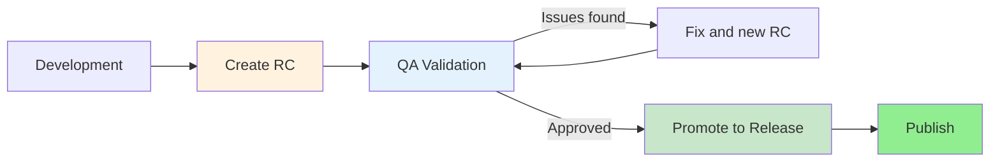

---
# Required
sidebar_position: 4
title: "CI/CD Versioning and Releases for DevOps"
description: >-
  Learn CI/CD versioning and release management: semantic versioning, changelogs,
  and release automation that help DevOps teams ship with confidence.

# SEO
keywords:
  - ci/cd versioning
  - release management
  - semantic versioning
  - semver
  - changelog
  - release notes
  - conventional commits
  - ci/cd releases
  - release automation
  - devops releases
  - version numbering
  - git tags
  - breaking changes
  - pre-release versions
  - learn ci/cd

# Social sharing
og_title: "CI/CD Versioning & Releases: Ship with Confidence"
og_description: "Semantic versioning, changelog automation, and release workflows that keep DevOps teams shipping safely."
og_image: "/img/ci-cd-social-card.svg"

# Content management
date_published: 2025-01-24
date_modified: 2026-01-25
author: shivam
reading_time: 20
content_type: explanation
---

# CI/CD Versioning and Releases

I once shipped a "minor" update to a library that broke 347 production builds in a single afternoon.

If you're searching for semantic versioning in CI/CD or release management best practices, versioning is the language your releases speak. When the language is sloppy, trust collapses.

The change seemed harmless: I renamed a configuration option from `timeout` to `timeoutMs` to make the unit explicit. Good practice, right? Clearer naming. Self-documenting code. I bumped the version from 2.3.0 to 2.4.0, published to npm, and went to lunch.

By the time I returned, my inbox was on fire. The library was a dependency in dozens of internal services, and many of them had `^2.3.0` in their package.json—meaning they'd automatically pull any "compatible" version. My "minor" change rolled across the organization, and every service using the old `timeout` configuration started failing with cryptic errors about unrecognized options.

The fix was trivial: rename it back, release 2.4.1, add the new name as an alias. The damage to trust was not trivial. Teams started pinning exact versions. Someone wrote a Slack bot that alerted whenever I published anything. My name became synonymous with "that guy who broke prod."

Here's what I learned from that day: **version numbers are not just labels—they're promises.** When you release 2.4.0 after 2.3.0, you're telling every consumer: "You can upgrade without changing your code." Breaking that promise, even accidentally, erodes the trust that makes dependency management work.

This document is about keeping those promises. We'll cover semantic versioning, changelogs, release automation, and the processes that make releases reliable rather than terrifying. Whether you're publishing open-source libraries, shipping internal services, or deploying to end users, these principles apply.

**What you'll learn in this guide:**
- How semantic versioning communicates compatibility
- Release workflows that keep CI/CD trustworthy
- Changelog and release notes practices that scale
- Automation patterns that remove manual release risk

---

## Why Versioning Matters

Before we dive into the mechanics, let's understand why versioning deserves this much attention.

### The Communication Problem

Software doesn't exist in isolation. Every library has consumers. Every service has clients. Every API has callers. These dependencies need to know: "What changed? Can I upgrade safely? Do I need to change my code?"

Without versioning, the answer is always "maybe." You'd have to read every commit, understand every change, and guess at the impact. This doesn't scale—not for a team of five, certainly not for the global ecosystem of open-source dependencies.

**Version numbers are a communication protocol.** They compress complex information about compatibility into a simple format that humans and machines can both process. The version `3.2.1` tells you instantly that this is the third major release, with two feature additions since then, plus one patch.

### The Automation Problem

Modern CI/CD pipelines need to make decisions based on versions. Should this artifact replace the one in production? Is this update safe to auto-merge? Which environments should receive this release?

When version numbers are arbitrary or inconsistent, automation becomes impossible. You can't write a rule like "auto-deploy minor versions" if "minor" sometimes means "new features" and sometimes means "breaking changes that seemed minor to the developer."

**Semantic versioning enables semantic automation.** When you follow the rules consistently, you can build systems that upgrade dependencies automatically, flag breaking changes for review, and deploy with confidence that the version number accurately reflects the risk.

### The Trust Problem

I've worked with teams that stopped upgrading dependencies because past upgrades broke things without warning. They'd freeze versions, skip security patches, and accumulate technical debt—all because they couldn't trust version numbers to mean what they said.

This is the hidden cost of sloppy versioning. Not just the immediate breakage, but the long-term erosion of trust that makes teams defensive and risk-averse.

**Good versioning builds the trust that enables velocity.** When teams know that patch versions are truly safe, they upgrade eagerly. When they know major versions mean breaking changes with migration guides, they upgrade confidently. The entire ecosystem moves faster when version numbers are reliable.

---

## Semantic Versioning Deep Dive

Semantic Versioning (SemVer) is the de facto standard for version numbers in modern software. You've seen it: `MAJOR.MINOR.PATCH`, like `2.4.1`. But the full specification has nuances that many developers miss.

### The Core Rules

Given a version number `MAJOR.MINOR.PATCH`:

| Increment | When | What It Tells Consumers |
|-----------|------|------------------------|
| **MAJOR** | You make incompatible API changes | "Read the migration guide before upgrading" |
| **MINOR** | You add functionality in a backward-compatible manner | "New features available, upgrade when convenient" |
| **PATCH** | You make backward-compatible bug fixes | "Safe to upgrade immediately" |

That's the simple version. Let's go deeper.

### What Counts as a Breaking Change?

This is where teams struggle. The spec says "incompatible API changes," but what does that mean in practice?

**Definitely breaking:**
- Removing a public function, method, or class
- Changing a function's signature (adding required parameters, changing return type)
- Renaming exported symbols
- Changing the behavior of existing functionality in ways that could break callers
- Removing or renaming configuration options
- Changing default values in ways that alter behavior

**Probably breaking:**
- Adding a required field to a configuration object
- Changing error types or error messages that callers might catch
- Changing the type of an existing field
- Modifying the order of callback parameters

**Usually not breaking:**
- Adding new functions, methods, or classes
- Adding optional parameters with sensible defaults
- Fixing bugs (unless callers depended on the buggy behavior)
- Performance improvements
- Internal refactoring that doesn't change the public interface

**The gray area:**
- Fixing a bug that some users might have worked around
- Changing behavior that was never documented but might be relied upon
- Tightening validation that now rejects previously-accepted input

For the gray areas, err on the side of caution. If you're not sure whether something is breaking, it probably is for someone. My rule of thumb: **if a reasonable user could have written code that this change breaks, it's a breaking change.**

### The API Contract

The key concept underlying semantic versioning is the **API contract**—the set of promises you make about how your software behaves. This includes:

- **Public interfaces**: Exported functions, classes, methods, and types
- **Documented behavior**: How those interfaces work as described in documentation
- **Configuration**: Options, environment variables, and settings
- **Command-line interfaces**: Arguments, flags, and output formats for CLI tools
- **Network protocols**: Request/response formats for APIs and services
- **File formats**: Structure of configuration files, data files, and outputs

Everything in the contract is subject to versioning rules. Everything outside the contract (internal implementation, undocumented behavior, private methods) can change in any release.

**Document your contract explicitly.** If something isn't documented, users shouldn't rely on it—but make sure your documentation is good enough that users don't need to.

```markdown
<!-- Example: Explicit stability documentation -->

## API Stability

### Stable (versioned)
- All functions exported from `@mylib/core`
- Configuration options documented in README
- Command-line arguments listed in `--help`

### Unstable (may change in any release)
- Functions exported from `@mylib/internal`
- Undocumented configuration options
- Internal class hierarchies
```

### Pre-release Versions

SemVer supports pre-release versions with a hyphen suffix: `2.0.0-alpha.1`, `3.1.0-beta.2`, `1.0.0-rc.1`.

Pre-release versions:
- Have lower precedence than the associated normal version (`1.0.0-alpha.1` < `1.0.0`)
- Signal that the version is unstable and subject to change
- Don't need to follow the usual breaking change rules (within the pre-release series)

**Common pre-release stages:**

| Stage | Meaning | Typical Use |
|-------|---------|-------------|
| `alpha` | Early development, highly unstable | Internal testing, early adopters |
| `beta` | Feature-complete, but not production-ready | Broader testing, feedback gathering |
| `rc` (release candidate) | Potentially final, barring critical bugs | Final validation before release |

Pre-release numbering example:
```
2.0.0-alpha.1   # First alpha
2.0.0-alpha.2   # Second alpha (fixes/changes)
2.0.0-alpha.3   # Third alpha
2.0.0-beta.1    # First beta (feature complete)
2.0.0-beta.2    # Second beta
2.0.0-rc.1      # First release candidate
2.0.0-rc.2      # Second RC (critical fix found)
2.0.0           # Final release
```

### Build Metadata

SemVer allows build metadata after a plus sign: `1.0.0+20240115`, `2.3.1+git.abc123`.

Build metadata:
- Is ignored when determining version precedence (`1.0.0+build1` = `1.0.0+build2`)
- Can contain any alphanumeric characters and hyphens
- Is useful for tracking build information without affecting versioning

Common uses:
- Git commit SHA: `1.2.3+git.a1b2c3d`
- Build timestamp: `1.2.3+20240115.143022`
- Build number: `1.2.3+build.456`

```bash
# Example: Embedding build metadata
VERSION="1.2.3"
GIT_SHA=$(git rev-parse --short HEAD)
FULL_VERSION="${VERSION}+git.${GIT_SHA}"
# Result: 1.2.3+git.a1b2c3d
```

---

## Version 0.x.x: The Wild West

Semantic versioning has a special rule for version `0.x.x`: anything goes. The spec explicitly states that major version zero is for initial development, and the public API should not be considered stable.

This means:
- `0.1.0` → `0.2.0` might contain breaking changes
- `0.9.0` → `0.10.0` might contain breaking changes
- You're not bound by the compatibility rules until `1.0.0`

**The problem:** Many projects stay at `0.x.x` forever, treating it as a permanent license to break things. npm has thousands of packages at version `0.something` that have been stable for years.

**My recommendation:** Get to `1.0.0` as soon as you have users depending on your software. The `0.x.x` version signals "I might break everything tomorrow," which isn't fair to users once you're actually stable. If your public API has been unchanged for six months and people are using it in production, you're ready for `1.0.0`.

The fear of `1.0.0` usually comes from perfectionism—"it's not ready yet!" But `1.0.0` doesn't mean "perfect." It means "I'm committing to backward compatibility." You can still have bugs. You can still add features. You just can't break the API without incrementing the major version.

---

## Versioning Beyond Libraries

So far, we've talked about versioning as it applies to libraries and APIs. But what about applications, services, and other software?

### Versioning Applications

Desktop and mobile applications usually follow semantic versioning, but the "API" is the user experience rather than a programmatic interface.

**Breaking changes for applications:**
- Removing features users rely on
- Changing workflows significantly
- Dropping support for file formats or data the user has
- Changing keyboard shortcuts or UI conventions

**Example: Application versioning**
```
PhotoEditor 3.0.0  # Major redesign, new UI paradigm
PhotoEditor 3.1.0  # Added new filter collection
PhotoEditor 3.1.1  # Fixed crash when opening large files
PhotoEditor 3.2.0  # Added batch processing feature
PhotoEditor 4.0.0  # Dropped support for legacy .psd format
```

### Versioning Services and APIs

For web services and APIs, versioning often happens at the URL level (`/api/v1/users`) rather than through package versions. But the principles remain the same.

**API versioning strategies:**

| Strategy | Example | Trade-offs |
|----------|---------|------------|
| **URL versioning** | `/api/v1/users` | Clear, easy to understand; URL pollution |
| **Header versioning** | `Accept: application/vnd.api+json;version=1` | Clean URLs; less discoverable |
| **Query parameter** | `/api/users?version=1` | Simple; can be accidentally omitted |

Regardless of strategy, the same rules apply: breaking changes require a new version, additive changes are backward-compatible, and documentation should clearly state what's stable.

### Versioning Infrastructure

Infrastructure as code (Terraform modules, Helm charts, Ansible roles) also needs versioning:

```hcl
# Terraform module usage with version constraint
module "vpc" {
  source  = "terraform-aws-modules/vpc/aws"
  version = "~> 5.0"  # Any 5.x.x version
  
  # ...
}
```

Breaking changes in infrastructure modules:
- Changing required variables
- Renaming outputs
- Changing resource names (forces replacement)
- Dropping support for provider versions

---

## Changelogs: Telling the Story of Your Releases

A version number tells users *how much* changed. A changelog tells them *what* changed. Both are essential.

### Why Changelogs Matter

Without a changelog, users must:
1. Dig through git history
2. Read every commit message
3. Guess which changes affect them
4. Hope they didn't miss anything important

This doesn't work. Users won't do it, and they shouldn't have to.

**A good changelog:**
- Explains what changed and why
- Highlights breaking changes prominently
- Separates changes by category (features, fixes, breaking)
- Links to relevant issues, PRs, or documentation
- Is written for users, not developers

### Changelog Format

The [Keep a Changelog](https://keepachangelog.com/) format has become the standard:

```markdown
# Changelog

All notable changes to this project will be documented in this file.

The format is based on [Keep a Changelog](https://keepachangelog.com/en/1.0.0/),
and this project adheres to [Semantic Versioning](https://semver.org/spec/v2.0.0.html).

## [Unreleased]

### Added
- New `timeoutMs` configuration option for explicit timeout units

### Deprecated
- `timeout` option is deprecated in favor of `timeoutMs`

## [2.4.0] - 2025-01-15

### Added
- Support for custom retry strategies
- New `onRetry` callback for retry visibility

### Fixed
- Connection pool exhaustion under high load (#234)
- Memory leak when processing large payloads (#241)

### Security
- Updated dependencies to patch CVE-2025-1234

## [2.3.0] - 2024-12-01

### Added
- Initial retry support with exponential backoff

### Changed
- Default timeout increased from 5s to 30s

[Unreleased]: https://github.com/user/repo/compare/v2.4.0...HEAD
[2.4.0]: https://github.com/user/repo/compare/v2.3.0...v2.4.0
[2.3.0]: https://github.com/user/repo/releases/tag/v2.3.0
```

### Changelog Categories

Use these categories consistently:

| Category | What Goes Here |
|----------|----------------|
| **Added** | New features and capabilities |
| **Changed** | Changes to existing functionality |
| **Deprecated** | Features that will be removed in future versions |
| **Removed** | Features that were removed |
| **Fixed** | Bug fixes |
| **Security** | Security-related changes and vulnerability fixes |

**Breaking changes** should be called out prominently, often with a dedicated subsection or clear prefix:

```markdown
## [3.0.0] - 2025-02-01

### ⚠️ BREAKING CHANGES

- Removed deprecated `timeout` option. Use `timeoutMs` instead.
- Changed default `retryCount` from 3 to 0 (no retries by default)
- Minimum Node.js version is now 18 (was 16)

### Added
- New streaming API for large payloads
```

### Writing for Your Audience

Changelogs serve different audiences:

**Developers integrating your library** need to know:
- What new functions/methods are available
- What behavior changed that might affect their code
- Whether they need to update their integration

**Operations teams deploying your service** need to know:
- What user-facing changes to expect
- Whether configuration changed
- Whether there are database migrations

**End users** need to know:
- What new features they can use
- What bugs were fixed that affected them
- What they need to do differently

Consider maintaining multiple changelogs or sections for different audiences if your user base is diverse.

---

## Conventional Commits: Automating the Changelog

Writing changelogs manually is tedious and error-prone. Developers forget to update them. Changes get miscategorized. The changelog drifts from reality.

Conventional Commits solves this by encoding changelog information directly in commit messages, enabling automation.

### The Format

```
<type>[optional scope]: <description>

[optional body]

[optional footer(s)]
```

**Examples:**
```bash
feat: add user authentication
feat(api): add rate limiting to public endpoints
fix: resolve memory leak in connection pool
fix(auth): handle expired tokens gracefully
docs: update API reference for v2 endpoints
chore: update dependencies
refactor: simplify retry logic
perf: optimize database query for user lookup
test: add integration tests for payment flow

# Breaking change (note the !)
feat!: change authentication to OAuth 2.0

# Breaking change with body explanation
feat(api)!: require API keys for all endpoints

BREAKING CHANGE: All API requests now require an API key.
See migration guide: https://docs.example.com/api-keys
```

### Commit Types

| Type | Purpose | Changelog Category |
|------|---------|-------------------|
| `feat` | New feature | Added |
| `fix` | Bug fix | Fixed |
| `docs` | Documentation changes | (often excluded) |
| `style` | Code style changes (formatting, etc.) | (often excluded) |
| `refactor` | Code changes that neither fix bugs nor add features | Changed |
| `perf` | Performance improvements | Changed |
| `test` | Adding or updating tests | (often excluded) |
| `chore` | Maintenance tasks | (often excluded) |
| `ci` | CI/CD changes | (often excluded) |
| `build` | Build system changes | (often excluded) |
| `revert` | Reverting a previous commit | (depends on what was reverted) |

### Enforcing Conventional Commits

Humans are forgetful. Enforce the convention with tooling:

**commitlint** validates commit messages:

```bash
# Install
npm install --save-dev @commitlint/cli @commitlint/config-conventional

# Configure (commitlint.config.js)
module.exports = {
  extends: ['@commitlint/config-conventional'],
  rules: {
    'type-enum': [2, 'always', [
      'feat', 'fix', 'docs', 'style', 'refactor',
      'perf', 'test', 'chore', 'ci', 'build', 'revert'
    ]],
    'subject-case': [2, 'always', 'lower-case'],
    'subject-empty': [2, 'never'],
  }
};
```

**Husky** runs commitlint on every commit:

```bash
# Install
npm install --save-dev husky

# Setup
npx husky init
echo "npx --no -- commitlint --edit \$1" > .husky/commit-msg
```

**CI validation** catches commits that slip through:

```yaml
# GitHub Actions
name: Lint Commits
on:
  pull_request:

jobs:
  commitlint:
    runs-on: ubuntu-latest
    steps:
      - uses: actions/checkout@v4
        with:
          fetch-depth: 0
      - name: Setup Node
        uses: actions/setup-node@v4
        with:
          node-version: 20
      - name: Install dependencies
        run: npm ci
      - name: Validate commits
        run: npx commitlint --from ${{ github.event.pull_request.base.sha }} --to ${{ github.event.pull_request.head.sha }}
```

### Generating Changelogs Automatically

With conventional commits in place, changelogs write themselves.

**standard-version** (for npm packages):

```bash
# Install
npm install --save-dev standard-version

# Add to package.json scripts
{
  "scripts": {
    "release": "standard-version"
  }
}

# Run release
npm run release          # Auto-determine version bump
npm run release -- --release-as minor  # Force minor bump
npm run release -- --release-as 2.0.0  # Force specific version
```

What it does:
1. Analyzes commits since last release
2. Determines version bump (major/minor/patch) based on commit types
3. Updates CHANGELOG.md
4. Updates package.json version
5. Creates a git commit and tag

**release-please** (for GitHub):

```yaml
# .github/workflows/release-please.yml
name: Release Please

on:
  push:
    branches: [main]

permissions:
  contents: write
  pull-requests: write

jobs:
  release-please:
    runs-on: ubuntu-latest
    steps:
      - uses: googleapis/release-please-action@v4
        with:
          release-type: node
```

Release-please creates a PR that accumulates changes, automatically updating the changelog and version. When you merge the PR, it creates a GitHub release.

**semantic-release** (fully automated):

```yaml
# .github/workflows/release.yml
name: Release

on:
  push:
    branches: [main]

jobs:
  release:
    runs-on: ubuntu-latest
    steps:
      - uses: actions/checkout@v4
        with:
          fetch-depth: 0
      - uses: actions/setup-node@v4
        with:
          node-version: 20
      - run: npm ci
      - run: npx semantic-release
        env:
          GITHUB_TOKEN: ${{ secrets.GITHUB_TOKEN }}
          NPM_TOKEN: ${{ secrets.NPM_TOKEN }}
```

Semantic-release is fully automated: every push to main analyzes commits, determines if a release is needed, updates versions, publishes to npm, and creates GitHub releases—all without human intervention.

---

## Release Workflows

How do releases actually happen? Let's examine common patterns.

### Manual Releases

The simplest approach: a human decides when to release and triggers the process.

```bash
# Developer workflow
git checkout main
git pull
npm run build
npm test
npm version minor   # Updates package.json, creates git tag
git push --follow-tags
npm publish
```

**Pros:**
- Complete control over timing
- Human judgment on release readiness
- Simple to understand

**Cons:**
- Humans forget or delay releases
- Inconsistent process between developers
- Doesn't scale with release frequency

### Tag-Triggered Releases

A hybrid: humans create tags, automation handles the rest.

```yaml
# GitHub Actions: Release on tag push
name: Release

on:
  push:
    tags:
      - 'v*'

jobs:
  release:
    runs-on: ubuntu-latest
    steps:
      - uses: actions/checkout@v4
      - uses: actions/setup-node@v4
        with:
          node-version: 20
          registry-url: 'https://registry.npmjs.org'
      - run: npm ci
      - run: npm test
      - run: npm publish
        env:
          NODE_AUTH_TOKEN: ${{ secrets.NPM_TOKEN }}
      - name: Create GitHub Release
        uses: softprops/action-gh-release@v1
        with:
          generate_release_notes: true
```

**Developer workflow:**
```bash
# Update changelog and version
npm version minor
git push --follow-tags
# CI handles the rest
```

**Pros:**
- Human controls timing via tag creation
- Consistent automated process
- Clear audit trail (tags in git history)

**Cons:**
- Still requires human to remember to tag
- Tag and version can get out of sync

### Fully Automated Releases

Every qualifying commit to main triggers a release.

```yaml
# Using semantic-release
name: Release

on:
  push:
    branches: [main]

jobs:
  release:
    runs-on: ubuntu-latest
    steps:
      - uses: actions/checkout@v4
        with:
          fetch-depth: 0
          persist-credentials: false
      - uses: actions/setup-node@v4
        with:
          node-version: 20
      - run: npm ci
      - run: npm test
      - name: Release
        run: npx semantic-release
        env:
          GITHUB_TOKEN: ${{ secrets.GITHUB_TOKEN }}
          NPM_TOKEN: ${{ secrets.NPM_TOKEN }}
```

**Pros:**
- No human bottleneck
- Releases happen immediately when changes land
- Perfect for high-frequency deployment

**Cons:**
- Less control over release timing
- Requires discipline in commit messages
- May release more frequently than desired

### Release Candidates and Promotion

For software that needs validation before release:



**Release candidate workflow:**

```bash
# Create release candidate
npm version 2.0.0-rc.1
git push --follow-tags

# QA tests the RC
# Issues found, create new RC
npm version 2.0.0-rc.2
git push --follow-tags

# Approved! Promote to release
npm version 2.0.0
git push --follow-tags
```

**Automated RC pipeline:**

```yaml
name: Release Candidate

on:
  push:
    tags:
      - 'v*-rc.*'

jobs:
  publish-rc:
    runs-on: ubuntu-latest
    steps:
      - uses: actions/checkout@v4
      - uses: actions/setup-node@v4
        with:
          node-version: 20
          registry-url: 'https://registry.npmjs.org'
      - run: npm ci
      - run: npm test
      - run: npm publish --tag next  # Publish to 'next' tag, not 'latest'
        env:
          NODE_AUTH_TOKEN: ${{ secrets.NPM_TOKEN }}
```

Users can test the RC with `npm install package@next`, while `npm install package` still gets the stable version.

---

## Release Notes: Communication That Scales

Changelogs are for developers. Release notes are for everyone.

### The Difference

| | Changelog | Release Notes |
|---|-----------|---------------|
| **Audience** | Developers and integrators | All stakeholders including non-technical |
| **Format** | Technical, comprehensive | Narrative, highlights-focused |
| **Content** | Every notable change | Most important changes |
| **Tone** | Neutral, factual | Can be enthusiastic, contextual |
| **Location** | CHANGELOG.md in repo | GitHub Releases, blog posts, email |

### Writing Good Release Notes

**Structure:**
1. **Headline**: One sentence summarizing the release
2. **Highlights**: 3-5 most important changes
3. **Breaking changes**: What users must do differently
4. **Full changelog link**: For those who want details

**Example:**

```markdown
# Version 3.0: Faster, Simpler, More Secure

This release focuses on performance and developer experience, with up to
10x faster builds and a simplified configuration API.

## Highlights

🚀 **10x Faster Builds**: New incremental build system dramatically 
   reduces build times for large projects.

✨ **Simplified Configuration**: The new `mylib.config.js` replaces
   the previous three config files with one unified format.

🔒 **Enhanced Security**: All dependencies updated, new supply chain
   verification built-in.

## ⚠️ Breaking Changes

- **Configuration migration required**: Run `npx mylib migrate-config`
  to update your configuration files. See [migration guide](./docs/v3-migration.md).

- **Node.js 18+ required**: We've dropped support for Node.js 16.

## What's Changed

See the [full changelog](./CHANGELOG.md#300---2025-01-15) for all changes.

## Thank You

Thanks to @contributor1, @contributor2, and @contributor3 for their
contributions to this release!
```

### Automating Release Notes

GitHub can generate release notes automatically:

```yaml
# .github/release.yml
changelog:
  exclude:
    labels:
      - ignore-for-release
    authors:
      - dependabot
  categories:
    - title: 🚀 Features
      labels:
        - enhancement
        - feature
    - title: 🐛 Bug Fixes
      labels:
        - bug
        - fix
    - title: 🔒 Security
      labels:
        - security
    - title: 📚 Documentation
      labels:
        - documentation
    - title: 🧰 Maintenance
      labels:
        - chore
        - dependencies
```

Then in your release workflow:

```yaml
- name: Create Release
  uses: softprops/action-gh-release@v1
  with:
    generate_release_notes: true
    body: |
      ## Highlights
      
      Add your highlights here.
      
      ## What's Changed
      
      ${{ steps.changelog.outputs.changelog }}
```

---

## Tag-Based vs. Branch-Based Releases

Two philosophies for managing releases in version control.

### Tag-Based Releases

Every release is a tag on the main branch:

```
main:  A---B---C---D---E---F---G
              |       |       |
            v1.0.0  v1.1.0  v2.0.0
```

**How it works:**
1. All development happens on main
2. When ready to release, tag the current commit
3. CI/CD deploys based on tags
4. Hotfixes are new commits on main, tagged as patch versions

**Pros:**
- Simple, single branch to manage
- Clear linear history
- Works well with trunk-based development

**Cons:**
- Can't easily patch old versions (v1.0.1 after v2.0.0 exists)
- All commits are potentially releases

### Branch-Based Releases

Long-lived branches for each release series:

```
main:      A---B---C---D---E---F---G
                \           \
release/1.x:     B---H---I   \
                             \
release/2.x:                  F---J
```

**How it works:**
1. Development happens on main
2. Release branches created for each major/minor version
3. Bug fixes cherry-picked to relevant release branches
4. Tags created on release branches

**Pros:**
- Can maintain multiple release series simultaneously
- Hotfixes can target specific versions
- Clear separation between development and releases

**Cons:**
- More branches to manage
- Cherry-picking creates maintenance burden
- Can lead to divergent codebases

### Which to Choose?

| Scenario | Recommendation |
|----------|----------------|
| Continuous deployment, single version | Tag-based |
| Library with multiple supported versions | Branch-based |
| Mobile app with staged rollouts | Branch-based |
| Internal service, always latest | Tag-based |
| Enterprise software, long support cycles | Branch-based |

For most teams practicing CI/CD, tag-based releases are simpler and sufficient. Branch-based releases are worth the overhead when you genuinely need to support multiple versions simultaneously.

---

## Signing Commits and Releases

In an era of supply chain attacks, proving authenticity matters. Signed commits and tags cryptographically verify that code comes from who it claims to come from.

### Why Sign?

Without signing, anyone who gains write access to a repository can impersonate any committer. Git stores the author email as plain text—you can commit as `linus@linux.org` right now if you want (please don't). There's no verification.

Signing adds cryptographic proof:
- **This commit was made by someone with access to this private key**
- **This tag was created by someone with access to this private key**

Combined with key verification (GitHub verified badge, corporate key management), this provides meaningful authentication.

### GPG Signing

The traditional approach using GPG keys:

```bash
# Generate a GPG key
gpg --full-generate-key
# Choose RSA and RSA, 4096 bits, reasonable expiry

# List keys to get key ID
gpg --list-secret-keys --keyid-format=long
# Output shows something like: rsa4096/ABC123DEF456 2025-01-15

# Configure Git
git config --global user.signingkey ABC123DEF456
git config --global commit.gpgsign true
git config --global tag.gpgsign true

# Export public key for GitHub/GitLab
gpg --armor --export ABC123DEF456
# Copy output to GitHub Settings → SSH and GPG keys → New GPG key
```

Now all commits are signed:

```bash
git commit -m "feat: add new feature"
# Automatically signed

git log --show-signature
# Shows: Good signature from "Your Name <you@example.com>"
```

### SSH Signing

Git 2.34+ supports signing with SSH keys, which most developers already have:

```bash
# Configure Git to use SSH signing
git config --global gpg.format ssh
git config --global user.signingkey ~/.ssh/id_ed25519.pub
git config --global commit.gpgsign true
git config --global tag.gpgsign true

# Create allowed_signers file for verification
echo "your@email.com $(cat ~/.ssh/id_ed25519.pub)" >> ~/.ssh/allowed_signers
git config --global gpg.ssh.allowedSignersFile ~/.ssh/allowed_signers
```

**Pros over GPG:**
- Uses existing SSH keys
- Simpler key management
- GitHub/GitLab support SSH key verification

### Sigstore/Gitsign: Keyless Signing

Sigstore is the modern approach: sign with your identity provider, no long-lived keys to manage.

```bash
# Install gitsign
brew install sigstore/tap/gitsign

# Configure Git
git config --global commit.gpgsign true
git config --global tag.gpgsign true
git config --global gpg.x509.program gitsign
git config --global gpg.format x509

# Commit (opens browser for OIDC authentication)
git commit -m "feat: new feature"
# Browser opens, you authenticate with GitHub/Google/Microsoft
# Commit is signed with a short-lived certificate
```

**How it works:**
1. You authenticate with an identity provider (GitHub, Google, etc.)
2. Sigstore's Fulcio CA issues a short-lived certificate
3. Your commit is signed with that certificate
4. The signature is recorded in Sigstore's transparency log (Rekor)

**Pros:**
- No key management—keys exist only for seconds
- Tied to verified identity (GitHub account, email, etc.)
- Transparency log provides audit trail
- Keys can't be stolen because they don't persist

### Signing Release Tags

Tags are especially important to sign because they mark releases:

```bash
# Create signed tag
git tag -s v1.0.0 -m "Release version 1.0.0"

# Verify a signed tag
git tag -v v1.0.0
```

### Enforcing Signed Commits in CI

Trust but verify—require signatures in your pipeline:

```yaml
# GitHub Actions: Verify commit signatures
name: Verify Signatures

on:
  pull_request:

jobs:
  verify:
    runs-on: ubuntu-latest
    steps:
      - uses: actions/checkout@v4
        with:
          fetch-depth: 0
      
      - name: Verify all commits are signed
        run: |
          UNSIGNED=$(git log --format='%H %G?' ${{ github.event.pull_request.base.sha }}..${{ github.event.pull_request.head.sha }} | grep ' N$' || true)
          if [ -n "$UNSIGNED" ]; then
            echo "Found unsigned commits:"
            echo "$UNSIGNED"
            exit 1
          fi
          echo "All commits are signed ✓"
```

### Artifact Signing with Cosign

For container images and other artifacts, Cosign provides signing:

```yaml
# Sign container image in CI
- name: Sign image
  run: |
    cosign sign --yes \
      --oidc-issuer https://token.actions.githubusercontent.com \
      ${{ env.REGISTRY }}/${{ env.IMAGE_NAME }}@${{ steps.build.outputs.digest }}
```

Verification:

```bash
# Verify image signature
cosign verify \
  --certificate-identity https://github.com/myorg/myrepo/.github/workflows/release.yml@refs/heads/main \
  --certificate-oidc-issuer https://token.actions.githubusercontent.com \
  myregistry.io/myimage:v1.0.0
```

---

## Version Embedding and Runtime Verification

Hard-coding versions in source files is error-prone. Modern practices embed version information at build time.

### Build-Time Version Injection

**Go:**
```go
// main.go
package main

var version = "dev"  // Overwritten at build time

func main() {
    fmt.Println("Version:", version)
}
```

```bash
# Build with version
go build -ldflags "-X main.version=$(git describe --tags)" -o myapp
```

**Node.js (from package.json):**
```javascript
const { version } = require('./package.json');
console.log(`Version: ${version}`);
```

**Python:**
```python
# pyproject.toml
[project]
dynamic = ["version"]

[tool.setuptools.dynamic]
version = {attr = "mypackage.__version__"}

# mypackage/__init__.py
__version__ = "1.2.3"
```

**Rust:**
```rust
fn main() {
    println!("Version: {}", env!("CARGO_PKG_VERSION"));
}
```

### Runtime Version Endpoints

APIs should expose their version:

```javascript
// Express.js example
const { version } = require('./package.json');

app.get('/health', (req, res) => {
  res.json({
    status: 'healthy',
    version,
    commit: process.env.GIT_COMMIT || 'unknown'
  });
});
```

This enables:
- Verifying deployed version matches expected
- Debugging production issues ("what version is running?")
- Automated health checks that verify deployment succeeded

### Container Image Labels

```dockerfile
ARG VERSION=dev
ARG GIT_COMMIT=unknown
ARG BUILD_DATE=unknown

LABEL org.opencontainers.image.version="${VERSION}"
LABEL org.opencontainers.image.revision="${GIT_COMMIT}"
LABEL org.opencontainers.image.created="${BUILD_DATE}"
```

Build with:
```bash
docker build \
  --build-arg VERSION=$(git describe --tags) \
  --build-arg GIT_COMMIT=$(git rev-parse HEAD) \
  --build-arg BUILD_DATE=$(date -u +%Y-%m-%dT%H:%M:%SZ) \
  -t myimage:$(git describe --tags) .
```

---

## Common Anti-Patterns

I've seen these mistakes repeatedly. Learn from others' pain.

### Anti-Pattern: Meaningless Version Bumps

**The pattern:** Incrementing versions without considering what changed. "We always bump minor" or "It's been a while, let's do a major release."

**The problem:** Version numbers become noise. Users can't trust them to communicate compatibility.

**The fix:** Version bumps must be semantic. If nothing changed that affects users, don't release. If you added features, bump minor. If you broke something, bump major—even if it's embarrassing.

### Anti-Pattern: Breaking Changes in Patch Versions

**The pattern:** "It's a small change" or "Nobody uses that feature" justifying breaking changes in patch versions.

**The problem:** Users expecting safe upgrades get broken builds. Trust erodes.

**The fix:** If it could break anyone's code, it's a major version bump. Period. Even if the change is small. Even if you think nobody cares. Semantic versioning is a promise, and promises matter.

### Anti-Pattern: Eternal 0.x.x

**The pattern:** Staying at version 0.x.x forever to avoid commitment to stability.

**The problem:** Users can never trust your versioning. You're implicitly saying "I might break everything anytime."

**The fix:** Once you have production users, go to 1.0.0. Stability is a feature.

### Anti-Pattern: Changelog Neglect

**The pattern:** No changelog, outdated changelog, or changelog that's just git log output.

**The problem:** Users can't understand what changed. They either don't upgrade (bad) or upgrade blindly and get surprised (worse).

**The fix:** Automate changelog generation from conventional commits. Make changelog updates part of the release process, not an afterthought.

### Anti-Pattern: Git Tag Drift

**The pattern:** Git tags that don't match package versions, or tags created long after the actual release.

**The problem:** Can't reliably check out the code for a specific version. Debugging production issues becomes archaeology.

**The fix:** Automate tag creation as part of the release process. Verify tag-version consistency in CI.

---

## Putting It All Together: A Complete Release Pipeline

Let's build a complete release pipeline that incorporates everything we've discussed.

```yaml
# .github/workflows/release.yml
name: Release

on:
  push:
    branches: [main]
  workflow_dispatch:
    inputs:
      version:
        description: 'Version to release (leave empty for auto)'
        required: false

permissions:
  contents: write
  packages: write
  id-token: write  # For signing

jobs:
  # First, determine if a release is needed
  analyze:
    runs-on: ubuntu-latest
    outputs:
      should_release: ${{ steps.analyze.outputs.should_release }}
      version: ${{ steps.analyze.outputs.version }}
    steps:
      - uses: actions/checkout@v4
        with:
          fetch-depth: 0
      
      - name: Analyze commits
        id: analyze
        run: |
          # Get commits since last tag
          LAST_TAG=$(git describe --tags --abbrev=0 2>/dev/null || echo "")
          if [ -z "$LAST_TAG" ]; then
            echo "No previous tags, will create initial release"
            echo "should_release=true" >> $GITHUB_OUTPUT
            echo "version=1.0.0" >> $GITHUB_OUTPUT
            exit 0
          fi
          
          # Check for releasable commits
          FEAT_COUNT=$(git log $LAST_TAG..HEAD --oneline --grep="^feat" | wc -l)
          FIX_COUNT=$(git log $LAST_TAG..HEAD --oneline --grep="^fix" | wc -l)
          BREAKING=$(git log $LAST_TAG..HEAD --oneline --grep="BREAKING CHANGE" | wc -l)
          
          if [ "$FEAT_COUNT" -eq 0 ] && [ "$FIX_COUNT" -eq 0 ]; then
            echo "No releasable commits"
            echo "should_release=false" >> $GITHUB_OUTPUT
            exit 0
          fi
          
          # Determine version bump
          CURRENT=$(echo $LAST_TAG | sed 's/v//')
          IFS='.' read -r MAJOR MINOR PATCH <<< "$CURRENT"
          
          if [ "$BREAKING" -gt 0 ]; then
            NEW_VERSION="$((MAJOR + 1)).0.0"
          elif [ "$FEAT_COUNT" -gt 0 ]; then
            NEW_VERSION="$MAJOR.$((MINOR + 1)).0"
          else
            NEW_VERSION="$MAJOR.$MINOR.$((PATCH + 1))"
          fi
          
          echo "should_release=true" >> $GITHUB_OUTPUT
          echo "version=$NEW_VERSION" >> $GITHUB_OUTPUT

  release:
    needs: analyze
    if: needs.analyze.outputs.should_release == 'true'
    runs-on: ubuntu-latest
    steps:
      - uses: actions/checkout@v4
        with:
          fetch-depth: 0
      
      - uses: actions/setup-node@v4
        with:
          node-version: 20
          registry-url: 'https://registry.npmjs.org'
      
      - name: Install dependencies
        run: npm ci
      
      - name: Run tests
        run: npm test
      
      - name: Update version
        run: |
          npm version ${{ needs.analyze.outputs.version }} --no-git-tag-version
          echo "VERSION=${{ needs.analyze.outputs.version }}" >> $GITHUB_ENV
      
      - name: Generate changelog
        id: changelog
        run: |
          # Generate changelog entry
          npx conventional-changelog-cli -p angular -i CHANGELOG.md -s -r 0
      
      - name: Commit version bump
        run: |
          git config user.name "github-actions[bot]"
          git config user.email "github-actions[bot]@users.noreply.github.com"
          git add package.json package-lock.json CHANGELOG.md
          git commit -m "chore(release): v${{ env.VERSION }}"
          git tag -a "v${{ env.VERSION }}" -m "Release v${{ env.VERSION }}"
          git push --follow-tags
      
      - name: Publish to npm
        run: npm publish
        env:
          NODE_AUTH_TOKEN: ${{ secrets.NPM_TOKEN }}
      
      - name: Create GitHub Release
        uses: softprops/action-gh-release@v1
        with:
          tag_name: v${{ env.VERSION }}
          name: Release v${{ env.VERSION }}
          body_path: CHANGELOG.md
          generate_release_notes: true
      
      - name: Install Cosign
        uses: sigstore/cosign-installer@v3
      
      - name: Sign artifacts
        run: |
          # Sign the npm package tarball
          npm pack
          cosign sign-blob --yes \
            --output-signature package-${{ env.VERSION }}.sig \
            *.tgz
```

This pipeline:
1. Analyzes commits to determine if release is needed
2. Calculates version bump based on conventional commits
3. Runs tests to ensure quality
4. Updates version in package.json
5. Generates changelog automatically
6. Commits the version bump
7. Creates a signed git tag
8. Publishes to npm
9. Creates a GitHub release with release notes
10. Signs the release artifacts

---

## FAQ: CI/CD Versioning and Releases

### What is semantic versioning in CI/CD?

Semantic versioning is a standard that encodes compatibility into version numbers. In CI/CD, it lets automation decide whether a release is safe to deploy or requires review.

### Do DevOps teams need automated releases?

You can release manually, but automation makes releases consistent and repeatable. It removes human error and keeps your release cadence predictable.

### How often should I cut releases?

As often as you can safely validate. With strong tests and CI/CD gates, frequent small releases reduce risk compared to infrequent large ones.

## Related Reading

- [Branching Strategies: How versioning and release branches connect →](./branching-strategies)
- [Testing & Quality Gates: Build confidence before release →](./testing-quality)
- [Deployment Strategies: Ship safely after release →](./deployment-strategies)

---

## What's Next?

You now understand how to version software semantically, maintain meaningful changelogs, and automate the release process. These practices form the foundation of reliable software delivery.

But shipping software isn't just about versioning—it's about confidence that what you're shipping works. The next document in this series covers **Testing and Quality Gates**: how to build test suites that give you real confidence, implement quality gates that catch problems before production, and achieve the level of test coverage that enables continuous deployment.

**Ready to build confidence in your releases?** Continue to [Testing & Quality Gates →](./testing-quality)

---

## Quick Reference

### Semantic Versioning Cheat Sheet

```
MAJOR.MINOR.PATCH[-prerelease][+build]

Examples:
  1.0.0          # Initial stable release
  1.2.3          # Normal release
  2.0.0-alpha.1  # Pre-release (unstable)
  1.2.3+build.42 # With build metadata
```

| Increment | When |
|-----------|------|
| MAJOR | Breaking changes |
| MINOR | New features (backward compatible) |
| PATCH | Bug fixes (backward compatible) |

### Conventional Commits Cheat Sheet

```
<type>[scope]: <description>

Types: feat, fix, docs, style, refactor, perf, test, chore, ci, build

Examples:
  feat: add user authentication
  fix(api): handle null responses
  feat!: change API response format (breaking)
```

### Release Checklist

Before any release:
- [ ] All tests pass
- [ ] Version number follows semantic versioning
- [ ] Changelog updated with all notable changes
- [ ] Breaking changes documented prominently
- [ ] Release notes written for the audience
- [ ] Tag matches version number
- [ ] Artifacts signed (if applicable)

### Warning Signs Your Versioning Needs Work

- Users complain about unexpected breaking changes
- Nobody knows what version is running in production
- Changelog hasn't been updated in months
- Version numbers are inconsistent across artifacts
- "What changed in this version?" is a common question
- Teams pin exact versions out of fear

---

**Remember:** Version numbers are promises. Changelogs are communication. Automation is reliability. Invest in all three, and your releases will become events to celebrate rather than fear.
