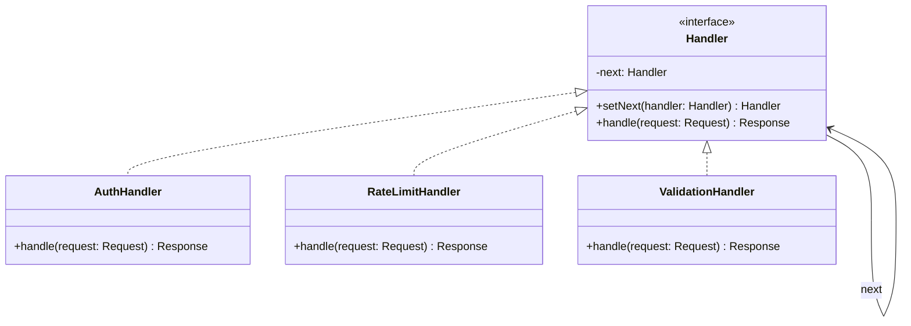

---
# Required
sidebar_position: 8
title: "Chain of Responsibility — Middleware Pipelines Done Right"
description: >-
  Learn the Chain of Responsibility pattern to pass requests through handlers.
  Essential for middleware, logging pipelines, and approval workflows.

# SEO
keywords:
  - chain of responsibility pattern
  - middleware pattern
  - handler chain
  - pipeline pattern
  - request handling

difficulty: intermediate
category: behavioral
related_solid: [SRP, OCP]

# Social sharing
og_title: "Chain of Responsibility: Middleware Pipelines Done Right"
og_description: "Pass requests through a chain of handlers—the pattern behind middleware."
og_image: "/img/social-card.svg"

# Content management
date_published: 2026-01-25
date_modified: 2026-01-25
author: shivam
reading_time: 13
content_type: explanation
---

# Chain of Responsibility Pattern

<PatternMeta>
  <Difficulty level="intermediate" />
  <TimeToRead minutes={13} />
  <Prerequisites patterns={["Strategy"]} />
</PatternMeta>

The authorization system that became unmaintainable taught me why Chain of Responsibility exists.

In 2020, our CI/CD platform at NVIDIA had request validation that looked like this:

```python
def handle_request(request):
    # Authentication
    if not request.has_valid_token():
        return AuthError("Invalid token")
    
    # Authorization
    if not user_can_access(request.user, request.resource):
        return AuthError("Access denied")
    
    # Rate limiting
    if is_rate_limited(request.user):
        return RateLimitError("Too many requests")
    
    # Input validation
    if not validate_input(request.data):
        return ValidationError("Invalid input")
    
    # Audit logging
    log_request(request)
    
    # Finally, handle the request
    return process_request(request)
```

Every new check meant modifying this function. Different endpoints needed different checks. Testing required mocking everything. The function grew to 200 lines of nested conditionals.

**Here's what I learned: when requests pass through multiple handlers where each might process or stop the chain, separate each handler into its own object.** That's Chain of Responsibility.

```python
# Each handler is independent
chain = (
    AuthenticationHandler()
    .set_next(AuthorizationHandler())
    .set_next(RateLimitHandler())
    .set_next(ValidationHandler())
    .set_next(LoggingHandler())
    .set_next(RequestHandler())
)

result = chain.handle(request)
```

Now each handler has one job. Add, remove, or reorder handlers without touching existing code.

---

## What Is the Chain of Responsibility Pattern?

> **Definition:** Chain of Responsibility passes a request along a chain of handlers. Each handler decides either to process the request or pass it to the next handler.

The sender doesn't know which handler will process the request. Handlers can be added, removed, or reordered without affecting the sender.

**The key insight: Chain of Responsibility decouples senders from receivers.** The sender just sends; the chain decides who handles.

---

## Structure



### Key Components

| Component | Role |
|-----------|------|
| **Handler Interface** | Declares handling method and optional next reference |
| **Base Handler** | Implements default chaining behavior |
| **Concrete Handlers** | Process requests or pass to next |
| **Client** | Initiates request to the chain |

---

## When to Use Chain of Responsibility

✅ **Use it when:**

- Multiple objects may handle a request, and the handler isn't known in advance
- You want to issue a request without specifying the receiver
- The set of handlers should be configurable dynamically
- Handlers should be combinable in different orders

❌ **Don't use it when:**

- Every request must be handled (chain might drop it)
- The handler is always known in advance
- You need guaranteed request handling

**Rule of thumb:** If you have a series of checks/processing steps that can be combined flexibly, Chain of Responsibility is likely a good fit.

---

## Implementation

<CodeTabs>
  <TabItem value="python" label="Python">
    ```python
    from abc import ABC, abstractmethod
    from dataclasses import dataclass
    from typing import Optional


    @dataclass
    class Request:
        user_id: str
        resource: str
        data: dict
        token: str
        metadata: dict = None
        
        def __post_init__(self):
            self.metadata = self.metadata or {}


    @dataclass
    class Response:
        success: bool
        data: dict = None
        error: str = None


    class Handler(ABC):
        """Abstract handler with chaining support."""
        
        def __init__(self) -> None:
            self._next: Optional[Handler] = None
        
        def set_next(self, handler: "Handler") -> "Handler":
            self._next = handler
            return handler  # Enable chaining
        
        def handle(self, request: Request) -> Response:
            """Template method: process then pass to next."""
            response = self.process(request)
            
            # If this handler produced a response, return it
            if response is not None:
                return response
            
            # Otherwise, pass to next handler
            if self._next:
                return self._next.handle(request)
            
            # No handler processed the request
            return Response(success=False, error="No handler processed the request")
        
        @abstractmethod
        def process(self, request: Request) -> Optional[Response]:
            """Process request. Return Response to stop chain, None to continue."""
            pass


    class AuthenticationHandler(Handler):
        """Validates authentication token."""
        
        VALID_TOKENS = {"token123", "token456"}
        
        def process(self, request: Request) -> Optional[Response]:
            if request.token not in self.VALID_TOKENS:
                print(f"[Auth] Invalid token for user {request.user_id}")
                return Response(success=False, error="Invalid authentication token")
            
            print(f"[Auth] User {request.user_id} authenticated")
            request.metadata["authenticated"] = True
            return None  # Continue chain


    class AuthorizationHandler(Handler):
        """Checks user permissions."""
        
        PERMISSIONS = {
            "user1": ["read", "write"],
            "user2": ["read"],
            "admin": ["read", "write", "delete"],
        }
        
        def process(self, request: Request) -> Optional[Response]:
            user_perms = self.PERMISSIONS.get(request.user_id, [])
            required_perm = request.data.get("action", "read")
            
            if required_perm not in user_perms:
                print(f"[Authz] User {request.user_id} lacks '{required_perm}' permission")
                return Response(success=False, error="Insufficient permissions")
            
            print(f"[Authz] User {request.user_id} authorized for '{required_perm}'")
            return None


    class RateLimitHandler(Handler):
        """Enforces rate limiting."""
        
        def __init__(self, max_requests: int = 10) -> None:
            super().__init__()
            self.max_requests = max_requests
            self.request_counts: dict[str, int] = {}
        
        def process(self, request: Request) -> Optional[Response]:
            count = self.request_counts.get(request.user_id, 0)
            
            if count >= self.max_requests:
                print(f"[RateLimit] User {request.user_id} rate limited")
                return Response(success=False, error="Rate limit exceeded")
            
            self.request_counts[request.user_id] = count + 1
            print(f"[RateLimit] User {request.user_id}: {count + 1}/{self.max_requests}")
            return None


    class ValidationHandler(Handler):
        """Validates request data."""
        
        def process(self, request: Request) -> Optional[Response]:
            if not request.data:
                print("[Validation] Empty request data")
                return Response(success=False, error="Request data is required")
            
            if "action" not in request.data:
                print("[Validation] Missing 'action' field")
                return Response(success=False, error="Action is required")
            
            print("[Validation] Request data is valid")
            return None


    class LoggingHandler(Handler):
        """Logs the request (always passes to next)."""
        
        def process(self, request: Request) -> Optional[Response]:
            print(f"[Log] Processing request: user={request.user_id}, "
                  f"resource={request.resource}, action={request.data.get('action')}")
            return None


    class BusinessHandler(Handler):
        """Actually processes the business logic."""
        
        def process(self, request: Request) -> Optional[Response]:
            print(f"[Business] Executing {request.data['action']} on {request.resource}")
            return Response(
                success=True,
                data={"result": f"Successfully executed {request.data['action']}"}
            )


    # Build the chain
    def create_standard_chain() -> Handler:
        auth = AuthenticationHandler()
        authz = AuthorizationHandler()
        rate_limit = RateLimitHandler(max_requests=100)
        validation = ValidationHandler()
        logging = LoggingHandler()
        business = BusinessHandler()
        
        auth.set_next(authz)
        authz.set_next(rate_limit)
        rate_limit.set_next(validation)
        validation.set_next(logging)
        logging.set_next(business)
        
        return auth


    # Usage
    chain = create_standard_chain()

    # Valid request
    request1 = Request(
        user_id="user1",
        resource="/api/data",
        data={"action": "read"},
        token="token123"
    )
    print("=== Request 1 (valid) ===")
    result = chain.handle(request1)
    print(f"Result: {result}\n")

    # Invalid token
    request2 = Request(
        user_id="user1",
        resource="/api/data",
        data={"action": "read"},
        token="invalid"
    )
    print("=== Request 2 (invalid token) ===")
    result = chain.handle(request2)
    print(f"Result: {result}\n")

    # Insufficient permissions
    request3 = Request(
        user_id="user2",
        resource="/api/data",
        data={"action": "write"},
        token="token123"
    )
    print("=== Request 3 (no write permission) ===")
    result = chain.handle(request3)
    print(f"Result: {result}")
    ```
  </TabItem>
  <TabItem value="typescript" label="TypeScript">
    ```typescript
    interface Request {
      userId: string;
      resource: string;
      data: Record<string, unknown>;
      token: string;
      metadata: Record<string, unknown>;
    }

    interface Response {
      success: boolean;
      data?: Record<string, unknown>;
      error?: string;
    }

    abstract class Handler {
      private next: Handler | null = null;

      setNext(handler: Handler): Handler {
        this.next = handler;
        return handler;
      }

      handle(request: Request): Response {
        const response = this.process(request);

        if (response !== null) {
          return response;
        }

        if (this.next) {
          return this.next.handle(request);
        }

        return { success: false, error: "No handler processed the request" };
      }

      protected abstract process(request: Request): Response | null;
    }

    class AuthenticationHandler extends Handler {
      private static VALID_TOKENS = new Set(["token123", "token456"]);

      protected process(request: Request): Response | null {
        if (!AuthenticationHandler.VALID_TOKENS.has(request.token)) {
          console.log(`[Auth] Invalid token for user ${request.userId}`);
          return { success: false, error: "Invalid authentication token" };
        }

        console.log(`[Auth] User ${request.userId} authenticated`);
        request.metadata.authenticated = true;
        return null;
      }
    }

    class AuthorizationHandler extends Handler {
      private static PERMISSIONS: Record<string, string[]> = {
        user1: ["read", "write"],
        user2: ["read"],
        admin: ["read", "write", "delete"],
      };

      protected process(request: Request): Response | null {
        const userPerms = AuthorizationHandler.PERMISSIONS[request.userId] || [];
        const requiredPerm = (request.data.action as string) || "read";

        if (!userPerms.includes(requiredPerm)) {
          console.log(`[Authz] User ${request.userId} lacks '${requiredPerm}'`);
          return { success: false, error: "Insufficient permissions" };
        }

        console.log(`[Authz] User ${request.userId} authorized for '${requiredPerm}'`);
        return null;
      }
    }

    class RateLimitHandler extends Handler {
      private requestCounts = new Map<string, number>();

      constructor(private maxRequests: number = 10) {
        super();
      }

      protected process(request: Request): Response | null {
        const count = this.requestCounts.get(request.userId) || 0;

        if (count >= this.maxRequests) {
          console.log(`[RateLimit] User ${request.userId} rate limited`);
          return { success: false, error: "Rate limit exceeded" };
        }

        this.requestCounts.set(request.userId, count + 1);
        console.log(`[RateLimit] ${request.userId}: ${count + 1}/${this.maxRequests}`);
        return null;
      }
    }

    class ValidationHandler extends Handler {
      protected process(request: Request): Response | null {
        if (!request.data || Object.keys(request.data).length === 0) {
          return { success: false, error: "Request data is required" };
        }

        if (!request.data.action) {
          return { success: false, error: "Action is required" };
        }

        console.log("[Validation] Request data is valid");
        return null;
      }
    }

    class LoggingHandler extends Handler {
      protected process(request: Request): Response | null {
        console.log(
          `[Log] Processing: user=${request.userId}, action=${request.data.action}`
        );
        return null;
      }
    }

    class BusinessHandler extends Handler {
      protected process(request: Request): Response | null {
        console.log(`[Business] Executing ${request.data.action}`);
        return {
          success: true,
          data: { result: `Executed ${request.data.action}` },
        };
      }
    }

    // Build chain
    function createStandardChain(): Handler {
      const auth = new AuthenticationHandler();
      const authz = new AuthorizationHandler();
      const rateLimit = new RateLimitHandler(100);
      const validation = new ValidationHandler();
      const logging = new LoggingHandler();
      const business = new BusinessHandler();

      auth.setNext(authz);
      authz.setNext(rateLimit);
      rateLimit.setNext(validation);
      validation.setNext(logging);
      logging.setNext(business);

      return auth;
    }

    // Usage
    const chain = createStandardChain();
    const result = chain.handle({
      userId: "user1",
      resource: "/api/data",
      data: { action: "read" },
      token: "token123",
      metadata: {},
    });
    console.log("Result:", result);
    ```
  </TabItem>
  <TabItem value="go" label="Go">
    ```go
    package chain

    import "fmt"

    type Request struct {
        UserID   string
        Resource string
        Data     map[string]interface{}
        Token    string
        Metadata map[string]interface{}
    }

    type Response struct {
        Success bool
        Data    map[string]interface{}
        Error   string
    }

    type Handler interface {
        SetNext(handler Handler) Handler
        Handle(request *Request) *Response
    }

    type BaseHandler struct {
        next Handler
    }

    func (h *BaseHandler) SetNext(handler Handler) Handler {
        h.next = handler
        return handler
    }

    func (h *BaseHandler) HandleNext(request *Request) *Response {
        if h.next != nil {
            return h.next.Handle(request)
        }
        return &Response{Success: false, Error: "No handler processed the request"}
    }

    // AuthenticationHandler
    type AuthenticationHandler struct {
        BaseHandler
    }

    var validTokens = map[string]bool{"token123": true, "token456": true}

    func (h *AuthenticationHandler) Handle(request *Request) *Response {
        if !validTokens[request.Token] {
            fmt.Printf("[Auth] Invalid token for user %s\n", request.UserID)
            return &Response{Success: false, Error: "Invalid authentication token"}
        }

        fmt.Printf("[Auth] User %s authenticated\n", request.UserID)
        request.Metadata["authenticated"] = true
        return h.HandleNext(request)
    }

    // AuthorizationHandler
    type AuthorizationHandler struct {
        BaseHandler
    }

    var permissions = map[string][]string{
        "user1": {"read", "write"},
        "user2": {"read"},
        "admin": {"read", "write", "delete"},
    }

    func (h *AuthorizationHandler) Handle(request *Request) *Response {
        userPerms := permissions[request.UserID]
        requiredPerm := "read"
        if action, ok := request.Data["action"].(string); ok {
            requiredPerm = action
        }

        hasPermission := false
        for _, p := range userPerms {
            if p == requiredPerm {
                hasPermission = true
                break
            }
        }

        if !hasPermission {
            fmt.Printf("[Authz] User %s lacks '%s' permission\n", request.UserID, requiredPerm)
            return &Response{Success: false, Error: "Insufficient permissions"}
        }

        fmt.Printf("[Authz] User %s authorized for '%s'\n", request.UserID, requiredPerm)
        return h.HandleNext(request)
    }

    // RateLimitHandler
    type RateLimitHandler struct {
        BaseHandler
        maxRequests   int
        requestCounts map[string]int
    }

    func NewRateLimitHandler(maxRequests int) *RateLimitHandler {
        return &RateLimitHandler{
            maxRequests:   maxRequests,
            requestCounts: make(map[string]int),
        }
    }

    func (h *RateLimitHandler) Handle(request *Request) *Response {
        count := h.requestCounts[request.UserID]
        if count >= h.maxRequests {
            return &Response{Success: false, Error: "Rate limit exceeded"}
        }
        h.requestCounts[request.UserID] = count + 1
        fmt.Printf("[RateLimit] %s: %d/%d\n", request.UserID, count+1, h.maxRequests)
        return h.HandleNext(request)
    }

    // BusinessHandler
    type BusinessHandler struct {
        BaseHandler
    }

    func (h *BusinessHandler) Handle(request *Request) *Response {
        action := request.Data["action"].(string)
        fmt.Printf("[Business] Executing %s on %s\n", action, request.Resource)
        return &Response{
            Success: true,
            Data:    map[string]interface{}{"result": "Executed " + action},
        }
    }

    // Build chain
    func CreateStandardChain() Handler {
        auth := &AuthenticationHandler{}
        authz := &AuthorizationHandler{}
        rateLimit := NewRateLimitHandler(100)
        business := &BusinessHandler{}

        auth.SetNext(authz)
        authz.SetNext(rateLimit)
        rateLimit.SetNext(business)

        return auth
    }
    ```
  </TabItem>
  <TabItem value="java" label="Java">
    ```java
    import java.util.*;

    record Request(String userId, String resource, Map<String, Object> data, 
                   String token, Map<String, Object> metadata) {
        Request {
            if (metadata == null) metadata = new HashMap<>();
        }
    }

    record Response(boolean success, Map<String, Object> data, String error) {
        static Response success(Map<String, Object> data) {
            return new Response(true, data, null);
        }
        static Response error(String error) {
            return new Response(false, null, error);
        }
    }

    abstract class Handler {
        private Handler next;

        public Handler setNext(Handler handler) {
            this.next = handler;
            return handler;
        }

        public Response handle(Request request) {
            Response response = process(request);
            if (response != null) return response;
            if (next != null) return next.handle(request);
            return Response.error("No handler processed the request");
        }

        protected abstract Response process(Request request);
    }

    class AuthenticationHandler extends Handler {
        private static final Set<String> VALID_TOKENS = Set.of("token123", "token456");

        @Override
        protected Response process(Request request) {
            if (!VALID_TOKENS.contains(request.token())) {
                System.out.printf("[Auth] Invalid token for user %s%n", request.userId());
                return Response.error("Invalid authentication token");
            }
            System.out.printf("[Auth] User %s authenticated%n", request.userId());
            request.metadata().put("authenticated", true);
            return null;
        }
    }

    class AuthorizationHandler extends Handler {
        private static final Map<String, List<String>> PERMISSIONS = Map.of(
            "user1", List.of("read", "write"),
            "user2", List.of("read"),
            "admin", List.of("read", "write", "delete")
        );

        @Override
        protected Response process(Request request) {
            var userPerms = PERMISSIONS.getOrDefault(request.userId(), List.of());
            var requiredPerm = (String) request.data().getOrDefault("action", "read");

            if (!userPerms.contains(requiredPerm)) {
                System.out.printf("[Authz] User %s lacks '%s'%n", request.userId(), requiredPerm);
                return Response.error("Insufficient permissions");
            }
            System.out.printf("[Authz] User %s authorized for '%s'%n", request.userId(), requiredPerm);
            return null;
        }
    }

    class RateLimitHandler extends Handler {
        private final int maxRequests;
        private final Map<String, Integer> requestCounts = new HashMap<>();

        public RateLimitHandler(int maxRequests) {
            this.maxRequests = maxRequests;
        }

        @Override
        protected Response process(Request request) {
            int count = requestCounts.getOrDefault(request.userId(), 0);
            if (count >= maxRequests) {
                return Response.error("Rate limit exceeded");
            }
            requestCounts.put(request.userId(), count + 1);
            System.out.printf("[RateLimit] %s: %d/%d%n", request.userId(), count + 1, maxRequests);
            return null;
        }
    }

    class BusinessHandler extends Handler {
        @Override
        protected Response process(Request request) {
            var action = (String) request.data().get("action");
            System.out.printf("[Business] Executing %s on %s%n", action, request.resource());
            return Response.success(Map.of("result", "Executed " + action));
        }
    }
    ```
  </TabItem>
  <TabItem value="csharp" label="C#">
    ```csharp
    public record Request(
        string UserId, 
        string Resource, 
        Dictionary<string, object> Data, 
        string Token,
        Dictionary<string, object> Metadata
    );

    public record Response(bool Success, Dictionary<string, object>? Data, string? Error);

    public abstract class Handler
    {
        private Handler? _next;

        public Handler SetNext(Handler handler)
        {
            _next = handler;
            return handler;
        }

        public Response Handle(Request request)
        {
            var response = Process(request);
            if (response != null) return response;
            if (_next != null) return _next.Handle(request);
            return new Response(false, null, "No handler processed the request");
        }

        protected abstract Response? Process(Request request);
    }

    public class AuthenticationHandler : Handler
    {
        private static readonly HashSet<string> ValidTokens = new() { "token123", "token456" };

        protected override Response? Process(Request request)
        {
            if (!ValidTokens.Contains(request.Token))
            {
                Console.WriteLine($"[Auth] Invalid token for user {request.UserId}");
                return new Response(false, null, "Invalid authentication token");
            }

            Console.WriteLine($"[Auth] User {request.UserId} authenticated");
            request.Metadata["authenticated"] = true;
            return null;
        }
    }

    public class AuthorizationHandler : Handler
    {
        private static readonly Dictionary<string, List<string>> Permissions = new()
        {
            ["user1"] = new() { "read", "write" },
            ["user2"] = new() { "read" },
            ["admin"] = new() { "read", "write", "delete" }
        };

        protected override Response? Process(Request request)
        {
            var userPerms = Permissions.GetValueOrDefault(request.UserId, new List<string>());
            var requiredPerm = request.Data.GetValueOrDefault("action", "read")?.ToString() ?? "read";

            if (!userPerms.Contains(requiredPerm))
            {
                Console.WriteLine($"[Authz] User {request.UserId} lacks '{requiredPerm}'");
                return new Response(false, null, "Insufficient permissions");
            }

            Console.WriteLine($"[Authz] User {request.UserId} authorized for '{requiredPerm}'");
            return null;
        }
    }

    public class RateLimitHandler : Handler
    {
        private readonly int _maxRequests;
        private readonly Dictionary<string, int> _requestCounts = new();

        public RateLimitHandler(int maxRequests) => _maxRequests = maxRequests;

        protected override Response? Process(Request request)
        {
            _requestCounts.TryGetValue(request.UserId, out var count);
            if (count >= _maxRequests)
                return new Response(false, null, "Rate limit exceeded");

            _requestCounts[request.UserId] = count + 1;
            Console.WriteLine($"[RateLimit] {request.UserId}: {count + 1}/{_maxRequests}");
            return null;
        }
    }

    public class BusinessHandler : Handler
    {
        protected override Response? Process(Request request)
        {
            var action = request.Data["action"]?.ToString();
            Console.WriteLine($"[Business] Executing {action} on {request.Resource}");
            return new Response(true, new() { ["result"] = $"Executed {action}" }, null);
        }
    }
    ```
  </TabItem>
</CodeTabs>

---

## Real-World Example: Express/Koa Middleware

Chain of Responsibility is exactly how middleware works in web frameworks:

```javascript
// Express middleware is Chain of Responsibility
app.use(authMiddleware);       // Handler 1
app.use(loggingMiddleware);    // Handler 2  
app.use(rateLimitMiddleware);  // Handler 3
app.use(routeHandler);         // Final handler

// Each middleware either:
// 1. Responds (stops chain)
// 2. Calls next() (continues chain)
function authMiddleware(req, res, next) {
    if (!req.headers.authorization) {
        return res.status(401).send('Unauthorized'); // Stop chain
    }
    next(); // Continue chain
}
```

---

## Common Mistakes

### 1. Handlers that don't pass to next

```python
# Bad: forgets to call next
class BadHandler(Handler):
    def process(self, request):
        print("Logging...")
        # Forgot to return None or call next!
```

Handlers must explicitly pass to next (return `None`) or stop the chain (return `Response`).

### 2. Chain with no terminal handler

```python
# Risk: what if no handler processes the request?
chain = AuthHandler().set_next(ValidationHandler())
# If both return None, request is dropped silently
```

Always have a fallback or terminal handler.

---

## Key Takeaways

- **Chain of Responsibility passes requests through handlers.** Each decides to process or pass.

- **Handlers are decoupled.** Add, remove, or reorder without changing other handlers.

- **It's the pattern behind middleware.** Express, Koa, Django middleware all use it.

- **Watch for dropped requests.** Ensure the chain always produces a result.

---

## Navigation

- **Previous:** [Iterator Pattern](/docs/design-patterns/behavioral/iterator)
- **Next:** [Mediator Pattern](/docs/design-patterns/behavioral/mediator)
