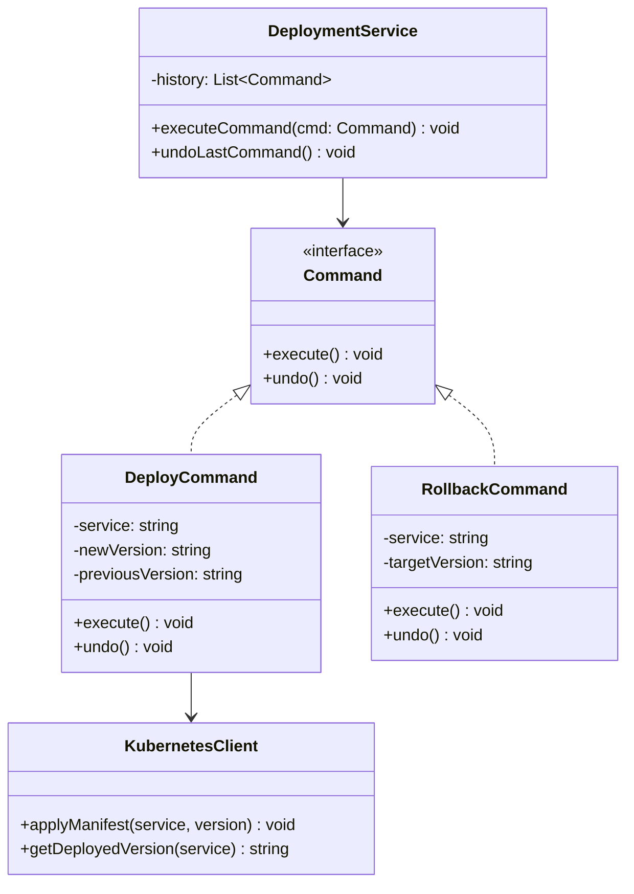

---
# Required
sidebar_position: 4
title: "Command Pattern — Encapsulating Requests as Objects"
description: >-
  Learn the Command pattern to encapsulate requests as objects, enabling
  undo/redo, queuing, logging, and transaction support.

# SEO
keywords:
  - command pattern
  - command design pattern
  - undo redo pattern
  - action pattern
  - request encapsulation

difficulty: intermediate
category: behavioral
related_solid: [SRP, OCP]

# Social sharing
og_title: "Command Pattern: Encapsulating Requests as Objects"
og_description: "Turn requests into objects for undo/redo, queuing, and transactions."
og_image: "/img/social-card.svg"

# Content management
date_published: 2026-01-25
date_modified: 2026-01-25
author: shivam
reading_time: 14
content_type: explanation
---

# Command Pattern

<PatternMeta>
  <Difficulty level="intermediate" />
  <TimeToRead minutes={14} />
  <Prerequisites patterns={["Strategy"]} />
</PatternMeta>

The deployment system that couldn't undo mistakes taught me why Command exists.

In 2020, our CI/CD platform at NVIDIA deployed thousands of services daily. Deployments were straightforward method calls:

```python
def deploy(service_name: str, version: str, environment: str) -> None:
    kubernetes.apply_manifest(service_name, version)
    load_balancer.update_routing(service_name)
    monitoring.configure_alerts(service_name)
```

It worked—until someone deployed the wrong version to production. We needed to roll back, but there was no rollback. Each step was a fire-and-forget method call. We didn't know what the previous version was. We couldn't reverse the load balancer changes. We spent four hours manually reconstructing the previous state.

**Here's what I learned: when you need to undo, log, queue, or replay operations, you need those operations to be objects, not just method calls.** That's Command pattern.

```python
# Each deployment becomes a command object
deploy_cmd = DeployCommand(service="auth-service", version="v2.1.0", env="prod")
deploy_cmd.execute()

# Now we can undo it
deploy_cmd.undo()  # Knows the previous version and reverses everything
```

---

## What Is the Command Pattern?

> **Definition:** Command encapsulates a request as an object, thereby letting you parameterize clients with different requests, queue or log requests, and support undoable operations.

Instead of calling a method directly, you create an object that represents the action. That object knows everything needed to perform the action—and potentially to undo it.

**The key insight: Commands turn "do this" into "here's what to do."** That separation enables powerful capabilities: undo/redo, command queuing, transaction logging, and macro recording.

---

## Structure



### Key Components

| Component | Role |
|-----------|------|
| **Command Interface** | Declares execute (and optionally undo) method |
| **Concrete Commands** | Implement execute by calling receiver methods |
| **Receiver** | The object that performs the actual work |
| **Invoker** | Stores and executes commands |
| **Client** | Creates commands and sets their receivers |

### SOLID Principles Connection

- **Single Responsibility:** Each command handles one action
- **Open/Closed:** Add new commands without modifying invoker

---

## When to Use Command

✅ **Use it when:**

- You need to parameterize objects with operations
- You need to queue, schedule, or execute requests at different times
- You need undo/redo functionality
- You need to log operations for auditing or replay
- You want to structure a system around high-level operations built from primitives

❌ **Don't use it when:**

- Operations are simple and don't need undo/logging
- You're adding complexity without clear benefit
- Direct method calls work fine and the system is stable

**Rule of thumb:** If you need to treat operations as first-class citizens (store them, pass them around, undo them), use Command.

---

## Implementation

<CodeTabs>
  <TabItem value="python" label="Python">
    ```python
    from abc import ABC, abstractmethod
    from dataclasses import dataclass, field
    from datetime import datetime


    class Command(ABC):
        @abstractmethod
        def execute(self) -> None:
            pass
        
        @abstractmethod
        def undo(self) -> None:
            pass


    @dataclass
    class DeployCommand(Command):
        """Command to deploy a service version."""
        service: str
        version: str
        environment: str
        _previous_version: str = field(default="", init=False)
        _executed: bool = field(default=False, init=False)
        
        def execute(self) -> None:
            # Store previous state for undo
            self._previous_version = self._get_current_version()
            
            # Perform deployment
            print(f"Deploying {self.service} v{self.version} to {self.environment}")
            print(f"  Previous version: {self._previous_version}")
            self._apply_deployment()
            self._executed = True
        
        def undo(self) -> None:
            if not self._executed:
                raise RuntimeError("Cannot undo: command not executed")
            if not self._previous_version:
                raise RuntimeError("Cannot undo: no previous version")
            
            print(f"Rolling back {self.service} to v{self._previous_version}")
            self._rollback()
            self._executed = False
        
        def _get_current_version(self) -> str:
            # In reality, query Kubernetes
            return "1.0.0"
        
        def _apply_deployment(self) -> None:
            # In reality, apply Kubernetes manifests
            pass
        
        def _rollback(self) -> None:
            # In reality, revert to previous manifests
            pass


    @dataclass
    class ScaleCommand(Command):
        """Command to scale a service."""
        service: str
        replicas: int
        _previous_replicas: int = field(default=0, init=False)
        _executed: bool = field(default=False, init=False)
        
        def execute(self) -> None:
            self._previous_replicas = self._get_current_replicas()
            print(f"Scaling {self.service} from {self._previous_replicas} to {self.replicas} replicas")
            self._apply_scale()
            self._executed = True
        
        def undo(self) -> None:
            if not self._executed:
                raise RuntimeError("Cannot undo: command not executed")
            print(f"Reverting {self.service} to {self._previous_replicas} replicas")
            self._revert_scale()
            self._executed = False
        
        def _get_current_replicas(self) -> int:
            return 3  # In reality, query Kubernetes
        
        def _apply_scale(self) -> None:
            pass
        
        def _revert_scale(self) -> None:
            pass


    class DeploymentManager:
        """Invoker that manages command execution and history."""
        
        def __init__(self) -> None:
            self._history: list[Command] = []
            self._undo_stack: list[Command] = []
        
        def execute(self, command: Command) -> None:
            command.execute()
            self._history.append(command)
            self._undo_stack.clear()  # Clear redo stack on new command
        
        def undo(self) -> None:
            if not self._history:
                print("Nothing to undo")
                return
            command = self._history.pop()
            command.undo()
            self._undo_stack.append(command)
        
        def redo(self) -> None:
            if not self._undo_stack:
                print("Nothing to redo")
                return
            command = self._undo_stack.pop()
            command.execute()
            self._history.append(command)
        
        def get_history(self) -> list[Command]:
            return list(self._history)


    # Usage
    manager = DeploymentManager()

    # Execute commands
    deploy = DeployCommand("auth-service", "2.0.0", "production")
    manager.execute(deploy)

    scale = ScaleCommand("auth-service", 5)
    manager.execute(scale)

    # Undo last command
    print("\n--- Undoing last command ---")
    manager.undo()

    # Redo
    print("\n--- Redoing ---")
    manager.redo()
    ```
  </TabItem>
  <TabItem value="typescript" label="TypeScript">
    ```typescript
    interface Command {
      execute(): void;
      undo(): void;
    }

    class DeployCommand implements Command {
      private previousVersion = "";
      private executed = false;

      constructor(
        private service: string,
        private version: string,
        private environment: string
      ) {}

      execute(): void {
        this.previousVersion = this.getCurrentVersion();
        console.log(
          `Deploying ${this.service} v${this.version} to ${this.environment}`
        );
        console.log(`  Previous version: ${this.previousVersion}`);
        this.applyDeployment();
        this.executed = true;
      }

      undo(): void {
        if (!this.executed) throw new Error("Cannot undo: command not executed");
        if (!this.previousVersion)
          throw new Error("Cannot undo: no previous version");

        console.log(`Rolling back ${this.service} to v${this.previousVersion}`);
        this.rollback();
        this.executed = false;
      }

      private getCurrentVersion(): string {
        return "1.0.0"; // Query Kubernetes in reality
      }

      private applyDeployment(): void {
        // Apply Kubernetes manifests
      }

      private rollback(): void {
        // Revert to previous manifests
      }
    }

    class ScaleCommand implements Command {
      private previousReplicas = 0;
      private executed = false;

      constructor(
        private service: string,
        private replicas: number
      ) {}

      execute(): void {
        this.previousReplicas = this.getCurrentReplicas();
        console.log(
          `Scaling ${this.service} from ${this.previousReplicas} to ${this.replicas} replicas`
        );
        this.applyScale();
        this.executed = true;
      }

      undo(): void {
        if (!this.executed) throw new Error("Cannot undo: command not executed");
        console.log(`Reverting ${this.service} to ${this.previousReplicas} replicas`);
        this.revertScale();
        this.executed = false;
      }

      private getCurrentReplicas(): number {
        return 3;
      }
      private applyScale(): void {}
      private revertScale(): void {}
    }

    class DeploymentManager {
      private history: Command[] = [];
      private undoStack: Command[] = [];

      execute(command: Command): void {
        command.execute();
        this.history.push(command);
        this.undoStack = [];
      }

      undo(): void {
        const command = this.history.pop();
        if (!command) {
          console.log("Nothing to undo");
          return;
        }
        command.undo();
        this.undoStack.push(command);
      }

      redo(): void {
        const command = this.undoStack.pop();
        if (!command) {
          console.log("Nothing to redo");
          return;
        }
        command.execute();
        this.history.push(command);
      }
    }

    // Usage
    const manager = new DeploymentManager();
    manager.execute(new DeployCommand("auth-service", "2.0.0", "production"));
    manager.execute(new ScaleCommand("auth-service", 5));
    manager.undo();
    manager.redo();
    ```
  </TabItem>
  <TabItem value="go" label="Go">
    ```go
    package command

    import (
        "errors"
        "fmt"
    )

    type Command interface {
        Execute() error
        Undo() error
    }

    type DeployCommand struct {
        Service         string
        Version         string
        Environment     string
        previousVersion string
        executed        bool
    }

    func (d *DeployCommand) Execute() error {
        d.previousVersion = d.getCurrentVersion()
        fmt.Printf("Deploying %s v%s to %s\n", d.Service, d.Version, d.Environment)
        fmt.Printf("  Previous version: %s\n", d.previousVersion)
        d.applyDeployment()
        d.executed = true
        return nil
    }

    func (d *DeployCommand) Undo() error {
        if !d.executed {
            return errors.New("cannot undo: command not executed")
        }
        if d.previousVersion == "" {
            return errors.New("cannot undo: no previous version")
        }
        fmt.Printf("Rolling back %s to v%s\n", d.Service, d.previousVersion)
        d.rollback()
        d.executed = false
        return nil
    }

    func (d *DeployCommand) getCurrentVersion() string { return "1.0.0" }
    func (d *DeployCommand) applyDeployment()          {}
    func (d *DeployCommand) rollback()                 {}

    type ScaleCommand struct {
        Service          string
        Replicas         int
        previousReplicas int
        executed         bool
    }

    func (s *ScaleCommand) Execute() error {
        s.previousReplicas = s.getCurrentReplicas()
        fmt.Printf("Scaling %s from %d to %d replicas\n", 
            s.Service, s.previousReplicas, s.Replicas)
        s.applyScale()
        s.executed = true
        return nil
    }

    func (s *ScaleCommand) Undo() error {
        if !s.executed {
            return errors.New("cannot undo: command not executed")
        }
        fmt.Printf("Reverting %s to %d replicas\n", s.Service, s.previousReplicas)
        s.revertScale()
        s.executed = false
        return nil
    }

    func (s *ScaleCommand) getCurrentReplicas() int { return 3 }
    func (s *ScaleCommand) applyScale()             {}
    func (s *ScaleCommand) revertScale()            {}

    type DeploymentManager struct {
        history   []Command
        undoStack []Command
    }

    func NewDeploymentManager() *DeploymentManager {
        return &DeploymentManager{
            history:   []Command{},
            undoStack: []Command{},
        }
    }

    func (m *DeploymentManager) Execute(cmd Command) error {
        if err := cmd.Execute(); err != nil {
            return err
        }
        m.history = append(m.history, cmd)
        m.undoStack = []Command{}
        return nil
    }

    func (m *DeploymentManager) Undo() error {
        if len(m.history) == 0 {
            fmt.Println("Nothing to undo")
            return nil
        }
        cmd := m.history[len(m.history)-1]
        m.history = m.history[:len(m.history)-1]
        if err := cmd.Undo(); err != nil {
            return err
        }
        m.undoStack = append(m.undoStack, cmd)
        return nil
    }

    func (m *DeploymentManager) Redo() error {
        if len(m.undoStack) == 0 {
            fmt.Println("Nothing to redo")
            return nil
        }
        cmd := m.undoStack[len(m.undoStack)-1]
        m.undoStack = m.undoStack[:len(m.undoStack)-1]
        if err := cmd.Execute(); err != nil {
            return err
        }
        m.history = append(m.history, cmd)
        return nil
    }
    ```
  </TabItem>
  <TabItem value="java" label="Java">
    ```java
    import java.util.*;

    interface Command {
        void execute();
        void undo();
    }

    class DeployCommand implements Command {
        private final String service;
        private final String version;
        private final String environment;
        private String previousVersion = "";
        private boolean executed = false;

        public DeployCommand(String service, String version, String environment) {
            this.service = service;
            this.version = version;
            this.environment = environment;
        }

        @Override
        public void execute() {
            previousVersion = getCurrentVersion();
            System.out.printf("Deploying %s v%s to %s%n", service, version, environment);
            System.out.printf("  Previous version: %s%n", previousVersion);
            applyDeployment();
            executed = true;
        }

        @Override
        public void undo() {
            if (!executed) throw new IllegalStateException("Cannot undo: not executed");
            if (previousVersion.isEmpty()) throw new IllegalStateException("No previous version");
            System.out.printf("Rolling back %s to v%s%n", service, previousVersion);
            rollback();
            executed = false;
        }

        private String getCurrentVersion() { return "1.0.0"; }
        private void applyDeployment() {}
        private void rollback() {}
    }

    class ScaleCommand implements Command {
        private final String service;
        private final int replicas;
        private int previousReplicas = 0;
        private boolean executed = false;

        public ScaleCommand(String service, int replicas) {
            this.service = service;
            this.replicas = replicas;
        }

        @Override
        public void execute() {
            previousReplicas = getCurrentReplicas();
            System.out.printf("Scaling %s from %d to %d replicas%n", 
                service, previousReplicas, replicas);
            applyScale();
            executed = true;
        }

        @Override
        public void undo() {
            if (!executed) throw new IllegalStateException("Cannot undo: not executed");
            System.out.printf("Reverting %s to %d replicas%n", service, previousReplicas);
            revertScale();
            executed = false;
        }

        private int getCurrentReplicas() { return 3; }
        private void applyScale() {}
        private void revertScale() {}
    }

    class DeploymentManager {
        private final Deque<Command> history = new ArrayDeque<>();
        private final Deque<Command> undoStack = new ArrayDeque<>();

        public void execute(Command command) {
            command.execute();
            history.push(command);
            undoStack.clear();
        }

        public void undo() {
            if (history.isEmpty()) {
                System.out.println("Nothing to undo");
                return;
            }
            Command command = history.pop();
            command.undo();
            undoStack.push(command);
        }

        public void redo() {
            if (undoStack.isEmpty()) {
                System.out.println("Nothing to redo");
                return;
            }
            Command command = undoStack.pop();
            command.execute();
            history.push(command);
        }
    }
    ```
  </TabItem>
  <TabItem value="csharp" label="C#">
    ```csharp
    public interface ICommand
    {
        void Execute();
        void Undo();
    }

    public class DeployCommand : ICommand
    {
        private readonly string _service;
        private readonly string _version;
        private readonly string _environment;
        private string _previousVersion = "";
        private bool _executed;

        public DeployCommand(string service, string version, string environment)
        {
            _service = service;
            _version = version;
            _environment = environment;
        }

        public void Execute()
        {
            _previousVersion = GetCurrentVersion();
            Console.WriteLine($"Deploying {_service} v{_version} to {_environment}");
            Console.WriteLine($"  Previous version: {_previousVersion}");
            ApplyDeployment();
            _executed = true;
        }

        public void Undo()
        {
            if (!_executed)
                throw new InvalidOperationException("Cannot undo: not executed");
            if (string.IsNullOrEmpty(_previousVersion))
                throw new InvalidOperationException("No previous version");

            Console.WriteLine($"Rolling back {_service} to v{_previousVersion}");
            Rollback();
            _executed = false;
        }

        private string GetCurrentVersion() => "1.0.0";
        private void ApplyDeployment() { }
        private void Rollback() { }
    }

    public class ScaleCommand : ICommand
    {
        private readonly string _service;
        private readonly int _replicas;
        private int _previousReplicas;
        private bool _executed;

        public ScaleCommand(string service, int replicas)
        {
            _service = service;
            _replicas = replicas;
        }

        public void Execute()
        {
            _previousReplicas = GetCurrentReplicas();
            Console.WriteLine($"Scaling {_service} from {_previousReplicas} to {_replicas} replicas");
            ApplyScale();
            _executed = true;
        }

        public void Undo()
        {
            if (!_executed)
                throw new InvalidOperationException("Cannot undo: not executed");

            Console.WriteLine($"Reverting {_service} to {_previousReplicas} replicas");
            RevertScale();
            _executed = false;
        }

        private int GetCurrentReplicas() => 3;
        private void ApplyScale() { }
        private void RevertScale() { }
    }

    public class DeploymentManager
    {
        private readonly Stack<ICommand> _history = new();
        private readonly Stack<ICommand> _undoStack = new();

        public void Execute(ICommand command)
        {
            command.Execute();
            _history.Push(command);
            _undoStack.Clear();
        }

        public void Undo()
        {
            if (_history.Count == 0)
            {
                Console.WriteLine("Nothing to undo");
                return;
            }
            var command = _history.Pop();
            command.Undo();
            _undoStack.Push(command);
        }

        public void Redo()
        {
            if (_undoStack.Count == 0)
            {
                Console.WriteLine("Nothing to redo");
                return;
            }
            var command = _undoStack.Pop();
            command.Execute();
            _history.Push(command);
        }
    }
    ```
  </TabItem>
</CodeTabs>

---

## Real-World Example: Text Editor

Text editors are the classic Command pattern use case:

```python
class TextEditor:
    def __init__(self):
        self.text = ""
        self.cursor = 0


class InsertCommand(Command):
    def __init__(self, editor: TextEditor, text: str):
        self.editor = editor
        self.insert_text = text
        self.position = editor.cursor
    
    def execute(self) -> None:
        self.editor.text = (
            self.editor.text[:self.position] + 
            self.insert_text + 
            self.editor.text[self.position:]
        )
        self.editor.cursor = self.position + len(self.insert_text)
    
    def undo(self) -> None:
        self.editor.text = (
            self.editor.text[:self.position] + 
            self.editor.text[self.position + len(self.insert_text):]
        )
        self.editor.cursor = self.position


class DeleteCommand(Command):
    def __init__(self, editor: TextEditor, length: int):
        self.editor = editor
        self.position = editor.cursor
        self.length = length
        self.deleted_text = ""
    
    def execute(self) -> None:
        self.deleted_text = self.editor.text[self.position:self.position + self.length]
        self.editor.text = (
            self.editor.text[:self.position] + 
            self.editor.text[self.position + self.length:]
        )
    
    def undo(self) -> None:
        self.editor.text = (
            self.editor.text[:self.position] + 
            self.deleted_text + 
            self.editor.text[self.position:]
        )
        self.editor.cursor = self.position + len(self.deleted_text)
```

---

## Common Mistakes

### 1. Commands that don't capture enough state for undo

```python
# Bad: doesn't remember what was deleted
class BadDeleteCommand(Command):
    def execute(self):
        self.editor.delete_selection()  # What was deleted?
    
    def undo(self):
        # Can't undo - we don't know what was deleted!
        pass
```

Always capture the state needed to reverse the operation.

### 2. Commands with side effects that can't be undone

```python
# Bad: can't un-send an email
class SendEmailCommand(Command):
    def execute(self):
        email_service.send(self.email)
    
    def undo(self):
        # Too late - email is already sent
        raise NotImplementedError("Cannot unsend email")
```

Not everything can be undone. Be explicit when undo isn't possible.

### 3. Invoker that leaks command details

```python
# Bad: invoker knows about specific command types
class BadInvoker:
    def execute(self, command):
        if isinstance(command, DeployCommand):
            # Special handling - breaks abstraction
            self.notify_ops_team()
        command.execute()
```

The invoker should treat all commands uniformly.

---

## Related Patterns

| Pattern | Relationship |
|---------|--------------|
| **Memento** | Commands can use Memento to store state for undo |
| **Strategy** | Both encapsulate algorithms; Command also supports undo/queueing |
| **Observer** | Commands can trigger events when executed |

---

## Key Takeaways

- **Command turns requests into objects.** This enables undo, logging, queuing, and more.

- **The command knows how to execute AND undo.** Capture enough state in execute() to reverse in undo().

- **The invoker doesn't know command details.** It just calls execute() and undo().

- **Use it when operations need to be first-class citizens.** Stored, passed around, replayed.

---

## Navigation

- **Previous:** [Observer Pattern](/docs/design-patterns/behavioral/observer)
- **Next:** [Template Method Pattern](/docs/design-patterns/behavioral/template-method)
