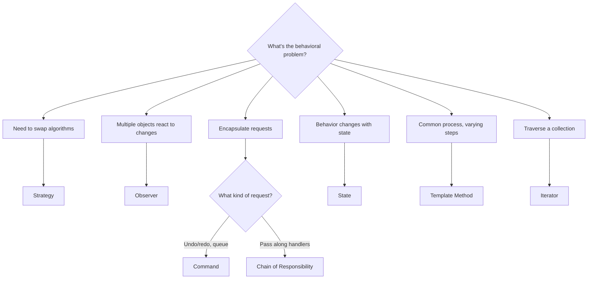

---
# Required
sidebar_position: 1
title: "Behavioral Design Patterns — Overview"
description: >-
  Behavioral patterns coordinate communication between objects and define how
  responsibilities are distributed. Learn when to use Observer, Strategy,
  Command, and other behavioral patterns.

# SEO
keywords:
  - behavioral design patterns
  - observer pattern
  - strategy pattern
  - command pattern
  - state pattern
  - template method pattern
  - chain of responsibility

# Social sharing
og_title: "Behavioral Patterns: Coordinating Object Communication"
og_description: "A practical guide to patterns that manage object interactions and behavior."
og_image: "/img/social-card.svg"

# Content management
date_published: 2026-01-25
date_modified: 2026-01-25
author: shivam
reading_time: 12
content_type: explanation
---

# Behavioral Patterns Overview

The notification system that couldn't scale taught me why behavioral patterns exist.

In 2019, our CI/CD platform at NVIDIA needed to notify developers about build events—started, failed, completed, deployed. The first version was direct calls:

```python
def on_build_complete(build):
    email_service.send(build.owner, "Build complete")
    slack_service.post(build.channel, "Build complete")
    metrics_service.record("build.complete", 1)
```

Every new notification channel meant modifying `on_build_complete`. Every new event type meant copying this pattern. When we added PagerDuty, Teams, webhooks, and custom integrations, the core build service became a tangle of notification logic that had nothing to do with building software.

**Behavioral patterns solve this by defining clear responsibilities and communication protocols between objects.** The build service shouldn't know about notification channels—it should just announce events. Channels should subscribe and handle their own logic.

---

## When You Need a Behavioral Pattern

You're looking at a behavioral problem when:

- **Multiple objects need to respond to the same events.** When something happens, many things need to know about it.

- **Algorithms vary independently of the objects that use them.** You want to swap strategies without changing the caller.

- **Complex conditional logic controls behavior.** Long switch statements or if-else chains that select different actions.

- **You need to encapsulate requests as objects.** For queuing, logging, undoing, or routing operations.

If none of these apply, you probably don't need a behavioral pattern. Direct method calls are fine.

---

## The Behavioral Patterns

Here's the landscape, from most to least commonly used:

| Pattern | What It Does | Frequency |
|---------|--------------|-----------|
| **[Strategy](/docs/design-patterns/behavioral/strategy)** | Swaps algorithms without changing clients | Very High |
| **[Observer](/docs/design-patterns/behavioral/observer)** | Notifies subscribers when state changes | Very High |
| **[Command](/docs/design-patterns/behavioral/command)** | Encapsulates requests as objects | High |
| **[Template Method](/docs/design-patterns/behavioral/template-method)** | Defines skeleton algorithms with customizable steps | High |
| **[State](/docs/design-patterns/behavioral/state)** | Changes behavior when internal state changes | Medium |
| **[Iterator](/docs/design-patterns/behavioral/iterator)** | Traverses collections without exposing internals | Medium |
| **[Chain of Responsibility](/docs/design-patterns/behavioral/chain-of-responsibility)** | Passes requests along a chain of handlers | Medium |
| **[Mediator](/docs/design-patterns/behavioral/mediator)** | Centralizes complex object communication | Low |
| **[Memento](/docs/design-patterns/behavioral/memento)** | Captures and restores object state | Low |
| **[Visitor](/docs/design-patterns/behavioral/visitor)** | Adds operations to object structures | Low |

---

## Quick Comparison

| If Your Problem Is... | Consider... | Trade-off |
|----------------------|-------------|-----------|
| "I need to swap algorithms at runtime" | [Strategy](/docs/design-patterns/behavioral/strategy) | Interface per algorithm |
| "Multiple objects need to react to events" | [Observer](/docs/design-patterns/behavioral/observer) | Can be hard to debug |
| "I need undo/redo or queuing" | [Command](/docs/design-patterns/behavioral/command) | More objects in the system |
| "I have a process with fixed steps, variable details" | [Template Method](/docs/design-patterns/behavioral/template-method) | Uses inheritance |
| "Behavior depends on object state" | [State](/docs/design-patterns/behavioral/state) | More state classes |
| "I need to process requests through handlers" | [Chain of Responsibility](/docs/design-patterns/behavioral/chain-of-responsibility) | Request might not be handled |

---

## Decision Flowchart



---

## Pattern Deep Dives

Each pattern page covers:
- A real problem that motivates the pattern
- Clear structure with UML diagrams
- Working implementations in five languages
- When to use it—and when not to
- Testing strategies
- Common mistakes to avoid

### The Patterns

- **[Strategy →](/docs/design-patterns/behavioral/strategy)**  
  Swaps algorithms without changing clients. The most common behavioral pattern—use it when you have interchangeable algorithms like payment processors, compression strategies, or sorting methods.

- **[Observer →](/docs/design-patterns/behavioral/observer)**  
  Notifies multiple objects when state changes. Essential for event-driven systems, pub/sub architectures, and reactive programming.

- **[Command →](/docs/design-patterns/behavioral/command)**  
  Encapsulates requests as objects. Enables undo/redo, command queuing, logging, and transaction support.

- **[Template Method →](/docs/design-patterns/behavioral/template-method)**  
  Defines the skeleton of an algorithm with customizable steps. Perfect for frameworks, ETL pipelines, and workflows where the structure is fixed but details vary.

- **[State →](/docs/design-patterns/behavioral/state)**  
  Changes behavior when internal state changes. Cleaner than state-based conditionals—use for order workflows, connection states, and game characters.

- **[Iterator →](/docs/design-patterns/behavioral/iterator)**  
  Traverses collections without exposing their internal structure. Most languages have built-in support, but implement it for custom data structures.

- **[Chain of Responsibility →](/docs/design-patterns/behavioral/chain-of-responsibility)**  
  Passes requests along a chain until one handler processes it. The pattern behind middleware in Express, Koa, and Django.

- **[Mediator →](/docs/design-patterns/behavioral/mediator)**  
  Centralizes complex communication between multiple objects. Use for chat rooms, event buses, and complex UI coordination.

- **[Memento →](/docs/design-patterns/behavioral/memento)**  
  Captures and restores object state without violating encapsulation. Essential for undo/redo, checkpoints, and game save states.

- **[Visitor →](/docs/design-patterns/behavioral/visitor)**  
  Adds operations to object structures without modifying them. Perfect for AST processing, document export, and analyzers.

---

## Real-World Example: Event-Driven Notifications

When we redesigned the notification system using Observer, the architecture became clean:

```python
class BuildEventBus:
    """Central event bus for build lifecycle events."""
    
    def __init__(self):
        self._subscribers: dict[str, list[Callable]] = {}
    
    def subscribe(self, event: str, handler: Callable) -> None:
        self._subscribers.setdefault(event, []).append(handler)
    
    def publish(self, event: str, data: dict) -> None:
        for handler in self._subscribers.get(event, []):
            handler(data)


# Notification channels subscribe independently
event_bus = BuildEventBus()
event_bus.subscribe("build.complete", email_notifier.handle)
event_bus.subscribe("build.complete", slack_notifier.handle)
event_bus.subscribe("build.failed", pagerduty_notifier.handle)

# Build service just publishes events—doesn't know about channels
def on_build_complete(build):
    event_bus.publish("build.complete", {"build_id": build.id, "owner": build.owner})
```

Adding a new notification channel? Just subscribe. No changes to the build service.

---

## Common Mistakes with Behavioral Patterns

### Observer chains that cause infinite loops

```python
# A observes B, B observes C, C observes A
# Change to A triggers B, which triggers C, which triggers A...
```

Be careful about circular subscriptions.

### Strategy interface that's too specific

```python
class SortStrategy(ABC):
    @abstractmethod
    def sort(self, items: list[int]) -> list[int]:  # Too specific
        pass
```

If your strategy interface ties you to specific types, you've lost flexibility.

### Command without undo

If you're using Command to implement undo/redo, make sure every command knows how to reverse itself. Otherwise, you have the overhead without the benefit.

### State that knows too much about other states

```python
class PaidState:
    def cancel(self, order):
        if order.has_shipped:  # Checking another state's concern
            raise Error("...")
```

Each state should only know about its own transitions.

---

## Navigation

- **Previous:** [Proxy Pattern](/docs/design-patterns/structural/proxy)
- **Next:** [Strategy Pattern](/docs/design-patterns/behavioral/strategy)
