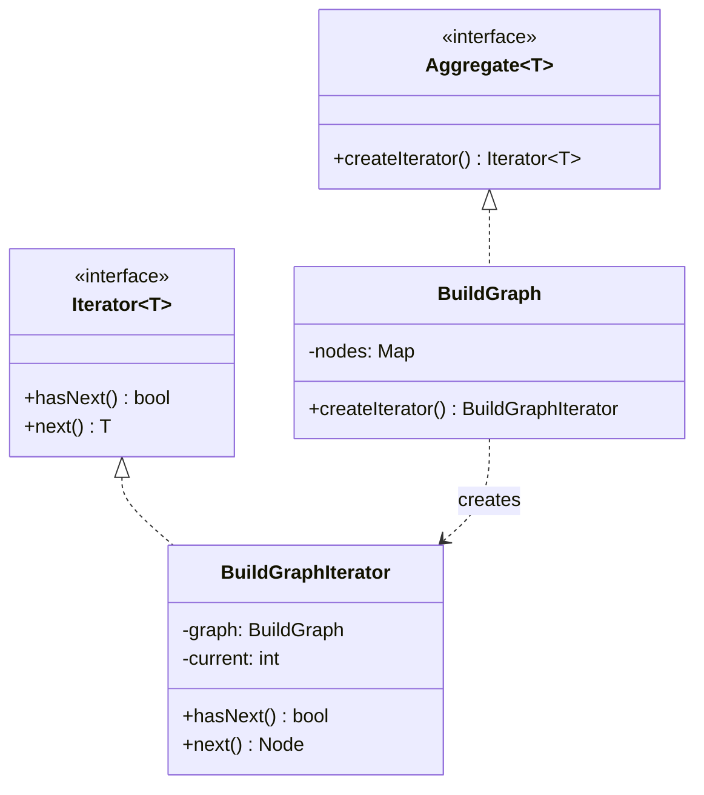

---
# Required
sidebar_position: 7
title: "Iterator Pattern — Sequential Access Without Exposing Structure"
description: >-
  Learn the Iterator pattern to traverse collections without exposing their
  underlying representation. Essential for custom data structures.

# SEO
keywords:
  - iterator pattern
  - iterator design pattern
  - traversal pattern
  - collection iteration
  - cursor pattern

difficulty: beginner
category: behavioral
related_solid: [SRP, OCP]

# Social sharing
og_title: "Iterator Pattern: Sequential Access Without Exposing Structure"
og_description: "Traverse collections without knowing how they're implemented."
og_image: "/img/social-card.svg"

# Content management
date_published: 2026-01-25
date_modified: 2026-01-25
author: shivam
reading_time: 12
content_type: explanation
---

# Iterator Pattern

<PatternMeta>
  <Difficulty level="beginner" />
  <TimeToRead minutes={12} />
  <Prerequisites patterns={[]} />
</PatternMeta>

The graph traversal that broke when we changed data structures taught me why Iterator exists.

In 2019, our CI/CD platform at NVIDIA had a dependency graph for build ordering. Initially, we stored dependencies in an adjacency list:

```python
class BuildGraph:
    def __init__(self):
        self.dependencies = {}  # node -> list of dependencies
    
    def get_build_order(self):
        # Topological sort using the adjacency list
        result = []
        for node in self.dependencies:
            for dep in self.dependencies[node]:
                # Process...
        return result
```

Then we needed weighted edges for priority, so we switched to a matrix representation. Every function that iterated over dependencies broke. Then we added a third representation for sparse graphs. More breakage.

**Here's what I learned: when you need to traverse a collection but don't want to expose its internal structure, use an iterator.** The client code asks for "next element" without knowing if it's from a list, tree, or matrix.

```python
# Now client code doesn't care about representation
for dependency in graph.dependencies():  # Returns an iterator
    process(dependency)
```

---

## What Is the Iterator Pattern?

> **Definition:** Iterator provides a way to access the elements of an aggregate object sequentially without exposing its underlying representation.

The iterator encapsulates the traversal logic. Collections provide iterators; clients use them without knowing how traversal works internally.

**The key insight: Iterator decouples algorithms from data structures.** You can change how a collection stores elements without changing how clients traverse it.

---

## Structure



### Key Components

| Component | Role |
|-----------|------|
| **Iterator Interface** | Declares traversal operations (hasNext, next) |
| **Concrete Iterator** | Implements traversal for a specific collection |
| **Aggregate Interface** | Declares method to create an iterator |
| **Concrete Aggregate** | Implements iterator creation |

---

## When to Use Iterator

✅ **Use it when:**

- You need to traverse a collection without exposing its structure
- You want multiple traversal algorithms (forward, reverse, filtered)
- You need a uniform interface for traversing different collections
- You want to support multiple simultaneous traversals

❌ **Don't use it when:**

- You're using a language with built-in iteration (Python, JavaScript, Java streams)
- The collection is simple and iteration is straightforward
- You only ever need one traversal method

**Note:** Most modern languages have Iterator built into the language. You implement the pattern when creating custom collections or need specialized traversal.

---

## Implementation

<CodeTabs>
  <TabItem value="python" label="Python">
    ```python
    from abc import ABC, abstractmethod
    from dataclasses import dataclass
    from typing import Iterator as TypingIterator, Generic, TypeVar

    T = TypeVar('T')


    @dataclass
    class BuildNode:
        name: str
        dependencies: list[str]


    class BuildGraph:
        """Collection of build nodes with dependencies."""
        
        def __init__(self) -> None:
            self._nodes: dict[str, BuildNode] = {}
        
        def add_node(self, name: str, dependencies: list[str] = None) -> None:
            self._nodes[name] = BuildNode(name, dependencies or [])
        
        def __iter__(self) -> TypingIterator[BuildNode]:
            """Return iterator for forward traversal."""
            return BuildGraphIterator(self._nodes)
        
        def topological_order(self) -> TypingIterator[BuildNode]:
            """Return iterator for topological (dependency) order."""
            return TopologicalIterator(self._nodes)
        
        def reverse_order(self) -> TypingIterator[BuildNode]:
            """Return iterator for reverse order."""
            return ReverseBuildGraphIterator(self._nodes)


    class BuildGraphIterator:
        """Simple forward iterator."""
        
        def __init__(self, nodes: dict[str, BuildNode]) -> None:
            self._nodes = list(nodes.values())
            self._index = 0
        
        def __iter__(self) -> "BuildGraphIterator":
            return self
        
        def __next__(self) -> BuildNode:
            if self._index >= len(self._nodes):
                raise StopIteration
            node = self._nodes[self._index]
            self._index += 1
            return node


    class ReverseBuildGraphIterator:
        """Reverse iterator."""
        
        def __init__(self, nodes: dict[str, BuildNode]) -> None:
            self._nodes = list(nodes.values())
            self._index = len(self._nodes) - 1
        
        def __iter__(self) -> "ReverseBuildGraphIterator":
            return self
        
        def __next__(self) -> BuildNode:
            if self._index < 0:
                raise StopIteration
            node = self._nodes[self._index]
            self._index -= 1
            return node


    class TopologicalIterator:
        """Iterator that returns nodes in dependency order."""
        
        def __init__(self, nodes: dict[str, BuildNode]) -> None:
            self._sorted = self._topological_sort(nodes)
            self._index = 0
        
        def _topological_sort(self, nodes: dict[str, BuildNode]) -> list[BuildNode]:
            visited = set()
            result = []
            
            def visit(name: str) -> None:
                if name in visited or name not in nodes:
                    return
                visited.add(name)
                for dep in nodes[name].dependencies:
                    visit(dep)
                result.append(nodes[name])
            
            for name in nodes:
                visit(name)
            return result
        
        def __iter__(self) -> "TopologicalIterator":
            return self
        
        def __next__(self) -> BuildNode:
            if self._index >= len(self._sorted):
                raise StopIteration
            node = self._sorted[self._index]
            self._index += 1
            return node


    # Usage
    graph = BuildGraph()
    graph.add_node("tests", ["app"])
    graph.add_node("app", ["lib"])
    graph.add_node("lib", [])
    graph.add_node("docs", [])

    print("Forward order:")
    for node in graph:
        print(f"  {node.name}")

    print("\nTopological (build) order:")
    for node in graph.topological_order():
        print(f"  {node.name} (depends on: {node.dependencies})")

    print("\nReverse order:")
    for node in graph.reverse_order():
        print(f"  {node.name}")
    ```
  </TabItem>
  <TabItem value="typescript" label="TypeScript">
    ```typescript
    interface BuildNode {
      name: string;
      dependencies: string[];
    }

    // Using TypeScript's built-in Iterator protocol
    class BuildGraph implements Iterable<BuildNode> {
      private nodes = new Map<string, BuildNode>();

      addNode(name: string, dependencies: string[] = []): void {
        this.nodes.set(name, { name, dependencies });
      }

      // Default iterator - forward traversal
      [Symbol.iterator](): Iterator<BuildNode> {
        return this.nodes.values();
      }

      // Topological order iterator
      *topologicalOrder(): Generator<BuildNode> {
        const visited = new Set<string>();
        const result: BuildNode[] = [];

        const visit = (name: string): void => {
          if (visited.has(name) || !this.nodes.has(name)) return;
          visited.add(name);
          const node = this.nodes.get(name)!;
          for (const dep of node.dependencies) {
            visit(dep);
          }
          result.push(node);
        };

        for (const name of this.nodes.keys()) {
          visit(name);
        }

        yield* result;
      }

      // Reverse order iterator
      *reverseOrder(): Generator<BuildNode> {
        const nodes = Array.from(this.nodes.values());
        for (let i = nodes.length - 1; i >= 0; i--) {
          yield nodes[i];
        }
      }
    }

    // Usage
    const graph = new BuildGraph();
    graph.addNode("tests", ["app"]);
    graph.addNode("app", ["lib"]);
    graph.addNode("lib", []);
    graph.addNode("docs", []);

    console.log("Forward order:");
    for (const node of graph) {
      console.log(`  ${node.name}`);
    }

    console.log("\nTopological (build) order:");
    for (const node of graph.topologicalOrder()) {
      console.log(`  ${node.name} (depends on: ${node.dependencies.join(", ")})`);
    }

    console.log("\nReverse order:");
    for (const node of graph.reverseOrder()) {
      console.log(`  ${node.name}`);
    }
    ```
  </TabItem>
  <TabItem value="go" label="Go">
    ```go
    package iterator

    import "fmt"

    type BuildNode struct {
        Name         string
        Dependencies []string
    }

    type BuildGraph struct {
        nodes map[string]*BuildNode
        order []string // maintain insertion order
    }

    func NewBuildGraph() *BuildGraph {
        return &BuildGraph{
            nodes: make(map[string]*BuildNode),
            order: []string{},
        }
    }

    func (g *BuildGraph) AddNode(name string, deps []string) {
        g.nodes[name] = &BuildNode{Name: name, Dependencies: deps}
        g.order = append(g.order, name)
    }

    // Iterator returns a channel-based iterator
    func (g *BuildGraph) Iterator() <-chan *BuildNode {
        ch := make(chan *BuildNode)
        go func() {
            defer close(ch)
            for _, name := range g.order {
                ch <- g.nodes[name]
            }
        }()
        return ch
    }

    // TopologicalOrder returns nodes in dependency order
    func (g *BuildGraph) TopologicalOrder() <-chan *BuildNode {
        ch := make(chan *BuildNode)
        go func() {
            defer close(ch)
            visited := make(map[string]bool)
            var result []*BuildNode

            var visit func(string)
            visit = func(name string) {
                if visited[name] {
                    return
                }
                node, exists := g.nodes[name]
                if !exists {
                    return
                }
                visited[name] = true
                for _, dep := range node.Dependencies {
                    visit(dep)
                }
                result = append(result, node)
            }

            for _, name := range g.order {
                visit(name)
            }

            for _, node := range result {
                ch <- node
            }
        }()
        return ch
    }

    // ReverseOrder returns nodes in reverse order
    func (g *BuildGraph) ReverseOrder() <-chan *BuildNode {
        ch := make(chan *BuildNode)
        go func() {
            defer close(ch)
            for i := len(g.order) - 1; i >= 0; i-- {
                ch <- g.nodes[g.order[i]]
            }
        }()
        return ch
    }

    // Usage:
    // graph := NewBuildGraph()
    // graph.AddNode("tests", []string{"app"})
    // for node := range graph.TopologicalOrder() {
    //     fmt.Println(node.Name)
    // }
    ```
  </TabItem>
  <TabItem value="java" label="Java">
    ```java
    import java.util.*;

    record BuildNode(String name, List<String> dependencies) {}

    class BuildGraph implements Iterable<BuildNode> {
        private final Map<String, BuildNode> nodes = new LinkedHashMap<>();

        public void addNode(String name, List<String> dependencies) {
            nodes.put(name, new BuildNode(name, dependencies));
        }

        @Override
        public Iterator<BuildNode> iterator() {
            return nodes.values().iterator();
        }

        public Iterable<BuildNode> topologicalOrder() {
            return () -> new TopologicalIterator(nodes);
        }

        public Iterable<BuildNode> reverseOrder() {
            return () -> new ReverseIterator(nodes);
        }

        private static class TopologicalIterator implements Iterator<BuildNode> {
            private final List<BuildNode> sorted;
            private int index = 0;

            TopologicalIterator(Map<String, BuildNode> nodes) {
                this.sorted = topologicalSort(nodes);
            }

            private List<BuildNode> topologicalSort(Map<String, BuildNode> nodes) {
                Set<String> visited = new HashSet<>();
                List<BuildNode> result = new ArrayList<>();

                for (String name : nodes.keySet()) {
                    visit(name, nodes, visited, result);
                }
                return result;
            }

            private void visit(String name, Map<String, BuildNode> nodes,
                             Set<String> visited, List<BuildNode> result) {
                if (visited.contains(name) || !nodes.containsKey(name)) return;
                visited.add(name);
                for (String dep : nodes.get(name).dependencies()) {
                    visit(dep, nodes, visited, result);
                }
                result.add(nodes.get(name));
            }

            @Override public boolean hasNext() { return index < sorted.size(); }
            @Override public BuildNode next() { return sorted.get(index++); }
        }

        private static class ReverseIterator implements Iterator<BuildNode> {
            private final List<BuildNode> nodes;
            private int index;

            ReverseIterator(Map<String, BuildNode> nodes) {
                this.nodes = new ArrayList<>(nodes.values());
                this.index = this.nodes.size() - 1;
            }

            @Override public boolean hasNext() { return index >= 0; }
            @Override public BuildNode next() { return nodes.get(index--); }
        }
    }

    // Usage:
    // BuildGraph graph = new BuildGraph();
    // graph.addNode("tests", List.of("app"));
    // for (BuildNode node : graph.topologicalOrder()) {
    //     System.out.println(node.name());
    // }
    ```
  </TabItem>
  <TabItem value="csharp" label="C#">
    ```csharp
    public record BuildNode(string Name, List<string> Dependencies);

    public class BuildGraph : IEnumerable<BuildNode>
    {
        private readonly Dictionary<string, BuildNode> _nodes = new();
        private readonly List<string> _order = new();

        public void AddNode(string name, List<string>? dependencies = null)
        {
            _nodes[name] = new BuildNode(name, dependencies ?? new List<string>());
            _order.Add(name);
        }

        public IEnumerator<BuildNode> GetEnumerator()
        {
            foreach (var name in _order)
                yield return _nodes[name];
        }

        System.Collections.IEnumerator System.Collections.IEnumerable.GetEnumerator()
            => GetEnumerator();

        public IEnumerable<BuildNode> TopologicalOrder()
        {
            var visited = new HashSet<string>();
            var result = new List<BuildNode>();

            void Visit(string name)
            {
                if (visited.Contains(name) || !_nodes.ContainsKey(name)) return;
                visited.Add(name);
                foreach (var dep in _nodes[name].Dependencies)
                    Visit(dep);
                result.Add(_nodes[name]);
            }

            foreach (var name in _order)
                Visit(name);

            foreach (var node in result)
                yield return node;
        }

        public IEnumerable<BuildNode> ReverseOrder()
        {
            for (int i = _order.Count - 1; i >= 0; i--)
                yield return _nodes[_order[i]];
        }
    }

    // Usage:
    // var graph = new BuildGraph();
    // graph.AddNode("tests", new List<string> { "app" });
    // foreach (var node in graph.TopologicalOrder())
    //     Console.WriteLine(node.Name);
    ```
  </TabItem>
</CodeTabs>

---

## Internal vs. External Iterators

| Type | Who controls iteration | Example |
|------|------------------------|---------|
| **External** | Client calls `next()` | Java Iterator, Go channels |
| **Internal** | Collection calls callback | `forEach`, visitor pattern |

```python
# External iterator - client controls
iterator = collection.iterator()
while iterator.has_next():
    item = iterator.next()
    process(item)

# Internal iterator - collection controls
collection.for_each(lambda item: process(item))
```

Most modern languages use **external iterators** with syntactic sugar (`for...of`, `for...in`).

---

## Key Takeaways

- **Iterator hides collection implementation.** Clients don't need to know if it's a list, tree, or graph.

- **Multiple iterators for different traversals.** Same collection, different orders.

- **Most languages have built-in support.** Implement Iterator when building custom collections.

- **Generator functions simplify implementation.** Use `yield` in Python/JavaScript/C#.

---

## Navigation

- **Previous:** [State Pattern](/docs/design-patterns/behavioral/state)
- **Next:** [Chain of Responsibility Pattern](/docs/design-patterns/behavioral/chain-of-responsibility)
