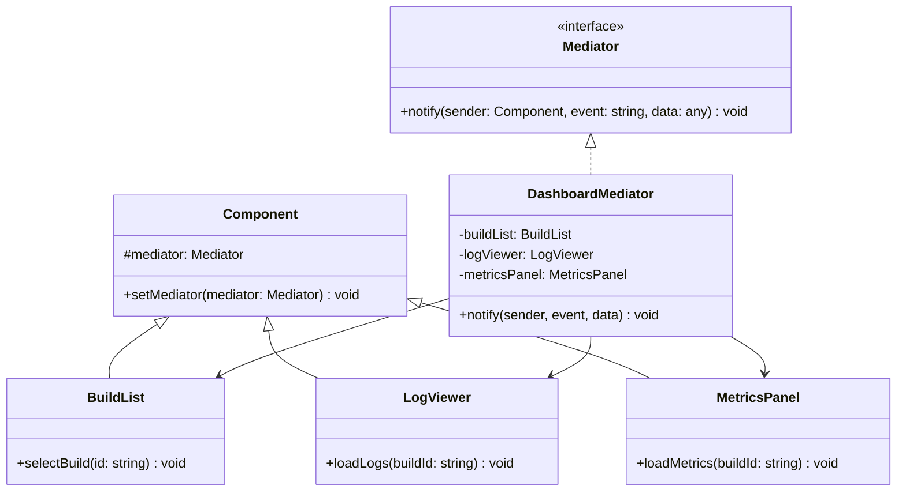

---
# Required
sidebar_position: 9
title: "Mediator Pattern — Centralized Communication Control"
description: >-
  Learn the Mediator pattern to reduce coupling between communicating objects.
  Essential for chat rooms, event buses, and complex UI coordination.

# SEO
keywords:
  - mediator pattern
  - mediator design pattern
  - event bus pattern
  - controller pattern
  - decoupling communication

difficulty: intermediate
category: behavioral
related_solid: [SRP, OCP]

# Social sharing
og_title: "Mediator Pattern: Centralized Communication Control"
og_description: "Reduce coupling by routing all communication through a central mediator."
og_image: "/img/social-card.svg"

# Content management
date_published: 2026-01-25
date_modified: 2026-01-25
author: shivam
reading_time: 12
content_type: explanation
---

# Mediator Pattern

<PatternMeta>
  <Difficulty level="intermediate" />
  <TimeToRead minutes={12} />
  <Prerequisites patterns={["Observer"]} />
</PatternMeta>

The dashboard with 15 interdependent components taught me why Mediator exists.

In 2020, our CI/CD platform at NVIDIA had a real-time dashboard where components interacted directly:

```python
class BuildList:
    def on_build_selected(self, build_id):
        self.log_viewer.load_logs(build_id)
        self.metrics_panel.load_metrics(build_id)
        self.artifact_browser.load_artifacts(build_id)
        self.status_bar.update(f"Viewing build {build_id}")
```

Every component knew about every other component. When we added a new component, we modified five existing ones. When we removed the artifact browser, we broke the build list. Testing required mocking dozens of dependencies.

**Here's what I learned: when components need to communicate but shouldn't know about each other, introduce a mediator.** Components talk to the mediator; the mediator coordinates.

```python
class BuildList:
    def on_build_selected(self, build_id):
        self.mediator.notify(self, "build_selected", build_id)

# Mediator handles the coordination
class DashboardMediator:
    def notify(self, sender, event, data):
        if event == "build_selected":
            self.log_viewer.load_logs(data)
            self.metrics_panel.load_metrics(data)
            # ... coordinate all components
```

Now components only know about the mediator. Add or remove components by modifying the mediator alone.

---

## What Is the Mediator Pattern?

> **Definition:** Mediator defines an object that encapsulates how a set of objects interact. It promotes loose coupling by keeping objects from referring to each other explicitly.

Instead of components communicating directly (n×n connections), they communicate through a mediator (n connections). The mediator knows the interaction rules; components just send events.

**The key insight: Mediator centralizes complex communication logic.** Components become simpler; the mediator handles coordination.

---

## Structure



### Key Components

| Component | Role |
|-----------|------|
| **Mediator Interface** | Declares the notification method |
| **Concrete Mediator** | Implements coordination logic |
| **Colleague/Component** | Objects that communicate via mediator |

---

## When to Use Mediator

✅ **Use it when:**

- Objects communicate in complex but well-defined ways
- Object reuse is difficult because of dependencies on many others
- A behavior distributed among several classes should be customizable without subclassing
- You're building a chat room, control tower, or event bus

❌ **Don't use it when:**

- Objects have simple, point-to-point communication
- The mediator would become a "god object" with too much logic
- Observer pattern is sufficient (one-to-many broadcast)

**Rule of thumb:** If you're drawing a web of arrows between components, a mediator can simplify it to a star topology.

---

## Implementation

<CodeTabs>
  <TabItem value="python" label="Python">
    ```python
    from abc import ABC, abstractmethod
    from typing import Any


    class Mediator(ABC):
        @abstractmethod
        def notify(self, sender: "Component", event: str, data: Any = None) -> None:
            pass


    class Component:
        def __init__(self) -> None:
            self._mediator: Mediator = None
        
        def set_mediator(self, mediator: Mediator) -> None:
            self._mediator = mediator


    class BuildList(Component):
        def __init__(self) -> None:
            super().__init__()
            self._selected_build: str = None
        
        def select_build(self, build_id: str) -> None:
            print(f"[BuildList] Selected build: {build_id}")
            self._selected_build = build_id
            self._mediator.notify(self, "build_selected", build_id)
        
        def refresh(self) -> None:
            print("[BuildList] Refreshing build list...")
            self._mediator.notify(self, "builds_refreshed")


    class LogViewer(Component):
        def load_logs(self, build_id: str) -> None:
            print(f"[LogViewer] Loading logs for build: {build_id}")
        
        def clear(self) -> None:
            print("[LogViewer] Cleared")


    class MetricsPanel(Component):
        def load_metrics(self, build_id: str) -> None:
            print(f"[MetricsPanel] Loading metrics for build: {build_id}")
        
        def clear(self) -> None:
            print("[MetricsPanel] Cleared")


    class StatusBar(Component):
        def update(self, message: str) -> None:
            print(f"[StatusBar] {message}")
        
        def show_error(self, error: str) -> None:
            print(f"[StatusBar] ERROR: {error}")
            self._mediator.notify(self, "error_shown", error)


    class FilterPanel(Component):
        def apply_filter(self, filter_type: str) -> None:
            print(f"[FilterPanel] Applying filter: {filter_type}")
            self._mediator.notify(self, "filter_applied", filter_type)


    class DashboardMediator(Mediator):
        """Coordinates all dashboard components."""
        
        def __init__(self) -> None:
            self.build_list = BuildList()
            self.log_viewer = LogViewer()
            self.metrics_panel = MetricsPanel()
            self.status_bar = StatusBar()
            self.filter_panel = FilterPanel()
            
            # Register all components with this mediator
            self.build_list.set_mediator(self)
            self.log_viewer.set_mediator(self)
            self.metrics_panel.set_mediator(self)
            self.status_bar.set_mediator(self)
            self.filter_panel.set_mediator(self)
        
        def notify(self, sender: Component, event: str, data: Any = None) -> None:
            if event == "build_selected":
                # When a build is selected, update all related panels
                self.log_viewer.load_logs(data)
                self.metrics_panel.load_metrics(data)
                self.status_bar.update(f"Viewing build: {data}")
            
            elif event == "builds_refreshed":
                # Clear all panels when list refreshes
                self.log_viewer.clear()
                self.metrics_panel.clear()
                self.status_bar.update("Build list refreshed")
            
            elif event == "filter_applied":
                # Refresh build list when filter changes
                self.build_list.refresh()
                self.status_bar.update(f"Filter applied: {data}")
            
            elif event == "error_shown":
                # Log errors
                print(f"[Mediator] Logging error: {data}")


    # Usage
    dashboard = DashboardMediator()

    print("=== User selects a build ===")
    dashboard.build_list.select_build("build-123")

    print("\n=== User applies a filter ===")
    dashboard.filter_panel.apply_filter("failed_only")

    print("\n=== User refreshes the list ===")
    dashboard.build_list.refresh()
    ```
  </TabItem>
  <TabItem value="typescript" label="TypeScript">
    ```typescript
    interface Mediator {
      notify(sender: Component, event: string, data?: unknown): void;
    }

    abstract class Component {
      protected mediator: Mediator | null = null;

      setMediator(mediator: Mediator): void {
        this.mediator = mediator;
      }
    }

    class BuildList extends Component {
      private selectedBuild: string | null = null;

      selectBuild(buildId: string): void {
        console.log(`[BuildList] Selected build: ${buildId}`);
        this.selectedBuild = buildId;
        this.mediator?.notify(this, "build_selected", buildId);
      }

      refresh(): void {
        console.log("[BuildList] Refreshing build list...");
        this.mediator?.notify(this, "builds_refreshed");
      }
    }

    class LogViewer extends Component {
      loadLogs(buildId: string): void {
        console.log(`[LogViewer] Loading logs for build: ${buildId}`);
      }

      clear(): void {
        console.log("[LogViewer] Cleared");
      }
    }

    class MetricsPanel extends Component {
      loadMetrics(buildId: string): void {
        console.log(`[MetricsPanel] Loading metrics for build: ${buildId}`);
      }

      clear(): void {
        console.log("[MetricsPanel] Cleared");
      }
    }

    class StatusBar extends Component {
      update(message: string): void {
        console.log(`[StatusBar] ${message}`);
      }

      showError(error: string): void {
        console.log(`[StatusBar] ERROR: ${error}`);
        this.mediator?.notify(this, "error_shown", error);
      }
    }

    class FilterPanel extends Component {
      applyFilter(filterType: string): void {
        console.log(`[FilterPanel] Applying filter: ${filterType}`);
        this.mediator?.notify(this, "filter_applied", filterType);
      }
    }

    class DashboardMediator implements Mediator {
      public buildList: BuildList;
      public logViewer: LogViewer;
      public metricsPanel: MetricsPanel;
      public statusBar: StatusBar;
      public filterPanel: FilterPanel;

      constructor() {
        this.buildList = new BuildList();
        this.logViewer = new LogViewer();
        this.metricsPanel = new MetricsPanel();
        this.statusBar = new StatusBar();
        this.filterPanel = new FilterPanel();

        this.buildList.setMediator(this);
        this.logViewer.setMediator(this);
        this.metricsPanel.setMediator(this);
        this.statusBar.setMediator(this);
        this.filterPanel.setMediator(this);
      }

      notify(sender: Component, event: string, data?: unknown): void {
        switch (event) {
          case "build_selected":
            this.logViewer.loadLogs(data as string);
            this.metricsPanel.loadMetrics(data as string);
            this.statusBar.update(`Viewing build: ${data}`);
            break;

          case "builds_refreshed":
            this.logViewer.clear();
            this.metricsPanel.clear();
            this.statusBar.update("Build list refreshed");
            break;

          case "filter_applied":
            this.buildList.refresh();
            this.statusBar.update(`Filter applied: ${data}`);
            break;

          case "error_shown":
            console.log(`[Mediator] Logging error: ${data}`);
            break;
        }
      }
    }

    // Usage
    const dashboard = new DashboardMediator();
    dashboard.buildList.selectBuild("build-123");
    dashboard.filterPanel.applyFilter("failed_only");
    ```
  </TabItem>
  <TabItem value="go" label="Go">
    ```go
    package mediator

    import "fmt"

    type Mediator interface {
        Notify(sender Component, event string, data interface{})
    }

    type Component interface {
        SetMediator(mediator Mediator)
    }

    type BaseComponent struct {
        mediator Mediator
    }

    func (c *BaseComponent) SetMediator(mediator Mediator) {
        c.mediator = mediator
    }

    // BuildList component
    type BuildList struct {
        BaseComponent
        selectedBuild string
    }

    func (b *BuildList) SelectBuild(buildID string) {
        fmt.Printf("[BuildList] Selected build: %s\n", buildID)
        b.selectedBuild = buildID
        b.mediator.Notify(b, "build_selected", buildID)
    }

    func (b *BuildList) Refresh() {
        fmt.Println("[BuildList] Refreshing build list...")
        b.mediator.Notify(b, "builds_refreshed", nil)
    }

    // LogViewer component
    type LogViewer struct {
        BaseComponent
    }

    func (l *LogViewer) LoadLogs(buildID string) {
        fmt.Printf("[LogViewer] Loading logs for build: %s\n", buildID)
    }

    func (l *LogViewer) Clear() {
        fmt.Println("[LogViewer] Cleared")
    }

    // MetricsPanel component
    type MetricsPanel struct {
        BaseComponent
    }

    func (m *MetricsPanel) LoadMetrics(buildID string) {
        fmt.Printf("[MetricsPanel] Loading metrics for build: %s\n", buildID)
    }

    func (m *MetricsPanel) Clear() {
        fmt.Println("[MetricsPanel] Cleared")
    }

    // StatusBar component
    type StatusBar struct {
        BaseComponent
    }

    func (s *StatusBar) Update(message string) {
        fmt.Printf("[StatusBar] %s\n", message)
    }

    // DashboardMediator
    type DashboardMediator struct {
        BuildList    *BuildList
        LogViewer    *LogViewer
        MetricsPanel *MetricsPanel
        StatusBar    *StatusBar
    }

    func NewDashboardMediator() *DashboardMediator {
        m := &DashboardMediator{
            BuildList:    &BuildList{},
            LogViewer:    &LogViewer{},
            MetricsPanel: &MetricsPanel{},
            StatusBar:    &StatusBar{},
        }

        m.BuildList.SetMediator(m)
        m.LogViewer.SetMediator(m)
        m.MetricsPanel.SetMediator(m)
        m.StatusBar.SetMediator(m)

        return m
    }

    func (m *DashboardMediator) Notify(sender Component, event string, data interface{}) {
        switch event {
        case "build_selected":
            buildID := data.(string)
            m.LogViewer.LoadLogs(buildID)
            m.MetricsPanel.LoadMetrics(buildID)
            m.StatusBar.Update(fmt.Sprintf("Viewing build: %s", buildID))

        case "builds_refreshed":
            m.LogViewer.Clear()
            m.MetricsPanel.Clear()
            m.StatusBar.Update("Build list refreshed")
        }
    }
    ```
  </TabItem>
  <TabItem value="java" label="Java">
    ```java
    interface Mediator {
        void notify(Component sender, String event, Object data);
    }

    abstract class Component {
        protected Mediator mediator;

        public void setMediator(Mediator mediator) {
            this.mediator = mediator;
        }
    }

    class BuildList extends Component {
        private String selectedBuild;

        public void selectBuild(String buildId) {
            System.out.printf("[BuildList] Selected build: %s%n", buildId);
            this.selectedBuild = buildId;
            mediator.notify(this, "build_selected", buildId);
        }

        public void refresh() {
            System.out.println("[BuildList] Refreshing build list...");
            mediator.notify(this, "builds_refreshed", null);
        }
    }

    class LogViewer extends Component {
        public void loadLogs(String buildId) {
            System.out.printf("[LogViewer] Loading logs for build: %s%n", buildId);
        }

        public void clear() {
            System.out.println("[LogViewer] Cleared");
        }
    }

    class MetricsPanel extends Component {
        public void loadMetrics(String buildId) {
            System.out.printf("[MetricsPanel] Loading metrics for build: %s%n", buildId);
        }

        public void clear() {
            System.out.println("[MetricsPanel] Cleared");
        }
    }

    class StatusBar extends Component {
        public void update(String message) {
            System.out.printf("[StatusBar] %s%n", message);
        }
    }

    class DashboardMediator implements Mediator {
        public final BuildList buildList = new BuildList();
        public final LogViewer logViewer = new LogViewer();
        public final MetricsPanel metricsPanel = new MetricsPanel();
        public final StatusBar statusBar = new StatusBar();

        public DashboardMediator() {
            buildList.setMediator(this);
            logViewer.setMediator(this);
            metricsPanel.setMediator(this);
            statusBar.setMediator(this);
        }

        @Override
        public void notify(Component sender, String event, Object data) {
            switch (event) {
                case "build_selected" -> {
                    String buildId = (String) data;
                    logViewer.loadLogs(buildId);
                    metricsPanel.loadMetrics(buildId);
                    statusBar.update("Viewing build: " + buildId);
                }
                case "builds_refreshed" -> {
                    logViewer.clear();
                    metricsPanel.clear();
                    statusBar.update("Build list refreshed");
                }
            }
        }
    }
    ```
  </TabItem>
  <TabItem value="csharp" label="C#">
    ```csharp
    public interface IMediator
    {
        void Notify(Component sender, string eventName, object? data = null);
    }

    public abstract class Component
    {
        protected IMediator? Mediator;

        public void SetMediator(IMediator mediator) => Mediator = mediator;
    }

    public class BuildList : Component
    {
        private string? _selectedBuild;

        public void SelectBuild(string buildId)
        {
            Console.WriteLine($"[BuildList] Selected build: {buildId}");
            _selectedBuild = buildId;
            Mediator?.Notify(this, "build_selected", buildId);
        }

        public void Refresh()
        {
            Console.WriteLine("[BuildList] Refreshing build list...");
            Mediator?.Notify(this, "builds_refreshed");
        }
    }

    public class LogViewer : Component
    {
        public void LoadLogs(string buildId)
        {
            Console.WriteLine($"[LogViewer] Loading logs for build: {buildId}");
        }

        public void Clear() => Console.WriteLine("[LogViewer] Cleared");
    }

    public class MetricsPanel : Component
    {
        public void LoadMetrics(string buildId)
        {
            Console.WriteLine($"[MetricsPanel] Loading metrics for build: {buildId}");
        }

        public void Clear() => Console.WriteLine("[MetricsPanel] Cleared");
    }

    public class StatusBar : Component
    {
        public void Update(string message) => Console.WriteLine($"[StatusBar] {message}");
    }

    public class DashboardMediator : IMediator
    {
        public BuildList BuildList { get; } = new();
        public LogViewer LogViewer { get; } = new();
        public MetricsPanel MetricsPanel { get; } = new();
        public StatusBar StatusBar { get; } = new();

        public DashboardMediator()
        {
            BuildList.SetMediator(this);
            LogViewer.SetMediator(this);
            MetricsPanel.SetMediator(this);
            StatusBar.SetMediator(this);
        }

        public void Notify(Component sender, string eventName, object? data = null)
        {
            switch (eventName)
            {
                case "build_selected":
                    var buildId = (string)data!;
                    LogViewer.LoadLogs(buildId);
                    MetricsPanel.LoadMetrics(buildId);
                    StatusBar.Update($"Viewing build: {buildId}");
                    break;

                case "builds_refreshed":
                    LogViewer.Clear();
                    MetricsPanel.Clear();
                    StatusBar.Update("Build list refreshed");
                    break;
            }
        }
    }
    ```
  </TabItem>
</CodeTabs>

---

## Mediator vs. Observer

Both handle communication between objects, but differently:

| Aspect | Mediator | Observer |
|--------|----------|----------|
| **Direction** | Bidirectional coordination | One-to-many broadcast |
| **Knowledge** | Mediator knows all colleagues | Subject doesn't know observers |
| **Purpose** | Complex interaction rules | Simple event notification |
| **Example** | Chat room | Event emitter |

---

## Common Mistakes

### 1. Mediator becomes a god object

```python
# Bad: mediator does too much
class GodMediator:
    def notify(self, sender, event, data):
        # 500 lines of business logic
        # Validation, persistence, calculations...
```

The mediator should coordinate, not implement business logic.

### 2. Components that bypass the mediator

```python
# Bad: direct communication defeats the purpose
class BuildList:
    def select_build(self, build_id):
        self.log_viewer.load_logs(build_id)  # Direct call!
```

All communication must go through the mediator.

---

## Key Takeaways

- **Mediator centralizes communication.** Components don't know about each other.

- **It simplifies n×n to n connections.** Star topology instead of mesh.

- **Watch for god object anti-pattern.** Mediator should coordinate, not implement.

- **Use for complex component interaction.** For simple events, Observer might suffice.

---

## Navigation

- **Previous:** [Chain of Responsibility Pattern](/docs/design-patterns/behavioral/chain-of-responsibility)
- **Next:** [Memento Pattern](/docs/design-patterns/behavioral/memento)
