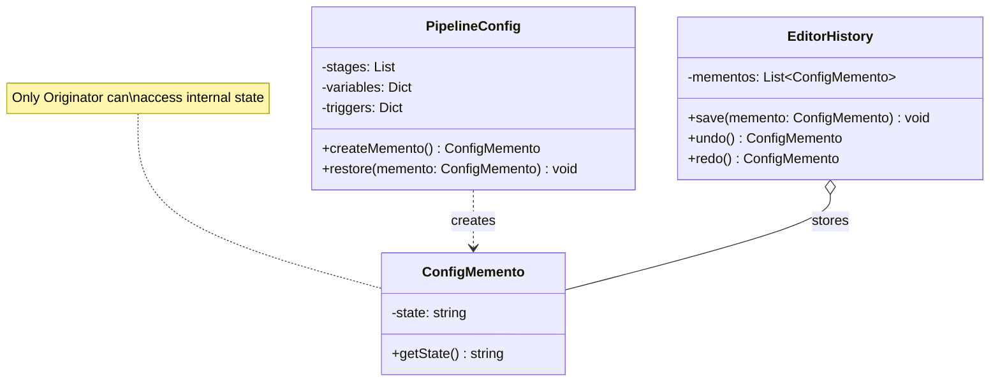

---
# Required
sidebar_position: 10
title: "Memento Pattern — Capturing and Restoring Object State"
description: >-
  Learn the Memento pattern to save and restore object state without violating
  encapsulation. Essential for undo/redo, checkpoints, and transactions.

# SEO
keywords:
  - memento pattern
  - memento design pattern
  - snapshot pattern
  - undo redo implementation
  - state restoration

difficulty: intermediate
category: behavioral
related_solid: [SRP]

# Social sharing
og_title: "Memento Pattern: Capturing and Restoring Object State"
og_description: "Save and restore object state without breaking encapsulation."
og_image: "/img/social-card.svg"

# Content management
date_published: 2026-01-25
date_modified: 2026-01-25
author: shivam
reading_time: 12
content_type: explanation
---

# Memento Pattern

<PatternMeta>
  <Difficulty level="intermediate" />
  <TimeToRead minutes={12} />
  <Prerequisites patterns={["Command"]} />
</PatternMeta>

The configuration editor that couldn't undo changes taught me why Memento exists.

In 2020, our CI/CD platform at NVIDIA had a pipeline configuration editor. Users could modify complex YAML configurations, but there was no undo. One wrong change could break a pipeline, and the only recovery was to manually reconstruct the previous state.

The naive solution was to save the entire configuration before each change:

```python
class PipelineEditor:
    def save_for_undo(self):
        self.history.append(copy.deepcopy(self.config))  # Exposes internal state
```

But this exposed the internal structure of the configuration. When we changed how configs were stored internally, the undo history broke. External code could modify saved states. The configuration object had no control over what was saved or restored.

**Here's what I learned: when you need to save and restore state without exposing internal structure, let the object create its own snapshots.** That's Memento.

```python
class PipelineConfig:
    def create_memento(self) -> ConfigMemento:
        return ConfigMemento(self._serialize_state())
    
    def restore(self, memento: ConfigMemento) -> None:
        self._deserialize_state(memento.get_state())
```

The config controls what goes into the snapshot. External code can't peek inside.

---

## What Is the Memento Pattern?

> **Definition:** Memento captures and externalizes an object's internal state without violating encapsulation, so the object can be restored to this state later.

The key participants:
- **Originator:** The object whose state we want to save
- **Memento:** The snapshot of the originator's state
- **Caretaker:** Manages mementos (but can't peek inside them)

**The key insight: Memento lets you undo without exposing internals.** The originator decides what state to save; the caretaker just holds mementos.

---

## Structure



### Key Components

| Component | Role |
|-----------|------|
| **Originator** (`PipelineConfig`) | Creates mementos; restores from mementos |
| **Memento** (`ConfigMemento`) | Stores originator's state; opaque to others |
| **Caretaker** (`EditorHistory`) | Stores and retrieves mementos; can't modify them |

---

## When to Use Memento

✅ **Use it when:**

- You need to save snapshots of an object's state for undo/redo
- Direct access to the object's fields would violate encapsulation
- You need checkpoints or transaction rollback
- You want to implement game save states

❌ **Don't use it when:**

- The state is simple and can be easily reconstructed
- Memory is limited and states are large
- You can use simpler approaches (like copying primitives)
- State changes are infrequent

**Rule of thumb:** If you're implementing undo/redo and the object's state is non-trivial, Memento is likely the right choice.

---

## Implementation

<CodeTabs>
  <TabItem value="python" label="Python">
    ```python
    from dataclasses import dataclass, field
    from typing import Any
    import json
    import copy


    class ConfigMemento:
        """Stores a snapshot of PipelineConfig state."""
        
        def __init__(self, state: str) -> None:
            self._state = state
            self._timestamp = __import__('datetime').datetime.now()
        
        def get_state(self) -> str:
            """Only Originator should call this."""
            return self._state
        
        @property
        def timestamp(self) -> str:
            return self._timestamp.isoformat()


    @dataclass
    class Stage:
        name: str
        image: str
        commands: list[str]


    class PipelineConfig:
        """Originator - the object whose state we save."""
        
        def __init__(self, name: str) -> None:
            self.name = name
            self._stages: list[Stage] = []
            self._variables: dict[str, str] = {}
            self._triggers: dict[str, Any] = {}
        
        def add_stage(self, name: str, image: str, commands: list[str]) -> None:
            self._stages.append(Stage(name, image, commands))
            print(f"Added stage: {name}")
        
        def remove_stage(self, name: str) -> None:
            self._stages = [s for s in self._stages if s.name != name]
            print(f"Removed stage: {name}")
        
        def set_variable(self, key: str, value: str) -> None:
            self._variables[key] = value
            print(f"Set variable: {key}={value}")
        
        def set_trigger(self, trigger_type: str, config: dict) -> None:
            self._triggers[trigger_type] = config
            print(f"Set trigger: {trigger_type}")
        
        def create_memento(self) -> ConfigMemento:
            """Create a snapshot of current state."""
            state = {
                "name": self.name,
                "stages": [
                    {"name": s.name, "image": s.image, "commands": s.commands}
                    for s in self._stages
                ],
                "variables": copy.deepcopy(self._variables),
                "triggers": copy.deepcopy(self._triggers),
            }
            return ConfigMemento(json.dumps(state))
        
        def restore(self, memento: ConfigMemento) -> None:
            """Restore state from a memento."""
            state = json.loads(memento.get_state())
            self.name = state["name"]
            self._stages = [
                Stage(s["name"], s["image"], s["commands"])
                for s in state["stages"]
            ]
            self._variables = state["variables"]
            self._triggers = state["triggers"]
            print(f"Restored config to: {memento.timestamp}")
        
        def __str__(self) -> str:
            stages = ", ".join(s.name for s in self._stages)
            return f"PipelineConfig({self.name}, stages=[{stages}], vars={len(self._variables)})"


    class EditorHistory:
        """Caretaker - manages mementos without accessing their contents."""
        
        def __init__(self, originator: PipelineConfig) -> None:
            self._originator = originator
            self._history: list[ConfigMemento] = []
            self._current_index = -1
        
        def save(self) -> None:
            """Save current state to history."""
            # Remove any redo history when new change is made
            self._history = self._history[:self._current_index + 1]
            memento = self._originator.create_memento()
            self._history.append(memento)
            self._current_index += 1
            print(f"Saved state #{self._current_index}")
        
        def undo(self) -> bool:
            """Restore previous state."""
            if self._current_index <= 0:
                print("Nothing to undo")
                return False
            
            self._current_index -= 1
            self._originator.restore(self._history[self._current_index])
            return True
        
        def redo(self) -> bool:
            """Restore next state."""
            if self._current_index >= len(self._history) - 1:
                print("Nothing to redo")
                return False
            
            self._current_index += 1
            self._originator.restore(self._history[self._current_index])
            return True
        
        def show_history(self) -> None:
            """Display all saved states."""
            print(f"History ({len(self._history)} states, current: {self._current_index}):")
            for i, m in enumerate(self._history):
                marker = " <-- current" if i == self._current_index else ""
                print(f"  [{i}] {m.timestamp}{marker}")


    # Usage
    config = PipelineConfig("build-pipeline")
    history = EditorHistory(config)

    # Save initial state
    history.save()

    # Make changes
    config.add_stage("build", "node:18", ["npm install", "npm build"])
    history.save()

    config.add_stage("test", "node:18", ["npm test"])
    history.save()

    config.set_variable("NODE_ENV", "production")
    history.save()

    print(f"\nCurrent: {config}")
    history.show_history()

    # Undo changes
    print("\n=== Undoing ===")
    history.undo()
    print(f"After undo: {config}")

    history.undo()
    print(f"After undo: {config}")

    # Redo
    print("\n=== Redoing ===")
    history.redo()
    print(f"After redo: {config}")
    ```
  </TabItem>
  <TabItem value="typescript" label="TypeScript">
    ```typescript
    class ConfigMemento {
      private readonly state: string;
      private readonly timestamp: Date;

      constructor(state: string) {
        this.state = state;
        this.timestamp = new Date();
      }

      getState(): string {
        return this.state;
      }

      getTimestamp(): string {
        return this.timestamp.toISOString();
      }
    }

    interface Stage {
      name: string;
      image: string;
      commands: string[];
    }

    class PipelineConfig {
      private stages: Stage[] = [];
      private variables: Map<string, string> = new Map();
      private triggers: Map<string, unknown> = new Map();

      constructor(public name: string) {}

      addStage(name: string, image: string, commands: string[]): void {
        this.stages.push({ name, image, commands });
        console.log(`Added stage: ${name}`);
      }

      removeStage(name: string): void {
        this.stages = this.stages.filter((s) => s.name !== name);
        console.log(`Removed stage: ${name}`);
      }

      setVariable(key: string, value: string): void {
        this.variables.set(key, value);
        console.log(`Set variable: ${key}=${value}`);
      }

      createMemento(): ConfigMemento {
        const state = {
          name: this.name,
          stages: [...this.stages],
          variables: Object.fromEntries(this.variables),
          triggers: Object.fromEntries(this.triggers),
        };
        return new ConfigMemento(JSON.stringify(state));
      }

      restore(memento: ConfigMemento): void {
        const state = JSON.parse(memento.getState());
        this.name = state.name;
        this.stages = state.stages;
        this.variables = new Map(Object.entries(state.variables));
        this.triggers = new Map(Object.entries(state.triggers));
        console.log(`Restored config to: ${memento.getTimestamp()}`);
      }

      toString(): string {
        const stages = this.stages.map((s) => s.name).join(", ");
        return `PipelineConfig(${this.name}, stages=[${stages}])`;
      }
    }

    class EditorHistory {
      private history: ConfigMemento[] = [];
      private currentIndex = -1;

      constructor(private originator: PipelineConfig) {}

      save(): void {
        this.history = this.history.slice(0, this.currentIndex + 1);
        const memento = this.originator.createMemento();
        this.history.push(memento);
        this.currentIndex++;
        console.log(`Saved state #${this.currentIndex}`);
      }

      undo(): boolean {
        if (this.currentIndex <= 0) {
          console.log("Nothing to undo");
          return false;
        }

        this.currentIndex--;
        this.originator.restore(this.history[this.currentIndex]);
        return true;
      }

      redo(): boolean {
        if (this.currentIndex >= this.history.length - 1) {
          console.log("Nothing to redo");
          return false;
        }

        this.currentIndex++;
        this.originator.restore(this.history[this.currentIndex]);
        return true;
      }
    }

    // Usage
    const config = new PipelineConfig("build-pipeline");
    const history = new EditorHistory(config);

    history.save();
    config.addStage("build", "node:18", ["npm install"]);
    history.save();
    config.addStage("test", "node:18", ["npm test"]);
    history.save();

    console.log(`\nCurrent: ${config}`);

    history.undo();
    console.log(`After undo: ${config}`);

    history.redo();
    console.log(`After redo: ${config}`);
    ```
  </TabItem>
  <TabItem value="go" label="Go">
    ```go
    package memento

    import (
        "encoding/json"
        "fmt"
        "time"
    )

    // ConfigMemento stores a snapshot of PipelineConfig state
    type ConfigMemento struct {
        state     string
        timestamp time.Time
    }

    func newConfigMemento(state string) *ConfigMemento {
        return &ConfigMemento{
            state:     state,
            timestamp: time.Now(),
        }
    }

    func (m *ConfigMemento) GetState() string {
        return m.state
    }

    func (m *ConfigMemento) Timestamp() string {
        return m.timestamp.Format(time.RFC3339)
    }

    // Stage represents a pipeline stage
    type Stage struct {
        Name     string   `json:"name"`
        Image    string   `json:"image"`
        Commands []string `json:"commands"`
    }

    // PipelineConfig is the Originator
    type PipelineConfig struct {
        Name      string            `json:"name"`
        Stages    []Stage           `json:"stages"`
        Variables map[string]string `json:"variables"`
    }

    func NewPipelineConfig(name string) *PipelineConfig {
        return &PipelineConfig{
            Name:      name,
            Stages:    []Stage{},
            Variables: make(map[string]string),
        }
    }

    func (p *PipelineConfig) AddStage(name, image string, commands []string) {
        p.Stages = append(p.Stages, Stage{name, image, commands})
        fmt.Printf("Added stage: %s\n", name)
    }

    func (p *PipelineConfig) SetVariable(key, value string) {
        p.Variables[key] = value
        fmt.Printf("Set variable: %s=%s\n", key, value)
    }

    func (p *PipelineConfig) CreateMemento() *ConfigMemento {
        data, _ := json.Marshal(p)
        return newConfigMemento(string(data))
    }

    func (p *PipelineConfig) Restore(memento *ConfigMemento) {
        json.Unmarshal([]byte(memento.GetState()), p)
        fmt.Printf("Restored config to: %s\n", memento.Timestamp())
    }

    func (p *PipelineConfig) String() string {
        names := make([]string, len(p.Stages))
        for i, s := range p.Stages {
            names[i] = s.Name
        }
        return fmt.Sprintf("PipelineConfig(%s, stages=%v)", p.Name, names)
    }

    // EditorHistory is the Caretaker
    type EditorHistory struct {
        originator   *PipelineConfig
        history      []*ConfigMemento
        currentIndex int
    }

    func NewEditorHistory(originator *PipelineConfig) *EditorHistory {
        return &EditorHistory{
            originator:   originator,
            history:      []*ConfigMemento{},
            currentIndex: -1,
        }
    }

    func (h *EditorHistory) Save() {
        h.history = h.history[:h.currentIndex+1]
        memento := h.originator.CreateMemento()
        h.history = append(h.history, memento)
        h.currentIndex++
        fmt.Printf("Saved state #%d\n", h.currentIndex)
    }

    func (h *EditorHistory) Undo() bool {
        if h.currentIndex <= 0 {
            fmt.Println("Nothing to undo")
            return false
        }
        h.currentIndex--
        h.originator.Restore(h.history[h.currentIndex])
        return true
    }

    func (h *EditorHistory) Redo() bool {
        if h.currentIndex >= len(h.history)-1 {
            fmt.Println("Nothing to redo")
            return false
        }
        h.currentIndex++
        h.originator.Restore(h.history[h.currentIndex])
        return true
    }
    ```
  </TabItem>
  <TabItem value="java" label="Java">
    ```java
    import java.time.*;
    import java.util.*;

    record ConfigMemento(String state, Instant timestamp) {
        ConfigMemento(String state) {
            this(state, Instant.now());
        }
    }

    record Stage(String name, String image, List<String> commands) {}

    class PipelineConfig {
        private String name;
        private List<Stage> stages = new ArrayList<>();
        private Map<String, String> variables = new HashMap<>();

        public PipelineConfig(String name) {
            this.name = name;
        }

        public void addStage(String name, String image, List<String> commands) {
            stages.add(new Stage(name, image, commands));
            System.out.printf("Added stage: %s%n", name);
        }

        public void setVariable(String key, String value) {
            variables.put(key, value);
            System.out.printf("Set variable: %s=%s%n", key, value);
        }

        public ConfigMemento createMemento() {
            // Serialize state (simplified - use proper JSON in production)
            var state = String.format("{name:%s,stages:%s,vars:%s}", 
                name, stages, variables);
            return new ConfigMemento(state);
        }

        public void restore(ConfigMemento memento) {
            // Deserialize state (simplified)
            System.out.printf("Restored config to: %s%n", memento.timestamp());
        }

        @Override
        public String toString() {
            var stageNames = stages.stream().map(Stage::name).toList();
            return String.format("PipelineConfig(%s, stages=%s)", name, stageNames);
        }
    }

    class EditorHistory {
        private final PipelineConfig originator;
        private final List<ConfigMemento> history = new ArrayList<>();
        private int currentIndex = -1;

        public EditorHistory(PipelineConfig originator) {
            this.originator = originator;
        }

        public void save() {
            // Remove redo history
            while (history.size() > currentIndex + 1) {
                history.remove(history.size() - 1);
            }
            history.add(originator.createMemento());
            currentIndex++;
            System.out.printf("Saved state #%d%n", currentIndex);
        }

        public boolean undo() {
            if (currentIndex <= 0) {
                System.out.println("Nothing to undo");
                return false;
            }
            currentIndex--;
            originator.restore(history.get(currentIndex));
            return true;
        }

        public boolean redo() {
            if (currentIndex >= history.size() - 1) {
                System.out.println("Nothing to redo");
                return false;
            }
            currentIndex++;
            originator.restore(history.get(currentIndex));
            return true;
        }
    }
    ```
  </TabItem>
  <TabItem value="csharp" label="C#">
    ```csharp
    public record ConfigMemento(string State, DateTime Timestamp)
    {
        public ConfigMemento(string state) : this(state, DateTime.Now) { }
    }

    public record Stage(string Name, string Image, List<string> Commands);

    public class PipelineConfig
    {
        public string Name { get; private set; }
        private List<Stage> _stages = new();
        private Dictionary<string, string> _variables = new();

        public PipelineConfig(string name) => Name = name;

        public void AddStage(string name, string image, List<string> commands)
        {
            _stages.Add(new Stage(name, image, commands));
            Console.WriteLine($"Added stage: {name}");
        }

        public void SetVariable(string key, string value)
        {
            _variables[key] = value;
            Console.WriteLine($"Set variable: {key}={value}");
        }

        public ConfigMemento CreateMemento()
        {
            var state = System.Text.Json.JsonSerializer.Serialize(new
            {
                Name,
                Stages = _stages,
                Variables = _variables
            });
            return new ConfigMemento(state);
        }

        public void Restore(ConfigMemento memento)
        {
            var state = System.Text.Json.JsonDocument.Parse(memento.State);
            Name = state.RootElement.GetProperty("Name").GetString()!;
            // Deserialize other properties...
            Console.WriteLine($"Restored config to: {memento.Timestamp}");
        }

        public override string ToString()
        {
            var stages = string.Join(", ", _stages.Select(s => s.Name));
            return $"PipelineConfig({Name}, stages=[{stages}])";
        }
    }

    public class EditorHistory
    {
        private readonly PipelineConfig _originator;
        private readonly List<ConfigMemento> _history = new();
        private int _currentIndex = -1;

        public EditorHistory(PipelineConfig originator) => _originator = originator;

        public void Save()
        {
            _history.RemoveRange(_currentIndex + 1, _history.Count - _currentIndex - 1);
            _history.Add(_originator.CreateMemento());
            _currentIndex++;
            Console.WriteLine($"Saved state #{_currentIndex}");
        }

        public bool Undo()
        {
            if (_currentIndex <= 0)
            {
                Console.WriteLine("Nothing to undo");
                return false;
            }
            _currentIndex--;
            _originator.Restore(_history[_currentIndex]);
            return true;
        }

        public bool Redo()
        {
            if (_currentIndex >= _history.Count - 1)
            {
                Console.WriteLine("Nothing to redo");
                return false;
            }
            _currentIndex++;
            _originator.Restore(_history[_currentIndex]);
            return true;
        }
    }
    ```
  </TabItem>
</CodeTabs>

---

## Memento vs. Command for Undo

Both can implement undo, but they work differently:

| Aspect | Memento | Command |
|--------|---------|---------|
| **What's stored** | Object state snapshots | Operations with inverse |
| **Memory usage** | Higher (full state each time) | Lower (just the operation) |
| **Complexity** | Simpler to implement | Requires inverse operations |
| **Best for** | Complex state, simple operations | Simple state, complex operations |

**Use Memento** when state is complex but operations are simple.
**Use Command** when operations are complex but state changes are simple.

---

## Common Mistakes

### 1. Caretaker accessing memento internals

```python
# Bad: caretaker peeks inside memento
class BadHistory:
    def show_details(self, memento):
        state = json.loads(memento.get_state())  # Breaking encapsulation!
        print(state["stages"])
```

Only the originator should access memento internals.

### 2. Storing mementos forever

```python
# Bad: unbounded history
class BadHistory:
    def save(self, memento):
        self.history.append(memento)  # Memory leak!
```

Limit history size or implement cleanup.

---

## Key Takeaways

- **Memento saves state without exposing internals.** The originator controls what's saved.

- **Caretaker stores mementos but can't access them.** It just holds opaque snapshots.

- **Watch memory usage.** Full state snapshots can be expensive.

- **Combine with Command for sophisticated undo.** Commands for operations, mementos for complex state.

---

## Navigation

- **Previous:** [Mediator Pattern](/docs/design-patterns/behavioral/mediator)
- **Next:** [Visitor Pattern](/docs/design-patterns/behavioral/visitor)
