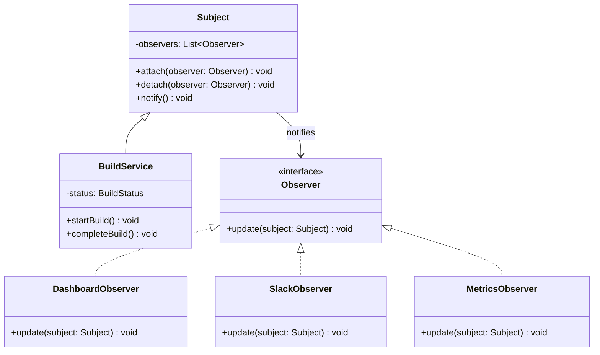
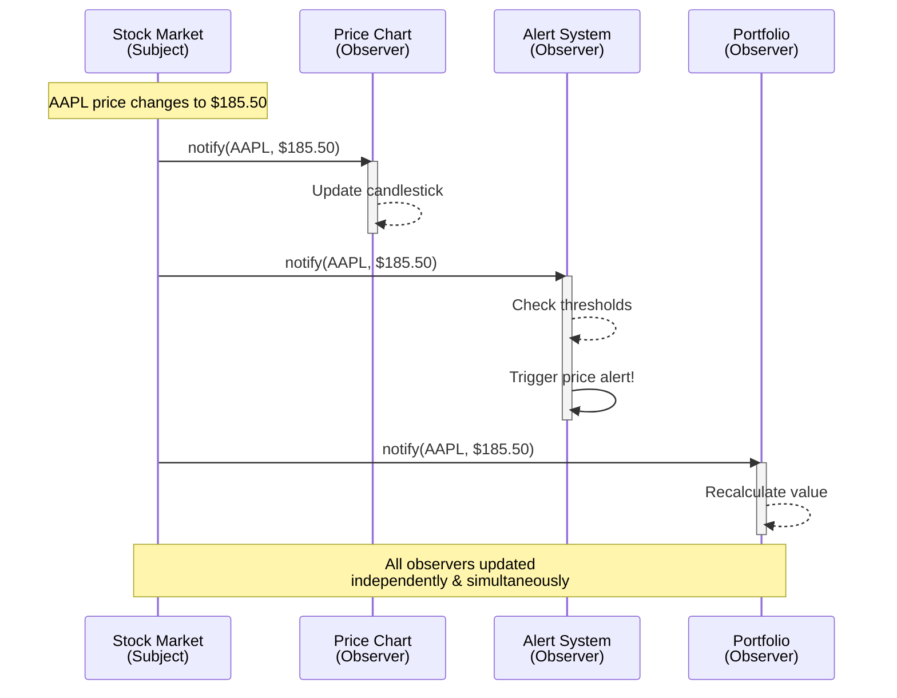

---
# Required
sidebar_position: 3
title: "Observer Pattern — Event-Driven Object Communication"
description: >-
  Learn the Observer pattern to notify multiple objects when state changes.
  Essential for event systems, pub/sub, and reactive programming.

# SEO
keywords:
  - observer pattern
  - observer design pattern
  - pub sub pattern
  - event pattern
  - event-driven architecture
  - publish subscribe

difficulty: beginner
category: behavioral
related_solid: [OCP, DIP]

# Social sharing
og_title: "Observer Pattern: Event-Driven Object Communication"
og_description: "Notify multiple objects when state changes—the foundation of reactive systems."
og_image: "/img/social-card.svg"

# Content management
date_published: 2026-01-25
date_modified: 2026-01-25
author: shivam
reading_time: 16
content_type: explanation
---

# Observer Pattern

<PatternMeta>
  <Difficulty level="beginner" />
  <TimeToRead minutes={16} />
  <Prerequisites patterns={[]} />
</PatternMeta>

The dashboard that couldn't keep up taught me why Observer exists.

In 2019, our CI/CD platform at NVIDIA had a real-time dashboard showing build status across thousands of pipelines. The initial implementation polled the database every five seconds. It worked, until it didn't:

```python
# Every 5 seconds, for every connected dashboard
while True:
    builds = database.query("SELECT * FROM builds WHERE updated > ?", last_check)
    for build in builds:
        send_to_dashboard(build)
    time.sleep(5)
```

With 200 concurrent dashboards and 50,000 active builds, we were hammering the database with queries that returned mostly empty results. The dashboard lagged. The database struggled. Users complained that builds showed "Running" for minutes after completion.

The fix wasn't polling harder—it was inverting the communication. **Instead of dashboards asking "what changed?", builds should announce "I changed."** That's the Observer pattern.

```python
# Build service announces changes
build_events.publish("build.completed", build)

# Dashboards listen for announcements
build_events.subscribe("build.completed", dashboard.on_build_update)
```

One database write, one event, instant updates to 200 dashboards. The database load dropped 90%. Dashboard latency went from seconds to milliseconds.

---

## What Is the Observer Pattern?

> **Definition:** Observer defines a one-to-many dependency between objects so that when one object changes state, all its dependents are notified and updated automatically.

The object being watched is called the **Subject** (or Publisher). The objects watching are called **Observers** (or Subscribers). When the subject's state changes, it notifies all observers.

**The key insight: Observer decouples the thing that changes from the things that care about the change.** The subject doesn't need to know who's observing or what they do with the notification.

---

## Structure



### Key Components

| Component | Role |
|-----------|------|
| **Subject** | Maintains list of observers and notifies them of changes |
| **Observer Interface** | Declares the update method that subjects call |
| **Concrete Observers** | Implement update to react to subject changes |
| **Concrete Subject** | Stores state and notifies observers when it changes |

### SOLID Principles Connection

- **Open/Closed:** Add new observers without modifying the subject
- **Dependency Inversion:** Subject depends on Observer abstraction, not concrete observers

---

## When to Use Observer

✅ **Use it when:**

- Changes to one object require changing others, and you don't know how many
- An object should notify other objects without knowing who they are
- You need loose coupling between interacting objects
- You're building event-driven or reactive systems
- Multiple views need to reflect the same data

❌ **Don't use it when:**

- The relationship is truly one-to-one (just call a method)
- Observers need to affect the subject (use Mediator instead)
- Order of notification matters (Observer doesn't guarantee order)
- You need synchronous request-response (Observer is fire-and-forget)

**Rule of thumb:** If you find yourself maintaining a list of "things to notify" that changes at runtime, Observer is probably the answer.

---

## Implementation

<CodeTabs>
  <TabItem value="python" label="Python">
    ```python
    from abc import ABC, abstractmethod
    from dataclasses import dataclass, field
    from enum import Enum
    from typing import Callable


    class BuildStatus(Enum):
        PENDING = "pending"
        RUNNING = "running"
        SUCCESS = "success"
        FAILED = "failed"


    @dataclass
    class BuildEvent:
        build_id: str
        status: BuildStatus
        message: str


    class Observer(ABC):
        @abstractmethod
        def update(self, event: BuildEvent) -> None:
            pass


    class Subject(ABC):
        def __init__(self) -> None:
            self._observers: list[Observer] = []
        
        def attach(self, observer: Observer) -> None:
            if observer not in self._observers:
                self._observers.append(observer)
        
        def detach(self, observer: Observer) -> None:
            self._observers.remove(observer)
        
        def notify(self, event: BuildEvent) -> None:
            for observer in self._observers:
                observer.update(event)


    class BuildService(Subject):
        def start_build(self, build_id: str) -> None:
            print(f"Starting build {build_id}")
            event = BuildEvent(build_id, BuildStatus.RUNNING, "Build started")
            self.notify(event)
        
        def complete_build(self, build_id: str, success: bool) -> None:
            status = BuildStatus.SUCCESS if success else BuildStatus.FAILED
            message = "Build succeeded" if success else "Build failed"
            print(f"Build {build_id}: {message}")
            event = BuildEvent(build_id, status, message)
            self.notify(event)


    class DashboardObserver(Observer):
        def __init__(self, dashboard_id: str) -> None:
            self.dashboard_id = dashboard_id
        
        def update(self, event: BuildEvent) -> None:
            print(f"[Dashboard {self.dashboard_id}] Build {event.build_id}: {event.status.value}")


    class SlackObserver(Observer):
        def __init__(self, channel: str) -> None:
            self.channel = channel
        
        def update(self, event: BuildEvent) -> None:
            if event.status in (BuildStatus.SUCCESS, BuildStatus.FAILED):
                print(f"[Slack #{self.channel}] {event.message}: {event.build_id}")


    class MetricsObserver(Observer):
        def __init__(self) -> None:
            self.counts: dict[BuildStatus, int] = {s: 0 for s in BuildStatus}
        
        def update(self, event: BuildEvent) -> None:
            self.counts[event.status] += 1
            print(f"[Metrics] {event.status.value}: {self.counts[event.status]}")


    # Usage
    build_service = BuildService()

    # Attach observers
    dashboard = DashboardObserver("main")
    slack = SlackObserver("builds")
    metrics = MetricsObserver()

    build_service.attach(dashboard)
    build_service.attach(slack)
    build_service.attach(metrics)

    # Events automatically notify all observers
    build_service.start_build("build-123")
    build_service.complete_build("build-123", success=True)

    # Output:
    # Starting build build-123
    # [Dashboard main] Build build-123: running
    # [Metrics] running: 1
    # Build build-123: Build succeeded
    # [Dashboard main] Build build-123: success
    # [Slack #builds] Build succeeded: build-123
    # [Metrics] success: 1
    ```
  </TabItem>
  <TabItem value="typescript" label="TypeScript">
    ```typescript
    enum BuildStatus {
      PENDING = "pending",
      RUNNING = "running",
      SUCCESS = "success",
      FAILED = "failed",
    }

    interface BuildEvent {
      buildId: string;
      status: BuildStatus;
      message: string;
    }

    interface Observer {
      update(event: BuildEvent): void;
    }

    abstract class Subject {
      private observers: Observer[] = [];

      attach(observer: Observer): void {
        if (!this.observers.includes(observer)) {
          this.observers.push(observer);
        }
      }

      detach(observer: Observer): void {
        const index = this.observers.indexOf(observer);
        if (index > -1) {
          this.observers.splice(index, 1);
        }
      }

      protected notify(event: BuildEvent): void {
        for (const observer of this.observers) {
          observer.update(event);
        }
      }
    }

    class BuildService extends Subject {
      startBuild(buildId: string): void {
        console.log(`Starting build ${buildId}`);
        this.notify({
          buildId,
          status: BuildStatus.RUNNING,
          message: "Build started",
        });
      }

      completeBuild(buildId: string, success: boolean): void {
        const status = success ? BuildStatus.SUCCESS : BuildStatus.FAILED;
        const message = success ? "Build succeeded" : "Build failed";
        console.log(`Build ${buildId}: ${message}`);
        this.notify({ buildId, status, message });
      }
    }

    class DashboardObserver implements Observer {
      constructor(private dashboardId: string) {}

      update(event: BuildEvent): void {
        console.log(
          `[Dashboard ${this.dashboardId}] Build ${event.buildId}: ${event.status}`
        );
      }
    }

    class SlackObserver implements Observer {
      constructor(private channel: string) {}

      update(event: BuildEvent): void {
        if (
          event.status === BuildStatus.SUCCESS ||
          event.status === BuildStatus.FAILED
        ) {
          console.log(`[Slack #${this.channel}] ${event.message}: ${event.buildId}`);
        }
      }
    }

    class MetricsObserver implements Observer {
      private counts = new Map<BuildStatus, number>();

      update(event: BuildEvent): void {
        const count = (this.counts.get(event.status) ?? 0) + 1;
        this.counts.set(event.status, count);
        console.log(`[Metrics] ${event.status}: ${count}`);
      }
    }

    // Usage
    const buildService = new BuildService();

    buildService.attach(new DashboardObserver("main"));
    buildService.attach(new SlackObserver("builds"));
    buildService.attach(new MetricsObserver());

    buildService.startBuild("build-123");
    buildService.completeBuild("build-123", true);
    ```
  </TabItem>
  <TabItem value="go" label="Go">
    ```go
    package observer

    import "fmt"

    type BuildStatus string

    const (
        StatusPending BuildStatus = "pending"
        StatusRunning BuildStatus = "running"
        StatusSuccess BuildStatus = "success"
        StatusFailed  BuildStatus = "failed"
    )

    type BuildEvent struct {
        BuildID string
        Status  BuildStatus
        Message string
    }

    type Observer interface {
        Update(event BuildEvent)
    }

    type Subject struct {
        observers []Observer
    }

    func (s *Subject) Attach(observer Observer) {
        s.observers = append(s.observers, observer)
    }

    func (s *Subject) Detach(observer Observer) {
        for i, obs := range s.observers {
            if obs == observer {
                s.observers = append(s.observers[:i], s.observers[i+1:]...)
                break
            }
        }
    }

    func (s *Subject) Notify(event BuildEvent) {
        for _, observer := range s.observers {
            observer.Update(event)
        }
    }

    type BuildService struct {
        Subject
    }

    func (b *BuildService) StartBuild(buildID string) {
        fmt.Printf("Starting build %s\n", buildID)
        b.Notify(BuildEvent{
            BuildID: buildID,
            Status:  StatusRunning,
            Message: "Build started",
        })
    }

    func (b *BuildService) CompleteBuild(buildID string, success bool) {
        status := StatusFailed
        message := "Build failed"
        if success {
            status = StatusSuccess
            message = "Build succeeded"
        }
        fmt.Printf("Build %s: %s\n", buildID, message)
        b.Notify(BuildEvent{BuildID: buildID, Status: status, Message: message})
    }

    type DashboardObserver struct {
        DashboardID string
    }

    func (d *DashboardObserver) Update(event BuildEvent) {
        fmt.Printf("[Dashboard %s] Build %s: %s\n", d.DashboardID, event.BuildID, event.Status)
    }

    type SlackObserver struct {
        Channel string
    }

    func (s *SlackObserver) Update(event BuildEvent) {
        if event.Status == StatusSuccess || event.Status == StatusFailed {
            fmt.Printf("[Slack #%s] %s: %s\n", s.Channel, event.Message, event.BuildID)
        }
    }

    type MetricsObserver struct {
        Counts map[BuildStatus]int
    }

    func NewMetricsObserver() *MetricsObserver {
        return &MetricsObserver{Counts: make(map[BuildStatus]int)}
    }

    func (m *MetricsObserver) Update(event BuildEvent) {
        m.Counts[event.Status]++
        fmt.Printf("[Metrics] %s: %d\n", event.Status, m.Counts[event.Status])
    }
    ```
  </TabItem>
  <TabItem value="java" label="Java">
    ```java
    import java.util.*;

    enum BuildStatus {
        PENDING, RUNNING, SUCCESS, FAILED
    }

    record BuildEvent(String buildId, BuildStatus status, String message) {}

    interface Observer {
        void update(BuildEvent event);
    }

    abstract class Subject {
        private final List<Observer> observers = new ArrayList<>();

        public void attach(Observer observer) {
            if (!observers.contains(observer)) {
                observers.add(observer);
            }
        }

        public void detach(Observer observer) {
            observers.remove(observer);
        }

        protected void notifyObservers(BuildEvent event) {
            for (Observer observer : observers) {
                observer.update(event);
            }
        }
    }

    class BuildService extends Subject {
        public void startBuild(String buildId) {
            System.out.printf("Starting build %s%n", buildId);
            notifyObservers(new BuildEvent(buildId, BuildStatus.RUNNING, "Build started"));
        }

        public void completeBuild(String buildId, boolean success) {
            var status = success ? BuildStatus.SUCCESS : BuildStatus.FAILED;
            var message = success ? "Build succeeded" : "Build failed";
            System.out.printf("Build %s: %s%n", buildId, message);
            notifyObservers(new BuildEvent(buildId, status, message));
        }
    }

    class DashboardObserver implements Observer {
        private final String dashboardId;

        public DashboardObserver(String dashboardId) {
            this.dashboardId = dashboardId;
        }

        @Override
        public void update(BuildEvent event) {
            System.out.printf("[Dashboard %s] Build %s: %s%n", 
                dashboardId, event.buildId(), event.status());
        }
    }

    class SlackObserver implements Observer {
        private final String channel;

        public SlackObserver(String channel) {
            this.channel = channel;
        }

        @Override
        public void update(BuildEvent event) {
            if (event.status() == BuildStatus.SUCCESS || event.status() == BuildStatus.FAILED) {
                System.out.printf("[Slack #%s] %s: %s%n", 
                    channel, event.message(), event.buildId());
            }
        }
    }

    class MetricsObserver implements Observer {
        private final Map<BuildStatus, Integer> counts = new EnumMap<>(BuildStatus.class);

        @Override
        public void update(BuildEvent event) {
            counts.merge(event.status(), 1, Integer::sum);
            System.out.printf("[Metrics] %s: %d%n", 
                event.status(), counts.get(event.status()));
        }
    }
    ```
  </TabItem>
  <TabItem value="csharp" label="C#">
    ```csharp
    public enum BuildStatus { Pending, Running, Success, Failed }

    public record BuildEvent(string BuildId, BuildStatus Status, string Message);

    public interface IObserver
    {
        void Update(BuildEvent buildEvent);
    }

    public abstract class Subject
    {
        private readonly List<IObserver> _observers = new();

        public void Attach(IObserver observer)
        {
            if (!_observers.Contains(observer))
                _observers.Add(observer);
        }

        public void Detach(IObserver observer)
        {
            _observers.Remove(observer);
        }

        protected void Notify(BuildEvent buildEvent)
        {
            foreach (var observer in _observers)
                observer.Update(buildEvent);
        }
    }

    public class BuildService : Subject
    {
        public void StartBuild(string buildId)
        {
            Console.WriteLine($"Starting build {buildId}");
            Notify(new BuildEvent(buildId, BuildStatus.Running, "Build started"));
        }

        public void CompleteBuild(string buildId, bool success)
        {
            var status = success ? BuildStatus.Success : BuildStatus.Failed;
            var message = success ? "Build succeeded" : "Build failed";
            Console.WriteLine($"Build {buildId}: {message}");
            Notify(new BuildEvent(buildId, status, message));
        }
    }

    public class DashboardObserver : IObserver
    {
        private readonly string _dashboardId;

        public DashboardObserver(string dashboardId) => _dashboardId = dashboardId;

        public void Update(BuildEvent e)
        {
            Console.WriteLine($"[Dashboard {_dashboardId}] Build {e.BuildId}: {e.Status}");
        }
    }

    public class SlackObserver : IObserver
    {
        private readonly string _channel;

        public SlackObserver(string channel) => _channel = channel;

        public void Update(BuildEvent e)
        {
            if (e.Status is BuildStatus.Success or BuildStatus.Failed)
                Console.WriteLine($"[Slack #{_channel}] {e.Message}: {e.BuildId}");
        }
    }

    public class MetricsObserver : IObserver
    {
        private readonly Dictionary<BuildStatus, int> _counts = new();

        public void Update(BuildEvent e)
        {
            _counts.TryGetValue(e.Status, out var count);
            _counts[e.Status] = count + 1;
            Console.WriteLine($"[Metrics] {e.Status}: {_counts[e.Status]}");
        }
    }
    ```
  </TabItem>
</CodeTabs>

---

## Real-World Example: Stock Price Ticker



---

## Push vs. Pull Models

Observer has two variants for how data flows:

### Push Model

Subject sends all data with the notification:

```python
def notify(self, event: BuildEvent) -> None:
    for observer in self._observers:
        observer.update(event)  # Data pushed to observer
```

**Pros:** Observers get everything they need immediately
**Cons:** Observers receive data they might not need

### Pull Model

Subject notifies; observers query for data:

```python
def notify(self) -> None:
    for observer in self._observers:
        observer.update(self)  # Observer pulls data from subject

class DashboardObserver:
    def update(self, subject: BuildService) -> None:
        status = subject.get_status()  # Observer pulls what it needs
        build_id = subject.get_current_build_id()
```

**Pros:** Observers get only what they need
**Cons:** Extra round-trip; subject must expose getters

**Most modern implementations use push** because it's simpler and works better with immutable events.

---

## Testing This Pattern

Test observers in isolation, then test the notification mechanism:

```python
def test_observer_receives_events():
    class RecordingObserver(Observer):
        def __init__(self):
            self.events = []
        def update(self, event):
            self.events.append(event)
    
    recorder = RecordingObserver()
    service = BuildService()
    service.attach(recorder)
    
    service.start_build("test-123")
    
    assert len(recorder.events) == 1
    assert recorder.events[0].build_id == "test-123"
    assert recorder.events[0].status == BuildStatus.RUNNING


def test_detached_observer_not_notified():
    recorder = RecordingObserver()
    service = BuildService()
    service.attach(recorder)
    service.detach(recorder)
    
    service.start_build("test-123")
    
    assert len(recorder.events) == 0


def test_multiple_observers_all_notified():
    recorder1 = RecordingObserver()
    recorder2 = RecordingObserver()
    service = BuildService()
    service.attach(recorder1)
    service.attach(recorder2)
    
    service.complete_build("test-123", True)
    
    assert len(recorder1.events) == 1
    assert len(recorder2.events) == 1
```

---

## Common Mistakes

### 1. Memory leaks from forgotten subscriptions

```python
# Bad: observer never detached
def show_dashboard():
    dashboard = DashboardObserver("temp")
    build_service.attach(dashboard)
    # ... use dashboard
    # Forgot to detach! Dashboard object lives forever
```

Always detach observers when done, or use weak references.

### 2. Observers that modify subject during notification

```python
# Bad: can cause infinite loops or missed notifications
class BadObserver(Observer):
    def update(self, event):
        if event.status == BuildStatus.FAILED:
            self.subject.retry_build(event.build_id)  # Triggers new notification!
```

Observers should react, not command. Use a separate process for reactions that trigger new events.

### 3. Synchronous observers blocking critical paths

```python
# Bad: slow observer delays all notifications
class SlowObserver(Observer):
    def update(self, event):
        time.sleep(5)  # Blocks all other observers
        # ...
```

For slow operations, have observers queue work for async processing.

---

## Observer in Modern Frameworks

Observer is everywhere in modern development:

| Framework/Library | Implementation |
|------------------|----------------|
| **React** | `useState`, `useEffect`, Context |
| **Vue** | Reactive refs, computed properties |
| **RxJS** | Observables and Subscribers |
| **Node.js** | EventEmitter |
| **DOM** | `addEventListener` |
| **Redux** | Store subscriptions |

---

## Related Patterns

| Pattern | Relationship |
|---------|--------------|
| **Mediator** | Centralizes communication; Observer is decentralized |
| **Command** | Can be combined—observers execute commands |
| **Strategy** | Strategies can be observers that react to state changes |

---

## Key Takeaways

- **Observer decouples subjects from their dependents.** The subject doesn't know who's listening.

- **It's the foundation of event-driven architecture.** From UI events to message queues.

- **Push model is simpler; pull model is more flexible.** Choose based on your needs.

- **Watch for memory leaks.** Always clean up subscriptions.

---

## Navigation

- **Previous:** [Strategy Pattern](/docs/design-patterns/behavioral/strategy)
- **Next:** [Command Pattern](/docs/design-patterns/behavioral/command)
