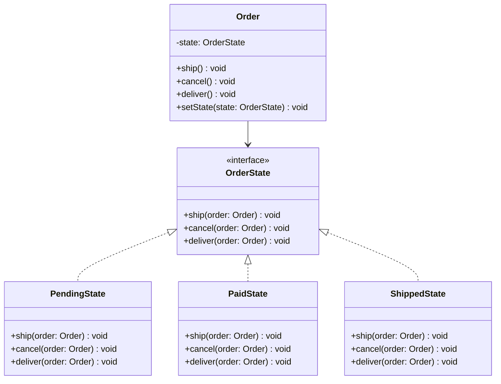
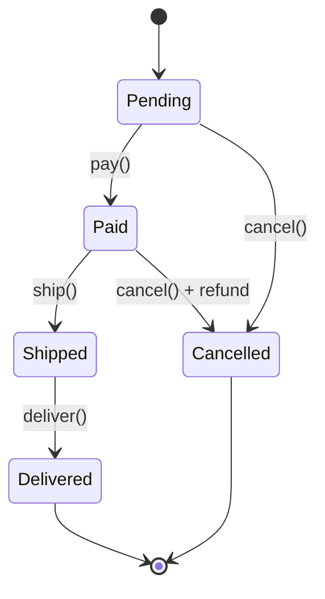

---
# Required
sidebar_position: 6
title: "State Pattern — Behavior That Changes with State"
description: >-
  Learn the State pattern to change object behavior based on internal state.
  Perfect for order workflows, connection states, and game characters.

# SEO
keywords:
  - state pattern
  - state design pattern
  - finite state machine
  - state machine pattern
  - behavioral state

difficulty: intermediate
category: behavioral
related_solid: [OCP, SRP]

# Social sharing
og_title: "State Pattern: Behavior That Changes with State"
og_description: "Change object behavior when internal state changes—cleaner than state conditionals."
og_image: "/img/social-card.svg"

# Content management
date_published: 2026-01-25
date_modified: 2026-01-25
author: shivam
reading_time: 14
content_type: explanation
---

# State Pattern

<PatternMeta>
  <Difficulty level="intermediate" />
  <TimeToRead minutes={14} />
  <Prerequisites patterns={["Strategy"]} />
</PatternMeta>

The order system with 47 if-else branches taught me why State pattern exists.

In 2019, our e-commerce platform at NVIDIA had order processing that looked like this:

```python
class Order:
    def ship(self):
        if self.status == "pending":
            raise Error("Cannot ship pending order")
        elif self.status == "paid":
            self.status = "shipped"
            self.notify_customer()
        elif self.status == "shipped":
            raise Error("Already shipped")
        elif self.status == "delivered":
            raise Error("Already delivered")
        elif self.status == "cancelled":
            raise Error("Order is cancelled")
    
    def cancel(self):
        if self.status == "pending":
            self.status = "cancelled"
        elif self.status == "paid":
            self.status = "cancelled"
            self.refund()
        elif self.status == "shipped":
            raise Error("Cannot cancel shipped order")
        # ... more conditions
```

Every method had the same pattern: check the current state, decide what to do. As we added more states (partially shipped, on hold, returned, disputed), the conditionals multiplied. Adding a new state meant touching every method. Finding all the transitions for one state required reading the entire class.

**Here's what I learned: when an object's behavior depends entirely on its state, make the state itself an object.** Each state knows what it can do and what transitions are valid.

```python
class Order:
    def __init__(self):
        self.state = PendingState(self)
    
    def ship(self):
        self.state.ship()  # State handles the logic
    
    def cancel(self):
        self.state.cancel()  # State handles the logic
```

Now each state is a focused class that knows its own behavior. Adding a new state means adding a new class, not modifying existing code.

---

## What Is the State Pattern?

> **Definition:** State allows an object to alter its behavior when its internal state changes. The object will appear to change its class.

Instead of spreading state-dependent behavior across conditionals, you encapsulate each state's behavior in its own class. The context delegates to its current state object.

**The key insight: State makes state transitions explicit and state-specific behavior localized.** Each state class handles only its own transitions.

---

## Structure



### Key Components

| Component | Role |
|-----------|------|
| **Context** (`Order`) | Maintains current state, delegates behavior to it |
| **State Interface** (`OrderState`) | Declares methods for state-specific behavior |
| **Concrete States** | Implement behavior for each state, handle transitions |

### SOLID Principles Connection

- **Open/Closed:** Add new states without modifying context
- **Single Responsibility:** Each state class handles one state's behavior

---

## When to Use State

✅ **Use it when:**

- Object behavior depends heavily on its state
- State-specific behavior is spread across many conditionals
- State transitions follow specific rules
- You have a finite state machine

❌ **Don't use it when:**

- You have only 2-3 simple states
- State transitions are simple and unlikely to change
- The overhead of state classes isn't justified
- States don't have significantly different behavior

**Rule of thumb:** If you have more than 3-4 states with different behaviors, or if state conditionals are duplicated across methods, consider State pattern.

---

## Implementation

<CodeTabs>
  <TabItem value="python" label="Python">
    ```python
    from abc import ABC, abstractmethod
    from typing import TYPE_CHECKING

    if TYPE_CHECKING:
        from order import Order


    class OrderState(ABC):
        """Abstract state interface."""
        
        def __init__(self, order: "Order") -> None:
            self.order = order
        
        @abstractmethod
        def pay(self) -> None:
            pass
        
        @abstractmethod
        def ship(self) -> None:
            pass
        
        @abstractmethod
        def deliver(self) -> None:
            pass
        
        @abstractmethod
        def cancel(self) -> None:
            pass
        
        @property
        @abstractmethod
        def name(self) -> str:
            pass


    class PendingState(OrderState):
        @property
        def name(self) -> str:
            return "pending"
        
        def pay(self) -> None:
            print(f"Order {self.order.id}: Payment received")
            self.order.set_state(PaidState(self.order))
        
        def ship(self) -> None:
            raise InvalidTransitionError("Cannot ship unpaid order")
        
        def deliver(self) -> None:
            raise InvalidTransitionError("Cannot deliver unpaid order")
        
        def cancel(self) -> None:
            print(f"Order {self.order.id}: Cancelled (no payment to refund)")
            self.order.set_state(CancelledState(self.order))


    class PaidState(OrderState):
        @property
        def name(self) -> str:
            return "paid"
        
        def pay(self) -> None:
            raise InvalidTransitionError("Order already paid")
        
        def ship(self) -> None:
            print(f"Order {self.order.id}: Shipped")
            self.order.set_state(ShippedState(self.order))
        
        def deliver(self) -> None:
            raise InvalidTransitionError("Must ship before delivering")
        
        def cancel(self) -> None:
            print(f"Order {self.order.id}: Cancelled, processing refund")
            self.order.refund()
            self.order.set_state(CancelledState(self.order))


    class ShippedState(OrderState):
        @property
        def name(self) -> str:
            return "shipped"
        
        def pay(self) -> None:
            raise InvalidTransitionError("Order already paid")
        
        def ship(self) -> None:
            raise InvalidTransitionError("Order already shipped")
        
        def deliver(self) -> None:
            print(f"Order {self.order.id}: Delivered")
            self.order.set_state(DeliveredState(self.order))
        
        def cancel(self) -> None:
            raise InvalidTransitionError("Cannot cancel shipped order")


    class DeliveredState(OrderState):
        @property
        def name(self) -> str:
            return "delivered"
        
        def pay(self) -> None:
            raise InvalidTransitionError("Order already paid")
        
        def ship(self) -> None:
            raise InvalidTransitionError("Order already delivered")
        
        def deliver(self) -> None:
            raise InvalidTransitionError("Order already delivered")
        
        def cancel(self) -> None:
            raise InvalidTransitionError("Cannot cancel delivered order")


    class CancelledState(OrderState):
        @property
        def name(self) -> str:
            return "cancelled"
        
        def pay(self) -> None:
            raise InvalidTransitionError("Order is cancelled")
        
        def ship(self) -> None:
            raise InvalidTransitionError("Order is cancelled")
        
        def deliver(self) -> None:
            raise InvalidTransitionError("Order is cancelled")
        
        def cancel(self) -> None:
            raise InvalidTransitionError("Order already cancelled")


    class InvalidTransitionError(Exception):
        pass


    class Order:
        def __init__(self, order_id: str) -> None:
            self.id = order_id
            self._state: OrderState = PendingState(self)
        
        @property
        def status(self) -> str:
            return self._state.name
        
        def set_state(self, state: OrderState) -> None:
            print(f"  [{self._state.name} -> {state.name}]")
            self._state = state
        
        def pay(self) -> None:
            self._state.pay()
        
        def ship(self) -> None:
            self._state.ship()
        
        def deliver(self) -> None:
            self._state.deliver()
        
        def cancel(self) -> None:
            self._state.cancel()
        
        def refund(self) -> None:
            print(f"  Processing refund for order {self.id}")


    # Usage
    order = Order("ORD-001")
    print(f"Initial status: {order.status}")

    order.pay()
    print(f"Status: {order.status}")

    order.ship()
    print(f"Status: {order.status}")

    order.deliver()
    print(f"Status: {order.status}")

    # Try invalid transition
    try:
        order.cancel()
    except InvalidTransitionError as e:
        print(f"Error: {e}")
    ```
  </TabItem>
  <TabItem value="typescript" label="TypeScript">
    ```typescript
    interface OrderState {
      name: string;
      pay(): void;
      ship(): void;
      deliver(): void;
      cancel(): void;
    }

    class InvalidTransitionError extends Error {
      constructor(message: string) {
        super(message);
        this.name = "InvalidTransitionError";
      }
    }

    class Order {
      private state: OrderState;

      constructor(public readonly id: string) {
        this.state = new PendingState(this);
      }

      get status(): string {
        return this.state.name;
      }

      setState(state: OrderState): void {
        console.log(`  [${this.state.name} -> ${state.name}]`);
        this.state = state;
      }

      pay(): void {
        this.state.pay();
      }
      ship(): void {
        this.state.ship();
      }
      deliver(): void {
        this.state.deliver();
      }
      cancel(): void {
        this.state.cancel();
      }

      refund(): void {
        console.log(`  Processing refund for order ${this.id}`);
      }
    }

    class PendingState implements OrderState {
      readonly name = "pending";
      constructor(private order: Order) {}

      pay(): void {
        console.log(`Order ${this.order.id}: Payment received`);
        this.order.setState(new PaidState(this.order));
      }
      ship(): void {
        throw new InvalidTransitionError("Cannot ship unpaid order");
      }
      deliver(): void {
        throw new InvalidTransitionError("Cannot deliver unpaid order");
      }
      cancel(): void {
        console.log(`Order ${this.order.id}: Cancelled`);
        this.order.setState(new CancelledState(this.order));
      }
    }

    class PaidState implements OrderState {
      readonly name = "paid";
      constructor(private order: Order) {}

      pay(): void {
        throw new InvalidTransitionError("Order already paid");
      }
      ship(): void {
        console.log(`Order ${this.order.id}: Shipped`);
        this.order.setState(new ShippedState(this.order));
      }
      deliver(): void {
        throw new InvalidTransitionError("Must ship before delivering");
      }
      cancel(): void {
        console.log(`Order ${this.order.id}: Cancelled, processing refund`);
        this.order.refund();
        this.order.setState(new CancelledState(this.order));
      }
    }

    class ShippedState implements OrderState {
      readonly name = "shipped";
      constructor(private order: Order) {}

      pay(): void {
        throw new InvalidTransitionError("Order already paid");
      }
      ship(): void {
        throw new InvalidTransitionError("Order already shipped");
      }
      deliver(): void {
        console.log(`Order ${this.order.id}: Delivered`);
        this.order.setState(new DeliveredState(this.order));
      }
      cancel(): void {
        throw new InvalidTransitionError("Cannot cancel shipped order");
      }
    }

    class DeliveredState implements OrderState {
      readonly name = "delivered";
      constructor(private order: Order) {}

      pay(): void {
        throw new InvalidTransitionError("Order already paid");
      }
      ship(): void {
        throw new InvalidTransitionError("Order already delivered");
      }
      deliver(): void {
        throw new InvalidTransitionError("Order already delivered");
      }
      cancel(): void {
        throw new InvalidTransitionError("Cannot cancel delivered order");
      }
    }

    class CancelledState implements OrderState {
      readonly name = "cancelled";
      constructor(private order: Order) {}

      pay(): void {
        throw new InvalidTransitionError("Order is cancelled");
      }
      ship(): void {
        throw new InvalidTransitionError("Order is cancelled");
      }
      deliver(): void {
        throw new InvalidTransitionError("Order is cancelled");
      }
      cancel(): void {
        throw new InvalidTransitionError("Order already cancelled");
      }
    }

    // Usage
    const order = new Order("ORD-001");
    console.log(`Initial status: ${order.status}`);

    order.pay();
    order.ship();
    order.deliver();

    try {
      order.cancel();
    } catch (e) {
      console.log(`Error: ${(e as Error).message}`);
    }
    ```
  </TabItem>
  <TabItem value="go" label="Go">
    ```go
    package state

    import (
        "errors"
        "fmt"
    )

    var ErrInvalidTransition = errors.New("invalid state transition")

    type OrderState interface {
        Name() string
        Pay(order *Order) error
        Ship(order *Order) error
        Deliver(order *Order) error
        Cancel(order *Order) error
    }

    type Order struct {
        ID    string
        state OrderState
    }

    func NewOrder(id string) *Order {
        order := &Order{ID: id}
        order.state = &PendingState{}
        return order
    }

    func (o *Order) Status() string {
        return o.state.Name()
    }

    func (o *Order) SetState(state OrderState) {
        fmt.Printf("  [%s -> %s]\n", o.state.Name(), state.Name())
        o.state = state
    }

    func (o *Order) Pay() error    { return o.state.Pay(o) }
    func (o *Order) Ship() error   { return o.state.Ship(o) }
    func (o *Order) Deliver() error { return o.state.Deliver(o) }
    func (o *Order) Cancel() error { return o.state.Cancel(o) }

    func (o *Order) Refund() {
        fmt.Printf("  Processing refund for order %s\n", o.ID)
    }

    // PendingState
    type PendingState struct{}

    func (s *PendingState) Name() string { return "pending" }

    func (s *PendingState) Pay(order *Order) error {
        fmt.Printf("Order %s: Payment received\n", order.ID)
        order.SetState(&PaidState{})
        return nil
    }

    func (s *PendingState) Ship(order *Order) error {
        return fmt.Errorf("%w: cannot ship unpaid order", ErrInvalidTransition)
    }

    func (s *PendingState) Deliver(order *Order) error {
        return fmt.Errorf("%w: cannot deliver unpaid order", ErrInvalidTransition)
    }

    func (s *PendingState) Cancel(order *Order) error {
        fmt.Printf("Order %s: Cancelled\n", order.ID)
        order.SetState(&CancelledState{})
        return nil
    }

    // PaidState
    type PaidState struct{}

    func (s *PaidState) Name() string { return "paid" }

    func (s *PaidState) Pay(order *Order) error {
        return fmt.Errorf("%w: order already paid", ErrInvalidTransition)
    }

    func (s *PaidState) Ship(order *Order) error {
        fmt.Printf("Order %s: Shipped\n", order.ID)
        order.SetState(&ShippedState{})
        return nil
    }

    func (s *PaidState) Deliver(order *Order) error {
        return fmt.Errorf("%w: must ship before delivering", ErrInvalidTransition)
    }

    func (s *PaidState) Cancel(order *Order) error {
        fmt.Printf("Order %s: Cancelled, processing refund\n", order.ID)
        order.Refund()
        order.SetState(&CancelledState{})
        return nil
    }

    // ShippedState
    type ShippedState struct{}

    func (s *ShippedState) Name() string { return "shipped" }

    func (s *ShippedState) Pay(order *Order) error {
        return fmt.Errorf("%w: order already paid", ErrInvalidTransition)
    }

    func (s *ShippedState) Ship(order *Order) error {
        return fmt.Errorf("%w: order already shipped", ErrInvalidTransition)
    }

    func (s *ShippedState) Deliver(order *Order) error {
        fmt.Printf("Order %s: Delivered\n", order.ID)
        order.SetState(&DeliveredState{})
        return nil
    }

    func (s *ShippedState) Cancel(order *Order) error {
        return fmt.Errorf("%w: cannot cancel shipped order", ErrInvalidTransition)
    }

    // DeliveredState and CancelledState follow same pattern...
    type DeliveredState struct{}
    func (s *DeliveredState) Name() string { return "delivered" }
    func (s *DeliveredState) Pay(order *Order) error { return ErrInvalidTransition }
    func (s *DeliveredState) Ship(order *Order) error { return ErrInvalidTransition }
    func (s *DeliveredState) Deliver(order *Order) error { return ErrInvalidTransition }
    func (s *DeliveredState) Cancel(order *Order) error { return ErrInvalidTransition }

    type CancelledState struct{}
    func (s *CancelledState) Name() string { return "cancelled" }
    func (s *CancelledState) Pay(order *Order) error { return ErrInvalidTransition }
    func (s *CancelledState) Ship(order *Order) error { return ErrInvalidTransition }
    func (s *CancelledState) Deliver(order *Order) error { return ErrInvalidTransition }
    func (s *CancelledState) Cancel(order *Order) error { return ErrInvalidTransition }
    ```
  </TabItem>
  <TabItem value="java" label="Java">
    ```java
    interface OrderState {
        String getName();
        void pay(Order order);
        void ship(Order order);
        void deliver(Order order);
        void cancel(Order order);
    }

    class InvalidTransitionException extends RuntimeException {
        public InvalidTransitionException(String message) {
            super(message);
        }
    }

    class Order {
        private final String id;
        private OrderState state;

        public Order(String id) {
            this.id = id;
            this.state = new PendingState();
        }

        public String getId() { return id; }
        public String getStatus() { return state.getName(); }

        public void setState(OrderState newState) {
            System.out.printf("  [%s -> %s]%n", state.getName(), newState.getName());
            this.state = newState;
        }

        public void pay() { state.pay(this); }
        public void ship() { state.ship(this); }
        public void deliver() { state.deliver(this); }
        public void cancel() { state.cancel(this); }

        public void refund() {
            System.out.printf("  Processing refund for order %s%n", id);
        }
    }

    class PendingState implements OrderState {
        @Override public String getName() { return "pending"; }

        @Override
        public void pay(Order order) {
            System.out.printf("Order %s: Payment received%n", order.getId());
            order.setState(new PaidState());
        }

        @Override
        public void ship(Order order) {
            throw new InvalidTransitionException("Cannot ship unpaid order");
        }

        @Override
        public void deliver(Order order) {
            throw new InvalidTransitionException("Cannot deliver unpaid order");
        }

        @Override
        public void cancel(Order order) {
            System.out.printf("Order %s: Cancelled%n", order.getId());
            order.setState(new CancelledState());
        }
    }

    class PaidState implements OrderState {
        @Override public String getName() { return "paid"; }

        @Override
        public void pay(Order order) {
            throw new InvalidTransitionException("Order already paid");
        }

        @Override
        public void ship(Order order) {
            System.out.printf("Order %s: Shipped%n", order.getId());
            order.setState(new ShippedState());
        }

        @Override
        public void deliver(Order order) {
            throw new InvalidTransitionException("Must ship before delivering");
        }

        @Override
        public void cancel(Order order) {
            System.out.printf("Order %s: Cancelled, processing refund%n", order.getId());
            order.refund();
            order.setState(new CancelledState());
        }
    }

    class ShippedState implements OrderState {
        @Override public String getName() { return "shipped"; }

        @Override public void pay(Order order) {
            throw new InvalidTransitionException("Order already paid");
        }

        @Override public void ship(Order order) {
            throw new InvalidTransitionException("Order already shipped");
        }

        @Override
        public void deliver(Order order) {
            System.out.printf("Order %s: Delivered%n", order.getId());
            order.setState(new DeliveredState());
        }

        @Override public void cancel(Order order) {
            throw new InvalidTransitionException("Cannot cancel shipped order");
        }
    }

    // DeliveredState and CancelledState follow same pattern
    class DeliveredState implements OrderState {
        @Override public String getName() { return "delivered"; }
        @Override public void pay(Order order) { throw new InvalidTransitionException("Order complete"); }
        @Override public void ship(Order order) { throw new InvalidTransitionException("Order complete"); }
        @Override public void deliver(Order order) { throw new InvalidTransitionException("Order complete"); }
        @Override public void cancel(Order order) { throw new InvalidTransitionException("Cannot cancel delivered"); }
    }

    class CancelledState implements OrderState {
        @Override public String getName() { return "cancelled"; }
        @Override public void pay(Order order) { throw new InvalidTransitionException("Order cancelled"); }
        @Override public void ship(Order order) { throw new InvalidTransitionException("Order cancelled"); }
        @Override public void deliver(Order order) { throw new InvalidTransitionException("Order cancelled"); }
        @Override public void cancel(Order order) { throw new InvalidTransitionException("Already cancelled"); }
    }
    ```
  </TabItem>
  <TabItem value="csharp" label="C#">
    ```csharp
    public interface IOrderState
    {
        string Name { get; }
        void Pay(Order order);
        void Ship(Order order);
        void Deliver(Order order);
        void Cancel(Order order);
    }

    public class InvalidTransitionException : Exception
    {
        public InvalidTransitionException(string message) : base(message) { }
    }

    public class Order
    {
        public string Id { get; }
        private IOrderState _state;

        public Order(string id)
        {
            Id = id;
            _state = new PendingState();
        }

        public string Status => _state.Name;

        public void SetState(IOrderState newState)
        {
            Console.WriteLine($"  [{_state.Name} -> {newState.Name}]");
            _state = newState;
        }

        public void Pay() => _state.Pay(this);
        public void Ship() => _state.Ship(this);
        public void Deliver() => _state.Deliver(this);
        public void Cancel() => _state.Cancel(this);

        public void Refund()
        {
            Console.WriteLine($"  Processing refund for order {Id}");
        }
    }

    public class PendingState : IOrderState
    {
        public string Name => "pending";

        public void Pay(Order order)
        {
            Console.WriteLine($"Order {order.Id}: Payment received");
            order.SetState(new PaidState());
        }

        public void Ship(Order order) =>
            throw new InvalidTransitionException("Cannot ship unpaid order");

        public void Deliver(Order order) =>
            throw new InvalidTransitionException("Cannot deliver unpaid order");

        public void Cancel(Order order)
        {
            Console.WriteLine($"Order {order.Id}: Cancelled");
            order.SetState(new CancelledState());
        }
    }

    public class PaidState : IOrderState
    {
        public string Name => "paid";

        public void Pay(Order order) =>
            throw new InvalidTransitionException("Order already paid");

        public void Ship(Order order)
        {
            Console.WriteLine($"Order {order.Id}: Shipped");
            order.SetState(new ShippedState());
        }

        public void Deliver(Order order) =>
            throw new InvalidTransitionException("Must ship before delivering");

        public void Cancel(Order order)
        {
            Console.WriteLine($"Order {order.Id}: Cancelled, processing refund");
            order.Refund();
            order.SetState(new CancelledState());
        }
    }

    public class ShippedState : IOrderState
    {
        public string Name => "shipped";

        public void Pay(Order order) =>
            throw new InvalidTransitionException("Order already paid");

        public void Ship(Order order) =>
            throw new InvalidTransitionException("Order already shipped");

        public void Deliver(Order order)
        {
            Console.WriteLine($"Order {order.Id}: Delivered");
            order.SetState(new DeliveredState());
        }

        public void Cancel(Order order) =>
            throw new InvalidTransitionException("Cannot cancel shipped order");
    }

    public class DeliveredState : IOrderState
    {
        public string Name => "delivered";
        public void Pay(Order order) => throw new InvalidTransitionException("Complete");
        public void Ship(Order order) => throw new InvalidTransitionException("Complete");
        public void Deliver(Order order) => throw new InvalidTransitionException("Complete");
        public void Cancel(Order order) => throw new InvalidTransitionException("Cannot cancel");
    }

    public class CancelledState : IOrderState
    {
        public string Name => "cancelled";
        public void Pay(Order order) => throw new InvalidTransitionException("Cancelled");
        public void Ship(Order order) => throw new InvalidTransitionException("Cancelled");
        public void Deliver(Order order) => throw new InvalidTransitionException("Cancelled");
        public void Cancel(Order order) => throw new InvalidTransitionException("Already cancelled");
    }
    ```
  </TabItem>
</CodeTabs>

---

## State Diagram



---

## Common Mistakes

### 1. States that know too much about other states

```python
# Bad: PaidState knows about all other states
class PaidState:
    def cancel(self, order):
        if order.has_shipped:  # Checking other state's concern
            raise Error("...")
```

Each state should only know about its own transitions.

### 2. Context that exposes state implementation

```python
# Bad: exposing internal state object
class Order:
    def get_state(self) -> OrderState:
        return self._state  # Clients shouldn't access this
```

The context should expose behavior, not state internals.

---

## Related Patterns

| Pattern | Relationship |
|---------|--------------|
| **Strategy** | Similar structure, but Strategy is about algorithm variants; State is about object lifecycle |
| **Flyweight** | State objects can be flyweights if they're stateless |

---

## Key Takeaways

- **State encapsulates state-specific behavior in separate classes.** No more giant switch statements.

- **State transitions become explicit.** Each state knows what transitions are valid.

- **Adding new states doesn't require changing existing code.** Just add a new state class.

- **The object appears to change its class.** Same interface, different behavior.

---

## Navigation

- **Previous:** [Template Method Pattern](/docs/design-patterns/behavioral/template-method)
- **Next:** [Iterator Pattern](/docs/design-patterns/behavioral/iterator)
