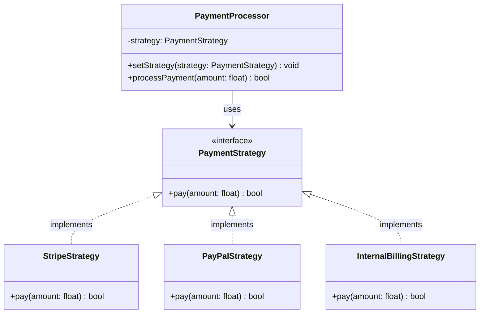

---
# Required
sidebar_position: 2
title: "Strategy Pattern — Swappable Algorithms at Runtime"
description: >-
  Learn the Strategy pattern to swap algorithms without changing client code.
  The most common behavioral pattern with real-world examples and implementations.

# SEO
keywords:
  - strategy pattern
  - strategy design pattern
  - policy pattern
  - algorithm pattern
  - when to use strategy
  - swap algorithms

difficulty: beginner
category: behavioral
related_solid: [OCP, DIP, SRP]

# Social sharing
og_title: "Strategy Pattern: Swappable Algorithms at Runtime"
og_description: "Swap algorithms without changing client code—the most useful behavioral pattern."
og_image: "/img/social-card.svg"

# Content management
date_published: 2026-01-25
date_modified: 2026-01-25
author: shivam
reading_time: 15
content_type: explanation
---

# Strategy Pattern

<PatternMeta>
  <Difficulty level="beginner" />
  <TimeToRead minutes={15} />
  <Prerequisites patterns={["Factory Method"]} />
</PatternMeta>

The payment system that couldn't handle a new provider taught me why Strategy exists.

In 2020, our CI/CD platform at NVIDIA needed to charge teams for compute resources. We started with one payment processor—an internal billing system. The integration was simple:

```python
def process_payment(amount: float, team_id: str) -> bool:
    billing = InternalBilling()
    return billing.charge(team_id, amount)
```

Then finance added external contractors who needed to pay via Stripe. Then we acquired a company that used PayPal. Each addition meant modifying `process_payment`:

```python
def process_payment(amount: float, team_id: str, method: str) -> bool:
    if method == "internal":
        billing = InternalBilling()
        return billing.charge(team_id, amount)
    elif method == "stripe":
        stripe = StripeClient(api_key)
        return stripe.create_charge(amount, team_id)
    elif method == "paypal":
        paypal = PayPalClient(client_id, secret)
        return paypal.execute_payment(amount)
    # ... more elif branches coming
```

Every new payment method meant touching this function. The if-else chain grew. The function knew too much about each provider's API. Testing required mocking three different external services. One bug in the Stripe path could break internal billing.

**Here's what I didn't understand then: the algorithm (how to charge) varies independently of the client (what needs charging).** Strategy pattern separates these concerns so you can add new algorithms without touching existing code.

---

## What Is the Strategy Pattern?

> **Definition:** Strategy defines a family of algorithms, encapsulates each one, and makes them interchangeable. It lets the algorithm vary independently from the clients that use it.

In plain terms: instead of hard-coding different algorithms in if-else branches, you define a common interface for all algorithms and inject the one you need. The client doesn't know or care which algorithm it's using—just that it satisfies the interface.

**The key insight: Strategy turns algorithms into objects you can swap at runtime.** Adding a new algorithm means adding a new class, not modifying existing code.

---

## Structure



### Key Components

| Component | Role |
|-----------|------|
| **Strategy Interface** (`PaymentStrategy`) | Declares the operation(s) common to all algorithms |
| **Concrete Strategies** (`StripeStrategy`, etc.) | Implement the algorithm using the strategy interface |
| **Context** (`PaymentProcessor`) | Maintains a reference to a strategy and delegates work to it |

### SOLID Principles Connection

- **Open/Closed Principle:** Add new strategies without modifying context or existing strategies
- **Dependency Inversion:** Context depends on abstraction (interface), not concrete implementations
- **Single Responsibility:** Each strategy handles one algorithm; context handles orchestration

---

## When to Use Strategy

✅ **Use it when:**

- You have multiple algorithms for the same task and need to switch between them
- You want to avoid conditional statements for selecting behavior
- You have related classes that differ only in their behavior
- An algorithm uses data the client shouldn't know about
- You need to swap algorithms at runtime based on configuration or user input

❌ **Don't use it when:**

- You only have two algorithms and they're unlikely to change
- The algorithms are trivial (a few lines each)
- Clients need to know the differences between strategies to choose correctly
- The overhead of extra classes isn't justified

**Rule of thumb:** If you have a switch statement that selects behavior based on type, and you're adding cases regularly, Strategy is probably the answer.

---

## Implementation

<CodeTabs>
  <TabItem value="python" label="Python">
    ```python
    from abc import ABC, abstractmethod
    from dataclasses import dataclass


    @dataclass
    class PaymentResult:
        success: bool
        transaction_id: str
        message: str


    class PaymentStrategy(ABC):
        """Interface for payment processing strategies."""
        
        @abstractmethod
        def pay(self, amount: float, account_id: str) -> PaymentResult:
            """Process a payment and return the result."""
            pass


    class StripeStrategy(PaymentStrategy):
        """Stripe payment processing."""
        
        def __init__(self, api_key: str) -> None:
            self.api_key = api_key
        
        def pay(self, amount: float, account_id: str) -> PaymentResult:
            # In reality, call Stripe API
            print(f"Charging ${amount} via Stripe for {account_id}")
            return PaymentResult(
                success=True,
                transaction_id=f"stripe_{account_id}_{amount}",
                message="Payment processed via Stripe"
            )


    class PayPalStrategy(PaymentStrategy):
        """PayPal payment processing."""
        
        def __init__(self, client_id: str, client_secret: str) -> None:
            self.client_id = client_id
            self.client_secret = client_secret
        
        def pay(self, amount: float, account_id: str) -> PaymentResult:
            print(f"Charging ${amount} via PayPal for {account_id}")
            return PaymentResult(
                success=True,
                transaction_id=f"paypal_{account_id}_{amount}",
                message="Payment processed via PayPal"
            )


    class InternalBillingStrategy(PaymentStrategy):
        """Internal billing system for employees."""
        
        def pay(self, amount: float, account_id: str) -> PaymentResult:
            print(f"Charging ${amount} to internal account {account_id}")
            return PaymentResult(
                success=True,
                transaction_id=f"internal_{account_id}_{amount}",
                message="Charged to internal billing"
            )


    class PaymentProcessor:
        """Context that uses a payment strategy."""
        
        def __init__(self, strategy: PaymentStrategy) -> None:
            self._strategy = strategy
        
        def set_strategy(self, strategy: PaymentStrategy) -> None:
            """Change the payment strategy at runtime."""
            self._strategy = strategy
        
        def process_payment(self, amount: float, account_id: str) -> PaymentResult:
            """Process payment using current strategy."""
            if amount <= 0:
                return PaymentResult(False, "", "Invalid amount")
            return self._strategy.pay(amount, account_id)


    # Usage
    # Select strategy based on configuration or user choice
    stripe = StripeStrategy(api_key="sk_test_xxx")
    paypal = PayPalStrategy(client_id="xxx", client_secret="yyy")
    internal = InternalBillingStrategy()

    processor = PaymentProcessor(stripe)
    result = processor.process_payment(99.99, "team_platform")
    print(result)

    # Switch strategy at runtime
    processor.set_strategy(internal)
    result = processor.process_payment(150.00, "team_devops")
    print(result)
    ```
  </TabItem>
  <TabItem value="typescript" label="TypeScript">
    ```typescript
    interface PaymentResult {
      success: boolean;
      transactionId: string;
      message: string;
    }

    interface PaymentStrategy {
      pay(amount: number, accountId: string): PaymentResult;
    }

    class StripeStrategy implements PaymentStrategy {
      constructor(private apiKey: string) {}

      pay(amount: number, accountId: string): PaymentResult {
        console.log(`Charging $${amount} via Stripe for ${accountId}`);
        return {
          success: true,
          transactionId: `stripe_${accountId}_${amount}`,
          message: "Payment processed via Stripe",
        };
      }
    }

    class PayPalStrategy implements PaymentStrategy {
      constructor(
        private clientId: string,
        private clientSecret: string
      ) {}

      pay(amount: number, accountId: string): PaymentResult {
        console.log(`Charging $${amount} via PayPal for ${accountId}`);
        return {
          success: true,
          transactionId: `paypal_${accountId}_${amount}`,
          message: "Payment processed via PayPal",
        };
      }
    }

    class InternalBillingStrategy implements PaymentStrategy {
      pay(amount: number, accountId: string): PaymentResult {
        console.log(`Charging $${amount} to internal account ${accountId}`);
        return {
          success: true,
          transactionId: `internal_${accountId}_${amount}`,
          message: "Charged to internal billing",
        };
      }
    }

    class PaymentProcessor {
      constructor(private strategy: PaymentStrategy) {}

      setStrategy(strategy: PaymentStrategy): void {
        this.strategy = strategy;
      }

      processPayment(amount: number, accountId: string): PaymentResult {
        if (amount <= 0) {
          return { success: false, transactionId: "", message: "Invalid amount" };
        }
        return this.strategy.pay(amount, accountId);
      }
    }

    // Usage
    const stripe = new StripeStrategy("sk_test_xxx");
    const processor = new PaymentProcessor(stripe);

    const result = processor.processPayment(99.99, "team_platform");
    console.log(result);

    // Switch at runtime
    processor.setStrategy(new InternalBillingStrategy());
    console.log(processor.processPayment(150.0, "team_devops"));
    ```
  </TabItem>
  <TabItem value="go" label="Go">
    ```go
    package payment

    import "fmt"

    type PaymentResult struct {
        Success       bool
        TransactionID string
        Message       string
    }

    // PaymentStrategy is the strategy interface
    type PaymentStrategy interface {
        Pay(amount float64, accountID string) PaymentResult
    }

    // StripeStrategy implements PaymentStrategy
    type StripeStrategy struct {
        APIKey string
    }

    func (s *StripeStrategy) Pay(amount float64, accountID string) PaymentResult {
        fmt.Printf("Charging $%.2f via Stripe for %s\n", amount, accountID)
        return PaymentResult{
            Success:       true,
            TransactionID: fmt.Sprintf("stripe_%s_%.2f", accountID, amount),
            Message:       "Payment processed via Stripe",
        }
    }

    // PayPalStrategy implements PaymentStrategy
    type PayPalStrategy struct {
        ClientID     string
        ClientSecret string
    }

    func (p *PayPalStrategy) Pay(amount float64, accountID string) PaymentResult {
        fmt.Printf("Charging $%.2f via PayPal for %s\n", amount, accountID)
        return PaymentResult{
            Success:       true,
            TransactionID: fmt.Sprintf("paypal_%s_%.2f", accountID, amount),
            Message:       "Payment processed via PayPal",
        }
    }

    // InternalBillingStrategy implements PaymentStrategy
    type InternalBillingStrategy struct{}

    func (i *InternalBillingStrategy) Pay(amount float64, accountID string) PaymentResult {
        fmt.Printf("Charging $%.2f to internal account %s\n", amount, accountID)
        return PaymentResult{
            Success:       true,
            TransactionID: fmt.Sprintf("internal_%s_%.2f", accountID, amount),
            Message:       "Charged to internal billing",
        }
    }

    // PaymentProcessor is the context
    type PaymentProcessor struct {
        strategy PaymentStrategy
    }

    func NewPaymentProcessor(strategy PaymentStrategy) *PaymentProcessor {
        return &PaymentProcessor{strategy: strategy}
    }

    func (p *PaymentProcessor) SetStrategy(strategy PaymentStrategy) {
        p.strategy = strategy
    }

    func (p *PaymentProcessor) ProcessPayment(amount float64, accountID string) PaymentResult {
        if amount <= 0 {
            return PaymentResult{Success: false, Message: "Invalid amount"}
        }
        return p.strategy.Pay(amount, accountID)
    }
    ```
  </TabItem>
  <TabItem value="java" label="Java">
    ```java
    record PaymentResult(boolean success, String transactionId, String message) {}

    interface PaymentStrategy {
        PaymentResult pay(double amount, String accountId);
    }

    class StripeStrategy implements PaymentStrategy {
        private final String apiKey;

        public StripeStrategy(String apiKey) {
            this.apiKey = apiKey;
        }

        @Override
        public PaymentResult pay(double amount, String accountId) {
            System.out.printf("Charging $%.2f via Stripe for %s%n", amount, accountId);
            return new PaymentResult(
                true,
                String.format("stripe_%s_%.2f", accountId, amount),
                "Payment processed via Stripe"
            );
        }
    }

    class PayPalStrategy implements PaymentStrategy {
        private final String clientId;
        private final String clientSecret;

        public PayPalStrategy(String clientId, String clientSecret) {
            this.clientId = clientId;
            this.clientSecret = clientSecret;
        }

        @Override
        public PaymentResult pay(double amount, String accountId) {
            System.out.printf("Charging $%.2f via PayPal for %s%n", amount, accountId);
            return new PaymentResult(
                true,
                String.format("paypal_%s_%.2f", accountId, amount),
                "Payment processed via PayPal"
            );
        }
    }

    class InternalBillingStrategy implements PaymentStrategy {
        @Override
        public PaymentResult pay(double amount, String accountId) {
            System.out.printf("Charging $%.2f to internal account %s%n", amount, accountId);
            return new PaymentResult(
                true,
                String.format("internal_%s_%.2f", accountId, amount),
                "Charged to internal billing"
            );
        }
    }

    class PaymentProcessor {
        private PaymentStrategy strategy;

        public PaymentProcessor(PaymentStrategy strategy) {
            this.strategy = strategy;
        }

        public void setStrategy(PaymentStrategy strategy) {
            this.strategy = strategy;
        }

        public PaymentResult processPayment(double amount, String accountId) {
            if (amount <= 0) {
                return new PaymentResult(false, "", "Invalid amount");
            }
            return strategy.pay(amount, accountId);
        }
    }
    ```
  </TabItem>
  <TabItem value="csharp" label="C#">
    ```csharp
    public record PaymentResult(bool Success, string TransactionId, string Message);

    public interface IPaymentStrategy
    {
        PaymentResult Pay(decimal amount, string accountId);
    }

    public class StripeStrategy : IPaymentStrategy
    {
        private readonly string _apiKey;

        public StripeStrategy(string apiKey)
        {
            _apiKey = apiKey;
        }

        public PaymentResult Pay(decimal amount, string accountId)
        {
            Console.WriteLine($"Charging ${amount} via Stripe for {accountId}");
            return new PaymentResult(
                true,
                $"stripe_{accountId}_{amount}",
                "Payment processed via Stripe"
            );
        }
    }

    public class PayPalStrategy : IPaymentStrategy
    {
        private readonly string _clientId;
        private readonly string _clientSecret;

        public PayPalStrategy(string clientId, string clientSecret)
        {
            _clientId = clientId;
            _clientSecret = clientSecret;
        }

        public PaymentResult Pay(decimal amount, string accountId)
        {
            Console.WriteLine($"Charging ${amount} via PayPal for {accountId}");
            return new PaymentResult(
                true,
                $"paypal_{accountId}_{amount}",
                "Payment processed via PayPal"
            );
        }
    }

    public class InternalBillingStrategy : IPaymentStrategy
    {
        public PaymentResult Pay(decimal amount, string accountId)
        {
            Console.WriteLine($"Charging ${amount} to internal account {accountId}");
            return new PaymentResult(
                true,
                $"internal_{accountId}_{amount}",
                "Charged to internal billing"
            );
        }
    }

    public class PaymentProcessor
    {
        private IPaymentStrategy _strategy;

        public PaymentProcessor(IPaymentStrategy strategy)
        {
            _strategy = strategy;
        }

        public void SetStrategy(IPaymentStrategy strategy)
        {
            _strategy = strategy;
        }

        public PaymentResult ProcessPayment(decimal amount, string accountId)
        {
            if (amount <= 0)
                return new PaymentResult(false, "", "Invalid amount");
            return _strategy.Pay(amount, accountId);
        }
    }
    ```
  </TabItem>
</CodeTabs>

---

## Real-World Example: Compression Strategies

On our CI/CD platform, we needed to compress build artifacts before storage. Different artifacts worked better with different compression algorithms:

```python
class CompressionStrategy(ABC):
    @abstractmethod
    def compress(self, data: bytes) -> bytes:
        pass
    
    @abstractmethod
    def decompress(self, data: bytes) -> bytes:
        pass


class GzipStrategy(CompressionStrategy):
    """Fast compression, moderate ratio. Good for text."""
    
    def compress(self, data: bytes) -> bytes:
        import gzip
        return gzip.compress(data)
    
    def decompress(self, data: bytes) -> bytes:
        import gzip
        return gzip.decompress(data)


class LZ4Strategy(CompressionStrategy):
    """Very fast, lower ratio. Good for real-time."""
    
    def compress(self, data: bytes) -> bytes:
        import lz4.frame
        return lz4.frame.compress(data)
    
    def decompress(self, data: bytes) -> bytes:
        import lz4.frame
        return lz4.frame.decompress(data)


class ZstdStrategy(CompressionStrategy):
    """Balanced speed and ratio. Good for archives."""
    
    def __init__(self, level: int = 3) -> None:
        self.level = level
    
    def compress(self, data: bytes) -> bytes:
        import zstandard
        cctx = zstandard.ZstdCompressor(level=self.level)
        return cctx.compress(data)
    
    def decompress(self, data: bytes) -> bytes:
        import zstandard
        dctx = zstandard.ZstdDecompressor()
        return dctx.decompress(data)


class ArtifactStorage:
    def __init__(self, compression: CompressionStrategy) -> None:
        self._compression = compression
    
    def store(self, artifact_id: str, data: bytes) -> None:
        compressed = self._compression.compress(data)
        # Store compressed data
        print(f"Stored {artifact_id}: {len(data)} -> {len(compressed)} bytes")
    
    def retrieve(self, artifact_id: str) -> bytes:
        # Fetch compressed data
        compressed = self._fetch(artifact_id)
        return self._compression.decompress(compressed)


# Select strategy based on artifact type
def get_storage_for_artifact(artifact_type: str) -> ArtifactStorage:
    strategies = {
        "logs": GzipStrategy(),      # Text compresses well with gzip
        "binaries": LZ4Strategy(),   # Need fast decompression
        "archives": ZstdStrategy(level=9),  # Can afford slower compression
    }
    return ArtifactStorage(strategies.get(artifact_type, GzipStrategy()))
```

Adding LZMA for maximum compression? Just add a new strategy class—no changes to `ArtifactStorage`.

---

## Performance Considerations

| Aspect | Impact | Notes |
|--------|--------|-------|
| Memory | Low | One strategy object per algorithm type |
| Runtime | Negligible | One virtual method call vs. switch statement |
| Complexity | Low | Easy to understand once you know the pattern |

Strategy's overhead is essentially zero. The virtual dispatch (calling the interface method) is negligible compared to any real algorithm work.

---

## Testing This Pattern

Strategy dramatically improves testability. You can test strategies in isolation and inject fakes into the context:

```python
class FakePaymentStrategy(PaymentStrategy):
    def __init__(self, should_succeed: bool = True):
        self.calls = []
        self.should_succeed = should_succeed
    
    def pay(self, amount: float, account_id: str) -> PaymentResult:
        self.calls.append((amount, account_id))
        return PaymentResult(
            success=self.should_succeed,
            transaction_id="fake_txn",
            message="Fake payment"
        )


def test_processor_delegates_to_strategy():
    fake = FakePaymentStrategy()
    processor = PaymentProcessor(fake)
    
    processor.process_payment(100.0, "test_account")
    
    assert len(fake.calls) == 1
    assert fake.calls[0] == (100.0, "test_account")


def test_processor_validates_amount():
    fake = FakePaymentStrategy()
    processor = PaymentProcessor(fake)
    
    result = processor.process_payment(-50.0, "test_account")
    
    assert not result.success
    assert len(fake.calls) == 0  # Strategy not called


def test_processor_handles_failed_payment():
    fake = FakePaymentStrategy(should_succeed=False)
    processor = PaymentProcessor(fake)
    
    result = processor.process_payment(100.0, "test_account")
    
    assert not result.success
```

---

## Common Mistakes

### 1. Strategy with context-dependent logic

```python
# Bad: Strategy knows about context
class BadStrategy(PaymentStrategy):
    def pay(self, amount: float, account_id: str) -> PaymentResult:
        if account_id.startswith("vip_"):  # Strategy shouldn't know this
            amount *= 0.9  # VIP discount
        # ...
```

Strategies should be pure algorithms. Business rules about VIPs belong in the context or a separate service.

### 2. Too many strategies for trivial variations

```python
# Overkill: these could be parameters
class RoundUpStrategy: ...
class RoundDownStrategy: ...
class RoundNearestStrategy: ...
class TruncateStrategy: ...
```

If your strategies are one-liners that differ by a single parameter, consider using a parameterized strategy or just a configuration option.

### 3. Context that exposes strategy internals

```python
# Bad: leaking strategy details
class PaymentProcessor:
    def get_strategy_name(self) -> str:
        return self._strategy.__class__.__name__  # Why does client need this?
```

The context should hide which strategy it's using. If clients need to know, you've lost the abstraction benefit.

---

## Strategy vs. State Pattern

Strategy and State look identical structurally but serve different purposes:

| Aspect | Strategy | State |
|--------|----------|-------|
| **Intent** | Choose algorithm | Change behavior based on state |
| **Who initiates change** | Client sets strategy | State transitions itself |
| **Object's identity** | Stays the same | May "become" a different type |
| **Example** | Payment processor with Stripe/PayPal | Order with Pending/Shipped/Delivered |

**Use Strategy** when algorithms are interchangeable options.
**Use State** when behavior changes as the object's state changes.

---

## Related Patterns

| Pattern | Relationship |
|---------|--------------|
| **State** | Similar structure, different intent—State changes behavior based on internal state |
| **Factory Method** | Often creates strategies |
| **Decorator** | Can wrap strategies to add behavior |
| **Template Method** | Alternative when algorithms share structure but differ in steps |

---

## Pattern Combinations

**Factory + Strategy:** Use a factory to create the right strategy based on configuration:

```python
def get_payment_strategy(config: dict) -> PaymentStrategy:
    providers = {
        "stripe": lambda: StripeStrategy(config["stripe_key"]),
        "paypal": lambda: PayPalStrategy(config["paypal_id"], config["paypal_secret"]),
        "internal": lambda: InternalBillingStrategy(),
    }
    return providers[config["provider"]]()
```

**Strategy + Decorator:** Add cross-cutting concerns to strategies:

```python
class LoggingStrategyDecorator(PaymentStrategy):
    def __init__(self, wrapped: PaymentStrategy):
        self._wrapped = wrapped
    
    def pay(self, amount: float, account_id: str) -> PaymentResult:
        print(f"Processing payment: {amount} for {account_id}")
        result = self._wrapped.pay(amount, account_id)
        print(f"Result: {result.success}")
        return result
```

---

## Frequently Asked Questions

### How is Strategy different from just passing a function?

In languages with first-class functions, a simple strategy can indeed be just a function. The Strategy pattern becomes valuable when:
- Strategies need configuration or state
- Strategies have multiple methods
- You want type safety and IDE support
- You're working in a language without first-class functions

### Can I have a default strategy?

Yes. The context can have a sensible default:

```python
class PaymentProcessor:
    def __init__(self, strategy: PaymentStrategy = None):
        self._strategy = strategy or InternalBillingStrategy()
```

### Should strategies be stateless?

Ideally, yes. Stateless strategies can be shared and reused safely. If a strategy needs configuration, pass it in the constructor and keep it immutable.

---

## Key Takeaways

- **Strategy encapsulates interchangeable algorithms.** Clients can swap them without knowing the details.

- **It eliminates conditional statements for behavior selection.** No more if-else chains.

- **Adding new strategies doesn't require changing existing code.** Just implement the interface.

- **It's the most common behavioral pattern.** You'll use this one constantly.

---

## Navigation

- **Previous:** [Behavioral Patterns Overview](/docs/design-patterns/behavioral)
- **Next:** [Observer Pattern](/docs/design-patterns/behavioral/observer)
