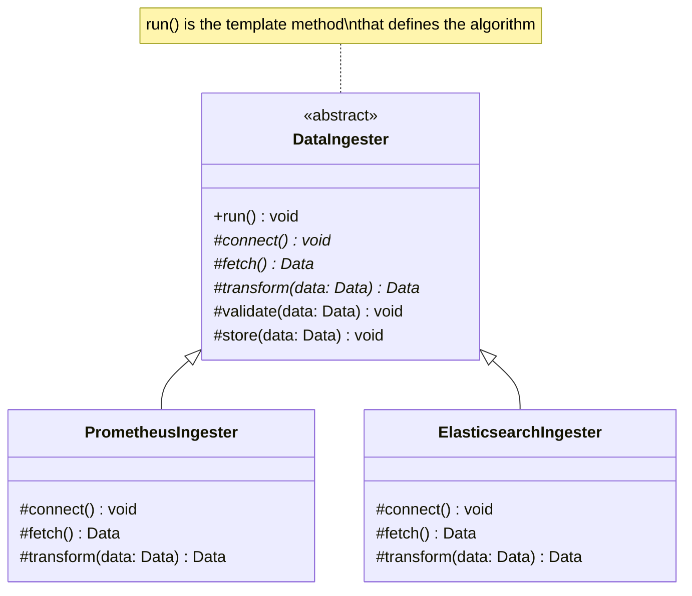

---
# Required
sidebar_position: 5
title: "Template Method Pattern — Algorithm Skeletons with Customizable Steps"
description: >-
  Learn the Template Method pattern to define algorithm skeletons with
  customizable steps. Perfect for frameworks, ETL pipelines, and workflows.

# SEO
keywords:
  - template method pattern
  - template pattern
  - algorithm skeleton
  - hollywood principle
  - framework pattern

difficulty: intermediate
category: behavioral
related_solid: [OCP, DIP]

# Social sharing
og_title: "Template Method Pattern: Algorithm Skeletons"
og_description: "Define the skeleton of an algorithm, letting subclasses fill in the details."
og_image: "/img/social-card.svg"

# Content management
date_published: 2026-01-25
date_modified: 2026-01-25
author: shivam
reading_time: 13
content_type: explanation
---

# Template Method Pattern

<PatternMeta>
  <Difficulty level="intermediate" />
  <TimeToRead minutes={13} />
  <Prerequisites patterns={["Strategy"]} />
</PatternMeta>

The data pipeline that couldn't handle new sources taught me why Template Method exists.

In 2021, our observability platform at NVIDIA ingested data from multiple sources—Prometheus metrics, Elasticsearch logs, and custom application events. Each pipeline followed the same workflow:

1. Connect to source
2. Fetch data
3. Transform to common format
4. Validate
5. Store in data lake

The first implementation duplicated this workflow in each pipeline:

```python
class PrometheusIngester:
    def run(self):
        self.connect_prometheus()
        data = self.fetch_prometheus_metrics()
        transformed = self.transform_prometheus_data(data)
        self.validate(transformed)
        self.store(transformed)

class ElasticsearchIngester:
    def run(self):
        self.connect_elasticsearch()
        data = self.fetch_elasticsearch_logs()
        transformed = self.transform_elasticsearch_data(data)
        self.validate(transformed)  # Same validation
        self.store(transformed)     # Same storage
```

When we needed to add retry logic to the fetch step, we had to modify every pipeline. When we added a new source, someone copied the wrong pipeline and missed the validation step. The workflow was duplicated everywhere, and each copy drifted slightly.

**Here's what I learned: when multiple classes share the same algorithm but differ in specific steps, define the algorithm once and let subclasses customize the varying steps.** That's Template Method.

```python
class DataIngester(ABC):
    def run(self):  # The template method - defines the algorithm
        self.connect()
        data = self.fetch()
        transformed = self.transform(data)
        self.validate(transformed)
        self.store(transformed)
    
    @abstractmethod
    def connect(self): pass
    
    @abstractmethod
    def fetch(self): pass
    
    @abstractmethod
    def transform(self, data): pass
```

Now the workflow lives in one place. New sources just implement the varying steps.

---

## What Is the Template Method Pattern?

> **Definition:** Template Method defines the skeleton of an algorithm in a method, deferring some steps to subclasses. It lets subclasses redefine certain steps without changing the algorithm's structure.

The parent class defines the overall workflow. Subclasses override specific steps (called "hook" methods) to customize behavior. The algorithm structure stays fixed; only the details vary.

**The key insight: Template Method inverts the usual control flow.** Instead of subclasses calling parent methods, the parent calls methods that subclasses override. This is sometimes called the "Hollywood Principle"—don't call us, we'll call you.

---

## Structure



### Key Components

| Component | Role |
|-----------|------|
| **Abstract Class** | Defines the template method and declares abstract steps |
| **Template Method** | Defines the algorithm skeleton, calls abstract and hook methods |
| **Abstract Steps** | Methods that subclasses must implement |
| **Hook Methods** | Methods with default implementations that subclasses can override |
| **Concrete Classes** | Implement the abstract steps |

### SOLID Principles Connection

- **Open/Closed:** Add new implementations without modifying the template
- **Dependency Inversion:** High-level algorithm doesn't depend on low-level details

---

## When to Use Template Method

✅ **Use it when:**

- Multiple classes have similar algorithms that differ in specific steps
- You want to control the extension points of a framework
- Common behavior should be localized in a single class
- You want to define "hooks" for subclass customization

❌ **Don't use it when:**

- The algorithm steps vary so much that there's no common skeleton
- Composition would be clearer (consider Strategy instead)
- You need to swap algorithms at runtime (Template Method uses inheritance)
- The variations are simple and don't justify the class hierarchy

**Rule of thumb:** If you're copying an algorithm between classes and changing specific steps, Template Method can eliminate that duplication.

---

## Implementation

<CodeTabs>
  <TabItem value="python" label="Python">
    ```python
    from abc import ABC, abstractmethod
    from dataclasses import dataclass
    from typing import Any


    @dataclass
    class DataRecord:
        source: str
        timestamp: str
        data: dict


    class DataIngester(ABC):
        """Abstract class defining the ingestion algorithm template."""
        
        def run(self) -> list[DataRecord]:
            """Template method - defines the algorithm skeleton."""
            self.connect()
            try:
                raw_data = self.fetch()
                transformed = self.transform(raw_data)
                self.validate(transformed)
                self.store(transformed)
                return transformed
            finally:
                self.disconnect()
        
        @abstractmethod
        def connect(self) -> None:
            """Connect to the data source."""
            pass
        
        @abstractmethod
        def fetch(self) -> Any:
            """Fetch raw data from the source."""
            pass
        
        @abstractmethod
        def transform(self, raw_data: Any) -> list[DataRecord]:
            """Transform raw data to common format."""
            pass
        
        def validate(self, records: list[DataRecord]) -> None:
            """Validate records. Hook method with default implementation."""
            for record in records:
                if not record.timestamp:
                    raise ValueError(f"Record missing timestamp: {record}")
            print(f"Validated {len(records)} records")
        
        def store(self, records: list[DataRecord]) -> None:
            """Store records. Hook method with default implementation."""
            print(f"Storing {len(records)} records to data lake")
        
        def disconnect(self) -> None:
            """Disconnect from source. Hook method."""
            print("Disconnected")


    class PrometheusIngester(DataIngester):
        """Concrete implementation for Prometheus metrics."""
        
        def __init__(self, endpoint: str) -> None:
            self.endpoint = endpoint
            self.client = None
        
        def connect(self) -> None:
            print(f"Connecting to Prometheus at {self.endpoint}")
            # In reality: self.client = PrometheusClient(self.endpoint)
        
        def fetch(self) -> dict:
            print("Fetching metrics from Prometheus")
            # In reality: return self.client.query_range(...)
            return {
                "status": "success",
                "data": {"result": [{"metric": {"__name__": "cpu_usage"}, "values": [[1234567890, "0.85"]]}]}
            }
        
        def transform(self, raw_data: dict) -> list[DataRecord]:
            records = []
            for result in raw_data.get("data", {}).get("result", []):
                for value in result.get("values", []):
                    records.append(DataRecord(
                        source="prometheus",
                        timestamp=str(value[0]),
                        data={"metric": result["metric"]["__name__"], "value": float(value[1])}
                    ))
            print(f"Transformed {len(records)} Prometheus metrics")
            return records


    class ElasticsearchIngester(DataIngester):
        """Concrete implementation for Elasticsearch logs."""
        
        def __init__(self, host: str, index: str) -> None:
            self.host = host
            self.index = index
        
        def connect(self) -> None:
            print(f"Connecting to Elasticsearch at {self.host}")
        
        def fetch(self) -> dict:
            print(f"Fetching logs from index {self.index}")
            return {
                "hits": {"hits": [
                    {"_source": {"@timestamp": "2024-01-15T10:30:00Z", "message": "Request processed", "level": "INFO"}}
                ]}
            }
        
        def transform(self, raw_data: dict) -> list[DataRecord]:
            records = []
            for hit in raw_data.get("hits", {}).get("hits", []):
                source = hit["_source"]
                records.append(DataRecord(
                    source="elasticsearch",
                    timestamp=source["@timestamp"],
                    data={"message": source["message"], "level": source["level"]}
                ))
            print(f"Transformed {len(records)} Elasticsearch logs")
            return records
        
        # Override hook method for custom validation
        def validate(self, records: list[DataRecord]) -> None:
            super().validate(records)
            for record in records:
                if record.data.get("level") not in ("DEBUG", "INFO", "WARN", "ERROR"):
                    raise ValueError(f"Invalid log level: {record}")


    # Usage
    prometheus = PrometheusIngester("http://prometheus:9090")
    prometheus.run()

    print()

    elasticsearch = ElasticsearchIngester("http://elasticsearch:9200", "logs-*")
    elasticsearch.run()
    ```
  </TabItem>
  <TabItem value="typescript" label="TypeScript">
    ```typescript
    interface DataRecord {
      source: string;
      timestamp: string;
      data: Record<string, unknown>;
    }

    abstract class DataIngester {
      // Template method - defines the algorithm skeleton
      run(): DataRecord[] {
        this.connect();
        try {
          const rawData = this.fetch();
          const transformed = this.transform(rawData);
          this.validate(transformed);
          this.store(transformed);
          return transformed;
        } finally {
          this.disconnect();
        }
      }

      protected abstract connect(): void;
      protected abstract fetch(): unknown;
      protected abstract transform(rawData: unknown): DataRecord[];

      // Hook method with default implementation
      protected validate(records: DataRecord[]): void {
        for (const record of records) {
          if (!record.timestamp) {
            throw new Error(`Record missing timestamp: ${JSON.stringify(record)}`);
          }
        }
        console.log(`Validated ${records.length} records`);
      }

      // Hook method with default implementation
      protected store(records: DataRecord[]): void {
        console.log(`Storing ${records.length} records to data lake`);
      }

      protected disconnect(): void {
        console.log("Disconnected");
      }
    }

    class PrometheusIngester extends DataIngester {
      constructor(private endpoint: string) {
        super();
      }

      protected connect(): void {
        console.log(`Connecting to Prometheus at ${this.endpoint}`);
      }

      protected fetch(): Record<string, unknown> {
        console.log("Fetching metrics from Prometheus");
        return {
          status: "success",
          data: {
            result: [
              { metric: { __name__: "cpu_usage" }, values: [["1234567890", "0.85"]] },
            ],
          },
        };
      }

      protected transform(rawData: Record<string, unknown>): DataRecord[] {
        const records: DataRecord[] = [];
        const data = rawData.data as { result: Array<{ metric: { __name__: string }; values: string[][] }> };
        
        for (const result of data.result) {
          for (const value of result.values) {
            records.push({
              source: "prometheus",
              timestamp: value[0],
              data: { metric: result.metric.__name__, value: parseFloat(value[1]) },
            });
          }
        }
        console.log(`Transformed ${records.length} Prometheus metrics`);
        return records;
      }
    }

    class ElasticsearchIngester extends DataIngester {
      constructor(
        private host: string,
        private index: string
      ) {
        super();
      }

      protected connect(): void {
        console.log(`Connecting to Elasticsearch at ${this.host}`);
      }

      protected fetch(): Record<string, unknown> {
        console.log(`Fetching logs from index ${this.index}`);
        return {
          hits: {
            hits: [
              {
                _source: {
                  "@timestamp": "2024-01-15T10:30:00Z",
                  message: "Request processed",
                  level: "INFO",
                },
              },
            ],
          },
        };
      }

      protected transform(rawData: Record<string, unknown>): DataRecord[] {
        const records: DataRecord[] = [];
        const hits = (rawData.hits as { hits: Array<{ _source: Record<string, string> }> }).hits;
        
        for (const hit of hits) {
          records.push({
            source: "elasticsearch",
            timestamp: hit._source["@timestamp"],
            data: { message: hit._source.message, level: hit._source.level },
          });
        }
        console.log(`Transformed ${records.length} Elasticsearch logs`);
        return records;
      }

      // Override hook for custom validation
      protected validate(records: DataRecord[]): void {
        super.validate(records);
        const validLevels = ["DEBUG", "INFO", "WARN", "ERROR"];
        for (const record of records) {
          if (!validLevels.includes(record.data.level as string)) {
            throw new Error(`Invalid log level: ${record.data.level}`);
          }
        }
      }
    }

    // Usage
    const prometheus = new PrometheusIngester("http://prometheus:9090");
    prometheus.run();

    console.log();

    const elasticsearch = new ElasticsearchIngester("http://elasticsearch:9200", "logs-*");
    elasticsearch.run();
    ```
  </TabItem>
  <TabItem value="go" label="Go">
    ```go
    package pipeline

    import "fmt"

    type DataRecord struct {
        Source    string
        Timestamp string
        Data      map[string]interface{}
    }

    // DataIngester defines the interface for the varying steps
    type DataIngester interface {
        Connect()
        Fetch() interface{}
        Transform(rawData interface{}) []DataRecord
        Validate(records []DataRecord) error
        Store(records []DataRecord)
        Disconnect()
    }

    // IngestionPipeline is the template that defines the algorithm
    type IngestionPipeline struct {
        ingester DataIngester
    }

    func NewIngestionPipeline(ingester DataIngester) *IngestionPipeline {
        return &IngestionPipeline{ingester: ingester}
    }

    // Run is the template method
    func (p *IngestionPipeline) Run() ([]DataRecord, error) {
        p.ingester.Connect()
        defer p.ingester.Disconnect()

        rawData := p.ingester.Fetch()
        transformed := p.ingester.Transform(rawData)
        
        if err := p.ingester.Validate(transformed); err != nil {
            return nil, err
        }
        
        p.ingester.Store(transformed)
        return transformed, nil
    }

    // BaseIngester provides default implementations for hook methods
    type BaseIngester struct{}

    func (b *BaseIngester) Validate(records []DataRecord) error {
        for _, record := range records {
            if record.Timestamp == "" {
                return fmt.Errorf("record missing timestamp")
            }
        }
        fmt.Printf("Validated %d records\n", len(records))
        return nil
    }

    func (b *BaseIngester) Store(records []DataRecord) {
        fmt.Printf("Storing %d records to data lake\n", len(records))
    }

    func (b *BaseIngester) Disconnect() {
        fmt.Println("Disconnected")
    }

    // PrometheusIngester implements DataIngester
    type PrometheusIngester struct {
        BaseIngester
        Endpoint string
    }

    func (p *PrometheusIngester) Connect() {
        fmt.Printf("Connecting to Prometheus at %s\n", p.Endpoint)
    }

    func (p *PrometheusIngester) Fetch() interface{} {
        fmt.Println("Fetching metrics from Prometheus")
        return map[string]interface{}{
            "status": "success",
            "data": map[string]interface{}{
                "result": []map[string]interface{}{
                    {"metric": map[string]string{"__name__": "cpu_usage"}, "values": [][]string{{"1234567890", "0.85"}}},
                },
            },
        }
    }

    func (p *PrometheusIngester) Transform(rawData interface{}) []DataRecord {
        // Transform logic here
        records := []DataRecord{
            {Source: "prometheus", Timestamp: "1234567890", Data: map[string]interface{}{"metric": "cpu_usage", "value": 0.85}},
        }
        fmt.Printf("Transformed %d Prometheus metrics\n", len(records))
        return records
    }

    // ElasticsearchIngester implements DataIngester
    type ElasticsearchIngester struct {
        BaseIngester
        Host  string
        Index string
    }

    func (e *ElasticsearchIngester) Connect() {
        fmt.Printf("Connecting to Elasticsearch at %s\n", e.Host)
    }

    func (e *ElasticsearchIngester) Fetch() interface{} {
        fmt.Printf("Fetching logs from index %s\n", e.Index)
        return map[string]interface{}{
            "hits": map[string]interface{}{
                "hits": []map[string]interface{}{
                    {"_source": map[string]string{"@timestamp": "2024-01-15T10:30:00Z", "message": "Request processed", "level": "INFO"}},
                },
            },
        }
    }

    func (e *ElasticsearchIngester) Transform(rawData interface{}) []DataRecord {
        records := []DataRecord{
            {Source: "elasticsearch", Timestamp: "2024-01-15T10:30:00Z", Data: map[string]interface{}{"message": "Request processed", "level": "INFO"}},
        }
        fmt.Printf("Transformed %d Elasticsearch logs\n", len(records))
        return records
    }
    ```
  </TabItem>
  <TabItem value="java" label="Java">
    ```java
    import java.util.*;

    record DataRecord(String source, String timestamp, Map<String, Object> data) {}

    abstract class DataIngester {
        // Template method - defines the algorithm skeleton
        public final List<DataRecord> run() {
            connect();
            try {
                Object rawData = fetch();
                List<DataRecord> transformed = transform(rawData);
                validate(transformed);
                store(transformed);
                return transformed;
            } finally {
                disconnect();
            }
        }

        protected abstract void connect();
        protected abstract Object fetch();
        protected abstract List<DataRecord> transform(Object rawData);

        // Hook method with default implementation
        protected void validate(List<DataRecord> records) {
            for (DataRecord record : records) {
                if (record.timestamp() == null || record.timestamp().isEmpty()) {
                    throw new IllegalArgumentException("Record missing timestamp");
                }
            }
            System.out.printf("Validated %d records%n", records.size());
        }

        // Hook method with default implementation
        protected void store(List<DataRecord> records) {
            System.out.printf("Storing %d records to data lake%n", records.size());
        }

        protected void disconnect() {
            System.out.println("Disconnected");
        }
    }

    class PrometheusIngester extends DataIngester {
        private final String endpoint;

        public PrometheusIngester(String endpoint) {
            this.endpoint = endpoint;
        }

        @Override
        protected void connect() {
            System.out.printf("Connecting to Prometheus at %s%n", endpoint);
        }

        @Override
        protected Object fetch() {
            System.out.println("Fetching metrics from Prometheus");
            return Map.of("status", "success", "data", Map.of(
                "result", List.of(Map.of(
                    "metric", Map.of("__name__", "cpu_usage"),
                    "values", List.of(List.of("1234567890", "0.85"))
                ))
            ));
        }

        @Override
        @SuppressWarnings("unchecked")
        protected List<DataRecord> transform(Object rawData) {
            List<DataRecord> records = new ArrayList<>();
            Map<String, Object> data = (Map<String, Object>) rawData;
            // Transform logic
            records.add(new DataRecord("prometheus", "1234567890", 
                Map.of("metric", "cpu_usage", "value", 0.85)));
            System.out.printf("Transformed %d Prometheus metrics%n", records.size());
            return records;
        }
    }

    class ElasticsearchIngester extends DataIngester {
        private final String host;
        private final String index;

        public ElasticsearchIngester(String host, String index) {
            this.host = host;
            this.index = index;
        }

        @Override
        protected void connect() {
            System.out.printf("Connecting to Elasticsearch at %s%n", host);
        }

        @Override
        protected Object fetch() {
            System.out.printf("Fetching logs from index %s%n", index);
            return Map.of("hits", Map.of("hits", List.of(
                Map.of("_source", Map.of(
                    "@timestamp", "2024-01-15T10:30:00Z",
                    "message", "Request processed",
                    "level", "INFO"
                ))
            )));
        }

        @Override
        protected List<DataRecord> transform(Object rawData) {
            List<DataRecord> records = new ArrayList<>();
            records.add(new DataRecord("elasticsearch", "2024-01-15T10:30:00Z",
                Map.of("message", "Request processed", "level", "INFO")));
            System.out.printf("Transformed %d Elasticsearch logs%n", records.size());
            return records;
        }

        @Override
        protected void validate(List<DataRecord> records) {
            super.validate(records);
            Set<String> validLevels = Set.of("DEBUG", "INFO", "WARN", "ERROR");
            for (DataRecord record : records) {
                String level = (String) record.data().get("level");
                if (!validLevels.contains(level)) {
                    throw new IllegalArgumentException("Invalid log level: " + level);
                }
            }
        }
    }
    ```
  </TabItem>
  <TabItem value="csharp" label="C#">
    ```csharp
    public record DataRecord(string Source, string Timestamp, Dictionary<string, object> Data);

    public abstract class DataIngester
    {
        // Template method - defines the algorithm skeleton
        public List<DataRecord> Run()
        {
            Connect();
            try
            {
                var rawData = Fetch();
                var transformed = Transform(rawData);
                Validate(transformed);
                Store(transformed);
                return transformed;
            }
            finally
            {
                Disconnect();
            }
        }

        protected abstract void Connect();
        protected abstract object Fetch();
        protected abstract List<DataRecord> Transform(object rawData);

        // Hook method with default implementation
        protected virtual void Validate(List<DataRecord> records)
        {
            foreach (var record in records)
            {
                if (string.IsNullOrEmpty(record.Timestamp))
                    throw new ArgumentException("Record missing timestamp");
            }
            Console.WriteLine($"Validated {records.Count} records");
        }

        // Hook method with default implementation
        protected virtual void Store(List<DataRecord> records)
        {
            Console.WriteLine($"Storing {records.Count} records to data lake");
        }

        protected virtual void Disconnect()
        {
            Console.WriteLine("Disconnected");
        }
    }

    public class PrometheusIngester : DataIngester
    {
        private readonly string _endpoint;

        public PrometheusIngester(string endpoint) => _endpoint = endpoint;

        protected override void Connect()
        {
            Console.WriteLine($"Connecting to Prometheus at {_endpoint}");
        }

        protected override object Fetch()
        {
            Console.WriteLine("Fetching metrics from Prometheus");
            return new { status = "success", data = new { result = new[] {
                new { metric = new { __name__ = "cpu_usage" }, values = new[] { new[] { "1234567890", "0.85" } } }
            }}};
        }

        protected override List<DataRecord> Transform(object rawData)
        {
            var records = new List<DataRecord>
            {
                new("prometheus", "1234567890", new Dictionary<string, object>
                {
                    ["metric"] = "cpu_usage",
                    ["value"] = 0.85
                })
            };
            Console.WriteLine($"Transformed {records.Count} Prometheus metrics");
            return records;
        }
    }

    public class ElasticsearchIngester : DataIngester
    {
        private readonly string _host;
        private readonly string _index;

        public ElasticsearchIngester(string host, string index)
        {
            _host = host;
            _index = index;
        }

        protected override void Connect()
        {
            Console.WriteLine($"Connecting to Elasticsearch at {_host}");
        }

        protected override object Fetch()
        {
            Console.WriteLine($"Fetching logs from index {_index}");
            return new { hits = new { hits = new[] {
                new { _source = new { timestamp = "2024-01-15T10:30:00Z", message = "Request processed", level = "INFO" } }
            }}};
        }

        protected override List<DataRecord> Transform(object rawData)
        {
            var records = new List<DataRecord>
            {
                new("elasticsearch", "2024-01-15T10:30:00Z", new Dictionary<string, object>
                {
                    ["message"] = "Request processed",
                    ["level"] = "INFO"
                })
            };
            Console.WriteLine($"Transformed {records.Count} Elasticsearch logs");
            return records;
        }

        protected override void Validate(List<DataRecord> records)
        {
            base.Validate(records);
            var validLevels = new HashSet<string> { "DEBUG", "INFO", "WARN", "ERROR" };
            foreach (var record in records)
            {
                var level = record.Data["level"]?.ToString();
                if (!validLevels.Contains(level ?? ""))
                    throw new ArgumentException($"Invalid log level: {level}");
            }
        }
    }
    ```
  </TabItem>
</CodeTabs>

---

## Template Method vs. Strategy

Both patterns deal with varying algorithms, but they differ in how:

| Aspect | Template Method | Strategy |
|--------|-----------------|----------|
| **Mechanism** | Inheritance | Composition |
| **What varies** | Steps within an algorithm | Entire algorithm |
| **When to decide** | Compile time (subclass) | Runtime (injection) |
| **Flexibility** | Less flexible | More flexible |
| **Use when** | Algorithm skeleton is fixed | Algorithms are completely different |

**Use Template Method** when the algorithm structure is fixed and only details vary.
**Use Strategy** when algorithms are interchangeable and decided at runtime.

---

## Common Mistakes

### 1. Template method that calls too many abstract methods

```python
# Bad: every step is abstract - no shared algorithm
class BadTemplate(ABC):
    def run(self):
        self.step1()  # abstract
        self.step2()  # abstract
        self.step3()  # abstract
        self.step4()  # abstract
        self.step5()  # abstract
```

If everything varies, there's no template. You might need Strategy instead.

### 2. Forgetting to make the template method final

```python
# Risk: subclass could override the entire algorithm
def run(self):  # Should be final in languages that support it
    self.connect()
    # ...
```

In languages like Java, mark the template method `final` to prevent overriding.

### 3. Hook methods with unclear contracts

```python
# Bad: what should validate() do? Raise? Return bool?
def validate(self, data):
    pass  # Unclear contract
```

Document what hook methods should do and what they can assume.

---

## Key Takeaways

- **Template Method defines algorithm skeleton with customizable steps.** The structure is fixed; details vary.

- **It uses inheritance to vary behavior.** Subclasses override hook methods.

- **The Hollywood Principle: "Don't call us, we'll call you."** Parent controls flow; children fill in details.

- **Consider Strategy for more flexibility.** Template Method is less flexible but simpler when it fits.

---

## Navigation

- **Previous:** [Command Pattern](/docs/design-patterns/behavioral/command)
- **Next:** [State Pattern](/docs/design-patterns/behavioral/state)
