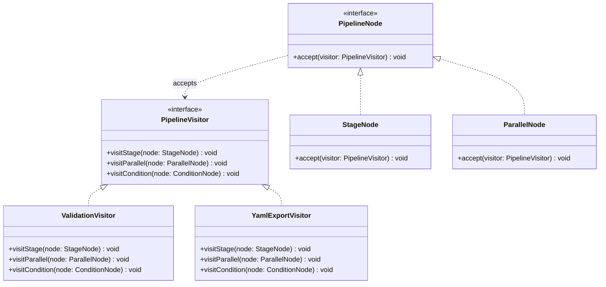

---
# Required
sidebar_position: 11
title: "Visitor Pattern — Operations on Object Structures"
description: >-
  Learn the Visitor pattern to add operations to object hierarchies without
  modifying them. Essential for AST processing, exporters, and analyzers.

# SEO
keywords:
  - visitor pattern
  - visitor design pattern
  - double dispatch
  - ast visitor
  - tree traversal pattern

difficulty: advanced
category: behavioral
related_solid: [OCP, SRP]

# Social sharing
og_title: "Visitor Pattern: Operations on Object Structures"
og_description: "Add new operations to object structures without changing the objects."
og_image: "/img/social-card.svg"

# Content management
date_published: 2026-01-25
date_modified: 2026-01-25
author: shivam
reading_time: 14
content_type: explanation
---

# Visitor Pattern

<PatternMeta>
  <Difficulty level="advanced" />
  <TimeToRead minutes={14} />
  <Prerequisites patterns={["Composite", "Strategy"]} />
</PatternMeta>

The pipeline validator that kept breaking the AST taught me why Visitor exists.

In 2021, our CI/CD platform at NVIDIA parsed pipeline definitions into an Abstract Syntax Tree (AST). Initially, operations on the AST were methods on each node:

```python
class StageNode:
    def validate(self): ...
    def to_yaml(self): ...
    def calculate_cost(self): ...

class ParallelNode:
    def validate(self): ...
    def to_yaml(self): ...
    def calculate_cost(self): ...
```

Every time we added a new operation (security scanning, dependency analysis, optimization), we modified every node class. Every time we added a new node type, we modified every operation. The AST classes bloated with unrelated operations. Adding a simple feature required changes to 15 files.

**Here's what I learned: when you have a stable object structure but need to add operations frequently, separate the operations from the structure.** That's Visitor.

```python
class ValidationVisitor(PipelineVisitor):
    def visit_stage(self, node: StageNode) -> None:
        # Validation logic in one place
        
    def visit_parallel(self, node: ParallelNode) -> None:
        # Validation logic for parallel nodes
```

Now adding a new operation means adding one new visitor class. The AST nodes stay unchanged.

---

## What Is the Visitor Pattern?

> **Definition:** Visitor lets you define a new operation without changing the classes of the elements on which it operates.

Visitor separates algorithms from the object structure they operate on. Objects in the structure "accept" visitors and let them perform operations. The visitor implements the operation for each type of element.

**The key insight: Visitor uses double dispatch.** The operation executed depends on both the visitor type and the element type.

---

## Structure



### Key Components

| Component | Role |
|-----------|------|
| **Visitor Interface** | Declares visit methods for each element type |
| **Concrete Visitors** | Implement operations for each element type |
| **Element Interface** | Declares accept method |
| **Concrete Elements** | Implement accept by calling visitor's visit method |

---

## When to Use Visitor

✅ **Use it when:**

- You need to perform operations on elements of a complex object structure
- Many distinct operations need to be performed, and you want to avoid polluting element classes
- The element class hierarchy is stable, but operations change frequently
- You're working with ASTs, document structures, or composite hierarchies

❌ **Don't use it when:**

- The element hierarchy changes frequently (adding elements requires updating all visitors)
- There's only one or two operations (just put them in the elements)
- Elements need to keep operation results private

**Rule of thumb:** Use Visitor when you have a stable set of element types but need to add operations regularly.

---

## Implementation

<CodeTabs>
  <TabItem value="python" label="Python">
    ```python
    from abc import ABC, abstractmethod
    from dataclasses import dataclass, field
    from typing import List


    class PipelineVisitor(ABC):
        """Visitor interface with a method for each node type."""
        
        @abstractmethod
        def visit_stage(self, node: "StageNode") -> None:
            pass
        
        @abstractmethod
        def visit_parallel(self, node: "ParallelNode") -> None:
            pass
        
        @abstractmethod
        def visit_condition(self, node: "ConditionNode") -> None:
            pass


    class PipelineNode(ABC):
        """Element interface."""
        
        @abstractmethod
        def accept(self, visitor: PipelineVisitor) -> None:
            pass


    @dataclass
    class StageNode(PipelineNode):
        """A single stage in the pipeline."""
        name: str
        image: str
        commands: List[str]
        
        def accept(self, visitor: PipelineVisitor) -> None:
            visitor.visit_stage(self)


    @dataclass
    class ParallelNode(PipelineNode):
        """Parallel execution of multiple stages."""
        stages: List[StageNode] = field(default_factory=list)
        
        def accept(self, visitor: PipelineVisitor) -> None:
            visitor.visit_parallel(self)
            for stage in self.stages:
                stage.accept(visitor)


    @dataclass 
    class ConditionNode(PipelineNode):
        """Conditional execution."""
        condition: str
        if_true: PipelineNode
        if_false: PipelineNode = None
        
        def accept(self, visitor: PipelineVisitor) -> None:
            visitor.visit_condition(self)
            self.if_true.accept(visitor)
            if self.if_false:
                self.if_false.accept(visitor)


    # Concrete Visitors

    class ValidationVisitor(PipelineVisitor):
        """Validates pipeline structure."""
        
        def __init__(self) -> None:
            self.errors: List[str] = []
        
        def visit_stage(self, node: StageNode) -> None:
            if not node.name:
                self.errors.append("Stage missing name")
            if not node.image:
                self.errors.append(f"Stage '{node.name}' missing image")
            if not node.commands:
                self.errors.append(f"Stage '{node.name}' has no commands")
            print(f"[Validate] Stage '{node.name}': {'OK' if not self.errors else 'ERRORS'}")
        
        def visit_parallel(self, node: ParallelNode) -> None:
            if len(node.stages) < 2:
                self.errors.append("Parallel block needs at least 2 stages")
            print(f"[Validate] Parallel block with {len(node.stages)} stages")
        
        def visit_condition(self, node: ConditionNode) -> None:
            if not node.condition:
                self.errors.append("Condition missing expression")
            print(f"[Validate] Condition: '{node.condition}'")


    class YamlExportVisitor(PipelineVisitor):
        """Exports pipeline to YAML format."""
        
        def __init__(self) -> None:
            self.output: List[str] = []
            self.indent = 0
        
        def _add_line(self, line: str) -> None:
            self.output.append("  " * self.indent + line)
        
        def visit_stage(self, node: StageNode) -> None:
            self._add_line(f"- name: {node.name}")
            self.indent += 1
            self._add_line(f"image: {node.image}")
            self._add_line("script:")
            self.indent += 1
            for cmd in node.commands:
                self._add_line(f"- {cmd}")
            self.indent -= 2
        
        def visit_parallel(self, node: ParallelNode) -> None:
            self._add_line("parallel:")
            self.indent += 1
        
        def visit_condition(self, node: ConditionNode) -> None:
            self._add_line(f"when: {node.condition}")
        
        def get_yaml(self) -> str:
            return "\n".join(self.output)


    class CostEstimationVisitor(PipelineVisitor):
        """Estimates pipeline execution cost."""
        
        # Cost per minute by image type
        IMAGE_COSTS = {
            "node": 0.01,
            "python": 0.01,
            "golang": 0.02,
            "nvidia/cuda": 0.50,
            "default": 0.01,
        }
        
        def __init__(self) -> None:
            self.total_cost = 0.0
            self.details: List[str] = []
        
        def _get_cost_per_minute(self, image: str) -> float:
            for prefix, cost in self.IMAGE_COSTS.items():
                if image.startswith(prefix):
                    return cost
            return self.IMAGE_COSTS["default"]
        
        def visit_stage(self, node: StageNode) -> None:
            estimated_minutes = len(node.commands) * 2  # Simple estimate
            cost_per_min = self._get_cost_per_minute(node.image)
            stage_cost = estimated_minutes * cost_per_min
            self.total_cost += stage_cost
            self.details.append(f"  {node.name}: ${stage_cost:.2f} ({estimated_minutes} min)")
        
        def visit_parallel(self, node: ParallelNode) -> None:
            # Parallel stages: cost is max, not sum (they run simultaneously)
            self.details.append("  [Parallel block - stages run simultaneously]")
        
        def visit_condition(self, node: ConditionNode) -> None:
            self.details.append(f"  [Conditional: {node.condition}]")


    # Usage
    pipeline = ParallelNode(stages=[
        StageNode("build", "node:18", ["npm install", "npm run build"]),
        StageNode("lint", "node:18", ["npm run lint"]),
    ])

    # Validate
    print("=== Validation ===")
    validator = ValidationVisitor()
    pipeline.accept(validator)
    print(f"Errors: {validator.errors}")

    # Export to YAML
    print("\n=== YAML Export ===")
    exporter = YamlExportVisitor()
    pipeline.accept(exporter)
    print(exporter.get_yaml())

    # Estimate cost
    print("\n=== Cost Estimation ===")
    estimator = CostEstimationVisitor()
    pipeline.accept(estimator)
    print(f"Total estimated cost: ${estimator.total_cost:.2f}")
    for detail in estimator.details:
        print(detail)
    ```
  </TabItem>
  <TabItem value="typescript" label="TypeScript">
    ```typescript
    interface PipelineVisitor {
      visitStage(node: StageNode): void;
      visitParallel(node: ParallelNode): void;
      visitCondition(node: ConditionNode): void;
    }

    interface PipelineNode {
      accept(visitor: PipelineVisitor): void;
    }

    class StageNode implements PipelineNode {
      constructor(
        public name: string,
        public image: string,
        public commands: string[]
      ) {}

      accept(visitor: PipelineVisitor): void {
        visitor.visitStage(this);
      }
    }

    class ParallelNode implements PipelineNode {
      constructor(public stages: StageNode[] = []) {}

      accept(visitor: PipelineVisitor): void {
        visitor.visitParallel(this);
        for (const stage of this.stages) {
          stage.accept(visitor);
        }
      }
    }

    class ConditionNode implements PipelineNode {
      constructor(
        public condition: string,
        public ifTrue: PipelineNode,
        public ifFalse?: PipelineNode
      ) {}

      accept(visitor: PipelineVisitor): void {
        visitor.visitCondition(this);
        this.ifTrue.accept(visitor);
        this.ifFalse?.accept(visitor);
      }
    }

    class ValidationVisitor implements PipelineVisitor {
      errors: string[] = [];

      visitStage(node: StageNode): void {
        if (!node.name) this.errors.push("Stage missing name");
        if (!node.image) this.errors.push(`Stage '${node.name}' missing image`);
        if (!node.commands.length)
          this.errors.push(`Stage '${node.name}' has no commands`);
        console.log(
          `[Validate] Stage '${node.name}': ${this.errors.length === 0 ? "OK" : "ERRORS"}`
        );
      }

      visitParallel(node: ParallelNode): void {
        if (node.stages.length < 2) {
          this.errors.push("Parallel block needs at least 2 stages");
        }
        console.log(`[Validate] Parallel block with ${node.stages.length} stages`);
      }

      visitCondition(node: ConditionNode): void {
        if (!node.condition) this.errors.push("Condition missing expression");
        console.log(`[Validate] Condition: '${node.condition}'`);
      }
    }

    class YamlExportVisitor implements PipelineVisitor {
      private output: string[] = [];
      private indentLevel = 0;

      private addLine(line: string): void {
        this.output.push("  ".repeat(this.indentLevel) + line);
      }

      visitStage(node: StageNode): void {
        this.addLine(`- name: ${node.name}`);
        this.indentLevel++;
        this.addLine(`image: ${node.image}`);
        this.addLine("script:");
        this.indentLevel++;
        for (const cmd of node.commands) {
          this.addLine(`- ${cmd}`);
        }
        this.indentLevel -= 2;
      }

      visitParallel(node: ParallelNode): void {
        this.addLine("parallel:");
        this.indentLevel++;
      }

      visitCondition(node: ConditionNode): void {
        this.addLine(`when: ${node.condition}`);
      }

      getYaml(): string {
        return this.output.join("\n");
      }
    }

    class CostEstimationVisitor implements PipelineVisitor {
      private static IMAGE_COSTS: Record<string, number> = {
        node: 0.01,
        python: 0.01,
        "nvidia/cuda": 0.5,
        default: 0.01,
      };

      totalCost = 0;
      details: string[] = [];

      visitStage(node: StageNode): void {
        const estimatedMinutes = node.commands.length * 2;
        const costPerMin = this.getCostPerMinute(node.image);
        const stageCost = estimatedMinutes * costPerMin;
        this.totalCost += stageCost;
        this.details.push(
          `  ${node.name}: $${stageCost.toFixed(2)} (${estimatedMinutes} min)`
        );
      }

      visitParallel(node: ParallelNode): void {
        this.details.push("  [Parallel block - stages run simultaneously]");
      }

      visitCondition(node: ConditionNode): void {
        this.details.push(`  [Conditional: ${node.condition}]`);
      }

      private getCostPerMinute(image: string): number {
        for (const [prefix, cost] of Object.entries(
          CostEstimationVisitor.IMAGE_COSTS
        )) {
          if (image.startsWith(prefix)) return cost;
        }
        return CostEstimationVisitor.IMAGE_COSTS.default;
      }
    }

    // Usage
    const pipeline = new ParallelNode([
      new StageNode("build", "node:18", ["npm install", "npm run build"]),
      new StageNode("lint", "node:18", ["npm run lint"]),
    ]);

    console.log("=== Validation ===");
    const validator = new ValidationVisitor();
    pipeline.accept(validator);

    console.log("\n=== YAML Export ===");
    const exporter = new YamlExportVisitor();
    pipeline.accept(exporter);
    console.log(exporter.getYaml());

    console.log("\n=== Cost Estimation ===");
    const estimator = new CostEstimationVisitor();
    pipeline.accept(estimator);
    console.log(`Total: $${estimator.totalCost.toFixed(2)}`);
    ```
  </TabItem>
  <TabItem value="go" label="Go">
    ```go
    package visitor

    import (
        "fmt"
        "strings"
    )

    // Visitor interface
    type PipelineVisitor interface {
        VisitStage(node *StageNode)
        VisitParallel(node *ParallelNode)
        VisitCondition(node *ConditionNode)
    }

    // Element interface
    type PipelineNode interface {
        Accept(visitor PipelineVisitor)
    }

    // Concrete elements

    type StageNode struct {
        Name     string
        Image    string
        Commands []string
    }

    func (s *StageNode) Accept(visitor PipelineVisitor) {
        visitor.VisitStage(s)
    }

    type ParallelNode struct {
        Stages []*StageNode
    }

    func (p *ParallelNode) Accept(visitor PipelineVisitor) {
        visitor.VisitParallel(p)
        for _, stage := range p.Stages {
            stage.Accept(visitor)
        }
    }

    type ConditionNode struct {
        Condition string
        IfTrue    PipelineNode
        IfFalse   PipelineNode
    }

    func (c *ConditionNode) Accept(visitor PipelineVisitor) {
        visitor.VisitCondition(c)
        c.IfTrue.Accept(visitor)
        if c.IfFalse != nil {
            c.IfFalse.Accept(visitor)
        }
    }

    // Concrete visitors

    type ValidationVisitor struct {
        Errors []string
    }

    func (v *ValidationVisitor) VisitStage(node *StageNode) {
        if node.Name == "" {
            v.Errors = append(v.Errors, "Stage missing name")
        }
        if node.Image == "" {
            v.Errors = append(v.Errors, fmt.Sprintf("Stage '%s' missing image", node.Name))
        }
        status := "OK"
        if len(v.Errors) > 0 {
            status = "ERRORS"
        }
        fmt.Printf("[Validate] Stage '%s': %s\n", node.Name, status)
    }

    func (v *ValidationVisitor) VisitParallel(node *ParallelNode) {
        if len(node.Stages) < 2 {
            v.Errors = append(v.Errors, "Parallel block needs at least 2 stages")
        }
        fmt.Printf("[Validate] Parallel block with %d stages\n", len(node.Stages))
    }

    func (v *ValidationVisitor) VisitCondition(node *ConditionNode) {
        if node.Condition == "" {
            v.Errors = append(v.Errors, "Condition missing expression")
        }
        fmt.Printf("[Validate] Condition: '%s'\n", node.Condition)
    }

    type YamlExportVisitor struct {
        Output      []string
        IndentLevel int
    }

    func (y *YamlExportVisitor) addLine(line string) {
        indent := strings.Repeat("  ", y.IndentLevel)
        y.Output = append(y.Output, indent+line)
    }

    func (y *YamlExportVisitor) VisitStage(node *StageNode) {
        y.addLine(fmt.Sprintf("- name: %s", node.Name))
        y.IndentLevel++
        y.addLine(fmt.Sprintf("image: %s", node.Image))
        y.addLine("script:")
        y.IndentLevel++
        for _, cmd := range node.Commands {
            y.addLine(fmt.Sprintf("- %s", cmd))
        }
        y.IndentLevel -= 2
    }

    func (y *YamlExportVisitor) VisitParallel(node *ParallelNode) {
        y.addLine("parallel:")
        y.IndentLevel++
    }

    func (y *YamlExportVisitor) VisitCondition(node *ConditionNode) {
        y.addLine(fmt.Sprintf("when: %s", node.Condition))
    }

    func (y *YamlExportVisitor) GetYaml() string {
        return strings.Join(y.Output, "\n")
    }
    ```
  </TabItem>
  <TabItem value="java" label="Java">
    ```java
    import java.util.*;

    interface PipelineVisitor {
        void visitStage(StageNode node);
        void visitParallel(ParallelNode node);
        void visitCondition(ConditionNode node);
    }

    interface PipelineNode {
        void accept(PipelineVisitor visitor);
    }

    record StageNode(String name, String image, List<String> commands) implements PipelineNode {
        @Override
        public void accept(PipelineVisitor visitor) {
            visitor.visitStage(this);
        }
    }

    class ParallelNode implements PipelineNode {
        private final List<StageNode> stages;

        public ParallelNode(List<StageNode> stages) {
            this.stages = stages;
        }

        public List<StageNode> stages() { return stages; }

        @Override
        public void accept(PipelineVisitor visitor) {
            visitor.visitParallel(this);
            for (StageNode stage : stages) {
                stage.accept(visitor);
            }
        }
    }

    class ConditionNode implements PipelineNode {
        private final String condition;
        private final PipelineNode ifTrue;
        private final PipelineNode ifFalse;

        public ConditionNode(String condition, PipelineNode ifTrue, PipelineNode ifFalse) {
            this.condition = condition;
            this.ifTrue = ifTrue;
            this.ifFalse = ifFalse;
        }

        public String condition() { return condition; }

        @Override
        public void accept(PipelineVisitor visitor) {
            visitor.visitCondition(this);
            ifTrue.accept(visitor);
            if (ifFalse != null) ifFalse.accept(visitor);
        }
    }

    class ValidationVisitor implements PipelineVisitor {
        private final List<String> errors = new ArrayList<>();

        public List<String> errors() { return errors; }

        @Override
        public void visitStage(StageNode node) {
            if (node.name() == null || node.name().isEmpty()) {
                errors.add("Stage missing name");
            }
            if (node.image() == null || node.image().isEmpty()) {
                errors.add("Stage '" + node.name() + "' missing image");
            }
            String status = errors.isEmpty() ? "OK" : "ERRORS";
            System.out.printf("[Validate] Stage '%s': %s%n", node.name(), status);
        }

        @Override
        public void visitParallel(ParallelNode node) {
            if (node.stages().size() < 2) {
                errors.add("Parallel block needs at least 2 stages");
            }
            System.out.printf("[Validate] Parallel block with %d stages%n", node.stages().size());
        }

        @Override
        public void visitCondition(ConditionNode node) {
            if (node.condition() == null || node.condition().isEmpty()) {
                errors.add("Condition missing expression");
            }
            System.out.printf("[Validate] Condition: '%s'%n", node.condition());
        }
    }

    class YamlExportVisitor implements PipelineVisitor {
        private final List<String> output = new ArrayList<>();
        private int indentLevel = 0;

        private void addLine(String line) {
            output.add("  ".repeat(indentLevel) + line);
        }

        @Override
        public void visitStage(StageNode node) {
            addLine("- name: " + node.name());
            indentLevel++;
            addLine("image: " + node.image());
            addLine("script:");
            indentLevel++;
            for (String cmd : node.commands()) {
                addLine("- " + cmd);
            }
            indentLevel -= 2;
        }

        @Override
        public void visitParallel(ParallelNode node) {
            addLine("parallel:");
            indentLevel++;
        }

        @Override
        public void visitCondition(ConditionNode node) {
            addLine("when: " + node.condition());
        }

        public String getYaml() {
            return String.join("\n", output);
        }
    }
    ```
  </TabItem>
  <TabItem value="csharp" label="C#">
    ```csharp
    public interface IPipelineVisitor
    {
        void VisitStage(StageNode node);
        void VisitParallel(ParallelNode node);
        void VisitCondition(ConditionNode node);
    }

    public interface IPipelineNode
    {
        void Accept(IPipelineVisitor visitor);
    }

    public record StageNode(string Name, string Image, List<string> Commands) : IPipelineNode
    {
        public void Accept(IPipelineVisitor visitor) => visitor.VisitStage(this);
    }

    public class ParallelNode : IPipelineNode
    {
        public List<StageNode> Stages { get; }

        public ParallelNode(List<StageNode> stages) => Stages = stages;

        public void Accept(IPipelineVisitor visitor)
        {
            visitor.VisitParallel(this);
            foreach (var stage in Stages)
                stage.Accept(visitor);
        }
    }

    public class ConditionNode : IPipelineNode
    {
        public string Condition { get; }
        public IPipelineNode IfTrue { get; }
        public IPipelineNode? IfFalse { get; }

        public ConditionNode(string condition, IPipelineNode ifTrue, IPipelineNode? ifFalse = null)
        {
            Condition = condition;
            IfTrue = ifTrue;
            IfFalse = ifFalse;
        }

        public void Accept(IPipelineVisitor visitor)
        {
            visitor.VisitCondition(this);
            IfTrue.Accept(visitor);
            IfFalse?.Accept(visitor);
        }
    }

    public class ValidationVisitor : IPipelineVisitor
    {
        public List<string> Errors { get; } = new();

        public void VisitStage(StageNode node)
        {
            if (string.IsNullOrEmpty(node.Name))
                Errors.Add("Stage missing name");
            if (string.IsNullOrEmpty(node.Image))
                Errors.Add($"Stage '{node.Name}' missing image");

            var status = Errors.Count == 0 ? "OK" : "ERRORS";
            Console.WriteLine($"[Validate] Stage '{node.Name}': {status}");
        }

        public void VisitParallel(ParallelNode node)
        {
            if (node.Stages.Count < 2)
                Errors.Add("Parallel block needs at least 2 stages");
            Console.WriteLine($"[Validate] Parallel block with {node.Stages.Count} stages");
        }

        public void VisitCondition(ConditionNode node)
        {
            if (string.IsNullOrEmpty(node.Condition))
                Errors.Add("Condition missing expression");
            Console.WriteLine($"[Validate] Condition: '{node.Condition}'");
        }
    }

    public class YamlExportVisitor : IPipelineVisitor
    {
        private readonly List<string> _output = new();
        private int _indentLevel;

        private void AddLine(string line) =>
            _output.Add(new string(' ', _indentLevel * 2) + line);

        public void VisitStage(StageNode node)
        {
            AddLine($"- name: {node.Name}");
            _indentLevel++;
            AddLine($"image: {node.Image}");
            AddLine("script:");
            _indentLevel++;
            foreach (var cmd in node.Commands)
                AddLine($"- {cmd}");
            _indentLevel -= 2;
        }

        public void VisitParallel(ParallelNode node)
        {
            AddLine("parallel:");
            _indentLevel++;
        }

        public void VisitCondition(ConditionNode node) =>
            AddLine($"when: {node.Condition}");

        public string GetYaml() => string.Join("\n", _output);
    }
    ```
  </TabItem>
</CodeTabs>

---

## Double Dispatch Explained

Visitor uses "double dispatch" to select the right operation:

```python
# First dispatch: element.accept(visitor) - selects element type
# Second dispatch: visitor.visit_stage(self) - selects visitor type

class StageNode:
    def accept(self, visitor):
        visitor.visit_stage(self)  # Calls the right method for this type
```

Without double dispatch, you'd need type checking:

```python
# Bad: manual type checking
def process(node, operation):
    if isinstance(node, StageNode):
        if operation == "validate":
            validate_stage(node)
        elif operation == "export":
            export_stage(node)
```

Double dispatch makes this automatic and type-safe.

---

## Common Mistakes

### 1. Adding new element types frequently

```python
# Problem: adding LoopNode requires changing ALL visitors
class LoopNode(PipelineNode):
    def accept(self, visitor):
        visitor.visit_loop(self)  # Every visitor needs this method!
```

Visitor works best when element types are stable.

### 2. Visitor that modifies elements

```python
# Bad: visitor shouldn't modify elements
class BadVisitor(PipelineVisitor):
    def visit_stage(self, node):
        node.name = node.name.upper()  # Side effect!
```

Visitors should compute results, not modify elements.

---

## Key Takeaways

- **Visitor separates operations from object structure.** Add operations without changing elements.

- **It uses double dispatch.** Operation depends on both visitor and element type.

- **Best when element types are stable.** Adding elements requires updating all visitors.

- **Common for ASTs, exporters, analyzers.** Any operation across a type hierarchy.

---

## Navigation

- **Previous:** [Memento Pattern](/docs/design-patterns/behavioral/memento)
- **Next:** [Modern Patterns](/docs/design-patterns/modern)
