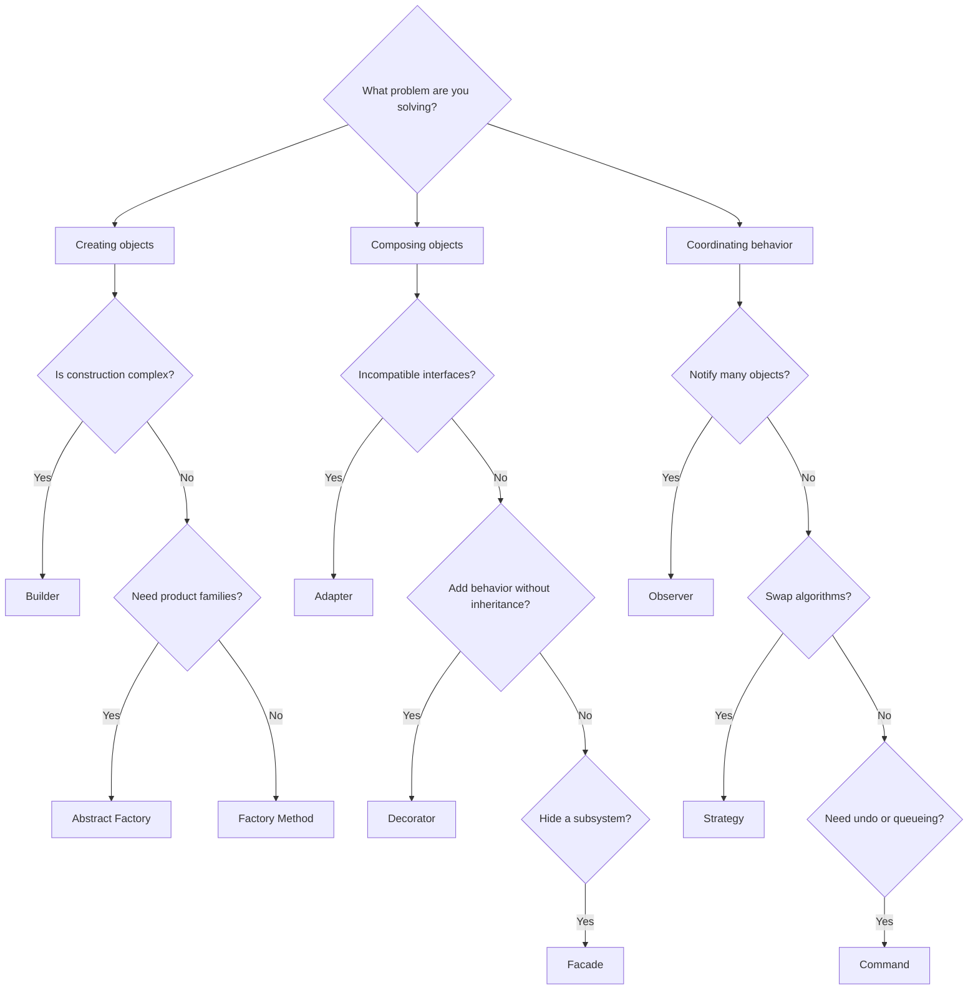

---
# Required
sidebar_position: 2
title: "Design Patterns Catalog — Complete List"
description: >-
  Browse a complete catalog of design patterns with quick descriptions,
  families, and links to deep dives. Use this as your map.

# SEO
keywords:
  - design patterns catalog
  - list of design patterns
  - all design patterns
  - design pattern families
  - creational structural behavioral

# Social sharing
og_title: "Design Patterns Catalog: The Full Map"
og_description: "A complete catalog of classic and modern patterns with quick guidance."
og_image: "/img/social-card.svg"

# Content management
date_published: 2026-01-25
date_modified: 2026-01-25
author: shivam
reading_time: 12
content_type: reference
---

# Design Patterns Catalog

When I was scaling build pipelines across teams, I kept a personal checklist of patterns that showed up over and over: factories for plugin construction, strategies for environment-specific logic, and observers for telemetry fan-out. That list turned into a map I could use to navigate new codebases quickly.

This page is that map, formalized.

## Quick Catalog by Family

| Family | Patterns |
|--------|----------|
| **Creational** | Factory Method, Abstract Factory, Builder, Prototype, Singleton |
| **Structural** | Adapter, Bridge, Composite, Decorator, Facade, Flyweight, Proxy |
| **Behavioral** | Chain of Responsibility, Command, Interpreter, Iterator, Mediator, Memento, Observer, State, Strategy, Template Method, Visitor |
| **Modern** | Repository, Unit of Work, Dependency Injection, Circuit Breaker, Saga, Event Sourcing, CQRS |
| **Frontend** | Module, Container/Presentational, Render Props and HOC, Hooks |
| **Concurrency** | Thread Pool, Producer-Consumer, Read-Write Lock, Active Object, Future/Promise |
| **Cloud Resiliency** | Bulkhead, Retry, Strangler Fig, Sidecar |
| **DDD** | Aggregate Root, Entity vs Value Object, Bounded Context, Domain Events |
| **Data Access** | DTO, Active Record, Data Mapper, Identity Map |
| **Reactive** | Observable, Backpressure, Operator Composition |
| **API** | Pagination, Rate Limiting, Versioning |
| **Additional** | Null Object, Specification, Object Pool, Lazy Initialization, Service Locator |

## Pattern Selection Decision Tree

Use this when you feel the code is getting messy but cannot name the pattern yet.

## Complexity vs Frequency

Patterns are most valuable when the problem repeats. Use this to sanity-check whether the complexity is justified.

| Pattern Family | Complexity | Frequency in Production |
|---------------|------------|-------------------------|
| Creational | Medium | High |
| Structural | Medium | Medium |
| Behavioral | Medium to High | High |
| Modern | High | High |
| Concurrency | High | Medium |
| Cloud Resiliency | High | High |

## Where to Go Next

If you want a guided path, follow the learning paths. If you are troubleshooting, jump to the selection framework. If you already know the pattern name, use the sidebar.

## Navigation

- **Previous:** [Design Patterns Introduction](/docs/design-patterns/introduction)
- **Next:** [Pattern Selection Framework](/docs/design-patterns/choosing-patterns)
