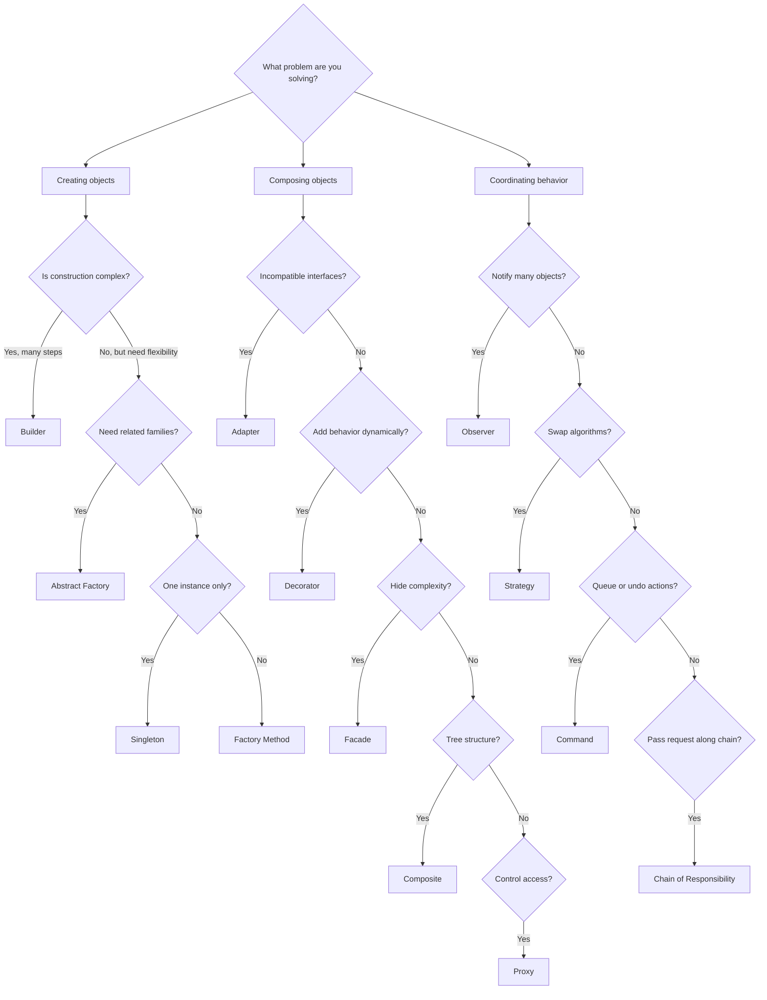

---
# Required
sidebar_position: 2
title: "Design Patterns Catalog — Complete Reference"
description: >-
  A complete catalog of design patterns with quick descriptions, difficulty
  ratings, and links to deep dives. Use this as your map to navigate patterns.

# SEO
keywords:
  - design patterns catalog
  - list of design patterns
  - all design patterns
  - design pattern families
  - creational structural behavioral
  - gang of four patterns

# Social sharing
og_title: "Design Patterns Catalog: The Complete Map"
og_description: "A complete catalog of classic and modern patterns with practical guidance."
og_image: "/img/social-card.svg"

# Content management
date_published: 2026-01-25
date_modified: 2026-01-25
author: shivam
reading_time: 10
content_type: reference
---

# Design Patterns Catalog

When I was scaling build pipelines across teams at NVIDIA, I kept a personal checklist of patterns that showed up in every major refactoring: factories for plugin construction, strategies for environment-specific deployment logic, and observers for telemetry fan-out across our monitoring systems. Over four years, I noticed the same dozen patterns solving 90% of our design problems.

That checklist eventually became this catalog—a map I use to navigate new codebases and design new systems.

**This page is your navigation hub.** Bookmark it and come back whenever you're looking for a pattern to solve a specific problem.

---

## Quick Catalog by Family

Here's every pattern we cover, organized by what kind of problem it solves.

| Family | Patterns | When You Need Them |
|--------|----------|-------------------|
| **Creational** | Factory Method, Abstract Factory, Builder, Prototype, Singleton | Object creation is complex, varies by context, or needs central control |
| **Structural** | Adapter, Bridge, Composite, Decorator, Facade, Flyweight, Proxy | You need to compose objects, wrap interfaces, or simplify subsystems |
| **Behavioral** | Chain of Responsibility, Command, Iterator, Mediator, Memento, Observer, State, Strategy, Template Method, Visitor | You need to coordinate behavior, handle events, or vary algorithms |

### Extended Pattern Families

Beyond the classic GoF patterns, modern systems use additional patterns for specific domains:

| Family | Patterns | Domain |
|--------|----------|--------|
| **Modern** | Repository, Unit of Work, Dependency Injection, Circuit Breaker, Saga, Event Sourcing, CQRS | Enterprise applications, microservices |
| **Frontend** | Module, Container/Presentational, Render Props, Hooks, HOC | React, Vue, UI architecture |
| **Concurrency** | Thread Pool, Producer-Consumer, Read-Write Lock, Active Object, Future/Promise | Parallel processing, async systems |
| **Cloud Resiliency** | Bulkhead, Retry, Strangler Fig, Sidecar | Distributed systems, Kubernetes |
| **DDD** | Aggregate Root, Entity vs Value Object, Bounded Context, Domain Events | Domain-driven design |
| **Data Access** | DTO, Active Record, Data Mapper, Identity Map | Database layers |

---

## The Patterns You'll Use Most Often

Not all patterns are equally useful in practice. Based on my experience building platforms that serve thousands of developers, here are the patterns I reach for constantly:

### The Essential Five

If you learn nothing else, learn these. They'll solve problems you encounter weekly:

| Pattern | One-Line Summary | Where I've Used It |
|---------|-----------------|-------------------|
| **Factory Method** | Create objects without specifying concrete classes | Plugin systems, notification channels, exporters |
| **Strategy** | Swap algorithms without changing clients | Deployment backends, authentication providers |
| **Observer** | Notify multiple objects when state changes | Event systems, dashboard updates, telemetry |
| **Adapter** | Make incompatible interfaces work together | Legacy integrations, third-party APIs |
| **Decorator** | Add behavior without modifying code | Logging, retries, metrics, caching |

### The "Once You Need Them, You Really Need Them" Tier

These patterns solve less common problems, but when those problems appear, nothing else works as well:

| Pattern | One-Line Summary | When It Shines |
|---------|-----------------|----------------|
| **Builder** | Construct complex objects step by step | Configs with 10+ optional fields |
| **Facade** | Simplify a complex subsystem | Onboarding APIs, SDK design |
| **Composite** | Treat single objects and groups uniformly | Pipelines, org charts, file systems |
| **Proxy** | Control access to an object | Caching, lazy loading, rate limiting |

:::info Behavioral Patterns Coming Soon
Detailed pages for behavioral patterns (Strategy, Observer, Command, State, etc.) are currently being written. See the [Behavioral Patterns Overview](/docs/design-patterns/behavioral) for a preview of what's coming.
:::

---

## Pattern Selection Decision Tree

Use this when you feel the code is getting messy but can't name the pattern yet.

---

## Complexity vs. Frequency Matrix

Patterns are most valuable when the problem repeats. Use this to sanity-check whether the complexity is justified:

| Pattern | Complexity | How Often I Use It | Verdict |
|---------|------------|-------------------|---------|
| Factory Method | Low | Weekly | Learn immediately |
| Strategy | Low | Weekly | Learn immediately |
| Observer | Medium | Weekly | Learn immediately |
| Adapter | Low | Monthly | Learn early |
| Decorator | Medium | Monthly | Learn early |
| Builder | Medium | Monthly | Learn early |
| Facade | Low | Monthly | Learn early |
| Singleton | Low | Occasionally | Know the trade-offs |
| Composite | Medium | Occasionally | Learn when needed |
| Proxy | Medium | Occasionally | Learn when needed |
| Abstract Factory | High | Rarely | Learn when needed |
| Prototype | Medium | Rarely | Learn when needed |
| Bridge | High | Rarely | Learn when needed |
| Flyweight | High | Rarely | Learn when needed |

The pattern rule I follow: **if I've used a pattern less than three times in production, I probably shouldn't add it to new code without careful thought.**

---

## Patterns by Problem Domain

Sometimes you know the domain better than the problem. Here's how patterns cluster by the kind of system you're building:

### Building a CI/CD Platform?

- **Factory Method** for creating build step handlers
- **Strategy** for deployment backends (K8s, VM, serverless)
- **Observer** for build status notifications
- **Decorator** for adding retries, logging, metrics
- **Composite** for pipeline step hierarchies
- **Template Method** for standardized build workflows

### Building an Observability System?

- **Observer** for metric/event propagation
- **Flyweight** for sharing common label sets
- **Decorator** for exporters with batching, retry, sampling
- **Strategy** for different storage backends
- **Builder** for complex query construction

### Building a Web Application?

- **Factory Method** for controller/handler creation
- **Strategy** for authentication providers
- **Adapter** for third-party API integrations
- **Proxy** for caching and rate limiting
- **Facade** for simplifying complex service calls

### Building a Plugin System?

- **Factory Method** or **Abstract Factory** for plugin instantiation
- **Strategy** for plugin behavior variants
- **Observer** for plugin lifecycle events
- **Composite** for plugin hierarchies

---

## Pattern Relationships

Patterns don't exist in isolation. Understanding how they relate helps you combine them effectively.

### Patterns That Work Well Together

| Combination | How They Complement |
|-------------|---------------------|
| Factory Method + Strategy | Factory creates strategies, strategies get swapped at runtime |
| Decorator + Composite | Decorate both leaves and composites uniformly |
| Facade + Adapter | Facade uses adapters internally to normalize interfaces |
| Observer + Command | Commands get executed when observers are notified |
| Builder + Prototype | Build a template, then clone and customize |

### Patterns That Solve Similar Problems

| If You're Considering... | Also Consider... |
|-------------------------|------------------|
| Strategy | State (if behavior depends on object state) |
| Decorator | Proxy (if you're adding access control, not behavior) |
| Factory Method | Abstract Factory (if you need product families) |
| Adapter | Bridge (if you control both sides) |
| Composite | Decorator (if you only need single wrapping) |

---

## Anti-Pattern Alert: The Pattern Zoo

One failure mode I've seen in large codebases is what I call the "Pattern Zoo"—every pattern in the catalog shows up somewhere, often solving problems that didn't need solving.

The codebase becomes a tour of design pattern implementations rather than a system that solves a business problem. New engineers spend their first month just learning all the patterns used, before they can contribute anything.

**The fix:** Limit yourself to the patterns that solve your actual problems. If your codebase uses more than six or seven patterns regularly, take a hard look at whether some of those patterns are pulling their weight.

---

## Where to Go Next

**If you want a guided path:** Follow the [Learning Paths](/docs/design-patterns/learning-paths) based on your experience level.

**If you're troubleshooting:** Jump to the [Selection Framework](/docs/design-patterns/choosing-patterns) to find the right pattern for your problem.

**If you already know the pattern name:** Use the sidebar to navigate directly to that pattern's page.

**If you want to understand how we structure pattern docs:** Read [How to Read Pattern Docs](/docs/design-patterns/reading-patterns) first.

---

## Navigation

- **Previous:** [Design Patterns Introduction](/docs/design-patterns/introduction)
- **Next:** [Pattern Selection Framework](/docs/design-patterns/choosing-patterns)
