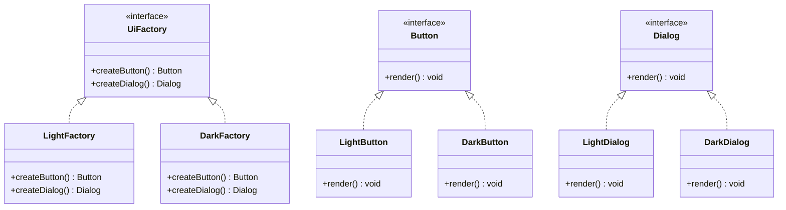

---
# Required
sidebar_position: 3
title: "Abstract Factory Pattern — Product Families"
description: >-
  Learn the Abstract Factory pattern for creating families of related objects
  without hard-coding concrete classes. Includes multi-language examples.

# SEO
keywords:
  - abstract factory pattern
  - abstract factory design pattern
  - factory of factories
  - product families
  - when to use abstract factory

difficulty: intermediate
category: creational
related_solid: [OCP, DIP]

# Social sharing
og_title: "Abstract Factory Pattern: Product Families"
og_description: "Create compatible families of objects without coupling to concrete classes."
og_image: "/img/social-card.svg"

# Content management
date_published: 2026-01-25
date_modified: 2026-01-25
author: shivam
reading_time: 13
content_type: explanation
---

# Abstract Factory Pattern

<PatternMeta>
  <Difficulty level="intermediate" />
  <TimeToRead minutes={13} />
  <Prerequisites patterns={["Factory Method"]} />
</PatternMeta>

> **Definition:** The Abstract Factory pattern provides an interface for creating families of related objects without specifying their concrete classes.

---

## The Problem: Swapping a Family, Not a Single Class

In a platform I worked on, we supported both "internal" and "external" build environments. Each environment required a matched set of components: storage client, secret provider, and audit logger. Swapping one component without the others created subtle incompatibilities.

**The pain was not creating a single object. It was creating compatible sets.**

---

## What Is the Abstract Factory Pattern?

Abstract Factory is a factory of factories. It defines methods for each product in a family. Concrete factories produce consistent families.

### Structure



### Key Components

- **Abstract Factory:** Declares creation methods for each product.
- **Concrete Factories:** Create product families that work together.
- **Abstract Products:** Define interfaces for each product type.
- **Concrete Products:** Implement those interfaces.

### SOLID Principles Connection

- **OCP:** Add new families without changing client code.
- **DIP:** Clients depend on abstract factories and products.

---

## When to Use Abstract Factory

- You need to create multiple related objects together.
- You must swap an entire family based on configuration or environment.
- You want to enforce compatibility between products.

## When NOT to Use Abstract Factory

- You only have one product type, not a family.
- The number of products changes frequently (it makes interfaces heavy).
- A simple dependency injection setup already solves the problem.

---

## Implementation

<CodeTabs>
  <TabItem value="python" label="Python">
    ```python
    from abc import ABC, abstractmethod


    class Button(ABC):
        @abstractmethod
        def render(self) -> str:
            raise NotImplementedError


    class Dialog(ABC):
        @abstractmethod
        def render(self) -> str:
            raise NotImplementedError


    class LightButton(Button):
        def render(self) -> str:
            return "light button"


    class LightDialog(Dialog):
        def render(self) -> str:
            return "light dialog"


    class UiFactory(ABC):
        @abstractmethod
        def create_button(self) -> Button:
            raise NotImplementedError

        @abstractmethod
        def create_dialog(self) -> Dialog:
            raise NotImplementedError


    class LightFactory(UiFactory):
        def create_button(self) -> Button:
            return LightButton()

        def create_dialog(self) -> Dialog:
            return LightDialog()
    ```
  </TabItem>
  <TabItem value="typescript" label="TypeScript">
    ```typescript
    interface Button {
      render(): string;
    }

    interface Dialog {
      render(): string;
    }

    class LightButton implements Button {
      render(): string {
        return "light button";
      }
    }

    class LightDialog implements Dialog {
      render(): string {
        return "light dialog";
      }
    }

    interface UiFactory {
      createButton(): Button;
      createDialog(): Dialog;
    }

    class LightFactory implements UiFactory {
      createButton(): Button {
        return new LightButton();
      }
      createDialog(): Dialog {
        return new LightDialog();
      }
    }
    ```
  </TabItem>
  <TabItem value="go" label="Go">
    ```go
    package ui

    type Button interface {
        Render() string
    }

    type Dialog interface {
        Render() string
    }

    type LightButton struct{}

    func (b LightButton) Render() string { return "light button" }

    type LightDialog struct{}

    func (d LightDialog) Render() string { return "light dialog" }

    type UiFactory interface {
        CreateButton() Button
        CreateDialog() Dialog
    }

    type LightFactory struct{}

    func (f LightFactory) CreateButton() Button { return LightButton{} }
    func (f LightFactory) CreateDialog() Dialog { return LightDialog{} }
    ```
  </TabItem>
  <TabItem value="java" label="Java">
    ```java
    interface Button { String render(); }
    interface Dialog { String render(); }

    class LightButton implements Button {
        public String render() { return "light button"; }
    }

    class LightDialog implements Dialog {
        public String render() { return "light dialog"; }
    }

    interface UiFactory {
        Button createButton();
        Dialog createDialog();
    }

    class LightFactory implements UiFactory {
        public Button createButton() { return new LightButton(); }
        public Dialog createDialog() { return new LightDialog(); }
    }
    ```
  </TabItem>
  <TabItem value="csharp" label="C#">
    ```csharp
    public interface IButton { string Render(); }
    public interface IDialog { string Render(); }

    public class LightButton : IButton
    {
        public string Render() => "light button";
    }

    public class LightDialog : IDialog
    {
        public string Render() => "light dialog";
    }

    public interface IUiFactory
    {
        IButton CreateButton();
        IDialog CreateDialog();
    }

    public class LightFactory : IUiFactory
    {
        public IButton CreateButton() => new LightButton();
        public IDialog CreateDialog() => new LightDialog();
    }
    ```
  </TabItem>
</CodeTabs>

---

## Real-World Example: Environment-Specific Clients

In internal infrastructure tooling, we had separate client families for production and staging. Each environment required a matched set of components with consistent logging and security behavior. Abstract Factory made that compatibility explicit and prevented mixed environments.

---

## Performance Considerations

| Aspect | Impact | Notes |
|--------|--------|-------|
| Memory | Medium | More classes and interfaces |
| Runtime | Low | Indirection on creation |
| Complexity | High | Multiple factories to manage |

---

## Testing This Pattern

Test the client code against the abstract factory and then add small unit tests for each concrete factory.

```python
def test_light_factory_creates_family() -> None:
    factory = LightFactory()
    assert factory.create_button().render() == "light button"
    assert factory.create_dialog().render() == "light dialog"
```

---

## Common Mistakes

- Mixing products from different families.
- Adding too many product types to the abstract factory.
- Using Abstract Factory when Factory Method would be simpler.

---

## Related Patterns

| Pattern | Relationship |
|---------|--------------|
| Factory Method | Abstract Factory often uses Factory Method internally |
| Builder | Another way to create complex products |
| Dependency Injection | Can replace factories in some codebases |

---

## Pattern Combinations

- **With Builder:** Use the factory to choose which builder to use.
- **With Strategy:** Switch between factories at runtime.

---

## Try It Yourself

Design a UI toolkit that supports light and dark themes, each with buttons and dialogs. Implement the UI factory for both themes.

---

## Frequently Asked Questions

### Is Abstract Factory overkill for small projects?
Often yes. It shines when product families grow and compatibility matters.

### How is this different from Dependency Injection?
DI wires dependencies; Abstract Factory defines families and guarantees compatibility.

### What is the hardest part of Abstract Factory?
Keeping the abstract factory interface from ballooning.

### How do I test code using Abstract Factory?
Test with a fake factory that returns stub products and verify behavior.

---

## Key Takeaways

- **Abstract Factory creates compatible families of products.**
- **It keeps client code stable while product families evolve.**
- **Use it when compatibility is a real risk, not a theoretical one.**

---

## Downloads

- Abstract Factory Cheat Sheet (Coming soon)
- Complete Code Examples (Coming soon)
- Practice Exercises (Coming soon)

---

**Next:** [Builder Pattern](/docs/design-patterns/creational/builder)
