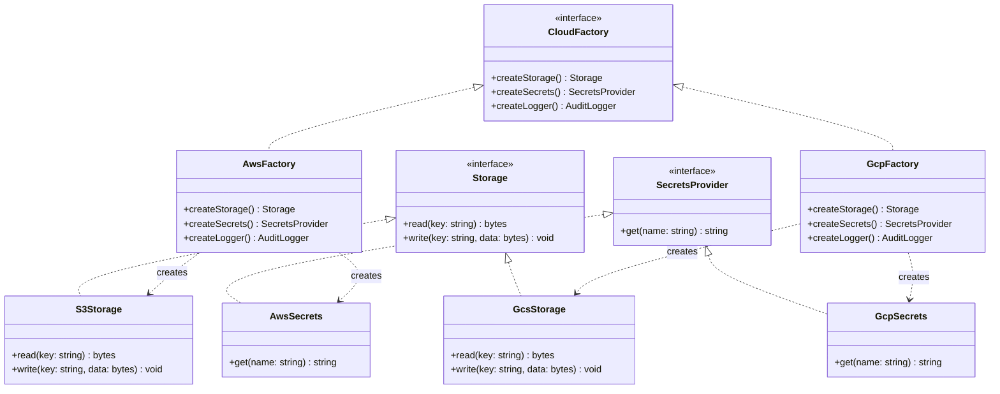

---
# Required
sidebar_position: 3
title: "Abstract Factory Pattern — Creating Product Families"
description: >-
  Learn the Abstract Factory pattern for creating families of related objects
  without coupling to concrete classes. Real-world examples and implementations.

# SEO
keywords:
  - abstract factory pattern
  - abstract factory design pattern
  - factory of factories
  - product families
  - when to use abstract factory

difficulty: intermediate
category: creational
related_solid: [OCP, DIP]

# Social sharing
og_title: "Abstract Factory Pattern: Creating Product Families"
og_description: "Create compatible families of objects without coupling to concrete classes."
og_image: "/img/social-card.svg"

# Content management
date_published: 2026-01-25
date_modified: 2026-01-25
author: shivam
reading_time: 14
content_type: explanation
---

# Abstract Factory Pattern

<PatternMeta>
  <Difficulty level="intermediate" />
  <TimeToRead minutes={14} />
  <Prerequisites patterns={["Factory Method"]} />
</PatternMeta>

The first time I needed Abstract Factory, I didn't recognize it.

At NVIDIA, we were building a platform that supported multiple cloud environments—internal data centers, AWS for some teams, and GCP for others. Each environment required a matched set of components: a storage client, a secrets provider, and an audit logger. You couldn't mix them—AWS secrets with GCP storage would fail in subtle ways that didn't surface until production.

We started with separate factories for each component:

```python
storage = StorageFactory.create(env)
secrets = SecretsFactory.create(env)
logger = AuditLoggerFactory.create(env)
```

Inevitably, someone passed the wrong environment to one factory:

```python
storage = StorageFactory.create("aws")
secrets = SecretsFactory.create("gcp")  # Bug: mismatched environment
logger = AuditLoggerFactory.create("aws")
```

This code passed review—nothing looked wrong. The bug didn't surface until the secrets provider tried to authenticate and failed because it was talking to the wrong cloud. We spent two days debugging an environment mismatch that could have been prevented at compile time.

**Abstract Factory solves this by making it impossible to create mismatched products.** You ask for a factory, and that factory creates only compatible products. If you have an AWS factory, it creates AWS storage, AWS secrets, and AWS loggers. You can't accidentally mix environments.

---

## What Is the Abstract Factory Pattern?

> **Definition:** Abstract Factory provides an interface for creating families of related objects without specifying their concrete classes.

Think of it as a "factory of factories." Instead of asking for individual products, you ask for a factory that produces a compatible set. The factory ensures everything it creates works together.

**The key insight: Abstract Factory enforces compatibility at the type level.** If Factory Method lets you swap individual products, Abstract Factory lets you swap entire product families while guaranteeing consistency.

---

## Structure



### Key Components

| Component | Role |
|-----------|------|
| **Abstract Factory** (`CloudFactory`) | Declares creation methods for each product in the family |
| **Concrete Factories** (`AwsFactory`, `GcpFactory`) | Implement creation methods to produce compatible products |
| **Abstract Products** (`Storage`, `SecretsProvider`) | Interfaces for each product type |
| **Concrete Products** (`S3Storage`, `GcpSecrets`) | Implementations for each environment |

### SOLID Principles Connection

- **Open/Closed:** Add new product families (like Azure) without modifying existing code
- **Dependency Inversion:** Client code depends on abstract factories and products, never concrete classes

---

## When to Use Abstract Factory

✅ **Use it when:**

- You need to create multiple related objects that must work together
- Mixing products from different families would cause bugs
- You want to enforce compatibility at the type system level
- Product families are known and vary together (AWS vs GCP, Light theme vs Dark theme)

❌ **Don't use it when:**

- You only have one product type (use Factory Method instead)
- The product types change frequently (the abstract factory interface becomes unstable)
- Compatibility between products isn't a real concern
- A simpler dependency injection setup would suffice

**Rule of thumb:** If mixing products from different families is a bug, Abstract Factory is worth considering. If it's just a configuration choice, you probably don't need this level of type safety.

---

## Implementation

<CodeTabs>
  <TabItem value="python" label="Python">
    ```python
    from abc import ABC, abstractmethod


    # Abstract products
    class Storage(ABC):
        @abstractmethod
        def read(self, key: str) -> bytes:
            pass
        
        @abstractmethod
        def write(self, key: str, data: bytes) -> None:
            pass


    class SecretsProvider(ABC):
        @abstractmethod
        def get(self, name: str) -> str:
            pass


    class AuditLogger(ABC):
        @abstractmethod
        def log(self, event: str) -> None:
            pass


    # AWS implementations
    class S3Storage(Storage):
        def read(self, key: str) -> bytes:
            print(f"Reading from S3: {key}")
            return b"s3-data"
        
        def write(self, key: str, data: bytes) -> None:
            print(f"Writing to S3: {key}")


    class AwsSecretsManager(SecretsProvider):
        def get(self, name: str) -> str:
            print(f"Fetching from AWS Secrets Manager: {name}")
            return "aws-secret"


    class CloudWatchLogger(AuditLogger):
        def log(self, event: str) -> None:
            print(f"CloudWatch: {event}")


    # GCP implementations
    class GcsStorage(Storage):
        def read(self, key: str) -> bytes:
            print(f"Reading from GCS: {key}")
            return b"gcs-data"
        
        def write(self, key: str, data: bytes) -> None:
            print(f"Writing to GCS: {key}")


    class GcpSecretManager(SecretsProvider):
        def get(self, name: str) -> str:
            print(f"Fetching from GCP Secret Manager: {name}")
            return "gcp-secret"


    class StackdriverLogger(AuditLogger):
        def log(self, event: str) -> None:
            print(f"Stackdriver: {event}")


    # Abstract factory
    class CloudFactory(ABC):
        @abstractmethod
        def create_storage(self) -> Storage:
            pass
        
        @abstractmethod
        def create_secrets(self) -> SecretsProvider:
            pass
        
        @abstractmethod
        def create_logger(self) -> AuditLogger:
            pass


    # Concrete factories
    class AwsFactory(CloudFactory):
        def create_storage(self) -> Storage:
            return S3Storage()
        
        def create_secrets(self) -> SecretsProvider:
            return AwsSecretsManager()
        
        def create_logger(self) -> AuditLogger:
            return CloudWatchLogger()


    class GcpFactory(CloudFactory):
        def create_storage(self) -> Storage:
            return GcsStorage()
        
        def create_secrets(self) -> SecretsProvider:
            return GcpSecretManager()
        
        def create_logger(self) -> AuditLogger:
            return StackdriverLogger()


    # Client code—doesn't know or care which cloud
    def deploy_artifact(factory: CloudFactory, artifact_id: str) -> None:
        storage = factory.create_storage()
        secrets = factory.create_secrets()
        logger = factory.create_logger()
        
        api_key = secrets.get("deploy-api-key")
        storage.write(f"artifacts/{artifact_id}", b"artifact-data")
        logger.log(f"Deployed artifact {artifact_id}")
    ```
  </TabItem>
  <TabItem value="typescript" label="TypeScript">
    ```typescript
    // Abstract products
    interface Storage {
      read(key: string): Promise<Buffer>;
      write(key: string, data: Buffer): Promise<void>;
    }

    interface SecretsProvider {
      get(name: string): Promise<string>;
    }

    interface AuditLogger {
      log(event: string): void;
    }

    // AWS implementations
    class S3Storage implements Storage {
      async read(key: string): Promise<Buffer> {
        console.log(`Reading from S3: ${key}`);
        return Buffer.from("s3-data");
      }
      async write(key: string, data: Buffer): Promise<void> {
        console.log(`Writing to S3: ${key}`);
      }
    }

    class AwsSecretsManager implements SecretsProvider {
      async get(name: string): Promise<string> {
        console.log(`Fetching from AWS Secrets Manager: ${name}`);
        return "aws-secret";
      }
    }

    class CloudWatchLogger implements AuditLogger {
      log(event: string): void {
        console.log(`CloudWatch: ${event}`);
      }
    }

    // GCP implementations
    class GcsStorage implements Storage {
      async read(key: string): Promise<Buffer> {
        console.log(`Reading from GCS: ${key}`);
        return Buffer.from("gcs-data");
      }
      async write(key: string, data: Buffer): Promise<void> {
        console.log(`Writing to GCS: ${key}`);
      }
    }

    class GcpSecretManager implements SecretsProvider {
      async get(name: string): Promise<string> {
        console.log(`Fetching from GCP Secret Manager: ${name}`);
        return "gcp-secret";
      }
    }

    class StackdriverLogger implements AuditLogger {
      log(event: string): void {
        console.log(`Stackdriver: ${event}`);
      }
    }

    // Abstract factory
    interface CloudFactory {
      createStorage(): Storage;
      createSecrets(): SecretsProvider;
      createLogger(): AuditLogger;
    }

    // Concrete factories
    class AwsFactory implements CloudFactory {
      createStorage(): Storage { return new S3Storage(); }
      createSecrets(): SecretsProvider { return new AwsSecretsManager(); }
      createLogger(): AuditLogger { return new CloudWatchLogger(); }
    }

    class GcpFactory implements CloudFactory {
      createStorage(): Storage { return new GcsStorage(); }
      createSecrets(): SecretsProvider { return new GcpSecretManager(); }
      createLogger(): AuditLogger { return new StackdriverLogger(); }
    }

    // Client code
    async function deployArtifact(factory: CloudFactory, artifactId: string): Promise<void> {
      const storage = factory.createStorage();
      const secrets = factory.createSecrets();
      const logger = factory.createLogger();

      const apiKey = await secrets.get("deploy-api-key");
      await storage.write(`artifacts/${artifactId}`, Buffer.from("data"));
      logger.log(`Deployed artifact ${artifactId}`);
    }
    ```
  </TabItem>
  <TabItem value="go" label="Go">
    ```go
    package cloud

    import "fmt"

    // Abstract products
    type Storage interface {
        Read(key string) []byte
        Write(key string, data []byte)
    }

    type SecretsProvider interface {
        Get(name string) string
    }

    type AuditLogger interface {
        Log(event string)
    }

    // AWS implementations
    type S3Storage struct{}
    func (s S3Storage) Read(key string) []byte {
        fmt.Printf("Reading from S3: %s\n", key)
        return []byte("s3-data")
    }
    func (s S3Storage) Write(key string, data []byte) {
        fmt.Printf("Writing to S3: %s\n", key)
    }

    type AwsSecretsManager struct{}
    func (a AwsSecretsManager) Get(name string) string {
        fmt.Printf("Fetching from AWS Secrets Manager: %s\n", name)
        return "aws-secret"
    }

    type CloudWatchLogger struct{}
    func (c CloudWatchLogger) Log(event string) {
        fmt.Printf("CloudWatch: %s\n", event)
    }

    // GCP implementations
    type GcsStorage struct{}
    func (g GcsStorage) Read(key string) []byte {
        fmt.Printf("Reading from GCS: %s\n", key)
        return []byte("gcs-data")
    }
    func (g GcsStorage) Write(key string, data []byte) {
        fmt.Printf("Writing to GCS: %s\n", key)
    }

    type GcpSecretManager struct{}
    func (g GcpSecretManager) Get(name string) string {
        fmt.Printf("Fetching from GCP Secret Manager: %s\n", name)
        return "gcp-secret"
    }

    type StackdriverLogger struct{}
    func (s StackdriverLogger) Log(event string) {
        fmt.Printf("Stackdriver: %s\n", event)
    }

    // Abstract factory
    type CloudFactory interface {
        CreateStorage() Storage
        CreateSecrets() SecretsProvider
        CreateLogger() AuditLogger
    }

    // Concrete factories
    type AwsFactory struct{}
    func (f AwsFactory) CreateStorage() Storage { return S3Storage{} }
    func (f AwsFactory) CreateSecrets() SecretsProvider { return AwsSecretsManager{} }
    func (f AwsFactory) CreateLogger() AuditLogger { return CloudWatchLogger{} }

    type GcpFactory struct{}
    func (f GcpFactory) CreateStorage() Storage { return GcsStorage{} }
    func (f GcpFactory) CreateSecrets() SecretsProvider { return GcpSecretManager{} }
    func (f GcpFactory) CreateLogger() AuditLogger { return StackdriverLogger{} }

    // Client code
    func DeployArtifact(factory CloudFactory, artifactID string) {
        storage := factory.CreateStorage()
        secrets := factory.CreateSecrets()
        logger := factory.CreateLogger()

        secrets.Get("deploy-api-key")
        storage.Write("artifacts/"+artifactID, []byte("data"))
        logger.Log("Deployed artifact " + artifactID)
    }
    ```
  </TabItem>
  <TabItem value="java" label="Java">
    ```java
    // Abstract products
    interface Storage {
        byte[] read(String key);
        void write(String key, byte[] data);
    }

    interface SecretsProvider {
        String get(String name);
    }

    interface AuditLogger {
        void log(String event);
    }

    // AWS implementations
    class S3Storage implements Storage {
        public byte[] read(String key) {
            System.out.printf("Reading from S3: %s%n", key);
            return "s3-data".getBytes();
        }
        public void write(String key, byte[] data) {
            System.out.printf("Writing to S3: %s%n", key);
        }
    }

    class AwsSecretsManager implements SecretsProvider {
        public String get(String name) {
            System.out.printf("Fetching from AWS Secrets Manager: %s%n", name);
            return "aws-secret";
        }
    }

    class CloudWatchLogger implements AuditLogger {
        public void log(String event) {
            System.out.printf("CloudWatch: %s%n", event);
        }
    }

    // Abstract factory
    interface CloudFactory {
        Storage createStorage();
        SecretsProvider createSecrets();
        AuditLogger createLogger();
    }

    // Concrete factories
    class AwsFactory implements CloudFactory {
        public Storage createStorage() { return new S3Storage(); }
        public SecretsProvider createSecrets() { return new AwsSecretsManager(); }
        public AuditLogger createLogger() { return new CloudWatchLogger(); }
    }

    class GcpFactory implements CloudFactory {
        public Storage createStorage() { return new GcsStorage(); }
        public SecretsProvider createSecrets() { return new GcpSecretManager(); }
        public AuditLogger createLogger() { return new StackdriverLogger(); }
    }
    ```
  </TabItem>
  <TabItem value="csharp" label="C#">
    ```csharp
    // Abstract products
    public interface IStorage
    {
        byte[] Read(string key);
        void Write(string key, byte[] data);
    }

    public interface ISecretsProvider
    {
        string Get(string name);
    }

    public interface IAuditLogger
    {
        void Log(string eventMessage);
    }

    // AWS implementations
    public class S3Storage : IStorage
    {
        public byte[] Read(string key)
        {
            Console.WriteLine($"Reading from S3: {key}");
            return System.Text.Encoding.UTF8.GetBytes("s3-data");
        }
        public void Write(string key, byte[] data)
        {
            Console.WriteLine($"Writing to S3: {key}");
        }
    }

    public class AwsSecretsManager : ISecretsProvider
    {
        public string Get(string name)
        {
            Console.WriteLine($"Fetching from AWS Secrets Manager: {name}");
            return "aws-secret";
        }
    }

    public class CloudWatchLogger : IAuditLogger
    {
        public void Log(string eventMessage)
        {
            Console.WriteLine($"CloudWatch: {eventMessage}");
        }
    }

    // Abstract factory
    public interface ICloudFactory
    {
        IStorage CreateStorage();
        ISecretsProvider CreateSecrets();
        IAuditLogger CreateLogger();
    }

    // Concrete factories
    public class AwsFactory : ICloudFactory
    {
        public IStorage CreateStorage() => new S3Storage();
        public ISecretsProvider CreateSecrets() => new AwsSecretsManager();
        public IAuditLogger CreateLogger() => new CloudWatchLogger();
    }

    public class GcpFactory : ICloudFactory
    {
        public IStorage CreateStorage() => new GcsStorage();
        public ISecretsProvider CreateSecrets() => new GcpSecretManager();
        public IAuditLogger CreateLogger() => new StackdriverLogger();
    }
    ```
  </TabItem>
</CodeTabs>

---

## Real-World Example: Multi-Environment Testing

On our platform, we needed to run the same tests against multiple environments. Each environment had different telemetry clients, different mock services, and different configuration sources. Abstract Factory ensured tests couldn't accidentally mix components:

```python
class TestEnvironmentFactory(ABC):
    @abstractmethod
    def create_telemetry_client(self) -> TelemetryClient: pass
    
    @abstractmethod
    def create_config_source(self) -> ConfigSource: pass
    
    @abstractmethod
    def create_service_mocks(self) -> ServiceMocks: pass


class LocalTestFactory(TestEnvironmentFactory):
    def create_telemetry_client(self) -> TelemetryClient:
        return InMemoryTelemetry()
    
    def create_config_source(self) -> ConfigSource:
        return FileConfigSource("./test-config.yaml")
    
    def create_service_mocks(self) -> ServiceMocks:
        return LocalMocks()


class IntegrationTestFactory(TestEnvironmentFactory):
    def create_telemetry_client(self) -> TelemetryClient:
        return StagingTelemetry()
    
    def create_config_source(self) -> ConfigSource:
        return VaultConfigSource("staging")
    
    def create_service_mocks(self) -> ServiceMocks:
        return StagingMocks()
```

---

## Performance Considerations

| Aspect | Impact | Notes |
|--------|--------|-------|
| Memory | Medium | More classes and interfaces than Factory Method |
| Runtime | Low | Factory calls are trivial |
| Complexity | High | Multiple factories and product types to maintain |

Abstract Factory's main cost is **conceptual complexity**, not runtime performance. You're adding a layer of abstraction that takes time to understand. Make sure the compatibility guarantee is worth that cost.

---

## Testing This Pattern

Test the factory produces compatible products, then test each product in isolation:

```python
def test_aws_factory_creates_compatible_products():
    factory = AwsFactory()
    
    storage = factory.create_storage()
    secrets = factory.create_secrets()
    logger = factory.create_logger()
    
    # All products should work with AWS
    assert isinstance(storage, S3Storage)
    assert isinstance(secrets, AwsSecretsManager)
    assert isinstance(logger, CloudWatchLogger)


def test_client_code_with_fake_factory():
    class FakeFactory(CloudFactory):
        def create_storage(self): return FakeStorage()
        def create_secrets(self): return FakeSecrets()
        def create_logger(self): return FakeLogger()
    
    deploy_artifact(FakeFactory(), "test-artifact")
    # Assert against fake product state
```

---

## Common Mistakes

### 1. Using Abstract Factory for a single product

If you only have one product type, you don't need Abstract Factory—Factory Method is simpler. Abstract Factory's value is in enforcing compatibility *across multiple products*.

### 2. Abstract factory interface keeps changing

If you're constantly adding new methods to the abstract factory interface, something is wrong. Either your product types aren't stable, or you're using the wrong pattern.

### 3. Products that don't actually need to be compatible

Not every group of related classes needs Abstract Factory. Ask: "What breaks if I mix products from different families?" If the answer is "nothing," you don't need this pattern.

---

## Related Patterns

| Pattern | Relationship |
|---------|--------------|
| **Factory Method** | Abstract Factory often uses Factory Method for each product |
| **Builder** | Can be combined—factory creates builders for complex products |
| **Dependency Injection** | Modern DI containers can replace Abstract Factory in many cases |
| **Prototype** | Alternative when products are easier to clone than construct |

---

## Key Takeaways

- **Abstract Factory creates compatible families of products.** You can't accidentally mix products from different families.

- **Use it when mixing products would be a bug.** If AWS secrets with GCP storage would fail, Abstract Factory prevents that at the type level.

- **It's higher complexity than Factory Method.** Only use it when you genuinely need product families, not just single product variants.

- **The main benefit is type-safety, not flexibility.** Abstract Factory trades flexibility for safety.

---

## Navigation

- **Previous:** [Factory Method Pattern](/docs/design-patterns/creational/factory-method)
- **Next:** [Builder Pattern](/docs/design-patterns/creational/builder)
