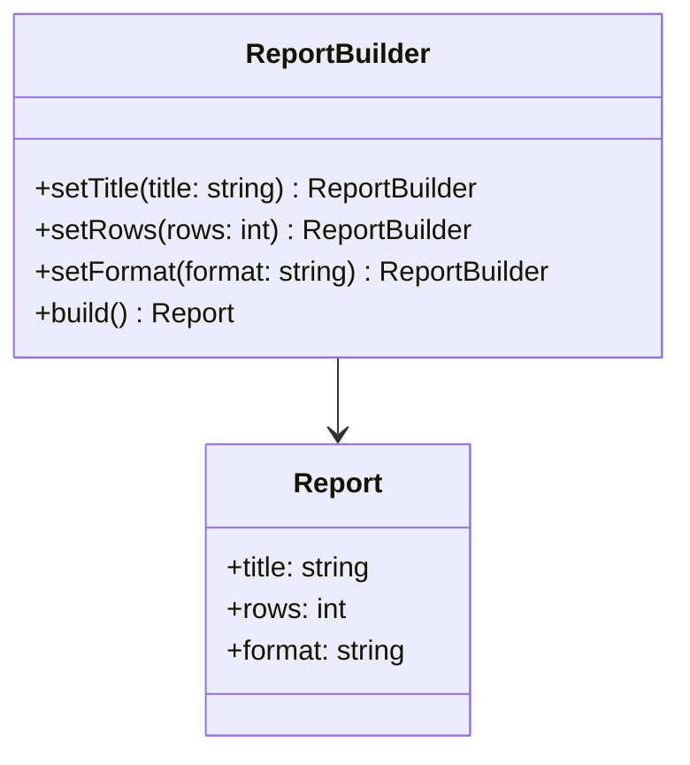

---
# Required
sidebar_position: 4
title: "Builder Pattern — Step-by-Step Construction"
description: >-
  Learn the Builder pattern to construct complex objects step by step without
  exposing construction details. Includes multi-language examples.

# SEO
keywords:
  - builder pattern
  - builder design pattern
  - fluent builder
  - constructing complex objects
  - when to use builder

difficulty: beginner
category: creational
related_solid: [SRP, OCP]

# Social sharing
og_title: "Builder Pattern: Step-by-Step Construction"
og_description: "Build complex objects without messy constructors."
og_image: "/img/social-card.svg"

# Content management
date_published: 2026-01-25
date_modified: 2026-01-25
author: shivam
reading_time: 12
content_type: explanation
---

# Builder Pattern

<PatternMeta>
  <Difficulty level="beginner" />
  <TimeToRead minutes={12} />
  <Prerequisites patterns={["Factory Method"]} />
</PatternMeta>

> **Definition:** The Builder pattern separates the construction of a complex object from its representation, allowing the same construction process to create different representations.

---

## The Problem: Constructors That Become Mini-Languages

When we added reporting to a CI/CD dashboard, the report object grew from three fields to twenty. The constructor became a maze of optional parameters, and every new field created a breaking change.

**We needed a way to build reports step by step without turning constructors into a configuration language.**

---

## What Is the Builder Pattern?

Builder creates objects in a controlled sequence. The caller sets only what it needs, in a readable order, while the builder manages defaults and validation.

### Structure



### Key Components

- **Product:** The complex object being built.
- **Builder:** Provides fluent steps to configure the product.
- **Director (optional):** Encapsulates a standard build sequence.

### SOLID Principles Connection

- **SRP:** Construction logic is separated from the product itself.
- **OCP:** Add new build steps without changing callers.

---

## When to Use Builder

- An object has many optional parameters.
- Construction requires validation or ordering.
- You want a readable, fluent creation flow.

## When NOT to Use Builder

- The object is simple and has few fields.
- Construction rarely changes.
- You risk duplicating builder logic across the codebase.

---

## Implementation

<CodeTabs>
  <TabItem value="python" label="Python">
    ```python
    from dataclasses import dataclass


    @dataclass
    class Report:
        title: str
        rows: int
        format: str


    class ReportBuilder:
        def __init__(self) -> None:
            self._title = "Untitled"
            self._rows = 0
            self._format = "table"

        def set_title(self, title: str) -> "ReportBuilder":
            self._title = title
            return self

        def set_rows(self, rows: int) -> "ReportBuilder":
            self._rows = rows
            return self

        def set_format(self, fmt: str) -> "ReportBuilder":
            self._format = fmt
            return self

        def build(self) -> Report:
            return Report(self._title, self._rows, self._format)
    ```
  </TabItem>
  <TabItem value="typescript" label="TypeScript">
    ```typescript
    type Report = {
      title: string;
      rows: number;
      format: string;
    };

    class ReportBuilder {
      private title = "Untitled";
      private rows = 0;
      private format = "table";

      setTitle(title: string): this {
        this.title = title;
        return this;
      }

      setRows(rows: number): this {
        this.rows = rows;
        return this;
      }

      setFormat(format: string): this {
        this.format = format;
        return this;
      }

      build(): Report {
        return {title: this.title, rows: this.rows, format: this.format};
      }
    }
    ```
  </TabItem>
  <TabItem value="go" label="Go">
    ```go
    package reports

    type Report struct {
        Title  string
        Rows   int
        Format string
    }

    type ReportBuilder struct {
        title  string
        rows   int
        format string
    }

    func NewReportBuilder() *ReportBuilder {
        return &ReportBuilder{title: "Untitled", format: "table"}
    }

    func (b *ReportBuilder) SetTitle(title string) *ReportBuilder {
        b.title = title
        return b
    }

    func (b *ReportBuilder) SetRows(rows int) *ReportBuilder {
        b.rows = rows
        return b
    }

    func (b *ReportBuilder) SetFormat(format string) *ReportBuilder {
        b.format = format
        return b
    }

    func (b *ReportBuilder) Build() Report {
        return Report{Title: b.title, Rows: b.rows, Format: b.format}
    }
    ```
  </TabItem>
  <TabItem value="java" label="Java">
    ```java
    class Report {
        String title;
        int rows;
        String format;
        Report(String title, int rows, String format) {
            this.title = title;
            this.rows = rows;
            this.format = format;
        }
    }

    class ReportBuilder {
        private String title = "Untitled";
        private int rows = 0;
        private String format = "table";

        public ReportBuilder setTitle(String title) {
            this.title = title;
            return this;
        }

        public ReportBuilder setRows(int rows) {
            this.rows = rows;
            return this;
        }

        public ReportBuilder setFormat(String format) {
            this.format = format;
            return this;
        }

        public Report build() {
            return new Report(title, rows, format);
        }
    }
    ```
  </TabItem>
  <TabItem value="csharp" label="C#">
    ```csharp
    public class Report
    {
        public string Title { get; }
        public int Rows { get; }
        public string Format { get; }

        public Report(string title, int rows, string format)
        {
            Title = title;
            Rows = rows;
            Format = format;
        }
    }

    public class ReportBuilder
    {
        private string _title = "Untitled";
        private int _rows = 0;
        private string _format = "table";

        public ReportBuilder SetTitle(string title)
        {
            _title = title;
            return this;
        }

        public ReportBuilder SetRows(int rows)
        {
            _rows = rows;
            return this;
        }

        public ReportBuilder SetFormat(string format)
        {
            _format = format;
            return this;
        }

        public Report Build() => new Report(_title, _rows, _format);
    }
    ```
  </TabItem>
</CodeTabs>

---

## Real-World Example: Build Pipeline Definitions

In CI/CD systems, pipeline definitions often include dozens of optional steps. A Builder makes those pipelines readable and prevents invalid combinations by validating step order.

---

## Performance Considerations

| Aspect | Impact | Notes |
|--------|--------|-------|
| Memory | Low | Builder holds temporary state |
| Runtime | Low | Fluent calls are inexpensive |
| Complexity | Medium | More types and code paths |

---

## Testing This Pattern

Builders are simple to test because they return a deterministic product.

```python
def test_builder_sets_defaults() -> None:
    report = ReportBuilder().build()
    assert report.title == "Untitled"
```

---

## Common Mistakes

- Using Builder for simple objects with two fields.
- Allowing invalid state to pass through build().
- Mixing construction logic into the product class.

---

## Related Patterns

| Pattern | Relationship |
|---------|--------------|
| Abstract Factory | Creates families, not step-by-step construction |
| Prototype | Alternative for creating complex objects by cloning |
| Fluent Interface | Often used inside builders |

---

## Pattern Combinations

- **With Director:** Encapsulate standard build sequences.
- **With Factory Method:** Choose which builder to use.

---

## Try It Yourself

Design a `HttpRequestBuilder` that builds GET, POST, and PUT requests with headers and query params.

---

## Frequently Asked Questions

### Is Builder only useful in statically typed languages?
No. It is helpful anywhere constructors become unreadable.

### Can I skip the Director?
Yes. Many modern builders are used directly without a director.

### What is the main risk with Builder?
Letting the builder grow without validation.

### How do I test code using Builder?
Test the built object for correctness and validate defaults and ordering.

---

## Key Takeaways

- **Builder makes complex construction readable and safe.**
- **It keeps constructors simple and focused.**
- **Use it when optional parameters start to explode.**

---

## Downloads

- Builder Cheat Sheet (Coming soon)
- Complete Code Examples (Coming soon)
- Practice Exercises (Coming soon)

---

## Navigation

- **Previous:** [Abstract Factory Pattern](/docs/design-patterns/creational/abstract-factory)
- **Next:** [Prototype Pattern](/docs/design-patterns/creational/prototype)
