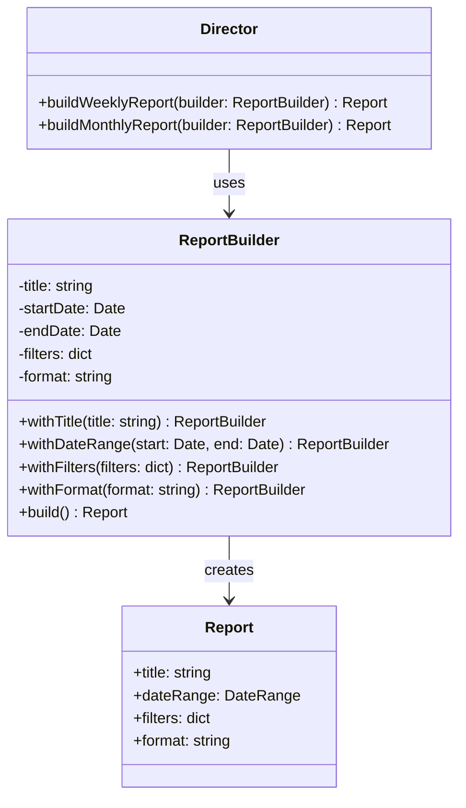

---
# Required
sidebar_position: 4
title: "Builder Pattern — Step-by-Step Object Construction"
description: >-
  Learn the Builder pattern to construct complex objects step by step. Escape
  constructor hell with readable, validated object creation.

# SEO
keywords:
  - builder pattern
  - builder design pattern
  - fluent builder
  - constructing complex objects
  - when to use builder

difficulty: beginner
category: creational
related_solid: [SRP, OCP]

# Social sharing
og_title: "Builder Pattern: Step-by-Step Object Construction"
og_description: "Build complex objects without messy constructors or configuration hell."
og_image: "/img/social-card.svg"

# Content management
date_published: 2026-01-25
date_modified: 2026-01-25
author: shivam
reading_time: 14
content_type: explanation
---

# Builder Pattern

<PatternMeta>
  <Difficulty level="beginner" />
  <TimeToRead minutes={14} />
  <Prerequisites patterns={["Factory Method"]} />
</PatternMeta>

The report that broke our CI/CD dashboard taught me why Builder exists.

It was 2021, and we were adding a new reporting feature to our platform at NVIDIA. Reports needed to include: title, date range, filters, groupings, sort order, pagination, format (PDF, CSV, HTML), column selections, and about twelve more optional parameters. The initial design was a constructor:

```python
report = Report(
    title="Build Metrics",
    start_date=datetime(2024, 1, 1),
    end_date=datetime(2024, 1, 31),
    filters={"status": "failed"},
    group_by=["team", "project"],
    sort_by="duration",
    sort_order="desc",
    page_size=100,
    page_number=1,
    format="pdf",
    columns=["id", "duration", "status"],
    include_summary=True,
    include_charts=True,
    chart_types=["bar", "line"],
    # ... more parameters
)
```

The problems started immediately. Engineers passed arguments in the wrong order. They forgot required parameters. They set invalid combinations—like `include_charts=True` with `format="csv"`. Every bug report started with "the report looked wrong" and ended with us spending an hour figuring out which parameter was misconfigured.

Here's what I didn't understand then: **the constructor had become a configuration language, and it was a bad one.** No validation. No defaults. No discoverability. Every caller had to understand all twenty parameters to use any of them.

Builder solves this by turning object construction into a sequence of clear, named steps with validation at each step and at the end.

---

## What Is the Builder Pattern?

> **Definition:** Builder separates the construction of a complex object from its representation, allowing the same construction process to create different representations.

In practice: instead of a constructor with twenty parameters, you have a builder with twenty methods, each setting one thing. You chain the methods you need, skip the ones you don't, and call `build()` at the end to get your object.

**The key insight: Builder makes construction readable, discoverable, and validatable.** The code reads like a sentence describing what you want, and invalid configurations fail fast with clear errors.

---

## Structure



### Key Components

| Component | Role |
|-----------|------|
| **Product** (`Report`) | The complex object being built |
| **Builder** (`ReportBuilder`) | Provides fluent methods to configure the product step by step |
| **Director** (optional) | Encapsulates standard construction sequences for common configurations |

### SOLID Principles Connection

- **Single Responsibility:** Construction logic lives in the builder, not the product
- **Open/Closed:** Add new construction steps without modifying existing code

---

## When to Use Builder

✅ **Use it when:**

- An object has many optional parameters (typically 5+ is a good threshold)
- Construction requires validation or specific ordering
- You want a readable, fluent creation API
- The same construction process should create different representations
- You need to create immutable objects with many fields

❌ **Don't use it when:**

- The object has 3-4 parameters that rarely change
- Construction is already simple and clear
- You'd be duplicating builder logic across the codebase
- A factory would suffice

**Rule of thumb:** If your constructor has more parameters than you can remember, you need a Builder. If it has two, you don't.

---

## Implementation

<CodeTabs>
  <TabItem value="python" label="Python">
    ```python
    from dataclasses import dataclass
    from datetime import datetime
    from typing import Optional


    @dataclass(frozen=True)
    class Report:
        """Immutable report object."""
        title: str
        start_date: datetime
        end_date: datetime
        filters: dict
        format: str
        columns: list[str]
        page_size: int
        include_charts: bool


    class ReportBuilder:
        """Fluent builder for Report objects."""
        
        def __init__(self) -> None:
            self._title: str = "Untitled Report"
            self._start_date: Optional[datetime] = None
            self._end_date: Optional[datetime] = None
            self._filters: dict = {}
            self._format: str = "pdf"
            self._columns: list[str] = []
            self._page_size: int = 50
            self._include_charts: bool = False
        
        def with_title(self, title: str) -> "ReportBuilder":
            self._title = title
            return self
        
        def with_date_range(self, start: datetime, end: datetime) -> "ReportBuilder":
            if end < start:
                raise ValueError("End date must be after start date")
            self._start_date = start
            self._end_date = end
            return self
        
        def with_filters(self, **filters) -> "ReportBuilder":
            self._filters.update(filters)
            return self
        
        def with_format(self, fmt: str) -> "ReportBuilder":
            valid_formats = {"pdf", "csv", "html"}
            if fmt not in valid_formats:
                raise ValueError(f"Format must be one of {valid_formats}")
            self._format = fmt
            return self
        
        def with_columns(self, *columns: str) -> "ReportBuilder":
            self._columns = list(columns)
            return self
        
        def with_page_size(self, size: int) -> "ReportBuilder":
            if size < 1 or size > 1000:
                raise ValueError("Page size must be between 1 and 1000")
            self._page_size = size
            return self
        
        def with_charts(self) -> "ReportBuilder":
            if self._format == "csv":
                raise ValueError("Charts not supported in CSV format")
            self._include_charts = True
            return self
        
        def build(self) -> Report:
            # Final validation
            if self._start_date is None or self._end_date is None:
                raise ValueError("Date range is required")
            if not self._columns:
                raise ValueError("At least one column is required")
            
            return Report(
                title=self._title,
                start_date=self._start_date,
                end_date=self._end_date,
                filters=self._filters,
                format=self._format,
                columns=self._columns,
                page_size=self._page_size,
                include_charts=self._include_charts,
            )


    # Usage - readable and self-documenting
    report = (
        ReportBuilder()
        .with_title("Weekly Build Metrics")
        .with_date_range(datetime(2024, 1, 1), datetime(2024, 1, 7))
        .with_filters(status="failed", team="platform")
        .with_columns("build_id", "duration", "status", "team")
        .with_format("pdf")
        .with_charts()
        .build()
    )
    ```
  </TabItem>
  <TabItem value="typescript" label="TypeScript">
    ```typescript
    interface Report {
      readonly title: string;
      readonly startDate: Date;
      readonly endDate: Date;
      readonly filters: Record<string, string>;
      readonly format: "pdf" | "csv" | "html";
      readonly columns: string[];
      readonly pageSize: number;
      readonly includeCharts: boolean;
    }

    class ReportBuilder {
      private title = "Untitled Report";
      private startDate?: Date;
      private endDate?: Date;
      private filters: Record<string, string> = {};
      private format: "pdf" | "csv" | "html" = "pdf";
      private columns: string[] = [];
      private pageSize = 50;
      private includeCharts = false;

      withTitle(title: string): this {
        this.title = title;
        return this;
      }

      withDateRange(start: Date, end: Date): this {
        if (end < start) {
          throw new Error("End date must be after start date");
        }
        this.startDate = start;
        this.endDate = end;
        return this;
      }

      withFilters(filters: Record<string, string>): this {
        this.filters = { ...this.filters, ...filters };
        return this;
      }

      withFormat(format: "pdf" | "csv" | "html"): this {
        this.format = format;
        return this;
      }

      withColumns(...columns: string[]): this {
        this.columns = columns;
        return this;
      }

      withPageSize(size: number): this {
        if (size < 1 || size > 1000) {
          throw new Error("Page size must be between 1 and 1000");
        }
        this.pageSize = size;
        return this;
      }

      withCharts(): this {
        if (this.format === "csv") {
          throw new Error("Charts not supported in CSV format");
        }
        this.includeCharts = true;
        return this;
      }

      build(): Report {
        if (!this.startDate || !this.endDate) {
          throw new Error("Date range is required");
        }
        if (this.columns.length === 0) {
          throw new Error("At least one column is required");
        }

        return {
          title: this.title,
          startDate: this.startDate,
          endDate: this.endDate,
          filters: this.filters,
          format: this.format,
          columns: this.columns,
          pageSize: this.pageSize,
          includeCharts: this.includeCharts,
        };
      }
    }

    // Usage
    const report = new ReportBuilder()
      .withTitle("Weekly Build Metrics")
      .withDateRange(new Date("2024-01-01"), new Date("2024-01-07"))
      .withFilters({ status: "failed", team: "platform" })
      .withColumns("build_id", "duration", "status")
      .withFormat("pdf")
      .withCharts()
      .build();
    ```
  </TabItem>
  <TabItem value="go" label="Go">
    ```go
    package reports

    import (
        "errors"
        "time"
    )

    type Report struct {
        Title         string
        StartDate     time.Time
        EndDate       time.Time
        Filters       map[string]string
        Format        string
        Columns       []string
        PageSize      int
        IncludeCharts bool
    }

    type ReportBuilder struct {
        title         string
        startDate     time.Time
        endDate       time.Time
        filters       map[string]string
        format        string
        columns       []string
        pageSize      int
        includeCharts bool
    }

    func NewReportBuilder() *ReportBuilder {
        return &ReportBuilder{
            title:    "Untitled Report",
            filters:  make(map[string]string),
            format:   "pdf",
            pageSize: 50,
        }
    }

    func (b *ReportBuilder) WithTitle(title string) *ReportBuilder {
        b.title = title
        return b
    }

    func (b *ReportBuilder) WithDateRange(start, end time.Time) *ReportBuilder {
        b.startDate = start
        b.endDate = end
        return b
    }

    func (b *ReportBuilder) WithFilter(key, value string) *ReportBuilder {
        b.filters[key] = value
        return b
    }

    func (b *ReportBuilder) WithFormat(format string) *ReportBuilder {
        b.format = format
        return b
    }

    func (b *ReportBuilder) WithColumns(columns ...string) *ReportBuilder {
        b.columns = columns
        return b
    }

    func (b *ReportBuilder) WithPageSize(size int) *ReportBuilder {
        b.pageSize = size
        return b
    }

    func (b *ReportBuilder) WithCharts() *ReportBuilder {
        b.includeCharts = true
        return b
    }

    func (b *ReportBuilder) Build() (*Report, error) {
        if b.startDate.IsZero() || b.endDate.IsZero() {
            return nil, errors.New("date range is required")
        }
        if b.endDate.Before(b.startDate) {
            return nil, errors.New("end date must be after start date")
        }
        if len(b.columns) == 0 {
            return nil, errors.New("at least one column is required")
        }
        if b.includeCharts && b.format == "csv" {
            return nil, errors.New("charts not supported in CSV format")
        }

        return &Report{
            Title:         b.title,
            StartDate:     b.startDate,
            EndDate:       b.endDate,
            Filters:       b.filters,
            Format:        b.format,
            Columns:       b.columns,
            PageSize:      b.pageSize,
            IncludeCharts: b.includeCharts,
        }, nil
    }
    ```
  </TabItem>
  <TabItem value="java" label="Java">
    ```java
    import java.time.LocalDate;
    import java.util.*;

    public final class Report {
        private final String title;
        private final LocalDate startDate;
        private final LocalDate endDate;
        private final Map<String, String> filters;
        private final String format;
        private final List<String> columns;
        private final int pageSize;
        private final boolean includeCharts;

        private Report(Builder builder) {
            this.title = builder.title;
            this.startDate = builder.startDate;
            this.endDate = builder.endDate;
            this.filters = Map.copyOf(builder.filters);
            this.format = builder.format;
            this.columns = List.copyOf(builder.columns);
            this.pageSize = builder.pageSize;
            this.includeCharts = builder.includeCharts;
        }

        public static Builder builder() {
            return new Builder();
        }

        public static class Builder {
            private String title = "Untitled Report";
            private LocalDate startDate;
            private LocalDate endDate;
            private Map<String, String> filters = new HashMap<>();
            private String format = "pdf";
            private List<String> columns = new ArrayList<>();
            private int pageSize = 50;
            private boolean includeCharts = false;

            public Builder withTitle(String title) {
                this.title = title;
                return this;
            }

            public Builder withDateRange(LocalDate start, LocalDate end) {
                if (end.isBefore(start)) {
                    throw new IllegalArgumentException("End date must be after start");
                }
                this.startDate = start;
                this.endDate = end;
                return this;
            }

            public Builder withFilter(String key, String value) {
                this.filters.put(key, value);
                return this;
            }

            public Builder withFormat(String format) {
                this.format = format;
                return this;
            }

            public Builder withColumns(String... columns) {
                this.columns = Arrays.asList(columns);
                return this;
            }

            public Builder withPageSize(int size) {
                this.pageSize = size;
                return this;
            }

            public Builder withCharts() {
                this.includeCharts = true;
                return this;
            }

            public Report build() {
                if (startDate == null || endDate == null) {
                    throw new IllegalStateException("Date range is required");
                }
                if (columns.isEmpty()) {
                    throw new IllegalStateException("At least one column required");
                }
                if (includeCharts && "csv".equals(format)) {
                    throw new IllegalStateException("Charts not supported in CSV");
                }
                return new Report(this);
            }
        }
    }
    ```
  </TabItem>
  <TabItem value="csharp" label="C#">
    ```csharp
    public sealed class Report
    {
        public string Title { get; }
        public DateTime StartDate { get; }
        public DateTime EndDate { get; }
        public IReadOnlyDictionary<string, string> Filters { get; }
        public string Format { get; }
        public IReadOnlyList<string> Columns { get; }
        public int PageSize { get; }
        public bool IncludeCharts { get; }

        private Report(Builder builder)
        {
            Title = builder.Title;
            StartDate = builder.StartDate;
            EndDate = builder.EndDate;
            Filters = builder.Filters;
            Format = builder.Format;
            Columns = builder.Columns;
            PageSize = builder.PageSize;
            IncludeCharts = builder.IncludeCharts;
        }

        public static Builder CreateBuilder() => new Builder();

        public sealed class Builder
        {
            internal string Title { get; private set; } = "Untitled Report";
            internal DateTime StartDate { get; private set; }
            internal DateTime EndDate { get; private set; }
            internal Dictionary<string, string> Filters { get; } = new();
            internal string Format { get; private set; } = "pdf";
            internal List<string> Columns { get; } = new();
            internal int PageSize { get; private set; } = 50;
            internal bool IncludeCharts { get; private set; }

            public Builder WithTitle(string title)
            {
                Title = title;
                return this;
            }

            public Builder WithDateRange(DateTime start, DateTime end)
            {
                if (end < start)
                    throw new ArgumentException("End date must be after start");
                StartDate = start;
                EndDate = end;
                return this;
            }

            public Builder WithFilter(string key, string value)
            {
                Filters[key] = value;
                return this;
            }

            public Builder WithFormat(string format)
            {
                Format = format;
                return this;
            }

            public Builder WithColumns(params string[] columns)
            {
                Columns.AddRange(columns);
                return this;
            }

            public Builder WithPageSize(int size)
            {
                PageSize = size;
                return this;
            }

            public Builder WithCharts()
            {
                IncludeCharts = true;
                return this;
            }

            public Report Build()
            {
                if (StartDate == default || EndDate == default)
                    throw new InvalidOperationException("Date range required");
                if (Columns.Count == 0)
                    throw new InvalidOperationException("At least one column required");
                if (IncludeCharts && Format == "csv")
                    throw new InvalidOperationException("Charts not supported in CSV");

                return new Report(this);
            }
        }
    }
    ```
  </TabItem>
</CodeTabs>

---

## Real-World Example: Pipeline Configuration Builder

On our CI/CD platform, pipeline configurations had dozens of options. We used Builder to make configuration both readable and validated:

```python
pipeline = (
    PipelineBuilder()
    .with_name("build-and-deploy")
    .with_trigger(on_push=True, branches=["main", "release/*"])
    .add_stage(
        StageBuilder()
        .with_name("build")
        .add_step("checkout", uses="actions/checkout@v3")
        .add_step("build", run="make build")
        .with_timeout(minutes=30)
        .build()
    )
    .add_stage(
        StageBuilder()
        .with_name("deploy")
        .add_step("deploy", run="make deploy")
        .with_environment("production")
        .requires_approval()
        .build()
    )
    .with_notifications(slack="#builds", on_failure=True)
    .build()
)
```

Compare this to the equivalent JSON or YAML—the Builder version is self-documenting and catches errors at construction time, not at runtime.

---

## Performance Considerations

| Aspect | Impact | Notes |
|--------|--------|-------|
| Memory | Low | Builder holds temporary state until `build()` |
| Runtime | Negligible | Method chaining has no measurable overhead |
| Complexity | Medium | More code than a simple constructor |

Builder's cost is **code volume**, not runtime performance. You're writing more code upfront to make construction readable and safe. That trade-off pays off when the object is complex.

---

## Testing This Pattern

Builders make testing easier because construction is explicit:

```python
def test_builder_validates_date_range():
    builder = ReportBuilder()
    
    with pytest.raises(ValueError, match="End date must be after"):
        builder.with_date_range(
            datetime(2024, 1, 31),
            datetime(2024, 1, 1)  # End before start
        )


def test_builder_requires_columns():
    builder = (
        ReportBuilder()
        .with_title("Test")
        .with_date_range(datetime(2024, 1, 1), datetime(2024, 1, 31))
        # No columns
    )
    
    with pytest.raises(ValueError, match="At least one column"):
        builder.build()


def test_builder_prevents_invalid_combinations():
    builder = (
        ReportBuilder()
        .with_format("csv")
    )
    
    with pytest.raises(ValueError, match="Charts not supported"):
        builder.with_charts()
```

---

## Common Mistakes

### 1. Builder without validation

```python
# Useless - adds ceremony without benefit
class Builder:
    def with_foo(self, foo):
        self._foo = foo
        return self
    
    def build(self):
        return Thing(self._foo)  # No validation
```

The whole point of Builder is that it can validate. If `build()` just constructs without checking, use a constructor.

### 2. Forgetting to return `self`

```python
def with_title(self, title: str):  # Bug: no return
    self._title = title
```

This breaks method chaining. Every builder method should `return self` (or `return this`).

### 3. Mutable product after build

If `build()` returns an object that shares state with the builder, mutations to the product affect future builds:

```python
def build(self):
    return Report(
        filters=self._filters  # Bug: shared reference
    )
```

Fix: return copies or use immutable structures.

---

## Related Patterns

| Pattern | Relationship |
|---------|--------------|
| **Factory Method** | Decides *which* thing to create; Builder decides *how* to create it |
| **Abstract Factory** | Can use Builder to construct complex products |
| **Prototype** | Alternative for creating complex objects by cloning |
| **Fluent Interface** | Builder often implements a fluent interface, but they're not the same thing |

---

## Key Takeaways

- **Builder makes complex construction readable and safe.** Construction reads like a specification.

- **Use it when constructors become configuration languages.** Five+ parameters? Consider Builder.

- **Validation is the killer feature.** Builders that don't validate are ceremony without benefit.

- **The cost is code volume.** You're writing more code upfront for clarity later. Make sure it's worth it.

---

## Navigation

- **Previous:** [Abstract Factory Pattern](/docs/design-patterns/creational/abstract-factory)
- **Next:** [Prototype Pattern](/docs/design-patterns/creational/prototype)
