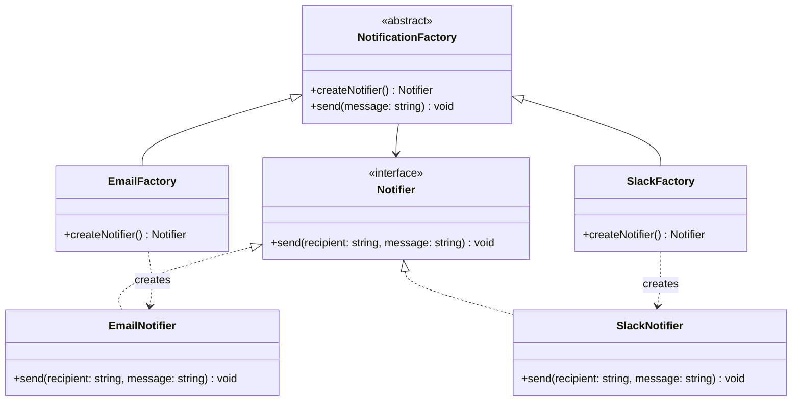

---
# Required
sidebar_position: 2
title: "Factory Method Pattern — Flexible Object Creation"
description: >-
  Learn the Factory Method pattern to create objects without hard-coding
  concrete classes. Includes real-world examples and multi-language implementations.

# SEO
keywords:
  - factory method pattern
  - factory pattern
  - factory design pattern
  - factory method example
  - when to use factory method
  - creational patterns

difficulty: beginner
category: creational
related_solid: [OCP, DIP]

# Social sharing
og_title: "Factory Method Pattern: Flexible Object Creation"
og_description: "Create objects without hard-coding classes—the most useful creational pattern."
og_image: "/img/social-card.svg"

# Content management
date_published: 2026-01-25
date_modified: 2026-01-25
author: shivam
reading_time: 15
content_type: explanation
---

# Factory Method Pattern

<PatternMeta>
  <Difficulty level="beginner" />
  <TimeToRead minutes={15} />
  <Prerequisites patterns={[]} />
</PatternMeta>

I still remember the notification system that taught me why Factory Method exists.

It was 2019, and our CI/CD platform at NVIDIA needed to notify developers about build results. Simple enough—we started with email. The code was straightforward:

```python
def notify_build_complete(build):
    notifier = EmailNotifier()
    notifier.send(build.owner, f"Build {build.id} completed")
```

Then Slack became popular. We added it:

```python
def notify_build_complete(build):
    if build.notification_channel == "slack":
        notifier = SlackNotifier()
        notifier.send(build.slack_channel, f"Build {build.id} completed")
    else:
        notifier = EmailNotifier()
        notifier.send(build.owner, f"Build {build.id} completed")
```

Then teams wanted PagerDuty for critical builds. And Microsoft Teams. And custom webhooks. Each new channel meant modifying `notify_build_complete`—and every other function that sent notifications. The core business logic was drowning in if-else chains about which notifier to create.

The bug rate climbed. Adding a new channel required changes to fourteen different files. We'd forgotten channels in some code paths. The notification logic was scattered across the codebase like shrapnel.

Here's what I didn't understand then: **the problem wasn't the notification logic. It was that the calling code knew too much about how notifiers were created.** Every caller was making decisions about which concrete class to instantiate. Factory Method solves this by moving that decision to a single place.

---

## What Is the Factory Method Pattern?

> **Definition:** Factory Method defines an interface for creating objects, but lets subclasses or implementations decide which concrete class to instantiate.

In plain terms: instead of calling `new ConcreteClass()` directly, you call a factory method that returns the right object. The caller doesn't know or care which concrete class it gets—it just knows it gets something that satisfies the interface.

**The key insight: Factory Method separates the *decision* of what to create from the *use* of what's created.** This means you can add new variants without changing the code that uses them.

---

## Structure



### Key Components

| Component | Role |
|-----------|------|
| **Product Interface** (`Notifier`) | The contract that all products satisfy. Clients depend on this, not on concrete classes. |
| **Concrete Products** (`EmailNotifier`, `SlackNotifier`) | The actual implementations. Each knows how to do one thing. |
| **Creator** (`NotificationFactory`) | Declares the factory method. May provide a default implementation. |
| **Concrete Creators** (`EmailFactory`, `SlackFactory`) | Override the factory method to return specific products. |

### SOLID Principles Connection

- **Open/Closed Principle:** Add new products without modifying existing code. New channel? Add a new factory. Existing code doesn't change.
  
- **Dependency Inversion:** Callers depend on the abstract `Notifier` interface, not concrete implementations. High-level policy is decoupled from low-level details.

---

## When to Use Factory Method

✅ **Use it when:**

- You need to create different variants, but callers shouldn't know which variant they get
- You want to extend a library or framework by providing custom implementations
- You want to centralize complex creation logic
- You need to defer the decision of which class to create until runtime

❌ **Don't use it when:**

- There's only one concrete implementation and you don't expect others
- The creation logic is trivial (just a constructor with no configuration)
- You're adding a pattern "for flexibility" without a real use case
- A simple function would work just as well

**Rule of thumb:** If you've added a new product variant more than twice in a year, Factory Method is probably worth it. If you've never added one, a pattern is premature.

---

## Implementation

Here's the notification system rewritten properly:

<CodeTabs>
  <TabItem value="python" label="Python">
    ```python
    from abc import ABC, abstractmethod


    class Notifier(ABC):
        """Interface for all notification channels."""
        
        @abstractmethod
        def send(self, recipient: str, message: str) -> None:
            """Send a notification to the recipient."""
            pass


    class EmailNotifier(Notifier):
        def send(self, recipient: str, message: str) -> None:
            print(f"Email to {recipient}: {message}")


    class SlackNotifier(Notifier):
        def send(self, recipient: str, message: str) -> None:
            print(f"Slack to #{recipient}: {message}")


    class PagerDutyNotifier(Notifier):
        def send(self, recipient: str, message: str) -> None:
            print(f"PagerDuty alert for {recipient}: {message}")


    class NotifierFactory(ABC):
        """Factory interface for creating notifiers."""
        
        @abstractmethod
        def create_notifier(self) -> Notifier:
            """Create and return a notifier instance."""
            pass
        
        def notify(self, recipient: str, message: str) -> None:
            """Template method that uses the factory method."""
            notifier = self.create_notifier()
            notifier.send(recipient, message)


    class EmailFactory(NotifierFactory):
        def create_notifier(self) -> Notifier:
            return EmailNotifier()


    class SlackFactory(NotifierFactory):
        def create_notifier(self) -> Notifier:
            return SlackNotifier()


    class PagerDutyFactory(NotifierFactory):
        def create_notifier(self) -> Notifier:
            return PagerDutyNotifier()


    # Usage: caller doesn't know or care which notifier is created
    def notify_build_complete(build, factory: NotifierFactory) -> None:
        factory.notify(build.owner, f"Build {build.id} completed")
    ```
  </TabItem>
  <TabItem value="typescript" label="TypeScript">
    ```typescript
    interface Notifier {
      send(recipient: string, message: string): void;
    }

    class EmailNotifier implements Notifier {
      send(recipient: string, message: string): void {
        console.log(`Email to ${recipient}: ${message}`);
      }
    }

    class SlackNotifier implements Notifier {
      send(recipient: string, message: string): void {
        console.log(`Slack to #${recipient}: ${message}`);
      }
    }

    class PagerDutyNotifier implements Notifier {
      send(recipient: string, message: string): void {
        console.log(`PagerDuty alert for ${recipient}: ${message}`);
      }
    }

    abstract class NotifierFactory {
      abstract createNotifier(): Notifier;

      notify(recipient: string, message: string): void {
        const notifier = this.createNotifier();
        notifier.send(recipient, message);
      }
    }

    class EmailFactory extends NotifierFactory {
      createNotifier(): Notifier {
        return new EmailNotifier();
      }
    }

    class SlackFactory extends NotifierFactory {
      createNotifier(): Notifier {
        return new SlackNotifier();
      }
    }

    class PagerDutyFactory extends NotifierFactory {
      createNotifier(): Notifier {
        return new PagerDutyNotifier();
      }
    }

    // Usage
    function notifyBuildComplete(build: Build, factory: NotifierFactory): void {
      factory.notify(build.owner, `Build ${build.id} completed`);
    }
    ```
  </TabItem>
  <TabItem value="go" label="Go">
    ```go
    package notifications

    import "fmt"

    // Notifier is the product interface
    type Notifier interface {
        Send(recipient, message string)
    }

    // EmailNotifier is a concrete product
    type EmailNotifier struct{}

    func (e EmailNotifier) Send(recipient, message string) {
        fmt.Printf("Email to %s: %s\n", recipient, message)
    }

    // SlackNotifier is a concrete product
    type SlackNotifier struct{}

    func (s SlackNotifier) Send(recipient, message string) {
        fmt.Printf("Slack to #%s: %s\n", recipient, message)
    }

    // PagerDutyNotifier is a concrete product
    type PagerDutyNotifier struct{}

    func (p PagerDutyNotifier) Send(recipient, message string) {
        fmt.Printf("PagerDuty alert for %s: %s\n", recipient, message)
    }

    // NotifierFactory is the creator interface
    type NotifierFactory interface {
        CreateNotifier() Notifier
    }

    // EmailFactory creates email notifiers
    type EmailFactory struct{}

    func (f EmailFactory) CreateNotifier() Notifier {
        return EmailNotifier{}
    }

    // SlackFactory creates slack notifiers
    type SlackFactory struct{}

    func (f SlackFactory) CreateNotifier() Notifier {
        return SlackNotifier{}
    }

    // PagerDutyFactory creates pagerduty notifiers
    type PagerDutyFactory struct{}

    func (f PagerDutyFactory) CreateNotifier() Notifier {
        return PagerDutyNotifier{}
    }

    // Notify uses the factory to send notifications
    func Notify(factory NotifierFactory, recipient, message string) {
        notifier := factory.CreateNotifier()
        notifier.Send(recipient, message)
    }
    ```
  </TabItem>
  <TabItem value="java" label="Java">
    ```java
    // Product interface
    interface Notifier {
        void send(String recipient, String message);
    }

    // Concrete products
    class EmailNotifier implements Notifier {
        @Override
        public void send(String recipient, String message) {
            System.out.printf("Email to %s: %s%n", recipient, message);
        }
    }

    class SlackNotifier implements Notifier {
        @Override
        public void send(String recipient, String message) {
            System.out.printf("Slack to #%s: %s%n", recipient, message);
        }
    }

    class PagerDutyNotifier implements Notifier {
        @Override
        public void send(String recipient, String message) {
            System.out.printf("PagerDuty alert for %s: %s%n", recipient, message);
        }
    }

    // Creator
    abstract class NotifierFactory {
        public abstract Notifier createNotifier();

        public void notify(String recipient, String message) {
            Notifier notifier = createNotifier();
            notifier.send(recipient, message);
        }
    }

    // Concrete creators
    class EmailFactory extends NotifierFactory {
        @Override
        public Notifier createNotifier() {
            return new EmailNotifier();
        }
    }

    class SlackFactory extends NotifierFactory {
        @Override
        public Notifier createNotifier() {
            return new SlackNotifier();
        }
    }

    class PagerDutyFactory extends NotifierFactory {
        @Override
        public Notifier createNotifier() {
            return new PagerDutyNotifier();
        }
    }
    ```
  </TabItem>
  <TabItem value="csharp" label="C#">
    ```csharp
    // Product interface
    public interface INotifier
    {
        void Send(string recipient, string message);
    }

    // Concrete products
    public class EmailNotifier : INotifier
    {
        public void Send(string recipient, string message)
        {
            Console.WriteLine($"Email to {recipient}: {message}");
        }
    }

    public class SlackNotifier : INotifier
    {
        public void Send(string recipient, string message)
        {
            Console.WriteLine($"Slack to #{recipient}: {message}");
        }
    }

    public class PagerDutyNotifier : INotifier
    {
        public void Send(string recipient, string message)
        {
            Console.WriteLine($"PagerDuty alert for {recipient}: {message}");
        }
    }

    // Creator
    public abstract class NotifierFactory
    {
        public abstract INotifier CreateNotifier();

        public void Notify(string recipient, string message)
        {
            var notifier = CreateNotifier();
            notifier.Send(recipient, message);
        }
    }

    // Concrete creators
    public class EmailFactory : NotifierFactory
    {
        public override INotifier CreateNotifier() => new EmailNotifier();
    }

    public class SlackFactory : NotifierFactory
    {
        public override INotifier CreateNotifier() => new SlackNotifier();
    }

    public class PagerDutyFactory : NotifierFactory
    {
        public override INotifier CreateNotifier() => new PagerDutyNotifier();
    }
    ```
  </TabItem>
</CodeTabs>

---

## Real-World Example: Deployment Backend Selection

On our CI/CD platform, we supported multiple deployment targets: Kubernetes clusters, VM-based environments, and serverless functions. Each target had completely different deployment logic, but the rest of the system didn't need to know the details.

We used Factory Method to abstract the deployment backend:

```python
class DeploymentBackend(ABC):
    @abstractmethod
    def deploy(self, artifact: Artifact, config: DeployConfig) -> DeploymentResult:
        pass

class KubernetesBackend(DeploymentBackend):
    def deploy(self, artifact: Artifact, config: DeployConfig) -> DeploymentResult:
        # Apply manifests, wait for rollout, check health
        ...

class VMBackend(DeploymentBackend):
    def deploy(self, artifact: Artifact, config: DeployConfig) -> DeploymentResult:
        # SSH to target, stop service, copy artifact, start service
        ...

class DeploymentBackendFactory:
    @staticmethod
    def create(target_type: str) -> DeploymentBackend:
        factories = {
            "kubernetes": KubernetesBackend,
            "vm": VMBackend,
            "serverless": ServerlessBackend,
        }
        return factories[target_type]()
```

Adding a new deployment target (like edge devices) required:
1. Implementing `DeploymentBackend` for that target
2. Adding one line to the factory dictionary

No changes to the deployment service. No changes to the API. No changes to the UI. That's the power of Factory Method.

---

## Performance Considerations

| Aspect | Impact | Notes |
|--------|--------|-------|
| Memory | Low | One extra class per variant, minimal overhead |
| Runtime | Negligible | Factory method call is trivial |
| Complexity | Low to Medium | More classes, but each class is smaller and focused |

Factory Method's overhead is essentially zero. The indirection of calling a method instead of a constructor is invisible in practice. **The complexity cost is in understanding the pattern, not in running it.**

---

## Testing This Pattern

Factory Method dramatically improves testability. You can inject fake factories for testing without touching production code.

```python
class FakeNotifier(Notifier):
    def __init__(self):
        self.sent_messages = []
    
    def send(self, recipient: str, message: str) -> None:
        self.sent_messages.append((recipient, message))


class FakeNotifierFactory(NotifierFactory):
    def __init__(self):
        self.notifier = FakeNotifier()
    
    def create_notifier(self) -> Notifier:
        return self.notifier


def test_build_notification():
    factory = FakeNotifierFactory()
    build = Build(id="123", owner="alice@example.com")
    
    notify_build_complete(build, factory)
    
    assert len(factory.notifier.sent_messages) == 1
    assert "123" in factory.notifier.sent_messages[0][1]
```

**Testing tip:** Create a `FakeFactory` that returns a `FakeProduct` with observable state. Assert against that state instead of mocking.

---

## Common Mistakes

### 1. Factory that just wraps a constructor

```python
# This adds nothing
class UserFactory:
    def create(self) -> User:
        return User()
```

If the factory does nothing but call a constructor, you don't need a factory. Patterns should solve problems, not add ceremony.

### 2. Giant switch statement in the factory

```python
# This defeats the purpose
class NotifierFactory:
    def create(self, type: str) -> Notifier:
        if type == "email":
            return EmailNotifier()
        elif type == "slack":
            return SlackNotifier()
        elif type == "pagerduty":
            return PagerDutyNotifier()
        # ... 10 more cases
```

This centralizes creation but doesn't isolate variation. When you add a new type, you still modify the factory. Use a registry pattern instead:

```python
class NotifierFactory:
    _registry: dict[str, type[Notifier]] = {}
    
    @classmethod
    def register(cls, name: str, notifier_class: type[Notifier]) -> None:
        cls._registry[name] = notifier_class
    
    @classmethod
    def create(cls, name: str) -> Notifier:
        return cls._registry[name]()

# Registration happens once, at startup
NotifierFactory.register("email", EmailNotifier)
NotifierFactory.register("slack", SlackNotifier)
```

### 3. Letting callers bypass the factory

If callers can still do `new EmailNotifier()` directly, you haven't actually decoupled anything. Make concrete classes internal or package-private if your language supports it.

---

## Related Patterns

| Pattern | Relationship |
|---------|--------------|
| **Abstract Factory** | Creates families of related products. Use when you need matched sets, not individual objects. |
| **Builder** | Handles complex construction with many steps. Factory Method decides *which* thing; Builder decides *how* to build it. |
| **Prototype** | Creates objects by cloning. Use when initialization is expensive and copying is cheap. |
| **Dependency Injection** | Often replaces Factory Method in modern frameworks. The DI container becomes the factory. |

---

## Pattern Combinations

**Factory Method + Strategy:** The factory creates strategy objects at runtime based on configuration. The caller gets a strategy without knowing which one.

**Factory Method + Singleton:** The factory returns a shared instance. Useful for expensive-to-create objects that can be safely reused.

**Factory Method + Decorator:** The factory wraps products with decorators for cross-cutting concerns like logging or metrics.

---

## Try It Yourself

**Exercise:** Build a report generator that supports PDF, CSV, and HTML output.

1. Define a `ReportGenerator` interface with a `generate(data)` method
2. Implement `PdfGenerator`, `CsvGenerator`, and `HtmlGenerator`
3. Create a `ReportGeneratorFactory` that creates the right generator based on format
4. Write a test using a fake generator

**Bonus:** Make it easy to add new formats without modifying the factory.

---

## Frequently Asked Questions

### Is Factory Method the same as a simple factory function?

No. A simple factory is a function that returns objects—it centralizes creation but doesn't provide polymorphism. Factory Method uses inheritance or interfaces to let different creators produce different products. The distinction matters when you want to extend behavior through subclassing.

### Does Factory Method require inheritance?

Traditionally, yes—concrete factories extend an abstract factory. But you can achieve the same effect with interfaces and composition, which is more common in modern codebases.

### When should I use Factory Method vs. Abstract Factory?

Factory Method creates *one* product. Abstract Factory creates *families* of related products that must work together. If you're creating a single object, start with Factory Method. If you need matched sets (like UI components that share a theme), consider Abstract Factory.

### How do I test code that uses Factory Method?

Inject a fake factory that returns fake products. Assert against the fake product's observable state. This is one of the pattern's main benefits—it creates seams for testing.

---

## Key Takeaways

- **Factory Method separates creation from use.** Callers don't know which concrete class they get.

- **It enables adding variants without modifying existing code.** New product? New factory. No changes elsewhere.

- **It's the most common creational pattern.** You'll use this one constantly. Master it first.

- **Don't over-apply it.** If you have one implementation that never changes, a constructor is fine.

---

## Navigation

- **Previous:** [Creational Patterns Overview](/docs/design-patterns/creational)
- **Next:** [Abstract Factory Pattern](/docs/design-patterns/creational/abstract-factory)
