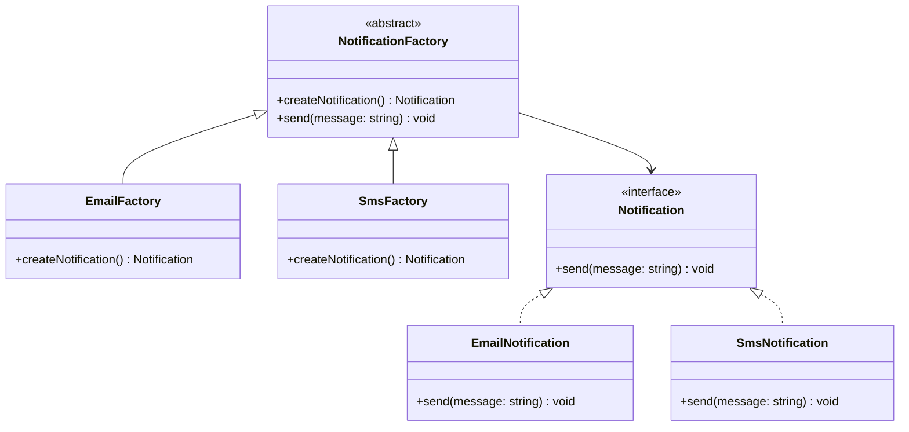

---
# Required
sidebar_position: 2
title: "Factory Method Pattern — Flexible Object Creation"
description: >-
  Learn the Factory Method pattern to create objects without hard-coding
  concrete classes. Includes multi-language examples and real-world guidance.

# SEO
keywords:
  - factory method pattern
  - factory pattern
  - factory design pattern
  - factory method example
  - when to use factory method

difficulty: beginner
category: creational
related_solid: [OCP, DIP]

# Social sharing
og_title: "Factory Method Pattern: Flexible Object Creation"
og_description: "Create objects without hard-coding concrete classes."
og_image: "/img/social-card.svg"

# Content management
date_published: 2026-01-25
date_modified: 2026-01-25
author: shivam
reading_time: 12
content_type: explanation
---

# Factory Method Pattern

<PatternMeta>
  <Difficulty level="beginner" />
  <TimeToRead minutes={12} />
  <Prerequisites patterns={["Strategy"]} />
</PatternMeta>

> **Definition:** The Factory Method pattern defines an interface for creating objects, but lets subclasses decide which concrete class to instantiate.

---

## The Problem: Too Many Constructors, Too Many Callers

While building a deployment system, we supported multiple notification channels: email, Slack, and paging. Each new channel required changing the callers because they instantiated the notification class directly. Every change meant touching multiple services.

**The bug pattern was consistent:** a new notification type broke tests across the system because the callers knew too much about construction. We needed a stable API for creation and a flexible way to choose implementations.

---

## What Is the Factory Method Pattern?

Factory Method moves object creation into a dedicated method that subclasses override. Callers use the base class, so adding new types does not change the call sites.

### Structure



### Key Components

- **Creator (Factory):** Defines the factory method and common behavior.
- **Concrete Creator:** Overrides the factory method to create a specific product.
- **Product Interface:** The stable interface callers depend on.
- **Concrete Product:** The actual implementation classes.

### SOLID Principles Connection

- **OCP:** Add new products without changing existing code.
- **DIP:** Callers depend on abstractions, not concrete classes.

---

## When to Use Factory Method

- You need to create different variants but keep a stable API.
- You want subclasses to decide which implementation to use.
- Construction logic should be centralized and testable.
- Callers should not know concrete classes.

## When NOT to Use Factory Method

- There is only one concrete product and no future variation.
- The creation logic is trivial and unlikely to change.
- A simple constructor is already clear and stable.

---

## Implementation

<CodeTabs>
  <TabItem value="python" label="Python">
    ```python
    from abc import ABC, abstractmethod


    class Notification(ABC):
        @abstractmethod
        def send(self, message: str) -> None:
            raise NotImplementedError


    class EmailNotification(Notification):
        def send(self, message: str) -> None:
            print(f"email: {message}")


    class SmsNotification(Notification):
        def send(self, message: str) -> None:
            print(f"sms: {message}")


    class NotificationFactory(ABC):
        def send(self, message: str) -> None:
            notification = self.create_notification()
            notification.send(message)

        @abstractmethod
        def create_notification(self) -> Notification:
            raise NotImplementedError


    class EmailFactory(NotificationFactory):
        def create_notification(self) -> Notification:
            return EmailNotification()
    ```
  </TabItem>
  <TabItem value="typescript" label="TypeScript">
    ```typescript
    interface Notification {
      send(message: string): void;
    }

    class EmailNotification implements Notification {
      send(message: string): void {
        console.log(`email: ${message}`);
      }
    }

    abstract class NotificationFactory {
      send(message: string): void {
        const notification = this.createNotification();
        notification.send(message);
      }

      protected abstract createNotification(): Notification;
    }

    class EmailFactory extends NotificationFactory {
      protected createNotification(): Notification {
        return new EmailNotification();
      }
    }
    ```
  </TabItem>
  <TabItem value="go" label="Go">
    ```go
    package notifications

    type Notification interface {
        Send(message string)
    }

    type EmailNotification struct{}

    func (e EmailNotification) Send(message string) {
        println("email:", message)
    }

    type NotificationFactory interface {
        Create() Notification
        Send(message string)
    }

    type EmailFactory struct{}

    func (f EmailFactory) Create() Notification {
        return EmailNotification{}
    }

    func (f EmailFactory) Send(message string) {
        f.Create().Send(message)
    }
    ```
  </TabItem>
  <TabItem value="java" label="Java">
    ```java
    interface Notification {
        void send(String message);
    }

    class EmailNotification implements Notification {
        public void send(String message) {
            System.out.println("email: " + message);
        }
    }

    abstract class NotificationFactory {
        public void send(String message) {
            Notification n = createNotification();
            n.send(message);
        }

        protected abstract Notification createNotification();
    }

    class EmailFactory extends NotificationFactory {
        protected Notification createNotification() {
            return new EmailNotification();
        }
    }
    ```
  </TabItem>
  <TabItem value="csharp" label="C#">
    ```csharp
    public interface INotification
    {
        void Send(string message);
    }

    public class EmailNotification : INotification
    {
        public void Send(string message)
        {
            Console.WriteLine($"email: {message}");
        }
    }

    public abstract class NotificationFactory
    {
        public void Send(string message)
        {
            var notification = CreateNotification();
            notification.Send(message);
        }

        protected abstract INotification CreateNotification();
    }

    public class EmailFactory : NotificationFactory
    {
        protected override INotification CreateNotification()
        {
            return new EmailNotification();
        }
    }
    ```
  </TabItem>
</CodeTabs>

---

## Real-World Example: Payment Processor Selection

Payment platforms often choose processors based on region, currency, or risk rules. A Factory Method keeps the selection logic centralized while letting the rest of the system depend on a stable interface.

In one CI/CD platform I worked on, we used the same idea for artifact storage. The "upload" call never changed, even as we added S3, Artifactory, and internal blob stores.

---

## Performance Considerations

| Aspect | Impact | Notes |
|--------|--------|-------|
| Memory | Low | One extra class per product |
| Runtime | Low | Small indirection on creation |
| Complexity | Medium | More types to navigate |

---

## Testing This Pattern

Factory Method improves testability because the factory is a seam. Replace the concrete factory with a fake and assert behavior.

```python
class FakeFactory(NotificationFactory):
    def __init__(self) -> None:
        self.created = False

    def create_notification(self) -> Notification:
        self.created = True
        return EmailNotification()


def test_factory_creates_notification() -> None:
    factory = FakeFactory()
    factory.send("hello")
    assert factory.created is True
```

---

## Common Mistakes

- Turning the factory into a giant switch statement.
- Letting callers instantiate concrete products directly.
- Creating factories with hidden side effects.

---

## Related Patterns

| Pattern | Relationship |
|---------|--------------|
| Abstract Factory | Factory Method for families of products |
| Builder | Handles complex multi-step construction |
| Prototype | Creates objects by cloning rather than instantiating |

---

## Pattern Combinations

- **With Strategy:** Choose which factory to use at runtime.
- **With Singleton:** Share one factory instance in a subsystem.

---

## Try It Yourself

Create a report generator that supports PDF, CSV, and HTML. Start with a factory method that returns the right formatter.

---

## Frequently Asked Questions

### Is Factory Method the same as a simple factory?
No. A simple factory is usually a single function with a switch. Factory Method pushes creation into subclasses.

### Does Factory Method require inheritance?
Typically yes, but you can also use composition to provide the factory method.

### What is the biggest risk of Factory Method?
It can create too many subclasses if the variation is small.

### How do I test code using Factory Method?
Inject a fake factory or a stubbed product to verify behavior without real dependencies.

---

## Key Takeaways

- **Factory Method hides object creation behind a stable interface.**
- **It keeps callers decoupled from concrete classes.**
- **It shines when you expect new variants over time.**

---

## Downloads

- Factory Method Cheat Sheet (Coming soon)
- Complete Code Examples (Coming soon)
- Practice Exercises (Coming soon)

---

**Next:** [Abstract Factory Pattern](/docs/design-patterns/creational/abstract-factory)
