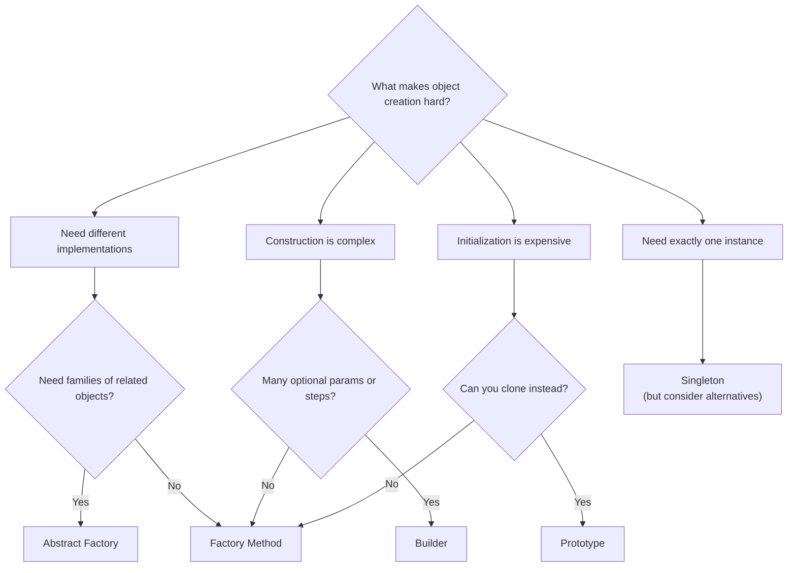

---
# Required
sidebar_position: 1
title: "Creational Design Patterns — Overview"
description: >-
  Creational patterns help you manage object creation with flexibility and
  control. Learn when to use Factory Method, Builder, Prototype, and Singleton.

# SEO
keywords:
  - creational design patterns
  - object creation patterns
  - factory method pattern
  - abstract factory pattern
  - builder pattern
  - singleton pattern
  - prototype pattern

# Social sharing
og_title: "Creational Patterns: Managing Object Creation"
og_description: "A practical guide to patterns that manage flexible object creation."
og_image: "/img/social-card.svg"

# Content management
date_published: 2026-01-25
date_modified: 2026-01-25
author: shivam
reading_time: 10
content_type: explanation
---

# Creational Patterns Overview

When I was building an internal deployment platform at NVIDIA, the hardest problem wasn't deploying containers. It was creating all the variant configuration objects without turning every new environment into a special case.

We had production configs. Staging configs. Developer sandboxes. GPU test environments. Each one needed slightly different settings—different resource limits, different network policies, different secrets providers. The naive approach was a constructor with fifteen optional parameters. The result was unreadable code and constant bugs from misconfigured environments.

That pain is exactly what creational patterns solve. **Creational patterns manage how objects get created, so the rest of your code doesn't have to know the messy details.**

---

## When You Need a Creational Pattern

You're looking at a creational problem when:

- **Object creation involves multiple steps or rules.** The object isn't valid until certain fields are set in a certain order. A constructor isn't expressive enough.

- **You need to swap implementations without changing callers.** Today you create `EmailNotifier`, tomorrow you need `SlackNotifier`, and callers shouldn't care which one they get.

- **Construction logic is duplicated.** You see the same ten lines of setup code scattered across the codebase, each copy slightly different.

- **You want to defer or centralize creation decisions.** Instead of hard-coding `new ConcreteClass()` everywhere, you want a single place that decides what to create.

If none of these apply, you probably don't need a creational pattern. A plain constructor is fine.

---

## The Five Creational Patterns

Here's the landscape of creational patterns, from simplest to most complex:

| Pattern | What It Does | When You Need It |
|---------|--------------|------------------|
| **Factory Method** | Lets subclasses decide which class to instantiate | You have variants and want a stable creation API |
| **Builder** | Constructs complex objects step by step | Objects have many optional parameters |
| **Prototype** | Creates objects by cloning existing instances | Construction is expensive, cloning is cheap |
| **Singleton** | Ensures exactly one instance exists | Global access to shared resource (use sparingly) |
| **Abstract Factory** | Creates families of related objects | You need consistent sets of products |

---

## Quick Comparison

Different problems call for different patterns. Here's how to quickly narrow down:

| If Your Problem Is... | Consider... | Trade-off |
|----------------------|-------------|-----------|
| "I need different objects but a consistent interface" | Factory Method | Adds one class per variant |
| "My constructor has 10+ parameters" | Builder | More code, but readable construction |
| "Initialization is expensive and variants are similar" | Prototype | Must handle deep copy correctly |
| "I need exactly one shared instance" | Singleton | Global state, testing headaches |
| "I need families of objects that work together" | Abstract Factory | Higher abstraction, more complexity |

---

## Decision Flowchart

Use this to pick the right creational pattern:



---

## Pattern Deep Dives

Each pattern page covers:
- A real problem that motivates the pattern
- Clear structure with UML diagrams
- Working implementations in five languages
- When to use it—and when not to
- Testing strategies
- Common mistakes to avoid

### The Patterns

- **[Factory Method →](/docs/design-patterns/creational/factory-method)**  
  The workhorse of creational patterns. Creates objects through a method that subclasses can override. Use when you need flexibility about which class to instantiate.

- **[Abstract Factory →](/docs/design-patterns/creational/abstract-factory)**  
  Creates families of related objects. Use when you need to ensure that products from the same family work together correctly.

- **[Builder →](/docs/design-patterns/creational/builder)**  
  Constructs complex objects step by step. Use when constructors become unreadable or validation happens at construction time.

- **[Prototype →](/docs/design-patterns/creational/prototype)**  
  Creates objects by cloning. Use when object initialization is expensive and cloning is cheaper than constructing from scratch.

- **[Singleton →](/docs/design-patterns/creational/singleton)**  
  Ensures a single instance. Use very sparingly—global state creates testing problems and hidden dependencies.

---

## Real-World Example: Configuration Management

Let me show how these patterns apply to a real problem I faced: managing configuration for a multi-environment deployment system.

**The problem:** We needed configuration objects for production, staging, and development environments. Each configuration had 20+ fields, some required, some optional, some interdependent.

**Initial approach:** A giant constructor.

```python
config = DeploymentConfig(
    env="prod",
    replicas=3,
    memory_limit="4Gi",
    cpu_limit="2",
    secret_provider="vault",
    vault_path="/secrets/prod",
    # ... 15 more parameters
)
```

This was error-prone. Engineers would forget parameters, mix up order, or pass invalid combinations.

**Builder approach:** We wrapped construction in a builder:

```python
config = (
    DeploymentConfigBuilder()
    .for_production()
    .with_resources(memory="4Gi", cpu="2")
    .with_vault_secrets("/secrets/prod")
    .with_replicas(3)
    .build()
)
```

The builder validated combinations, provided sensible defaults, and made the code self-documenting.

**Factory Method for variants:** We then added a factory for standard configurations:

```python
config = ConfigFactory.create("production")  # Returns pre-configured builder
```

**Result:** New environments went from "copy-paste and hope" to "call the factory and override what's different." Configuration bugs dropped significantly.

---

## Common Mistakes with Creational Patterns

### Over-engineering simple creation

If you're creating objects with 3-4 parameters that rarely change, a constructor is fine. Don't add a Factory or Builder "just in case."

**Symptom:** Your Factory creates exactly one type and never changes.

### Using Singleton for convenience, not necessity

Singleton is often abused to make objects globally accessible. But global accessibility has costs: hidden dependencies, testing difficulties, and eventual regret.

**Better alternative:** Dependency injection. Pass the object explicitly instead of making it global.

### Forgetting that Prototype needs deep copy

Shallow copies share state. If your prototype has mutable nested objects, cloning one and modifying it will affect the original.

**Fix:** Always implement proper deep copy, or use immutable objects.

### Abstract Factory for one product type

Abstract Factory shines when you have *families* of products. If you only have one product type, Factory Method is simpler and sufficient.

---

## Navigation

- **Previous:** [Learning Paths](/docs/design-patterns/learning-paths)
- **Next:** [Factory Method Pattern](/docs/design-patterns/creational/factory-method)
