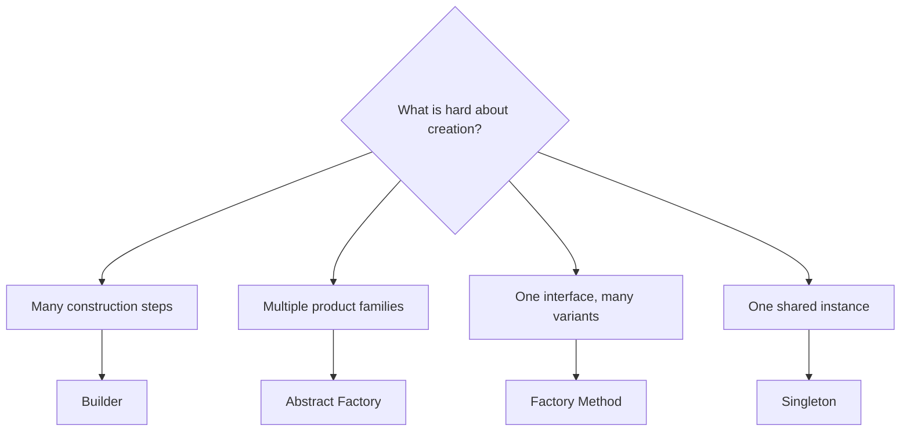

---
# Required
sidebar_position: 1
title: "Creational Design Patterns — Overview"
description: >-
  Creational patterns help you manage object creation with flexibility and
  control. Learn when to use Factory Method, Builder, Prototype, and Singleton.

# SEO
keywords:
  - creational design patterns
  - object creation patterns
  - factory method
  - abstract factory
  - builder
  - singleton
  - prototype

# Social sharing
og_title: "Creational Patterns Overview"
og_description: "A practical guide to patterns that manage object creation."
og_image: "/img/social-card.svg"

# Content management
date_published: 2026-01-25
date_modified: 2026-01-25
author: shivam
reading_time: 8
content_type: explanation
---

# Creational Patterns Overview

When I was building an internal deployment system, the hardest part was not deploying containers. It was creating all the variant configuration objects without turning every new environment into a new class. Creational patterns exist for that exact pain.

**Creational patterns manage how objects are created, not just what they do.**

## When You Need a Creational Pattern

You need a creational pattern when:

- Object creation involves multiple steps or configuration rules
- You need to swap product variants without changing callers
- Construction logic is duplicated across the codebase

## Quick Comparison

| Pattern | Best for | Trade-off |
|---------|----------|-----------|
| Factory Method | Extension via subclasses | More classes |
| Abstract Factory | Families of related objects | Higher abstraction |
| Builder | Complex step-by-step construction | More moving parts |
| Prototype | Cloning configured objects | Risk of shallow copy bugs |
| Singleton | Shared instance with global access | Tight coupling and hidden state |

## Decision Guide

## Pattern Index

- [Factory Method](/docs/design-patterns/creational/factory-method)
- [Abstract Factory](/docs/design-patterns/creational/abstract-factory)
- [Builder](/docs/design-patterns/creational/builder)
- [Prototype](/docs/design-patterns/creational/prototype)
- [Singleton](/docs/design-patterns/creational/singleton)

## Navigation

- **Previous:** [Learning Paths](/docs/design-patterns/learning-paths)
- **Next:** [Factory Method Pattern](/docs/design-patterns/creational/factory-method)
