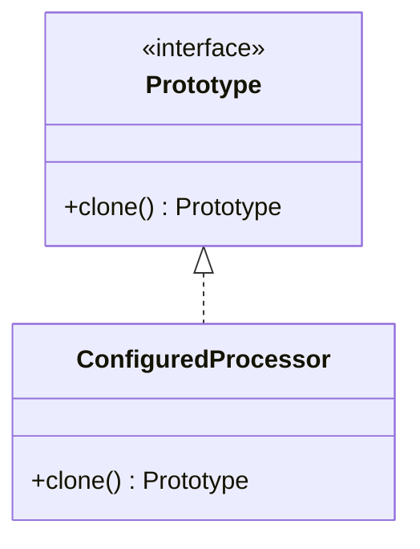

---
# Required
sidebar_position: 5
title: "Prototype Pattern — Fast Object Cloning"
description: >-
  Learn the Prototype pattern to create new objects by cloning existing ones.
  Ideal for expensive or complex initialization.

# SEO
keywords:
  - prototype pattern
  - cloning objects
  - prototype design pattern
  - when to use prototype

difficulty: intermediate
category: creational
related_solid: [SRP, OCP]

# Social sharing
og_title: "Prototype Pattern: Fast Object Cloning"
og_description: "Create new objects by cloning configured prototypes."
og_image: "/img/social-card.svg"

# Content management
date_published: 2026-01-25
date_modified: 2026-01-25
author: shivam
reading_time: 11
content_type: explanation
---

# Prototype Pattern

<PatternMeta>
  <Difficulty level="intermediate" />
  <TimeToRead minutes={11} />
  <Prerequisites patterns={["Builder"]} />
</PatternMeta>

> **Definition:** The Prototype pattern creates new objects by copying an existing instance, known as the prototype.

---

## The Problem: Expensive Initialization

In an observability pipeline I worked on, initializing a metrics processor required loading large schemas and precomputing indexes. Creating that object for each request was costly, but sharing a singleton caused state leaks.

**We needed fast creation with safe, independent state.**

---

## What Is the Prototype Pattern?

Prototype keeps a configured instance and clones it whenever a new one is needed. It is especially useful when construction is expensive or complex.

### Structure



### Key Components

- **Prototype Interface:** Declares the clone operation.
- **Concrete Prototype:** Implements cloning logic.
- **Client:** Requests clones instead of new objects.

### SOLID Principles Connection

- **SRP:** Encapsulates cloning in the prototype itself.
- **OCP:** Add new prototypes without changing client logic.

---

## When to Use Prototype

- Object creation is expensive or complex.
- You need many similar objects with small variations.
- You want to avoid subclass explosion for configuration.

## When NOT to Use Prototype

- Cloning logic is complicated (deep copy pitfalls).
- The object is small and cheap to build.
- You cannot safely copy internal state.

---

## Implementation

<CodeTabs>
  <TabItem value="python" label="Python">
    ```python
    from dataclasses import dataclass
    import copy


    @dataclass
    class ProcessorPrototype:
        schema_version: str
        rules: list[str]

        def clone(self) -> "ProcessorPrototype":
            return copy.deepcopy(self)


    prototype = ProcessorPrototype("v1", ["sanitize", "enrich"])
    fast_copy = prototype.clone()
    ```
  </TabItem>
  <TabItem value="typescript" label="TypeScript">
    ```typescript
    type ProcessorPrototype = {
      schemaVersion: string;
      rules: string[];
      clone(): ProcessorPrototype;
    };

    const prototype: ProcessorPrototype = {
      schemaVersion: "v1",
      rules: ["sanitize", "enrich"],
      clone() {
        return {
          schemaVersion: this.schemaVersion,
          rules: [...this.rules],
          clone: this.clone
        };
      }
    };
    ```
  </TabItem>
  <TabItem value="go" label="Go">
    ```go
    package processors

    type Processor struct {
        SchemaVersion string
        Rules         []string
    }

    func (p Processor) Clone() Processor {
        rules := append([]string{}, p.Rules...)
        return Processor{SchemaVersion: p.SchemaVersion, Rules: rules}
    }
    ```
  </TabItem>
  <TabItem value="java" label="Java">
    ```java
    class Processor implements Cloneable {
        String schemaVersion;
        java.util.List<String> rules;

        Processor(String version, java.util.List<String> rules) {
            this.schemaVersion = version;
            this.rules = new java.util.ArrayList<>(rules);
        }

        public Processor clone() {
            return new Processor(schemaVersion, rules);
        }
    }
    ```
  </TabItem>
  <TabItem value="csharp" label="C#">
    ```csharp
    public class Processor
    {
        public string SchemaVersion { get; }
        public List<string> Rules { get; }

        public Processor(string schemaVersion, List<string> rules)
        {
            SchemaVersion = schemaVersion;
            Rules = new List<string>(rules);
        }

        public Processor Clone()
        {
            return new Processor(SchemaVersion, Rules);
        }
    }
    ```
  </TabItem>
</CodeTabs>

---

## Real-World Example: Template-Based Configs

Infrastructure platforms often store a "golden" configuration for logging, metrics, and tracing. New services clone the template and override a few fields. This is a classic use of Prototype.

---

## Performance Considerations

| Aspect | Impact | Notes |
|--------|--------|-------|
| Memory | Medium | Duplicate state across clones |
| Runtime | Low | Cloning is faster than re-initialization |
| Complexity | Medium | Must manage deep copy correctly |

---

## Testing This Pattern

Testing focuses on independence: changes to one clone should not affect another.

```python
def test_clone_independent_state() -> None:
    proto = ProcessorPrototype("v1", ["a"])
    clone = proto.clone()
    clone.rules.append("b")
    assert proto.rules == ["a"]
```

---

## Common Mistakes

- Shallow copies that share mutable state.
- Cloning objects that should not be duplicated (sockets, file handles).
- Forgetting to update clone logic when new fields are added.

---

## Related Patterns

| Pattern | Relationship |
|---------|--------------|
| Builder | Alternative for complex construction |
| Factory Method | Creates new instances without cloning |
| Singleton | Opposite: shared instance, not copies |

---

## Pattern Combinations

- **With Builder:** Use a prototype as a starting point, then customize via builder.
- **With Object Pool:** Clone from pooled prototypes for fast provisioning.

---

## Try It Yourself

Create a prototype for a dashboard widget with default styling. Clone and override just the title and data source.

---

## Frequently Asked Questions

### Is Prototype safe in multi-threaded code?
It can be, but ensure clones do not share mutable state.

### Do I always need deep cloning?
Only if the object has nested mutable state.

### When does Prototype hurt?
When cloning is expensive or error-prone.

### How do I test code using Prototype?
Verify clones are independent and preserve the intended defaults.

---

## Key Takeaways

- **Prototype is ideal for expensive object creation.**
- **Cloning must be done carefully to avoid shared state.**
- **Use it when configuration is stable but instantiation is costly.**

---

## Downloads

- Prototype Cheat Sheet (Coming soon)
- Complete Code Examples (Coming soon)
- Practice Exercises (Coming soon)

---

## Navigation

- **Previous:** [Builder Pattern](/docs/design-patterns/creational/builder)
- **Next:** [Singleton Pattern](/docs/design-patterns/creational/singleton)
