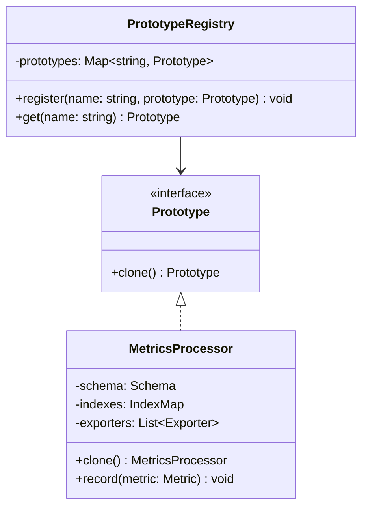

---
# Required
sidebar_position: 5
title: "Prototype Pattern — Creating Objects by Cloning"
description: >-
  Learn the Prototype pattern to create new objects by cloning existing ones.
  Ideal when initialization is expensive or configuration is complex.

# SEO
keywords:
  - prototype pattern
  - cloning objects
  - prototype design pattern
  - when to use prototype
  - object copying

difficulty: intermediate
category: creational
related_solid: [SRP, OCP]

# Social sharing
og_title: "Prototype Pattern: Creating Objects by Cloning"
og_description: "Create new objects by cloning configured prototypes—faster and safer."
og_image: "/img/social-card.svg"

# Content management
date_published: 2026-01-25
date_modified: 2026-01-25
author: shivam
reading_time: 12
content_type: explanation
---

# Prototype Pattern

<PatternMeta>
  <Difficulty level="intermediate" />
  <TimeToRead minutes={12} />
  <Prerequisites patterns={["Factory Method", "Builder"]} />
</PatternMeta>

The metrics processor that took 800ms to initialize taught me why Prototype exists.

In our observability pipeline at NVIDIA, we had a `MetricsProcessor` that loaded schemas from a remote service, precomputed label indexes, and established connections to multiple exporters. First-time initialization took almost a second. That was fine for long-running services, but a disaster for functions that needed fresh processors per request.

The naive fix was a singleton—share one processor across all requests. But that caused state leakage. One request's accumulated metrics would leak into another. We needed isolated state with shared configuration.

Prototype solved this perfectly: **initialize once, clone many times.** The first processor took 800ms to create. Cloning it took 2ms, and each clone had independent state.

```python
# Expensive: ~800ms
original = MetricsProcessor(schema_url="https://schemas.internal/v2")

# Cheap: ~2ms each, with independent state
processor_1 = original.clone()
processor_2 = original.clone()
```

---

## What Is the Prototype Pattern?

> **Definition:** Prototype creates new objects by copying an existing instance, called the prototype.

Instead of constructing from scratch, you clone a pre-configured template. The clone has the same configuration as the original but independent state.

**The key insight: Prototype separates expensive initialization from cheap instantiation.** You pay the initialization cost once, then clone for pennies.

---

## Structure



### Key Components

| Component | Role |
|-----------|------|
| **Prototype Interface** | Declares the `clone()` operation |
| **Concrete Prototype** | Implements cloning, decides what to copy vs. share |
| **Client/Registry** | Manages prototypes and requests clones |

### SOLID Principles Connection

- **Single Responsibility:** Cloning logic is encapsulated in the prototype itself
- **Open/Closed:** Add new prototype types without modifying client code

---

## When to Use Prototype

✅ **Use it when:**

- Object initialization is expensive (network calls, disk I/O, complex computation)
- You need many objects with the same configuration but independent state
- You want to avoid complex class hierarchies for object variations
- The runtime type of objects isn't known until runtime

❌ **Don't use it when:**

- Objects are cheap to create (simple constructors)
- Objects have complex circular references that make cloning tricky
- Cloning would require deep copying large object graphs
- A Factory would work just as well

**Rule of thumb:** If creating an object takes measurable time (>10ms), and you need multiple similar objects, consider Prototype.

---

## Implementation

<CodeTabs>
  <TabItem value="python" label="Python">
    ```python
    from abc import ABC, abstractmethod
    from copy import deepcopy
    from dataclasses import dataclass, field


    @dataclass
    class Schema:
        """Expensive to load from remote service."""
        version: str
        fields: dict = field(default_factory=dict)


    @dataclass
    class MetricsProcessor:
        """Processes metrics with loaded schema and indexes."""
        schema: Schema
        indexes: dict = field(default_factory=dict)
        # Mutable state that should NOT be shared
        accumulated_metrics: list = field(default_factory=list)
        
        def clone(self) -> "MetricsProcessor":
            """Create a copy with independent mutable state."""
            return MetricsProcessor(
                schema=self.schema,  # Share immutable config
                indexes=self.indexes,  # Share immutable config
                accumulated_metrics=[],  # Fresh mutable state
            )
        
        def record(self, metric: dict) -> None:
            self.accumulated_metrics.append(metric)
        
        def flush(self) -> list:
            metrics = self.accumulated_metrics
            self.accumulated_metrics = []
            return metrics


    class PrototypeRegistry:
        """Manages named prototypes for easy retrieval."""
        
        def __init__(self) -> None:
            self._prototypes: dict[str, MetricsProcessor] = {}
        
        def register(self, name: str, prototype: MetricsProcessor) -> None:
            self._prototypes[name] = prototype
        
        def get(self, name: str) -> MetricsProcessor:
            """Return a clone of the named prototype."""
            if name not in self._prototypes:
                raise KeyError(f"Unknown prototype: {name}")
            return self._prototypes[name].clone()


    # Usage
    def create_expensive_processor() -> MetricsProcessor:
        """Simulates expensive initialization."""
        print("Loading schema from remote service...")  # Takes ~800ms
        schema = Schema(version="v2", fields={"cpu": "gauge", "memory": "gauge"})
        print("Building indexes...")  # Takes ~200ms
        indexes = {"cpu": 0, "memory": 1}
        return MetricsProcessor(schema=schema, indexes=indexes)


    # Initialize once
    registry = PrototypeRegistry()
    registry.register("default", create_expensive_processor())

    # Clone many times
    processor_a = registry.get("default")
    processor_b = registry.get("default")

    # Independent state
    processor_a.record({"cpu": 80})
    processor_b.record({"memory": 4096})

    print(processor_a.accumulated_metrics)  # [{"cpu": 80}]
    print(processor_b.accumulated_metrics)  # [{"memory": 4096}]
    ```
  </TabItem>
  <TabItem value="typescript" label="TypeScript">
    ```typescript
    interface Prototype<T> {
      clone(): T;
    }

    interface Schema {
      readonly version: string;
      readonly fields: Record<string, string>;
    }

    class MetricsProcessor implements Prototype<MetricsProcessor> {
      private accumulatedMetrics: Record<string, number>[] = [];

      constructor(
        private readonly schema: Schema,
        private readonly indexes: Record<string, number>
      ) {}

      clone(): MetricsProcessor {
        // Share immutable config, fresh mutable state
        const cloned = new MetricsProcessor(this.schema, this.indexes);
        return cloned;
      }

      record(metric: Record<string, number>): void {
        this.accumulatedMetrics.push(metric);
      }

      flush(): Record<string, number>[] {
        const metrics = this.accumulatedMetrics;
        this.accumulatedMetrics = [];
        return metrics;
      }
    }

    class PrototypeRegistry {
      private prototypes = new Map<string, MetricsProcessor>();

      register(name: string, prototype: MetricsProcessor): void {
        this.prototypes.set(name, prototype);
      }

      get(name: string): MetricsProcessor {
        const prototype = this.prototypes.get(name);
        if (!prototype) {
          throw new Error(`Unknown prototype: ${name}`);
        }
        return prototype.clone();
      }
    }

    // Usage
    const schema: Schema = { version: "v2", fields: { cpu: "gauge" } };
    const indexes = { cpu: 0, memory: 1 };
    const original = new MetricsProcessor(schema, indexes);

    const registry = new PrototypeRegistry();
    registry.register("default", original);

    const processorA = registry.get("default");
    const processorB = registry.get("default");

    processorA.record({ cpu: 80 });
    processorB.record({ memory: 4096 });
    // Independent state
    ```
  </TabItem>
  <TabItem value="go" label="Go">
    ```go
    package metrics

    import "fmt"

    type Schema struct {
        Version string
        Fields  map[string]string
    }

    type MetricsProcessor struct {
        schema             *Schema
        indexes            map[string]int
        accumulatedMetrics []map[string]float64
    }

    func NewMetricsProcessor(schema *Schema, indexes map[string]int) *MetricsProcessor {
        return &MetricsProcessor{
            schema:             schema,
            indexes:            indexes,
            accumulatedMetrics: []map[string]float64{},
        }
    }

    func (p *MetricsProcessor) Clone() *MetricsProcessor {
        // Share immutable config, create fresh mutable state
        return &MetricsProcessor{
            schema:             p.schema,  // Shared reference OK if immutable
            indexes:            p.indexes, // Shared reference OK if immutable
            accumulatedMetrics: []map[string]float64{}, // Fresh slice
        }
    }

    func (p *MetricsProcessor) Record(metric map[string]float64) {
        p.accumulatedMetrics = append(p.accumulatedMetrics, metric)
    }

    func (p *MetricsProcessor) Flush() []map[string]float64 {
        metrics := p.accumulatedMetrics
        p.accumulatedMetrics = []map[string]float64{}
        return metrics
    }

    type PrototypeRegistry struct {
        prototypes map[string]*MetricsProcessor
    }

    func NewPrototypeRegistry() *PrototypeRegistry {
        return &PrototypeRegistry{
            prototypes: make(map[string]*MetricsProcessor),
        }
    }

    func (r *PrototypeRegistry) Register(name string, prototype *MetricsProcessor) {
        r.prototypes[name] = prototype
    }

    func (r *PrototypeRegistry) Get(name string) (*MetricsProcessor, error) {
        prototype, ok := r.prototypes[name]
        if !ok {
            return nil, fmt.Errorf("unknown prototype: %s", name)
        }
        return prototype.Clone(), nil
    }
    ```
  </TabItem>
  <TabItem value="java" label="Java">
    ```java
    import java.util.*;

    interface Prototype<T> {
        T clone();
    }

    class Schema {
        private final String version;
        private final Map<String, String> fields;

        public Schema(String version, Map<String, String> fields) {
            this.version = version;
            this.fields = Map.copyOf(fields);
        }

        public String getVersion() { return version; }
        public Map<String, String> getFields() { return fields; }
    }

    class MetricsProcessor implements Prototype<MetricsProcessor> {
        private final Schema schema;
        private final Map<String, Integer> indexes;
        private List<Map<String, Double>> accumulatedMetrics = new ArrayList<>();

        public MetricsProcessor(Schema schema, Map<String, Integer> indexes) {
            this.schema = schema;
            this.indexes = indexes;
        }

        @Override
        public MetricsProcessor clone() {
            // Share immutable config, fresh mutable state
            return new MetricsProcessor(this.schema, this.indexes);
        }

        public void record(Map<String, Double> metric) {
            accumulatedMetrics.add(metric);
        }

        public List<Map<String, Double>> flush() {
            var metrics = accumulatedMetrics;
            accumulatedMetrics = new ArrayList<>();
            return metrics;
        }
    }

    class PrototypeRegistry {
        private final Map<String, MetricsProcessor> prototypes = new HashMap<>();

        public void register(String name, MetricsProcessor prototype) {
            prototypes.put(name, prototype);
        }

        public MetricsProcessor get(String name) {
            var prototype = prototypes.get(name);
            if (prototype == null) {
                throw new IllegalArgumentException("Unknown prototype: " + name);
            }
            return prototype.clone();
        }
    }
    ```
  </TabItem>
  <TabItem value="csharp" label="C#">
    ```csharp
    public interface IPrototype<T>
    {
        T Clone();
    }

    public record Schema(string Version, IReadOnlyDictionary<string, string> Fields);

    public class MetricsProcessor : IPrototype<MetricsProcessor>
    {
        private readonly Schema _schema;
        private readonly IReadOnlyDictionary<string, int> _indexes;
        private List<Dictionary<string, double>> _accumulatedMetrics = new();

        public MetricsProcessor(Schema schema, IReadOnlyDictionary<string, int> indexes)
        {
            _schema = schema;
            _indexes = indexes;
        }

        public MetricsProcessor Clone()
        {
            // Share immutable config, fresh mutable state
            return new MetricsProcessor(_schema, _indexes);
        }

        public void Record(Dictionary<string, double> metric)
        {
            _accumulatedMetrics.Add(metric);
        }

        public List<Dictionary<string, double>> Flush()
        {
            var metrics = _accumulatedMetrics;
            _accumulatedMetrics = new List<Dictionary<string, double>>();
            return metrics;
        }
    }

    public class PrototypeRegistry
    {
        private readonly Dictionary<string, MetricsProcessor> _prototypes = new();

        public void Register(string name, MetricsProcessor prototype)
        {
            _prototypes[name] = prototype;
        }

        public MetricsProcessor Get(string name)
        {
            if (!_prototypes.TryGetValue(name, out var prototype))
            {
                throw new KeyNotFoundException($"Unknown prototype: {name}");
            }
            return prototype.Clone();
        }
    }
    ```
  </TabItem>
</CodeTabs>

---

## Real-World Example: Configuration Templates

On our CI/CD platform, teams often started with a "golden" pipeline configuration and customized it. Instead of constructing from scratch each time, we used Prototype:

```python
# Golden configurations (expensive to validate and normalize)
golden_configs = PrototypeRegistry()
golden_configs.register("python-service", load_and_validate("python-service.yaml"))
golden_configs.register("node-service", load_and_validate("node-service.yaml"))
golden_configs.register("go-service", load_and_validate("go-service.yaml"))

# Team creates their config by cloning and customizing
team_config = golden_configs.get("python-service")
team_config.service_name = "auth-service"
team_config.replicas = 5
team_config.add_environment_variable("AUTH_SECRET", secret_ref="vault://auth/key")
```

The validation and normalization happened once per golden config. Teams got instant copies they could customize.

---

## Deep Copy vs. Shallow Copy

**This is where Prototype gets tricky.** You need to decide what gets copied and what gets shared.

### Shallow Copy (Shared References)

```python
def clone(self):
    return MetricsProcessor(
        schema=self.schema,  # Same reference
        indexes=self.indexes,  # Same reference
    )
```

- Fast
- Risk: if `schema` is mutated, all clones see the change
- Safe only if shared objects are immutable

### Deep Copy (Independent Copies)

```python
def clone(self):
    return MetricsProcessor(
        schema=deepcopy(self.schema),  # New copy
        indexes=deepcopy(self.indexes),  # New copy
    )
```

- Slower
- Safe: clones are fully independent
- Overkill if the copied objects are never mutated

### The Right Approach

**Copy mutable state. Share immutable state.**

```python
def clone(self):
    return MetricsProcessor(
        schema=self.schema,  # Immutable, share it
        indexes=self.indexes,  # Immutable, share it
        accumulated_metrics=[],  # Mutable, fresh copy
    )
```

---

## Performance Considerations

| Aspect | Impact | Notes |
|--------|--------|-------|
| Memory | Medium | Clones share immutable data, duplicate mutable data |
| Runtime | High benefit | Cloning bypasses expensive initialization |
| Complexity | Medium | Must manage copy semantics correctly |

**Benchmark before assuming Prototype helps.** If object creation is fast, cloning adds complexity without benefit.

---

## Testing This Pattern

Test that clones are independent—changes to one shouldn't affect another:

```python
def test_clones_have_independent_state():
    original = MetricsProcessor(schema, indexes)
    clone_a = original.clone()
    clone_b = original.clone()
    
    clone_a.record({"cpu": 50})
    clone_b.record({"memory": 2048})
    
    assert clone_a.accumulated_metrics == [{"cpu": 50}]
    assert clone_b.accumulated_metrics == [{"memory": 2048}]
    assert original.accumulated_metrics == []


def test_clones_share_immutable_config():
    original = MetricsProcessor(schema, indexes)
    clone = original.clone()
    
    # Verify shared reference for immutable data
    assert clone.schema is original.schema
    assert clone.indexes is original.indexes
```

---

## Common Mistakes

### 1. Shallow copy of mutable data

```python
def clone(self):
    return MetricsProcessor(
        metrics=self.metrics  # Bug: shared mutable list
    )
```

Mutations leak between clones. Always create fresh mutable state.

### 2. Deep copy when unnecessary

```python
def clone(self):
    return deepcopy(self)  # Expensive and often unnecessary
```

If most of the object is immutable, you're paying for copies you don't need.

### 3. Forgetting to update clone() when adding fields

```python
class Processor:
    def __init__(self):
        self.schema = ...
        self.indexes = ...
        self.new_field = ...  # Added later
    
    def clone(self):
        return Processor(
            schema=self.schema,
            indexes=self.indexes,
            # Bug: forgot new_field
        )
```

When you add fields, update `clone()`. Consider using a builder or factory to reduce this risk.

---

## Related Patterns

| Pattern | Relationship |
|---------|--------------|
| **Factory Method** | Creates new instances; Prototype copies existing ones |
| **Builder** | Configures complex objects; Prototype can clone a built template |
| **Singleton** | Opposite: shares one instance vs. creates many copies |
| **Object Pool** | Manages reusable instances; Prototype creates fresh copies |

---

## Key Takeaways

- **Prototype trades initialization time for cloning time.** Initialize once, clone many times.

- **Deep copy vs. shallow copy is the critical decision.** Copy mutable state, share immutable state.

- **Use it when initialization is measurably expensive.** If construction is fast, Prototype adds unnecessary complexity.

- **Always test clone independence.** Mutations to one clone should never affect another.

---

## Navigation

- **Previous:** [Builder Pattern](/docs/design-patterns/creational/builder)
- **Next:** [Singleton Pattern](/docs/design-patterns/creational/singleton)
