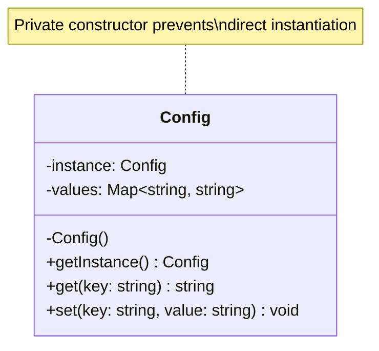

---
# Required
sidebar_position: 6
title: "Singleton Pattern — One Instance, Global Access"
description: >-
  Learn the Singleton pattern, its legitimate uses, and why it's often an
  anti-pattern. Understand when global state helps and when it hurts.

# SEO
keywords:
  - singleton pattern
  - single instance
  - global access pattern
  - singleton pitfalls
  - when to use singleton

difficulty: beginner
category: creational
related_solid: [SRP, DIP]

# Social sharing
og_title: "Singleton Pattern: One Instance, Global Access"
og_description: "Use singleton carefully. It solves real problems but adds hidden coupling."
og_image: "/img/social-card.svg"

# Content management
date_published: 2026-01-25
date_modified: 2026-01-25
author: shivam
reading_time: 14
content_type: explanation
---

# Singleton Pattern

<PatternMeta>
  <Difficulty level="beginner" />
  <TimeToRead minutes={14} />
  <Prerequisites patterns={["Factory Method"]} />
</PatternMeta>

I need to start with a confession: Singleton is the pattern I've removed from codebases more often than I've added it.

It's not that Singleton is inherently bad—it solves a real problem. But it's the most frequently misused pattern in the catalog. Engineers reach for it whenever they need something "available everywhere," and that impulse creates problems that surface months or years later.

Let me tell you about the configuration singleton that cost us three weeks.

At NVIDIA, our CI/CD platform had a `Config` singleton that held application settings. It seemed sensible—configuration should be loaded once at startup and accessible everywhere. The singleton made that easy:

```python
config = Config.instance()
db_url = config.get("database_url")
```

The problems started when we needed to test components in isolation. Tests couldn't set up custom configurations because the singleton held global state. We added a `reset()` method for testing, but that introduced race conditions in parallel test runs. One test would reset the singleton while another was reading from it.

Then we needed per-tenant configuration for multi-tenancy support. The singleton couldn't handle that—it was fundamentally a single-tenant design. We spent three weeks refactoring to dependency injection, touching nearly every file in the codebase.

**The lesson: Singleton isn't about convenience. It's a commitment to exactly one instance, forever.** Make sure that's what you actually need.

---

## What Is the Singleton Pattern?

> **Definition:** Singleton ensures a class has only one instance and provides a global point of access to it.

Two guarantees in one pattern:
1. **Single instance:** No matter how many times you ask for it, you get the same object
2. **Global access:** You can get to it from anywhere without passing it explicitly

**The key insight: Singleton is global state with controlled construction.** That's useful sometimes. It's also the source of most of its problems.

---

## Structure



### Key Components

| Component | Role |
|-----------|------|
| **Private constructor** | Prevents anyone from calling `new Config()` directly |
| **Static instance** | Holds the single instance of the class |
| **Static accessor** | Returns the instance, creating it on first access if needed |

### SOLID Principles Connection

- **SRP:** Singleton centralizes instance management... but often violates SRP by becoming a dumping ground for unrelated functionality
- **DIP:** Singleton typically *violates* DIP—code depends on a concrete class, not an abstraction

---

## When to Use Singleton

✅ **Legitimate uses:**

- **Hardware access:** A single physical resource (printer spooler, device driver)
- **Expensive shared state:** A connection pool, thread pool, or cache where multiple instances would waste resources
- **Coordination point:** A logging framework where all messages must go to one place
- **Configuration at startup:** When configuration is truly immutable after initialization

❌ **Don't use it when:**

- You want "easy access" without passing dependencies explicitly
- The instance might need to vary (per-tenant, per-request, per-test)
- The singleton would hold mutable state that could cause race conditions
- Dependency injection is available and would work better

**Rule of thumb:** If you're using Singleton because it's convenient, stop. Convenience is not a design justification. Use it only when exactly-one-instance is a real requirement.

---

## Implementation

<CodeTabs>
  <TabItem value="python" label="Python">
    ```python
    from threading import Lock


    class Config:
        """Thread-safe singleton for application configuration."""
        
        _instance = None
        _lock = Lock()
        
        def __init__(self) -> None:
            # This should only be called by instance()
            self._values: dict[str, str] = {}
            self._loaded = False
        
        @classmethod
        def instance(cls) -> "Config":
            """Get the singleton instance, creating it if necessary."""
            if cls._instance is None:
                with cls._lock:
                    # Double-check locking pattern
                    if cls._instance is None:
                        cls._instance = Config()
            return cls._instance
        
        def load(self, path: str) -> None:
            """Load configuration from file. Call once at startup."""
            if self._loaded:
                raise RuntimeError("Configuration already loaded")
            # In reality, load from file
            self._values = {"database_url": "postgres://...", "log_level": "INFO"}
            self._loaded = True
        
        def get(self, key: str) -> str:
            if not self._loaded:
                raise RuntimeError("Configuration not loaded")
            return self._values.get(key, "")
        
        @classmethod
        def _reset_for_testing(cls) -> None:
            """Reset singleton state. ONLY for testing."""
            with cls._lock:
                cls._instance = None


    # Usage
    config = Config.instance()
    config.load("/etc/app/config.yaml")
    
    # Anywhere else in the codebase
    db_url = Config.instance().get("database_url")
    ```
  </TabItem>
  <TabItem value="typescript" label="TypeScript">
    ```typescript
    class Config {
      private static instance: Config | null = null;
      private values = new Map<string, string>();
      private loaded = false;

      private constructor() {
        // Private constructor prevents direct instantiation
      }

      static getInstance(): Config {
        if (!Config.instance) {
          Config.instance = new Config();
        }
        return Config.instance;
      }

      load(config: Record<string, string>): void {
        if (this.loaded) {
          throw new Error("Configuration already loaded");
        }
        for (const [key, value] of Object.entries(config)) {
          this.values.set(key, value);
        }
        this.loaded = true;
      }

      get(key: string): string {
        if (!this.loaded) {
          throw new Error("Configuration not loaded");
        }
        return this.values.get(key) ?? "";
      }

      // For testing only
      static resetForTesting(): void {
        Config.instance = null;
      }
    }

    // Usage
    const config = Config.getInstance();
    config.load({ databaseUrl: "postgres://...", logLevel: "INFO" });

    // Anywhere else
    const dbUrl = Config.getInstance().get("databaseUrl");
    ```
  </TabItem>
  <TabItem value="go" label="Go">
    ```go
    package config

    import (
        "errors"
        "sync"
    )

    type Config struct {
        values map[string]string
        loaded bool
        mu     sync.RWMutex
    }

    var (
        instance *Config
        once     sync.Once
    )

    // Instance returns the singleton Config instance
    func Instance() *Config {
        once.Do(func() {
            instance = &Config{
                values: make(map[string]string),
            }
        })
        return instance
    }

    func (c *Config) Load(values map[string]string) error {
        c.mu.Lock()
        defer c.mu.Unlock()

        if c.loaded {
            return errors.New("configuration already loaded")
        }

        for k, v := range values {
            c.values[k] = v
        }
        c.loaded = true
        return nil
    }

    func (c *Config) Get(key string) (string, error) {
        c.mu.RLock()
        defer c.mu.RUnlock()

        if !c.loaded {
            return "", errors.New("configuration not loaded")
        }
        return c.values[key], nil
    }

    // ResetForTesting resets the singleton. Only use in tests.
    func ResetForTesting() {
        once = sync.Once{}
        instance = nil
    }
    ```
  </TabItem>
  <TabItem value="java" label="Java">
    ```java
    import java.util.Map;
    import java.util.concurrent.ConcurrentHashMap;

    public final class Config {
        private static volatile Config instance;
        private final Map<String, String> values = new ConcurrentHashMap<>();
        private volatile boolean loaded = false;

        private Config() {
            // Private constructor
        }

        public static Config getInstance() {
            if (instance == null) {
                synchronized (Config.class) {
                    if (instance == null) {
                        instance = new Config();
                    }
                }
            }
            return instance;
        }

        public void load(Map<String, String> config) {
            if (loaded) {
                throw new IllegalStateException("Configuration already loaded");
            }
            synchronized (this) {
                if (loaded) {
                    throw new IllegalStateException("Configuration already loaded");
                }
                values.putAll(config);
                loaded = true;
            }
        }

        public String get(String key) {
            if (!loaded) {
                throw new IllegalStateException("Configuration not loaded");
            }
            return values.getOrDefault(key, "");
        }

        // For testing only
        static void resetForTesting() {
            synchronized (Config.class) {
                instance = null;
            }
        }
    }
    ```
  </TabItem>
  <TabItem value="csharp" label="C#">
    ```csharp
    public sealed class Config
    {
        private static readonly Lazy<Config> _instance = 
            new Lazy<Config>(() => new Config());
        
        private readonly Dictionary<string, string> _values = new();
        private bool _loaded = false;
        private readonly object _lock = new();

        private Config() { }

        public static Config Instance => _instance.Value;

        public void Load(IDictionary<string, string> config)
        {
            lock (_lock)
            {
                if (_loaded)
                    throw new InvalidOperationException("Configuration already loaded");
                
                foreach (var (key, value) in config)
                    _values[key] = value;
                
                _loaded = true;
            }
        }

        public string Get(string key)
        {
            if (!_loaded)
                throw new InvalidOperationException("Configuration not loaded");
            
            return _values.TryGetValue(key, out var value) ? value : "";
        }
    }
    ```
  </TabItem>
</CodeTabs>

---

## Thread Safety Considerations

Singleton has a classic threading bug: two threads check if the instance exists, both see `null`, and both create new instances.

### The Wrong Way

```python
# NOT thread-safe
class Config:
    _instance = None
    
    @classmethod
    def instance(cls):
        if cls._instance is None:  # Thread A checks
            cls._instance = Config()  # Thread B also gets here
        return cls._instance
```

### The Right Way (Python)

```python
from threading import Lock

class Config:
    _instance = None
    _lock = Lock()
    
    @classmethod
    def instance(cls):
        if cls._instance is None:  # Fast path: no lock if exists
            with cls._lock:
                if cls._instance is None:  # Double-check inside lock
                    cls._instance = Config()
        return cls._instance
```

### Go's sync.Once

Go provides `sync.Once` specifically for this pattern:

```go
var once sync.Once

func Instance() *Config {
    once.Do(func() {
        instance = &Config{}
    })
    return instance
}
```

This is the cleanest solution—`once.Do` guarantees the function runs exactly once, regardless of concurrency.

---

## The Testing Problem

Here's the real cost of Singleton: it makes testing hard.

### The Problem

```python
# Production code
def process_build(build_id: str) -> BuildResult:
    config = Config.instance()  # Hidden dependency
    db = Database(config.get("database_url"))
    # ... process build
```

How do you test `process_build` with a different database URL? You can't—it always uses the global singleton.

### Workarounds

**Option 1: Reset method (risky)**
```python
def test_process_build():
    Config._reset_for_testing()
    Config.instance().load({"database_url": "sqlite://memory"})
    # Test...
```

This works but causes race conditions if tests run in parallel.

**Option 2: Interface abstraction (better)**
```python
class ConfigInterface(ABC):
    @abstractmethod
    def get(self, key: str) -> str: pass

class SingletonConfig(ConfigInterface):
    # ... singleton implementation

def process_build(build_id: str, config: ConfigInterface) -> BuildResult:
    db = Database(config.get("database_url"))
    # ... process build
```

Now tests can inject a fake `ConfigInterface`.

**Option 3: Just use dependency injection (best)**
```python
def process_build(build_id: str, config: Config) -> BuildResult:
    # Config is passed, not fetched globally
```

This is almost always the right answer.

---

## Real-World Example: When Singleton Is Right

Not all uses of Singleton are bad. Here's one that works well: a metrics client.

```python
class MetricsClient:
    """Singleton for application-wide metrics collection.
    
    Legitimate because:
    - We genuinely need exactly one instance (single connection to metrics backend)
    - Creating multiple instances would waste resources (connection pooling)
    - It's write-only (no state to leak between tests)
    - Configuration is immutable after startup
    """
    _instance = None
    _lock = Lock()
    
    def __init__(self, endpoint: str):
        self._endpoint = endpoint
        self._connection = self._connect(endpoint)
    
    @classmethod
    def initialize(cls, endpoint: str) -> None:
        """Initialize the metrics client. Call once at startup."""
        with cls._lock:
            if cls._instance is not None:
                raise RuntimeError("MetricsClient already initialized")
            cls._instance = MetricsClient(endpoint)
    
    @classmethod
    def instance(cls) -> "MetricsClient":
        if cls._instance is None:
            raise RuntimeError("MetricsClient not initialized")
        return cls._instance
    
    def record(self, metric: str, value: float) -> None:
        """Record a metric. Fire and forget."""
        self._connection.send(metric, value)
```

This Singleton works because:
- There's a genuine single-resource constraint (one metrics backend connection)
- The API is write-only, so there's no state to leak
- Configuration happens once at startup and never changes
- Testing can mock at the infrastructure level, not the singleton level

---

## Alternatives to Singleton

Before using Singleton, consider these alternatives:

### Dependency Injection

Pass the dependency explicitly:

```python
# Instead of
def process():
    config = Config.instance()

# Do this
def process(config: Config):
    # ...
```

This is more verbose but more testable, more explicit, and more flexible.

### Module-Level Constants

For truly immutable configuration:

```python
# config.py
DATABASE_URL = os.environ["DATABASE_URL"]
LOG_LEVEL = os.environ.get("LOG_LEVEL", "INFO")

# usage.py
from config import DATABASE_URL
```

Simpler than Singleton when values are truly constant.

### Service Locator

When you need flexibility without passing dependencies everywhere:

```python
class Services:
    _registry = {}
    
    @classmethod
    def register(cls, name: str, service: Any) -> None:
        cls._registry[name] = service
    
    @classmethod
    def get(cls, name: str) -> Any:
        return cls._registry[name]

# Startup
Services.register("config", Config())

# Usage
config = Services.get("config")
```

This is still global, but it's at least swappable for testing.

---

## Common Mistakes

### 1. Using Singleton for convenience

```python
# "I need this everywhere, so I'll make it a Singleton"
class UserSession:  # Wrong - sessions should vary per user
    _instance = None
```

If you're using Singleton because you don't want to pass dependencies, reconsider. That's not a design reason.

### 2. Mutable Singleton state

```python
class Config:
    def set(self, key: str, value: str) -> None:  # Danger
        self._values[key] = value
```

Mutable singletons cause subtle bugs. If one component changes the config, all other components see the change. Prefer immutable-after-initialization.

### 3. Testing afterthought

```python
# Added after tests started failing
@classmethod
def _reset_for_testing(cls):
    cls._instance = None
```

If you need a reset method, you probably shouldn't be using Singleton.

---

## Related Patterns

| Pattern | Relationship |
|---------|--------------|
| **Factory Method** | Can create singleton instances |
| **Abstract Factory** | Factories are often singletons |
| **Prototype** | Opposite approach: many copies vs. one instance |
| **Dependency Injection** | Usually a better alternative |

---

## Key Takeaways

- **Singleton guarantees exactly one instance with global access.** That's the feature and the problem.

- **Use it for genuine single-resource constraints,** not for convenience.

- **Singleton makes testing hard.** If you need testability, prefer dependency injection.

- **Consider alternatives first.** Module constants, dependency injection, and service locators often work better.

- **If you use Singleton, make it immutable after initialization.** Mutable global state causes bugs.

---

## Navigation

- **Previous:** [Prototype Pattern](/docs/design-patterns/creational/prototype)
- **Next:** [Structural Patterns Overview](/docs/design-patterns/structural)
