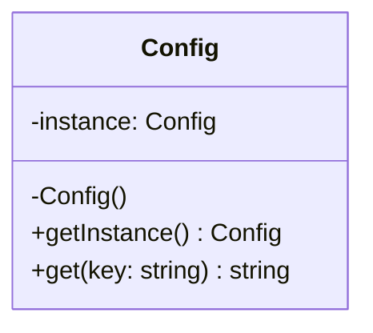

---
# Required
sidebar_position: 6
title: "Singleton Pattern — One Instance, Global Access"
description: >-
  Learn the Singleton pattern and its trade-offs. Understand when a single
  shared instance helps and when it creates hidden coupling.

# SEO
keywords:
  - singleton pattern
  - single instance
  - global access pattern
  - singleton pitfalls
  - when to use singleton

difficulty: beginner
category: creational
related_solid: [SRP, DIP]

# Social sharing
og_title: "Singleton Pattern: One Instance, Global Access"
og_description: "Use singleton carefully. It solves real problems but adds hidden coupling."
og_image: "/img/social-card.svg"

# Content management
date_published: 2026-01-25
date_modified: 2026-01-25
author: shivam
reading_time: 12
content_type: explanation
---

# Singleton Pattern

<PatternMeta>
  <Difficulty level="beginner" />
  <TimeToRead minutes={12} />
  <Prerequisites patterns={["Factory Method"]} />
</PatternMeta>

> **Definition:** The Singleton pattern ensures a class has only one instance and provides a global access point to it.

---

## The Problem: Shared State Without Chaos

In infrastructure tooling, we often need a single configuration source. Early in my career, we used global variables for this, and they spread everywhere. We later replaced them with a Singleton to centralize access and lifecycle control.

**Singleton can solve real problems, but it can also hide complexity.**

---

## What Is the Singleton Pattern?

Singleton controls instantiation so that only one instance exists, and exposes it through a static or global access method.

### Structure



### Key Components

- **Private constructor:** Prevents direct instantiation.
- **Static instance:** Stores the single object.
- **Global accessor:** Returns the instance.

### SOLID Principles Connection

- **SRP:** Centralizes lifecycle for shared resources.
- **DIP:** Often violates DIP if used as hidden dependency.

---

## When to Use Singleton

- You need one shared resource (config, logging, cache client).
- Creating the object is expensive and should happen once.
- Global access is acceptable and intentional.

## When NOT to Use Singleton

- When it hides dependencies and makes testing harder.
- When you need multiple instances in the future.
- When it encourages shared mutable state across the system.

---

## Implementation

<CodeTabs>
  <TabItem value="python" label="Python">
    ```python
    class Config:
        _instance = None

        def __init__(self) -> None:
            self._values = {"env": "prod"}

        @classmethod
        def instance(cls) -> "Config":
            if cls._instance is None:
                cls._instance = Config()
            return cls._instance

        def get(self, key: str) -> str:
            return self._values.get(key, "")
    ```
  </TabItem>
  <TabItem value="typescript" label="TypeScript">
    ```typescript
    class Config {
      private static _instance: Config | null = null;
      private values = new Map<string, string>([["env", "prod"]]);

      private constructor() {}

      static instance(): Config {
        if (!Config._instance) {
          Config._instance = new Config();
        }
        return Config._instance;
      }

      get(key: string): string {
        return this.values.get(key) ?? "";
      }
    }
    ```
  </TabItem>
  <TabItem value="go" label="Go">
    ```go
    package config

    import "sync"

    type Config struct {
        values map[string]string
    }

    var instance *Config
    var once sync.Once

    func Instance() *Config {
        once.Do(func() {
            instance = &Config{values: map[string]string{"env": "prod"}}
        })
        return instance
    }

    func (c *Config) Get(key string) string {
        return c.values[key]
    }
    ```
  </TabItem>
  <TabItem value="java" label="Java">
    ```java
    class Config {
        private static Config instance;
        private final java.util.Map<String, String> values = new java.util.HashMap<>();

        private Config() {
            values.put("env", "prod");
        }

        public static synchronized Config instance() {
            if (instance == null) {
                instance = new Config();
            }
            return instance;
        }

        public String get(String key) {
            return values.getOrDefault(key, "");
        }
    }
    ```
  </TabItem>
  <TabItem value="csharp" label="C#">
    ```csharp
    public class Config
    {
        private static readonly Lazy<Config> _instance =
            new Lazy<Config>(() => new Config());

        private readonly Dictionary<string, string> _values =
            new Dictionary<string, string> { {"env", "prod"} };

        private Config() {}

        public static Config Instance => _instance.Value;

        public string Get(string key) => _values.TryGetValue(key, out var value) ? value : "";
    }
    ```
  </TabItem>
</CodeTabs>

---

## Real-World Example: Shared Telemetry Client

In observability pipelines, each service needs a metrics client. Creating a new client per request is wasteful. A Singleton keeps one configured client with consistent exporters and tags.

---

## Performance Considerations

| Aspect | Impact | Notes |
|--------|--------|-------|
| Memory | Low | Single instance |
| Runtime | Low | One-time initialization |
| Complexity | Medium | Global access can hide dependencies |

---

## Testing This Pattern

Singletons are harder to test because they are global state. Prefer exposing the instance as a dependency when possible.

```python
def test_config_singleton() -> None:
    a = Config.instance()
    b = Config.instance()
    assert a is b
```

---

## Common Mistakes

- Using Singleton as a global variable with no control.
- Allowing mutable state to leak between tests.
- Hiding dependencies instead of injecting them.

---

## Related Patterns

| Pattern | Relationship |
|---------|--------------|
| Factory Method | Can create singleton instances |
| Object Pool | Manages a shared set of instances |
| Dependency Injection | Often a safer alternative |

---

## Pattern Combinations

- **With Factory Method:** Centralize creation while keeping a single instance.
- **With Facade:** Expose a clean API over the singleton.

---

## Try It Yourself

Implement a `Logger` singleton and then refactor it to allow injection for tests.

---

## Frequently Asked Questions

### Is Singleton always an anti-pattern?
No, but it becomes one when it hides dependencies or shares mutable state.

### Does Singleton hurt testing?
Yes, unless you provide a way to reset or inject the instance.

### Is thread safety required?
If multiple threads can access initialization, yes.

### How do I test code using Singleton?
Expose a way to reset or substitute the instance in tests, or wrap it behind an interface.

---

## Key Takeaways

- **Singleton guarantees a single instance with global access.**
- **It solves real problems but increases coupling.**
- **Use it deliberately and keep it testable.**

---

## Downloads

- Singleton Cheat Sheet (Coming soon)
- Complete Code Examples (Coming soon)
- Practice Exercises (Coming soon)

---

## Navigation

- **Previous:** [Prototype Pattern](/docs/design-patterns/creational/prototype)
- **Next:** [Structural Patterns Overview](/docs/design-patterns/structural)
