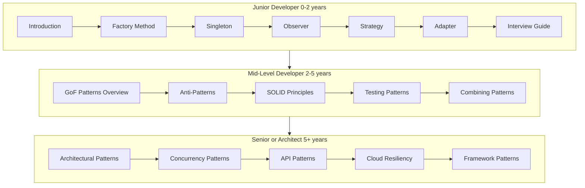

---
# Required
sidebar_position: 5
title: "Design Patterns Learning Paths"
description: >-
  Follow curated learning paths for design patterns based on your experience
  level. Start with fundamentals and grow into advanced patterns.

# SEO
keywords:
  - learn design patterns
  - design patterns roadmap
  - design patterns learning path
  - beginner design patterns

# Social sharing
og_title: "Design Patterns Learning Paths"
og_description: "Curated paths for junior, mid-level, and senior engineers."
og_image: "/img/social-card.svg"

# Content management
date_published: 2026-01-25
date_modified: 2026-01-25
author: shivam
reading_time: 8
content_type: explanation
---

# Design Patterns Learning Paths

When I mentor new engineers, I do not start with the full GoF list. I start with the patterns they will use next week. The right learning path saves months of confusion.

**This page helps you pick a path based on your experience, not your ambition.**

## Learning Paths by Experience

## Difficulty Indicators

Every pattern page includes a difficulty badge:

- **Beginner:** Core patterns every engineer should know
- **Intermediate:** Requires prior pattern experience
- **Advanced:** Complex trade-offs and sharp edges

## How to Use a Path

1. Skim the overview page for the category.
2. Read one pattern deeply, including the testing section.
3. Apply it in a small codebase before using it in production.

## Suggested First Week

If you are starting fresh, the best initial sequence is:

- Factory Method
- Strategy
- Adapter
- Observer
- Dependency Injection

These patterns show up everywhere from APIs to UI frameworks.

**Next:** [Creational Patterns Overview](/docs/design-patterns/creational)
