---
# Required
sidebar_position: 5
title: "Design Patterns Learning Paths"
description: >-
  Follow curated learning paths for design patterns based on your experience
  level. Start with fundamentals and grow into advanced patterns.

# SEO
keywords:
  - learn design patterns
  - design patterns roadmap
  - design patterns learning path
  - beginner design patterns
  - design patterns for interviews

# Social sharing
og_title: "Design Patterns Learning Paths"
og_description: "Curated paths for junior, mid-level, and senior engineers."
og_image: "/img/social-card.svg"

# Content management
date_published: 2026-01-25
date_modified: 2026-01-25
author: shivam
reading_time: 10
content_type: explanation
---

# Design Patterns Learning Paths

When I mentor engineers, I don't start with the full Gang of Four catalog. That's 23 patterns—overwhelming for anyone trying to learn while also shipping features.

Instead, I start with the patterns they'll use next week. In nine years of building platforms, dashboards, and infrastructure tooling, I've found that a handful of patterns solve the vast majority of real problems. Learning those first builds intuition that makes the rest click faster.

**This page helps you pick a path based on your experience, not your ambition.**

---

## The 80/20 of Design Patterns

Here's a truth nobody tells you: **five patterns cover 80% of the situations where patterns help.**


| Pattern | Why It's Essential | You'll Use It For |
|---------|-------------------|-------------------|
| **Factory Method** | You'll create objects everywhere. This is how you do it flexibly. | Plugin systems, handlers, exporters |
| **Strategy** | Swapping algorithms is one of the most common change types. | Payment providers, auth backends, compression |
| **Observer** | Events are everywhere—UI updates, notifications, pub/sub. | Dashboards, webhooks, reactive UIs |
| **Adapter** | You'll integrate with legacy systems and third-party APIs constantly. | API wrappers, legacy bridges |
| **Decorator** | Adding cross-cutting concerns (logging, retries, metrics) without inheritance. | Logging, caching, metrics, auth |

Learn these five well, and you'll handle most design problems. The other eighteen patterns? Learn them when you need them.

---

## Learning Paths by Experience Level


---

## Path 1: Junior Developer (0-2 years)

**Goal:** Build fluency with the essential patterns. Learn to recognize problems and match them to solutions.

**Time commitment:** 2-3 weeks if you're focused, 1-2 months casually.

### Your Learning Sequence

| Week | Pattern | Focus On | Practice Exercise |
|------|---------|----------|-------------------|
| 1 | [Factory Method](/docs/design-patterns/creational/factory-method) | Creating objects without hard-coding classes | Build a notification system with email, Slack, and SMS handlers |
| 1 | [Strategy](/docs/design-patterns/behavioral/strategy) | Swapping algorithms at runtime | Implement different sorting or validation strategies |
| 2 | [Observer](/docs/design-patterns/behavioral/observer) | Event-driven updates | Build a simple pub/sub system or dashboard updater |
| 2 | [Adapter](/docs/design-patterns/structural/adapter) | Making interfaces compatible | Wrap a third-party API to match your internal interface |
| 3 | [Decorator](/docs/design-patterns/structural/decorator) | Adding behavior without inheritance | Add logging, timing, and retry logic to an API client |

### How to Study Each Pattern

```mermaid
flowchart LR
    A["📖 Read the\nproblem story"] --> B["✏️ Draw diagram\nfrom memory"]
    B --> C["💻 Build in a\ntoy project"]
    C --> D["🔍 Find it in\nreal frameworks"]
    D --> E["✅ Pattern\nmastered"]
```



1. **Read the problem story.** Can you relate to it? If not, you might not need this pattern yet.

2. **Draw the diagram from memory.** Don't move on until you can sketch the class relationships without looking.

3. **Implement it in a toy project.** Don't just read—build something. The pattern won't stick otherwise.

4. **Find it in code you use.** React's useState is a State pattern. Express middleware is Chain of Responsibility. Seeing patterns in real code builds recognition.

### Patterns in the Wild

Patterns are everywhere in frameworks you already use. Recognizing them builds intuition:

| Framework | Pattern | Where to Look |
|-----------|---------|---------------|
| **React** | Observer | `useState`, `useEffect`, Context API |
| **Express/Koa** | Chain of Responsibility | Middleware pipeline |
| **Redux** | Command | Actions as serializable commands |
| **Mongoose** | Builder | Schema and query builders |
| **Spring** | Factory Method | `@Bean` methods, dependency injection |
| **Jest** | Composite | Matchers composing into assertions |

### Junior Path Checklist

- [ ] I can explain Factory Method to a colleague in 60 seconds
- [ ] I can explain when Strategy is better than a switch statement
- [ ] I've implemented Observer in a small project
- [ ] I've used Adapter to integrate a third-party library
- [ ] I've used Decorator to add logging or retry logic

---

## Path 2: Mid-Level Developer (2-5 years)

**Goal:** Expand your toolkit with patterns for complex construction, subsystem management, and hierarchical structures. Learn to combine patterns effectively.

**Prerequisite:** Comfortable with the five essential patterns from Path 1.

**Time commitment:** 3-4 weeks focused, 2-3 months casually.

### Your Learning Sequence

| Week | Pattern | When You'll Use It |
|------|---------|-------------------|
| 1 | [Builder](/docs/design-patterns/creational/builder) | Objects with 5+ optional parameters, configs, queries |
| 1 | [Facade](/docs/design-patterns/structural/facade) | Simplifying complex subsystems for external callers |
| 2 | [Composite](/docs/design-patterns/structural/composite) | Tree structures—pipelines, org charts, UI hierarchies |
| 2 | [Proxy](/docs/design-patterns/structural/proxy) | Caching, lazy loading, access control |
| 3 | [Template Method](/docs/design-patterns/behavioral/template-method) | Defining skeleton algorithms with customizable steps |
| 3 | [Command](/docs/design-patterns/behavioral/command) | Undo/redo, queuing operations, macro recording |

### Mid-Level Focus Areas

At this stage, focus on:


**Pattern combinations.** Real systems combine patterns. Factory + Strategy lets you create strategies at runtime. Decorator + Composite lets you wrap entire tree structures. Study the "Related Patterns" sections.

**Trade-off analysis.** Every pattern has costs. Builder adds classes. Facade can hide useful functionality. Start weighing complexity against benefit.

**Testing patterns.** Each pattern creates different testing seams. Understand how patterns affect your test strategy.

:::tip Real Example: HTTP Client
A production HTTP client might combine three patterns:
```
LoggingDecorator(
  RetryDecorator(
    MetricsDecorator(
      HttpClient()
    )
  )
)
```
Each decorator adds one concern. The client doesn't know it's being wrapped.
:::

### Mid-Level Checklist

- [ ] I've used Builder for a complex configuration object
- [ ] I've created a Facade to simplify a subsystem for callers
- [ ] I've implemented a Composite structure (pipeline, tree, hierarchy)
- [ ] I can articulate the trade-offs of each pattern I use
- [ ] I've combined two patterns in a single design

---

## Path 3: Senior/Architect (5+ years)

**Goal:** Master the patterns that solve rare but important problems. Develop judgment about when complexity is warranted.

**Prerequisite:** You've used patterns from Paths 1 and 2 in production. You've felt the trade-offs firsthand.

**Time commitment:** Ongoing. These patterns are learned over years, not weeks.

### Your Learning Sequence

| Pattern | The Problem It Solves |
|---------|----------------------|
| [Abstract Factory](/docs/design-patterns/creational/abstract-factory) | Creating families of related objects that must work together |
| [Bridge](/docs/design-patterns/structural/bridge) | Two dimensions of variation that multiply into class explosion |
| [Flyweight](/docs/design-patterns/structural/flyweight) | Memory pressure from millions of similar objects |
| [Prototype](/docs/design-patterns/creational/prototype) | Expensive initialization that can be avoided via cloning |
| [State](/docs/design-patterns/behavioral/state) | Complex state machines with many transitions |
| [Visitor](/docs/design-patterns/behavioral/visitor) | Operations across complex object structures |

### Senior-Level Focus Areas

At this stage, the question isn't "how do I implement this pattern?" It's "should I implement this pattern at all?"


**When to avoid patterns.** The senior skill is knowing when a pattern's complexity isn't justified. Abstract Factory for two product types? Over-engineering. Flyweight when memory isn't constrained? Wasted effort.

**Pattern evolution.** Watch how patterns morph as systems grow. A simple Factory becomes Abstract Factory when product families emerge. A single Decorator becomes a chain. Learn to recognize when the pattern should evolve.


**Teaching patterns.** You'll mentor juniors who misapply patterns. Develop language for explaining why a pattern doesn't fit, not just which pattern is right.

### Senior Checklist

- [ ] I've decided NOT to use a pattern because the trade-off wasn't worth it
- [ ] I've evolved a pattern as requirements changed (e.g., Factory → Abstract Factory)
- [ ] I've taught a pattern to another engineer
- [ ] I can explain why a junior's pattern choice is wrong without just saying "use X instead"
- [ ] I've designed a system that uses 3+ patterns coherently

---

## Specialized Learning Paths

Beyond the experience-based paths, you might want to focus on a specific domain:

### Interview Preparation

Focus on patterns that come up in system design and coding interviews:

1. [Factory Method](/docs/design-patterns/creational/factory-method) (most common creational question)
2. [Strategy](/docs/design-patterns/behavioral/strategy) — behavioral pattern of choice
3. [Observer](/docs/design-patterns/behavioral/observer) — event systems, pub/sub
4. [Singleton](/docs/design-patterns/creational/singleton) (asked frequently, even though it's often an anti-pattern)
5. [Decorator](/docs/design-patterns/structural/decorator) (commonly asked for extensibility questions)

**Interview tip:** Don't just know the patterns—practice explaining trade-offs. Interviewers care about judgment, not recitation.

### Platform Engineering

If you're building internal platforms, CI/CD systems, or developer tools:

1. Strategy (different backends, providers, handlers)
2. Factory Method (plugin systems, extensibility)
3. Observer (events, notifications, telemetry)
4. Builder (complex configuration objects)
5. Facade (simplifying complex subsystems for users)
6. Decorator (cross-cutting concerns: logging, metrics, retries)
7. Composite (pipeline structures, step hierarchies)

### API Design

If you're designing APIs or SDKs:

1. Builder (fluent APIs, query builders)
2. Facade (simplified interfaces over complex systems)
3. Adapter (compatibility layers)
4. Proxy (caching, rate limiting, lazy loading)

### Frontend Development

If you're working in React, Vue, or modern frontend:

1. Observer (state management, event handling)
2. Strategy (render strategies, validation)
3. Decorator (HOCs, wrapper components)
4. Composite (component trees, recursive rendering)
5. Factory Method (component creation, dynamic rendering)

---

## How to Use a Path Effectively

Regardless of which path you're on:

### 1. Don't just read—build

Every pattern you study should result in code you write. Implement it in a side project. Apply it to a real problem at work. Reading without doing doesn't stick.

### 2. Space your learning

Don't try to learn all patterns in a weekend. Learn one, apply it for a week or two, then learn the next. Spaced repetition builds lasting knowledge.

### 3. Find patterns in the wild

Every time you learn a new pattern, spend 30 minutes looking for it in codebases you use:
- React's useState is a State pattern
- Express/Koa middleware is Chain of Responsibility
- Mongoose schemas use Builder pattern
- Jest matchers use Composite pattern

### 4. Teach what you learn

The best way to solidify understanding is to explain it to someone else. Write a blog post. Give a lunch talk. Mentor a junior. Teaching exposes gaps in your understanding.

---

## Common Learning Mistakes

:::danger Avoid These Traps
These mistakes slow down your learning and can lead to over-engineered code.
:::

### Mistake 1: Learning patterns before feeling the pain


If you've never struggled with object creation, Factory Method will feel like unnecessary complexity. Learn patterns when you need them, not before.

### Mistake 2: Memorizing implementations

| What to Memorize | What to Look Up |
|-----------------|-----------------|
| The problem the pattern solves | Exact class structure |
| When to use vs. when to avoid | Language-specific syntax |
| Trade-offs and costs | Implementation details |
| Related patterns | Boilerplate code |

The code is secondary. Understanding the problem and the trade-offs is primary. You can always look up the implementation.

### Mistake 3: Applying patterns to prove you know them

The goal is working software, not pattern density. Every pattern you add should reduce total complexity, not increase it.

**Warning signs you're over-patterning:**
- Creating interfaces with only one implementation
- Adding factories for objects that never vary
- Decorators that will never be composed differently
- Strategy patterns with only two strategies

### Mistake 4: Stopping at GoF

The Gang of Four patterns are thirty years old. Modern systems use additional patterns: Repository, Dependency Injection, Circuit Breaker, Event Sourcing. Stay curious.


---

## What's Next?

Pick your path based on where you are:

- **New to patterns?** Start with the Junior path. [Begin with Factory Method →](/docs/design-patterns/creational/factory-method)

- **Ready to go deeper?** Continue to the Mid-Level path. [Start with Builder →](/docs/design-patterns/creational/builder)

- **Want to explore first?** Read the [Pattern Catalog](/docs/design-patterns/catalog) to see all patterns at a glance.

- **Have a specific problem?** Use the [Selection Framework](/docs/design-patterns/choosing-patterns) to find the right pattern.

---

## Navigation

- **Previous:** [How to Read Pattern Docs](/docs/design-patterns/reading-patterns)
- **Next:** [Creational Patterns Overview](/docs/design-patterns/creational)
