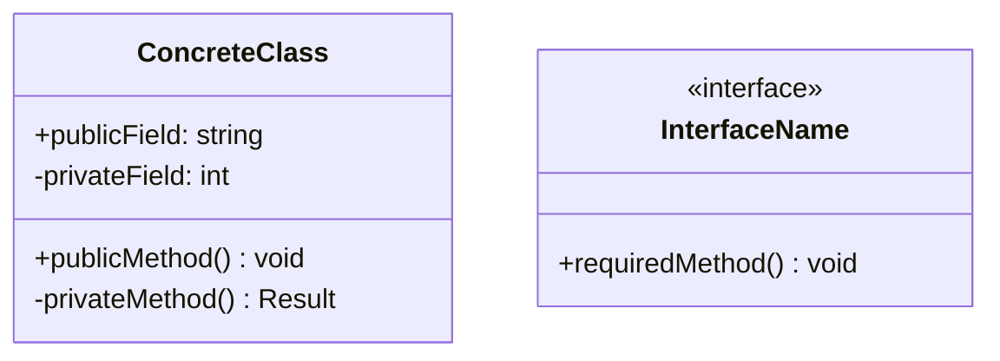
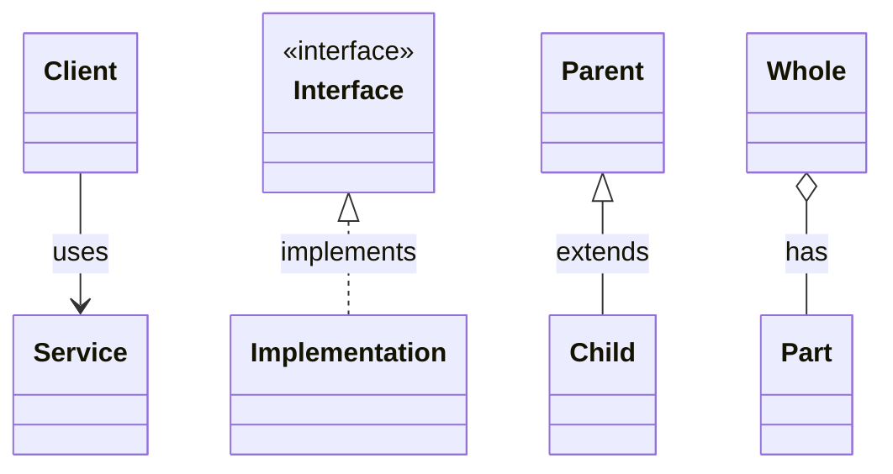
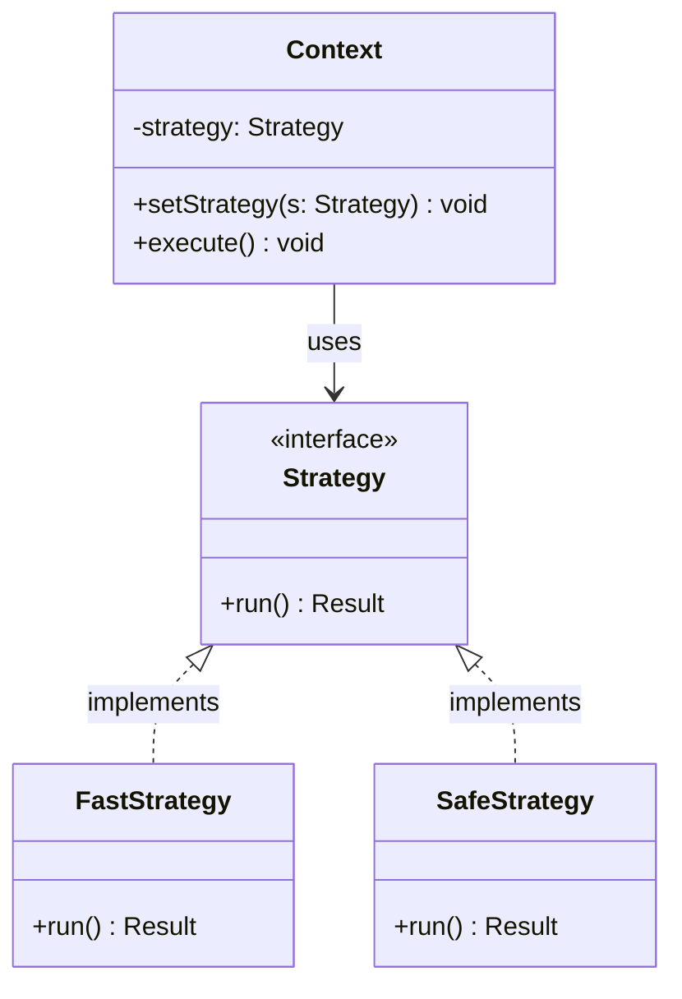

---
# Required
sidebar_position: 4
title: "How to Read Design Pattern Documentation"
description: >-
  Learn how to read pattern docs effectively: understand intent, structure,
  trade-offs, and testing. Includes a quick UML guide and tips for translating
  patterns across languages.

# SEO
keywords:
  - how to read design patterns
  - design pattern structure
  - uml for design patterns
  - pattern documentation guide
  - understanding design patterns

# Social sharing
og_title: "How to Read Design Pattern Documentation"
og_description: "Get the most from pattern docs: UML, structure, and cross-language translation."
og_image: "/img/social-card.svg"

# Content management
date_published: 2026-01-25
date_modified: 2026-01-25
author: shivam
reading_time: 10
content_type: explanation
---

# How to Read Pattern Documentation

The first time I tried to learn design patterns, I made a classic mistake: I skipped the diagrams and jumped straight to the code.

It sort of worked. I could copy the examples and get them running. But I missed the intent. I'd implement a Factory Method when I needed a Builder, or use Strategy when Observer was the right fit. The patterns were tools I owned but didn't understand.

The breakthrough came when I started treating the diagram as the contract. **The UML isn't decoration—it's the pattern's essence in visual form.** Once you can read a class diagram, you can understand any pattern in thirty seconds, regardless of what language the examples use.

This page teaches you how to extract maximum value from pattern documentation, whether you're reading this guide or any other resource.

---

## The Structure of Every Pattern Page

Every pattern page in this series follows a consistent structure. Once you know the layout, you can navigate quickly.

### 1. Problem Story

Each pattern opens with a real scenario that illustrates *why* the pattern exists. This isn't filler—it's the most important section for building intuition.

**How to read it:** Ask yourself, "Have I felt this pain?" If yes, you're ready to learn the pattern. If no, you might be reading the wrong pattern for your current problem.

### 2. Definition

A one-sentence explanation of what the pattern does. Memorizable and quotable.

**How to read it:** This is your elevator pitch. Can you explain the pattern to a colleague in 15 seconds using this definition?

### 3. Structure (UML + Components)

The class diagram showing relationships between participants, plus a breakdown of each component's role.

**How to read it:** Start with the diagram. Identify the interfaces (dashed boxes or `<<interface>>` labels), the concrete implementations, and the arrows showing relationships. Then read the component descriptions to understand each role.

### 4. When to Use / When NOT to Use

Trade-off analysis. The "when to use" section tells you where the pattern shines. The "when NOT to use" section is equally important—it prevents over-engineering.

**How to read it:** Check the "when NOT to use" section first. It's faster to rule out patterns than to justify them. If your situation matches a "when NOT to use" bullet, skip this pattern.

### 5. Implementation

Working code in multiple languages (Python, TypeScript, Go, Java, C#). Each example shows the same pattern adapted to language idioms.

**How to read it:** Read the implementation in the language you know best. Focus on:
- What classes exist and what they do
- How dependencies flow
- Where the "swap" or "extend" point is

### 6. Real-World Example

A concrete scenario from production systems where the pattern solves a real problem.

**How to read it:** Map this to your own work. Can you think of a similar situation in your codebase?

### 7. Testing Guidance

How the pattern affects testability, plus example tests.

**How to read it:** Tests reveal the pattern's seams—where you can inject fakes or mocks. Understanding this section helps you apply the pattern in testable ways.

### 8. Common Mistakes

Pitfalls I've seen in production codebases. Real anti-patterns, not theoretical ones.

**How to read it:** After implementing a pattern, come back to this section. You'll often catch yourself making one of these mistakes.

### 9. Related Patterns

How this pattern connects to others. Which patterns solve similar problems, and which patterns combine well.

**How to read it:** Use this for navigation. If the current pattern doesn't quite fit, the related patterns often will.

---

## UML Crash Course

You don't need to become a UML expert. These five concepts cover 95% of what you'll see in pattern diagrams.

### Classes and Interfaces



- **Solid box** = concrete class
- **`<<interface>>` label** = interface (no implementation)
- **+ prefix** = public
- **- prefix** = private
- **Fields** listed at top, **methods** below

### Relationships

Here are the arrows you'll see constantly:



| Arrow | Meaning | Example |
|-------|---------|---------|
| `-->` (solid arrow) | "uses" or "has reference to" | Client uses Service |
| `<\|..` (dashed with triangle) | "implements interface" | ConcreteClass implements Interface |
| `<\|--` (solid with triangle) | "extends" or "inherits from" | Child extends Parent |
| `o--` (diamond) | "contains" or "is composed of" | Collection contains Items |

### Reading Pattern Diagrams

Let me walk through a real example—the Strategy pattern:



**How to read this:**

1. **Find the interface:** `Strategy` with the `<<interface>>` label. This is the contract.

2. **Find the implementations:** `FastStrategy` and `SafeStrategy` both implement `Strategy` (dashed arrows pointing up).

3. **Find the client:** `Context` holds a reference to `Strategy` (solid arrow). It doesn't know about the concrete implementations.

4. **Understand the pattern:** Context depends on the abstraction (Strategy), not the concretes. You can swap `FastStrategy` for `SafeStrategy` without changing Context.

This visual structure—client depending on interface, multiple implementations of that interface—is the Strategy pattern's essence. Every implementation, regardless of language, follows this shape.

---

## Reading Code Examples

The goal isn't to memorize the code. It's to understand the responsibilities.

### Focus on these questions:

1. **What are the extension points?**  
   Where can you add new behavior without modifying existing code? In Strategy, it's new implementations of the interface. In Decorator, it's new decorator classes.

2. **What stays stable vs. what changes?**  
   The whole point of patterns is isolating change. In Observer, the Subject is stable; Observers change. In Factory Method, the creation interface is stable; factories change.

3. **Where are dependencies inverted?**  
   Good patterns point dependencies toward abstractions, not concretes. Look for interfaces and injection points.

### Quick code-reading checklist:

- [ ] Can I identify the interface/abstraction?
- [ ] Can I identify the concrete implementations?
- [ ] Can I see where new variants would be added?
- [ ] Can I see what code would NOT change when adding variants?

If you can answer these, you understand the pattern. If you can't, reread with these questions in mind.

---

## Translating Patterns Between Languages

Patterns are language-agnostic, but their syntax varies significantly. Here's how the same concepts appear in different languages:

### Interfaces

| Language | Syntax |
|----------|--------|
| Python | Abstract base class with `@abstractmethod` |
| TypeScript | `interface` keyword |
| Go | Implicit interfaces (no `implements` keyword) |
| Java | `interface` keyword with `implements` |
| C# | `interface` keyword (conventionally `IName`) |

### Example: Strategy interface across languages

**Python:**
```python
from abc import ABC, abstractmethod

class Strategy(ABC):
    @abstractmethod
    def execute(self) -> Result:
        pass
```

**TypeScript:**
```typescript
interface Strategy {
    execute(): Result;
}
```

**Go:**
```go
type Strategy interface {
    Execute() Result
}
```

**Java:**
```java
interface Strategy {
    Result execute();
}
```

**C#:**
```csharp
public interface IStrategy {
    Result Execute();
}
```

### Key Translation Notes

**Go's implicit interfaces:** In Go, you don't declare that a type implements an interface. If the type has the right methods, it implements the interface. This means Go code often looks simpler—no `implements` keyword—but the pattern is the same.

**Python's duck typing:** Python allows interface-like behavior without formal interfaces. You'll see both ABC-based interfaces (explicit) and duck-typed approaches (implicit). Both work; the ABC approach makes the pattern more visible.

**TypeScript's structural typing:** TypeScript checks interface compatibility by structure, not declaration. This means you can often use plain objects where other languages require classes.

---

## Three Modes of Using This Series

Different situations call for different reading strategies:

### Mode 1: Exploration

You want to understand patterns broadly before diving deep.

**How to read:**
1. Read the [Pattern Catalog](/docs/design-patterns/catalog) for the big picture
2. Skim the overview pages for each family (Creational, Structural, Behavioral)
3. Read one pattern per family deeply
4. Build mental models before worrying about implementation details

### Mode 2: Problem-Solving

You have a specific pain point and need the right pattern.

**How to read:**
1. Use the [Selection Framework](/docs/design-patterns/choosing-patterns) to narrow down
2. Read the "Problem Story" and "When to Use" sections of candidate patterns
3. Check "When NOT to Use" to rule out poor fits
4. Read one pattern deeply, focusing on implementation and testing

### Mode 3: Review and Refactoring

You're looking at existing code that uses (or should use) a pattern.

**How to read:**
1. Jump directly to the relevant pattern page
2. Focus on "Common Mistakes" and "When NOT to Use"
3. Compare the existing implementation to the documented structure
4. Check "Related Patterns" if the current choice seems wrong

---

## Getting the Most from Each Read

Here's my personal checklist when studying a new pattern:

**First read:**
- [ ] Read the problem story—do I recognize this pain?
- [ ] Understand the diagram—can I sketch it from memory?
- [ ] Read one implementation—do I know where variants would go?

**Second read (when applying):**
- [ ] Reread "When NOT to Use"—does any bullet apply to my situation?
- [ ] Study the test example—how will I test my implementation?
- [ ] Check "Common Mistakes"—am I avoiding these?

**After implementing:**
- [ ] Compare my code to the documented structure—did I drift?
- [ ] Read "Related Patterns"—should I combine with another pattern?
- [ ] Document why I chose this pattern (see Selection Framework)

---

## Navigation

- **Previous:** [Pattern Selection Framework](/docs/design-patterns/choosing-patterns)
- **Next:** [Learning Paths](/docs/design-patterns/learning-paths)
