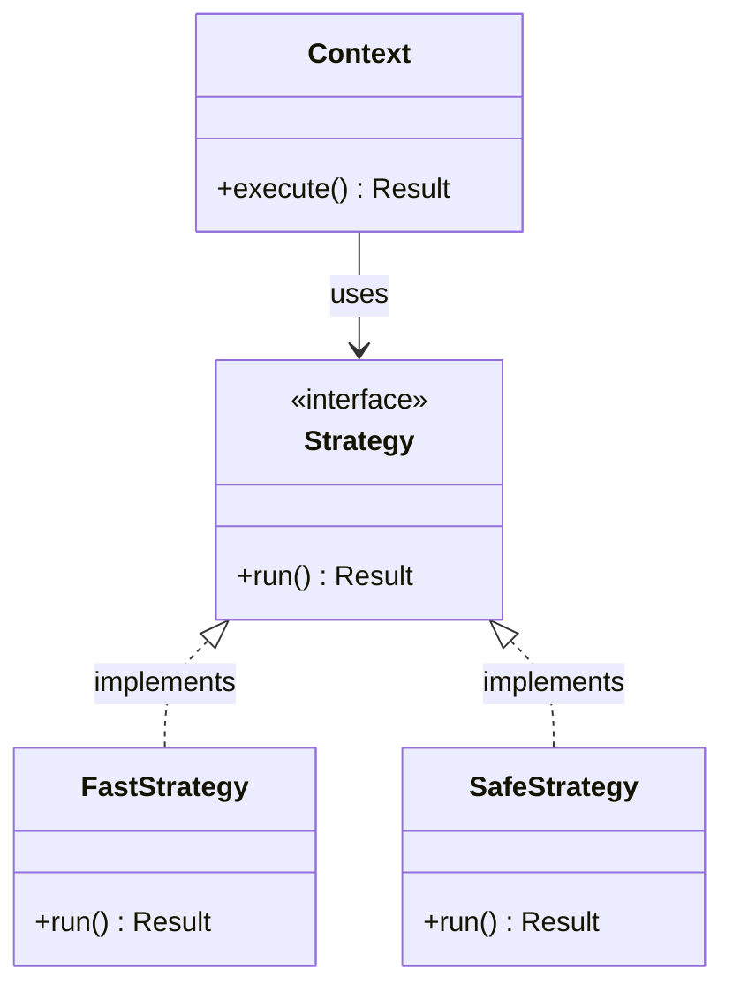

---
# Required
sidebar_position: 4
title: "How to Read Design Pattern Documentation"
description: >-
  Learn how to read pattern docs: intent, structure, trade-offs, and testing.
  Includes a quick UML guide and tips for translating patterns across languages.

# SEO
keywords:
  - how to read design patterns
  - design pattern structure
  - uml for design patterns
  - pattern documentation

# Social sharing
og_title: "How to Read Design Pattern Docs"
og_description: "A quick guide to reading pattern docs, UML, and code examples."
og_image: "/img/social-card.svg"

# Content management
date_published: 2026-01-25
date_modified: 2026-01-25
author: shivam
reading_time: 9
content_type: explanation
---

# How to Read Pattern Documentation

Patterns can feel like theory until you see the structure clearly. The first time I read a pattern book, I skipped the diagrams and jumped to the code. It worked for a while, but I missed the intent. That is what made patterns click later: **the diagram is the contract.**

## The Standard Sections

Every pattern page in this series follows a consistent structure:

1. **Problem story** to ground the pain.
2. **Definition** to give you a clear mental model.
3. **Structure** with a diagram and key components.
4. **When to use and avoid** to prevent misuse.
5. **Implementation** with multi-language examples.
6. **Testing guidance** because patterns change how you test.

If you know where to look, patterns become reference material, not study material.

## UML Crash Course

Here is a tiny example to read most class diagrams:

Interpretation:

- **Solid arrow** means one class uses another.
- **Dashed arrow with triangle** means "implements interface".
- **Classes under the interface** are the variants.

## Reading Code Examples

The goal is not to memorize the code. Focus on:

- How the responsibilities are split
- What stays stable vs what changes
- Where dependencies are inverted

If you can explain the reason for each class, you understand the pattern.

## Translating Patterns Between Languages

Patterns are language-agnostic, but their shape changes:

- Go favors interfaces and composition.
- Java and C# favor explicit interfaces and inheritance.
- TypeScript uses structural typing to reduce boilerplate.
- Python uses duck typing and composition.

The intent is the same even when the syntax looks different.

## How to Use This Series

Use these docs in three modes:

- **Exploration:** Read the overview of a category first.
- **Problem solving:** Jump to the pattern that matches your pain.
- **Review:** Use the "When NOT to use" sections to sanity-check.

**Next:** [Learning Paths](/docs/design-patterns/learning-paths)
