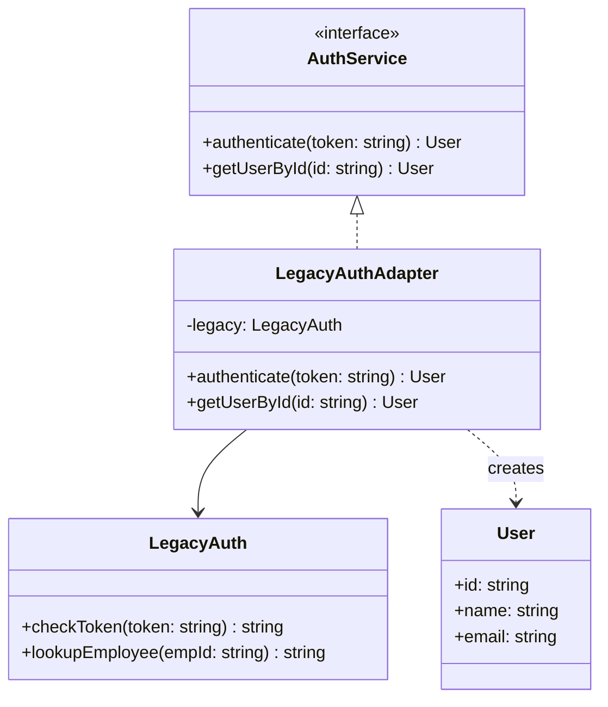

---
# Required
sidebar_position: 2
title: "Adapter Pattern — Making Incompatible Interfaces Work Together"
description: >-
  Learn the Adapter pattern to integrate incompatible interfaces without
  changing existing code. The most common structural pattern you'll use.

# SEO
keywords:
  - adapter pattern
  - adapter design pattern
  - interface compatibility
  - legacy integration
  - when to use adapter
  - wrapper pattern

difficulty: beginner
category: structural
related_solid: [SRP, OCP]

# Social sharing
og_title: "Adapter Pattern: Making Incompatible Interfaces Work Together"
og_description: "Integrate incompatible interfaces without rewriting them."
og_image: "/img/social-card.svg"

# Content management
date_published: 2026-01-25
date_modified: 2026-01-25
author: shivam
reading_time: 14
content_type: explanation
---

# Adapter Pattern

<PatternMeta>
  <Difficulty level="beginner" />
  <TimeToRead minutes={14} />
  <Prerequisites patterns={[]} />
</PatternMeta>

The legacy auth system that almost derailed our launch taught me why Adapter is the most practically useful pattern in the catalog.

It was late 2019, and we had two weeks to integrate our new CI/CD dashboard at NVIDIA with the company's legacy authentication service. The legacy system was battle-tested and secure, but it had a... distinctive API. User data came back as semicolon-separated strings:

```
"e12345;jsmith;John Smith;Engineering;john.smith@nvidia.com"
```

Our modern dashboard expected JSON:

```json
{
  "id": "jsmith",
  "name": "John Smith",
  "email": "john.smith@nvidia.com",
  "department": "Engineering"
}
```

The legacy system used callbacks. We used async/await. The legacy system threw exceptions as strings. We expected typed error objects. Every possible interface mismatch, we had it.

Rewriting either system was impossible. The legacy auth had 10 years of security auditing behind it. Our dashboard was already integrated with six other services expecting our JSON format. We needed a translator in the middle.

**That translator is the Adapter pattern.** In three days, we built an adapter that made the legacy system look like a modern auth service. The dashboard never knew the difference. The legacy system didn't change. The integration shipped on time.

---

## What Is the Adapter Pattern?

> **Definition:** Adapter converts the interface of a class into another interface that clients expect. It lets classes work together that couldn't otherwise because of incompatible interfaces.

Think of it like a travel power adapter. Your laptop has a US plug. The wall outlet is European. The adapter doesn't change your laptop or the outlet—it translates between them.

**The key insight: Adapter is about translation, not transformation.** The adapter doesn't change what the adaptee does. It changes how it appears to clients.

---

## Structure



### Key Components

| Component | Role |
|-----------|------|
| **Target Interface** (`AuthService`) | The interface your code expects |
| **Adaptee** (`LegacyAuth`) | The existing class with the incompatible interface |
| **Adapter** (`LegacyAuthAdapter`) | Translates between target and adaptee |

### SOLID Principles Connection

- **Single Responsibility:** The adapter's only job is translation
- **Open/Closed:** Add new adapters without modifying existing code

---

## When to Use Adapter

✅ **Use it when:**

- You need to use an existing class but its interface doesn't match what you need
- You're integrating with third-party libraries or legacy systems
- You want to create a reusable class that can work with multiple incompatible interfaces
- You need to isolate your code from external API changes

❌ **Don't use it when:**

- You control both interfaces and can simply refactor them to match
- The "incompatibility" is just naming—a simple wrapper function might suffice
- The adapter would need to do significant business logic (that's a service, not an adapter)

**Rule of thumb:** If you can change the interface directly, do that instead. Adapters add indirection. Only add them when you can't modify the source.

---

## Implementation

<CodeTabs>
  <TabItem value="python" label="Python">
    ```python
    from abc import ABC, abstractmethod
    from dataclasses import dataclass


    @dataclass
    class User:
        id: str
        name: str
        email: str
        department: str


    class AuthService(ABC):
        """The interface our modern code expects."""
        
        @abstractmethod
        def authenticate(self, token: str) -> User:
            """Validate token and return user info."""
            pass
        
        @abstractmethod
        def get_user_by_id(self, user_id: str) -> User:
            """Look up user by ID."""
            pass


    class LegacyAuth:
        """The legacy system with its distinctive interface.
        
        Returns semicolon-separated strings:
        "empId;username;Full Name;Department;email"
        """
        
        def check_token(self, token: str) -> str:
            """Returns employee data as semicolon-separated string."""
            # In reality, this would call the legacy service
            return "e12345;jsmith;John Smith;Engineering;john.smith@nvidia.com"
        
        def lookup_employee(self, emp_id: str) -> str:
            """Returns employee data as semicolon-separated string."""
            return "e12345;jsmith;John Smith;Engineering;john.smith@nvidia.com"


    class LegacyAuthAdapter(AuthService):
        """Adapter that makes LegacyAuth look like AuthService."""
        
        def __init__(self, legacy: LegacyAuth) -> None:
            self.legacy = legacy
        
        def authenticate(self, token: str) -> User:
            raw = self.legacy.check_token(token)
            return self._parse_user(raw)
        
        def get_user_by_id(self, user_id: str) -> User:
            # Legacy uses employee IDs, we use usernames
            # Adapter handles this translation
            raw = self.legacy.lookup_employee(f"e{user_id}")
            return self._parse_user(raw)
        
        def _parse_user(self, raw: str) -> User:
            """Parse semicolon-separated string into User object."""
            parts = raw.split(";")
            if len(parts) != 5:
                raise ValueError(f"Invalid user data: {raw}")
            emp_id, username, name, department, email = parts
            return User(
                id=username,
                name=name,
                email=email,
                department=department,
            )


    # Usage: client code only knows about AuthService
    def get_current_user(auth: AuthService, token: str) -> User:
        return auth.authenticate(token)


    # Wiring: done once at application startup
    legacy = LegacyAuth()
    auth_service = LegacyAuthAdapter(legacy)

    # All application code uses the interface
    user = get_current_user(auth_service, "some-token")
    print(f"Welcome, {user.name}!")
    ```
  </TabItem>
  <TabItem value="typescript" label="TypeScript">
    ```typescript
    interface User {
      id: string;
      name: string;
      email: string;
      department: string;
    }

    interface AuthService {
      authenticate(token: string): Promise<User>;
      getUserById(id: string): Promise<User>;
    }

    class LegacyAuth {
      // Returns semicolon-separated: "empId;username;name;dept;email"
      checkToken(token: string): string {
        return "e12345;jsmith;John Smith;Engineering;john.smith@nvidia.com";
      }

      lookupEmployee(empId: string): string {
        return "e12345;jsmith;John Smith;Engineering;john.smith@nvidia.com";
      }
    }

    class LegacyAuthAdapter implements AuthService {
      constructor(private legacy: LegacyAuth) {}

      async authenticate(token: string): Promise<User> {
        const raw = this.legacy.checkToken(token);
        return this.parseUser(raw);
      }

      async getUserById(id: string): Promise<User> {
        const raw = this.legacy.lookupEmployee(`e${id}`);
        return this.parseUser(raw);
      }

      private parseUser(raw: string): User {
        const [empId, username, name, department, email] = raw.split(";");
        return { id: username, name, email, department };
      }
    }

    // Usage
    async function getCurrentUser(auth: AuthService, token: string): Promise<User> {
      return auth.authenticate(token);
    }

    const legacy = new LegacyAuth();
    const authService: AuthService = new LegacyAuthAdapter(legacy);
    ```
  </TabItem>
  <TabItem value="go" label="Go">
    ```go
    package auth

    import (
        "fmt"
        "strings"
    )

    type User struct {
        ID         string
        Name       string
        Email      string
        Department string
    }

    // AuthService is the interface our code expects
    type AuthService interface {
        Authenticate(token string) (*User, error)
        GetUserByID(id string) (*User, error)
    }

    // LegacyAuth is the existing system with incompatible interface
    type LegacyAuth struct{}

    func (l *LegacyAuth) CheckToken(token string) string {
        return "e12345;jsmith;John Smith;Engineering;john.smith@nvidia.com"
    }

    func (l *LegacyAuth) LookupEmployee(empID string) string {
        return "e12345;jsmith;John Smith;Engineering;john.smith@nvidia.com"
    }

    // LegacyAuthAdapter adapts LegacyAuth to AuthService
    type LegacyAuthAdapter struct {
        legacy *LegacyAuth
    }

    func NewLegacyAuthAdapter(legacy *LegacyAuth) *LegacyAuthAdapter {
        return &LegacyAuthAdapter{legacy: legacy}
    }

    func (a *LegacyAuthAdapter) Authenticate(token string) (*User, error) {
        raw := a.legacy.CheckToken(token)
        return a.parseUser(raw)
    }

    func (a *LegacyAuthAdapter) GetUserByID(id string) (*User, error) {
        raw := a.legacy.LookupEmployee("e" + id)
        return a.parseUser(raw)
    }

    func (a *LegacyAuthAdapter) parseUser(raw string) (*User, error) {
        parts := strings.Split(raw, ";")
        if len(parts) != 5 {
            return nil, fmt.Errorf("invalid user data: %s", raw)
        }
        return &User{
            ID:         parts[1],
            Name:       parts[2],
            Email:      parts[4],
            Department: parts[3],
        }, nil
    }
    ```
  </TabItem>
  <TabItem value="java" label="Java">
    ```java
    interface AuthService {
        User authenticate(String token);
        User getUserById(String id);
    }

    record User(String id, String name, String email, String department) {}

    class LegacyAuth {
        // Returns "empId;username;name;dept;email"
        String checkToken(String token) {
            return "e12345;jsmith;John Smith;Engineering;john.smith@nvidia.com";
        }

        String lookupEmployee(String empId) {
            return "e12345;jsmith;John Smith;Engineering;john.smith@nvidia.com";
        }
    }

    class LegacyAuthAdapter implements AuthService {
        private final LegacyAuth legacy;

        LegacyAuthAdapter(LegacyAuth legacy) {
            this.legacy = legacy;
        }

        @Override
        public User authenticate(String token) {
            String raw = legacy.checkToken(token);
            return parseUser(raw);
        }

        @Override
        public User getUserById(String id) {
            String raw = legacy.lookupEmployee("e" + id);
            return parseUser(raw);
        }

        private User parseUser(String raw) {
            String[] parts = raw.split(";");
            return new User(parts[1], parts[2], parts[4], parts[3]);
        }
    }
    ```
  </TabItem>
  <TabItem value="csharp" label="C#">
    ```csharp
    public interface IAuthService
    {
        User Authenticate(string token);
        User GetUserById(string id);
    }

    public record User(string Id, string Name, string Email, string Department);

    public class LegacyAuth
    {
        // Returns "empId;username;name;dept;email"
        public string CheckToken(string token)
        {
            return "e12345;jsmith;John Smith;Engineering;john.smith@nvidia.com";
        }

        public string LookupEmployee(string empId)
        {
            return "e12345;jsmith;John Smith;Engineering;john.smith@nvidia.com";
        }
    }

    public class LegacyAuthAdapter : IAuthService
    {
        private readonly LegacyAuth _legacy;

        public LegacyAuthAdapter(LegacyAuth legacy)
        {
            _legacy = legacy;
        }

        public User Authenticate(string token)
        {
            var raw = _legacy.CheckToken(token);
            return ParseUser(raw);
        }

        public User GetUserById(string id)
        {
            var raw = _legacy.LookupEmployee($"e{id}");
            return ParseUser(raw);
        }

        private User ParseUser(string raw)
        {
            var parts = raw.Split(';');
            return new User(parts[1], parts[2], parts[4], parts[3]);
        }
    }
    ```
  </TabItem>
</CodeTabs>

---

## Real-World Example: Third-Party API Integration

At NVIDIA, we integrated with multiple notification services. Each had a different API:

```python
# Our unified interface
class NotificationService(ABC):
    @abstractmethod
    def send(self, recipient: str, message: str, urgency: str) -> bool:
        pass

# Slack's API
class SlackClient:
    def post_message(self, channel: str, text: str, priority: int) -> dict:
        ...

# PagerDuty's API  
class PagerDutyClient:
    def create_incident(self, service_key: str, description: str, severity: str) -> str:
        ...

# Adapters
class SlackAdapter(NotificationService):
    URGENCY_MAP = {"low": 0, "medium": 1, "high": 2}
    
    def __init__(self, client: SlackClient):
        self.client = client
    
    def send(self, recipient: str, message: str, urgency: str) -> bool:
        priority = self.URGENCY_MAP.get(urgency, 1)
        result = self.client.post_message(recipient, message, priority)
        return result.get("ok", False)


class PagerDutyAdapter(NotificationService):
    URGENCY_MAP = {"low": "info", "medium": "warning", "high": "critical"}
    
    def __init__(self, client: PagerDutyClient, service_key: str):
        self.client = client
        self.service_key = service_key
    
    def send(self, recipient: str, message: str, urgency: str) -> bool:
        severity = self.URGENCY_MAP.get(urgency, "warning")
        incident_id = self.client.create_incident(self.service_key, message, severity)
        return incident_id is not None
```

Application code uses `NotificationService`. It doesn't know or care whether it's talking to Slack, PagerDuty, or email. Adding a new service means writing one adapter.

---

## Performance Considerations

| Aspect | Impact | Notes |
|--------|--------|-------|
| Memory | Low | One thin wrapper object |
| Runtime | Low | Minimal translation overhead |
| Complexity | Low | Simple, focused, easy to understand |

Adapter is one of the lightest patterns. The overhead is essentially zero—just one additional method call and whatever translation logic you need.

---

## Testing This Pattern

Test the adapter's translation logic in isolation:

```python
def test_adapter_parses_legacy_format():
    legacy = LegacyAuth()
    adapter = LegacyAuthAdapter(legacy)
    
    user = adapter.authenticate("any-token")
    
    assert user.id == "jsmith"
    assert user.name == "John Smith"
    assert user.email == "john.smith@nvidia.com"


def test_adapter_handles_invalid_data():
    class BrokenLegacy:
        def check_token(self, token: str) -> str:
            return "invalid-data"
    
    adapter = LegacyAuthAdapter(BrokenLegacy())
    
    with pytest.raises(ValueError, match="Invalid user data"):
        adapter.authenticate("token")


def test_client_code_with_adapter():
    """Test client code works with any AuthService implementation."""
    fake_auth = FakeAuthService(users={"token123": User(...)})
    
    result = get_current_user(fake_auth, "token123")
    
    assert result.name == "Test User"
```

---

## Common Mistakes

### 1. Putting business logic in the adapter

```python
class BadAdapter(AuthService):
    def authenticate(self, token: str) -> User:
        user = self._parse(self.legacy.check_token(token))
        
        # This doesn't belong here
        if user.department == "Contractors":
            raise PermissionError("Contractors cannot access this system")
        
        return user
```

An adapter translates interfaces. Business rules belong in a service layer. If your adapter has conditionals about what users can do, it's doing too much.

### 2. Adapter that modifies the adaptee

```python
class BadAdapter:
    def authenticate(self, token: str) -> User:
        self.legacy.set_logging(True)  # Modifying adaptee state
        return self._parse(self.legacy.check_token(token))
```

Adapters should wrap, not modify. If you need to configure the adaptee, do it during construction.

### 3. Over-adapting

```python
# The "adaptee" is already a simple interface
class SimpleClient:
    def get(self, url: str) -> Response:
        ...

# This adapter adds nothing
class SimpleClientAdapter:
    def get(self, url: str) -> Response:
        return self.client.get(url)  # Just delegation
```

If the interfaces already match, you don't need an adapter. Don't add patterns for the sake of patterns.

---

## Object Adapter vs. Class Adapter

There are two ways to implement Adapter:

### Object Adapter (Recommended)

Uses composition—the adapter holds a reference to the adaptee:

```python
class Adapter:
    def __init__(self, adaptee: Adaptee):
        self.adaptee = adaptee  # Composition
```

**Advantages:** Works at runtime, adaptee can be swapped, follows composition over inheritance.

### Class Adapter

Uses inheritance—the adapter inherits from the adaptee:

```python
class Adapter(Target, Adaptee):  # Multiple inheritance
    ...
```

**Advantages:** Can override adaptee behavior.

**Disadvantages:** Requires multiple inheritance, couples adapter to adaptee class, can't adapt interface only (need concrete class).

**Prefer object adapter.** It's more flexible and doesn't require multiple inheritance.

---

## Related Patterns

| Pattern | Relationship |
|---------|--------------|
| **Facade** | Simplifies a subsystem; Adapter makes interfaces compatible |
| **Bridge** | Separates abstraction from implementation; designed upfront |
| **Decorator** | Adds behavior; Adapter converts interfaces |
| **Proxy** | Controls access to same interface; Adapter changes interface |

---

## Key Takeaways

- **Adapter makes incompatible interfaces work together.** It's a translator, not a transformer.

- **Use it when you can't modify the interfaces.** If you control both sides, just make them match directly.

- **Keep adapters thin.** Translation only—no business logic.

- **Prefer object adapter over class adapter.** Composition is more flexible than inheritance.

- **This is probably the pattern you'll use most.** Every third-party integration is an adapter opportunity.

---

## Navigation

- **Previous:** [Structural Patterns Overview](/docs/design-patterns/structural)
- **Next:** [Bridge Pattern](/docs/design-patterns/structural/bridge)
