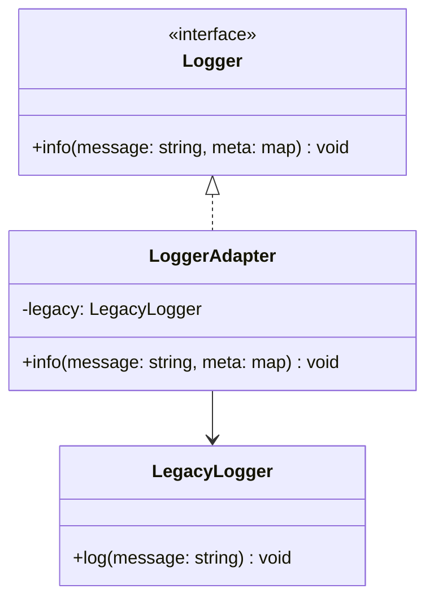

---
# Required
sidebar_position: 2
title: "Adapter Pattern — Make Incompatible APIs Work"
description: >-
  Learn the Adapter pattern to integrate incompatible interfaces without
  changing existing code. Includes multi-language examples.

# SEO
keywords:
  - adapter pattern
  - adapter design pattern
  - interface compatibility
  - legacy integration
  - when to use adapter

difficulty: beginner
category: structural
related_solid: [SRP, OCP]

# Social sharing
og_title: "Adapter Pattern: Make Incompatible APIs Work"
og_description: "Integrate incompatible interfaces without rewriting them."
og_image: "/img/social-card.svg"

# Content management
date_published: 2026-01-25
date_modified: 2026-01-25
author: shivam
reading_time: 12
content_type: explanation
---

# Adapter Pattern

<PatternMeta>
  <Difficulty level="beginner" />
  <TimeToRead minutes={12} />
  <Prerequisites patterns={["Facade"]} />
</PatternMeta>

> **Definition:** The Adapter pattern converts the interface of a class into another interface that clients expect.

---

## The Problem: Legacy Interfaces in Modern Systems

We once had a legacy logging library that only accepted plain strings, while the new system used structured logging with metadata. Rewriting the old library was risky, but using it directly would have forced the rest of the codebase backward.

**Adapter let us integrate without rewriting the world.**

---

## What Is the Adapter Pattern?

Adapter is a wrapper that translates one interface into another. The client talks to the adapter, and the adapter talks to the legacy or incompatible class.

### Structure



### Key Components

- **Target Interface:** What the client expects.
- **Adaptee:** The incompatible class you need to integrate.
- **Adapter:** The translator between the two.

### SOLID Principles Connection

- **SRP:** Keeps translation logic in one place.
- **OCP:** Adds compatibility without changing existing code.

---

## When to Use Adapter

- You must integrate a legacy or third-party API.
- You want to keep client code stable.
- You need to bridge two mismatched models.

## When NOT to Use Adapter

- The incompatibility is small and can be fixed directly.
- You control both sides and can refactor cleanly.
- The adapter becomes a second business logic layer.

---

## Implementation

<CodeTabs>
  <TabItem value="python" label="Python">
    ```python
    from typing import Dict


    class LegacyLogger:
        def log(self, message: str) -> None:
            print(message)


    class Logger:
        def info(self, message: str, meta: Dict[str, str]) -> None:
            raise NotImplementedError


    class LoggerAdapter(Logger):
        def __init__(self, legacy: LegacyLogger) -> None:
            self.legacy = legacy

        def info(self, message: str, meta: Dict[str, str]) -> None:
            formatted = f"{message} | {meta}"
            self.legacy.log(formatted)
    ```
  </TabItem>
  <TabItem value="typescript" label="TypeScript">
    ```typescript
    type Meta = Record<string, string>;

    class LegacyLogger {
      log(message: string): void {
        console.log(message);
      }
    }

    interface Logger {
      info(message: string, meta: Meta): void;
    }

    class LoggerAdapter implements Logger {
      constructor(private legacy: LegacyLogger) {}
      info(message: string, meta: Meta): void {
        this.legacy.log(`${message} | ${JSON.stringify(meta)}`);
      }
    }
    ```
  </TabItem>
  <TabItem value="go" label="Go">
    ```go
    package logging

    import "fmt"

    type LegacyLogger struct{}

    func (l LegacyLogger) Log(message string) {
        fmt.Println(message)
    }

    type Logger interface {
        Info(message string, meta map[string]string)
    }

    type LoggerAdapter struct {
        legacy LegacyLogger
    }

    func (a LoggerAdapter) Info(message string, meta map[string]string) {
        a.legacy.Log(fmt.Sprintf("%s | %v", message, meta))
    }
    ```
  </TabItem>
  <TabItem value="java" label="Java">
    ```java
    interface Logger {
        void info(String message, java.util.Map<String, String> meta);
    }

    class LegacyLogger {
        void log(String message) {
            System.out.println(message);
        }
    }

    class LoggerAdapter implements Logger {
        private final LegacyLogger legacy;
        LoggerAdapter(LegacyLogger legacy) { this.legacy = legacy; }
        public void info(String message, java.util.Map<String, String> meta) {
            legacy.log(message + " | " + meta);
        }
    }
    ```
  </TabItem>
  <TabItem value="csharp" label="C#">
    ```csharp
    public interface ILogger
    {
        void Info(string message, Dictionary<string, string> meta);
    }

    public class LegacyLogger
    {
        public void Log(string message) => Console.WriteLine(message);
    }

    public class LoggerAdapter : ILogger
    {
        private readonly LegacyLogger _legacy;
        public LoggerAdapter(LegacyLogger legacy) { _legacy = legacy; }
        public void Info(string message, Dictionary<string, string> meta)
        {
            _legacy.Log($"{message} | {string.Join(",", meta)}");
        }
    }
    ```
  </TabItem>
</CodeTabs>

---

## Real-World Example: Legacy Auth Integration

I once integrated a legacy auth service that returned CSV strings into a new JSON-based API. An adapter normalized the response so every modern client saw consistent JSON without rewriting the legacy system.

---

## Performance Considerations

| Aspect | Impact | Notes |
|--------|--------|-------|
| Memory | Low | A thin wrapper object |
| Runtime | Low | Minimal translation overhead |
| Complexity | Low | Simple and localized |

---

## Testing This Pattern

Test that the adapter translates data correctly without altering the adaptee.

```python
def test_adapter_formats_message() -> None:
    legacy = LegacyLogger()
    adapter = LoggerAdapter(legacy)
    adapter.info("hello", {"service": "api"})
```

---

## Common Mistakes

- Putting business logic inside the adapter.
- Stacking multiple adapters when a refactor would be clearer.
- Hiding errors from the adaptee.

---

## Related Patterns

| Pattern | Relationship |
|---------|--------------|
| Facade | Simplifies a subsystem, not just an interface |
| Bridge | Separates abstraction from implementation |
| Proxy | Controls access rather than translating |

---

## Pattern Combinations

- **With Facade:** Hide a set of adapters behind a simple API.
- **With Strategy:** Swap adapters based on environment.

---

## Try It Yourself

Wrap a third-party payment SDK that uses callbacks with a Promise-based API.

---

## Frequently Asked Questions

### Does Adapter require inheritance?
No. Composition is the most common approach.

### Can I use Adapter for data transformation?
Yes, as long as the transformation is purely interface alignment.

### When does Adapter become a smell?
When it grows into a second layer of business logic.

### How do I test code using Adapter?
Verify the adapter translates inputs and outputs correctly with small unit tests.

---

## Key Takeaways

- **Adapter makes incompatible APIs work together.**
- **It protects client code from legacy constraints.**
- **Keep adapters thin and focused.**

---

## Downloads

- Adapter Cheat Sheet (Coming soon)
- Complete Code Examples (Coming soon)
- Practice Exercises (Coming soon)

---

**Next:** [Bridge Pattern](/docs/design-patterns/structural/bridge)
