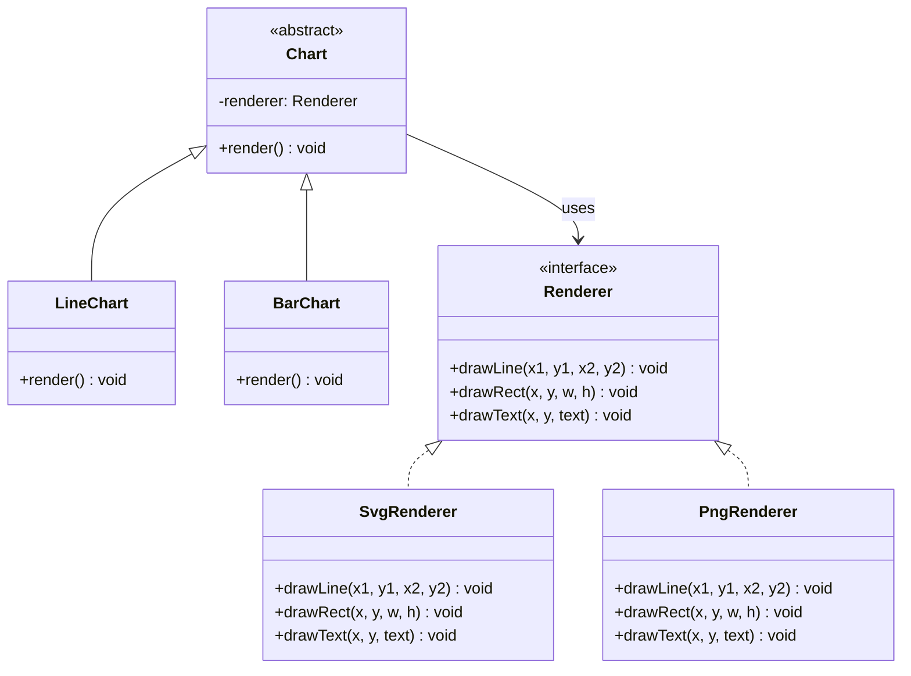

---
# Required
sidebar_position: 3
title: "Bridge Pattern — Separating Abstraction from Implementation"
description: >-
  Learn the Bridge pattern to decouple an abstraction from its implementation,
  letting both evolve independently. Solves class explosion problems.

# SEO
keywords:
  - bridge pattern
  - bridge design pattern
  - abstraction implementation separation
  - when to use bridge
  - avoiding class explosion

difficulty: intermediate
category: structural
related_solid: [OCP, DIP]

# Social sharing
og_title: "Bridge Pattern: Separating Abstraction from Implementation"
og_description: "Decouple abstractions so both sides can evolve independently."
og_image: "/img/social-card.svg"

# Content management
date_published: 2026-01-25
date_modified: 2026-01-25
author: shivam
reading_time: 13
content_type: explanation
---

# Bridge Pattern

<PatternMeta>
  <Difficulty level="intermediate" />
  <TimeToRead minutes={13} />
  <Prerequisites patterns={["Adapter"]} />
</PatternMeta>

The dashboard rendering crisis taught me when you actually need Bridge.

In 2021, we were building a metrics visualization dashboard at NVIDIA. Each chart type (line, bar, area, scatter) needed to render in multiple formats: SVG for the web interface, PNG for email reports, and ASCII for terminal output. The initial design used inheritance:

```
Chart
├── LineChart
│   ├── SvgLineChart
│   ├── PngLineChart
│   └── AsciiLineChart
├── BarChart
│   ├── SvgBarChart
│   ├── PngBarChart
│   └── AsciiBarChart
└── ... (9 more combinations)
```

Every new chart type required three new classes. Every new rendering format required one new class per chart type. When product asked for PDF support, we realized we'd need to add four more classes—one for each chart type. The combinatorial explosion was unsustainable.

**Bridge solves this by separating what varies independently.** Chart types vary. Rendering formats vary. But they vary *independently*—there's no reason a line chart must know about PNG rendering. Split them apart, and you get 4 chart classes + 4 renderer classes instead of 16 combinations.

---

## What Is the Bridge Pattern?

> **Definition:** Bridge decouples an abstraction from its implementation so the two can vary independently.

The name "bridge" refers to the connection between the abstraction and its implementation—composition rather than inheritance. Instead of building all combinations into a class hierarchy, you compose them at runtime.

**The key insight: Bridge is for when you have two dimensions of variation that shouldn't be coupled.** If changing one dimension (chart type) forces you to update the other dimension (renderer), you've coupled things that should be independent.

---

## Structure



### Key Components

| Component | Role |
|-----------|------|
| **Abstraction** (`Chart`) | High-level interface that clients use. Contains reference to implementer. |
| **Refined Abstraction** (`LineChart`, `BarChart`) | Extends abstraction with specific behavior. |
| **Implementer** (`Renderer`) | Interface for implementation classes. |
| **Concrete Implementers** (`SvgRenderer`, `PngRenderer`) | Actual implementations. |

### SOLID Principles Connection

- **Open/Closed:** Add new abstractions or implementations without modifying existing code
- **Dependency Inversion:** Abstraction depends on implementer interface, not concrete classes

---

## When to Use Bridge

✅ **Use it when:**

- You have two independent dimensions of variation
- Class hierarchies are exploding combinatorially
- You want to switch implementations at runtime
- Changes in one dimension shouldn't require changes in the other

❌ **Don't use it when:**

- There's only one dimension of variation (use Strategy instead)
- The dimensions aren't actually independent
- The added abstraction isn't worth the complexity
- You're designing prematurely—wait until you see the explosion

**Rule of thumb:** If you're creating classes like `XYZChart` where X, Y, and Z can vary independently, you might need Bridge. If X and Y are tightly coupled, you don't.

---

## Implementation

<CodeTabs>
  <TabItem value="python" label="Python">
    ```python
    from abc import ABC, abstractmethod


    class Renderer(ABC):
        """Implementation interface for different rendering formats."""
        
        @abstractmethod
        def draw_line(self, x1: int, y1: int, x2: int, y2: int) -> None:
            pass
        
        @abstractmethod
        def draw_rect(self, x: int, y: int, width: int, height: int) -> None:
            pass
        
        @abstractmethod
        def draw_text(self, x: int, y: int, text: str) -> None:
            pass
        
        @abstractmethod
        def get_output(self) -> str:
            pass


    class SvgRenderer(Renderer):
        def __init__(self) -> None:
            self.elements: list[str] = []
        
        def draw_line(self, x1: int, y1: int, x2: int, y2: int) -> None:
            self.elements.append(f'<line x1="{x1}" y1="{y1}" x2="{x2}" y2="{y2}"/>')
        
        def draw_rect(self, x: int, y: int, width: int, height: int) -> None:
            self.elements.append(f'<rect x="{x}" y="{y}" width="{width}" height="{height}"/>')
        
        def draw_text(self, x: int, y: int, text: str) -> None:
            self.elements.append(f'<text x="{x}" y="{y}">{text}</text>')
        
        def get_output(self) -> str:
            return f'<svg>{"".join(self.elements)}</svg>'


    class AsciiRenderer(Renderer):
        def __init__(self, width: int = 40, height: int = 20) -> None:
            self.width = width
            self.height = height
            self.canvas = [[' '] * width for _ in range(height)]
        
        def draw_line(self, x1: int, y1: int, x2: int, y2: int) -> None:
            # Simplified: just draw endpoints
            self._set_pixel(x1, y1, '*')
            self._set_pixel(x2, y2, '*')
        
        def draw_rect(self, x: int, y: int, width: int, height: int) -> None:
            for i in range(width):
                self._set_pixel(x + i, y, '-')
                self._set_pixel(x + i, y + height, '-')
            for j in range(height):
                self._set_pixel(x, y + j, '|')
                self._set_pixel(x + width, y + j, '|')
        
        def draw_text(self, x: int, y: int, text: str) -> None:
            for i, char in enumerate(text):
                self._set_pixel(x + i, y, char)
        
        def _set_pixel(self, x: int, y: int, char: str) -> None:
            if 0 <= x < self.width and 0 <= y < self.height:
                self.canvas[y][x] = char
        
        def get_output(self) -> str:
            return '\n'.join(''.join(row) for row in self.canvas)


    class Chart(ABC):
        """Abstraction that uses a renderer."""
        
        def __init__(self, renderer: Renderer) -> None:
            self.renderer = renderer
        
        @abstractmethod
        def render(self, data: list[tuple[int, int]]) -> str:
            pass


    class LineChart(Chart):
        def render(self, data: list[tuple[int, int]]) -> str:
            self.renderer.draw_text(0, 0, "Line Chart")
            for i in range(len(data) - 1):
                x1, y1 = data[i]
                x2, y2 = data[i + 1]
                self.renderer.draw_line(x1, y1, x2, y2)
            return self.renderer.get_output()


    class BarChart(Chart):
        def render(self, data: list[tuple[int, int]]) -> str:
            self.renderer.draw_text(0, 0, "Bar Chart")
            for i, (x, height) in enumerate(data):
                self.renderer.draw_rect(i * 5, 10 - height, 4, height)
            return self.renderer.get_output()


    # Usage: compose at runtime
    data = [(5, 10), (10, 15), (15, 8), (20, 12)]

    # Same chart type, different renderers
    svg_line = LineChart(SvgRenderer())
    ascii_line = LineChart(AsciiRenderer())

    print(svg_line.render(data))
    print(ascii_line.render(data))

    # Same renderer, different chart types
    svg_renderer = SvgRenderer()
    svg_bar = BarChart(SvgRenderer())
    print(svg_bar.render([(1, 5), (2, 8), (3, 3), (4, 7)]))
    ```
  </TabItem>
  <TabItem value="typescript" label="TypeScript">
    ```typescript
    interface Renderer {
      drawLine(x1: number, y1: number, x2: number, y2: number): void;
      drawRect(x: number, y: number, width: number, height: number): void;
      drawText(x: number, y: number, text: string): void;
      getOutput(): string;
    }

    class SvgRenderer implements Renderer {
      private elements: string[] = [];

      drawLine(x1: number, y1: number, x2: number, y2: number): void {
        this.elements.push(`<line x1="${x1}" y1="${y1}" x2="${x2}" y2="${y2}"/>`);
      }

      drawRect(x: number, y: number, width: number, height: number): void {
        this.elements.push(`<rect x="${x}" y="${y}" width="${width}" height="${height}"/>`);
      }

      drawText(x: number, y: number, text: string): void {
        this.elements.push(`<text x="${x}" y="${y}">${text}</text>`);
      }

      getOutput(): string {
        return `<svg>${this.elements.join("")}</svg>`;
      }
    }

    class AsciiRenderer implements Renderer {
      private canvas: string[][];

      constructor(private width = 40, private height = 20) {
        this.canvas = Array(height).fill(null).map(() => Array(width).fill(" "));
      }

      drawLine(x1: number, y1: number, x2: number, y2: number): void {
        this.setPixel(x1, y1, "*");
        this.setPixel(x2, y2, "*");
      }

      drawRect(x: number, y: number, width: number, height: number): void {
        for (let i = 0; i < width; i++) {
          this.setPixel(x + i, y, "-");
          this.setPixel(x + i, y + height, "-");
        }
      }

      drawText(x: number, y: number, text: string): void {
        for (let i = 0; i < text.length; i++) {
          this.setPixel(x + i, y, text[i]);
        }
      }

      private setPixel(x: number, y: number, char: string): void {
        if (x >= 0 && x < this.width && y >= 0 && y < this.height) {
          this.canvas[y][x] = char;
        }
      }

      getOutput(): string {
        return this.canvas.map((row) => row.join("")).join("\n");
      }
    }

    abstract class Chart {
      constructor(protected renderer: Renderer) {}
      abstract render(data: [number, number][]): string;
    }

    class LineChart extends Chart {
      render(data: [number, number][]): string {
        this.renderer.drawText(0, 0, "Line Chart");
        for (let i = 0; i < data.length - 1; i++) {
          const [x1, y1] = data[i];
          const [x2, y2] = data[i + 1];
          this.renderer.drawLine(x1, y1, x2, y2);
        }
        return this.renderer.getOutput();
      }
    }

    class BarChart extends Chart {
      render(data: [number, number][]): string {
        this.renderer.drawText(0, 0, "Bar Chart");
        data.forEach(([x, height], i) => {
          this.renderer.drawRect(i * 5, 10 - height, 4, height);
        });
        return this.renderer.getOutput();
      }
    }
    ```
  </TabItem>
  <TabItem value="go" label="Go">
    ```go
    package charts

    import (
        "fmt"
        "strings"
    )

    // Renderer is the implementation interface
    type Renderer interface {
        DrawLine(x1, y1, x2, y2 int)
        DrawRect(x, y, width, height int)
        DrawText(x, y int, text string)
        GetOutput() string
    }

    // SvgRenderer renders to SVG format
    type SvgRenderer struct {
        elements []string
    }

    func (r *SvgRenderer) DrawLine(x1, y1, x2, y2 int) {
        r.elements = append(r.elements, fmt.Sprintf(
            `<line x1="%d" y1="%d" x2="%d" y2="%d"/>`, x1, y1, x2, y2))
    }

    func (r *SvgRenderer) DrawRect(x, y, width, height int) {
        r.elements = append(r.elements, fmt.Sprintf(
            `<rect x="%d" y="%d" width="%d" height="%d"/>`, x, y, width, height))
    }

    func (r *SvgRenderer) DrawText(x, y int, text string) {
        r.elements = append(r.elements, fmt.Sprintf(
            `<text x="%d" y="%d">%s</text>`, x, y, text))
    }

    func (r *SvgRenderer) GetOutput() string {
        return fmt.Sprintf("<svg>%s</svg>", strings.Join(r.elements, ""))
    }

    // Chart is the abstraction
    type Chart interface {
        Render(data [][2]int) string
    }

    // LineChart is a refined abstraction
    type LineChart struct {
        renderer Renderer
    }

    func NewLineChart(renderer Renderer) *LineChart {
        return &LineChart{renderer: renderer}
    }

    func (c *LineChart) Render(data [][2]int) string {
        c.renderer.DrawText(0, 0, "Line Chart")
        for i := 0; i < len(data)-1; i++ {
            c.renderer.DrawLine(data[i][0], data[i][1], data[i+1][0], data[i+1][1])
        }
        return c.renderer.GetOutput()
    }

    // BarChart is a refined abstraction
    type BarChart struct {
        renderer Renderer
    }

    func NewBarChart(renderer Renderer) *BarChart {
        return &BarChart{renderer: renderer}
    }

    func (c *BarChart) Render(data [][2]int) string {
        c.renderer.DrawText(0, 0, "Bar Chart")
        for i, point := range data {
            c.renderer.DrawRect(i*5, 10-point[1], 4, point[1])
        }
        return c.renderer.GetOutput()
    }
    ```
  </TabItem>
  <TabItem value="java" label="Java">
    ```java
    import java.util.*;

    interface Renderer {
        void drawLine(int x1, int y1, int x2, int y2);
        void drawRect(int x, int y, int width, int height);
        void drawText(int x, int y, String text);
        String getOutput();
    }

    class SvgRenderer implements Renderer {
        private final List<String> elements = new ArrayList<>();

        @Override
        public void drawLine(int x1, int y1, int x2, int y2) {
            elements.add(String.format("<line x1=\"%d\" y1=\"%d\" x2=\"%d\" y2=\"%d\"/>",
                x1, y1, x2, y2));
        }

        @Override
        public void drawRect(int x, int y, int width, int height) {
            elements.add(String.format("<rect x=\"%d\" y=\"%d\" width=\"%d\" height=\"%d\"/>",
                x, y, width, height));
        }

        @Override
        public void drawText(int x, int y, String text) {
            elements.add(String.format("<text x=\"%d\" y=\"%d\">%s</text>", x, y, text));
        }

        @Override
        public String getOutput() {
            return "<svg>" + String.join("", elements) + "</svg>";
        }
    }

    abstract class Chart {
        protected final Renderer renderer;

        protected Chart(Renderer renderer) {
            this.renderer = renderer;
        }

        abstract String render(int[][] data);
    }

    class LineChart extends Chart {
        LineChart(Renderer renderer) { super(renderer); }

        @Override
        String render(int[][] data) {
            renderer.drawText(0, 0, "Line Chart");
            for (int i = 0; i < data.length - 1; i++) {
                renderer.drawLine(data[i][0], data[i][1], data[i+1][0], data[i+1][1]);
            }
            return renderer.getOutput();
        }
    }

    class BarChart extends Chart {
        BarChart(Renderer renderer) { super(renderer); }

        @Override
        String render(int[][] data) {
            renderer.drawText(0, 0, "Bar Chart");
            for (int i = 0; i < data.length; i++) {
                renderer.drawRect(i * 5, 10 - data[i][1], 4, data[i][1]);
            }
            return renderer.getOutput();
        }
    }
    ```
  </TabItem>
  <TabItem value="csharp" label="C#">
    ```csharp
    public interface IRenderer
    {
        void DrawLine(int x1, int y1, int x2, int y2);
        void DrawRect(int x, int y, int width, int height);
        void DrawText(int x, int y, string text);
        string GetOutput();
    }

    public class SvgRenderer : IRenderer
    {
        private readonly List<string> _elements = new();

        public void DrawLine(int x1, int y1, int x2, int y2)
        {
            _elements.Add($"<line x1=\"{x1}\" y1=\"{y1}\" x2=\"{x2}\" y2=\"{y2}\"/>");
        }

        public void DrawRect(int x, int y, int width, int height)
        {
            _elements.Add($"<rect x=\"{x}\" y=\"{y}\" width=\"{width}\" height=\"{height}\"/>");
        }

        public void DrawText(int x, int y, string text)
        {
            _elements.Add($"<text x=\"{x}\" y=\"{y}\">{text}</text>");
        }

        public string GetOutput() => $"<svg>{string.Join("", _elements)}</svg>";
    }

    public abstract class Chart
    {
        protected readonly IRenderer Renderer;

        protected Chart(IRenderer renderer) { Renderer = renderer; }

        public abstract string Render((int x, int y)[] data);
    }

    public class LineChart : Chart
    {
        public LineChart(IRenderer renderer) : base(renderer) { }

        public override string Render((int x, int y)[] data)
        {
            Renderer.DrawText(0, 0, "Line Chart");
            for (int i = 0; i < data.Length - 1; i++)
            {
                Renderer.DrawLine(data[i].x, data[i].y, data[i + 1].x, data[i + 1].y);
            }
            return Renderer.GetOutput();
        }
    }

    public class BarChart : Chart
    {
        public BarChart(IRenderer renderer) : base(renderer) { }

        public override string Render((int x, int y)[] data)
        {
            Renderer.DrawText(0, 0, "Bar Chart");
            for (int i = 0; i < data.Length; i++)
            {
                Renderer.DrawRect(i * 5, 10 - data[i].y, 4, data[i].y);
            }
            return Renderer.GetOutput();
        }
    }
    ```
  </TabItem>
</CodeTabs>

---

## Bridge vs. Adapter

People often confuse these. Here's the difference:

| Aspect | Adapter | Bridge |
|--------|---------|--------|
| **When designed** | After the fact—connecting existing interfaces | Upfront—preventing class explosion |
| **Purpose** | Make incompatible interfaces work together | Allow independent variation |
| **Interface relationship** | Target and adaptee have different interfaces | Abstraction and implementer are designed together |

**Adapter** is a retrofit—you have two things that don't match, and you need a translator.

**Bridge** is architecture—you see two dimensions of variation coming and you design them to be independent from the start.

---

## Performance Considerations

| Aspect | Impact | Notes |
|--------|--------|-------|
| Memory | Low | One extra reference per object |
| Runtime | Low | One level of indirection per call |
| Complexity | Medium | Two parallel hierarchies to understand |

Bridge's cost is conceptual, not runtime. You're trading class explosion for a design that requires understanding two independent dimensions.

---

## Testing This Pattern

Test each dimension independently:

```python
def test_svg_renderer():
    renderer = SvgRenderer()
    renderer.draw_line(0, 0, 10, 10)
    output = renderer.get_output()
    assert '<line' in output
    assert 'x1="0"' in output


def test_line_chart_with_mock_renderer():
    class MockRenderer:
        def __init__(self):
            self.lines = []
        def draw_line(self, x1, y1, x2, y2):
            self.lines.append((x1, y1, x2, y2))
        def draw_text(self, x, y, text): pass
        def get_output(self): return "mock"
    
    renderer = MockRenderer()
    chart = LineChart(renderer)
    chart.render([(0, 0), (10, 10), (20, 5)])
    
    assert len(renderer.lines) == 2
```

---

## Common Mistakes

### 1. Using Bridge when there's only one dimension

If chart types vary but rendering is always SVG, you don't need Bridge. Just use regular inheritance or Strategy.

### 2. Coupled dimensions

If certain chart types only work with certain renderers, they're not independent—Bridge won't help.

### 3. Over-abstracting early

Don't design for Bridge until you see the class explosion happening. It's easy to add later if needed.

---

## Key Takeaways

- **Bridge prevents class explosion from multiple dimensions of variation.** N × M combinations become N + M classes.

- **Use it when you have two independent dimensions that vary.** If they're not independent, it won't help.

- **Design upfront, unlike Adapter.** Bridge is architectural; Adapter is retrofit.

- **Don't use it prematurely.** Wait until you actually see the combinatorial explosion.

---

## Navigation

- **Previous:** [Adapter Pattern](/docs/design-patterns/structural/adapter)
- **Next:** [Composite Pattern](/docs/design-patterns/structural/composite)
