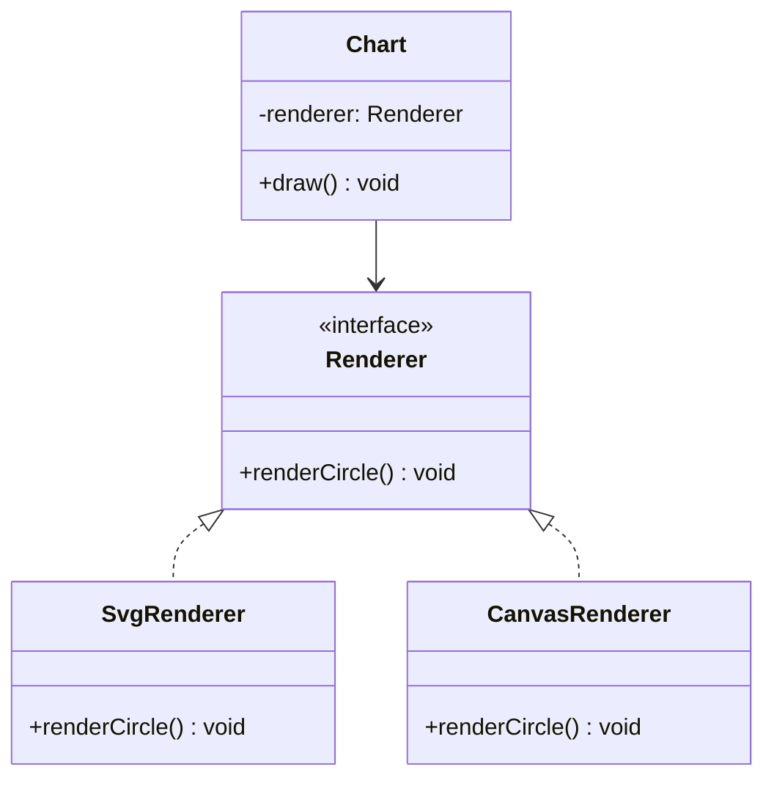

---
# Required
sidebar_position: 3
title: "Bridge Pattern — Separate Abstraction From Implementation"
description: >-
  Learn the Bridge pattern to decouple an abstraction from its implementation
  so both can evolve independently. Includes multi-language examples.

# SEO
keywords:
  - bridge pattern
  - bridge design pattern
  - abstraction implementation separation
  - when to use bridge

difficulty: intermediate
category: structural
related_solid: [OCP, DIP]

# Social sharing
og_title: "Bridge Pattern: Separate Abstraction From Implementation"
og_description: "Decouple abstractions so both sides can evolve independently."
og_image: "/img/social-card.svg"

# Content management
date_published: 2026-01-25
date_modified: 2026-01-25
author: shivam
reading_time: 12
content_type: explanation
---

# Bridge Pattern

<PatternMeta>
  <Difficulty level="intermediate" />
  <TimeToRead minutes={12} />
  <Prerequisites patterns={["Adapter"]} />
</PatternMeta>

> **Definition:** The Bridge pattern decouples an abstraction from its implementation so the two can vary independently.

---

## The Problem: Exploding Combinations

We once built a dashboard that rendered charts in both SVG and Canvas, and each chart needed to support light and dark themes. Without a bridge, the combinations multiplied into a messy inheritance tree.

**Bridge lets you mix and match without multiplying classes.**

---

## What Is the Bridge Pattern?

Bridge separates the high-level abstraction (the API clients use) from the low-level implementation. The abstraction holds a reference to the implementation, not a subclass relationship.

### Structure



### Key Components

- **Abstraction:** The high-level API.
- **Implementation:** The low-level details.
- **Bridge:** A reference from abstraction to implementation.

### SOLID Principles Connection

- **OCP:** Add new abstractions or implementations without changing existing code.
- **DIP:** Abstraction depends on an interface, not a concrete class.

---

## When to Use Bridge

- You have two dimensions of variability.
- Subclassing leads to a class explosion.
- You want to change implementation at runtime.

## When NOT to Use Bridge

- There is only one implementation.
- The abstraction and implementation are unlikely to evolve independently.
- The added indirection would confuse the team.

---

## Implementation

<CodeTabs>
  <TabItem value="python" label="Python">
    ```python
    class Renderer:
        def render_circle(self) -> str:
            raise NotImplementedError


    class SvgRenderer(Renderer):
        def render_circle(self) -> str:
            return "<svg>circle</svg>"


    class Chart:
        def __init__(self, renderer: Renderer) -> None:
            self.renderer = renderer

        def draw(self) -> str:
            return self.renderer.render_circle()
    ```
  </TabItem>
  <TabItem value="typescript" label="TypeScript">
    ```typescript
    interface Renderer {
      renderCircle(): string;
    }

    class SvgRenderer implements Renderer {
      renderCircle(): string {
        return "<svg>circle</svg>";
      }
    }

    class Chart {
      constructor(private renderer: Renderer) {}
      draw(): string {
        return this.renderer.renderCircle();
      }
    }
    ```
  </TabItem>
  <TabItem value="go" label="Go">
    ```go
    package charts

    type Renderer interface {
        RenderCircle() string
    }

    type SvgRenderer struct{}

    func (r SvgRenderer) RenderCircle() string {
        return "<svg>circle</svg>"
    }

    type Chart struct {
        renderer Renderer
    }

    func NewChart(r Renderer) Chart {
        return Chart{renderer: r}
    }

    func (c Chart) Draw() string {
        return c.renderer.RenderCircle()
    }
    ```
  </TabItem>
  <TabItem value="java" label="Java">
    ```java
    interface Renderer {
        String renderCircle();
    }

    class SvgRenderer implements Renderer {
        public String renderCircle() { return "<svg>circle</svg>"; }
    }

    class Chart {
        private final Renderer renderer;
        Chart(Renderer renderer) { this.renderer = renderer; }
        public String draw() { return renderer.renderCircle(); }
    }
    ```
  </TabItem>
  <TabItem value="csharp" label="C#">
    ```csharp
    public interface IRenderer
    {
        string RenderCircle();
    }

    public class SvgRenderer : IRenderer
    {
        public string RenderCircle() => "<svg>circle</svg>";
    }

    public class Chart
    {
        private readonly IRenderer _renderer;
        public Chart(IRenderer renderer) { _renderer = renderer; }
        public string Draw() => _renderer.RenderCircle();
    }
    ```
  </TabItem>
</CodeTabs>

---

## Real-World Example: Storage Backends

In infrastructure platforms, a storage abstraction might support S3, GCS, and a local filesystem. Bridge lets the API remain stable while storage backends evolve independently.

---

## Performance Considerations

| Aspect | Impact | Notes |
|--------|--------|-------|
| Memory | Low | One extra reference |
| Runtime | Low | Indirection on each call |
| Complexity | Medium | Two parallel class hierarchies |

---

## Testing This Pattern

Mock the renderer to verify the abstraction without depending on the implementation.

```python
class FakeRenderer(Renderer):
    def render_circle(self) -> str:
        return "fake"


def test_chart_draws() -> None:
    chart = Chart(FakeRenderer())
    assert chart.draw() == "fake"
```

---

## Common Mistakes

- Using Bridge when simple composition would work.
- Confusing Bridge with Adapter.
- Over-abstracting early.

---

## Related Patterns

| Pattern | Relationship |
|---------|--------------|
| Adapter | Translates interfaces; Bridge separates dimensions |
| Facade | Simplifies a subsystem rather than splitting it |
| Strategy | Swappable behavior within one dimension |

---

## Pattern Combinations

- **With Strategy:** Strategy picks the implementation at runtime.
- **With Abstract Factory:** Use a factory to assemble matched pairs.

---

## Try It Yourself

Build a notification system where channels (Email, SMS) are separate from formatting (Plain, HTML).

---

## Frequently Asked Questions

### Is Bridge just dependency injection?
DI wires dependencies; Bridge defines the split between abstraction and implementation.

### When does Bridge add too much overhead?
When there is only one implementation and no need for parallel evolution.

### Can I swap implementations at runtime?
Yes, that is one of the benefits.

### How do I test code using Bridge?
Mock the implementation interface and validate the abstraction in isolation.

---

## Key Takeaways

- **Bridge prevents class explosion across multiple dimensions.**
- **It allows abstraction and implementation to evolve independently.**
- **Use it when you see combinatorial growth.**

---

## Downloads

- Bridge Cheat Sheet (Coming soon)
- Complete Code Examples (Coming soon)
- Practice Exercises (Coming soon)

---

## Navigation

- **Previous:** [Adapter Pattern](/docs/design-patterns/structural/adapter)
- **Next:** [Composite Pattern](/docs/design-patterns/structural/composite)
