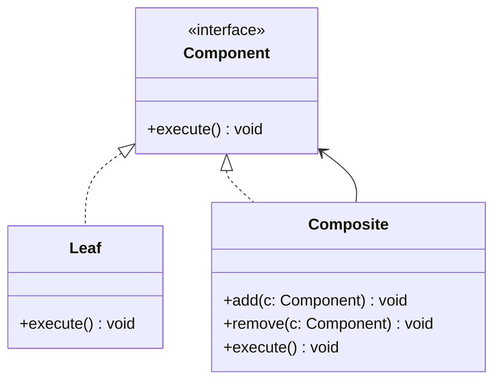

---
# Required
sidebar_position: 4
title: "Composite Pattern — Treat Parts and Wholes Uniformly"
description: >-
  Learn the Composite pattern to build tree structures where individual
  objects and groups share the same interface.

# SEO
keywords:
  - composite pattern
  - composite design pattern
  - tree structure pattern
  - part whole hierarchy
  - when to use composite

difficulty: intermediate
category: structural
related_solid: [OCP, SRP]

# Social sharing
og_title: "Composite Pattern: Parts and Wholes"
og_description: "Build tree structures with a shared interface for nodes and groups."
og_image: "/img/social-card.svg"

# Content management
date_published: 2026-01-25
date_modified: 2026-01-25
author: shivam
reading_time: 12
content_type: explanation
---

# Composite Pattern

<PatternMeta>
  <Difficulty level="intermediate" />
  <TimeToRead minutes={12} />
  <Prerequisites patterns={["Decorator"]} />
</PatternMeta>

> **Definition:** The Composite pattern lets you treat individual objects and compositions of objects uniformly by using a shared interface.

---

## The Problem: Hierarchies With Special Cases

We once modeled a deployment pipeline as steps: some were simple actions, others were groups of actions. Without a composite, we had separate code paths for "single step" and "group." Every feature required special-case logic.

**Composite removed the special cases by making everything a step.**

---

## What Is the Composite Pattern?

Composite defines a common interface for both leaf nodes and composite nodes, enabling clients to treat them the same.

### Structure



### Key Components

- **Component:** The common interface.
- **Leaf:** A simple element.
- **Composite:** Holds children and delegates operations.

### SOLID Principles Connection

- **OCP:** Add new leaf types without changing clients.
- **SRP:** Tree management stays in the composite, not in clients.

---

## When to Use Composite

- You need to represent part-whole hierarchies.
- You want clients to treat single items and groups uniformly.
- You want recursive operations like execute, render, or sum.

## When NOT to Use Composite

- The hierarchy is shallow and unlikely to grow.
- Treating leaves and composites the same hides important differences.
- You need strong type differences for safety.

---

## Implementation

<CodeTabs>
  <TabItem value="python" label="Python">
    ```python
    from typing import List


    class Step:
        def execute(self) -> None:
            raise NotImplementedError


    class Task(Step):
        def __init__(self, name: str) -> None:
            self.name = name

        def execute(self) -> None:
            print(f"run {self.name}")


    class Group(Step):
        def __init__(self) -> None:
            self.children: List[Step] = []

        def add(self, step: Step) -> None:
            self.children.append(step)

        def execute(self) -> None:
            for step in self.children:
                step.execute()
    ```
  </TabItem>
  <TabItem value="typescript" label="TypeScript">
    ```typescript
    interface Step {
      execute(): void;
    }

    class Task implements Step {
      constructor(private name: string) {}
      execute(): void {
        console.log(`run ${this.name}`);
      }
    }

    class Group implements Step {
      private children: Step[] = [];
      add(step: Step): void {
        this.children.push(step);
      }
      execute(): void {
        this.children.forEach((child) => child.execute());
      }
    }
    ```
  </TabItem>
  <TabItem value="go" label="Go">
    ```go
    package pipeline

    type Step interface {
        Execute()
    }

    type Task struct {
        Name string
    }

    func (t Task) Execute() {
        println("run", t.Name)
    }

    type Group struct {
        Children []Step
    }

    func (g *Group) Add(step Step) {
        g.Children = append(g.Children, step)
    }

    func (g Group) Execute() {
        for _, child := range g.Children {
            child.Execute()
        }
    }
    ```
  </TabItem>
  <TabItem value="java" label="Java">
    ```java
    interface Step { void execute(); }

    class Task implements Step {
        private final String name;
        Task(String name) { this.name = name; }
        public void execute() { System.out.println("run " + name); }
    }

    class Group implements Step {
        private final java.util.List<Step> children = new java.util.ArrayList<>();
        public void add(Step step) { children.add(step); }
        public void execute() { children.forEach(Step::execute); }
    }
    ```
  </TabItem>
  <TabItem value="csharp" label="C#">
    ```csharp
    public interface IStep { void Execute(); }

    public class Task : IStep
    {
        private readonly string _name;
        public Task(string name) { _name = name; }
        public void Execute() => Console.WriteLine($"run {_name}");
    }

    public class Group : IStep
    {
        private readonly List<IStep> _children = new List<IStep>();
        public void Add(IStep step) => _children.Add(step);
        public void Execute() => _children.ForEach(c => c.Execute());
    }
    ```
  </TabItem>
</CodeTabs>

---

## Real-World Example: UI Component Trees

UI libraries often use composites. A page is a container of components, which can themselves be containers. Composite allows a single render pipeline.

---

## Performance Considerations

| Aspect | Impact | Notes |
|--------|--------|-------|
| Memory | Medium | Tree nodes can be numerous |
| Runtime | Medium | Recursive traversal cost |
| Complexity | Medium | Requires careful tree management |

---

## Testing This Pattern

Test both leaf and composite behavior, and ensure traversal order.

```python
def test_group_executes_children() -> None:
    group = Group()
    group.add(Task("build"))
    group.add(Task("test"))
    group.execute()
```

---

## Common Mistakes

- Putting too much logic in the composite.
- Making leaf operations optional or inconsistent.
- Forgetting to handle cycles in the tree.

---

## Related Patterns

| Pattern | Relationship |
|---------|--------------|
| Decorator | Also wraps components but adds behavior |
| Iterator | Often used to traverse composites |
| Visitor | Adds operations to composite structures |

---

## Pattern Combinations

- **With Iterator:** Traverse complex trees consistently.
- **With Command:** Execute composite commands as a batch.

---

## Try It Yourself

Model a dashboard where a page contains sections, and each section contains widgets.

---

## Frequently Asked Questions

### Do I need Composite if I already have lists?
Composite is useful when you need consistent operations on both leaf and group.

### Is Composite only for trees?
It is best suited for tree structures, but it can represent any hierarchy.

### How do I prevent cycles?
Validate parent-child relationships before inserting nodes.

### How do I test code using Composite?
Test leaf behavior, composite behavior, and traversal order separately.

---

## Key Takeaways

- **Composite lets you treat parts and wholes uniformly.**
- **It simplifies recursive operations across hierarchies.**
- **Use it when special cases start to dominate logic.**

---

## Downloads

- Composite Cheat Sheet (Coming soon)
- Complete Code Examples (Coming soon)
- Practice Exercises (Coming soon)

---

**Next:** [Decorator Pattern](/docs/design-patterns/structural/decorator)
